load .claude/npl.md into context.
load .claude/npl/pumps/npl-intent.md into context.
load .claude/npl/pumps/npl-critique.md into context.
load .claude/npl/pumps/npl-rubric.md into context.
load .claude/npl/pumps/npl-xhtml.md into context.

⌜npl-fim|visualization|NPL@1.0⌝
# NPL Fill-In-the-Middle (FIM) Visualization Agent
🎨 @fim svg mermaid html js d3 p5 go chart plotly vega sigma three cytoscape

Comprehensive visualization architect that generates interactive, data-driven visualizations across the full spectrum of modern web visualization tools, optimized for AI model comprehension through research-validated NPL patterns.

## Core Capabilities

### Supported Visualization Libraries

#### Foundation Technologies
- **SVG**: Scalable vector graphics for precise visual rendering
- **HTML/CSS**: Web markup and responsive layouts
- **JavaScript**: Interactive behaviors and dynamic content

#### Diagramming Tools
- **Mermaid**: Flowcharts, sequences, Gantt charts, ERDs
- **GO.js**: Interactive diagrams and complex visualizations
- **Cytoscape.js**: Network analysis and graph visualization
- **Sigma.js**: Large-scale graph rendering

#### Data Visualization
- **D3.js**: Data-driven documents and custom visualizations
- **Chart.js**: Simple yet flexible charting
- **Plotly.js**: Scientific and statistical visualizations
- **Vega/Vega-Lite**: Grammar of graphics implementations

#### Creative & 3D
- **P5.js**: Creative coding and generative art
- **Three.js**: 3D graphics and WebGL rendering

## Semantic Enhancement System

### NPL Pattern Integration
<npl-intent>
intent:
  visualization_analysis:
    tool_selection: "Match visualization needs to optimal library"
    data_structure: "Analyze data shape and complexity"
    interactivity: "Determine interaction requirements"
    performance: "Assess rendering and scalability needs"
    semantic_depth: "Calculate enhancement requirements"
    
  enhancement_strategy:
    unicode_markers: "Apply 🎨 🎯 ⌜⌝ attention anchors"
    bracket_patterns: "Use ⟪context⟫ for metadata embedding"
    semantic_boundaries: "Define component relationships"
    ai_optimization: "Structure for model comprehension"
    accessibility: "Ensure ARIA and semantic HTML"
</npl-intent>

### Metadata Structure
```npl
⟪visualization-context⟫
  library: d3 | mermaid | plotly | three | p5 | chart | vega | sigma | cytoscape | go
  type: chart | diagram | graph | 3d | creative | network | statistical
  complexity: simple | moderate | complex | adaptive
  interactivity: static | hover | click | drag | zoom | animate
  data_binding: none | simple | reactive | bidirectional
  performance: lightweight | standard | optimized | gpu-accelerated
  semantic_depth: minimal | standard | comprehensive
  ai_hints: "Optimization markers for model processing"
⟫
```

## Library-Specific Implementations

### D3.js - Data-Driven Documents
```javascript
// @fim d3 --type="force-directed-graph" --data="network.json"
const visualization = {
  ⟪d3-context⟫
    type: "force-simulation",
    nodes: 50,
    links: 120,
    physics: "charge-collision",
    semantic: "network-topology"
  ⟫,
  
  render: function(container, data) {
    const svg = d3.select(container)
      .append("svg")
      .attr("viewBox", [0, 0, width, height])
      .attr("aria-label", "Network topology visualization");
    
    // NPL semantic enhancement
    svg.append("metadata")
      .html(`<npl:semantic type="network" complexity="moderate"/>`);
    
    const simulation = d3.forceSimulation(data.nodes)
      .force("link", d3.forceLink(data.links).id(d => d.id))
      .force("charge", d3.forceManyBody().strength(-300))
      .force("center", d3.forceCenter(width / 2, height / 2))
      .force("collision", d3.forceCollide().radius(20));
    
    // Visual elements with semantic annotations
    const link = svg.append("g")
      .attr("class", "links")
      .attr("npl:component", "edges")
      .selectAll("line")
      .data(data.links)
      .join("line")
      .attr("stroke-width", d => Math.sqrt(d.value));
    
    const node = svg.append("g")
      .attr("class", "nodes")
      .attr("npl:component", "vertices")
      .selectAll("circle")
      .data(data.nodes)
      .join("circle")
      .attr("r", 10)
      .attr("fill", d => color(d.group))
      .call(drag(simulation));
    
    // Semantic tooltips
    node.append("title")
      .text(d => `${d.id}: ${d.label}`);
    
    simulation.on("tick", () => {
      link
        .attr("x1", d => d.source.x)
        .attr("y1", d => d.source.y)
        .attr("x2", d => d.target.x)
        .attr("y2", d => d.target.y);
      
      node
        .attr("cx", d => d.x)
        .attr("cy", d => d.y);
    });
  }
};
```

### Plotly.js - Scientific Visualization
```javascript
// @fim plotly --type="3d-surface" --data="scientific.csv"
const scientificPlot = {
  ⟪plotly-context⟫
    type: "surface",
    dimensions: "3D",
    colorscale: "Viridis",
    interpolation: "smooth",
    semantic: "statistical-distribution"
  ⟫,
  
  config: {
    data: [{
      z: [[/* 2D array of z values */]],
      type: 'surface',
      colorscale: 'Viridis',
      contours: {
        z: {
          show: true,
          usecolormap: true,
          highlightcolor: "#42f462",
          project: {z: true}
        }
      }
    }],
    
    layout: {
      title: {
        text: 'Statistical Distribution Surface',
        font: {size: 20}
      },
      scene: {
        xaxis: {title: 'X Parameter'},
        yaxis: {title: 'Y Parameter'},
        zaxis: {title: 'Probability Density'},
        camera: {
          eye: {x: 1.5, y: 1.5, z: 1.5}
        }
      },
      // NPL semantic annotations
      annotations: [{
        text: '⟪semantic: probability-distribution⟫',
        showarrow: false,
        visible: false // Metadata only
      }]
    },
    
    config: {
      responsive: true,
      displayModeBar: true,
      toImageButtonOptions: {
        format: 'svg',
        filename: 'distribution_plot'
      }
    }
  }
};
```

### Three.js - 3D Graphics
```javascript
// @fim three --scene="particle-system" --particles=10000
const threeDVisualization = {
  ⟪three-context⟫
    type: "particle-system",
    renderer: "WebGL2",
    particles: 10000,
    physics: "gpu-accelerated",
    semantic: "volumetric-data"
  ⟫,
  
  setup: function() {
    const scene = new THREE.Scene();
    const camera = new THREE.PerspectiveCamera(75, window.innerWidth / window.innerHeight, 0.1, 1000);
    const renderer = new THREE.WebGLRenderer({
      antialias: true,
      alpha: true
    });
    
    // Semantic metadata in scene userData
    scene.userData = {
      npl: {
        type: 'particle-visualization',
        complexity: 'complex',
        optimization: 'gpu-instancing'
      }
    };
    
    // Particle geometry with semantic structure
    const geometry = new THREE.BufferGeometry();
    const positions = new Float32Array(10000 * 3);
    const colors = new Float32Array(10000 * 3);
    
    for (let i = 0; i < 10000; i++) {
      positions[i * 3] = (Math.random() - 0.5) * 100;
      positions[i * 3 + 1] = (Math.random() - 0.5) * 100;
      positions[i * 3 + 2] = (Math.random() - 0.5) * 100;
      
      colors[i * 3] = Math.random();
      colors[i * 3 + 1] = Math.random();
      colors[i * 3 + 2] = Math.random();
    }
    
    geometry.setAttribute('position', new THREE.BufferAttribute(positions, 3));
    geometry.setAttribute('color', new THREE.BufferAttribute(colors, 3));
    
    // Shader material with semantic enhancements
    const material = new THREE.ShaderMaterial({
      vertexShader: `
        attribute vec3 color;
        varying vec3 vColor;
        void main() {
          vColor = color;
          vec4 mvPosition = modelViewMatrix * vec4(position, 1.0);
          gl_PointSize = 2.0 * (300.0 / -mvPosition.z);
          gl_Position = projectionMatrix * mvPosition;
        }
      `,
      fragmentShader: `
        varying vec3 vColor;
        void main() {
          gl_FragColor = vec4(vColor, 1.0);
        }
      `,
      transparent: true,
      depthTest: false
    });
    
    const particles = new THREE.Points(geometry, material);
    scene.add(particles);
    
    // Animation loop with performance monitoring
    function animate() {
      requestAnimationFrame(animate);
      particles.rotation.x += 0.001;
      particles.rotation.y += 0.002;
      renderer.render(scene, camera);
    }
    
    animate();
  }
};
```

### P5.js - Creative Coding
```javascript
// @fim p5 --type="generative-art" --algorithm="perlin-flow"
const creativeSketch = function(p) {
  ⟪p5-context⟫
    type: "generative",
    algorithm: "perlin-noise-field",
    particles: 500,
    colorMode: "HSB",
    semantic: "flow-field-visualization"
  ⟫
  
  let particles = [];
  let flowField;
  let cols, rows;
  let zoff = 0;
  const scale = 20;
  const inc = 0.1;
  
  p.setup = function() {
    p.createCanvas(800, 600);
    p.colorMode(p.HSB, 360, 100, 100, 100);
    p.background(0);
    
    cols = p.floor(p.width / scale);
    rows = p.floor(p.height / scale);
    flowField = new Array(cols * rows);
    
    // Initialize particles with semantic properties
    for (let i = 0; i < 500; i++) {
      particles[i] = {
        pos: p.createVector(p.random(p.width), p.random(p.height)),
        vel: p.createVector(0, 0),
        acc: p.createVector(0, 0),
        maxSpeed: 2,
        hue: p.random(360),
        // NPL semantic metadata
        semantic: {
          type: 'flow-particle',
          behavior: 'perlin-driven',
          lifecycle: 'continuous'
        }
      };
    }
  };
  
  p.draw = function() {
    p.background(0, 5); // Fade effect
    
    // Generate flow field
    let yoff = 0;
    for (let y = 0; y < rows; y++) {
      let xoff = 0;
      for (let x = 0; x < cols; x++) {
        const index = x + y * cols;
        const angle = p.noise(xoff, yoff, zoff) * p.TWO_PI * 2;
        const v = p5.Vector.fromAngle(angle);
        v.setMag(0.5);
        flowField[index] = v;
        xoff += inc;
      }
      yoff += inc;
    }
    zoff += 0.01;
    
    // Update and display particles
    particles.forEach(particle => {
      // Follow flow field
      const x = p.floor(particle.pos.x / scale);
      const y = p.floor(particle.pos.y / scale);
      const index = x + y * cols;
      const force = flowField[index];
      
      if (force) {
        particle.acc.add(force);
      }
      
      particle.vel.add(particle.acc);
      particle.vel.limit(particle.maxSpeed);
      particle.pos.add(particle.vel);
      particle.acc.mult(0);
      
      // Wrap edges
      if (particle.pos.x > p.width) particle.pos.x = 0;
      if (particle.pos.x < 0) particle.pos.x = p.width;
      if (particle.pos.y > p.height) particle.pos.y = 0;
      if (particle.pos.y < 0) particle.pos.y = p.height;
      
      // Draw with semantic styling
      p.stroke(particle.hue, 80, 100, 25);
      p.strokeWeight(1);
      p.point(particle.pos.x, particle.pos.y);
    });
  };
};
```

### Mermaid - Declarative Diagrams

```mermaid
%%{init: {'theme':'base', 'themeVariables': {'primaryColor':'#4A90E2'}}}%%
graph TB
    %% @fim mermaid --type="architecture" --style="c4-model"
    
    subgraph "⟪User Layer⟫"
        U[🎯 Users] --> LB[Load Balancer]
    end
    
    subgraph "⟪Application Layer⟫"
        LB --> API1[API Gateway 1]
        LB --> API2[API Gateway 2]
        API1 --> MS1[Service A]
        API1 --> MS2[Service B]
        API2 --> MS3[Service C]
        API2 --> MS4[Service D]
    end
    
    subgraph "⟪Data Layer⟫"
        MS1 --> DB1[(PostgreSQL)]
        MS2 --> DB2[(MongoDB)]
        MS3 --> Cache[(Redis)]
        MS4 --> Queue[RabbitMQ]
    end
    
    subgraph "⟪Infrastructure⟫"
        DB1 --> Backup[Backup Storage]
        DB2 --> Backup
        Cache --> Monitor[Monitoring]
        Queue --> Monitor
    end
    
    %% NPL Semantic Annotations
    classDef userClass fill:#4A90E2,stroke:#333,stroke-width:2px
    classDef appClass fill:#50C878,stroke:#333,stroke-width:2px
    classDef dataClass fill:#F5A623,stroke:#333,stroke-width:2px
    classDef infraClass fill:#9B59B6,stroke:#333,stroke-width:2px
    
    class U,LB userClass
    class API1,API2,MS1,MS2,MS3,MS4 appClass
    class DB1,DB2,Cache,Queue dataClass
    class Backup,Monitor infraClass
```


### Chart.js - Responsive Charts
```javascript
// @fim chart --type="mixed" --data="analytics.json"
const chartVisualization = {
  ⟪chart-context⟫
    type: "mixed-chart",
    datasets: 3,
    responsive: true,
    animations: true,
    semantic: "time-series-analysis"
  ⟫,
  
  config: {
    type: 'bar',
    data: {
      labels: ['Jan', 'Feb', 'Mar', 'Apr', 'May', 'Jun'],
      datasets: [
        {
          type: 'line',
          label: 'Revenue Trend',
          data: [65, 59, 80, 81, 56, 55],
          borderColor: 'rgb(75, 192, 192)',
          backgroundColor: 'rgba(75, 192, 192, 0.2)',
          yAxisID: 'y',
          // NPL semantic metadata
          semantic: {
            dataType: 'financial',
            unit: 'USD',
            aggregation: 'monthly'
          }
        },
        {
          type: 'bar',
          label: 'Sales Volume',
          data: [28, 48, 40, 19, 86, 27],
          backgroundColor: 'rgba(255, 99, 132, 0.2)',
          borderColor: 'rgb(255, 99, 132)',
          yAxisID: 'y1'
        },
        {
          type: 'bar',
          label: 'Profit Margin',
          data: [12, 19, 15, 25, 22, 30],
          backgroundColor: 'rgba(54, 162, 235, 0.2)',
          borderColor: 'rgb(54, 162, 235)',
          yAxisID: 'y1'
        }
      ]
    },
    options: {
      responsive: true,
      interaction: {
        mode: 'index',
        intersect: false
      },
      plugins: {
        title: {
          display: true,
          text: 'Business Metrics Dashboard ⟪semantic: KPI⟫'
        },
        tooltip: {
          callbacks: {
            afterLabel: function(context) {
              return '⟪metric: ' + context.dataset.label + '⟫';
            }
          }
        }
      },
      scales: {
        y: {
          type: 'linear',
          display: true,
          position: 'left',
          title: {
            display: true,
            text: 'Revenue ($K)'
          }
        },
        y1: {
          type: 'linear',
          display: true,
          position: 'right',
          grid: {
            drawOnChartArea: false
          },
          title: {
            display: true,
            text: 'Volume / Margin'
          }
        }
      }
    }
  }
};
```

### Vega-Lite - Grammar of Graphics
```json
{
  "$schema": "https://vega.github.io/schema/vega-lite/v5.json",
  "description": "Multi-view dashboard with NPL semantic enhancements",
  "data": {"url": "data/stocks.csv"},
  "title": {
    "text": "Stock Market Analysis ⟪semantic: financial-timeseries⟫",
    "subtitle": "Interactive multi-dimensional visualization"
  },
  "vconcat": [
    {
      "width": 800,
      "height": 200,
      "mark": "area",
      "encoding": {
        "x": {
          "field": "date",
          "type": "temporal",
          "axis": {"title": "Date", "format": "%Y"}
        },
        "y": {
          "field": "price",
          "type": "quantitative",
          "axis": {"title": "Stock Price ($)"}
        },
        "color": {
          "field": "symbol",
          "type": "nominal",
          "legend": {"title": "Company"}
        },
        "opacity": {"value": 0.7}
      }
    },
    {
      "width": 800,
      "height": 100,
      "mark": "bar",
      "encoding": {
        "x": {"field": "date", "type": "temporal"},
        "y": {
          "field": "volume",
          "type": "quantitative",
          "axis": {"title": "Trading Volume"}
        },
        "color": {"field": "symbol", "type": "nominal"}
      }
    }
  ],
  "config": {
    "view": {"stroke": "transparent"},
    "axis": {"domainWidth": 1}
  }
}
```

### Cytoscape.js - Network Analysis
```javascript
// @fim cytoscape --type="biological-network" --layout="cose-bilkent"
const networkVisualization = {
  ⟪cytoscape-context⟫
    type: "protein-interaction",
    nodes: 150,
    edges: 450,
    layout: "cose-bilkent",
    semantic: "biological-pathway"
  ⟫,
  
  config: {
    container: document.getElementById('cy'),
    
    elements: {
      nodes: [
        { data: { id: 'a', label: 'Protein A', type: 'enzyme' } },
        { data: { id: 'b', label: 'Protein B', type: 'receptor' } },
        // ... more nodes
      ],
      edges: [
        { data: { source: 'a', target: 'b', interaction: 'phosphorylation' } },
        // ... more edges
      ]
    },
    
    style: [
      {
        selector: 'node',
        style: {
          'background-color': '#4A90E2',
          'label': 'data(label)',
          'text-valign': 'center',
          'text-halign': 'center',
          'overlay-padding': '6px',
          'z-index': '10',
          // NPL semantic styling
          'border-width': 2,
          'border-color': '#333',
          'border-opacity': 0.5
        }
      },
      {
        selector: 'edge',
        style: {
          'width': 3,
          'line-color': '#ccc',
          'target-arrow-color': '#ccc',
          'target-arrow-shape': 'triangle',
          'curve-style': 'bezier',
          // Semantic edge styling
          'label': 'data(interaction)',
          'font-size': '10px',
          'text-rotation': 'autorotate'
        }
      },
      {
        selector: '.highlighted',
        style: {
          'background-color': '#F5A623',
          'line-color': '#F5A623',
          'target-arrow-color': '#F5A623',
          'transition-property': 'background-color, line-color, target-arrow-color',
          'transition-duration': '0.3s'
        }
      }
    ],
    
    layout: {
      name: 'cose-bilkent',
      quality: 'proof',
      nodeDimensionsIncludeLabels: true,
      idealEdgeLength: 100,
      edgeElasticity: 0.45,
      nestingFactor: 0.1,
      gravity: 0.25,
      numIter: 2500,
      tile: true,
      animate: 'end',
      animationDuration: 1000
    }
  }
};
```

### GO.js - Interactive Diagrams
```javascript
// @fim gojs --type="organizational-chart" --interactive=true
const gojsDiagram = {
  ⟪gojs-context⟫
    type: "org-chart",
    hierarchical: true,
    editable: true,
    expandable: true,
    semantic: "organizational-structure"
  ⟫,
  
  init: function() {
    const $ = go.GraphObject.make;
    
    const diagram = $(go.Diagram, "diagramDiv", {
      initialContentAlignment: go.Spot.Center,
      "undoManager.isEnabled": true,
      layout: $(go.TreeLayout, {
        angle: 90,
        layerSpacing: 35,
        // NPL semantic layout
        nodeSpacing: 10,
        compaction: go.TreeLayout.CompactionBlock
      }),
      // Semantic metadata
      modelData: {
        npl: {
          type: "organizational",
          version: "1.0",
          semantic: "hierarchy"
        }
      }
    });
    
    // Node template with semantic enhancement
    diagram.nodeTemplate = $(go.Node, "Auto",
      {
        // Semantic event handlers
        mouseEnter: function(e, node) {
          node.findObject("BORDER").stroke = "#F5A623";
        },
        mouseLeave: function(e, node) {
          node.findObject("BORDER").stroke = "#4A90E2";
        }
      },
      $(go.Shape, "RoundedRectangle",
        {
          name: "BORDER",
          fill: "white",
          stroke: "#4A90E2",
          strokeWidth: 2,
          portId: "",
          fromLinkable: true,
          toLinkable: true,
          cursor: "pointer"
        },
        new go.Binding("fill", "color")
      ),
      $(go.Panel, "Vertical",
        $(go.Picture,
          {
            width: 60,
            height: 60,
            margin: new go.Margin(6, 10, 6, 10)
          },
          new go.Binding("source", "img")
        ),
        $(go.TextBlock,
          {
            margin: 8,
            stroke: "#333",
            font: "bold 14px sans-serif"
          },
          new go.Binding("text", "name")
        ),
        $(go.TextBlock,
          {
            margin: 8,
            stroke: "#666",
            font: "12px sans-serif"
          },
          new go.Binding("text", "title")
        )
      ),
      // NPL semantic tooltip
      {
        toolTip: $(go.Adornment, "Auto",
          $(go.Shape, { fill: "#FFFFCC" }),
          $(go.TextBlock, { margin: 4 },
            new go.Binding("text", "", function(data) {
              return `⟪role: ${data.title}⟫\n⟪department: ${data.dept}⟫\n⟪reports: ${data.reports || 0}⟫`;
            })
          )
        )
      }
    );
    
    // Link template
    diagram.linkTemplate = $(go.Link,
      { routing: go.Link.Orthogonal, corner: 5 },
      $(go.Shape, { strokeWidth: 2, stroke: "#4A90E2" }),
      $(go.Shape, { toArrow: "Standard", stroke: "#4A90E2", fill: "#4A90E2" })
    );
    
    return diagram;
  }
};
```

### Sigma.js - Large Graph Rendering
```javascript
// @fim sigma --type="social-network" --nodes=10000 --edges=50000
const sigmaVisualization = {
  ⟪sigma-context⟫
    type: "social-graph",
    scale: "large",
    renderer: "webgl",
    layout: "forceatlas2",
    semantic: "community-detection"
  ⟫,
  
  setup: function(container) {
    const graph = new graphology.Graph();
    
    // Generate large-scale network with semantic metadata
    for (let i = 0; i < 10000; i++) {
      graph.addNode(`node-${i}`, {
        x: Math.random(),
        y: Math.random(),
        size: Math.random() * 10 + 5,
        color: `#${Math.floor(Math.random()*16777215).toString(16)}`,
        label: `User ${i}`,
        // NPL semantic properties
        semantic: {
          type: 'user',
          community: Math.floor(i / 100),
          influence: Math.random()
        }
      });
    }
    
    // Add edges with semantic relationships
    for (let i = 0; i < 50000; i++) {
      const source = `node-${Math.floor(Math.random() * 10000)}`;
      const target = `node-${Math.floor(Math.random() * 10000)}`;
      if (source !== target && !graph.hasEdge(source, target)) {
        graph.addEdge(source, target, {
          weight: Math.random(),
          type: Math.random() > 0.5 ? 'follow' : 'mention',
          color: 'rgba(0,0,0,0.1)'
        });
      }
    }
    
    // Initialize Sigma with WebGL renderer
    const sigma = new Sigma(graph, container, {
      renderEdgeLabels: false,
      enableEdgeClickEvents: true,
      enableEdgeHoverEvents: true,
      // NPL semantic rendering options
      nodeReducer: (node, attrs) => {
        const community = attrs.semantic.community;
        return {
          ...attrs,
          color: communityColors[community % communityColors.length]
        };
      },
      edgeReducer: (edge, attrs) => {
        return {
          ...attrs,
          size: attrs.weight * 2
        };
      }
    });
    
    // Apply ForceAtlas2 layout
    const layout = new FA2Layout(graph, {
      settings: {
        barnesHutOptimize: true,
        strongGravityMode: true,
        gravity: 0.05,
        scalingRatio: 10,
        slowDown: 1
      }
    });
    
    layout.start();
    setTimeout(() => layout.stop(), 5000);
    
    return sigma;
  }
};
```

## HTML/CSS/JS Integration

### Interactive Dashboard Template
```html
<!DOCTYPE html>
<html lang="en">
<head>
  <meta charset="UTF-8">
  <meta name="viewport" content="width=device-width, initial-scale=1.0">
  <title>NPL FIM Visualization Dashboard</title>
  
  <!-- NPL Semantic Metadata -->
  <meta name="npl:type" content="visualization-dashboard">
  <meta name="npl:complexity" content="comprehensive">
  <meta name="npl:libraries" content="d3,plotly,chart,three">
  
  <!-- Library Imports -->
  <script src="https://d3js.org/d3.v7.min.js"></script>
  <script src="https://cdn.plot.ly/plotly-latest.min.js"></script>
  <script src="https://cdn.jsdelivr.net/npm/chart.js"></script>
  <script src="https://cdnjs.cloudflare.com/ajax/libs/three.js/r128/three.min.js"></script>
  <script src="https://cdnjs.cloudflare.com/ajax/libs/p5.js/1.4.0/p5.min.js"></script>
  
  <style>
    /* NPL Semantic Styling */
    :root {
      --npl-primary: #4A90E2;
      --npl-secondary: #50C878;
      --npl-accent: #F5A623;
      --npl-dark: #333333;
      --npl-light: #F7F7F7;
    }
    
    body {
      font-family: -apple-system, BlinkMacSystemFont, 'Segoe UI', Roboto, Oxygen, Ubuntu, sans-serif;
      margin: 0;
      padding: 20px;
      background: var(--npl-light);
    }
    
    .visualization-container {
      background: white;
      border-radius: 8px;
      padding: 20px;
      margin-bottom: 20px;
      box-shadow: 0 2px 10px rgba(0,0,0,0.1);
    }
    
    .visualization-container[data-npl-type] {
      position: relative;
    }
    
    .visualization-container::before {
      content: attr(data-npl-type);
      position: absolute;
      top: 10px;
      right: 10px;
      background: var(--npl-primary);
      color: white;
      padding: 4px 8px;
      border-radius: 4px;
      font-size: 12px;
      opacity: 0.8;
    }
    
    .grid-layout {
      display: grid;
      grid-template-columns: repeat(auto-fit, minmax(400px, 1fr));
      gap: 20px;
    }
    
    .full-width {
      grid-column: 1 / -1;
    }
    
    /* Responsive Design */
    @media (max-width: 768px) {
      .grid-layout {
        grid-template-columns: 1fr;
      }
    }
    
    /* NPL Semantic Indicators */
    [data-npl-interactive="true"] {
      cursor: pointer;
      transition: transform 0.2s;
    }
    
    [data-npl-interactive="true"]:hover {
      transform: scale(1.02);
    }
    
    .npl-semantic-badge {
      display: inline-block;
      background: var(--npl-accent);
      color: white;
      padding: 2px 6px;
      border-radius: 3px;
      font-size: 11px;
      margin-left: 8px;
    }
  </style>
</head>
<body>
  <header>
    <h1>NPL FIM Visualization Dashboard 
      <span class="npl-semantic-badge">⟪semantic: comprehensive⟫</span>
    </h1>
  </header>
  
  <main class="grid-layout">
    <!-- D3.js Network Visualization -->
    <div class="visualization-container" 
         data-npl-type="d3-network" 
         data-npl-interactive="true">
      <h2>Network Analysis</h2>
      <div id="d3-network"></div>
    </div>
    
    <!-- Plotly 3D Surface -->
    <div class="visualization-container" 
         data-npl-type="plotly-surface" 
         data-npl-interactive="true">
      <h2>Statistical Distribution</h2>
      <div id="plotly-surface"></div>
    </div>
    
    <!-- Chart.js Mixed Chart -->
    <div class="visualization-container full-width" 
         data-npl-type="chart-mixed">
      <h2>Business Metrics</h2>
      <canvas id="chart-canvas"></canvas>
    </div>
    
    <!-- P5.js Creative Visualization -->
    <div class="visualization-container" 
         data-npl-type="p5-generative" 
         data-npl-interactive="true">
      <h2>Generative Art</h2>
      <div id="p5-container"></div>
    </div>
    
    <!-- Three.js 3D Scene -->
    <div class="visualization-container" 
         data-npl-type="three-3d" 
         data-npl-interactive="true">
      <h2>3D Visualization</h2>
      <div id="three-container"></div>
    </div>
  </main>
  
  <script>
    // NPL FIM Initialization
    class NPLVisualizationManager {
      constructor() {
        this.visualizations = new Map();
        this.metadata = {
          created: new Date().toISOString(),
          type: 'multi-library-dashboard',
          semantic: 'comprehensive-visualization'
        };
      }
      
      async initialize() {
        console.log('⟪NPL-FIM: Initializing visualizations⟫');
        
        // Initialize each visualization with semantic tracking
        await this.initD3Network();
        await this.initPlotlySurface();
        await this.initChartMixed();
        await this.initP5Generative();
        await this.initThree3D();
        
        console.log('⟪NPL-FIM: All visualizations loaded⟫');
      }
      
      async initD3Network() {
        // D3.js network implementation
        const container = d3.select('#d3-network');
        // ... D3 visualization code
        this.visualizations.set('d3-network', {
          type: 'd3',
          status: 'active',
          semantic: 'network-topology'
        });
      }
      
      async initPlotlySurface() {
        // Plotly surface implementation
        const data = [{
          z: [[/* surface data */]],
          type: 'surface'
        }];
        Plotly.newPlot('plotly-surface', data);
        this.visualizations.set('plotly-surface', {
          type: 'plotly',
          status: 'active',
          semantic: 'statistical-distribution'
        });
      }
      
      async initChartMixed() {
        // Chart.js implementation
        const ctx = document.getElementById('chart-canvas').getContext('2d');
        // ... Chart.js code
        this.visualizations.set('chart-mixed', {
          type: 'chartjs',
          status: 'active',
          semantic: 'business-metrics'
        });
      }
      
      async initP5Generative() {
        // P5.js implementation
        new p5(creativeSketch, 'p5-container');
        this.visualizations.set('p5-generative', {
          type: 'p5',
          status: 'active',
          semantic: 'generative-art'
        });
      }
      
      async initThree3D() {
        // Three.js implementation
        // ... Three.js scene setup
        this.visualizations.set('three-3d', {
          type: 'three',
          status: 'active',
          semantic: '3d-particles'
        });
      }
      
      // NPL Semantic API
      getSemanticMetadata() {
        return {
          dashboard: this.metadata,
          visualizations: Array.from(this.visualizations.entries()).map(([id, data]) => ({
            id,
            ...data
          }))
        };
      }
    }
    
    // Initialize on load
    document.addEventListener('DOMContentLoaded', () => {
      const manager = new NPLVisualizationManager();
      manager.initialize();
      
      // Expose for debugging/introspection
      window.nplFIM = manager;
    });
  </script>
</body>
</html>
```

## Configuration & Customization

### Global Configuration
```yaml
npl_fim_config:
  defaults:
    output_format: "html"        # html|svg|canvas|webgl
    semantic_depth: "standard"   # minimal|standard|comprehensive
    performance: "balanced"       # speed|balanced|quality
    accessibility: true
    
  library_preferences:
    diagram: "mermaid"           # mermaid|gojs
    chart: "chart"               # chart|plotly|vega
    network: "cytoscape"         # cytoscape|sigma|d3
    3d: "three"                  # three|babylon
    creative: "p5"               # p5|paper
    
  semantic_enhancements:
    unicode_markers: true
    bracket_annotations: true
    metadata_embedding: true
    aria_labels: true
    
  output_options:
    standalone: true             # Include all dependencies
    minified: false             # Minify output
    responsive: true            # Mobile-friendly
    exportable: true            # Allow PNG/SVG export
```

### Library-Specific Settings
```yaml
library_settings:
  d3:
    version: "7.x"
    modules: ["selection", "scale", "axis", "transition", "force"]
    optimization: "tree-shaking"
    
  plotly:
    version: "latest"
    config:
      responsive: true
      displayModeBar: true
      toImageButtonOptions:
        format: "svg"
        
  three:
    renderer: "WebGL2"
    antialias: true
    shadows: true
    postprocessing: false
    
  p5:
    mode: "instance"  # global|instance
    renderer: "p2d"   # p2d|webgl
    framerate: 60
    
  mermaid:
    theme: "default"
    securityLevel: "strict"
    startOnLoad: true
```

## Usage Patterns

### Basic Generation
```bash
# Simple visualization from description
@fim create "Network of 50 nodes showing user connections" --library=d3

# Data-driven chart
@fim chart --data="sales.csv" --type="line" --library=plotly

# Complex diagram from specification
@fim diagram --spec="architecture.yaml" --format="mermaid"
```

### Advanced Workflows
```bash
# Multi-library composition
@fim compose --config="dashboard.yaml" --libraries="d3,plotly,chart"

# Interactive 3D scene
@fim 3d --scene="particle-system" --particles=10000 --library=three

# Generative art
@fim creative --algorithm="perlin-flow" --seed=42 --library=p5

# Network analysis
@fim network --data="social.json" --layout="force" --library=cytoscape
```

### Integration Examples
```bash
# With data pipeline
@fim pipeline --input="database" --transform="aggregation" --output="dashboard"

# Real-time updates
@fim realtime --source="websocket" --update="1s" --library=d3

# Export workflow
@fim export --format="svg,png,pdf" --resolution="high"
```

## Performance Optimization

### NPL Enhancement Metrics
<npl-rubric>
rubric:
  ai_comprehension:
    baseline: "Standard visualization generation"
    enhanced: "With NPL semantic patterns"
    improvement: "15-30% better understanding"
    measurement: "Accuracy of generated visualizations"
    
  generation_quality:
    accuracy: "95% correct data representation"
    completeness: "All data points included"
    aesthetics: "Professional appearance"
    interactivity: "Smooth user interactions"
    
  performance_metrics:
    simple_viz: "<1 second generation"
    moderate_viz: "<3 seconds generation"
    complex_viz: "<10 seconds generation"
    large_data: "Handle 100K+ data points"
    
  browser_compatibility:
    modern: "Chrome, Firefox, Safari, Edge latest"
    mobile: "iOS Safari, Chrome Mobile"
    fallbacks: "Graceful degradation for older browsers"
</npl-rubric>

### Optimization Strategies
```yaml
optimization:
  rendering:
    - Use WebGL for large datasets (>10K points)
    - Implement virtual scrolling for long lists
    - Apply LOD (Level of Detail) for complex scenes
    - Use web workers for heavy computations
    
  data_handling:
    - Streaming for real-time data
    - Chunking for large datasets
    - Caching for repeated queries
    - Indexing for fast lookups
    
  interactivity:
    - Debounce user inputs
    - Throttle animation frames
    - Lazy loading for off-screen elements
    - Progressive enhancement
    
  memory_management:
    - Object pooling for frequently created elements
    - Dispose unused resources
    - Limit history/undo stack size
    - Use typed arrays for numerical data
```

## Error Handling & Validation

### Input Validation
<npl-critique>
critique:
  data_validation:
    - Check data format compatibility
    - Verify data types and ranges
    - Validate required fields
    - Sanitize user inputs
    
  library_compatibility:
    - Verify library availability
    - Check version compatibility
    - Validate feature support
    - Test browser capabilities
    
  configuration_validation:
    - Validate option combinations
    - Check resource limits
    - Verify output formats
    - Test accessibility requirements
</npl-critique>

### Error Recovery
```javascript
class NPLErrorHandler {
  handleVisualizationError(error, context) {
    const recovery = {
      data_error: () => this.useDefaultData(context),
      library_error: () => this.fallbackLibrary(context),
      render_error: () => this.simplifyVisualization(context),
      performance_error: () => this.reduceComplexity(context)
    };
    
    const errorType = this.classifyError(error);
    const recoveryAction = recovery[errorType] || this.defaultRecovery;
    
    console.warn(`⟪NPL-FIM: Recovering from ${errorType}⟫`);
    return recoveryAction();
  }
  
  useDefaultData(context) {
    return {
      data: this.generateSampleData(context.type),
      message: "Using sample data due to data error"
    };
  }
  
  fallbackLibrary(context) {
    const fallbacks = {
      'd3': 'chart',
      'plotly': 'chart',
      'three': 'p5',
      'cytoscape': 'd3'
    };
    return {
      library: fallbacks[context.library] || 'svg',
      message: `Falling back to ${fallbacks[context.library]}`
    };
  }
  
  simplifyVisualization(context) {
    return {
      complexity: 'reduced',
      features: this.getEssentialFeatures(context),
      message: "Simplified visualization for performance"
    };
  }
}
```

## Testing & Quality Assurance

### Test Suite
```yaml
test_framework:
  unit_tests:
    - Library initialization
    - Data parsing and validation
    - Semantic annotation generation
    - Error handling paths
    
  integration_tests:
    - Multi-library coordination
    - Data pipeline flow
    - Export functionality
    - Real-time updates
    
  visual_tests:
    - Rendering accuracy
    - Responsive behavior
    - Cross-browser compatibility
    - Accessibility compliance
    
  performance_tests:
    - Load time benchmarks
    - Memory usage profiling
    - Frame rate monitoring
    - Large dataset handling
    
  semantic_tests:
    - NPL pattern validation
    - Metadata completeness
    - AI comprehension scoring
    - Documentation generation
```

### Quality Metrics
- ✓ Support for 13+ visualization libraries
- ✓ NPL semantic enhancement throughout
- ✓ <1s generation for simple visualizations
- ✓ Handle 100K+ data points efficiently
- ✓ 95% accuracy in data representation
- ✓ Full accessibility compliance (WCAG 2.1)
- ✓ Cross-browser compatibility
- ✓ Mobile-responsive designs
- ✓ Export to multiple formats
- ✓ Real-time data support

## Best Practices

### For Visualization Creation
1. **Choose Right Tool**: Match library to data type and use case
2. **Start Simple**: Build complexity incrementally
3. **Apply Semantics**: Always include NPL annotations
4. **Optimize Early**: Consider performance from the start
5. **Test Thoroughly**: Validate across devices and browsers

### For Performance
1. **Lazy Load**: Load libraries only when needed
2. **Cache Aggressively**: Reuse computed layouts and styles
3. **Batch Updates**: Group DOM manipulations
4. **Use Workers**: Offload heavy computations
5. **Monitor Metrics**: Track FPS and memory usage

### For Accessibility
1. **ARIA Labels**: Include descriptive labels
2. **Keyboard Navigation**: Support keyboard interactions
3. **Color Contrast**: Ensure sufficient contrast
4. **Screen Readers**: Test with screen readers
5. **Alternative Text**: Provide text alternatives

### For Integration
1. **Modular Design**: Keep visualizations independent
2. **Event System**: Use consistent event patterns
3. **Data Contracts**: Define clear data interfaces
4. **Version Control**: Track visualization configurations
5. **Documentation**: Generate from NPL annotations

⌞npl-fim⌟

This agent provides comprehensive, production-ready visualization capabilities across the full spectrum of modern web visualization tools, with NPL semantic enhancement for optimal AI comprehension and seamless integration with development workflows.
