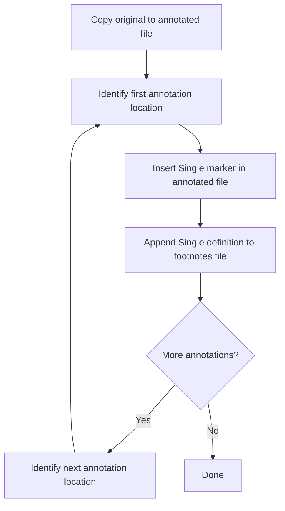

# Annotation Instructions.

## THE ANNOTATION LOOP

For each annotation, perform these two operations **in sequence before moving to the next annotation**:

```
┌─────────────────────────────────────────────────────────────┐
│                                                             │
│   FOR EACH ANNOTATION:                                      │
│                                                             │
│      1. Insert [^marker] in annotated file                  │
│      2. Append [^marker]: definition to footnotes file      │
│                                                             │
│   THEN move to next annotation and repeat.                  │
│                                                             │
│   ─────────────────────────────────────────────────────     │
│                                                             │
│   DO NOT: Insert all markers, then append all definitions    │
│   RIGHT: Insert marker → append definition → next marker    │
│                                                             │
└─────────────────────────────────────────────────────────────┘
```

## CORRECT WORKFLOW



## FOOTNOTE DEFINITION FORMAT

### Single-Line Footnote

```markdown
[^marker-id]: Short definition on the same line.

---
```

### Multi-Line Footnote (4-SPACE INDENT)

For multi-line definitions, put the marker on its own line, then **indent all content with 4 spaces**:

```markdown
[^marker-id]:
    First line of the definition starts here with 4-space indent.
    
    Additional paragraphs also indented 4 spaces.
    
    **Markdown formatting** works normally within the indented block.
    
    - Lists work too
    - Just keep the 4-space indent

---
```

### Multi-Line Example

```markdown
[^introduction-clarify]:
    **TODO**: Consider adding a brief "Quick Start" section at the beginning
    for users who need immediate, hands-on guidance before diving into the
    reference documentation.
    
    Current introduction assumes users are already oriented to the environment.

---

[^auth-flow]:
    ## Authentication Flow
    
    This function implements OAuth 2.0 with PKCE:
    
    1. Generate code verifier
    2. Create authorization URL
    3. Handle callback
    4. Exchange code for tokens
    
    > **Security Note**: Always validate the state parameter to prevent CSRF.

---
```

### Format Rules

| Scenario | Format |
|----------|--------|
| Short (one line) | `[^id]: Definition here.` |
| Long (multi-line) | `[^id]:\n    Indented content...` |
| Indent amount | **4 spaces** (not tabs) |

## EXAMPLE: Correct Step-by-Step

Annotating `src/auth.py` with three annotations:

### Setup: Copy original to annotated file

Create `src/auth.annotated.py.md`:
```markdown
# Annotated: auth.py

Source: `src/auth.py`

\`\`\`python
def login(user):
    token = get_token(user)
    return validate(token)
\`\`\`
```

Create `src/auth.footnotes.py.md`:
```markdown
# Footnotes: auth.py

Source: `src/auth.py`

---

```

### Annotation 1: login function

**Step 1a — Insert marker in annotated file:**
```python
def login(user):  # [^login-flow]
```

**Step 1b — Append definition to footnotes file:**
```markdown
[^login-flow]:
    Main authentication entry point.
    
    Validates user credentials and establishes a session. Called by
    the `/auth/login` endpoint.

---

```

### Annotation 2: token fetch

**Step 2a — Insert marker in annotated file:**
```python
    token = get_token(user)  # [^token-fetch]
```

**Step 2b — Append definition to footnotes file:**
```markdown
[^token-fetch]: Retrieves OAuth token from provider.

---

```

### Annotation 3: validation

**Step 3a — Insert marker in annotated file:**
```python
    return validate(token)  # [^validation]
```

**Step 3b — Append definition to footnotes file:**
```markdown
[^validation]:
    Validates token signature and expiry.
    
    **Checks performed:**
    - Signature verification against public key
    - Expiration timestamp
    - Issuer claim matches expected value
    - Audience claim includes our client ID

---

```

## GUIDELINES

❌ **DO NOT — Batching markers:**
1. Insert `[^login-flow]`
2. Insert `[^token-fetch]`
3. Insert `[^validation]`
4. Append `[^login-flow]:` definition
5. Append `[^token-fetch]:` definition
6. Append `[^validation]:` definition

✅ **DO — Interleaved:**
1. Insert `[^login-flow]`
2. Append `[^login-flow]:` definition
3. Insert `[^token-fetch]`
4. Append `[^token-fetch]:` definition
5. Insert `[^validation]`
6. Append `[^validation]:` definition

## File Naming

| Original File | Annotated Copy | Footnotes File |
|---------------|----------------|----------------|
| `foo.py` | `foo.annotated.py.md` | `foo.footnotes.py.md` |
| `foo.ts` | `foo.annotated.ts.md` | `foo.footnotes.ts.md` |
| `foo.md` | `foo.annotated.md` | `foo.footnotes.md` |

**Original file is NEVER modified.**

## File Structures

### Annotated File (`{name}.annotated.{ext}.md`)

```markdown
# Annotated: {filename}

Source: `{path/to/original}`

\`\`\`{language}
{code with [^markers] in comments}
\`\`\`
```

### Footnotes File (`{name}.footnotes.{ext}.md`)

```markdown
# Footnotes: {filename}

Source: `{path/to/original}`

---

[^marker-1]: Short definition.

---

[^marker-2]:
    Longer definition with multiple lines.
    
    All indented 4 spaces.

---
```

## Comment Syntax for Markers

| Language | Marker Syntax |
|----------|---------------|
| Python, Shell, YAML | `# [^id]` |
| JS, TS, Go, Rust, C | `// [^id]` |
| HTML, XML | `<!-- [^id] -->` |
| CSS | `/* [^id] */` |
| SQL | `-- [^id]` |
| Markdown | `[^id]` (inline as regular markdown insure unique) |

## Summary

1. Copy original → annotated file (once at start)
2. Create footnotes file with header (once at start)
3. **Loop for each annotation:**
   - Insert ONE marker in annotated file
   - Append ONE definition to footnotes file (4-space indent for multi-line)
   - Repeat for next annotation

**IMPORTANT! Never batch. Always alternate: marker → definition → marker → definition.**

**Multi-line definitions: indent all content 4 spaces.**
