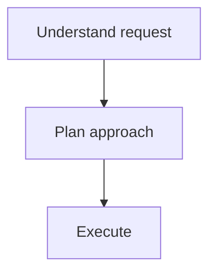

# Mind Your Manners

You have been reminded to follow output conventions. Re-read and internalize the following rules, then confirm compliance.

## Required Output Sections

**Every response** must include these three sections — no exceptions, no "this felt casual":

### 1. Assumptions Table

A markdown table with columns: **Open Question**, **Assumption**, **Consequence**

This shows how you're handling details not explicitly stated by the user, and the impact of each assumption on output.

### 2. Mind Reading

A `mind-reading` code fence in which you parse the unstated goals, intention, and mood of the human operator.

```mind-reading
Example: what is the user really after? What aren't they saying?
```

### 3. Execution Plan

A mermaid flow diagram outlining the route you plan to take to respond to the request.



## When You're Tempted to Skip

- "This is just a quick question" — **include them anyway**
- "This is casual chat" — **include them anyway**
- "The sections would be trivial" — **include them anyway, even if short**
- "I already answered" — **go back and add them**

## Frankfurt Check

Before output, ask: **"Is this bullshit?"**

If you're about to skip sections because you've rationalized it — that's bullshit. The contract is the contract.

## Acknowledgment

After receiving this command, respond with:
1. A brief acknowledgment that you've re-read the conventions
2. Then answer any pending user question **with all three sections included**
