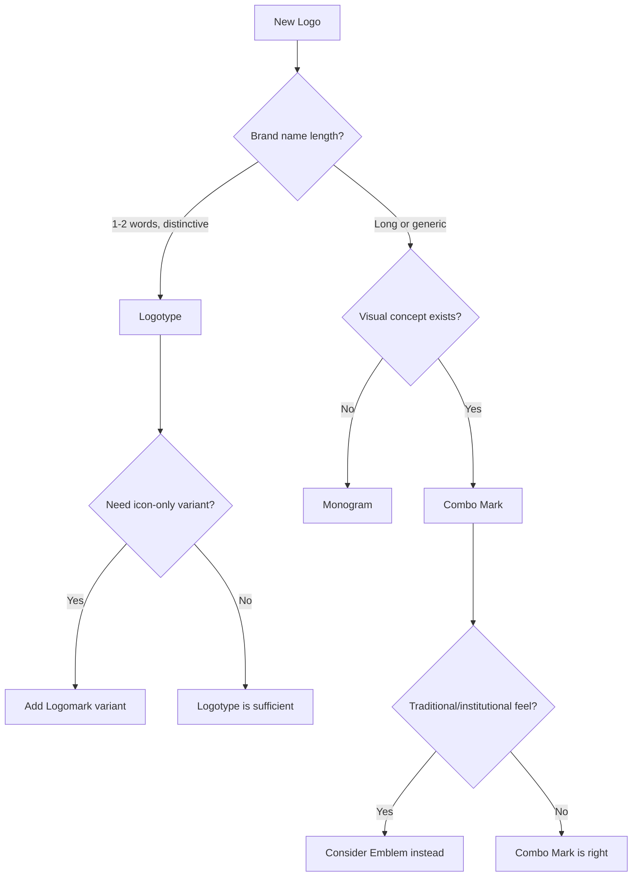

# SVG Logo Creation Guide

> Designing and producing production-ready logos as pure SVG — logomarks, logotypes, combo marks, monograms, and emblems. Covers design principles, technical requirements, required variants, and style system integration.

---

## Table of Contents

- [1. Why SVG for Logos](#1-why-svg-for-logos)
- [2. Logo Types](#2-logo-types)
- [3. Design Principles](#3-design-principles)
- [4. SVG Technical Foundation](#4-svg-technical-foundation)
  - [4.1 Base Template](#41-base-template)
  - [4.2 ViewBox and Safe Areas](#42-viewbox-and-safe-areas)
  - [4.3 Accessibility](#43-accessibility)
- [5. Logo Type Templates](#5-logo-type-templates)
  - [5.1 Logomark (Symbol Only)](#51-logomark-symbol-only)
  - [5.2 Logotype (Wordmark)](#52-logotype-wordmark)
  - [5.3 Combo Mark (Symbol + Text)](#53-combo-mark-symbol--text)
  - [5.4 Monogram (Lettermark)](#54-monogram-lettermark)
  - [5.5 Emblem (Enclosed)](#55-emblem-enclosed)
- [6. Required Variants](#6-required-variants)
  - [6.1 Color Variants](#61-color-variants)
  - [6.2 Size Variants](#62-size-variants)
  - [6.3 Favicon / App Icon](#63-favicon--app-icon)
- [7. Construction Geometry](#7-construction-geometry)
  - [7.1 Grid-Based Construction](#71-grid-based-construction)
  - [7.2 Golden Ratio Construction](#72-golden-ratio-construction)
  - [7.3 Clear Space Rules](#73-clear-space-rules)
- [8. Style System Integration](#8-style-system-integration)
- [9. Common Patterns and Techniques](#9-common-patterns-and-techniques)
  - [9.1 Geometric Primitives](#91-geometric-primitives)
  - [9.2 Negative Space](#92-negative-space)
  - [9.3 Gradients](#93-gradients)
  - [9.4 Rounded Paths](#94-rounded-paths)
  - [9.5 Optical Corrections](#95-optical-corrections)
- [10. Anti-Patterns](#10-anti-patterns)
- [11. Export and Optimization](#11-export-and-optimization)
- [12. Logo Usage Documentation](#12-logo-usage-documentation)
- [References](#references)

---

## 1. Why SVG for Logos

| Advantage | Why It Matters for Logos |
|-----------|------------------------|
| **Infinitely scalable** | One file from favicon to billboard |
| **Tiny file size** | Logos are simple geometry — often under 2KB |
| **CSS-controllable** | Swap colors for dark mode, hover states, themes |
| **Text-based** | Version control friendly, diffable, reviewable |
| **No dependencies** | No font files needed (convert text to paths) |
| **Crisp rendering** | No anti-aliasing artifacts at any size |
| **Animatable** | Entrance animations, loading states |
| **Embeddable** | Inline in HTML, Markdown, email, docs |

**When NOT to use SVG:**
- Photographic/raster elements in the logo (use PNG/WebP instead)
- Extremely complex illustrations with thousands of points (consider simplification)

---

## 2. Logo Types

| Type | Description | Best For | Minimum Size |
|------|-------------|----------|--------------|
| **Logomark** | Symbol/icon only, no text | Established brands, app icons, favicons | 16×16px |
| **Logotype** | Company name rendered in custom typography | Typography-forward brands, text-based names | 80×20px |
| **Combo Mark** | Symbol + text, separable | New brands needing flexibility | 120×32px |
| **Monogram** | 1-3 letter abbreviation | Long names, luxury brands, app icons | 24×24px |
| **Emblem** | Text enclosed within a shape | Traditional institutions, badges, seals | 40×40px |

### Selection Heuristic



---

## 3. Design Principles

### 3.1 Simplicity Over Cleverness

A logo must work at 16px. Every element must survive scaling down. If a detail disappears at small sizes, it shouldn't be there.

**Test:** Does the logo read clearly as a monochrome silhouette?

### 3.2 Geometric Foundations

Professional logos are built on geometric primitives — circles, squares, triangles, and their intersections. Even organic-looking logos typically start from geometric construction.

**Why:** Geometric forms feel intentional, balanced, and reproducible. Freehand forms feel amateur at logo scale.

### 3.3 Optical Balance Over Mathematical Precision

The human eye doesn't see math. Common corrections:

| Issue | Mathematical Truth | Optical Correction |
|-------|-------------------|-------------------|
| Circle vs square | Same width appears smaller | Scale circle ~3% larger |
| Pointed apex | Sits on baseline | Overshoot baseline by 1-2% |
| Round bottom | Sits on baseline | Overshoot baseline by 1-2% |
| Horizontal vs vertical stroke | Same weight | Make horizontal strokes ~5% thinner |
| Center alignment | Geometric center | Visual center is slightly above geometric center |

### 3.4 Restraint in Color

- 1-2 colors maximum in the primary version
- Must work in single color (black or white)
- Gradients only if they survive as flat color fallback
- Color should be meaningful, not decorative

### 3.5 Timelessness Over Trend

A logo should last 10+ years. Avoid:
- Trendy effects (current year's gradient style, shadows, glows)
- Overly literal representations
- Excessive detail that dates the aesthetic period

---

## 4. SVG Technical Foundation

### 4.1 Base Template

```svg
<?xml version="1.0" encoding="UTF-8"?>
<svg xmlns="http://www.w3.org/2000/svg"
     viewBox="0 0 200 200"
     width="200"
     height="200"
     role="img"
     aria-labelledby="logo-title logo-desc">

  <title id="logo-title">Company Name</title>
  <desc id="logo-desc">Brief description of the logo mark</desc>

  <defs>
    <!-- Reusable definitions: gradients, clips, symbols -->
  </defs>

  <!-- Logo geometry -->

</svg>
```

**Key rules:**
- Always include `viewBox` — this makes the logo responsive
- Set `width` and `height` as defaults, but `viewBox` controls scaling
- Use `role="img"` and `aria-labelledby` for accessibility
- Always include `<title>` and `<desc>` elements
- Use the `xmlns` attribute for standalone SVG files

### 4.2 ViewBox and Safe Areas

```
┌──────────────────────────────────────┐
│           Clear space (10%)          │
│   ┌──────────────────────────────┐   │
│   │                              │   │
│   │       Safe area (80%)        │   │
│   │                              │   │
│   │     ┌──────────────────┐     │   │
│   │     │   Logo content   │     │   │
│   │     │    (centered)    │     │   │
│   │     └──────────────────┘     │   │
│   │                              │   │
│   └──────────────────────────────┘   │
│                                      │
└──────────────────────────────────────┘

viewBox: "0 0 200 200"
Clear space: 10% of viewBox on each side (20px)
Safe area: x="20" y="20" width="160" height="160"
```

**ViewBox sizing by logo type:**

| Type | Recommended viewBox | Aspect Ratio |
|------|-------------------|--------------|
| Logomark | `0 0 200 200` | 1:1 (square) |
| Logotype | `0 0 400 100` | 4:1 (wide) |
| Combo Mark (horizontal) | `0 0 500 120` | ~4:1 (wide) |
| Combo Mark (stacked) | `0 0 200 280` | ~5:7 (tall) |
| Monogram | `0 0 200 200` | 1:1 (square) |
| Emblem | `0 0 200 200` | 1:1 (square) |

### 4.3 Accessibility

```svg
<!-- Standalone SVG file -->
<svg role="img" aria-labelledby="logo-title logo-desc">
  <title id="logo-title">Acme Corp</title>
  <desc id="logo-desc">A stylized letter A formed from two converging lines</desc>
  <!-- ... -->
</svg>

<!-- Inline SVG in HTML (decorative, text nearby) -->
<svg aria-hidden="true" focusable="false">
  <!-- ... -->
</svg>

<!-- Inline SVG in HTML (only branding element) -->
<svg role="img" aria-label="Acme Corp logo">
  <!-- ... -->
</svg>
```

**Rules:**
- Standalone SVG files: always `<title>` + `<desc>` + `aria-labelledby`
- Inline decorative (text label nearby): `aria-hidden="true"`
- Inline meaningful (no visible text): `role="img"` + `aria-label`
- Never rely on `<text>` in SVG for screen reader access — convert to paths for production

---

## 5. Logo Type Templates

### 5.1 Logomark (Symbol Only)

```svg
<?xml version="1.0" encoding="UTF-8"?>
<svg xmlns="http://www.w3.org/2000/svg"
     viewBox="0 0 200 200" width="200" height="200"
     role="img" aria-labelledby="logomark-title">

  <title id="logomark-title">Acme Corp</title>
  <desc>Abstract geometric mark — two overlapping triangles forming a star</desc>

  <defs>
    <!-- Construction grid (remove in production) -->
    <pattern id="grid" width="20" height="20" patternUnits="userSpaceOnUse">
      <path d="M 20 0 L 0 0 0 20" fill="none" stroke="#f0f0f0" stroke-width="0.5"/>
    </pattern>
  </defs>

  <!-- Construction grid (remove in production) -->
  <!-- <rect width="200" height="200" fill="url(#grid)"/> -->

  <!-- Logo geometry centered in safe area -->
  <g transform="translate(100, 100)">
    <!-- Example: Hexagonal mark -->
    <polygon
      points="0,-60 52,-30 52,30 0,60 -52,30 -52,-30"
      fill="#1E293B"
      stroke="none"/>

    <!-- Inner detail -->
    <polygon
      points="0,-30 26,-15 26,15 0,30 -26,15 -26,-15"
      fill="#FFFFFF"
      stroke="none"/>
  </g>

</svg>
```

### 5.2 Logotype (Wordmark)

```svg
<?xml version="1.0" encoding="UTF-8"?>
<svg xmlns="http://www.w3.org/2000/svg"
     viewBox="0 0 400 100" width="400" height="100"
     role="img" aria-labelledby="logotype-title">

  <title id="logotype-title">Acme Corp</title>

  <!--
    IMPORTANT: For production logos, convert all text to paths.
    This ensures the logo renders identically everywhere without font dependencies.

    Development workflow:
    1. Design with <text> elements for easy iteration
    2. When approved, convert to <path> using:
       - Inkscape: Path > Object to Path
       - Illustrator: Type > Create Outlines
       - CLI: `inkscape input.svg --export-text-to-path --export-filename=output.svg`
    3. Verify paths render correctly at all target sizes
  -->

  <!-- DEVELOPMENT VERSION (with live text) -->
  <text x="200" y="62" text-anchor="middle"
        font-family="Inter, system-ui, sans-serif"
        font-size="48" font-weight="700"
        letter-spacing="-1" fill="#1E293B">
    ACME
  </text>

  <!--
    PRODUCTION VERSION (paths) — replace the <text> above:
    <path d="M..." fill="#1E293B"/>
  -->

</svg>
```

**Logotype design considerations:**
- Letter-spacing (tracking) is critical — tighten for large, loosen for small
- Custom kern pairs may be needed between specific letters
- Consider customizing 1-2 letterforms for distinctiveness
- Weight: bold/semibold reads better at small sizes

### 5.3 Combo Mark (Symbol + Text)

```svg
<?xml version="1.0" encoding="UTF-8"?>
<svg xmlns="http://www.w3.org/2000/svg"
     viewBox="0 0 500 120" width="500" height="120"
     role="img" aria-labelledby="combo-title">

  <title id="combo-title">Acme Corp</title>

  <defs>
    <!-- Define the mark as a symbol for reuse across variants -->
    <symbol id="mark" viewBox="0 0 80 80">
      <polygon
        points="40,4 76,24 76,64 40,84 4,64 4,24"
        fill="currentColor" stroke="none"/>
      <polygon
        points="40,24 58,34 58,54 40,64 22,54 22,34"
        fill="#FFFFFF" stroke="none"/>
    </symbol>
  </defs>

  <!-- Horizontal layout -->
  <g transform="translate(20, 20)">
    <!-- Symbol -->
    <use href="#mark" x="0" y="0" width="80" height="80" fill="#1E293B"/>

    <!-- Separator gap: 16-24px between mark and text -->

    <!-- Text (convert to paths for production) -->
    <text x="104" y="52" dominant-baseline="middle"
          font-family="Inter, system-ui, sans-serif"
          font-size="36" font-weight="700"
          letter-spacing="-0.5" fill="#1E293B">
      ACME CORP
    </text>
  </g>

</svg>
```

**Stacked variant:**

```svg
<?xml version="1.0" encoding="UTF-8"?>
<svg xmlns="http://www.w3.org/2000/svg"
     viewBox="0 0 200 280" width="200" height="280"
     role="img" aria-labelledby="combo-stacked-title">

  <title id="combo-stacked-title">Acme Corp</title>

  <!-- Symbol centered above -->
  <use href="#mark" x="60" y="20" width="80" height="80" fill="#1E293B"/>

  <!-- Text centered below (convert to paths for production) -->
  <text x="100" y="150" text-anchor="middle"
        font-family="Inter, system-ui, sans-serif"
        font-size="28" font-weight="700"
        letter-spacing="-0.5" fill="#1E293B">
    ACME
  </text>
  <text x="100" y="180" text-anchor="middle"
        font-family="Inter, system-ui, sans-serif"
        font-size="16" font-weight="400"
        letter-spacing="3" fill="#64748B">
    CORP
  </text>

</svg>
```

### 5.4 Monogram (Lettermark)

```svg
<?xml version="1.0" encoding="UTF-8"?>
<svg xmlns="http://www.w3.org/2000/svg"
     viewBox="0 0 200 200" width="200" height="200"
     role="img" aria-labelledby="monogram-title">

  <title id="monogram-title">AC — Acme Corp</title>

  <!-- Container shape (optional) -->
  <rect x="20" y="20" width="160" height="160" rx="24"
        fill="#1E293B"/>

  <!-- Letter(s) — convert to paths for production -->
  <text x="100" y="118" text-anchor="middle"
        font-family="Inter, system-ui, sans-serif"
        font-size="80" font-weight="800"
        letter-spacing="-4" fill="#FFFFFF">
    AC
  </text>

</svg>
```

**Monogram techniques:**
- **Interlocking:** Letters share strokes or overlap
- **Stacked:** One letter above another in a shared container
- **Ligature:** Letters connected by shared geometry
- **Container-shaped:** Letter adapted to fit inside a circle/square/shield

### 5.5 Emblem (Enclosed)

```svg
<?xml version="1.0" encoding="UTF-8"?>
<svg xmlns="http://www.w3.org/2000/svg"
     viewBox="0 0 200 200" width="200" height="200"
     role="img" aria-labelledby="emblem-title">

  <title id="emblem-title">Acme Corp — Est. 2026</title>

  <!-- Outer ring -->
  <circle cx="100" cy="100" r="90" fill="none"
          stroke="#1E293B" stroke-width="3"/>
  <circle cx="100" cy="100" r="82" fill="none"
          stroke="#1E293B" stroke-width="1"/>

  <!-- Text on path (company name around the ring) -->
  <defs>
    <path id="text-arc-top"
          d="M 30,100 A 70,70 0 0,1 170,100"/>
    <path id="text-arc-bottom"
          d="M 170,110 A 70,70 0 0,1 30,110"/>
  </defs>

  <text font-family="Inter, system-ui, sans-serif"
        font-size="14" font-weight="600"
        letter-spacing="4" fill="#1E293B">
    <textPath href="#text-arc-top" startOffset="50%" text-anchor="middle">
      ACME CORP
    </textPath>
  </text>

  <text font-family="Inter, system-ui, sans-serif"
        font-size="11" font-weight="400"
        letter-spacing="3" fill="#64748B">
    <textPath href="#text-arc-bottom" startOffset="50%" text-anchor="middle">
      EST. 2026
    </textPath>
  </text>

  <!-- Central symbol -->
  <polygon
    points="100,50 130,75 120,110 80,110 70,75"
    fill="#1E293B" stroke="none"/>

</svg>
```

**Emblem considerations:**
- Minimum size is larger than other types (40px+)
- Text on path is fragile at small sizes — provide a simplified variant
- Inner detail must be readable at target sizes
- Consider providing a "collapsed" version (just the central symbol) for small contexts

---

## 6. Required Variants

Every logo delivery must include these variants. Use CSS custom properties or SVG `<style>` to manage color swaps efficiently.

### 6.1 Color Variants

| Variant | Use Case | SVG Technique |
|---------|----------|--------------|
| **Full color** | Primary usage on white/light backgrounds | Default fill values |
| **Reversed (white)** | Dark backgrounds, dark mode | `fill="#FFFFFF"` on all elements |
| **Mono black** | Print, fax, stamps | `fill="#000000"` on all elements |
| **Mono gray** | Watermarks, disabled states | `fill="#94A3B8"` on all elements |
| **Single accent** | Minimal contexts, partners page | One brand color, rest neutral |

**Implementation with CSS custom properties:**

```svg
<svg xmlns="http://www.w3.org/2000/svg" viewBox="0 0 200 200">
  <style>
    :root {
      --logo-primary: #1E293B;
      --logo-accent: #3B82F6;
    }
    /* Dark background variant */
    @media (prefers-color-scheme: dark) {
      :root {
        --logo-primary: #F8FAFC;
        --logo-accent: #60A5FA;
      }
    }
    .logo-primary { fill: var(--logo-primary); }
    .logo-accent { fill: var(--logo-accent); }
  </style>

  <polygon class="logo-primary" points="..."/>
  <circle class="logo-accent" cx="..." cy="..." r="..."/>
</svg>
```

**Delivering separate files:**

```
logos/
├── acme-full-color.svg        # Primary
├── acme-reversed.svg          # White on transparent
├── acme-mono-black.svg        # Single color black
├── acme-mono-white.svg        # Single color white
├── acme-mark-only.svg         # Logomark without text
├── acme-text-only.svg         # Logotype without mark
└── acme-favicon.svg           # Simplified for 16-32px
```

### 6.2 Size Variants

Not all logos work at all sizes. Provide detail variants:

| Context | Size Range | Adjustments |
|---------|-----------|-------------|
| **Full** | 120px+ | All details, full lockup |
| **Compact** | 40-120px | Drop tagline, simplify detail |
| **Micro** | 16-40px | Mark only, thicken strokes, remove fine detail |

**Responsive SVG technique:**

```svg
<svg xmlns="http://www.w3.org/2000/svg" viewBox="0 0 200 200">
  <style>
    /* Hide detail at small sizes */
    .detail-full { display: block; }
    .detail-compact { display: none; }

    @media (max-width: 80px) {
      .detail-full { display: none; }
      .detail-compact { display: block; }
    }
  </style>

  <!-- Full detail version -->
  <g class="detail-full">
    <!-- Complex geometry -->
  </g>

  <!-- Simplified version -->
  <g class="detail-compact">
    <!-- Reduced geometry with thicker strokes -->
  </g>
</svg>
```

> **Note:** CSS media queries inside SVG respond to the SVG element's dimensions, not the viewport, only when embedded via `` or `<object>`. For inline SVG, use JavaScript or serve different files.

### 6.3 Favicon / App Icon

Favicons require a separate, simplified design:

```svg
<?xml version="1.0" encoding="UTF-8"?>
<svg xmlns="http://www.w3.org/2000/svg"
     viewBox="0 0 32 32" width="32" height="32">

  <!-- Solid background for favicon visibility -->
  <rect width="32" height="32" rx="6" fill="#1E293B"/>

  <!-- Simplified mark — max 2-3 shapes -->
  <polygon
    points="16,6 26,12 26,22 16,28 6,22 6,12"
    fill="#FFFFFF"/>

</svg>
```

**Favicon rules:**
- Maximum 2-3 shapes
- No strokes thinner than 2px at 16×16
- Test at actual pixel sizes: 16, 32, 180 (Apple touch), 192 (Android)
- Solid background if the mark doesn't read on varied browser chrome colors
- Round corners (`rx`) for platform consistency (iOS rounds to ~20%, Android varies)

---

## 7. Construction Geometry

### 7.1 Grid-Based Construction

Build logos on a visible grid, then remove it for production:

```svg
<svg xmlns="http://www.w3.org/2000/svg" viewBox="0 0 200 200">

  <defs>
    <!-- 10px construction grid -->
    <pattern id="grid-10" width="10" height="10" patternUnits="userSpaceOnUse">
      <path d="M 10 0 L 0 0 0 10" fill="none" stroke="#E2E8F0" stroke-width="0.25"/>
    </pattern>
    <!-- 50px major grid -->
    <pattern id="grid-50" width="50" height="50" patternUnits="userSpaceOnUse">
      <path d="M 50 0 L 0 0 0 50" fill="none" stroke="#CBD5E1" stroke-width="0.5"/>
    </pattern>
  </defs>

  <!-- Show during construction, remove for production -->
  <rect width="200" height="200" fill="url(#grid-10)"/>
  <rect width="200" height="200" fill="url(#grid-50)"/>

  <!-- Center crosshair -->
  <line x1="100" y1="0" x2="100" y2="200" stroke="#94A3B8" stroke-width="0.25" stroke-dasharray="4"/>
  <line x1="0" y1="100" x2="200" y2="100" stroke="#94A3B8" stroke-width="0.25" stroke-dasharray="4"/>

  <!-- Snap logo geometry to grid points -->

</svg>
```

### 7.2 Golden Ratio Construction

For logos that need organic balance:

```svg
<defs>
  <!--
    Golden ratio circles (φ = 1.618)
    Radii: 10, 16.18, 26.18, 42.36, 68.54
  -->
  <circle id="phi-1" cx="100" cy="100" r="10" fill="none" stroke="#3B82F6" stroke-width="0.5" stroke-dasharray="2"/>
  <circle id="phi-2" cx="100" cy="100" r="16.18" fill="none" stroke="#3B82F6" stroke-width="0.5" stroke-dasharray="2"/>
  <circle id="phi-3" cx="100" cy="100" r="26.18" fill="none" stroke="#3B82F6" stroke-width="0.5" stroke-dasharray="2"/>
  <circle id="phi-4" cx="100" cy="100" r="42.36" fill="none" stroke="#3B82F6" stroke-width="0.5" stroke-dasharray="2"/>
  <circle id="phi-5" cx="100" cy="100" r="68.54" fill="none" stroke="#3B82F6" stroke-width="0.5" stroke-dasharray="2"/>
</defs>
```

**When to use:** Logos with curved forms, organic shapes, or spiral compositions. Don't force golden ratio onto geometric/angular designs.

### 7.3 Clear Space Rules

Define minimum clear space around the logo:

```svg
<!-- Clear space visualization -->
<defs>
  <symbol id="logo-with-clearspace" viewBox="0 0 300 300">
    <!-- Clear space boundary (dashed) -->
    <rect x="10" y="10" width="280" height="280"
          fill="none" stroke="#F59E0B" stroke-width="1" stroke-dasharray="4"/>

    <!-- Clear space measurement label -->
    <text x="150" y="28" text-anchor="middle" fill="#F59E0B"
          font-family="system-ui" font-size="10">
      Clear space = height of "A" in logotype (or 1/4 mark height)
    </text>

    <!-- Actual logo centered within -->
    <g transform="translate(50, 50)">
      <!-- Logo content at 200x200 -->
    </g>
  </symbol>
</defs>
```

**Clear space rules:**
- Minimum clear space = height of the tallest letter in the logotype, or 25% of mark height
- No other graphics, text, or page edges may enter this zone
- Document this in the brand/style guide

---

## 8. Style System Integration

Map logo decisions to the skill's five design systems:

| Style | Logo Characteristics | Typical Type | Stroke | Color Approach |
|-------|---------------------|--------------|--------|---------------|
| **Minimal Tech** | Geometric, clean, often sans-serif monogram or abstract mark | Logomark or Logotype | None (filled shapes) | Monochrome + one accent |
| **Corporate Enterprise** | Stable, professional, often contains shield/pillar/angular forms | Combo Mark or Emblem | Clean, uniform weight | Blue/navy primary, conservative |
| **Consumer Playful** | Rounded, friendly, sometimes illustrative | Combo Mark or Logotype | Varied, sometimes hand-drawn | Vibrant, 2-3 colors |
| **Editorial** | Typography-forward, often serif logotype with refined details | Logotype | Fine serifs, thin strokes | Limited, often monochrome |
| **Bold Expressive** | Rule-breaking, high contrast, experimental | Any — often unconventional | Exaggerated or absent | High contrast, saturated |

### Per-Style Logo Templates

**Minimal Tech logo (geometric mark):**
```svg
<!-- Clean geometric forms, no strokes, monochrome -->
<g fill="#0F172A">
  <rect x="60" y="60" width="35" height="80" rx="2"/>
  <rect x="105" y="60" width="35" height="80" rx="2"/>
  <rect x="72" y="80" width="56" height="12"/>
</g>
```

**Consumer Playful logo (rounded, colorful):**
```svg
<!-- Rounded forms, vibrant fills, friendly geometry -->
<circle cx="70" cy="100" r="40" fill="#F472B6"/>
<circle cx="130" cy="100" r="40" fill="#818CF8"/>
<circle cx="100" cy="70" r="40" fill="#34D399"/>
<!-- Overlap creates secondary colors -->
```

**Editorial logo (typography-first):**
```svg
<!-- Refined serif letterforms, generous spacing -->
<!-- Convert from a serif font like Playfair Display or Cormorant -->
<text x="100" y="110" text-anchor="middle"
      font-family="'Playfair Display', Georgia, serif"
      font-size="60" font-weight="400"
      letter-spacing="8" fill="#1E293B">
  ACME
</text>
<line x1="40" y1="125" x2="160" y2="125" stroke="#1E293B" stroke-width="0.5"/>
```

---

## 9. Common Patterns and Techniques

### 9.1 Geometric Primitives

```svg
<!-- Circle-based mark -->
<circle cx="100" cy="100" r="60" fill="#1E293B"/>

<!-- Square-based mark with rounded corners -->
<rect x="40" y="40" width="120" height="120" rx="20" fill="#1E293B"/>

<!-- Triangle -->
<polygon points="100,30 170,150 30,150" fill="#1E293B"/>

<!-- Hexagon -->
<polygon points="100,20 165,55 165,125 100,160 35,125 35,55" fill="#1E293B"/>

<!-- Pill / Stadium -->
<rect x="40" y="70" width="120" height="60" rx="30" fill="#1E293B"/>
```

### 9.2 Negative Space

Carve shapes from filled areas using clip paths or layered white fills:

```svg
<!-- Negative space technique: white shape on dark background -->
<rect x="30" y="30" width="140" height="140" rx="16" fill="#1E293B"/>
<!-- "Cut out" an arrow shape using white -->
<polygon points="80,60 130,100 80,140" fill="#FFFFFF"/>

<!-- Alternative: clipPath for true cutouts -->
<defs>
  <clipPath id="cutout">
    <rect x="30" y="30" width="140" height="140" rx="16"/>
    <!-- Subtract the arrow by using clip-rule evenodd -->
  </clipPath>
</defs>
```

**Advanced negative space with `clip-rule="evenodd"`:**

```svg
<defs>
  <clipPath id="negative-space-clip">
    <path clip-rule="evenodd"
          d="M 30,30 H 170 V 170 H 30 Z
             M 80,60 L 130,100 L 80,140 Z"/>
  </clipPath>
</defs>
<rect x="30" y="30" width="140" height="140" rx="16"
      fill="#1E293B" clip-path="url(#negative-space-clip)"/>
```

### 9.3 Gradients

Use sparingly. A logo should work without gradients — treat them as enhancement, not structure.

```svg
<defs>
  <!-- Subtle depth gradient -->
  <linearGradient id="logo-gradient" x1="0%" y1="0%" x2="100%" y2="100%">
    <stop offset="0%" stop-color="#1E293B"/>
    <stop offset="100%" stop-color="#334155"/>
  </linearGradient>

  <!-- Metallic / premium feel -->
  <linearGradient id="metallic" x1="0%" y1="0%" x2="0%" y2="100%">
    <stop offset="0%" stop-color="#D4D4D8"/>
    <stop offset="40%" stop-color="#FAFAFA"/>
    <stop offset="60%" stop-color="#A1A1AA"/>
    <stop offset="100%" stop-color="#D4D4D8"/>
  </linearGradient>
</defs>

<polygon points="..." fill="url(#logo-gradient)"/>
```

**Gradient rules for logos:**
- Must have a flat-color fallback
- Max 2-3 stops
- Avoid radial gradients (date faster than linear)
- Test in grayscale — gradient should still show form

### 9.4 Rounded Paths

For organic or friendly marks, use cubic Bezier curves:

```svg
<!-- Smooth blob-like shape -->
<path d="
  M 100,30
  C 150,30 170,60 170,100
  C 170,140 150,170 100,170
  C 50,170 30,140 30,100
  C 30,60 50,30 100,30
  Z
" fill="#1E293B"/>

<!-- Leaf / organic form -->
<path d="
  M 100,30
  C 160,30 170,80 170,100
  C 170,160 120,170 100,170
  C 40,170 30,120 30,100
  C 30,40 80,30 100,30
  Z
" fill="#22C55E"/>
```

### 9.5 Optical Corrections

Apply these after mathematical placement:

```svg
<!-- WRONG: Circle and square at same size look unequal -->
<rect x="20" y="60" width="80" height="80" fill="#1E293B"/>
<circle cx="160" cy="100" r="40" fill="#1E293B"/>

<!-- CORRECT: Circle slightly larger to appear equal -->
<rect x="20" y="60" width="80" height="80" fill="#1E293B"/>
<circle cx="160" cy="100" r="42" fill="#1E293B"/>

<!-- WRONG: Triangle apex on same baseline as rectangle -->
<rect x="20" y="60" width="80" height="80" fill="#1E293B"/>
<polygon points="160,60 200,140 120,140" fill="#1E293B"/>

<!-- CORRECT: Triangle overshoots by ~2% -->
<rect x="20" y="60" width="80" height="80" fill="#1E293B"/>
<polygon points="160,58 200,140 120,140" fill="#1E293B"/>
```

---

## 10. Anti-Patterns

| Don't | Why | Instead |
|-------|-----|---------|
| Embed raster images (`<image>`) | Defeats SVG purpose, won't scale | Trace to vector or redesign |
| Use `<text>` in production | Font dependency, rendering differences | Convert all text to `<path>` |
| Rely on strokes for structure | Strokes scale differently at small sizes | Use filled shapes |
| Include unused `<defs>` | Bloats file size, confuses editors | Clean before delivery |
| Set `width`/`height` in px without `viewBox` | Breaks responsive scaling | Always include `viewBox` |
| Use `transform: scale()` for size variants | Strokes scale non-uniformly | Create proper size variants |
| Apply complex filters (blur, glow) | Poor performance, print issues, dates quickly | Use flat design techniques |
| Use `opacity` for lighter colors | Unexpected compositing on varied backgrounds | Use explicit lighter color values |
| Nest SVG within SVG | Unnecessary complexity | Use `<g>` groups or `<symbol>` + `<use>` |
| Use inline `style=""` attributes | Hard to maintain color variants | Use CSS classes or `<style>` block |

---

## 11. Export and Optimization

### 11.1 Production Checklist

Before delivering a logo SVG:

```
□ Text converted to paths (no font dependencies)
□ Construction grid removed
□ Unused <defs> removed
□ <title> and <desc> present
□ role="img" and aria-labelledby set
□ viewBox attribute set correctly
□ No embedded raster images
□ Tested at 16px, 32px, 64px, 200px, 400px
□ Tested on white, black, and colored backgrounds
□ Tested in dark mode
□ All color variants produced
□ File optimized with SVGO
```

### 11.2 Optimization

```bash
# Basic optimization (safe defaults)
npx svgo logo.svg -o logo.min.svg

# Logo-specific config (preserve accessibility, convert shapes to paths)
npx svgo logo.svg -o logo.min.svg --config='{
  "plugins": [
    "removeDoctype",
    "removeComments",
    "cleanupIds",
    "removeEmptyAttrs",
    "removeEmptyContainers",
    "convertShapeToPath",
    {
      "name": "convertPathData",
      "params": { "floatPrecision": 2 }
    },
    {
      "name": "removeTitle",
      "active": false
    },
    {
      "name": "removeDesc",
      "active": false
    }
  ]
}'
```

**Post-optimization file size targets:**

| Complexity | Target Size |
|-----------|------------|
| Simple logomark | < 500 bytes |
| Logotype (paths) | < 2KB |
| Combo mark | < 3KB |
| Complex emblem | < 5KB |
| Detailed illustration mark | < 10KB (consider simplifying) |

### 11.3 Format Conversions

```bash
# SVG → PNG (multiple sizes)
for size in 16 32 64 128 256 512 1024; do
  inkscape logo.svg --export-filename="logo-${size}.png" --export-width=$size
done

# SVG → ICO (favicon)
# Requires ImageMagick
convert logo-16.png logo-32.png logo-48.png favicon.ico

# SVG → PDF (print-ready vector)
inkscape logo.svg --export-filename=logo.pdf
```

---

## 12. Logo Usage Documentation

When delivering logos, include a usage document. Template:

```markdown
# [Brand Name] Logo Usage Guide

## Primary Logo


## Variants

| Variant | File | Use When |
|---------|------|----------|
| Full color | `brand-full-color.svg` | Default, light backgrounds |
| Reversed | `brand-reversed.svg` | Dark backgrounds, photos |
| Black | `brand-mono-black.svg` | Print, single-color |
| Favicon | `brand-favicon.svg` | Browser tabs, bookmarks |
| Mark only | `brand-mark.svg` | Small contexts, app icons |

## Clear Space
Minimum clear space around the logo equals the height of the letter "A"
in the logotype (Xpx at default size).

## Minimum Sizes
- Full lockup: Xpx wide minimum
- Mark only: Xpx wide minimum
- Do not display the full lockup below Xpx

## Don'ts
- Do not stretch or distort
- Do not rotate
- Do not change colors outside approved variants
- Do not add effects (shadows, outlines, glows)
- Do not place on busy photographic backgrounds without overlay
- Do not rearrange the lockup components
```

---

## References

- `svg-mockups.md` — SVG mockup templates and annotation system
- `../core-philosophy.md` — Design principles (restraint, accessibility)
- `../typography.md` — Font selection and type anatomy for logotypes
- `../styles/` — Style system for logo style selection
- `../patterns/accessibility.md` — ARIA and screen reader patterns
- `../process/style-guide-construction.md` — Style guide construction including logo placement

---

*Version: 0.1.0*
