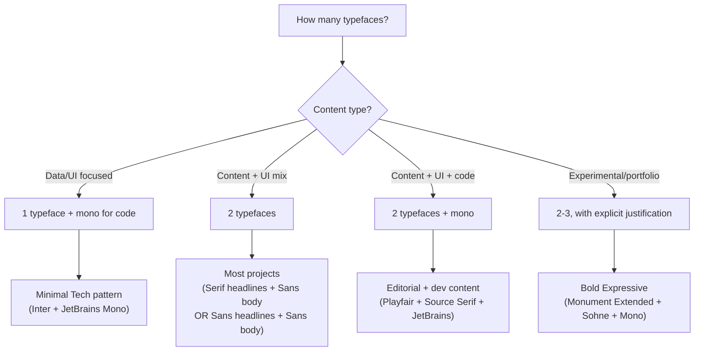

# Typography Fundamentals Reference

> The style specs tell you WHAT fonts to use. This document tells you WHY. Foundational typographic principles that explain the reasoning behind every font choice, spacing decision, and hierarchy pattern in the five design systems.

Read this before building a style guide or making typography decisions. It provides the decision frameworks that the style specs assume you already know.

---

## Table of Contents

- [1. Why Typography Matters in Interface Design](#1-why-typography-matters-in-interface-design)
- [2. Typeface Anatomy](#2-typeface-anatomy)
- [3. Typeface Classification](#3-typeface-classification)
- [4. Serif vs Sans-Serif — The Real Decision](#4-serif-vs-sans-serif--the-real-decision)
- [5. Spacing — Kerning, Tracking, and Letter-Spacing](#5-spacing--kerning-tracking-and-letter-spacing)
- [6. Leading (Line-Height) Theory](#6-leading-line-height-theory)
- [7. Font Pairing Methodology](#7-font-pairing-methodology)
- [8. Typographic Scale and Modular Scale](#8-typographic-scale-and-modular-scale)
- [9. Weight Hierarchy](#9-weight-hierarchy)
- [10. Type as Brand Signal](#10-type-as-brand-signal)
- [11. Variable Fonts and Optical Sizing](#11-variable-fonts-and-optical-sizing)
- [12. OpenType Features](#12-opentype-features)
- [13. Font Loading and Performance](#13-font-loading-and-performance)
- [14. Accessibility in Typography](#14-accessibility-in-typography)
- [15. Language and Script Considerations](#15-language-and-script-considerations)

### Scope

This document does NOT:
- Recommend specific fonts per style (see `styles/*.md`)
- Provide type scale tables per style (see `styles/*.md`)
- Cover fluid `clamp()` implementation (see `patterns/responsive.md`)
- Cover WCAG testing procedures (see `patterns/accessibility.md`)

It explains the principles that make all of the above work.

---

## 1. Why Typography Matters in Interface Design

Roughly 95% of web content is text. Typography is not decoration applied on top of a design — it IS the design. Before a user reads a single word, the typeface, size, weight, and spacing have already communicated: who made this, who it's for, and whether it's worth their time.

Every typographic choice is a signal:
- **Font selection** signals brand personality and audience expectation
- **Size hierarchy** signals information importance and reading order
- **Weight contrast** signals what to read first and what to skip
- **Spacing** signals density, formality, and reading pace
- **Measure (line length)** signals whether this is meant to be read or scanned

The five style specs in this skill (`styles/*.md`) make specific typographic choices for specific contexts. This document explains the principles behind those choices so you can:
1. Understand why each spec chose what it did
2. Deviate intelligently when brand requirements conflict
3. Make typography decisions for contexts the specs don't cover

---

## 2. Typeface Anatomy

Understanding letter anatomy is not academic — it directly affects design decisions. The shape of letters determines how large you need to set them, how much space they need between lines, and whether they'll work at the sizes your interface requires.

### Letter Structure

```
                    ┌─── Ascender line
                    │
         d          │
         d          │
  x-height ──► x   d   x        ◄── Cap-height (often ≈ ascender)
                x d   x
                 x     x
  Baseline ──►  ──────────────
                    p
                    p          ◄── Descender line
                    p
```

### Key Metrics and Their Design Impact

**x-height** — The height of lowercase letters without ascenders or descenders (the letter 'x'). This is the single most important metric for readability and perceived size.

| x-height | Effect | Example Fonts | Best For |
|-----------|--------|--------------|----------|
| Tall (large ratio to cap-height) | Appears larger at same point size; more readable at small sizes; denser text blocks | Inter, Roboto, SF Pro | UI text, body copy, small sizes, data-heavy interfaces |
| Short (small ratio to cap-height) | Appears smaller; more elegant; needs larger setting | Garamond, Didot, Playfair Display | Display sizes, editorial headlines, luxury contexts |

**Counters** — The enclosed or partially enclosed spaces within letters (the hole in 'o', the bowl of 'a').

| Counter Type | Effect | Example |
|-------------|--------|---------|
| Open counters | More legible, especially at small sizes | Frutiger, Inter — the 'e' aperture is wide |
| Closed counters | More geometric, more stylized | Futura — the 'a' is a perfect circle + stem |

**Stroke contrast** — The variation between thick and thin strokes within a single letter.

| Stroke Contrast | Effect | Classification |
|----------------|--------|---------------|
| Uniform (none) | Feels modern, mechanical, clean | Geometric sans (Futura), Grotesque sans |
| Moderate | Feels refined, readable, balanced | Humanist sans (Inter), Transitional serif (Georgia) |
| High | Feels dramatic, elegant, fragile at small sizes | Didone serif (Bodoni), Modern serif |

**Ascender/descender length** — Directly affects how much line-height (leading) a typeface needs. Long descenders on 'g', 'p', 'y' require more space between lines to prevent collisions.

---

## 3. Typeface Classification

Every typeface belongs to a classification that carries inherent visual signals. Knowing the classification system helps you understand why a font "feels" a certain way and predict whether it will work in a given context.

### Serif Classifications

| Classification | Characteristics | Signal | Example Fonts | Style Spec Usage |
|---------------|----------------|--------|--------------|-----------------|
| **Old-style** | Low contrast, angled stress, bracketed serifs | Warm, traditional, literary, timeless | Garamond, Palatino, Bembo | — (too ornate for most UI) |
| **Transitional** | Higher contrast, vertical stress, refined serifs | Authority, versatility, established | Georgia, Baskerville, Times New Roman | Corporate Enterprise (headings) |
| **Didone / Modern** | Extreme contrast, hairline serifs, vertical stress | Drama, fashion, luxury, display-only | Bodoni, Didot, Playfair Display | Editorial (display headlines) |
| **Slab** | Uniform stroke, block serifs, sturdy | Strong, attention-grabbing, grounded | Rockwell, Clarendon, Roboto Slab | — (niche; headlines, branding) |

**When to use serif**: Long-form reading (body text in editorial), authority signaling (corporate headings), content-first design where typography IS the visual interest.

### Sans-Serif Classifications

| Classification | Characteristics | Signal | Example Fonts | Style Spec Usage |
|---------------|----------------|--------|--------------|-----------------|
| **Grotesque** | Irregular proportions, utilitarian | Workmanlike, newsprint, industrial | Akzidenz-Grotesk, Franklin Gothic | — (less common in digital) |
| **Neo-grotesque** | Uniform, neutral, "invisible" | Professional, safe, ubiquitous | Helvetica, Arial, Neue Haas Grotesk | Bold Expressive (Sohne) |
| **Geometric** | Based on geometric shapes, circular 'o' | Modern, clean, tech, precise | Futura, Poppins, Avenir, Space Grotesk | Minimal Tech (geometric clarity) |
| **Humanist** | Calligraphic influence, varied stroke | Warm, readable, approachable, versatile | Frutiger, Inter, Gill Sans, DM Sans | All specs (Inter as universal) |

**When to use sans-serif**: UI interfaces, technical content, modern brand positioning, mobile-first contexts, data-heavy displays.

### Other Categories

| Category | When to Use | When NOT to Use |
|----------|------------|----------------|
| **Monospace** | Code, data, brutalist aesthetic, counters/timers | Body text, headings (except Bold Expressive) |
| **Display / Decorative** | One-off headlines, brand identity, hero moments | Anything below 24px; body text; navigation |
| **Script / Handwritten** | Extremely limited UI use: signatures, invitations | Almost everything else — legibility is poor |

---

## 4. Serif vs Sans-Serif — The Real Decision

This is the most common typography decision and the most misunderstood. The answer is not "sans-serif for screens" — that was true for 72dpi CRTs in 1998 and has been false since retina displays became standard.

### Historical Context

Serifs dominated print for 500 years. The first sans-serif typefaces (early 1800s) were called "grotesque" — literally considered ugly. The Bauhaus movement rehabilitated them as modernist, and the Swiss/International style (Helvetica, 1957) established sans-serif as the voice of modernity. Today both are equally viable on screen.

### The Screen Rendering Myth

"Serifs don't work on screens" was correct when:
- Screen resolution was 72-96 DPI
- Sub-pixel rendering was poor
- Thin serif strokes literally couldn't be rendered

On modern displays (200+ DPI retina, high-quality font rendering), serif legibility matches sans-serif. The choice is now purely about **signal and context**, not technical limitation.

### Psychological Signals

| Serif Signals | Sans-Serif Signals |
|--------------|-------------------|
| Established, institutional | Modern, forward-looking |
| Authoritative, premium | Clean, efficient |
| Literary, intellectual | Technical, functional |
| Traditional, trustworthy | Approachable, democratic |
| High culture, editorial | Startup, tech, youth |

### The Decision Checklist

When choosing serif vs sans-serif, ask these four questions:

1. **What does your audience expect?** Enterprise/finance → serif headings signal authority. Developer tools → sans signals technical competence. Mixed audience → sans is safer.

2. **What is the content type?** Long-form reading → serif body improves rhythm. Data/UI → sans aids scannability. Headlines → either works; serif adds gravitas, sans adds energy.

3. **What brand personality are you signaling?** Map your 3-5 brand adjectives against the signal table above. If most adjectives fall on one side, follow that.

4. **What is the rendering context?** Very small sizes (12-14px) → humanist sans is safest. Large display (36px+) → anything works, including high-contrast serif. Mobile-primary → favor large x-height.

### The Hybrid Approach

The most common professional pattern: **serif headlines + sans body**. This is the Corporate Enterprise default (Merriweather + Inter). It works because:
- Serif headlines provide authority and visual interest at large sizes
- Sans body provides readability and density at body sizes
- The contrast between them creates natural hierarchy without needing color or weight alone

The inversion (sans headlines + serif body) is rarer but valid — it's essentially what Editorial does when the entire interface is serif, with sans reserved for UI chrome.

---

## 5. Spacing — Kerning, Tracking, and Letter-Spacing

These three terms are constantly confused. Getting them right is the difference between text that looks "professional" and text that looks "off" without anyone being able to say why.

### Definitions

```
KERNING (pair-specific adjustment)
  A  V       ← Without kerning: too much space between A and V
  AV         ← With kerning: optically even spacing

TRACKING (uniform adjustment to all pairs)
  T Y P E    ← Loose tracking: +0.1em
  TYPE       ← Normal tracking: 0
  TYPE       ← Tight tracking: -0.03em
```

**Kerning** adjusts the space between specific letter pairs to make them look optically even. The pairs AV, To, Wa, VA, and LT are classic kerning problems because their shapes create awkward visual gaps.

**Tracking** (CSS: `letter-spacing`) adjusts the uniform space between ALL letters. It doesn't fix pair-specific problems — it shifts the entire baseline of spacing.

### When to Adjust Tracking

| Context | Tracking | Rationale |
|---------|----------|-----------|
| Body text (14-18px) | 0 (never adjust) | The font designer optimized spacing for this range |
| Uppercase text | +0.05em to +0.12em | Capitals lack ascender/descender variation; extra space prevents cramping |
| Small caps | +0.05em to +0.08em | Same principle as uppercase |
| Large display (48px+) | -0.02em to -0.05em | At large sizes, default spacing looks too loose |
| Very large display (96px+) | -0.03em to -0.06em | Tightening creates impact and architectural presence |

### Common Pitfalls

1. **Tracking body text** — Almost never correct. If body text looks too tight or loose, the font choice is wrong, not the spacing.
2. **Not tracking uppercase** — Untracked ALL-CAPS looks cramped. This is the most common amateur mistake.
3. **Over-tracking** — When letters stop forming words and become individual characters, you've gone too far.
4. **Confusing kerning and tracking in CSS** — `letter-spacing` is tracking. For kerning, use `font-kerning: auto` to enable the font's built-in kerning tables.

### CSS Implementation

```css
/* Enable built-in kerning (on by default in most browsers) */
font-kerning: auto;

/* Tracking for uppercase labels */
.label--uppercase {
  text-transform: uppercase;
  letter-spacing: 0.08em;
}

/* Negative tracking for display headlines */
.display {
  letter-spacing: -0.03em;
}
```

### How the Style Specs Use Letter-Spacing

| Style | Body | Headlines | Uppercase/Overlines |
|-------|------|-----------|-------------------|
| Minimal Tech | 0 | -0.02em | — |
| Corporate Enterprise | 0 to +0.01em | 0 | +0.08em |
| Consumer Playful | 0 | 0 | — |
| Editorial | 0 | 0 | +0.10em to +0.12em |
| Bold Expressive | Any (intentional) | -0.04em to -0.06em | +0.04em to wide |

---

## 6. Leading (Line-Height) Theory

Leading (rhymes with "bedding") is the vertical space between baselines — the most important spacing decision after font selection. Too tight and lines collide visually; too loose and text loses cohesion.

### Why the Range is 1.0-1.8x

Line-height is expressed as a ratio of font size. A 16px font at line-height 1.5 has 24px between baselines (16 × 1.5).

The optimal ratio depends on two factors:

**1. x-height** — Fonts with larger x-heights need MORE leading because the visual gap between lines (the space between the top of one line's x-height and the bottom of the next line's descenders) is naturally smaller.

```
FONT WITH TALL x-height (Inter)        FONT WITH SHORT x-height (Garamond)
  ┌── Less visual gap ──┐                ┌── More visual gap ──┐
  x-height fills         │                x-height is smaller   │
  more of the line       │                leaving natural space  │
  └──────────────────────┘                └──────────────────────┘
  → Needs MORE leading (1.6-1.8)         → Can use LESS (1.4-1.6)
```

**2. Measure (line length)** — Wider columns need more leading. When the eye finishes a long line and jumps back to the start of the next, it needs more vertical separation to find the right line. This is why editorial text at 65ch uses 1.7-1.8, while sidebar text at 25ch can use 1.4-1.5.

### Recommended Leading by Context

| Context | Line-Height | Why |
|---------|------------|-----|
| Display headlines (36px+) | 1.0-1.2 | Tight lines create a single visual block |
| UI headings (20-32px) | 1.2-1.3 | Slightly open but still compact |
| UI body text | 1.4-1.6 | Comfortable for short paragraphs, labels, descriptions |
| Long-form body text | 1.5-1.7 | Sustained reading at moderate measure |
| Long-form editorial (65ch) | 1.7-1.8 | Maximum comfort for long reading sessions |
| Dense data / tables | 1.3-1.5 | Tighter to increase information density |
| Code (monospace) | 1.4-1.6 | Balance density with scanability |

### How the Style Specs Apply Leading

| Style | Body Line-Height | Why |
|-------|-----------------|-----|
| Minimal Tech | 1.6 | Developer density; Inter's tall x-height is accounted for |
| Corporate Enterprise | 1.7 | Generous for comfortable professional reading |
| Consumer Playful | 1.6 | Standard; not too dense, not too loose |
| Editorial | 1.7-1.8 | Optimized for sustained reading at 65ch measure |
| Bold Expressive | Varies (0.9-1.6) | Display at 0.9-1.0 for impact; body at 1.6 for readability |

---

## 7. Font Pairing Methodology

Most interfaces need 1-3 typefaces. Choosing which ones — and why they work together — is the font pairing problem. The style specs provide specific pairings; this section explains the methodology so you can create your own.

### The Contrast Principle

Good pairings are **different enough to create hierarchy** but **share enough DNA to feel cohesive**. Two fonts that are too similar fight (which one is the heading? which is the body?). Two fonts that share nothing feel like a mistake.

### Pairing Approaches

**1. Shared Traits** — Fonts by the same designer, from the same era, or with similar proportions.
- Georgia + Verdana — both designed by Matthew Carter for screen, share proportional DNA
- Source Serif + Source Sans — Adobe's superfamily, same design hand

**2. Superfamily** — A single type family with serif and sans variants built to work together.
- IBM Plex Serif + IBM Plex Sans + IBM Plex Mono
- Source Serif + Source Sans + Source Code
- Noto Serif + Noto Sans + Noto Mono

**3. Classification Contrast** — Pair fonts from different classifications that share x-height or proportions.
- Didone display (Playfair Display) + Humanist sans body (Inter) — high contrast, works because both have generous proportions
- Slab headline (Rockwell) + Geometric body (Avenir) — both have a geometric sensibility

**4. Historical Pairing** — Fonts from the same design movement or era.
- Futura + Bodoni — both rooted in geometric modernism
- Baskerville + Gill Sans — both British, both mid-century

### How Many Typefaces?



### Anti-Patterns

| Anti-Pattern | Why It Fails |
|-------------|-------------|
| Two similar sans-serifs | No hierarchy — they fight for attention without visual distinction |
| Display + display | Two voices shouting; nothing to ground the design |
| More than 3 families | Visual chaos; cognitive overhead for the reader |
| Same weight for heading and body | No hierarchy unless differentiated by size alone |
| Novelty font for body text | Novelty draws attention to the letters, not the words |

---

## 8. Typographic Scale and Modular Scale

A type scale is the set of font sizes used in a design. Random sizes create visual noise. A scale derived from a consistent ratio creates harmony.

### What a Modular Scale Is

Start with a base size. Multiply by a ratio to get the next size. Repeat.

```
Base: 16px, Ratio: 1.250 (Major Third)

16 × 1.250 = 20
20 × 1.250 = 25
25 × 1.250 = 31.25 → round to 31
31 × 1.250 = 38.75 → round to 39
39 × 1.250 = 48.75 → round to 49
```

### Common Ratios

| Ratio | Name | Character | Best For | Style Spec Approx. |
|-------|------|-----------|----------|-------------------|
| 1.067 | Minor Second | Very tight | Dense data tables | — |
| 1.125 | Major Second | Tight, subtle | Data-heavy UI, dashboards | Minimal Tech |
| 1.200 | Minor Third | Moderate | General purpose, balanced | Corporate Enterprise |
| 1.250 | Major Third | Comfortable | Content-focused, readable | Consumer Playful |
| 1.333 | Perfect Fourth | Generous | Reading-heavy, editorial | Editorial |
| 1.414 | Augmented Fourth | Dramatic | High contrast, expressive | — |
| 1.500 | Perfect Fifth | Bold | Display-heavy, minimal text | Bold Expressive |
| 1.618 | Golden Ratio | Extreme | Single hero moment, art | Bold Expressive (hero) |

### Worked Example: Major Third (1.250) from 16px Base

```
                                         ┌── 49px Display
                                    ┌────┤
                               ┌────┤    └── 39px H1
                          ┌────┤    │
                     ┌────┤    │    └─────── 31px H2
                ┌────┤    │    │
           ┌────┤    │    │    └──────────── 25px H3
      ┌────┤    │    │    │
 ─────┤    │    │    │    └───────────────── 20px H4
      │    │    │    │
      └────┘    │    └────────────────────── 16px Body (base)
           │    │
           └────┘    Going down:
                     16 ÷ 1.250 = 12.8 → 13px Small
                     13 ÷ 1.250 = 10.4 → 10px Caption (minimum!)
```

### Practical Adjustment

Raw modular scales produce fractional values. In practice:
- **Round to whole pixels** (or 0.25rem increments) for clean rendering
- **Skip ratios that produce invisible steps** — if two sizes are only 1-2px apart, they won't create visual distinction
- **The scale is a guide, not a prison** — deviate when content requires it, but document why

### How the Style Specs Derive Their Scales

| Style | Approx. Base | Approx. Ratio | Resulting Range |
|-------|-------------|---------------|-----------------|
| Minimal Tech | 14px (dense) | ~1.14 (Major Second) | 11px - 36px |
| Corporate Enterprise | 16px | ~1.20 (Minor Third) | 12px - 48px |
| Consumer Playful | 16px | ~1.25 (Major Third) | 12px - 72px |
| Editorial | 18px (larger base) | ~1.33 (Perfect Fourth) | 13px - 96px |
| Bold Expressive | 16px body | ~1.5+ (varies) | 10px - 300px+ |

---

## 9. Weight Hierarchy

Font weight is one of the fastest tools for establishing visual hierarchy. But more weights does not mean better hierarchy — it often means muddier hierarchy.

### The Weight Spectrum

| CSS Value | Name | Common Use |
|-----------|------|-----------|
| 100 | Thin / Hairline | Display text only at very large sizes |
| 200 | Extra Light | Display text, decorative |
| 300 | Light | Secondary text (use cautiously — low contrast risk) |
| 400 | Regular / Normal | Body text — the universal default |
| 500 | Medium | UI labels, buttons, subtle emphasis |
| 600 | Semibold | Headings, strong emphasis — often sufficient |
| 700 | Bold | Headings, critical emphasis |
| 800 | Extra Bold | Display text, heavy emphasis |
| 900 | Black / Heavy | Display text, impact, brand marks |

### The Restraint Principle

**Fewer weights = stronger distinctions.** When everything is bold, nothing is.

| # of Weights | Effect | Example |
|-------------|--------|---------|
| 2 (400, 600) | Maximum clarity. Each weight shift is obvious. | Minimal Tech |
| 3 (400, 600, 700) | Good hierarchy. Display/heading/body clearly separated. | Corporate Enterprise |
| 4+ | Nuanced but requires discipline. Risk of mud. | Editorial (400, 600, 700 + italic) |
| Full range | Only for Bold Expressive where extreme contrast IS the design | Bold Expressive |

### Weight Selection Rules

1. **Never use adjacent weights for hierarchy** — 400 vs 500 is nearly invisible in most typefaces. Use 400 vs 600 or 400 vs 700 for clear distinction.

2. **The bold trap** — 700 (bold) is the default browser bold and therefore overused. Semibold (600) is often sufficient and more refined. Reserve 700 for H1/H2 or critical emphasis.

3. **Light weights (<300) fail at small sizes** — Low contrast between thin strokes and background makes light weights illegible below 18-20px. Use only for display/hero text.

4. **Medium (500) for UI components** — Buttons, navigation labels, and form labels often work best at 500 or 600 rather than 400 (too light) or 700 (too heavy).

---

## 10. Type as Brand Signal

Every typeface broadcasts personality before a single word is read. This is not subjective — it's the accumulated cultural association of decades of usage.

### The Signal Map

| Typeface Characteristic | Signals | Why | Style Spec |
|------------------------|---------|-----|-----------|
| **Geometric sans** (Futura, Poppins, Space Grotesk) | Modern, tech, precision, mathematical | Based on perfect circles/squares; associated with Bauhaus, tech companies | Minimal Tech |
| **Humanist sans** (Inter, Frutiger, DM Sans) | Warm, approachable, trust, versatile | Calligraphic influence softens the geometry; feels more "human" | All specs (Inter is universal) |
| **Neo-grotesque** (Helvetica, Arial, Sohne) | Neutral, professional, institutional, safe | Deliberately without personality; lets content speak | Corporate Enterprise, Bold Expressive |
| **Old-style serif** (Garamond, Palatino) | Traditional, literary, established, timeless | 500 years of book typography | — (rare in UI) |
| **Transitional serif** (Georgia, Merriweather, Baskerville) | Authority, refinement, trust, expertise | The "serious newspaper" register | Corporate Enterprise (headings) |
| **Modern/Didone serif** (Bodoni, Playfair Display) | Fashion, luxury, drama, editorial | High contrast = visual impact; fashion magazine association | Editorial (display) |
| **Slab serif** (Rockwell, Clarendon) | Strong, grounded, attention, mechanical | Block serifs = stability; industrial-era association | — (niche) |
| **Rounded sans** (Nunito, Quicksand, Plus Jakarta Sans) | Friendly, playful, soft, approachable | Rounded terminals remove sharpness; signals safety | Consumer Playful |
| **Monospace** (JetBrains Mono, Fira Code) | Technical, code, precision, brutalist | Fixed-width = machine; typewriter association | Minimal Tech (code), Bold Expressive (aesthetic) |

### Using This With the Style Specs

The style specs have already made classification choices. This table explains WHY:

- **Minimal Tech chose geometric/humanist sans** → signals intelligence and focus
- **Corporate Enterprise chose transitional serif + humanist sans** → signals authority + readability
- **Consumer Playful chose rounded sans** → signals friendliness
- **Editorial chose modern serif display + traditional serif body** → signals editorial craft
- **Bold Expressive chose extended display + neo-grotesque body** → signals audacity + legibility contrast

When a brand's personality conflicts with a style spec's default font classification, this table helps you find the right classification to substitute.

---

## 11. Variable Fonts and Optical Sizing

Variable fonts are the most significant typographic technology advancement in the last decade. Understanding them is essential for modern web typography.

### What Variable Fonts Are

A traditional font file contains a single weight (e.g., Inter-Regular.woff2, Inter-Bold.woff2). Loading 4 weights means 4 HTTP requests and 4 files worth of bytes.

A variable font contains a **continuous range** along defined axes. One file gives you every weight from 100 to 900, every width from condensed to expanded.

### Standard Variation Axes

| Axis | Tag | Controls | Example |
|------|-----|----------|---------|
| Weight | `wght` | Thin (100) → Black (900) | `font-variation-settings: 'wght' 450` |
| Width | `wdth` | Condensed (75) → Expanded (125) | `font-variation-settings: 'wdth' 87.5` |
| Italic | `ital` | Upright (0) → Italic (1) | `font-variation-settings: 'ital' 1` |
| Slant | `slnt` | Upright (0) → Slanted (-12) | `font-variation-settings: 'slnt' -8` |
| Optical Size | `opsz` | Body (8-14) → Display (36-144) | `font-variation-settings: 'opsz' 48` |

### Optical Sizing — The Underused Feature

Optical sizing is the most important axis that most developers don't know about. At different sizes, the *same* letterform should have different proportions:

- **Body size (8-14pt)**: Higher x-height, thicker thin strokes, wider spacing, open counters — optimized for legibility
- **Display size (36pt+)**: Lower x-height, more stroke contrast, tighter spacing, finer details — optimized for elegance

Before variable fonts, designers manually chose "Display" or "Text" cuts. With the `opsz` axis, the browser adjusts automatically:

```css
/* Automatic optical sizing (browsers supporting it) */
font-optical-sizing: auto;

/* Manual control */
font-variation-settings: 'opsz' 14; /* Body */
font-variation-settings: 'opsz' 48; /* Display */
```

**Fonts with optical sizing:** Inter (via variable font), Source Serif 4, Roboto Flex, Fraunces.

### Practical Recommendations

- **Prefer variable fonts when available** — Inter, Geist, Source Serif 4, Roboto Flex all have variable versions
- **One variable file often replaces 4-6 static files** — better performance
- **Use `font-optical-sizing: auto`** when the font supports it
- **Fall back to static files** when variable isn't available or when the team needs specific, locked-down weights

---

## 12. OpenType Features

OpenType features are typographic refinements embedded in font files. They're the difference between text that's "fine" and text that's "polished." Most go unused because developers don't know they exist.

### Features Relevant to Web Design

**Ligatures (`liga`, `clig`)** — Automatic combinations of specific letter pairs into a single glyph (fi → fi, fl → fl). Usually on by default in browsers.

- **Keep enabled** for body text — improves reading flow
- **Disable in forms and inputs** — ligatures can break cursor positioning and text editing
- CSS: `font-variant-ligatures: no-common-ligatures;` (to disable)

**Oldstyle Figures (`onum`)** — Numerals with ascenders and descenders (3 hangs below baseline, 6 rises above x-height). Used in running prose where numerals should blend with lowercase text.

**Lining Figures (`lnum`)** — Numerals all the same height (aligning with cap-height). Used in tables, headings, UI elements — anywhere numbers need to look uniform.

**Tabular Figures (`tnum`)** — Numerals all the same width, so columns of numbers align vertically. Essential for:
- Price tables and invoices
- Dashboards with metric values
- Timers and counters
- Any data table with numeric columns

**Proportional Figures (`pnum`)** — Numerals with varied widths (natural spacing). Use in body text where numbers appear inline.

**Small Caps (`smcp`)** — True small capitals designed at the correct optical size (not just shrunken capitals, which look spindly). Use for acronyms (NASA, HTML) and bylines.

### CSS Implementation

```css
/* Modern syntax (preferred) */
font-variant-numeric: tabular-nums lining-nums;   /* Data/UI */
font-variant-numeric: oldstyle-nums proportional-nums; /* Editorial prose */
font-variant-caps: small-caps;                      /* Acronyms */

/* Legacy syntax (wider support) */
font-feature-settings: 'tnum' 1, 'lnum' 1;  /* Tabular lining */
font-feature-settings: 'onum' 1, 'pnum' 1;  /* Oldstyle proportional */
font-feature-settings: 'smcp' 1;             /* Small caps */
```

### Decision Rule

| Context | Figure Style | Why |
|---------|-------------|-----|
| Data tables, prices, counters | Tabular lining (`tnum`, `lnum`) | Columns align; uniform height matches headers |
| Editorial body text | Oldstyle proportional (`onum`, `pnum`) | Numbers blend with lowercase prose |
| UI labels, buttons, navigation | Lining proportional (`lnum`, `pnum`) | Uniform height, natural spacing |
| Code / monospace | Default (already monospaced) | Fixed-width handles alignment inherently |

---

## 13. Font Loading and Performance

Fonts are render-blocking resources. How you load them directly affects perceived performance and visual stability.

### The Rendering Problem

When a web font hasn't loaded yet, browsers face a choice:

| Strategy | Name | Behavior | User Experience |
|----------|------|----------|----------------|
| FOIT | Flash of Invisible Text | Hide text until font loads | Blank content → sudden appearance (jarring) |
| FOUT | Flash of Unstyled Text | Show system font, swap when loaded | Readable immediately → layout shift on swap |

Neither is ideal. `font-display` gives you control:

### `font-display` Values

| Value | Behavior | Use When |
|-------|----------|----------|
| `auto` | Browser decides (usually FOIT) | Never (unpredictable) |
| `block` | FOIT with 3s timeout | Brand-critical display font that MUST render |
| `swap` | FOUT (shows fallback immediately, swaps) | **Recommended default** — content visible fast |
| `fallback` | Brief FOIT (100ms), then FOUT, then gives up | Good balance for body text |
| `optional` | Ultra-brief FOIT, may not swap at all | Non-critical fonts; repeat visitors get cached version |

```css
@font-face {
  font-family: 'Inter';
  src: url('/fonts/inter-var.woff2') format('woff2');
  font-display: swap;
}
```

### Optimization Techniques

**Subsetting** — Remove unused glyphs (e.g., Cyrillic, Greek) to reduce file size. A full Inter variable font is ~300KB; Latin-only subset is ~90KB.

```css
@font-face {
  font-family: 'Inter';
  src: url('inter-latin.woff2') format('woff2');
  unicode-range: U+0000-00FF, U+0131, U+0152-0153, U+02BB-02BC, U+2000-206F;
}
```

**WOFF2** — The only format needed for modern browsers (96%+ support). Do not include TTF, EOT, or SVG font formats.

**Preloading** — Tell the browser to start downloading critical fonts before it discovers them in CSS:

```html
<link rel="preload" href="/fonts/inter-var.woff2" as="font" type="font/woff2" crossorigin>
```

**Self-hosting** — Preferred over CDN (Google Fonts) for:
- Fewer third-party requests
- GDPR compliance (no data sent to Google)
- Better cache control
- No dependency on external service availability

### Performance Budget for Fonts

| Metric | Target | Maximum |
|--------|--------|---------|
| Number of font files | 2-3 | 5 |
| Total font weight | < 100KB | < 200KB |
| Number of font families | 1-2 | 3 |
| Critical font load time | < 500ms | < 1000ms |

> For the full performance monitoring framework, see [eval/performance-budget.md](eval/performance-budget.md).

---

## 14. Accessibility in Typography

Typography accessibility goes beyond color contrast — it encompasses sizing, spacing, font selection, and cognitive load.

### WCAG Text Requirements (2.2 AA)

| Requirement | Specification | Impact |
|------------|--------------|--------|
| **Resize text** | Text must be resizable to 200% without loss of content | Use `rem`/`em`, never `px` for font-size in production |
| **Reflow** | Content reflows at 400% zoom without horizontal scrolling | Responsive design handles this; test at 1280px/400% |
| **Text spacing** | User must be able to override: line-height 1.5x, paragraph spacing 2x, letter-spacing 0.12em, word-spacing 0.16em | Do not use fixed height containers for text |
| **Images of text** | Do not use images where text would suffice | Exception: logos |
| **Contrast** | 4.5:1 for normal text, 3:1 for large text (18px+ or 14px+ bold) | Check with actual font, not generic — some fonts render thinner |

### Minimum Font Sizes

| Context | Minimum | Recommended | Rationale |
|---------|---------|-------------|-----------|
| Body text | 16px | 16-18px | Below 16px, mobile browsers zoom and break layout |
| Secondary text | 14px | 14-16px | Metadata, captions, timestamps |
| Absolute minimum | 12px | Avoid if possible | Labels, legal text, footnotes — test contrast carefully |
| Touch target labels | 14px | 16px | Must be readable at arm's length on mobile |

### Dyslexia-Friendly Typography

Approximately 10-15% of the population has dyslexia. Font choice and spacing can significantly affect their reading experience:

- **High x-height fonts** — Easier to distinguish individual letters (Inter, Verdana, Tahoma)
- **Distinct letterforms** — Fonts where b/d, p/q, I/l/1 are clearly different shapes (not all geometric sans pass this)
- **Adequate letter-spacing** — Slightly loose tracking (+0.01em to +0.02em body) reduces letter confusion
- **Generous line-height** — 1.5x minimum for body text, 1.8x for long-form
- **Left-aligned text** — Never justify without hyphenation; uneven word spacing in justified text creates "rivers" of white space that disrupt reading
- **Avoid ALL CAPS for body text** — Uppercase removes ascender/descender shape variation that aids word recognition

### Cognitive Load and Type

More type styles per page = more cognitive processing. This connects directly to core-philosophy principle #2 ("Restraint Is The Default"):

- **Maximum 3-4 distinct type treatments per page** (heading, body, caption, accent)
- **Consistent hierarchy** — the same visual weight should mean the same importance everywhere
- **Predictable patterns** — once a reader learns that bold = important, don't use bold for decoration

> For full WCAG implementation patterns, see [patterns/accessibility.md](patterns/accessibility.md).

---

## 15. Language and Script Considerations

All five style specs assume Latin script. When that assumption fails, typography decisions must be revisited.

### CJK (Chinese, Japanese, Korean)

- **No italic** — CJK scripts do not have italic variants. Emphasis uses weight (bold), color, or underline.
- **Higher line-height** — CJK characters are denser; recommend 1.8-2.0 line-height (vs 1.5-1.7 for Latin).
- **Font stacking** — CJK fonts must come after Latin fonts in the stack. Noto Sans CJK / Noto Serif CJK are the universal fallbacks.
- **No tracking adjustment** — CJK characters are already monospaced by nature.

```css
font-family: 'Inter', 'Noto Sans JP', 'Hiragino Sans', sans-serif;
```

### RTL (Arabic, Hebrew)

- **Zero letter-spacing** — Arabic is a connected script. Any tracking breaks ligature connections and renders text illegible.
- **Limited font selection** — Far fewer quality Arabic/Hebrew web fonts exist. Noto Sans Arabic, IBM Plex Arabic, and system fonts are the reliable options.
- **Mirrored layout** — `direction: rtl` flips text alignment, but also affects icon placement, navigation order, and progress indicators.
- **Bidirectional text** — When Latin and Arabic appear together, use `<bdi>` elements and Unicode bidirectional algorithm.

### Multi-Script Fallback Chains

When a font doesn't contain a character, the browser falls through the `font-family` stack. Order matters:

```css
/* Latin-first, with CJK and Arabic fallbacks */
font-family:
  'Inter',              /* Latin (primary) */
  'Noto Sans JP',       /* Japanese */
  'Noto Sans KR',       /* Korean */
  'Noto Sans SC',       /* Simplified Chinese */
  'Noto Sans Arabic',   /* Arabic */
  system-ui,            /* System default */
  sans-serif;           /* Generic fallback */
```

### Practical Recommendation

If a portfolio project targets non-Latin audiences, revisit all typography decisions with these constraints in mind. The style specs' font recommendations are Latin-only. The principles in this document (x-height, spacing, hierarchy) are universal; the specific fonts and tracking values are not.

---

## References

### Internal

- `styles/*.md` — Applied typography for each style system
- `styles/examples/*.md` — Worked font selections with sourcing links
- `patterns/responsive.md` Section 8 — Fluid typography implementation
- `patterns/accessibility.md` — WCAG compliance patterns
- `process/style-guide-construction.md` Step 3 — Typography application workflow
- `eval/performance-budget.md` — Font performance monitoring
- `core-philosophy.md` Section 5 — Style guide development workflow

### External

- [type-scale.com](https://type-scale.com) — Interactive modular scale calculator
- [Google Fonts Knowledge](https://fonts.google.com/knowledge) — Typography fundamentals with interactive examples
- [Butterick's Practical Typography](https://practicaltypography.com) — Opinionated but excellent guide to professional type usage
- [Variable Fonts](https://v-fonts.com) — Catalog of variable fonts with axis previews
- [Wakamaifondue](https://wakamaifondue.com) — Drag-and-drop tool to inspect font files for available features and axes

---

*Version: 0.1.0*
*Part of: skills/user-experience-engineer*
