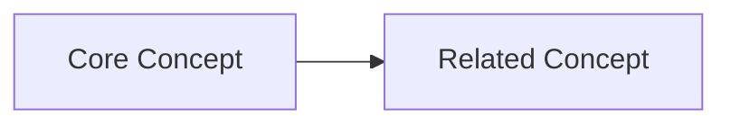

# target-only Knowledge Base
`domain-expertise` `learned-concepts` `reference-materials`

## 📚 Core Knowledge Domains
### Specialist
```knowledge
confidence: 0%
depth: surface
last_updated: 2025-12-10
```

**Key Concepts**:
- TBD: (understanding to be developed)

**Practical Applications**:
1. TBD

## 🔄 Recently Acquired Knowledge
<!-- New learnings will be added here -->

## 🎓 Learning Paths
```learning
ACTIVE:
- TBD: starting → intermediate

PLANNED:
- TBD: Start by 2026-01-09

COMPLETED:
- (none yet)
```

## 📖 Reference Library
⟪📚: (l,c,r) | Resource,Type,Relevance⟫
<!-- Resources will be cataloged here -->

## ❓ Knowledge Gaps
```gaps
KNOWN_UNKNOWNS:
- TBD: Need to learn for TBD

UNCERTAIN_AREAS:
- TBD: Partial understanding, need clarification
```

## 🔗 Knowledge Graph Connections

