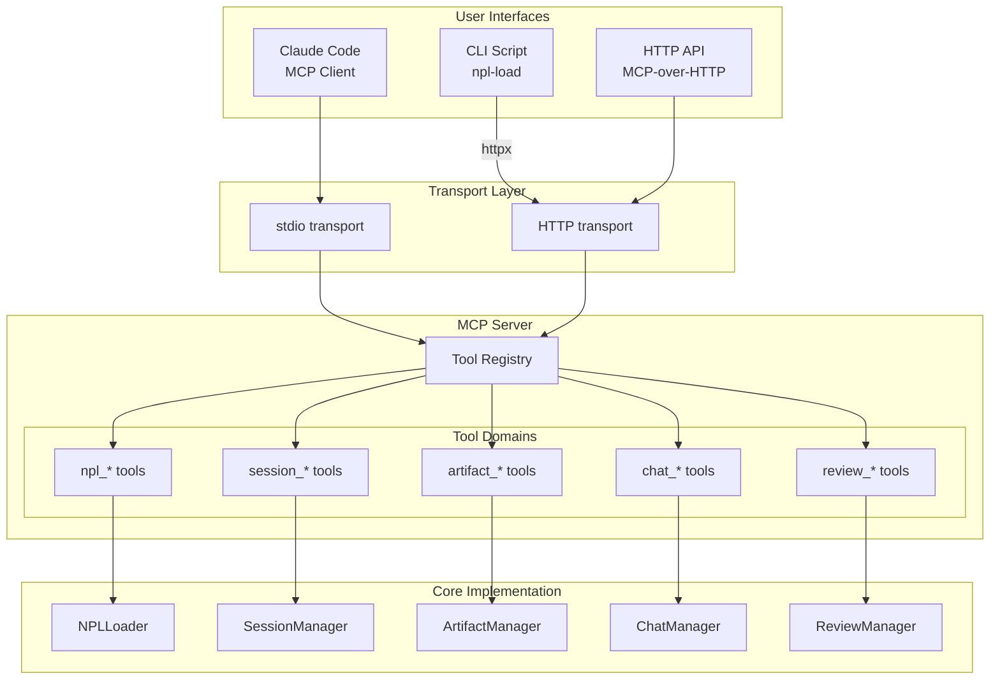
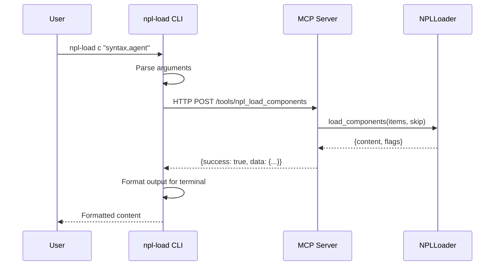

# PRD: MCP Tool Refactoring (MCP-First Strategy)

Product Requirements Document for MCP Tool Refactoring, implementing an MCP-first architecture where all functionality is exposed via MCP tools and CLI scripts become thin wrappers.

**version**
: 1.0

**status**
: draft

**owner**
: NPL Framework Team

**last-updated**
: 2025-12-10

**stakeholders**
: MCP Server Maintainers, CLI Users, Claude Code Integration Team, NPL Framework Users

**prerequisite**
: PRD-005 (MCP Architecture Cleanup)

---

## Executive Summary

This PRD specifies the tool interface refinements and CLI wrapper strategy for the NPL MCP server. Building on PRD-005's architecture consolidation, this document establishes MCP as the primary interface for all NPL functionality, with CLI scripts becoming thin wrappers that call MCP tools.

The MCP-first strategy provides:
- Single source of truth for all functionality implementation
- Consistent API contracts across CLI and programmatic access
- Easier testing and maintenance
- Better tooling for Claude Code and other MCP clients

**Key Outcomes:**
- All functionality accessible via MCP tools with consistent namespacing
- CLI scripts (`npl-load`, `npl-worklog`) become thin MCP clients
- Standardized response format across all tools
- Complete API contract documentation

---

## Problem Statement

### Current State

The NPL framework has parallel implementations:

**Dual Implementation Pattern**: Core functionality exists in both:
- CLI scripts (`core/scripts/npl-load`, `core/scripts/npl-worklog`)
- MCP tool wrappers (`mcp-server/src/npl_mcp/scripts/wrapper.py`)

**Wrapper Overhead**: Current MCP tools call CLI scripts via subprocess:
```python
# Current pattern in wrapper.py
async def npl_load(resource_type: str, items: str, skip: Optional[str] = None) -> str:
    script_path = _find_script("npl-load")
    result = subprocess.run([sys.executable, str(script_path), ...])
    return result.stdout
```

**Inconsistent Interfaces**:
- CLI returns formatted text with flag headers
- MCP tools return same text (no structured data)
- No pagination for list operations
- Inconsistent error handling

### Desired State

An MCP-first architecture where:
- MCP tools contain the canonical implementation
- CLI scripts are thin clients calling MCP tools
- All responses follow a consistent structured format
- Tools are organized by domain namespace

### Gap Analysis

| Aspect | Current | Desired | Gap |
|:-------|:--------|:--------|:----|
| Primary implementation | CLI scripts | MCP tools | Inversion needed |
| CLI-to-MCP relationship | MCP wraps CLI | CLI wraps MCP | Architecture flip |
| Response format | Inconsistent text | Structured `{success, data, error}` | Format standardization |
| Tool organization | Flat namespace | Domain-prefixed (`npl_*`, `artifact_*`) | Naming convention |
| List operations | No pagination | `limit`/`offset` support | API enhancement |

---

## Goals and Objectives

### Business Objectives

1. Establish MCP as the authoritative interface for NPL functionality
2. Simplify maintenance by eliminating dual implementations
3. Enable richer integrations through structured responses

### Technical Objectives

1. Implement all `npl-load` functionality as MCP tools
2. Implement all `npl-worklog` functionality as MCP tools
3. Create standardized CLI wrapper pattern using MCP client
4. Apply consistent tool namespacing across all domains

### Non-Goals

- Changing the behavior of existing functionality
- Removing CLI scripts (they become wrappers)
- Breaking existing MCP client integrations
- Modifying tools that remain CLI-only (`dump-files`, `git-tree`)

---

## Success Metrics

| Metric | Baseline | Target | Measurement |
|:-------|:---------|:-------|:------------|
| MCP tool coverage | 27 tools | 35+ tools | Tool count in registry |
| CLI wrapper conversion | 0% | 100% for target scripts | Scripts using MCP client |
| Response format compliance | ~50% | 100% | Structured response audit |
| Test coverage | CLI-focused | MCP-focused | Test distribution |

### Key Performance Indicators (KPIs)

**Tool Response Consistency**
: Definition: Percentage of tools returning `{success, data, error?}` format
: Target: 100%
: Frequency: Per-tool validation

**CLI Wrapper Latency**
: Definition: Overhead added by CLI-to-MCP call pattern
: Target: <100ms additional latency
: Frequency: Benchmark testing

---

## Architecture Overview

### MCP-First Flow



### CLI Wrapper Pattern



---

## Tool Namespacing Specification

### Domain Prefixes

| Prefix | Domain | Tool Count | Source |
|:-------|:-------|:-----------|:-------|
| `npl_` | NPL resource loading | 6 | New/Enhanced |
| `artifact_` | Artifact management | 5 | Existing |
| `chat_` | Chat/messaging | 8 | Existing |
| `session_` | Session management | 4 | Existing |
| `review_` | Review system | 6 | Existing |
| `worklog_` | Worklog operations | 5 | New |

### NPL Tools (`npl_*`)

| Tool | Description | Parameters |
|:-----|:------------|:-----------|
| `npl_load_components` | Load NPL component definitions | `items`, `skip?` |
| `npl_load_meta` | Load metadata files | `items`, `skip?` |
| `npl_load_style` | Load style guide files | `items`, `skip?` |
| `npl_load_agent` | Load agent definition with optional NPL docs | `agent_name`, `with_definition?` |
| `npl_section_index` | Get section index for a resource | `resource_type`, `item` |
| `npl_load_tailored` | Load with section selection | `resource_type`, `item`, `sections` |

### Artifact Tools (`artifact_*`)

| Tool | Description | Parameters |
|:-----|:------------|:-----------|
| `artifact_create` | Create new artifact | `name`, `artifact_type`, `file_content_base64`, `filename`, `created_by?`, `purpose?` |
| `artifact_add_revision` | Add revision to artifact | `artifact_id`, `file_content_base64`, `filename`, `created_by?`, `purpose?`, `notes?` |
| `artifact_get` | Get artifact content | `artifact_id`, `revision?` |
| `artifact_list` | List all artifacts | `limit?`, `offset?` |
| `artifact_history` | Get artifact revision history | `artifact_id` |

### Chat Tools (`chat_*`)

| Tool | Description | Parameters |
|:-----|:------------|:-----------|
| `chat_create_room` | Create chat room | `name`, `members`, `description?`, `session_id?`, `session_title?` |
| `chat_send_message` | Send message to room | `room_id`, `persona`, `message`, `reply_to_id?` |
| `chat_react` | Add emoji reaction | `event_id`, `persona`, `emoji` |
| `chat_share_artifact` | Share artifact in room | `room_id`, `persona`, `artifact_id`, `revision?` |
| `chat_create_todo` | Create todo item | `room_id`, `persona`, `description`, `assigned_to?` |
| `chat_get_feed` | Get room event feed | `room_id`, `since?`, `limit?`, `offset?` |
| `chat_get_notifications` | Get persona notifications | `persona`, `unread_only?`, `limit?`, `offset?` |
| `chat_mark_read` | Mark notification read | `notification_id` |

### Session Tools (`session_*`)

| Tool | Description | Parameters |
|:-----|:------------|:-----------|
| `session_create` | Create new session | `title?`, `session_id?` |
| `session_get` | Get session details | `session_id` |
| `session_list` | List sessions | `status?`, `limit?`, `offset?` |
| `session_update` | Update session metadata | `session_id`, `title?`, `status?` |

### Review Tools (`review_*`)

| Tool | Description | Parameters |
|:-----|:------------|:-----------|
| `review_create` | Start new review | `artifact_id`, `revision_id`, `reviewer_persona` |
| `review_add_comment` | Add inline comment | `review_id`, `location`, `comment`, `persona` |
| `review_add_annotation` | Add overlay annotation | `review_id`, `x`, `y`, `comment`, `persona` |
| `review_get` | Get review with comments | `review_id` |
| `review_generate_annotated` | Generate annotated artifact | `artifact_id`, `revision_id` |
| `review_complete` | Complete review | `review_id`, `overall_comment?` |

### Worklog Tools (`worklog_*`) - New

| Tool | Description | Parameters |
|:-----|:------------|:-----------|
| `worklog_init` | Initialize new worklog session | `session_id?`, `task?` |
| `worklog_log` | Append entry to worklog | `agent_id`, `action`, `summary`, `data?`, `tags?`, `refs?` |
| `worklog_read` | Read entries since cursor | `agent_id`, `peek?`, `since?` |
| `worklog_status` | Get session status | `session_id?` |
| `worklog_close` | Close current session | `archive?` |

---

## Functional Requirements

### FR-001: Standardized Response Format

**description**
: All MCP tools return responses in a consistent structured format.

**rationale**
: Predictable response structure simplifies client implementation and error handling.

**acceptance-criteria**
: - [ ] All tools return `{success: bool, data: {...}, error?: str, error_code?: str}`
: - [ ] Success responses include relevant data in `data` field
: - [ ] Error responses include `error` message and optional `error_code`
: - [ ] List operations include pagination metadata: `{items: [...], total: int, limit: int, offset: int}`

**priority**
: P0

**dependencies**
: None

**technical-notes**
: ```python
# Standard response format
class ToolResponse(TypedDict):
    success: bool
    data: Optional[Dict[str, Any]]
    error: Optional[str]
    error_code: Optional[str]

# Pagination wrapper for list operations
class PaginatedResponse(TypedDict):
    success: bool
    data: PaginatedData

class PaginatedData(TypedDict):
    items: List[Any]
    total: int
    limit: int
    offset: int
```

---

### FR-002: NPL Load MCP Tools

**description**
: Implement `npl-load` functionality as native MCP tools.

**rationale**
: Eliminates subprocess overhead and provides structured responses.

**acceptance-criteria**
: - [ ] `npl_load_components(items, skip)` loads NPL component files
: - [ ] `npl_load_meta(items, skip)` loads metadata files
: - [ ] `npl_load_style(items, skip)` loads style guide files
: - [ ] `npl_load_agent(agent_name, with_definition)` loads agent definitions
: - [ ] All loaders return `{success, data: {content, flags_updated}}`
: - [ ] Glob patterns supported in `items` parameter
: - [ ] Skip patterns work identically to CLI version

**priority**
: P0

**dependencies**
: FR-001 (Response Format)

**technical-notes**
: ```python
@mcp.tool()
async def npl_load_components(
    items: str,
    skip: Optional[str] = None
) -> dict:
    """Load NPL component definitions.

    Args:
        items: Comma-separated list of components (supports wildcards)
        skip: Optional comma-separated patterns to skip

    Returns:
        {success: true, data: {content: str, flags: {npl.def.loaded: str}}}
    """
    loader = NPLLoader()
    skip_set = _parse_skip(skip) if skip else set()
    loaded = loader.load_components(_parse_items(items), skip_set)

    return {
        "success": True,
        "data": {
            "content": _format_loaded(loaded),
            "flags": {"npl.def.loaded": ",".join(loader.loaded_components)}
        }
    }
```

---

### FR-003: NPL Section Index Tool

**description**
: New tool to get section index for selective loading (supports PRD-002).

**rationale**
: Enables clients to discover available sections before selective loading.

**acceptance-criteria**
: - [ ] `npl_section_index(resource_type, item)` returns section headings with byte ranges
: - [ ] Supports all resource types: component, meta, style, agent, spec, etc.
: - [ ] Returns structured index: `{sections: [{heading, level, start_line, end_line}]}`
: - [ ] Integrates with section selector syntax from PRD-002

**priority**
: P1

**dependencies**
: FR-002 (NPL Load Tools)

**technical-notes**
: ```python
@mcp.tool()
async def npl_section_index(
    resource_type: str,
    item: str
) -> dict:
    """Get section index for a resource.

    Args:
        resource_type: Type ('component', 'meta', 'style', 'agent', 'spec')
        item: Dot-notation item name (e.g., 'syntax', 'persona.qa-engineer')

    Returns:
        {success: true, data: {
            item: str,
            path: str,
            sections: [{heading: str, level: int, start_line: int, end_line: int}]
        }}
    """
```

---

### FR-004: NPL Tailored Load Tool

**description**
: Tool for loading specific sections of NPL resources.

**rationale**
: Reduces context window usage by loading only needed sections.

**acceptance-criteria**
: - [ ] `npl_load_tailored(resource_type, item, sections)` loads specified sections
: - [ ] Sections specified using heading paths (e.g., `["## Syntax", "### Placeholders"]`)
: - [ ] Returns content with section boundaries preserved
: - [ ] Supports section range syntax: `## Start...## End`

**priority**
: P1

**dependencies**
: FR-003 (Section Index)

---

### FR-005: Worklog MCP Tools

**description**
: Implement `npl-worklog` functionality as native MCP tools.

**rationale**
: Enables cross-agent communication without subprocess overhead.

**acceptance-criteria**
: - [ ] `worklog_init(session_id?, task?)` creates new worklog session
: - [ ] `worklog_log(agent_id, action, summary, data?, tags?, refs?)` appends entry
: - [ ] `worklog_read(agent_id, peek?, since?)` reads entries since cursor
: - [ ] `worklog_status(session_id?)` returns session statistics
: - [ ] `worklog_close(archive?)` closes current session
: - [ ] All tools use standardized response format

**priority**
: P0

**dependencies**
: FR-001 (Response Format)

---

### FR-006: CLI Wrapper Pattern

**description**
: Define and implement pattern for CLI scripts to call MCP tools.

**rationale**
: Enables CLI scripts to become thin wrappers while maintaining user experience.

**acceptance-criteria**
: - [ ] CLI wrapper base class/helper established
: - [ ] Uses `httpx` for HTTP transport to MCP server
: - [ ] Falls back to stdio transport if HTTP unavailable
: - [ ] Handles connection errors gracefully
: - [ ] Formats structured responses for terminal output
: - [ ] Preserves existing CLI argument interface

**priority**
: P0

**dependencies**
: FR-001, FR-002, FR-005

**technical-notes**
: ```python
# CLI wrapper pattern
import httpx
import sys
from typing import Optional

class MCPClient:
    """Client for calling MCP tools from CLI scripts."""

    def __init__(self, base_url: str = "http://localhost:8765"):
        self.base_url = base_url
        self._client: Optional[httpx.AsyncClient] = None

    async def call_tool(self, tool_name: str, **kwargs) -> dict:
        """Call an MCP tool and return response."""
        async with httpx.AsyncClient() as client:
            response = await client.post(
                f"{self.base_url}/mcp/tools/{tool_name}",
                json=kwargs,
                timeout=30.0
            )
            response.raise_for_status()
            return response.json()

    def format_for_terminal(self, response: dict) -> str:
        """Format MCP response for terminal output."""
        if not response.get("success"):
            return f"Error: {response.get('error', 'Unknown error')}"
        return response.get("data", {}).get("content", "")


# Example: npl-load CLI wrapper
async def main():
    import argparse
    parser = argparse.ArgumentParser()
    parser.add_argument('resource_type', choices=['c', 'm', 's'])
    parser.add_argument('items')
    parser.add_argument('--skip', default=None)
    args = parser.parse_args()

    client = MCPClient()
    tool_map = {'c': 'npl_load_components', 'm': 'npl_load_meta', 's': 'npl_load_style'}

    response = await client.call_tool(
        tool_map[args.resource_type],
        items=args.items,
        skip=args.skip
    )

    print(client.format_for_terminal(response))
```

---

### FR-007: Pagination for List Operations

**description**
: Add `limit` and `offset` parameters to all list operations.

**rationale**
: Enables efficient retrieval of large result sets.

**acceptance-criteria**
: - [ ] `artifact_list` supports `limit` (default 50) and `offset` (default 0)
: - [ ] `session_list` supports `limit` and `offset`
: - [ ] `chat_get_feed` supports `limit` and `offset`
: - [ ] `chat_get_notifications` supports `limit` and `offset`
: - [ ] Response includes `total` count for pagination UI

**priority**
: P1

**dependencies**
: FR-001 (Response Format)

---

### FR-008: Standardized Error Codes

**description**
: Define and implement consistent error codes across all tools.

**rationale**
: Enables programmatic error handling by clients.

**acceptance-criteria**
: - [ ] Error code enum defined with categories
: - [ ] All tools use appropriate error codes
: - [ ] Error codes documented in API reference
: - [ ] CLI wrapper translates codes to user-friendly messages

**priority**
: P1

**dependencies**
: FR-001 (Response Format)

**technical-notes**
: ```python
class ErrorCode(str, Enum):
    # Validation errors (4xx equivalent)
    INVALID_PARAMETER = "INVALID_PARAMETER"
    MISSING_REQUIRED = "MISSING_REQUIRED"
    NOT_FOUND = "NOT_FOUND"
    ALREADY_EXISTS = "ALREADY_EXISTS"

    # Resource errors
    ARTIFACT_NOT_FOUND = "ARTIFACT_NOT_FOUND"
    SESSION_NOT_FOUND = "SESSION_NOT_FOUND"
    ROOM_NOT_FOUND = "ROOM_NOT_FOUND"
    REVIEW_NOT_FOUND = "REVIEW_NOT_FOUND"

    # Operation errors
    PERMISSION_DENIED = "PERMISSION_DENIED"
    OPERATION_FAILED = "OPERATION_FAILED"

    # System errors (5xx equivalent)
    INTERNAL_ERROR = "INTERNAL_ERROR"
    DATABASE_ERROR = "DATABASE_ERROR"
    FILE_SYSTEM_ERROR = "FILE_SYSTEM_ERROR"
```

---

### FR-009: Tool Renaming Migration

**description**
: Rename existing tools to follow namespace convention with backward compatibility.

**rationale**
: Consistent naming improves discoverability and organization.

**acceptance-criteria**
: - [ ] All tools renamed per namespace specification
: - [ ] Old tool names registered as aliases during transition
: - [ ] Deprecation warnings logged when old names used
: - [ ] Aliases removed after one minor version

**priority**
: P2

**dependencies**
: All tool implementations (FR-002 through FR-007)

**technical-notes**
: ```python
# Tool alias registration for backward compatibility
TOOL_ALIASES = {
    # Old name -> New name
    "create_artifact": "artifact_create",
    "add_revision": "artifact_add_revision",
    "get_artifact": "artifact_get",
    "list_artifacts": "artifact_list",
    "get_artifact_history": "artifact_history",
    "create_review": "review_create",
    "add_inline_comment": "review_add_comment",
    "npl_load": "npl_load_components",  # Default to components
    # ... etc
}

def register_tool_with_alias(mcp, func, new_name: str, old_name: str):
    """Register tool with both new and old names."""
    mcp.tool(name=new_name)(func)

    @mcp.tool(name=old_name)
    async def alias_wrapper(*args, **kwargs):
        logger.warning(f"Tool '{old_name}' is deprecated, use '{new_name}'")
        return await func(*args, **kwargs)
```

---

## Non-Functional Requirements

### Performance

| Metric | Requirement | Measurement |
|:-------|:------------|:------------|
| Tool invocation latency | <50ms for in-process calls | Benchmark suite |
| CLI wrapper overhead | <100ms additional vs direct CLI | Comparative timing |
| List operation response | <500ms for 1000 items | Load testing |

### Compatibility

**Python Version**
: Maintain >=3.10 requirement

**MCP Protocol**
: Compatible with MCP specification v1.0

**HTTP Client**
: CLI wrappers use `httpx` (already a dependency)

### Maintainability

**Code Organization**
: One tool implementation file per domain (artifact.py, chat.py, etc.)

**Documentation**
: Each tool has complete docstring with Args, Returns, Raises

**Testing**
: Each tool has unit tests; integration tests for CLI wrappers

---

## API Contracts

### Standard Response Schema

```yaml
ToolResponse:
  type: object
  required:
    - success
  properties:
    success:
      type: boolean
      description: Whether the operation succeeded
    data:
      type: object
      description: Operation-specific result data
    error:
      type: string
      description: Error message if success is false
    error_code:
      type: string
      enum: [INVALID_PARAMETER, NOT_FOUND, OPERATION_FAILED, ...]
      description: Machine-readable error code

PaginatedResponse:
  type: object
  required:
    - success
    - data
  properties:
    success:
      type: boolean
    data:
      type: object
      required:
        - items
        - total
        - limit
        - offset
      properties:
        items:
          type: array
        total:
          type: integer
          description: Total number of items (before pagination)
        limit:
          type: integer
          description: Maximum items per page
        offset:
          type: integer
          description: Current offset
```

### NPL Load Response Schema

```yaml
NPLLoadResponse:
  type: object
  properties:
    success:
      type: boolean
    data:
      type: object
      properties:
        content:
          type: string
          description: Loaded NPL content
        flags:
          type: object
          additionalProperties:
            type: string
          description: Flag updates (e.g., npl.def.loaded)
        loaded_items:
          type: array
          items:
            type: string
          description: List of items that were loaded
```

### Section Index Response Schema

```yaml
SectionIndexResponse:
  type: object
  properties:
    success:
      type: boolean
    data:
      type: object
      properties:
        item:
          type: string
          description: Item name that was indexed
        path:
          type: string
          description: Resolved file path
        sections:
          type: array
          items:
            type: object
            properties:
              heading:
                type: string
                description: Section heading text
              level:
                type: integer
                description: Heading level (1-6)
              start_line:
                type: integer
                description: Starting line number
              end_line:
                type: integer
                description: Ending line number (exclusive)
```

---

## Migration Checklist

### Pre-Implementation

- [ ] Review and approve PRD-005 architecture changes
- [ ] Benchmark current CLI script performance
- [ ] Document all existing tool signatures
- [ ] Verify httpx is available in mcp-server dependencies

### Phase 1: Infrastructure (P0)

- [ ] Create `npl_mcp/tools/responses.py` with standard response types
- [ ] Create `npl_mcp/tools/errors.py` with error code enum
- [ ] Update `npl_mcp/tools/registry.py` to support aliases
- [ ] Add response format validation utilities

### Phase 2: NPL Tools (P0)

- [ ] Create `npl_mcp/tools/npl.py` with NPLLoader integration
- [ ] Implement `npl_load_components` tool
- [ ] Implement `npl_load_meta` tool
- [ ] Implement `npl_load_style` tool
- [ ] Implement `npl_load_agent` tool
- [ ] Add unit tests for all NPL tools

### Phase 3: Worklog Tools (P0)

- [ ] Create `npl_mcp/tools/worklog.py`
- [ ] Implement `worklog_init` tool
- [ ] Implement `worklog_log` tool
- [ ] Implement `worklog_read` tool
- [ ] Implement `worklog_status` tool
- [ ] Implement `worklog_close` tool
- [ ] Add unit tests for all worklog tools

### Phase 4: CLI Wrappers (P0)

- [ ] Create `core/scripts/mcp_client.py` wrapper library
- [ ] Refactor `npl-load` to use MCP client
- [ ] Refactor `npl-worklog` to use MCP client
- [ ] Add fallback to direct implementation when MCP unavailable
- [ ] Integration tests for CLI-to-MCP flow

### Phase 5: Existing Tool Updates (P1)

- [ ] Add pagination to `artifact_list` (becomes `artifact_list`)
- [ ] Add pagination to `session_list` (becomes `session_list`)
- [ ] Add pagination to `chat_get_feed` (becomes `chat_get_feed`)
- [ ] Add pagination to `chat_get_notifications` (becomes `chat_get_notifications`)
- [ ] Update all tools to use standard response format

### Phase 6: Section Selection (P1)

- [ ] Implement `npl_section_index` tool
- [ ] Implement `npl_load_tailored` tool
- [ ] Integrate with PRD-002 section selector syntax
- [ ] Add unit tests

### Phase 7: Cleanup (P2)

- [ ] Register tool aliases for backward compatibility
- [ ] Add deprecation warnings to old tool names
- [ ] Update all documentation
- [ ] Remove old `scripts/wrapper.py` subprocess calls
- [ ] Final integration testing

### Post-Implementation

- [ ] Benchmark new implementation vs baseline
- [ ] Verify CLI behavior unchanged
- [ ] Test Claude Code integration
- [ ] Update CHANGELOG
- [ ] Create migration guide for existing users

---

## Constraints and Assumptions

### Constraints

**technical**
: - Must not break existing MCP client integrations
: - CLI scripts must maintain current argument interface
: - HTTP MCP server must be running for CLI wrappers to work (with fallback)

**timeline**
: - Implementation should align with PRD-005 completion
: - Deprecation period of 1 minor version for renamed tools

### Assumptions

| Assumption | Impact if False | Validation Plan |
|:-----------|:----------------|:----------------|
| HTTP MCP server can be auto-started | CLI needs manual server start | Test startup patterns |
| httpx is suitable for sync CLI use | Need alternative client | Test CLI performance |
| NPLLoader can be imported directly | Need subprocess fallback | Test import in tool context |
| FastMCP supports tool aliases | Need manual alias registration | Review FastMCP capabilities |

---

## Dependencies

### Internal Dependencies

| Dependency | Owner | Status | Impact |
|:-----------|:------|:-------|:-------|
| PRD-005 Architecture | MCP Team | In Progress | Must complete tools subpackage first |
| PRD-002 Section Selectors | NPL Team | Draft | Section index tool design |
| NPLLoader class | NPL Team | Stable | Direct import into MCP tools |
| SessionManager class | NPL Team | Stable | Worklog tool implementation |

### External Dependencies

| Dependency | Provider | Version | Purpose |
|:-----------|:---------|:--------|:--------|
| FastMCP | FastMCP Project | >=0.1.0 | Tool registration |
| httpx | Encode | >=0.25.0 | CLI-to-MCP HTTP client |
| aiosqlite | aiosqlite | >=0.19.0 | Async database for worklog |

---

## Risks and Mitigations

| Risk | Likelihood | Impact | Mitigation | Owner |
|:-----|:-----------|:-------|:-----------|:------|
| CLI wrapper latency unacceptable | Medium | High | Implement direct-call fallback | Dev Team |
| MCP server not running for CLI | Medium | Medium | Auto-start or graceful fallback | Dev Team |
| Breaking changes to tool signatures | Low | High | Extensive integration testing | QA |
| httpx async/sync incompatibility | Low | Medium | Use sync httpx client for CLI | Dev Team |

---

## Open Questions

| Question | Impact | Owner | Due |
|:---------|:-------|:------|:----|
| Should CLI auto-start MCP server if not running? | User experience | Product | Before Phase 4 |
| Keep `dump-files` and `git-tree` as CLI-only? | Tool coverage | Dev Team | Before Phase 2 |
| How to handle MCP server version mismatches? | Compatibility | Dev Team | Before Phase 4 |
| Should worklog support multiple concurrent sessions? | Feature scope | Product | Before Phase 3 |

---

## Appendix

### Glossary

**MCP-first**
: Architecture pattern where MCP tools are the primary implementation and other interfaces (CLI) wrap them

**Tool namespace**
: Prefix convention for grouping related tools (e.g., `artifact_*`, `chat_*`)

**CLI wrapper**
: Thin CLI script that calls MCP tools via HTTP or stdio transport

**Response format**
: Standardized JSON structure for tool responses

### Tool Migration Map

| Current Tool | New Name | Domain |
|:-------------|:---------|:-------|
| `dump_files` | Keep as-is | utility |
| `git_tree` | Keep as-is | utility |
| `git_tree_depth` | Keep as-is | utility |
| `npl_load` | `npl_load_components` | npl |
| `create_artifact` | `artifact_create` | artifact |
| `add_revision` | `artifact_add_revision` | artifact |
| `get_artifact` | `artifact_get` | artifact |
| `list_artifacts` | `artifact_list` | artifact |
| `get_artifact_history` | `artifact_history` | artifact |
| `create_review` | `review_create` | review |
| `add_inline_comment` | `review_add_comment` | review |
| `add_overlay_annotation` | `review_add_annotation` | review |
| `get_review` | `review_get` | review |
| `generate_annotated_artifact` | `review_generate_annotated` | review |
| `complete_review` | `review_complete` | review |
| `create_session` | `session_create` | session |
| `get_session` | `session_get` | session |
| `list_sessions` | `session_list` | session |
| `update_session` | `session_update` | session |
| `create_chat_room` | `chat_create_room` | chat |
| `send_message` | `chat_send_message` | chat |
| `react_to_message` | `chat_react` | chat |
| `share_artifact` | `chat_share_artifact` | chat |
| `create_todo` | `chat_create_todo` | chat |
| `get_chat_feed` | `chat_get_feed` | chat |
| `get_notifications` | `chat_get_notifications` | chat |
| `mark_notification_read` | `chat_mark_read` | chat |
| (new) | `npl_load_meta` | npl |
| (new) | `npl_load_style` | npl |
| (new) | `npl_load_agent` | npl |
| (new) | `npl_section_index` | npl |
| (new) | `npl_load_tailored` | npl |
| (new) | `worklog_init` | worklog |
| (new) | `worklog_log` | worklog |
| (new) | `worklog_read` | worklog |
| (new) | `worklog_status` | worklog |
| (new) | `worklog_close` | worklog |

### References

- PRD-005: MCP Architecture Cleanup - `.npl/prds/prd-005-mcp-architecture.md`
- PRD-002: Section Selectors - `.npl/prds/prd-002-section-selectors.md`
- FastMCP Documentation: https://github.com/jlowin/fastmcp
- MCP Specification: https://modelcontextprotocol.io/

### Revision History

| Version | Date | Author | Changes |
|:--------|:-----|:-------|:--------|
| 1.0 | 2025-12-10 | NPL Framework Team | Initial draft |
