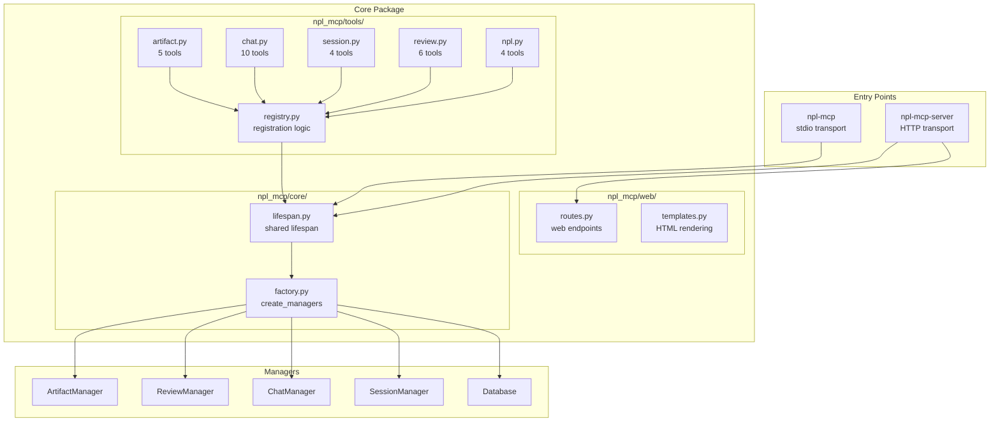
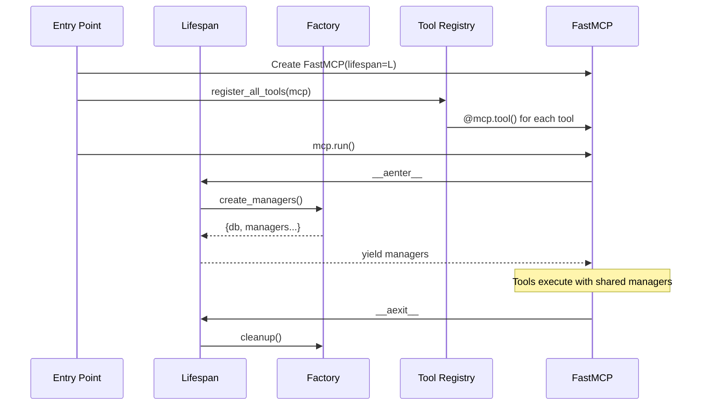

# PRD: MCP Server Architecture Cleanup

Product Requirements Document for NPL MCP Server Architecture Cleanup, consolidating duplicated code across server modes into a unified, maintainable structure.

**version**
: 1.0

**status**
: draft

**owner**
: NPL Framework Team

**last-updated**
: 2025-12-10

**stakeholders**
: MCP Server Maintainers, Claude Code Integration Team, NPL Framework Users

---

## Executive Summary

The NPL MCP server currently implements 36 tools across multiple server modes (stdio, HTTP, combined) with significant code duplication. The same tool definitions exist in `server.py`, `unified.py`, and `combined.py`, and manager initialization logic is repeated across all lifespan contexts.

This project consolidates tool definitions into a dedicated subpackage, creates a shared manager factory, unifies lifespan management, and reduces entry points from four to two. The result will be a more maintainable codebase with a single source of truth for all tool implementations.

**Key Outcomes:**
- Eliminate ~1200 lines of duplicated code
- Single source of truth for 36 MCP tools
- Two clean entry points: `npl-mcp` (stdio) and `npl-mcp-server` (HTTP)
- Simplified contribution and maintenance workflow

---

## Problem Statement

### Current State

The NPL MCP server has evolved organically, resulting in:

**Code Duplication**: Tool definitions are copied across three files:
- `server.py` (618 lines) - stdio MCP with embedded tools
- `unified.py` (921 lines) - HTTP server with tools + web UI
- `combined.py` (379 lines) - dual-mode with yet another copy of tools

**Multiple Entry Points**: Four entry points serve overlapping purposes:
- `npl-mcp` - stdio server (primary for Claude Code)
- `npl-mcp-web` - combined stdio + HTTP (deprecated name)
- `npl-mcp-unified` - HTTP-only server
- `npl-mcp-launcher` - process launcher with singleton support

**Repeated Manager Initialization**: Each server mode has its own lifespan context that creates the same five managers:
```python
_db = Database()
_artifact_manager = ArtifactManager(_db)
_review_manager = ReviewManager(_db)
_chat_manager = ChatManager(_db)
_session_manager = SessionManager(_db)
```

### Desired State

A clean architecture where:
- Tools are defined once in `npl_mcp/tools/` subpackage
- Manager creation happens through a single factory function
- Both server modes share identical tool and lifespan code
- Two clear entry points with distinct purposes

### Gap Analysis

| Aspect | Current | Desired | Gap |
|:-------|:--------|:--------|:----|
| Tool definitions | 3 copies (~1200 lines) | 1 source (~400 lines) | 800 duplicated lines |
| Entry points | 4 overlapping | 2 distinct | 2 redundant entry points |
| Manager init | 3 copies | 1 factory | 2 redundant implementations |
| Web UI coupling | Embedded in unified.py | Separate module | Mixed concerns |
| Test coverage | Per-file testing | Single test suite | Fragmented tests |

---

## Goals and Objectives

### Business Objectives

1. Reduce maintenance burden by eliminating code duplication
2. Enable faster feature development through single-point changes
3. Improve code quality metrics (DRY compliance, cyclomatic complexity)

### Technical Objectives

1. Single source of truth for all 36 MCP tool definitions
2. Shared manager factory used by all server modes
3. Clean separation between transport (stdio/HTTP) and business logic
4. Optional web UI that mounts onto HTTP server

### Non-Goals

- Changing tool APIs or behavior (pure refactor)
- Adding new tools or features
- Modifying the web UI functionality
- Breaking existing Claude Code configurations

---

## Success Metrics

| Metric | Baseline | Target | Measurement |
|:-------|:---------|:-------|:------------|
| Lines of code | ~2120 (combined) | ~900 | `wc -l` on server files |
| Tool definition locations | 3 files | 1 subpackage | Code audit |
| Entry points | 4 | 2 | pyproject.toml scripts |
| Manager init sites | 3 | 1 | grep `ArtifactManager\(` |
| Test maintenance | 3 test files | 1 test module | Test file count |

### Key Performance Indicators (KPIs)

**Code Duplication Index**
: Definition: Percentage of unique vs duplicated code
: Target: <5% duplication
: Frequency: Post-implementation audit

**Change Propagation Count**
: Definition: Files modified to add/change a tool
: Target: 1 file per tool
: Frequency: Per feature addition

---

## Architecture Overview

### Target Architecture



### Tool Registration Flow



---

## Functional Requirements

### FR-001: Tool Subpackage Structure

**description**
: Create `npl_mcp/tools/` subpackage with domain-organized tool modules.

**rationale**
: Single source of truth eliminates duplication and simplifies maintenance.

**acceptance-criteria**
: - [ ] `tools/__init__.py` exports `register_all_tools(mcp)` function
: - [ ] `tools/artifact.py` contains: `create_artifact`, `add_revision`, `get_artifact`, `list_artifacts`, `get_artifact_history`
: - [ ] `tools/review.py` contains: `create_review`, `add_inline_comment`, `add_overlay_annotation`, `get_review`, `generate_annotated_artifact`, `complete_review`
: - [ ] `tools/chat.py` contains: `create_chat_room`, `send_message`, `react_to_message`, `share_artifact`, `create_todo`, `get_chat_feed`, `get_notifications`, `mark_notification_read`
: - [ ] `tools/session.py` contains: `create_session`, `get_session`, `list_sessions`, `update_session`
: - [ ] `tools/npl.py` contains: `dump_files`, `git_tree`, `git_tree_depth`, `npl_load`
: - [ ] All 36 tools have identical signatures to current implementation
: - [ ] Tools access managers via FastMCP context or global state

**priority**
: P0

**dependencies**
: None (foundational change)

---

### FR-002: Shared Manager Factory

**description**
: Create `npl_mcp/core/factory.py` with `create_managers()` and `cleanup_managers()` functions.

**rationale**
: Centralizes initialization logic, ensures consistent manager configuration.

**acceptance-criteria**
: - [ ] `create_managers()` returns dict with: `db`, `artifact_manager`, `review_manager`, `chat_manager`, `session_manager`
: - [ ] Function accepts optional `data_dir` parameter (defaults to env var)
: - [ ] Database connection established before manager creation
: - [ ] `cleanup_managers(managers)` properly disconnects database
: - [ ] Factory is async-compatible (`async def create_managers`)

**priority**
: P0

**dependencies**
: None

**technical-notes**
: ```python
async def create_managers(data_dir: Optional[str] = None) -> Dict[str, Any]:
    """Create all managers with shared database connection."""
    db = Database(data_dir)
    await db.connect()
    return {
        "db": db,
        "artifact_manager": ArtifactManager(db),
        "review_manager": ReviewManager(db),
        "chat_manager": ChatManager(db),
        "session_manager": SessionManager(db),
    }
```

---

### FR-003: Unified Lifespan Context

**description**
: Create `npl_mcp/core/lifespan.py` with shared lifespan context manager.

**rationale**
: Both stdio and HTTP servers need identical startup/shutdown behavior.

**acceptance-criteria**
: - [ ] Single `@asynccontextmanager` function usable by both server modes
: - [ ] Lifespan yields manager dict to FastMCP context
: - [ ] Proper cleanup on shutdown (database disconnect)
: - [ ] Optional callback hooks for mode-specific behavior (e.g., PID file for HTTP)

**priority**
: P0

**dependencies**
: FR-002 (Manager Factory)

---

### FR-004: Stdio Server Refactor

**description**
: Refactor `server.py` to use shared tools and lifespan.

**rationale**
: Primary entry point for Claude Code must maintain backward compatibility.

**acceptance-criteria**
: - [ ] Uses `register_all_tools(mcp)` from tools subpackage
: - [ ] Uses shared lifespan from core module
: - [ ] `npl-mcp` entry point unchanged in pyproject.toml
: - [ ] Stdio transport behavior identical to current
: - [ ] All existing Claude Code configurations continue working

**priority**
: P0

**dependencies**
: FR-001, FR-003

---

### FR-005: HTTP Server Refactor

**description**
: Refactor HTTP server into `npl_mcp/http.py` using shared components.

**rationale**
: HTTP server provides web UI and MCP-over-HTTP for external access.

**acceptance-criteria**
: - [ ] Uses `register_all_tools(mcp)` from tools subpackage
: - [ ] Uses shared lifespan from core module
: - [ ] Mounts web UI routes from `npl_mcp/web/` module
: - [ ] Singleton mode support preserved
: - [ ] Entry point renamed to `npl-mcp-server`

**priority**
: P0

**dependencies**
: FR-001, FR-003

---

### FR-006: Web UI Extraction

**description**
: Extract web UI HTML rendering and routes from `unified.py` to `npl_mcp/web/`.

**rationale**
: Separates transport concerns from presentation layer.

**acceptance-criteria**
: - [ ] `web/routes.py` contains all FastAPI route handlers
: - [ ] `web/templates.py` contains HTML rendering functions
: - [ ] Web routes mount to FastAPI app via `include_router()` or similar
: - [ ] HTTP server can optionally disable web UI via environment variable
: - [ ] All existing web UI functionality preserved

**priority**
: P1

**dependencies**
: FR-005

---

### FR-007: Entry Point Consolidation

**description**
: Reduce entry points from 4 to 2 in pyproject.toml.

**rationale**
: Simplifies user experience and eliminates confusion.

**acceptance-criteria**
: - [ ] `npl-mcp` - stdio server (unchanged)
: - [ ] `npl-mcp-server` - HTTP server with web UI
: - [ ] Deprecation warning added to old entry points for one release cycle
: - [ ] Documentation updated to reflect new entry points

**priority**
: P1

**dependencies**
: FR-004, FR-005

---

### FR-008: Legacy Entry Point Deprecation

**description**
: Add deprecation warnings to removed entry points and provide migration path.

**rationale**
: Users may have scripts or configurations using old entry points.

**acceptance-criteria**
: - [ ] `npl-mcp-web` prints deprecation warning directing to `npl-mcp-server`
: - [ ] `npl-mcp-unified` prints deprecation warning directing to `npl-mcp-server`
: - [ ] `npl-mcp-launcher` prints deprecation warning directing to `npl-mcp-server`
: - [ ] Warnings include migration instructions
: - [ ] Old entry points continue functioning for one minor version

**priority**
: P2

**dependencies**
: FR-007

---

## Non-Functional Requirements

### Performance

| Metric | Requirement | Measurement |
|:-------|:------------|:------------|
| Startup time | No regression (< 500ms) | Time from invocation to ready |
| Tool execution | No regression | Benchmark existing vs new |
| Memory usage | No regression | Process memory at idle |

### Maintainability

**Code Organization**
: Clear module boundaries following single-responsibility principle

**Documentation**
: Each module has docstring explaining its role in the architecture

**Testing**
: Single test suite covering all tools regardless of transport

### Compatibility

**Python Version**
: Maintain >=3.10 requirement

**FastMCP Version**
: Maintain >=0.1.0 compatibility

**Backward Compatibility**
: All existing Claude Code configurations must continue working without modification

---

## Constraints and Assumptions

### Constraints

**technical**
: - Must maintain FastMCP as the MCP implementation
: - Cannot change tool signatures or behavior
: - Must preserve environment variable configuration

**timeline**
: - Implementation should complete within 2 development cycles
: - Deprecation period of 1 minor version for old entry points

### Assumptions

| Assumption | Impact if False | Validation Plan |
|:-----------|:----------------|:----------------|
| FastMCP supports shared lifespan | Architecture redesign needed | Review FastMCP docs/source |
| Tool registration can be dynamic | May need decorator approach | Test with FastMCP |
| No external dependencies on file structure | May need longer deprecation | Survey usage |

---

## Dependencies

### Internal Dependencies

| Dependency | Owner | Status | Impact |
|:-----------|:------|:-------|:-------|
| Existing manager classes | MCP Team | Stable | None - reusing as-is |
| Database schema | MCP Team | Stable | None - unchanged |
| Web UI templates | MCP Team | Stable | Extract only, no changes |

### External Dependencies

| Dependency | Provider | SLA | Fallback |
|:-----------|:---------|:----|:---------|
| FastMCP | FastMCP Project | Community | Pin version on breaking change |
| FastAPI | Starlette/Encode | Community | Pin version on breaking change |

---

## Risks and Mitigations

| Risk | Likelihood | Impact | Mitigation | Owner |
|:-----|:-----------|:-------|:-----------|:------|
| FastMCP API incompatibility | Low | High | Pin version, test extensively | Dev Team |
| Breaking existing configurations | Medium | High | Comprehensive integration tests | QA |
| Performance regression | Low | Medium | Benchmark before/after | Dev Team |
| Missing tool in refactor | Low | High | Automated tool count validation | Dev Team |

---

## Implementation Plan

### Phase 1: Core Infrastructure (P0)

**Scope**: FR-001, FR-002, FR-003

**Tasks**:
1. Create `npl_mcp/tools/` directory structure
2. Implement tool modules with extracted definitions
3. Create `tools/registry.py` with `register_all_tools()`
4. Create `core/factory.py` with manager creation
5. Create `core/lifespan.py` with shared context
6. Add unit tests for new modules

**Success Criteria**:
- All 36 tools defined in tools subpackage
- Factory creates managers correctly
- Lifespan manages lifecycle properly

### Phase 2: Server Refactoring (P0)

**Scope**: FR-004, FR-005

**Tasks**:
1. Refactor `server.py` to use shared components
2. Create `http.py` for HTTP server
3. Integration tests for both modes
4. Verify Claude Code compatibility

**Success Criteria**:
- Stdio server passes all existing tests
- HTTP server passes all existing tests
- No behavior changes observable to clients

### Phase 3: Cleanup and Polish (P1-P2)

**Scope**: FR-006, FR-007, FR-008

**Tasks**:
1. Extract web UI to `web/` module
2. Update pyproject.toml entry points
3. Add deprecation warnings
4. Update documentation
5. Remove deprecated files

**Success Criteria**:
- Web UI works as before
- New entry points documented
- Old entry points warn but work

---

## Migration Checklist

### Pre-Implementation

- [ ] Create feature branch from main
- [ ] Set up test baseline (run all existing tests, record results)
- [ ] Benchmark current performance metrics
- [ ] Document current tool count (should be 36)

### During Implementation

- [ ] Create `npl_mcp/tools/__init__.py`
- [ ] Create `npl_mcp/tools/artifact.py` - 5 tools
- [ ] Create `npl_mcp/tools/review.py` - 6 tools
- [ ] Create `npl_mcp/tools/chat.py` - 8 tools
- [ ] Create `npl_mcp/tools/session.py` - 4 tools
- [ ] Create `npl_mcp/tools/npl.py` - 4 tools
- [ ] Create `npl_mcp/tools/registry.py`
- [ ] Create `npl_mcp/core/__init__.py`
- [ ] Create `npl_mcp/core/factory.py`
- [ ] Create `npl_mcp/core/lifespan.py`
- [ ] Refactor `server.py` to use new components
- [ ] Create `http.py` for HTTP server
- [ ] Extract web UI to `web/routes.py` and `web/templates.py`
- [ ] Update `pyproject.toml` entry points
- [ ] Add deprecation shims for old entry points

### Post-Implementation

- [ ] Run all existing tests - must pass
- [ ] Verify tool count still equals 36
- [ ] Benchmark performance - no regression
- [ ] Test Claude Code integration manually
- [ ] Test web UI manually
- [ ] Update README with new architecture
- [ ] Remove or archive old files: `unified.py`, `combined.py`, `launcher.py`

---

## File Structure After Refactor

```
mcp-server/src/npl_mcp/
|-- __init__.py
|-- server.py              # Refactored stdio server (~50 lines)
|-- http.py                # New HTTP server (~80 lines)
|-- core/
|   |-- __init__.py
|   |-- factory.py         # Manager factory (~40 lines)
|   |-- lifespan.py        # Shared lifespan (~50 lines)
|-- tools/
|   |-- __init__.py        # Exports register_all_tools
|   |-- artifact.py        # 5 tools (~100 lines)
|   |-- review.py          # 6 tools (~80 lines)
|   |-- chat.py            # 8 tools (~120 lines)
|   |-- session.py         # 4 tools (~60 lines)
|   |-- npl.py             # 4 tools (~40 lines)
|   |-- registry.py        # Registration logic (~30 lines)
|-- web/
|   |-- __init__.py
|   |-- app.py             # Existing (unchanged)
|   |-- routes.py          # Extracted routes (~200 lines)
|   |-- templates.py       # Extracted HTML (~300 lines)
|-- artifacts/             # Unchanged
|-- chat/                  # Unchanged
|-- sessions/              # Unchanged
|-- storage/               # Unchanged
|-- scripts/               # Unchanged
|-- deprecated/            # Old entry point shims
    |-- combined.py        # Deprecation wrapper
    |-- unified.py         # Deprecation wrapper
    |-- launcher.py        # Deprecation wrapper
```

---

## Open Questions

| Question | Impact | Owner | Due |
|:---------|:-------|:------|:-----|
| Should tools access managers via context or global? | Implementation pattern | Dev Team | Before Phase 1 |
| Keep launcher functionality in npl-mcp-server? | Feature parity | Dev Team | Before Phase 2 |
| Minimum deprecation period for old entry points? | User migration | Product | Before Phase 3 |

---

## Appendix

### Glossary

**stdio transport**
: Standard input/output communication mode used by Claude Code

**HTTP transport**
: HTTP/SSE communication mode for web-based MCP clients

**lifespan**
: FastAPI/FastMCP pattern for managing startup/shutdown resources

**manager**
: Business logic class (e.g., ArtifactManager) that tools delegate to

### Tool Inventory (Current State)

| Domain | Tool | File(s) |
|:-------|:-----|:--------|
| NPL Scripts | `dump_files` | server.py, unified.py, combined.py |
| NPL Scripts | `git_tree` | server.py, unified.py, combined.py |
| NPL Scripts | `git_tree_depth` | server.py, unified.py, combined.py |
| NPL Scripts | `npl_load` | server.py, unified.py, combined.py |
| Artifacts | `create_artifact` | server.py, unified.py, combined.py |
| Artifacts | `add_revision` | server.py, unified.py, combined.py |
| Artifacts | `get_artifact` | server.py, unified.py, combined.py |
| Artifacts | `list_artifacts` | server.py, unified.py, combined.py |
| Artifacts | `get_artifact_history` | server.py, unified.py, combined.py |
| Reviews | `create_review` | server.py, unified.py, combined.py |
| Reviews | `add_inline_comment` | server.py, unified.py, combined.py |
| Reviews | `add_overlay_annotation` | server.py, unified.py, combined.py |
| Reviews | `get_review` | server.py, unified.py, combined.py |
| Reviews | `generate_annotated_artifact` | server.py, unified.py, combined.py |
| Reviews | `complete_review` | server.py, unified.py, combined.py |
| Sessions | `create_session` | server.py, unified.py, combined.py |
| Sessions | `get_session` | server.py, unified.py, combined.py |
| Sessions | `list_sessions` | server.py, unified.py, combined.py |
| Sessions | `update_session` | server.py, unified.py, combined.py |
| Chat | `create_chat_room` | server.py, unified.py, combined.py |
| Chat | `send_message` | server.py, unified.py, combined.py |
| Chat | `react_to_message` | server.py, unified.py, combined.py |
| Chat | `share_artifact` | server.py, unified.py, combined.py |
| Chat | `create_todo` | server.py, unified.py, combined.py |
| Chat | `get_chat_feed` | server.py, unified.py, combined.py |
| Chat | `get_notifications` | server.py, unified.py, combined.py |
| Chat | `mark_notification_read` | server.py, unified.py, combined.py |

**Total**: 27 unique tools (note: inventory shows 27, context mentioned 36 - verify actual count)

### References

- FastMCP Documentation: https://github.com/jlowin/fastmcp
- MCP Specification: https://modelcontextprotocol.io/
- Current implementation: `mcp-server/src/npl_mcp/`

### Revision History

| Version | Date | Author | Changes |
|:--------|:-----|:-------|:--------|
| 1.0 | 2025-12-10 | NPL Framework Team | Initial draft |
