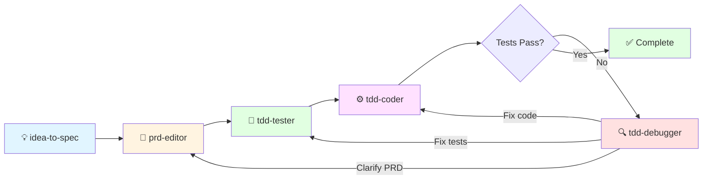

# CLAUDE.md

This file provides guidance to Claude Code (claude.ai/code) when working with code in this repository.

---

## ⚠️ IMPORTANT: Scratchpad Directory Rule

**ALWAYS use `.tmp/` directory for temporary files, NOT `/tmp/`**

```bash
# ✅ CORRECT
.tmp/scratchpad/
.tmp/docs/
.tmp/user-stories.md

# ❌ INCORRECT
/tmp/
/tmp/claude-*/scratchpad/
```

**Why**: `.tmp/` is project-scoped and persists across sessions. `/tmp/` is system-wide and ephemeral. All temporary work must use `.tmp/` to maintain context and avoid data loss.

---

## Common Development Commands (using `uv`)

| Goal | Command |
|------|---------|
| Install / sync dependencies | `uv sync` |
| Install in editable mode (for local development) | `uv sync --editable` |
| Run the minimal FastMCP hello‑world server | `uv run src/mcp.py` |
| Run the full NPL MCP server (launcher) | `uv run -m npl_mcp.launcher` |
| Run the console script (after editable install) | `npl-mcp` |
| Run unit tests (if test suite exists) | `uv run -m pytest` |
| Run a single test file | `uv run -m pytest path/to/test_file.py` |
| Lint the source code (using `ruff` – add as dev dep if needed) | `uvx ruff check src` |
| Format code (using `ruff` or `black`) | `uvx ruff format src` |
| Build a distributable wheel | `uv build` |

---

## YAML Index Management (using `yq`)

This project uses `yq` (YAML CLI) for managing relationship metadata in index files. **Version 3.4.3** is currently in use.

### yq Syntax Notes (v3.4.3)

The system uses `yq` version 3.4.3, which has different syntax than newer versions:

```bash
# CORRECT: Filter before flags, pipe output to file
yq -y 'filter_expression' input.yaml > output.yaml && mv output.yaml input.yaml

# INCORRECT: -i flag not supported in v3.4.3
yq -i 'filter' file.yaml  # ❌ Will fail

# INCORRECT: Filter after flags
yq '.filter' -y input.yaml  # ❌ Wrong order
```

### Common Operations

```bash
# Query a value
yq '.stories[] | select(.id == "US-001") | .title' docs/user-stories/index.yaml

# Add field to all items
yq -y '.stories |= map(.new_field = "value")' docs/user-stories/index.yaml > temp.yaml && mv temp.yaml docs/user-stories/index.yaml

# Update conditional fields
yq -y '.personas |= map(if .id == "P-001" then .related_stories = ["US-001"] else . end)' docs/personas/index.yaml > temp.yaml && mv temp.yaml docs/personas/index.yaml
```

### Index Files as Single Source of Truth

Relationship metadata is maintained in YAML index files, NOT in markdown files:
- **User stories** relationships: `docs/user-stories/index.yaml` (via `related_stories` and `related_personas` fields)
- **Personas** relationships: `docs/personas/index.yaml` (via `related_stories` field)

Markdown files describe content; YAML indexes describe structure. This separation enables version control of relationships independent from documentation content.

---

## Mise Task Runner Commands

The project uses [mise](https://mise.jdx.dev/) as a task runner. Tasks are defined in `.mise.toml`.

| Goal | Command |
|------|---------|
| Run the MCP server | `mise run run` |
| Run all tests (verbose) | `mise run test` |
| Run tests with coverage report | `mise run test-coverage` |
| Run tests with HTML coverage | `mise run test-html` |
| Quick test status (emoji only) | `mise run test-status` |
| Show failing tests or success | `mise run test-errors` |
| Debug a specific failing test | `mise run test-errors <test-name>` |
| Start server in background | `mise run start-server` |
| Stop the server | `mise run stop-server` |
| Check server status | `mise run status` |

**Recommended for TDD workflow:**
- Use `mise run test-status` for a quick pass/fail check
- Use `mise run test-errors` to see which tests are failing
- Use `mise run test-errors tests/test_file.py::test_name` to debug a specific test

---

## High‑Level Architecture

- **Entry points**
  - `src/mcp.py` – a tiny FastMCP server exposing a single `hello` tool; useful for quick experiments.
  - `src/npl_mcp/launcher.py` – the main entry point for the full NPL MCP server. It starts a unified FastAPI app, mounts the FastMCP SSE endpoint (`/sse`), and serves a Next.js‑based web UI when built.
  - Console script `npl-mcp` (defined in `pyproject.toml`) invokes `npl_mcp.launcher:main`.

- **Core Packages (`src/npl_mcp`)**
  - `unified.py` – builds the FastMCP instance with all tool definitions and returns an ASGI app.
  - `launcher.py` – orchestrates process management (PID file, singleton detection), starts the server via Uvicorn, and provides CLI flags (`--status`, `--stop`, `--config`, `--test`).
  - `storage/` – SQLite‑backed `Database` wrapper and schema migrations.
  - `artifacts/`, `reviews/` – manage versioned artifacts and review workflows.
  - `chat/`, `sessions/`, `tasks/` – abstractions for collaborative chat rooms, session grouping, and task queues.
  - `browser/` – utilities for headless browser interactions (screenshots, navigation, etc.).
  - `web/` – FastAPI routes for the web UI, session pages, chat rooms, and API endpoints.

- **Frontend** (outside of the Python package)
  - The Next.js UI lives under `worktrees/main/mcp-server/frontend`. When built (`npm install && npm run build`), static files are emitted to `src/npl_mcp/web/static` (mounted by the FastAPI app). The UI is optional for core server functionality.

---

## Development Workflow

1. **Sync dependencies** – `uv sync` ensures the virtual environment matches `pyproject.toml`.
2. **Edit code** – All source lives under `src/`. The package layout follows the conventional `src/`‑based structure, making imports clean (`import npl_mcp`).
3. **Run locally** – Use the commands above to spin up either the hello‑world server or the full NPL MCP server.
4. **Testing** – Add tests under a `tests/` directory. Run them with `uv run -m pytest`. Individual tests can be targeted with the file path.
5. **Lint / format** – Install `ruff` as a dev dependency (`uv add --dev ruff`) and run via `uvx ruff`.
6. **Packaging** – Build wheels with `uv build`; the resulting `dist/` directory contains a wheel that can be published to PyPI.

---

## Testing & TDD Best Practices

Follow Test-Driven Development (TDD) principles when working on this codebase:

1. **Write tests first** – Before implementing new functionality, write failing tests that define the expected behavior.
2. **Red-Green-Refactor** – Follow the TDD cycle:
   - **Red**: Write a failing test
   - **Green**: Write minimal code to make the test pass
   - **Refactor**: Clean up the code while keeping tests green
3. **Run tests frequently** – Execute the test suite after every significant change:
   ```bash
   uv run -m pytest              # Run all tests
   uv run -m pytest -x           # Stop on first failure
   uv run -m pytest --lf         # Run only last failed tests
   ```
4. **Maintain test coverage** – Ensure new code has corresponding tests. Aim for meaningful coverage of critical paths.
5. **Keep tests fast** – Unit tests should run quickly to encourage frequent execution.
6. **Test isolation** – Each test should be independent and not rely on state from other tests.
7. **Run full suite before commits** – Always run `uv run -m pytest` before committing to catch regressions.

---

## TDD Agent Workflow

This project uses a multi-agent orchestration system to transform feature ideas into tested, production-ready code through five specialized agents:



### Quick Reference

| Agent | Phase | Outputs |
|-------|-------|---------|
| **idea-to-spec** | Discovery | Personas, user stories |
| **prd-editor** | Specification | PRD documents (`.prd/`) |
| **tdd-tester** | Test Creation | Test suites (`tests/`) |
| **tdd-coder** | Implementation | Source code (`src/`) |
| **tdd-debugger** | Debug Loop | Diagnostics, fixes |

### Workflow Steps

1. **Pitch an idea** → `idea-to-spec` creates personas and user stories
2. **Generate PRD** → `prd-editor` creates detailed specifications
3. **Create tests** → `tdd-tester` writes comprehensive test suites
4. **Implement code** → `tdd-coder` autonomously implements features using `mise run test-status` and `mise run test-errors`
5. **Debug loop** → If blocked, `tdd-debugger` diagnoses issues and routes back to appropriate agent

### Key Commands for TDD Agents

```bash
mise run test-status    # Quick pass/fail check (used by tdd-coder)
mise run test-errors    # Detailed failure output (used by tdd-debugger)
```

**📖 For detailed workflow, agent interactions, and communication protocol, see [docs/arch/agent-orchestration.md](docs/arch/agent-orchestration.md)**

---

## Important Project Files

- `pyproject.toml` – defines the package (`npl_mcp`), dependencies, and the `npl-mcp` console script.
- `src/mcp.py` – minimal FastMCP example for quick prototyping.
- `src/npl_mcp/launcher.py` – CLI entry point; handles PID files, singleton checks, and server start/stop.
- `src/npl_mcp/unified.py` – registers all FastMCP tools and returns the ASGI app.
- `src/npl_mcp/web/app.py` – FastAPI application that mounts the MCP endpoint and serves UI routes.

---

## Cursor / Copilot Rules

If a `.cursor` or `.github/copilot-instructions.md` exists, follow any explicit guidelines they contain (e.g., naming conventions, test coverage expectations). Currently there are no such files at the repository root.

---

*End of CLAUDE.md*
