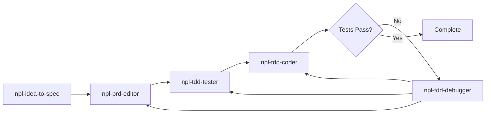

# CLAUDE.md

This file provides guidance to Claude Code (claude.ai/code) when working with code in this repository.

---

## Response Protocol

### Assumptions Table

Open every response with a table of assumptions made to resolve ambiguities, followed by a mermaid diagram response plan. Restate the request, show how context/knowledge/assumptions shape the response, lay out review steps, then follow the plan.

### Reflection Block

Append a self-review reflection block to the **end of every response**:

```
<npl-block type="reflection">
[one issue per line, emoji prefix, < 80 chars each]
</npl-block>
```

**Emoji indicators**: `✅` Verified | `🐛` Bug | `🔒` Security | `⚠️` Pitfall | `🚀` Improvement | `🧩` Edge Case | `📝` TODO | `🔄` Refactor | `❓` Question

Review for: correctness, security, edge cases, improvements, completeness. Always include at least one `✅`. Never skip this block.

---

## Scratchpad Directory Rule

**ALWAYS use `.tmp/` for temporary files, NOT `/tmp/`** (except plan files which cannot be saved here in plan mode).

`.tmp/` is project-scoped and persists across sessions. `/tmp/` is system-wide and ephemeral.

---

## Common Development Commands

| Goal | Command |
|------|---------|
| Sync dependencies | `uv sync` |
| Run full NPL MCP server | `uv run -m npl_mcp.launcher` |
| Run unit tests | `uv run -m pytest` |
| Run single test file | `uv run -m pytest path/to/test_file.py` |
| Lint | `uvx ruff check src` |
| Format | `uvx ruff format src` |
| Build wheel | `uv build` |

---

## YAML Index Management (`yq` v3.4.3)

```bash
# CORRECT: Filter before flags, pipe to file (no -i flag in v3.4.3)
yq -y 'filter_expression' input.yaml > temp.yaml && mv temp.yaml input.yaml
```

Relationship metadata lives in YAML index files, NOT markdown:
- `project-management/user-stories/index.yaml` (stories + relationships)
- `project-management/personas/index.yaml` (personas + relationships)

---

## High-Level Architecture

- **Entry point**: `src/npl_mcp/launcher.py` - starts FastAPI app, mounts FastMCP SSE (`/sse`)
- **`unified.py`** - builds FastMCP instance with all tool definitions, returns ASGI app
- **`storage/`** - PostgreSQL async wrapper (asyncpg)
- **`artifacts/`, `reviews/`** - versioned artifacts and review workflows
- **`chat/`, `sessions/`, `tasks/`** - chat rooms, sessions, task queues
- **`browser/`** - headless browser stubs
- **`web/`** - FastAPI routes for web UI and API
- **`meta_tools/`** - ToolSummary, ToolSearch discovery layer
- **`pm_tools/`** - PRD/story/persona tools

---

## Feature Implementation Workflow

**MANDATORY for all features, bug fixes, and refactors.** Direct edit OK for docs and config only.



| Phase | Agent | Output |
|-------|-------|--------|
| 1. Discovery | `npl-idea-to-spec` | Personas, user stories |
| 2. Specification | `npl-prd-editor` | PRD in `project-management/PRDs/` |
| 3. Tests First | `npl-tdd-tester` | Test suite in `tests/` |
| 4. Implementation | `npl-tdd-coder` | Source code in `src/` |
| 5. Debug (if needed) | `npl-tdd-debugger` | Root cause analysis, routing |

**Requirements**: All tests pass. Coverage >= 80% for new code, 100% for critical paths.

**Anti-patterns**: Writing code without PRD. Writing PRDs manually. Creating tests after code.

See [docs/arch/agent-orchestration.md](docs/arch/agent-orchestration.md) for detailed protocol.

---

## Testing

```bash
uv run -m pytest              # All tests
uv run -m pytest -x           # Stop on first failure
uv run -m pytest --lf         # Rerun last failed
```

TDD cycle: Red (failing test) -> Green (minimal code) -> Refactor. Run full suite before commits.

---

## Parallel Task Agent Pattern

Save shared prompt templates to `./sub-agent-prompts/{task-name}.md`. Test with one agent first, then spawn remaining agents in parallel with per-agent parameters. See templates for conventions.

---

## Reference Documentation

- **FastMCP 2.x guides**: `docs/resources/fastmcp/` (01-installation through 10-examples)
- **[Documentation Index](docs/DOCUMENTATION-INDEX.md)** - master navigation
- **[Roadmap](docs/roadmap.yaml)** | **[Features Grid](docs/features-grid.md)** | **[Architecture](docs/PROJ-ARCH.md)**

---

## Key Project Files

- `pyproject.toml` - package definition, dependencies, `npl-mcp` console script
- `src/npl_mcp/launcher.py` - CLI entry point (PID, singleton, Uvicorn)
- `src/npl_mcp/unified.py` - FastMCP tool registrations, ASGI app
- `src/npl_mcp/web/app.py` - FastAPI app mounting MCP + UI routes

---

*End of CLAUDE.md*
