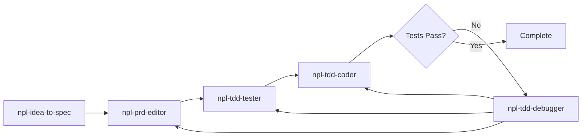

# CLAUDE.md

This file provides guidance to Claude Code (claude.ai/code) when working with code in this repository.

---

## Session Initialization (MANDATORY — DO THIS FIRST)

**BLOCKING REQUIREMENT**: Before doing ANY work — before reading files, answering questions, or executing tasks — you MUST generate a session. No exceptions. This is the absolute first action in every conversation.

The `$NPL_PROJECT` environment variable MUST be set.

### Single-Call Session Init

If the task is already clear from the user's first message, create a **task session directly** — no separate root session needed:

```
ToolSession.Generate(
    agent="<agent-name>",
    brief="<what this task does>",
    task="<task-slug>",
    project=$NPL_PROJECT
)
```

Save the returned UUID — it is both the **root** and **task session ID** for this conversation.

### Deferred Task Session (exploratory/unclear intent)

If the user's intent is unclear and you need to explore first, create a root session:

```
ToolSession.Generate(
    agent="Root",
    brief="Session: <ISO8601 timestamp with ms>",
    task="root",
    project=$NPL_PROJECT
)
```

Then create child sessions as work items become clear:

```
ToolSession.Generate(
    agent="<agent-name>",
    brief="<what this task does>",
    task="<task-slug>",
    project=$NPL_PROJECT,
    parent="<root-session-uuid>"
)
```

### Sub-Agent Hierarchy

When spawning sub-agents, always pass the parent session UUID. Use root for top-level tasks, or the task session for sub-tasks within that scope.

### Instructions Require Sessions

`Instructions` and `Instructions.Create` require a valid session UUID. You cannot use them without completing session initialization.

**If the MCP server is unavailable or `$NPL_PROJECT` is not set, inform the user immediately and do not proceed until resolved.**

---

## Project Documentation (Agentic Reference)

Three documentation files provide a structured understanding of the codebase. **Consult these before any task that requires knowledge of project structure, architecture, or data model.** Each has a `.summary.md` companion for quick lookups.

| Document | Purpose | Summary |
|----------|---------|---------|
| [`docs/PROJ-LAYOUT.md`](docs/PROJ-LAYOUT.md) | Directory tree with descriptions of what each directory and key file contains | `docs/PROJ-LAYOUT.summary.md` |
| [`docs/PROJ-ARCH.md`](docs/PROJ-ARCH.md) | High-level architecture: components, diagrams, design decisions, tech stack | `docs/PROJ-ARCH.summary.md` |
| [`docs/PROJ-SCHEMA.md`](docs/PROJ-SCHEMA.md) | Database schema: ERDs (Mermaid + PlantUML), table details, indexes, migrations | `docs/PROJ-SCHEMA.summary.md` |

### When to Reference

- **PROJ-LAYOUT** — Finding files, understanding directory organization, locating entry points or config files.
- **PROJ-ARCH** — Understanding component relationships, data flow, infrastructure, or design rationale. Detailed sections live in `docs/arch/*.md`.
- **PROJ-SCHEMA** — Writing queries, creating migrations, understanding table relationships or column types. Detailed domain breakdowns live in `docs/schema/*.md`.

### Overflow Structure

Each doc stays concise by extracting detail into subdirectories:

```
docs/
├── PROJ-LAYOUT.md          + layout/*.md
├── PROJ-ARCH.md            + arch/*.md
├── PROJ-SCHEMA.md          + schema/*.md
└── *.summary.md            (compact versions for quick reference)
```

Summary files contain the same structure in condensed form (no PlantUML, shorter descriptions) — prefer these for fast orientation, then read the full doc or subdirectory file when detail is needed.

### Maintenance

These docs are maintained via update commands (`/update-layout-doc`, `/update-arch-doc`, `/update-schema-doc`). When your work changes project structure, architecture, or schema, flag that the corresponding doc may need updating.

---

## Response Protocol

### Assumptions Table

Open every response with a table of assumptions made to resolve ambiguities, followed by a mermaid diagram response plan. Restate the request, show how context/knowledge/assumptions shape the response, lay out review steps, then follow the plan.

### Reflection Block

Append a self-review reflection block to the **end of every response**:

```
<npl-block type="reflection">
[one issue per line, emoji prefix, < 80 chars each]
</npl-block>
```

**Emoji indicators**: `✅` Verified | `🐛` Bug | `🔒` Security | `⚠️` Pitfall | `🚀` Improvement | `🧩` Edge Case | `📝` TODO | `🔄` Refactor | `❓` Question

Review for: correctness, security, edge cases, improvements, completeness. Always include at least one `✅`. Never skip this block.

---

## Scratchpad Directory Rule

**ALWAYS use `.tmp/` for temporary files, NOT `/tmp/`** (except plan files which cannot be saved here in plan mode).

`.tmp/` is project-scoped and persists across sessions. `/tmp/` is system-wide and ephemeral.

---

## Common Development Commands

| Goal | Command |
|------|---------|
| Sync dependencies | `uv sync` |
| Run full NPL MCP server | `uv run -m npl_mcp.launcher` |
| Run unit tests | `uv run -m pytest` |
| Run single test file | `uv run -m pytest path/to/test_file.py` |
| Lint | `uvx ruff check src` |
| Format | `uvx ruff format src` |
| Build wheel | `uv build` |

---

## YAML Index Management (`yq` v3.4.3)

```bash
# CORRECT: Filter before flags, pipe to file (no -i flag in v3.4.3)
yq -y 'filter_expression' input.yaml > temp.yaml && mv temp.yaml input.yaml
```

Relationship metadata lives in YAML index files, NOT markdown:
- `project-management/user-stories/index.yaml` (stories + relationships)
- `project-management/personas/index.yaml` (personas + relationships)

---

## MCP Tool Discovery

This server uses a **meta-discovery pattern**. 5 Discovery tools are always visible: `ToolSummary`, `ToolSearch`, `ToolDefinition`, `ToolHelp`, and `ToolCall`. All ~124 catalog tools are discoverable via these tools.

**Use `ToolCall` to invoke any catalog tool by name** (e.g. `ToolCall(tool="Ping", arguments={"url": "https://example.com"})`).

---

## High-Level Architecture

- **Entry point**: `src/npl_mcp/launcher.py` - creates FastMCP instance, registers tools, starts FastAPI + Uvicorn
- **`storage/`** - PostgreSQL async wrapper (asyncpg)
- **`artifacts/`** - versioned artifact management (stubs)
- **`chat/`, `sessions/`, `tasks/`** - chat rooms, sessions, task queues (stubs)
- **`browser/`** - ToMarkdown, Ping, Download, Screenshot, Rest, Secret
- **`meta_tools/`** - ToolSummary, ToolSearch, ToolDefinition, ToolHelp, ToolCall
- **`pm_tools/`** - PRD/story/persona tools
- **`instructions/`** - versioned instruction documents with embeddings
- **`tool_sessions/`** - session tracking by (project, agent, task)

---

## Feature Implementation Workflow

**MANDATORY for all features, bug fixes, and refactors.** Direct edit OK for docs and config only.



| Phase | Agent | Output |
|-------|-------|--------|
| 1. Discovery | `npl-idea-to-spec` | Personas, user stories |
| 2. Specification | `npl-prd-editor` | PRD in `project-management/PRDs/` |
| 3. Tests First | `npl-tdd-tester` | Test suite in `tests/` |
| 4. Implementation | `npl-tdd-coder` | Source code in `src/` |
| 5. Debug (if needed) | `npl-tdd-debugger` | Root cause analysis, routing |

**Requirements**: All tests pass. Coverage >= 80% for new code, 100% for critical paths.

**Anti-patterns**: Writing code without PRD. Writing PRDs manually. Creating tests after code.

See [docs/arch/agent-orchestration.md](docs/arch/agent-orchestration.md) for detailed protocol.

---

## Testing

```bash
uv run -m pytest              # All tests
uv run -m pytest -x           # Stop on first failure
uv run -m pytest --lf         # Rerun last failed
```

TDD cycle: Red (failing test) -> Green (minimal code) -> Refactor. Run full suite before commits.

---

## Parallel Task Agent Pattern

Save shared prompt templates to `./sub-agent-prompts/{task-name}.md`. Test with one agent first, then spawn remaining agents in parallel with per-agent parameters. See templates for conventions.

---

## Reference Documentation

- **FastMCP 2.x guides**: `docs/reference/fastmcp/` (01-installation through 10-examples)
- **[Features Grid](docs/features-grid.md)** | **[Architecture](docs/PROJ-ARCH.md)**

---

## Key Project Files

- `pyproject.toml` - package definition, dependencies, `npl-mcp` console script
- `src/npl_mcp/launcher.py` - CLI entry point (PID, singleton, Uvicorn, tool registrations)

---

*End of CLAUDE.md*
