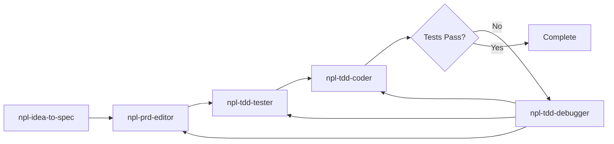

# CLAUDE.md

This file provides guidance to Claude Code (claude.ai/code) when working with code in this repository.

---

## Session Initialization (MANDATORY — DO THIS FIRST)

**BLOCKING REQUIREMENT**: Before doing ANY work — before reading files, answering questions, or executing tasks — you MUST generate a session. No exceptions. This is the absolute first action in every conversation.

The `$NPL_PROJECT` environment variable MUST be set.

### Single-Call Session Init

If the task is already clear from the user's first message, create a **task session directly** — no separate root session needed:

```
ToolSession.Generate(
    agent="<agent-name>",
    brief="<what this task does>",
    task="<task-slug>",
    project=$NPL_PROJECT
)
```

Save the returned UUID — it is both the **root** and **task session ID** for this conversation.

### Deferred Task Session (exploratory/unclear intent)

If the user's intent is unclear and you need to explore first, create a root session:

```
ToolSession.Generate(
    agent="Root",
    brief="Session: <ISO8601 timestamp with ms>",
    task="root",
    project=$NPL_PROJECT
)
```

Then create child sessions as work items become clear:

```
ToolSession.Generate(
    agent="<agent-name>",
    brief="<what this task does>",
    task="<task-slug>",
    project=$NPL_PROJECT,
    parent="<root-session-uuid>"
)
```

### Sub-Agent Hierarchy

When spawning sub-agents, always pass the parent session UUID. Use root for top-level tasks, or the task session for sub-tasks within that scope.

### Instructions Require Sessions

`Instructions` and `Instructions.Create` require a valid session UUID. You cannot use them without completing session initialization.

**If the MCP server is unavailable or `$NPL_PROJECT` is not set, inform the user immediately and do not proceed until resolved.**

---

## Project Documentation (Agentic Reference)

Three documentation files provide a structured understanding of the codebase. **Consult these before any task that requires knowledge of project structure, architecture, or data model.** Each has a `.summary.md` companion for quick lookups.

| Document | Purpose | Summary |
|----------|---------|---------|
| [`docs/PROJ-LAYOUT.md`](docs/PROJ-LAYOUT.md) | Directory tree with descriptions of what each directory and key file contains | `docs/PROJ-LAYOUT.summary.md` |
| [`docs/PROJ-ARCH.md`](docs/PROJ-ARCH.md) | High-level architecture: components, diagrams, design decisions, tech stack | `docs/PROJ-ARCH.summary.md` |
| [`docs/PROJ-SCHEMA.md`](docs/PROJ-SCHEMA.md) | Database schema: ERDs (Mermaid + PlantUML), table details, indexes, migrations | `docs/PROJ-SCHEMA.summary.md` |

### When to Reference

- **PROJ-LAYOUT** — Finding files, understanding directory organization, locating entry points or config files.
- **PROJ-ARCH** — Understanding component relationships, data flow, infrastructure, or design rationale. Detailed sections live in `docs/arch/*.md`.
- **PROJ-SCHEMA** — Writing queries, creating migrations, understanding table relationships or column types. Detailed domain breakdowns live in `docs/schema/*.md`.

### Overflow Structure

Each doc stays concise by extracting detail into subdirectories:

```
docs/
├── PROJ-LAYOUT.md          + layout/*.md
├── PROJ-ARCH.md            + arch/*.md
├── PROJ-SCHEMA.md          + schema/*.md
└── *.summary.md            (compact versions for quick reference)
```

Summary files contain the same structure in condensed form (no PlantUML, shorter descriptions) — prefer these for fast orientation, then read the full doc or subdirectory file when detail is needed.

### Maintenance

These docs are maintained via update commands (`/update-layout-doc`, `/update-arch-doc`, `/update-schema-doc`). When your work changes project structure, architecture, or schema, flag that the corresponding doc may need updating.

---

## Response Protocol

### Assumptions Table

Open every response with a table of assumptions made to resolve ambiguities, followed by a mermaid diagram response plan. Restate the request, show how context/knowledge/assumptions shape the response, lay out review steps, then follow the plan.

### Reflection Block

Append a self-review reflection block to the **end of every response**:

```
<npl-block type="reflection">
[one issue per line, emoji prefix, < 80 chars each]
</npl-block>
```

**Emoji indicators**: `✅` Verified | `🐛` Bug | `🔒` Security | `⚠️` Pitfall | `🚀` Improvement | `🧩` Edge Case | `📝` TODO | `🔄` Refactor | `❓` Question

Review for: correctness, security, edge cases, improvements, completeness. Always include at least one `✅`. Never skip this block.

---

## Scratchpad Directory Rule

**ALWAYS use `.tmp/` for temporary files, NOT `/tmp/`** (except plan files which cannot be saved here in plan mode).

`.tmp/` is project-scoped and persists across sessions. `/tmp/` is system-wide and ephemeral.

---

## Stack Overview

The product is a **three-container stack**: **Next.js 15** frontend (`frontend/`), **Phoenix 1.8** (Elixir) API backend (`backend/`) serving the NPLLoad/NPLSpec MCP at `/mcp` and REST at `/api/v1/npl/*`, and an **nginx** reverse proxy — sharing **Postgres** (PostGIS, pgvector) and **Redis**. Schema is Liquibase-canonical (`liquibase/`) + Ecto app-level; deployment is CI-driven to Kubernetes via the Helm chart in `helm/`.

A secondary Python toolchain (`src/npl_mcp`, uv-managed) provides local/regen tooling — most notably `npl-docs-regen`, which regenerates `npl/npl-full.md` from `conventions/*.yaml`.

## Common Development Commands

Primary (Docker Compose stack — see Makefile):

| Goal | Command |
|------|---------|
| Generate .env files | `make init` |
| Build all images (backend/frontend/nginx) | `make build` |
| Start the stack (nginx on :8080) | `make run` |
| Dev mode (hot reload, foreground) | `make run-dev` |
| Dev mode (detached) | `make run-dev-d` |
| Tail dev logs / tear down dev | `make logs-dev` / `make stop-dev` |
| Run Liquibase migrations | `make migrate` |
| Show pending changesets | `make migrate-status` |
| Roll back last changeset | `make migrate-rollback` |
| Migrations + seeds | `make dev-setup` |
| IEx shell in backend container | `make dev-shell-backend` |
| Regenerate design-system CSS | `make regen` |
| Lint / package / publish Helm chart | `make helm-lint` / `make helm-package` / `make helm-publish` |

Secondary (Python tooling in `src/npl_mcp`, uv-managed):

```bash
uv sync                      # sync Python deps
uv run npl-mcp               # run the legacy standalone Python MCP server
uv run -m pytest             # Python test suite (tests/)
uvx ruff check src           # lint
uvx ruff format src          # format
```

---

## YAML Index Management (`yq` v3.4.3)

```bash
# CORRECT: Filter before flags, pipe to file (no -i flag in v3.4.3)
yq -y 'filter_expression' input.yaml > temp.yaml && mv temp.yaml input.yaml
```

Relationship metadata lives in YAML index files, NOT markdown:
- `project-management/user-stories/index.yaml` (stories + relationships)
- `project-management/personas/index.yaml` (personas + relationships)

---

## MCP Tool Discovery

This server is the **NPL syntax MCP**. Two tools are visible: `NPLLoad` and `NPLSpec`. No authentication is required. Agent-kit work tools live in a separate repo.

**Use `ToolCall` to invoke any catalog tool by name** (e.g. `ToolCall(tool="Ping", arguments={"url": "https://example.com"})`).

---

## NPL Convention Loading

The `conventions/*.yaml` directory is the **single source of truth** for NPL syntax definitions. Two MCP tools expose it:

| Tool | Input | When to use |
|------|-------|-------------|
| `NPLLoad` | Expression DSL: `"syntax#placeholder:+2 directives -pumps"` | Quick agent-facing snippet retrieval. Prefer for ad-hoc loading. |
| `NPLSpec` | Structured `ComponentSpec` list + flags | Full spec generation with `⌜NPL@1.0⌝` markers, dependency resolution, and extension blocks. |

### Expression DSL (NPLLoad)

Space-separated terms, each of the form `section[#component][:+priority]`. Prefix `-` to subtract.

```
# A single full section
NPLLoad(expression="syntax")

# One specific component
NPLLoad(expression="pumps#chain-of-thought")

# Multiple sections with priority filter
NPLLoad(expression="syntax:+2 directives:+2")

# Multi-section with subtraction
NPLLoad(expression="syntax directives -syntax#literal-string")

# Alternate layout
NPLLoad(expression="pumps", layout="grouped")
```

Sections: `syntax`, `declarations`, `directives`, `prefixes`, `prompt-sections`, `special-sections`, `pumps`, `fences`.
Layouts: `yaml_order` (default), `classic`, `grouped`.

### Full-spec generation (NPLSpec)

Use for generating the complete framework block (wrapped in `⌜NPL@1.0⌝...⌞NPL@1.0⌟`), for example when bootstrapping a prompt for a new agent or regenerating `npl/npl-full.md`:

```
NPLSpec(components=[], concise=True)          # all conventions, concise mode
NPLSpec(components=[ComponentSpec(spec="syntax#placeholder")])  # subset
```

### Regenerating `npl-full.md`

`npl/npl-full.md` is a **generated artifact** rendered from `conventions/*.yaml` via `NPLSpec`:

```bash
uv run npl-docs-regen            # regenerate in place
uv run npl-docs-regen --check    # exit non-zero if the file is stale (pre-commit guard)
uv run npl-docs-regen --stdout   # preview without writing
```

---

## High-Level Architecture

Primary stack (Phoenix + Next.js, per `README.md` and `docs/PROJ-ARCH.md`):

- **`frontend/`** — Next.js 15 public landing + signed-in conventions admin (Authentik OIDC for sign-in only; MCP endpoint itself is open)
- **`backend/`** — Phoenix 1.8 (Elixir): NPLLoad/NPLSpec MCP at `/mcp`, REST `/api/v1/npl/*`, optional PKCE OAuth issuing site-approval tokens (`sub=site:npl`), Weaviate-backed semantic MCP tool search
- **`nginx/`** — reverse proxy (frontend at `/`, backend at `/api/*` and `/mcp`)
- **`liquibase/`** — canonical schema changelogs; `backend/db` for Ecto/liquibase wiring
- **`helm/`** — Kubernetes chart; CI-driven deploys, secrets via Infisical

Secondary Python tooling (`src/npl_mcp/` — legacy standalone MCP + local regen tooling):

- **`launcher.py`** — FastMCP instance, FastAPI + Uvicorn entry point (`uv run npl-mcp`)
- **`docs_regen.py`** — regenerates `npl/npl-full.md` from `conventions/*.yaml`
- Additional stub modules (`storage/`, `chat/`, `sessions/`, `tasks/`, `meta_tools/`, `pm_tools/`, `instructions/`, `tool_sessions/`) belong to the legacy Python server, superseded by the Phoenix backend + agent-kit-mcp.

---

## Feature Implementation Workflow

**MANDATORY for all features, bug fixes, and refactors.** Direct edit OK for docs and config only.


```mermaid
flowchart LR
    A[npl-idea-to-spec] --> B[npl-prd-editor]
    B --> C[npl-tdd-tester]
    C --> D[npl-tdd-coder]
    D --> E{Tests Pass?}
    E -->|No| F[npl-tdd-debugger]
    F --> C & B & D
    E -->|Yes| G[Complete]
```

| Phase | Agent | Output |
|-------|-------|--------|
| 1. Discovery | `npl-idea-to-spec` | Personas, user stories |
| 2. Specification | `npl-prd-editor` | PRD in `project-management/PRDs/` |
| 3. Tests First | `npl-tdd-tester` | Test suite in `tests/` |
| 4. Implementation | `npl-tdd-coder` | Source code in `src/` |
| 5. Debug (if needed) | `npl-tdd-debugger` | Root cause analysis, routing |

**Requirements**: All tests pass. Coverage >= 80% for new code, 100% for critical paths.

**Anti-patterns**: Writing code without PRD. Writing PRDs manually. Creating tests after code.

See [docs/arch/agent-orchestration.md](docs/arch/agent-orchestration.md) for detailed protocol.

---

## Testing

Phoenix backend (ExUnit):

```bash
cd backend && mix test        # All tests
```

Python tooling (`src/npl_mcp`, `tests/`):

```bash
uv run -m pytest              # All tests
uv run -m pytest -x           # Stop on first failure
uv run -m pytest --lf         # Rerun last failed
```

TDD cycle: Red (failing test) -> Green (minimal code) -> Refactor. Run relevant suite before commits.

---

## Parallel Task Agent Pattern

Save shared prompt templates to `./sub-agent-prompts/{task-name}.md`. Test with one agent first, then spawn remaining agents in parallel with per-agent parameters. See templates for conventions.

---

## Reference Documentation

- **FastMCP 2.x guides**: `docs/reference/fastmcp/` (01-installation through 10-examples)
- **[Features Grid](docs/features-grid.md)** | **[Architecture](docs/PROJ-ARCH.md)**

---

## Key Project Files

- `Makefile` - primary build/run/deploy targets (Docker Compose stack, Liquibase, Helm)
- `conventions/*.yaml` - single source of truth for NPL syntax sections
- `backend/` - Phoenix app (`noizu_prompt_lingua`)
- `frontend/` - Next.js app
- `pyproject.toml` - Python tooling definition (`npl-mcp`, `npl-docs-regen` console scripts)
- `src/npl_mcp/launcher.py` - legacy Python MCP entry point

---

## Monorepo policy addendum (2026-09)

- Monorepo-wide ops (secrets/dc, terraform, submodules, deploy tiers, doc map incl. `docs/SUBS.md`): see `../../../CLAUDE.md` at the trl-infra root. This repo's own session-init/MCP guidance above remains authoritative for NPL work.

---

*End of CLAUDE.md*

## Worktrees — Canonical Convention (REQUIRED)

All work happens on git worktrees, created from **this repo's own `.git`** — never work directly on a shared checkout of `develop`/`main`.

- **Placement (fixed):** every worktree lives inside this repo's checkout at **`.claude/worktrees/<name>/`** — never siblings (`<repo>.worktrees/`), never ad-hoc paths. Matches Claude Code's native worktree tooling, so harness-created and manual worktrees coexist.
- **Naming:** `<name>` = branch name with `/` → `-` (branch `feature/vfs-wave1` → `.claude/worktrees/feature-vfs-wave1`).
- **Creation** — from this repo's own `.git`, based on `develop` (never `main`):
  ```bash
  git -C <this-repo> worktree add .claude/worktrees/<name> -b <branch> develop
  ```
- **Hygiene:** `.claude/worktrees/` is gitignored in this repo; never commit its contents. One worktree per task; remove it when the work lands (`git worktree remove .claude/worktrees/<name>` — keep the branch).
- **Addressing:** `git -C <this-repo>/.claude/worktrees/<name> …`; verify branch + clean index before any git write; no `git stash`.
- **Elixir projects:** the MAIN checkout owns `deps/` + `_build/`; each worktree symlinks `deps` (and `_build` where needed) to the canonical checkout by **absolute path** — no per-worktree re-fetch/recompile.
- **Legacy placements** (`.worktrees/`, `.wt/`, `<repo>.worktrees/` siblings, `staging/`) are grandfathered — do not create new ones; migrate opportunistically. `staging/` remains local-only experiments (never pushed/submoduled).
- **Branch & PR policy unchanged:** worktree branches fork from `develop`; PRs target `develop`; `main` is CI/CD-only (automation merges only).
