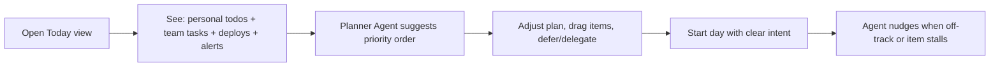
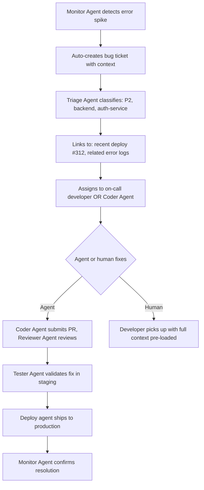
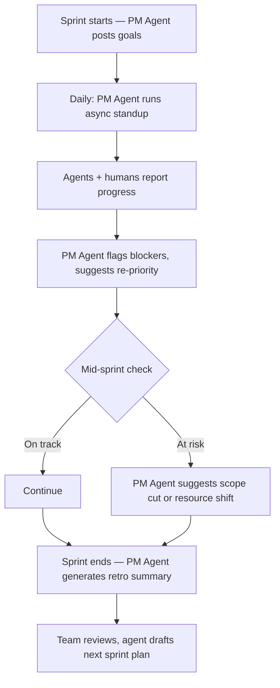
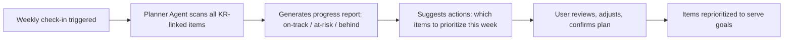
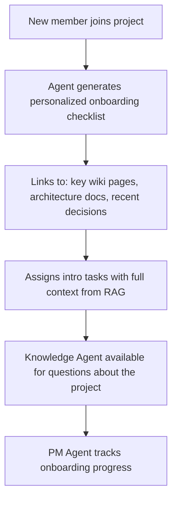

# tobornalp — AI-Native Operational Life Platform

**Domain:** [tobornalp.com](https://tobornalp.com)

## Elevator Pitch

**Your entire operational life — personal, professional, and everything between — managed by a team of AI agents that actually understand your work.** tobornalp is an all-in-one platform that unifies personal todos, team projects, CI/CD pipelines, bug tracking, site monitoring, wiki/documentation, and OKR-driven life planning into a single AI-native surface. Agents aren't assistants bolted onto a human tool — they're virtual team members: coders, testers, reviewers, monitors, project managers, and coordinators who work alongside you.

Every methodology supported (scrum, agile, waterfall, kanban, GTD, or your own hybrid). Every scale covered (personal checklist → enterprise portfolio). Every integration connected through MCP with RAG over your entire operational context.

Think: Notion + Linear + Todoist + StatusPage + Wiki — but the AI isn't a feature, it's a co-worker.

---

## Problem

### 1. The Tool Fragmentation Tax

A working professional's operational stack in 2025:

| Need | Tool | Isolation |
|------|------|-----------|
| Personal todos | Todoist / Apple Reminders | Silo |
| Team tasks | Jira / Linear / Asana | Silo |
| Documentation | Notion / Confluence / Google Docs | Silo |
| CI/CD | GitHub Actions / GitLab CI | Silo |
| Bug tracking | Jira / Linear / GitHub Issues | Silo |
| Monitoring | Datadog / Uptime Robot / Grafana | Silo |
| Goals/OKRs | Lattice / 15Five / a spreadsheet | Silo |
| Life planning | Calendar / notebook / vibes | Silo |

Each tool knows one slice of your life. None of them talk to each other meaningfully. An AI agent working in your task tracker can't see your deployment pipeline failing. Your monitoring tool can't auto-create a bug ticket with the right context. Your personal todos have zero awareness of your team commitments. Your OKRs live in a separate tool from the actual work that drives them.

**The integration tax is enormous.** Every connection is a brittle webhook, a Zapier recipe, or a manual copy-paste. And even "integrated" tools share *data* but not *context* — they don't understand *why* things are connected.

### 2. AI Is an Afterthought in Existing PM Tools

Every major PM tool has added "AI features" — Jira has Atlassian Intelligence, Linear has AI auto-triage, Notion has Notion AI. But these are decorations on fundamentally human-designed systems:

- The data models are designed for human input and human reading
- AI can summarize or suggest but can't *act as a team member*
- No tool treats an AI agent as a first-class participant with its own tasks, responsibilities, and accountability
- No tool provides RAG over the full project context to ground agent actions

The gap: **no operational platform is designed from the ground up for human-agent teams** — where agents don't just assist but actually *do work*, *report status*, *flag issues*, and *coordinate with other agents and humans*.

### 3. Personal and Professional Are Artificially Separated

"Pick up groceries" and "deploy the API update" live in different tools, tracked differently, with no unified view of your day or week. But cognitive load doesn't respect tool boundaries — you need to see *everything* that competes for your time in one place.

GTD practitioners have known this for decades: the inbox must capture everything. But no tool combines personal task management with professional project management with life goals and OKR tracking in a way that doesn't feel like a janky all-in-one.

### 4. The Context Gap

When a developer picks up a bug ticket, they need:
- The error logs from monitoring
- The recent deployment history from CI/CD
- The related code changes from git
- The original feature spec from the wiki
- The user report from support

Today, they open 5 tabs and manually reconstruct context. An AI agent assigned to the same ticket faces the same problem — but it could *solve* it if the platform provided unified RAG over all operational data.

---

## Solution: The Operational Life Platform

### Core Philosophy

**One surface. Every scale. Agents everywhere.**

tobornalp is built on three foundational principles:

1. **Unified context** — All your operational data (tasks, docs, deployments, monitoring, goals) lives in one graph. RAG over this graph gives every agent full situational awareness.
2. **Agents as team members** — AI agents aren't tools you use; they're colleagues assigned to roles. A monitoring agent watches your sites. A triage agent routes incoming bugs. A coding agent picks up implementation tasks. A PM agent runs your standup.
3. **Scale-free design** — The same primitives (items, lists, projects, spaces) work for a personal grocery list, a sprint backlog, an enterprise portfolio, and everything between. Methodology is a *view* on top of universal primitives, not a structural constraint.

### The Unified Data Model

```
┌─────────────────────────────────────────────────────────────────┐
│                    tobornalp Data Graph                       │
│                                                                   │
│  ┌──────────┐  ┌──────────┐  ┌──────────┐  ┌──────────────────┐ │
│  │  Items   │  │  Docs    │  │  Events  │  │  Signals         │ │
│  │          │  │          │  │          │  │                  │ │
│  │ • Todos  │  │ • Wiki   │  │ • Deploy │  │ • Alerts         │ │
│  │ • Tasks  │  │ • Specs  │  │ • Build  │  │ • Metrics        │ │
│  │ • Bugs   │  │ • Notes  │  │ • Release│  │ • Uptime         │ │
│  │ • Epics  │  │ • Runbook│  │ • Commit │  │ • Errors         │ │
│  │ • Goals  │  │ • ADR    │  │ • Review │  │ • Performance    │ │
│  └────┬─────┘  └────┬─────┘  └────┬─────┘  └────────┬─────────┘ │
│       │              │              │                  │           │
│       └──────────────┴──────────────┴──────────────────┘           │
│                              │                                     │
│                    ┌─────────▼──────────┐                          │
│                    │   Context Graph    │                          │
│                    │   (RAG substrate)  │                          │
│                    └─────────┬──────────┘                          │
│                              │                                     │
│                    ┌─────────▼──────────┐                          │
│                    │   Agent Layer      │                          │
│                    │   (MCP protocol)   │                          │
│                    └────────────────────┘                          │
│                                                                   │
└───────────────────────────────────────────────────────────────────┘
```

### What Makes It Different

**Scale-free primitives.** An "item" is the universal unit. A personal todo, a sprint task, a bug report, and an OKR key result are all items with different metadata shapes. This means a personal checklist and a team kanban board use the same engine — your grocery run and your deployment checklist have the same first-class status.

**Methodology as a lens.** Scrum, kanban, waterfall, GTD — these aren't different systems, they're different *views* on the same underlying items and relationships. Switch views without migrating data. Run scrum for your dev team and kanban for your design team in the same project. Use GTD for personal items and no methodology at all for quick checklists.

**RAG over everything.** Every item, document, event, and signal feeds into a unified context graph. When an agent picks up a task, it has access to the full history: related conversations, deployment logs, monitoring data, wiki pages, past decisions. When *you* pick up a task, the platform surfaces the same context — no more 5-tab reconstructions.

**Agents as virtual team members.** Agents have profiles, roles, permissions, and accountability. They're assigned to tasks. They report in standups. They flag blockers. They can be praised or corrected. They show up in the team view alongside humans.

**Personal + professional unified.** One inbox captures everything. Your personal OKRs ("exercise 4x/week", "read 2 books/month") live alongside your professional KRs ("reduce p95 latency by 30%", "ship feature X by Q3"). Both connect to items that track the actual work.

---

## Feature Domains

### 1. Personal Todos & Life Management

| Feature | Description |
|---------|-------------|
| **Quick capture** | Universal inbox — text, voice, screenshot, email-forward. Everything lands here first. |
| **Smart lists** | Auto-organized by context (home, work, errands, waiting-for). GTD-native but not GTD-required. |
| **Daily planner** | Today view that pulls from all sources: personal todos, team tasks, calendar, habits. |
| **Recurring items** | Habits, routines, maintenance tasks. Streak tracking. Agent nudges when you slip. |
| **Life OKRs** | Set personal objectives and key results. Link daily items to life goals. See how your daily choices serve your bigger picture. |
| **Financial hooks** (future) | Budget items as todos. Savings goals as OKRs. Expense categorization. Investment tracking tied to financial independence KRs. |

### 2. Team Projects & Methodologies

| Feature | Description |
|---------|-------------|
| **Scrum** | Sprints, story points, velocity tracking, burndown charts, sprint planning, retros. |
| **Kanban** | Customizable columns, WIP limits, cycle time, flow metrics, swim lanes. |
| **Waterfall** | Phase gates, Gantt-style views, milestone tracking, dependency chains. |
| **Agile hybrid** | Mix and match. Shape Up cycles, dual-track, SAFe-lite. No methodology police. |
| **Custom workflows** | Define your own states, transitions, automations, and agent triggers per project. |
| **Team views** | Who's working on what, capacity planning, workload balance, agent + human unified. |

### 3. Bug Tracking & Issue Management

| Feature | Description |
|---------|-------------|
| **Report intake** | Multi-channel: in-app form, email, monitoring auto-creation, API, browser extension. |
| **Auto-triage agent** | AI classifies severity, assigns component, suggests assignee, links related issues. |
| **Reproduction assistant** | Agent attempts to reproduce bugs in sandbox environments, attaches findings. |
| **Root cause linking** | Connect bugs to deployments, commits, and config changes automatically via event correlation. |
| **SLA tracking** | Response time and resolution time targets per severity. Escalation rules. Agent alerts on approaching deadlines. |

### 4. CI/CD Integration

| Feature | Description |
|---------|-------------|
| **Pipeline visibility** | See build/deploy status for every project directly in the task view. |
| **Deploy-aware tasks** | Tasks auto-close or move to "verifying" when their branch deploys to staging/production. |
| **Rollback triggers** | If monitoring detects degradation post-deploy, auto-create incident ticket and suggest rollback. |
| **Release notes agent** | Generates release notes from merged tasks, commit messages, and linked docs. |
| **Environment dashboard** | What's deployed where, drift detection, config diff between environments. |

### 5. Site Monitoring & Observability

| Feature | Description |
|---------|-------------|
| **Uptime monitoring** | HTTP, TCP, DNS checks. Multi-region probes. Status page generation. |
| **Alerting** | Configurable thresholds, escalation chains, on-call rotation integration. |
| **Incident management** | Auto-create incidents from alerts. Timeline, stakeholder updates, post-mortem templates. |
| **Monitoring agent** | Watches metrics 24/7, correlates anomalies with recent deploys, preemptively creates tickets before users notice. |
| **SLO tracking** | Define SLOs, track error budgets, auto-alert when budget burns too fast. |

### 6. Wiki & Documentation

| Feature | Description |
|---------|-------------|
| **Structured wiki** | Hierarchical pages, cross-linking, search. Markdown + rich editor. |
| **Living docs** | Docs linked to code/tasks stay fresh — agent flags stale documentation when related systems change. |
| **ADRs & RFCs** | Architectural Decision Records and Request for Comments with discussion threads and approval flows. |
| **Runbooks** | Operational procedures linked to monitoring alerts. Agent can execute runbook steps or guide humans through them. |
| **Knowledge base agent** | Answers questions about your project by searching wiki, past tickets, and deployment history. RAG-powered. |

### 7. Checklists & Templates

| Feature | Description |
|---------|-------------|
| **Reusable checklists** | Deploy checklist, onboarding checklist, launch checklist. Fork and customize. |
| **Template library** | Project templates (web app, mobile app, marketing campaign, hiring pipeline) with pre-built items, docs, and agent configurations. |
| **Checklist enforcement** | Gate actions on checklist completion (e.g., can't merge without code review checklist done). |
| **Agent checklists** | Checklists that agents execute automatically — deploy verification, post-incident review steps. |

### 8. OKRs & Goal Tracking

| Feature | Description |
|---------|-------------|
| **Multi-level OKRs** | Company → Team → Individual → Personal. Cascade and alignment. |
| **KR ↔ Item linking** | Every key result connects to the actual items (tasks, projects, habits) that drive it. Progress auto-computes from item completion. |
| **Check-in cadence** | Weekly/monthly OKR check-ins. Agent generates draft updates from activity data. |
| **Scoring & retros** | End-of-period scoring, retrospective generation, next-period planning assistance. |
| **Life + work unified** | Personal OKRs (health, learning, relationships, finances) tracked with the same rigor as professional ones. |

### 9. Agent Prompt Archival

Agents are defined by their prompts — system instructions, role definitions, tool configurations, and behavioral constraints. Prompt Archival treats these as first-class versioned artifacts, not throwaway config. This enables institutional memory: teams can trace how agent behavior evolved, restore what worked, share effective patterns, and maintain compliance audit trails.

| Feature | Description |
|---------|-------------|
| **Prompt versioning** | Every prompt edit creates an immutable version with diff view. Full history per agent role. |
| **Prompt browser** | Browse and search prompt history by agent, role, date, tag, or effectiveness rating. Timeline view with change annotations. |
| **Tag & categorize** | Organize prompts by domain, agent role, effectiveness tier, and custom labels. Filter and facet search. |
| **Version comparison** | Side-by-side diff of any two prompt versions with highlighted changes and performance delta overlay. |
| **Restore & rollback** | One-click restore of any previous prompt version to active use, with confirmation and automatic new version creation. |
| **Template library** | Shared prompt templates for common agent roles. Fork, customize, and publish back to the library. |
| **Team sharing** | Share prompts across team members with granular permissions (view, clone, edit). Prompt ownership and attribution. |
| **Effectiveness annotations** | Annotate prompts with effectiveness notes, failure modes, known edge cases, and recommended contexts. Community knowledge accumulates on each prompt. |
| **Export & portability** | Export prompt archives as structured YAML/JSON for backup, migration, or use in external systems. |
| **Compliance audit trail** | Immutable audit log of all prompt changes with who/when/why metadata. Satisfies enterprise governance requirements for AI system traceability. |

### 10. Agent Eval (Light Built-in Evaluation)

You can't improve what you don't measure. Agent Eval provides lightweight, built-in evaluation so teams can assess agent quality without external tooling. Not a full ML eval harness — just enough to answer: "Is this agent getting better or worse? Which prompt works best? Where should I focus improvement?"

| Feature | Description |
|---------|-------------|
| **Inline ratings** | Thumbs up/down on any agent output, directly in context. Optional text feedback. Zero-friction signal collection. |
| **Automated rubrics** | Define evaluation rubrics per task type: completeness, accuracy, format compliance, timeliness, safety. Agent outputs are auto-scored against rubrics. |
| **Eval dashboard** | Trend charts showing agent quality scores over time, segmented by role, task type, and prompt version. Spot regressions early. |
| **A/B prompt testing** | Split agent traffic between prompt variants. Compare eval scores, completion rates, and user satisfaction across versions. Statistical significance indicators. |
| **Feedback loop** | Eval results automatically feed into prompt refinement suggestions. The system recommends prompt changes based on accumulated signal — closing the loop between measurement and improvement. |

---

## Agent Roles (Virtual Team Members)

Agents in tobornalp aren't generic "AI assistants" — they occupy specific roles with defined responsibilities, permissions, and accountability:

| Agent Role | Responsibilities | Example Actions |
|------------|-----------------|-----------------|
| **PM Agent** | Standup summaries, blocker detection, sprint planning assistance, stakeholder updates | "3 items blocked on API review. Suggesting re-priority." |
| **Triage Agent** | Classify incoming issues, assign severity, route to correct team/person | "Bug #847 classified P2, assigned to backend team, linked to deploy #312." |
| **Coder Agent** | Pick up implementation tasks, write code, submit PRs | "Implementing INK-042: user profile endpoint. PR ready for review." |
| **Reviewer Agent** | Code review, security scan, test coverage analysis | "PR #89: 2 issues found — SQL injection risk in line 34, missing null check." |
| **Tester Agent** | Write and run tests, regression detection, environment validation | "12/12 integration tests pass on staging. 1 flaky test flagged." |
| **Monitor Agent** | Watch infrastructure, correlate anomalies, preemptive alerting | "p95 latency up 40% since deploy 20min ago. Creating incident." |
| **Docs Agent** | Flag stale docs, generate changelogs, maintain runbooks | "Wiki page 'API Authentication' references deprecated v1 endpoints." |
| **Planner Agent** | Daily planning, weekly review, OKR check-in drafts | "Your week: 14 items completed, 3 rolled over, Exercise KR at 60%." |

### Agent Interaction Model

```
┌─────────────────────────────────────────────────────────────────┐
│                    Agent Interaction Model                        │
│                                                                   │
│  Human gives direction  ──→  Agent executes within scope          │
│  Human sets boundaries  ──→  Agent operates autonomously within   │
│  Human reviews output   ──→  Agent learns preferences             │
│                                                                   │
│  Autonomy Spectrum:                                               │
│  ┌─────────────────────────────────────────────────────────────┐ │
│  │ Inform │ Suggest │ Act+Report │ Autonomous │ Full Delegate  │ │
│  │        │         │            │            │                │ │
│  │ "FYI"  │ "Should │ "I did X,  │ "Handling  │ "I own this   │ │
│  │        │  we..?" │  here's    │  this per  │  domain"      │ │
│  │        │         │  result"   │  policy"   │                │ │
│  └─────────────────────────────────────────────────────────────┘ │
│                                                                   │
│  Users configure each agent role's autonomy level per context.    │
│  A monitor agent might be "autonomous" for creating P3 tickets    │
│  but "suggest" for P1 incidents requiring human judgment.         │
│                                                                   │
└───────────────────────────────────────────────────────────────────┘
```

---

## Target Users

### Primary: Solo Developers & Indie Hackers

- Wearing every hat: PM, dev, ops, support, marketing
- Need personal + professional unified in one tool
- Currently using 4-6 separate tools poorly
- **Job to be done:** "I want one place that tracks my life, my projects, my deploys, and my bugs — and AI agents that handle the stuff I keep dropping"

### Secondary: Small Teams (2-10 people)

- No dedicated PM, no dedicated ops, no dedicated QA
- Need lightweight process that scales with them
- Currently drowning in Linear + Notion + Slack + Datadog + manual checklists
- **Job to be done:** "We need project management that doesn't require a project manager — the AI should be the PM"

### Tertiary: AI-Forward Engineering Teams

- Already using AI coding assistants, want to extend that to project operations
- Want agents that monitor, triage, test, and coordinate — not just write code
- Need governance and visibility over agent actions
- **Job to be done:** "Our AI writes the code but a human still has to update Jira, check monitoring, write release notes — automate the whole loop"

### Aspirational: Life Planners & Productivity Enthusiasts

- GTD practitioners, bullet journalers, OKR devotees
- Want AI that understands their personal system and actively helps maintain it
- Currently using Todoist/Things/Notion for personal, separate tool for work
- **Job to be done:** "I want an AI assistant that knows my goals, my commitments, my habits, and my projects — and helps me stay on track across all of them"

---

## Competitive Landscape

| Tool | Strength | Gap tobornalp Fills |
|------|----------|------------------------|
| **Linear** | Beautiful task tracking, keyboard-first, developer-focused | No personal todos, no monitoring, no wiki, no agents-as-team-members, no life goals |
| **Jira** | Enterprise scale, every workflow imaginable | Hostile UX, no personal dimension, AI is bolt-on, no unified context graph |
| **Notion** | Flexible, all-in-one, wiki + tasks + docs | No CI/CD, no monitoring, no real PM methodology support, AI is a writing tool not a team member |
| **Todoist** | Best-in-class personal task management | No team features, no dev ops, no monitoring, no agents |
| **Asana** | Team project management, goals, portfolios | No personal todos, no dev integration, no monitoring, AI is assistive not autonomous |
| **Monday.com** | Visual, flexible, non-technical teams | No CI/CD, no monitoring, no developer ergonomics, no agent participation |
| **ClickUp** | "Everything app" positioning, wide feature set | Jack of all trades, master of none. No AI-native architecture, no agent team members |
| **Shortcut (Clubhouse)** | Developer-focused, clean | Limited scope — no personal, no monitoring, no wiki, no agents |
| **GitHub Projects** | Integrated with code, free | Toy PM. No methodology, no monitoring, no docs, no personal, no agents |
| **Plane** | Open-source Linear alternative | Same gaps as Linear — narrower scope, no AI-native architecture |

**Positioning:** tobornalp is not a project management tool with AI features (Linear + AI). It's not a productivity app that also does projects (Notion). It's an **AI-native operational life platform** where the entire architecture assumes agents are team members, the entire data model feeds contextual intelligence, and the entire scope covers your full operational existence — from grocery lists to production deployments.

---

## Information Architecture

```
┌─────────────────────────────────────────────────────────────────┐
│  TOBORNALP APP STRUCTURE                                     │
├─────────────────────────────────────────────────────────────────┤
│                                                                   │
│  Today ─────────── Unified daily view: personal + team + alerts  │
│                    + habits + calendar. The "what do I do now"    │
│                    surface.                                        │
│                                                                   │
│  Inbox ─────────── Universal capture: quick-add, email forward,  │
│                    integrations dump here. Process into items.     │
│                                                                   │
│  My Items ──────── Personal todos, habits, life OKRs, checklists │
│    ├── Lists       Custom lists (groceries, reading, someday)     │
│    ├── Goals       Personal OKRs with linked items                │
│    └── Habits      Recurring trackers with streaks                │
│                                                                   │
│  Projects ──────── Team/group projects with methodology views     │
│    ├── Board       Kanban view                                    │
│    ├── Backlog     Prioritized list view                          │
│    ├── Sprint      Scrum sprint view (if enabled)                 │
│    ├── Timeline    Gantt/waterfall view                           │
│    ├── Bugs        Bug-specific triage view                       │
│    └── Releases    Release planning + deploy tracking             │
│                                                                   │
│  Ops ───────────── Operational dashboard                          │
│    ├── Deploys     CI/CD pipeline status across projects          │
│    ├── Monitoring  Uptime, alerts, SLOs, incident timeline        │
│    ├── Incidents   Active/resolved incidents + post-mortems       │
│    └── Environments What's running where                          │
│                                                                   │
│  Docs ──────────── Wiki, specs, ADRs, runbooks, knowledge base   │
│    ├── Wiki        Hierarchical pages per project/team            │
│    ├── Templates   Reusable doc/checklist templates               │
│    └── Search      Semantic search across all docs + items         │
│                                                                   │
│  Agents ────────── Virtual team member management                 │
│    ├── Team        Active agents, roles, recent actions           │
│    ├── Configure   Add/remove agents, set autonomy levels         │
│    └── Activity    Audit log of all agent actions                  │
│                                                                   │
│  Goals ─────────── OKR hierarchy (company → team → individual)   │
│    ├── Objectives  Current period objectives                      │
│    ├── Key Results Progress tracking with linked items            │
│    ├── Check-ins   Periodic updates (agent-drafted)               │
│    └── Retros      End-of-period reviews                          │
│                                                                   │
│  Reports ───────── Analytics and insights                         │
│    ├── Velocity    Team throughput over time                      │
│    ├── Cycle Time  How long items take by type/priority           │
│    ├── Agent ROI   What agents accomplished vs. cost              │
│    └── Personal    Your productivity patterns, goal progress       │
│                                                                   │
└───────────────────────────────────────────────────────────────────┘
```

---

## Primary User Flows

### Flow 1: Morning Planning (Personal + Professional)



### Flow 2: Bug Lands from Monitoring



### Flow 3: Sprint Cycle with Agent PM



### Flow 4: OKR Check-In



### Flow 5: New Team Member Onboarding



---

## Key Screens

### Screen 1: Today View

```
┌─────────────────────────────────────────────────────────────┐
│  ◊ TOBORNALP              Mon, 25 May     keith@noizu   │
│─────────────────────────────────────────────────────────────│
│                                                             │
│  GOOD MORNING, KEITH              🤖 Planner: "3 items     │
│                                       rolled from Friday.   │
│                                       I've re-prioritized." │
│                                                             │
│  ─── TODAY ─────────────────────────────────────────────── │
│                                                             │
│  ■ HIGH                                                     │
│  □ Fix auth token expiry bug (#847)         backend  P1    │
│    └─ Context: error rate up 12% since deploy #312          │
│  □ Review PR #89: payment webhook handler   review   due   │
│  □ Ship monitoring agent config to staging  ops      team  │
│                                                             │
│  ■ MEDIUM                                                   │
│  □ Write ADR: database migration strategy   docs     mine  │
│  □ Grocery run                              personal       │
│  □ 30min exercise                           health   habit │
│                                                             │
│  ■ LATER                                                    │
│  □ Research vector DB options               someday        │
│  □ Update portfolio site copy               personal       │
│                                                             │
│  ─── OPS ───────────────────────────────────────────────── │
│                                                             │
│  ✓ api.noizu.com        99.97%  ·  ✓ staging deployed 2h  │
│  ⚠ auth-service         p95 ↑   ·  ✓ 14/14 tests pass    │
│  ✓ therobotlives.com    100%    ·  □ 1 deploy queued      │
│                                                             │
│  ─── GOALS (Q2) ───────────────────────────────────────── │
│                                                             │
│  Reduce p95 latency 30%      ████████░░  78%               │
│  Ship 3 portfolio products   ████░░░░░░  40%               │
│  Exercise 4x/week            ██████░░░░  62% (streak: 3)   │
│                                                             │
└─────────────────────────────────────────────────────────────┘
```

### Screen 2: Project Board (Kanban + Agents)

```
┌─────────────────────────────────────────────────────────────┐
│  ← Projects / TheRobotLives    BOARD    Sprint 14           │
│─────────────────────────────────────────────────────────────│
│  [Board] [Backlog] [Sprint] [Timeline] [Bugs] [Releases]   │
│─────────────────────────────────────────────────────────────│
│                                                             │
│  TODO (4)        IN PROGRESS (3)     REVIEW (2)    DONE    │
│  ──────────      ──────────────      ─────────     ─────   │
│                                                             │
│  ┌──────────┐   ┌──────────────┐   ┌──────────┐           │
│  │ TRL-089  │   │ TRL-084      │   │ TRL-081  │   ✓ 7     │
│  │ Agent    │   │ MCP endpoint │   │ Vote UI  │   items   │
│  │ profiles │   │ for threads  │   │ component│   this    │
│  │          │   │              │   │          │   sprint  │
│  │ 👤 keith │   │ 🤖 coder-1  │   │ 👤 keith │           │
│  │ 3 pts   │   │ 5 pts        │   │ 2 pts   │           │
│  └──────────┘   └──────────────┘   └──────────┘           │
│                                                             │
│  ┌──────────┐   ┌──────────────┐   ┌──────────┐           │
│  │ TRL-090  │   │ TRL-086      │   │ TRL-083  │           │
│  │ Resource │   │ Search index │   │ Space    │           │
│  │ fork     │   │ rebuild      │   │ perms    │           │
│  │ graph    │   │              │   │          │           │
│  │ unassign │   │ 🤖 coder-2  │   │ 🤖 review│           │
│  │ 3 pts   │   │ 3 pts        │   │ agent    │           │
│  └──────────┘   └──────────────┘   └──────────┘           │
│                                                             │
│  ─── AGENT ACTIVITY ────────────────────────────────────── │
│  🤖 coder-1: "MCP endpoint handler done, writing tests"    │
│  🤖 coder-2: "Rebuilding search index — 60% complete"      │
│  🤖 review-agent: "TRL-083 approved, 0 issues found"       │
│                                                             │
└─────────────────────────────────────────────────────────────┘
```

### Screen 3: Ops Dashboard

```
┌─────────────────────────────────────────────────────────────┐
│  ◊ OPS                    All Projects     Last 24h         │
│─────────────────────────────────────────────────────────────│
│  [Deploys] [Monitoring] [Incidents] [Environments]          │
│─────────────────────────────────────────────────────────────│
│                                                             │
│  SERVICES                  STATUS    UPTIME    LAST DEPLOY  │
│  ─────────────────────────────────────────────────────────  │
│  api.noizu.com             ✓ OK      99.97%    2h ago       │
│  auth-service              ⚠ WARN    99.82%    6h ago       │
│    └─ p95 latency 340ms (target: 200ms)                     │
│  therobotlives.com         ✓ OK      100%      1d ago       │
│  codefre.sh                ✓ OK      99.99%    3d ago       │
│  staging.noizu.com         ✓ OK      —         20min ago    │
│                                                             │
│  RECENT DEPLOYS                                             │
│  ─────────────────────────────────────────────────────────  │
│  ✓ #312  auth-service    v2.4.1    6h ago    🤖 deploy-bot │
│  ✓ #311  api             v3.1.0    2d ago    👤 keith      │
│  ✗ #310  api             v3.0.9    3d ago    👤 keith      │
│    └─ Rolled back: test failures on staging                 │
│                                                             │
│  ACTIVE INCIDENTS                                           │
│  ─────────────────────────────────────────────────────────  │
│  ⚠ INC-047  auth-service latency degradation    45min ago  │
│    └─ 🤖 Monitor: "Correlates with deploy #312.            │
│       Coder Agent investigating. Rollback ready."           │
│                                                             │
│  SLO BUDGET                                                 │
│  ─────────────────────────────────────────────────────────  │
│  API availability (99.9%)     ███████████░  Budget: 82%     │
│  Auth latency (p95 < 200ms)  █████░░░░░░  Budget: 31% ⚠   │
│                                                             │
└─────────────────────────────────────────────────────────────┘
```

### Screen 4: Agent Team View

```
┌─────────────────────────────────────────────────────────────┐
│  ◊ AGENTS                 Team: Infrastructure              │
│─────────────────────────────────────────────────────────────│
│                                                             │
│  VIRTUAL TEAM MEMBERS                                       │
│  ─────────────────────────────────────────────────────────  │
│                                                             │
│  🤖 monitor-prime         ROLE: Monitor        ACTIVE       │
│     Watching: 5 services · Alerts today: 2 · Created: 1 bug│
│     Autonomy: Autonomous (P3-P4), Suggest (P1-P2)          │
│     Last action: "Created INC-047 from latency spike" 45m  │
│                                                             │
│  🤖 coder-1               ROLE: Developer      WORKING     │
│     Current: TRL-084 (MCP endpoint for threads)             │
│     Sprint items: 3 completed, 1 in progress                │
│     Autonomy: Act+Report (impl), Suggest (architecture)     │
│     Last action: "Pushed commit: thread MCP handler" 12m    │
│                                                             │
│  🤖 triage-bot            ROLE: Triage         IDLE        │
│     Processed today: 4 issues · Auto-assigned: 3            │
│     Accuracy (last 30d): 91% correct assignment             │
│     Autonomy: Autonomous (classification), Act+Report       │
│     Last action: "Routed bug #847 to backend team" 2h       │
│                                                             │
│  🤖 pm-agent              ROLE: PM             SCHEDULED   │
│     Next action: Daily standup summary at 09:00             │
│     This sprint: 3 standups, 1 risk flag, 1 scope alert    │
│     Autonomy: Inform (status), Suggest (re-priority)        │
│     Last action: "Sprint 14 standup posted" yesterday       │
│                                                             │
│  ─── ADD AGENT ─────────────────────────────────────────── │
│  [ + Add from template ]  [ + Connect custom (MCP) ]        │
│                                                             │
└─────────────────────────────────────────────────────────────┘
```

---

## Architecture

### MCP-First Integration

Every external system connects through MCP (Model Context Protocol). This provides:

- **Uniform auth** — MCP Host (portfolio sibling) handles dual-principal authorization
- **Granular permissions** — Agents can only access what their role + the user's permissions allow
- **Audit trail** — Every agent action against external systems is logged
- **Hot-swappable** — Replace GitHub with GitLab by swapping the MCP server, no agent retraining

```
┌─────────────────────────────────────────────────────────────────┐
│                    MCP Integration Layer                          │
│                                                                   │
│  ┌─────────┐ ┌─────────┐ ┌─────────┐ ┌─────────┐ ┌─────────┐  │
│  │ GitHub  │ │ CI/CD   │ │ Monitor │ │ Slack   │ │ Cloud   │  │
│  │ MCP     │ │ MCP     │ │ MCP     │ │ MCP     │ │ MCP     │  │
│  └────┬────┘ └────┬────┘ └────┬────┘ └────┬────┘ └────┬────┘  │
│       │            │            │            │            │       │
│       └────────────┴────────────┴────────────┴────────────┘       │
│                              │                                     │
│                    ┌─────────▼──────────┐                          │
│                    │   MCP Host         │ ← SafeMCP policies       │
│                    │   (Auth Gateway)   │                          │
│                    └─────────┬──────────┘                          │
│                              │                                     │
│                    ┌─────────▼──────────┐                          │
│                    │  tobornalp     │                          │
│                    │  Agent Runtime     │                          │
│                    └────────────────────┘                          │
│                                                                   │
└───────────────────────────────────────────────────────────────────┘
```

### RAG Context Engine

The intelligence substrate that makes agents contextually aware:

```
┌─────────────────────────────────────────────────────────────────┐
│                    RAG Context Engine                             │
│                                                                   │
│  Data Sources:                                                    │
│  ├── Items (tasks, bugs, epics, todos)                           │
│  ├── Documents (wiki, ADRs, specs, runbooks)                     │
│  ├── Events (deploys, builds, releases, commits)                 │
│  ├── Signals (alerts, metrics, logs, error reports)              │
│  ├── Conversations (comments, standups, retros)                  │
│  └── History (past decisions, closed items, resolved incidents)  │
│                                                                   │
│  Processing:                                                      │
│  ├── Chunking + embedding (vector store)                         │
│  ├── Entity extraction + linking (knowledge graph)               │
│  ├── Temporal indexing (what happened when)                      │
│  └── Relationship mapping (what connects to what)               │
│                                                                   │
│  Query Layer:                                                     │
│  ├── "What context does this task need?" → retrieval             │
│  ├── "What changed since last deploy?" → temporal query          │
│  ├── "Why did we decide X?" → decision archaeology              │
│  └── "What's related to this bug?" → graph traversal            │
│                                                                   │
└───────────────────────────────────────────────────────────────────┘
```

### Technical Stack (Planned)

| Layer | Technology | Rationale |
|-------|-----------|-----------|
| **Frontend** | Next.js 15 (App Router) | SSR + RSC for fast initial loads, real-time via WebSocket |
| **Backend API** | Phoenix 1.8 (Elixir) | Concurrency model perfect for agent supervision + real-time |
| **Agent Runtime** | Elixir/OTP supervisors | Each agent is a supervised process; crash isolation, hot reload |
| **Database** | PostgreSQL + TimescaleDB | Relational + time-series for events/metrics in one engine |
| **Vector Store** | pgvector | RAG embeddings co-located with relational data |
| **Knowledge Graph** | PostgreSQL (ltree + recursive CTE) or Neo4j | Entity relationships, item linking, dependency graphs |
| **Search** | Meilisearch | Fast full-text search across items + docs |
| **Real-time** | Phoenix Channels (WebSocket) | Live agent updates, board changes, monitoring feeds |
| **MCP Gateway** | MCP Host (portfolio sibling) | Auth, policy, audit for all external integrations |
| **Task Queue** | Oban (Elixir) | Background jobs: agent tasks, scheduled checks, batch ops |
| **File Storage** | S3-compatible (MinIO on-prem) | Attachments, doc assets, generated reports |
| **Auth** | OAuth 2.1 (GitHub, Google) + passkey | Shared with TheRobotLives ecosystem |
| **Deployment** | Kubernetes (Helm chart in infra/k8) | Self-hosted, managed by the same infra this project lives in |

---

## Ecosystem Integration

tobornalp is synergistic with the derobot.is portfolio — each product makes the others more valuable:

| Sibling Product | Integration |
|-----------------|-------------|
| **TheRobotMakes** | Makes births projects (idea → v1). Plans manages their lifecycle (v1 → v∞). A "Make" project can export its PRD, stories, and scaffold directly into a Plans project. Plans can also *invoke* Makes' pipeline for new features within an existing project. |
| **CodeFre.sh** | Plans triggers CodeFresh evaluation runs as quality gates. Before an agent's PR merges, CodeFresh runs behavioral tests. Results feed back as task metadata. |
| **MCP Host** | Plans uses MCP Host as its integration gateway. Every external tool connection flows through MCP Host's auth, policy, and audit layers. |
| **TheRobotLives** | Agents that perform well in Plans build reputation on TheRobotLives. Public project spaces on Plans can cross-post to TRL for community discussion. Shared auth. |
| **TheRobotKnows** | Project documentation and institutional knowledge can flow into TheRobotKnows for cross-referencing and consistency checking. TheRobotKnows can serve as the deep knowledge layer behind Plans' wiki. |

```
┌─────────────────────────────────────────────────────────────────┐
│                    Portfolio Synergy Map                          │
│                                                                   │
│            TheRobotMakes                                          │
│            (idea → v1)                                            │
│                 │                                                  │
│                 ▼ exports PRD + stories + scaffold                 │
│                                                                   │
│  CodeFre.sh ──→ tobornalp ←── MCP Host                       │
│  (eval gates)   (v1 → v∞ ops)     (secure integrations)          │
│                      │                                            │
│            ┌─────────┼──────────┐                                 │
│            ▼         ▼          ▼                                  │
│     TheRobotKnows  TheRobotLives  (Future: financial)            │
│     (deep docs)    (reputation)                                   │
│                                                                   │
└───────────────────────────────────────────────────────────────────┘
```

---

## Visual Direction

### Style: Minimal Tech (70%) + Nocturne (30%)

This is a developer-facing operational tool with a personal dimension. Minimal Tech provides the functional clarity and information density developers expect. Nocturne brings the focused, dark, ambient quality that makes a tool feel like home — somewhere you live all day, not somewhere you visit.

| Element | Direction |
|---------|-----------|
| **Palette** | Dark mode primary. Near-black background, subtle warm borders. Status colors carry semantic weight (green=healthy, amber=warning, red=critical, blue=info). Accent color: electric teal — the "signal" color shared across the robot portfolio. |
| **Typography** | Geometric sans (Inter/Geist) for UI. Mono (JetBrains Mono) for item IDs, code, metrics, agent output. Medium density — this is a tool for daily use, not a marketing page. |
| **Layout** | Sidebar navigation (collapsible). Main content adapts per view: single-column for today/docs, multi-column for boards, full-width for ops dashboard. |
| **Agent presence** | Agents are visually distinct but not alien. Small robot icon badge on avatar. Agent messages in threads have a subtle tinted background. Agent activity feed is always available but not intrusive. |
| **Information density** | High. Developers want to see data, not whitespace. But not *hostile* density — clear hierarchy, consistent spacing, quiet borders. |
| **Motion** | Purposeful only. Real-time updates slide in smoothly. Board cards animate on drag. Agent activity pulses gently. No decorative animation. |
| **Dark mode** | Default and primary. Light mode available for those who want it but dark is the design target. |
| **Personal vs. professional** | Personal items are visually the same as professional ones — no pink/blue distinction. Context is conveyed through project/list membership, not visual segregation. |

### Color Palette

```
Background:      #0A0A0C    (near-black, neutral)
Surface:         #141416    (cards, panels)
Surface Raised:  #1C1C20    (modals, dropdowns)
Border:          #2A2A30    (subtle separation)

Text Primary:    #EDEDF0    (headings, key content)
Text Secondary:  #8E8E96    (labels, descriptions)
Text Muted:      #5A5A62    (timestamps, metadata)

Accent:          #14B8A6    (teal — primary actions, active states)
Accent Hover:    #0D9488    (teal dark — hover states)

Status OK:       #22C55E    (green — healthy, done, pass)
Status Warn:     #F59E0B    (amber — at risk, degraded)
Status Error:    #EF4444    (red — critical, failed, overdue)
Status Info:     #3B82F6    (blue — informational, in progress)

Agent Tint:      #1E1E2A    (subtle background for agent content)
```

### Typography

| Role | Font | Usage |
|------|------|-------|
| UI / Navigation | Inter or Geist Sans | All interface chrome, buttons, labels |
| Content / Docs | Inter | Wiki pages, descriptions, comments |
| Data / Code | JetBrains Mono | Item IDs, metrics, agent logs, code snippets |
| Headings | Inter (semibold/bold) | Section headers, item titles |

---

## Monetization

| Tier | Price | Includes |
|------|-------|----------|
| **Personal** | Free | Personal todos, habits, 1 project (5 items), 1 agent (planner), basic OKRs. The GTD/todo layer. |
| **Pro** | $14/mo | Unlimited personal items, 3 projects, 3 agents, CI/CD view (read-only), basic monitoring (3 endpoints), personal wiki. |
| **Team** | $29/seat/mo | Unlimited projects, unlimited agents, full CI/CD integration, monitoring (25 endpoints), team wiki, all methodologies, bug tracking, SLO tracking. |
| **Business** | $59/seat/mo | Everything in Team + OKR cascade, advanced reporting, custom agent roles, audit logs, SSO, priority support, 100 monitoring endpoints. |
| **Enterprise** | Contact | Self-hosted option, unlimited everything, custom integrations, SLA, dedicated support, compliance certifications. |

**Revenue model notes:**
- Agent compute costs are included in tier pricing (bounded by agent count and autonomy level)
- Monitoring endpoints are a natural upsell lever
- Personal tier is the wedge — get users in with personal todos, convert when they need team features
- Future: financial integration as a premium add-on module

---

## Open Questions

1. **Agent runtime isolation** — Do agents run on our infrastructure (hosted compute, we pay inference costs) or does the user provide API keys (BYO-LLM)? Probably tiered: hosted agents on lower tiers (rate-limited), BYO-key for power users who want unlimited agent actions.

2. **Real-time vs. batch for agent work** — Should the Coder Agent work in real-time (user watches code appear) or batch (picks up task, delivers result)? Real-time is impressive but expensive. Batch is practical but less engaging. Likely: user chooses per agent/task.

3. **Personal data sensitivity** — If users track personal habits, health goals, and eventually finances alongside work items, the data sensitivity profile is very different from a typical PM tool. Need strong encryption, data isolation between personal and team contexts, and clear privacy boundaries.

4. **Methodology conflicts** — If one project uses scrum and another uses kanban, and a user works across both, does the Today view reconcile different work rhythms? How does sprint commitment interact with kanban WIP limits when an agent is assigned to both?

5. **Agent accountability** — When an agent makes a mistake (breaks a build, misclassifies a bug, misses an alert), how is that surfaced? Post-mortem on agent failures? Automatic autonomy reduction?

6. **Financial integration scope** — How deep does this go? Personal budgeting? Invoicing? Revenue tracking per project? This could be its own product (and might better live as a module or integration rather than core).

7. **Offline/mobile** — Personal todos and daily planning need to work offline (morning commute, grocery store). How much of the agent + ops layer makes sense on mobile vs. desktop-only?

8. **Self-hosting vs. cloud** — Given the infrastructure overhead (agent runtime, monitoring probes, RAG pipeline, vector store), is self-hosting realistic for smaller teams? Or is the self-hosted tier only for Enterprise?

9. **Migration path** — How do users get their data out of Linear/Jira/Notion/Todoist into tobornalp? Import fidelity is critical for adoption. An agent that handles migration could be a killer onboarding feature.

10. **Relationship to TheRobotMakes overlap** — Both tools have a "build" dimension. Clear boundary: Makes handles the *creative genesis* (idea → first working version). Plans handles the *operational lifecycle* (maintaining, iterating, monitoring, planning the next version). But a "new feature" within a running project blurs this line — when do you invoke Makes' pipeline vs. just creating tasks in Plans?

---

## Dogfooding Strategy

tobornalp is uniquely positioned to dogfood itself — it manages the very portfolio that produces it:

1. **Use Plans to manage Plans development** — Sprint boards, bug tracking, deploy pipeline for the tobornalp codebase itself
2. **Use Plans for the full derobot.is portfolio** — Track all 11+ active products, their OKRs, their deploys, their monitoring
3. **Personal use from day one** — Keith's personal todos, habits, life OKRs all live in Plans alongside portfolio work
4. **Agent testing in production** — Run real agents against real project work, validate the thesis with actual results

This creates a tight feedback loop: the tool's inadequacies are felt immediately by its creators.

---

## MVP Scope

### v0.1 — Personal + Basic Projects

- [ ] Universal inbox (quick capture)
- [ ] Personal todos with lists
- [ ] Single project with kanban board
- [ ] Item model (flexible metadata: todo, task, bug)
- [ ] Basic wiki (markdown pages, linking)
- [ ] Today view (unified personal + project items)
- [ ] One agent: Planner (daily summary, priority suggestions)
- [ ] Auth (OAuth: GitHub, Google)
- [ ] Dark mode UI

### v0.2 — Team + Agents

- [ ] Multi-project support
- [ ] Team/group membership
- [ ] Scrum methodology view (sprints, velocity)
- [ ] Kanban WIP limits and flow metrics
- [ ] Agent roles: PM, Triage (in addition to Planner)
- [ ] Agent autonomy configuration
- [ ] Agent activity log / audit trail
- [ ] Comments and @-mentions (humans + agents)
- [ ] Inline agent output ratings (thumbs up/down + text feedback)

### v0.3 — Ops Integration

- [ ] CI/CD pipeline view (GitHub Actions, GitLab CI)
- [ ] Basic monitoring (HTTP uptime checks, 5 endpoints)
- [ ] Deploy tracking (correlate deploys with items)
- [ ] Incident creation from alerts
- [ ] Agent roles: Monitor
- [ ] MCP integration layer (first 3 connectors: GitHub, Slack, generic HTTP)
- [ ] Prompt versioning and history browser
- [ ] Prompt restore/rollback
- [ ] Prompt compliance audit trail

### v0.4 — Full Lifecycle

- [ ] Bug tracking workflow (intake, triage, assign, resolve)
- [ ] OKR hierarchy (personal + team)
- [ ] KR ↔ item linking with auto-progress
- [ ] Agent roles: Coder, Reviewer, Tester
- [ ] Checklist templates
- [ ] Release planning view
- [ ] RAG context engine (basic: search items + docs for agent context)
- [ ] Prompt tagging, categorization, and template library
- [ ] Prompt version comparison (side-by-side diff)
- [ ] Automated eval rubrics per task type
- [ ] Eval dashboard with trend charts

### v1.0 — Production

- [ ] All methodology views (scrum, kanban, waterfall, custom)
- [ ] Full monitoring suite (multi-region, SLOs, alerting, incidents)
- [ ] Full wiki (ADRs, runbooks, templates, staleness detection)
- [ ] All agent roles operational
- [ ] Reporting and analytics
- [ ] Import from Linear/Jira/Notion/Todoist
- [ ] Mobile app (personal focus: todos, habits, daily plan)
- [ ] TheRobotMakes integration (project handoff)
- [ ] MCP Host integration (enterprise auth gateway)
- [ ] A/B prompt testing with statistical significance
- [ ] Eval feedback loop (auto-suggest prompt refinements)
- [ ] Prompt export/import (YAML/JSON portability)

### Future

- [ ] Financial module (budgets, invoicing, expense tracking)
- [ ] Marketplace (agent templates, project templates, checklist libraries)
- [ ] Public project spaces (open-source project management)
- [ ] TheRobotLives reputation integration
- [ ] Custom agent creation (user-defined roles and prompts)
- [ ] Multi-org support (freelancers working across clients)

---

## Status

Concept / Pre-development

**Next steps:**
1. Build the item model: flexible primitives that can represent todo, task, bug, epic, goal, habit — validated against real use cases
2. Prototype the Today view with mock data: does unified personal + professional actually *feel* right in one screen?
3. Single agent (Planner): can it generate useful daily summaries and priority suggestions from a basic item list?
4. Validate kanban board with agent cards: does seeing 🤖 next to 👤 in the same board feel natural or uncanny?
5. Dogfood immediately: track tobornalp development in tobornalp (even the prototype version)
