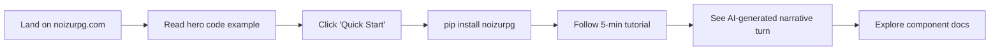
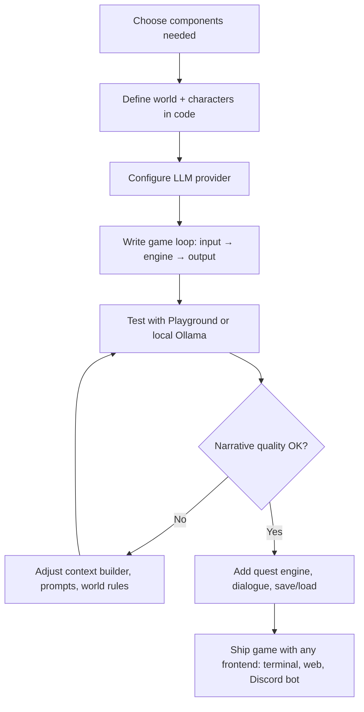
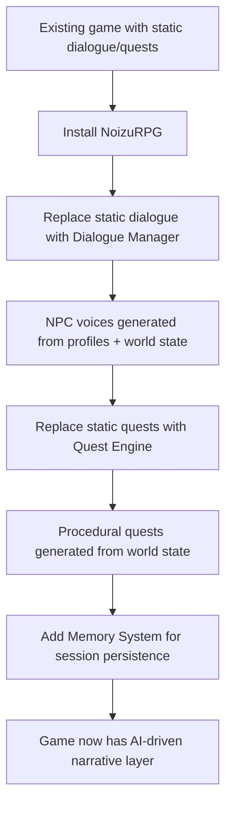
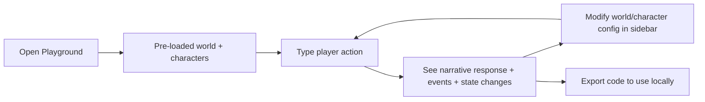
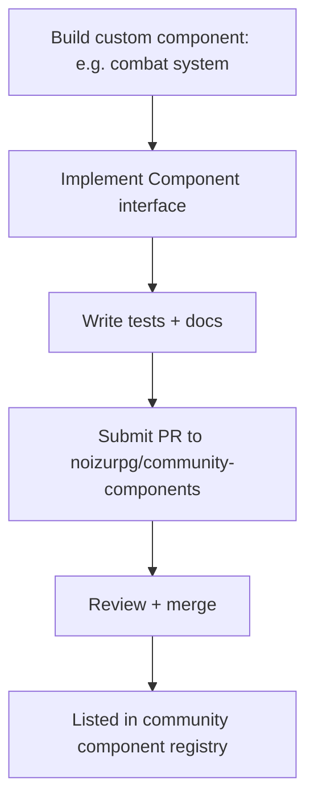

# NOIZUAI-26: NoizuRPG

**Domain:** [noizurpg.com](http://noizurpg.com)

## Elevator Pitch

**The React of AI-powered RPGs.** NoizuRPG is a composable framework for building role-playing games where LLMs are first-class primitives — not bolted-on chatbots, but the narrative engine, the game master, the quest designer, and the world simulator. Snap together character systems, dialogue engines, quest generators, and world-state managers. Wire in any LLM. Ship an AI RPG that actually works.

Think: RPG Maker meets LangChain — the missing SDK for the AI game dev stack.

---

## Problem

### 1. AI RPGs Are All Demos, No Infrastructure

The AI-powered RPG space is stuck in the "impressive demo, impossible to ship" phase:

- **AI Dungeon** proved the concept in 2019 — LLMs can generate compelling interactive fiction. But it's a monolithic consumer product, not a toolkit. You can't build on it.
- **Hundreds of indie devs** are hacking together "AI DM" prototypes with raw OpenAI/Claude API calls, hand-rolled prompt chains, and ad-hoc state management. The same problems get solved (badly) a thousand times.
- **Every prototype hits the same walls:** context window overflow, narrative incoherence across sessions, character amnesia, world-state drift, inventory/stat desync, and the "the AI forgot my character's name" problem.

The AI can generate text. The hard part is everything *around* the text: persistent state, consistent characters, world rules that hold across thousands of turns, and game mechanics that interact meaningfully with narrative.

### 2. No Framework Connects Game Systems to LLM Generation

The current tool landscape:

| Tool | What It Does | What's Missing |
|---|---|---|
| **RPG Maker** | Visual RPG creation with tile maps, combat, dialogue trees | Zero AI. Static scripted content. No procedural narrative. |
| **Twine / Ink** | Interactive fiction / branching narrative | Manual authoring only. No AI generation. No game mechanics beyond choice. |
| **Ren'Py** | Visual novel engine with branching, sprites, audio | Manual scripting. No AI. No persistent world-state. |
| **Godot / Unity** | Full game engines with physics, rendering, scripting | General-purpose. No RPG primitives. No AI narrative integration. |
| **LangChain / CrewAI** | LLM orchestration, agent frameworks | No game concepts. No character sheets. No world-state. No mechanics. |
| **Character.ai** | AI character conversation | Consumer product. No game systems. No developer API. No mechanics. |
| **AI Dungeon** | Consumer AI RPG game | Monolithic. No SDK. No composability. No developer access. |
| **NovelAI** | AI writing assistant / interactive fiction | Consumer tool. No structured game mechanics. No developer framework. |

**The gap:** Every AI RPG dev is building the same plumbing from scratch — character memory, world-state persistence, narrative coherence, stat/inventory tracking, quest state machines, dialogue context management. No framework provides these as composable, tested, LLM-aware primitives.

### 3. The Context Window Problem Is Unsolved at the Game Level

LLMs have finite context. RPGs are infinite-context systems — a campaign can run for years, accumulating thousands of events, characters, locations, and relationships. The naive approach (dump everything into the prompt) breaks at ~20 interactions.

Solving this requires purpose-built abstractions:
- **Memory systems** that compress, index, and retrieve relevant context
- **World-state managers** that maintain ground truth separately from narrative
- **Character models** that persist personality, knowledge, and relationships across arbitrary time spans
- **Event journals** that capture what happened, why it mattered, and what changed

These are RPG-specific problems that general LLM frameworks don't address. They need domain-specific solutions.

---

## Solution: Composable Framework for AI-Native RPGs

### Core Concept

NoizuRPG is a **Python framework** (with TypeScript SDK coming later) that provides composable building blocks for AI-powered RPGs. Each block handles one concern. Developers compose them into custom game architectures.

```
┌─────────────────────────────────────────────────┐
│  NOIZURPG ARCHITECTURE                          │
├─────────────────────────────────────────────────┤
│                                                 │
│  YOUR GAME                                      │
│  ────────                                       │
│  Uses any combination of NoizuRPG components:   │
│                                                 │
│  ┌──────────────┐  ┌──────────────┐            │
│  │ Character    │  │ World        │            │
│  │ System       │──│ State        │            │
│  │              │  │ Manager      │            │
│  │ stats, traits│  │ locations,   │            │
│  │ inventory,   │  │ factions,    │            │
│  │ relationships│  │ time, weather│            │
│  └──────┬───────┘  └──────┬───────┘            │
│         │                  │                    │
│  ┌──────▼──────────────────▼──────┐            │
│  │       Narrative Engine         │            │
│  │                                │            │
│  │  Context Builder → LLM → Parser│            │
│  │                                │            │
│  │  Assembles relevant state into │            │
│  │  prompts, sends to any LLM,   │            │
│  │  parses response into game     │            │
│  │  events + narrative text       │            │
│  └──────┬─────────────────┬───────┘            │
│         │                 │                    │
│  ┌──────▼───────┐  ┌─────▼────────┐           │
│  │ Quest        │  │ Dialogue     │           │
│  │ Engine       │  │ Manager      │           │
│  │              │  │              │           │
│  │ objectives,  │  │ NPC voice,   │           │
│  │ branching,   │  │ knowledge,   │           │
│  │ rewards,     │  │ disposition, │           │
│  │ procedural   │  │ memory       │           │
│  └──────────────┘  └──────────────┘           │
│         │                 │                    │
│  ┌──────▼─────────────────▼──────┐            │
│  │       Memory System           │            │
│  │                               │            │
│  │  Event journal, compressed    │            │
│  │  summaries, semantic search,  │            │
│  │  relevance scoring            │            │
│  └───────────────────────────────┘            │
│                                                 │
│  BRING YOUR OWN LLM                            │
│  ──────────────────                             │
│  OpenAI · Anthropic · Ollama · vLLM · any API  │
│                                                 │
└─────────────────────────────────────────────────┘
```

### The Six Core Components

| Component | Purpose | Key Abstractions |
|---|---|---|
| **Character System** | Define and track characters with stats, traits, inventory, relationships, knowledge | `Character`, `StatBlock`, `Inventory`, `Relationship`, `Knowledge` |
| **World State Manager** | Maintain ground truth about the world — locations, factions, time, resources, physics rules | `World`, `Location`, `Faction`, `Timeline`, `WorldRule` |
| **Narrative Engine** | Assemble context, call LLMs, parse responses into structured game events + prose | `ContextBuilder`, `NarrativeGenerator`, `EventParser`, `ResponseSchema` |
| **Quest Engine** | Create, track, and procedurally generate quests with objectives, branching, and rewards | `Quest`, `Objective`, `QuestGenerator`, `RewardTable`, `QuestGraph` |
| **Dialogue Manager** | Manage NPC conversations with consistent voice, knowledge boundaries, and disposition tracking | `Dialogue`, `NPCVoice`, `DispositionModel`, `DialogueMemory` |
| **Memory System** | Persist game history across sessions with compression, indexing, and relevance-scored retrieval | `EventJournal`, `MemoryIndex`, `Summary`, `RelevanceScorer` |

### What Makes It Different

**Components are independent.** Use the Quest Engine without the Dialogue Manager. Use the Memory System without the World State Manager. Build a combat system the framework doesn't provide and plug it in via hooks. NoizuRPG is a toolkit, not a monolith.

**LLM-agnostic.** Every component that calls an LLM takes a `ModelProvider` interface. Swap between OpenAI, Anthropic, Ollama, vLLM, or any custom backend with a one-line config change. Run your game on GPT-4 in production and Llama 3 locally for testing.

**State is structured, not vibes.** Character stats, inventory, world state, and quest progress are maintained in typed data structures — not embedded in LLM context. The LLM *reads* state to generate narrative but doesn't *own* state. When the LLM says "you found a sword," the framework validates it against world rules before updating inventory.

**Context is budgeted, not dumped.** The ContextBuilder assembles each LLM call from relevant state, recent events, and retrieved memories — prioritized by relevance, constrained by token budget. It never sends "everything." It sends what matters for *this* specific generation.

**Events are the interface.** Every game interaction produces typed `GameEvent` objects. Events update state, trigger quest checks, and feed the memory system. The LLM generates prose, but events are the ground truth.

### Code Example

```python
from noizurpg import World, Character, NarrativeEngine, QuestEngine
from noizurpg.providers import AnthropicProvider

# Configure LLM
llm = AnthropicProvider(model="claude-sonnet-4-5-20250514")

# Build world
world = World("The Ashward Chronicles")
world.add_location("Thornwall", type="city", traits=["coastal", "trade hub"])
world.add_faction("Blacksmith Guild", influence=0.7, disposition="neutral")

# Create character
kael = Character("Kael Ashward", archetype="artisan")
kael.stats.set(strength=12, dexterity=14, intelligence=16)
kael.inventory.add("Cold-singing hammer", type="tool", rarity="legendary")
kael.relationships.add("Blacksmith Guild", disposition="respected")

# Initialize engines
narrative = NarrativeEngine(llm=llm, world=world)
quests = QuestEngine(llm=llm, world=world)

# Generate a quest
quest = quests.generate(
    for_character=kael,
    theme="trade disruption",
    difficulty="medium",
)
# → Quest: "The Iron Silence" — investigate why iron shipments
#   from the Northern Reach have stopped.

# Play a turn
response = narrative.turn(
    character=kael,
    action="I visit the Blacksmith Guild hall to ask about the shipments",
    active_quests=[quest],
)
# → NarrativeResponse:
#     prose: "The guild hall is quieter than usual. Master Venn looks up..."
#     events: [DialogueStarted(npc="Master Venn"), QuestProgressed(quest, stage=2)]
#     state_changes: [kael.knowledge.add("Iron routes blocked since autumn")]
```

---

## Target Users

### Primary: Indie Game Developers Building AI-Powered RPGs

- Building text RPGs, interactive fiction, or hybrid AI/traditional games
- Currently gluing together raw LLM APIs with custom state management
- Spend 80% of dev time on infrastructure, 20% on actual game design
- **Job to be done:** "I want to build an AI RPG, not an AI infrastructure project. Give me the plumbing so I can focus on the game."

### Secondary: Interactive Fiction Authors & Narrative Designers

- Writers who want their stories to be interactive and AI-responsive
- Comfortable with light scripting but not building distributed systems
- Currently limited by Twine/Ink's static branching or ChatGPT's amnesia
- **Job to be done:** "I want to write a world and characters, then let AI bring them to life with consistent narrative — without learning distributed systems engineering."

### Tertiary: AI/ML Engineers Experimenting with Games

- Researchers exploring LLM-driven interactive experiences
- Need structured evaluation of narrative quality, coherence, and state consistency
- Currently building one-off prototypes with no reusable framework
- **Job to be done:** "I need a standardized framework to experiment with AI game mechanics, compare approaches, and publish reproducible results."

### Emerging: Tabletop RPG Communities Building Digital Companions

- Groups using AI as a supplementary GM or world-building assistant
- Want persistent campaign state across sessions
- Need structured NPC management, session logging, and lore consistency
- **Job to be done:** "Our D&D group wants an AI assistant that remembers our 2-year campaign and can generate NPCs that fit the world."

---

## Competitive Landscape

| Tool | Strength | Gap NoizuRPG Fills |
|---|---|---|
| **AI Dungeon** | Proved AI RPGs are compelling. 15M+ users. | Consumer product, not a framework. No developer API. No composable components. |
| **RPG Maker** | Mature visual RPG creation. Huge community. | No AI whatsoever. Static scripted content only. |
| **Twine / Ink** | Excellent narrative scripting. Widely used. | Manual authoring only. No procedural generation. No game mechanics beyond branching. |
| **Ren'Py** | Full visual novel engine. Python scripting. | No AI integration. No world-state management. No dynamic narrative. |
| **Godot / Unity** | Full game engines. Massive ecosystems. | General-purpose. No RPG primitives. Integrating LLMs requires building everything from scratch. |
| **LangChain** | LLM orchestration standard. Huge ecosystem. | No game concepts. No character systems. No world-state. Wrong abstraction level for games. |
| **Character.ai** | Best consumer AI character platform. | No game mechanics. No developer framework. No state persistence beyond chat. |
| **NovelAI** | Good AI writing. Interactive fiction mode. | Consumer tool. No structured game mechanics. No framework for developers. |
| **ChatRPG / various** | Small indie AI RPG experiments. | One-off projects. No reusable framework. Same infrastructure rebuilt each time. |

**Positioning:** NoizuRPG is not a game (AI Dungeon), not a game engine (Godot), not an LLM framework (LangChain), and not a visual novel tool (Ren'Py). It's the **missing middleware** — the RPG-specific component library that sits between your LLM provider and your game, handling the hard problems of persistent state, narrative coherence, and game mechanics.

---

## Key Features (MVP Scope)

### 1. Character System

- Typed character definitions with stat blocks, traits, inventory, and relationships
- Stat modifiers, skill checks with configurable dice/probability systems
- Inventory management with item types, rarity, weight, effects
- Relationship graph: character-to-character and character-to-faction with disposition tracking
- Knowledge tracking: what does this character know, and when did they learn it?
- Serialization: save/load characters as JSON/YAML

### 2. World State Manager

- Define locations with properties, connections, and containment (city → district → building)
- Faction system with influence scores, inter-faction relationships, and disposition
- Timeline: track world time, schedule events, age effects
- World rules: constraints the LLM must respect ("magic costs health", "the dead stay dead")
- State snapshots for save/load and branching timelines

### 3. Narrative Engine

- **ContextBuilder**: Assembles relevant state, memories, and active context into a token-budgeted prompt
- **NarrativeGenerator**: Sends structured prompts to any LLM via ModelProvider interface
- **EventParser**: Extracts typed GameEvents from LLM responses (regex + structured output)
- **ResponseSchema**: Define what the LLM should return per interaction type (dialogue, combat, exploration, etc.)
- **Tone/style controls**: Set narrative voice, pacing, violence level, humor
- **Validation layer**: Cross-references LLM output against world rules and character state before applying

### 4. Quest Engine

- Quest templates with objectives, stages, branching conditions, and rewards
- Procedural quest generation: given world state + character + theme, generate a coherent quest
- Quest state machine: track progress, handle stage transitions, trigger events
- Parallel quests with inter-quest dependencies and conflicts
- Reward system: XP, items, reputation, narrative consequences

### 5. Dialogue Manager

- NPC voice profiles: personality, speech patterns, vocabulary level, emotional range
- Knowledge boundaries: NPCs only know what they should know (based on faction, location, events)
- Disposition model: NPC attitude toward player based on actions, reputation, faction standing
- Dialogue memory: NPCs remember previous conversations and reference them
- Conversation modes: casual, interrogation, negotiation, persuasion (with skill check integration)

### 6. Memory System

- Event journal: append-only log of all game events with timestamps and metadata
- Compression: periodic summarization of old events into condensed memory blocks
- Semantic index: embed events for vector similarity retrieval
- Relevance scoring: rank memories by relevance to current context (location, characters present, active quests)
- Session management: save/resume game state with full memory continuity

### 7. LLM Provider Interface

- Unified interface for all LLM calls: `generate(prompt, schema, config)`
- Built-in providers: OpenAI, Anthropic, Ollama, vLLM
- Custom provider support via simple interface implementation
- Automatic token counting, cost tracking, and rate limiting
- Fallback chains: if primary model fails, try secondary
- Caching: identical context → cached response (for deterministic testing)

---

## Information Architecture (Documentation Site)

```
┌─────────────────────────────────────────────────────────────┐
│  NOIZURPG.COM                                                │
├─────────────────────────────────────────────────────────────┤
│                                                             │
│  Home ──────────── Pitch, code example, quick start,        │
│                    "pip install noizurpg"                    │
│                                                             │
│  Docs ──────────── Getting Started guide                    │
│    ├── Quick Start   5-min tutorial: world + character +    │
│    │                 first AI-generated turn                 │
│    ├── Concepts      Core concepts: events, state, context  │
│    ├── Guides        Task-oriented: "Build a dungeon        │
│    │                 crawler", "Add multiplayer",            │
│    │                 "Customize combat"                      │
│    └── API Ref       Auto-generated from docstrings         │
│                                                             │
│  Components ────── Per-component deep dives                 │
│    ├── Character     System overview + API + examples       │
│    ├── World State   System overview + API + examples       │
│    ├── Narrative     System overview + API + examples       │
│    ├── Quests        System overview + API + examples       │
│    ├── Dialogue      System overview + API + examples       │
│    └── Memory        System overview + API + examples       │
│                                                             │
│  Examples ──────── Complete game examples                   │
│    ├── Solo Quest    Single-player text RPG (50 LOC)        │
│    ├── Dungeon Run   Procedural dungeon crawler             │
│    ├── Tavern Talk   NPC dialogue sandbox                   │
│    └── Campaign      Full campaign with save/load           │
│                                                             │
│  Playground ────── Browser-based sandbox (try without       │
│                    installing — hosted Ollama backend)       │
│                                                             │
│  Community ─────── Discord, GitHub Discussions,             │
│                    showcase of games built with NoizuRPG     │
│                                                             │
│  Blog ──────────── Technical deep dives, release notes,     │
│                    "how we solved X" posts                   │
│                                                             │
└─────────────────────────────────────────────────────────────┘
```

---

## Primary User Flows

### Flow 1: First-Time Developer — Quick Start



### Flow 2: Build a Custom RPG



### Flow 3: Add AI to an Existing Game



### Flow 4: Try in Browser Playground



### Flow 5: Contribute a Component



---

## Key Screens

### Screen 1: Homepage — The Hook

```
┌─────────────────────────────────────────────────┐
│  ◇ NOIZURPG              [Docs] [Examples] [GH] │
│─────────────────────────────────────────────────│
│                                                 │
│  The composable framework for                   │
│  AI-powered RPGs.                               │
│                                                 │
│  Build role-playing games where LLMs are        │
│  first-class primitives — not chatbot           │
│  wrappers. Persistent state. Coherent           │
│  narrative. Real game mechanics.                │
│                                                 │
│  $ pip install noizurpg                    [⧉]  │
│                                                 │
│  ─ ─ ─ ─ ─ ─ ─ ─ ─ ─ ─ ─ ─ ─ ─ ─ ─ ─ ─ ─ ─ │
│                                                 │
│  ┌─────────────────────────────────────────┐    │
│  │ from noizurpg import World, Character,  │    │
│  │   NarrativeEngine                       │    │
│  │ from noizurpg.providers import Anthropic│    │
│  │                                         │    │
│  │ world = World("The Ashward Chronicles") │    │
│  │ world.add_location("Thornwall",         │    │
│  │   type="city", traits=["coastal"])      │    │
│  │                                         │    │
│  │ kael = Character("Kael Ashward")        │    │
│  │ kael.stats.set(str=12, dex=14, int=16) │    │
│  │                                         │    │
│  │ engine = NarrativeEngine(               │    │
│  │   llm=Anthropic("claude-sonnet-4-5-20250514"),   │    │
│  │   world=world                           │    │
│  │ )                                       │    │
│  │                                         │    │
│  │ response = engine.turn(                 │    │
│  │   character=kael,                       │    │
│  │   action="Enter the guild hall"         │    │
│  │ )                                       │    │
│  └─────────────────────────────────────────┘    │
│                                                 │
│  [Quick Start →]  [Playground →]  [GitHub →]    │
│                                                 │
│  ─ ─ ─ ─ ─ ─ ─ ─ ─ ─ ─ ─ ─ ─ ─ ─ ─ ─ ─ ─ ─ │
│                                                 │
│  WHY NOIZURPG                                   │
│                                                 │
│  ┌─────────┐ ┌──────────┐ ┌──────────────┐    │
│  │ Compose │ │ LLM-     │ │ State is     │    │
│  │ don't   │ │ agnostic │ │ structured   │    │
│  │ inherit │ │          │ │ not vibes    │    │
│  │         │ │ OpenAI,  │ │              │    │
│  │ Pick the│ │ Claude,  │ │ Typed events │    │
│  │ pieces  │ │ Ollama,  │ │ ground-truth │    │
│  │ you need│ │ vLLM     │ │ world state  │    │
│  └─────────┘ └──────────┘ └──────────────┘    │
│                                                 │
└─────────────────────────────────────────────────┘
```

### Screen 2: Documentation — Component Page

```
┌─────────────────────────────────────────────────┐
│  ◇ NOIZURPG   [Docs] [API] [Examples] [GH]     │
│─────────────────────────────────────────────────│
│                                                 │
│  ┌─────────┐ Character System                   │
│  │ Docs    │ ═══════════════                    │
│  │─────────│                                    │
│  │ Start   │ Define and track characters with   │
│  │ Concepts│ stats, traits, inventory, and      │
│  │ Guides  │ relationships. The Character       │
│  │─────────│ system is the identity layer —     │
│  │ Comp.   │ everything about who a character   │
│  │─────────│ is, what they have, and who they   │
│  │ ■ Char  │ know.                              │
│  │ □ World │                                    │
│  │ □ Narr. │ ─ ─ ─ ─ ─ ─ ─ ─ ─ ─ ─ ─ ─ ─ ─  │
│  │ □ Quest │                                    │
│  │ □ Dialog│ QUICK EXAMPLE                      │
│  │ □ Memory│                                    │
│  │─────────│ kael = Character("Kael")           │
│  │ API Ref │ kael.stats.set(str=12, dex=14)    │
│  │─────────│ kael.inventory.add(                │
│  │ Examp.  │   "Cold-singing hammer",           │
│  │─────────│   type="tool",                     │
│  │ Play    │   rarity="legendary"               │
│  │         │ )                                   │
│  │         │ kael.relationships.add(             │
│  │         │   "Blacksmith Guild",               │
│  │         │   disposition="respected"           │
│  │         │ )                                   │
│  │         │                                    │
│  │         │ ─ ─ ─ ─ ─ ─ ─ ─ ─ ─ ─ ─ ─ ─ ─  │
│  │         │                                    │
│  │         │ CORE CLASSES                        │
│  │         │                                    │
│  │         │ Character ─── The main entity      │
│  │         │ StatBlock ─── Numeric attributes   │
│  │         │ Inventory ─── Item collection      │
│  │         │ Relationship ─ Social graph edge   │
│  │         │ Knowledge ─── What they know       │
│  │         │                                    │
│  │         │ [Full API Reference →]             │
│  └─────────┘                                    │
│                                                 │
└─────────────────────────────────────────────────┘
```

### Screen 3: Playground — Browser Sandbox

```
┌─────────────────────────────────────────────────┐
│  ◇ NOIZURPG PLAYGROUND           [Docs] [Reset] │
│─────────────────────────────────────────────────│
│                                                 │
│  ┌──── CONFIG ────────────┐ ┌── NARRATIVE ────┐│
│  │                        │ │                 ││
│  │ WORLD: Ashward         │ │ The guild hall  ││
│  │ ├─ Thornwall (city)    │ │ is quieter than ││
│  │ │  └─ Guild Hall       │ │ usual. Master   ││
│  │ └─ Northern Reach      │ │ Venn looks up   ││
│  │                        │ │ from the cold   ││
│  │ CHARACTER: Kael        │ │ forge — no iron ││
│  │ STR:12 DEX:14 INT:16  │ │ to work today.  ││
│  │ Inventory:             │ │                 ││
│  │  · Cold-singing hammer │ │ "Kael. Good.    ││
│  │  · 24 gold             │ │ The routes are  ││
│  │ Relationships:         │ │ dead. Three     ││
│  │  · Guild — respected   │ │ caravans gone   ││
│  │                        │ │ since autumn.   ││
│  │ ACTIVE QUESTS:         │ │ The Guild is    ││
│  │  · The Iron Silence    │ │ bleeding coin." ││
│  │    Stage: 2/5          │ │                 ││
│  │                        │ │ ─ ─ ─ ─ ─ ─ ─ ││
│  │ ── EVENTS ──           │ │                 ││
│  │ DialogueStarted(Venn)  │ │ EVENTS:         ││
│  │ QuestProgressed(2→3)   │ │ ● Dialogue w/   ││
│  │ Knowledge+("routes     │ │   Master Venn   ││
│  │   blocked")            │ │ ● Quest → stg 3 ││
│  │                        │ │ ● Knowledge+    ││
│  └────────────────────────┘ └─────────────────┘│
│                                                 │
│  ┌──────────────────────────────────────────┐   │
│  │ > I ask Venn who he suspects is behind   │   │
│  │   the blockade                            │   │
│  └──────────────────────────────────────────┘   │
│  [Send]                     Model: [Ollama ▼]   │
│                                                 │
│  [Export Code]  [Share Session]  [Load Example]  │
│                                                 │
└─────────────────────────────────────────────────┘
```

### Screen 4: Examples Gallery

```
┌─────────────────────────────────────────────────┐
│  ◇ NOIZURPG              [Docs] [Examples] [GH] │
│─────────────────────────────────────────────────│
│                                                 │
│  EXAMPLES                                       │
│  Build real games with NoizuRPG.                │
│                                                 │
│  ┌──────────────────┐  ┌──────────────────┐    │
│  │ Solo Quest       │  │ Dungeon Run      │    │
│  │                  │  │                  │    │
│  │ Single-player    │  │ Procedural       │    │
│  │ text RPG.        │  │ dungeon crawler  │    │
│  │ 50 lines of      │  │ with rooms,      │    │
│  │ code. One file.  │  │ monsters, loot.  │    │
│  │                  │  │                  │    │
│  │ Components:      │  │ Components:      │    │
│  │ Character,       │  │ Character, World │    │
│  │ Narrative,       │  │ Narrative, Quest │    │
│  │ Memory           │  │ Memory           │    │
│  │                  │  │                  │    │
│  │ [View Code]      │  │ [View Code]      │    │
│  │ [Run in Play →]  │  │ [Run in Play →]  │    │
│  └──────────────────┘  └──────────────────┘    │
│                                                 │
│  ┌──────────────────┐  ┌──────────────────┐    │
│  │ Tavern Talk      │  │ Full Campaign    │    │
│  │                  │  │                  │    │
│  │ NPC dialogue     │  │ Multi-session    │    │
│  │ sandbox. 5 NPCs  │  │ campaign with    │    │
│  │ with distinct    │  │ save/load, quest │    │
│  │ personalities.   │  │ chains, faction  │    │
│  │                  │  │ reputation.      │    │
│  │ Components:      │  │                  │    │
│  │ Character,       │  │ Components:      │    │
│  │ Dialogue,        │  │ All six          │    │
│  │ Memory           │  │                  │    │
│  │                  │  │ [View Code]      │    │
│  │ [View Code]      │  │ [Run in Play →]  │    │
│  │ [Run in Play →]  │  │                  │    │
│  └──────────────────┘  └──────────────────┘    │
│                                                 │
└─────────────────────────────────────────────────┘
```

---

## Visual Direction

**Style:** Minimal Tech (80%) + Consumer Playful (20%)

**Rationale:** This is a developer framework — Minimal Tech's "we're smart and assume you are too" positioning is essential. The code examples, API documentation, and composability story need to feel competent and trustworthy. But RPGs are *fun* — the Consumer Playful accent brings warmth to the narrative examples, the playground, and the game showcase. The result should feel like great developer documentation that happens to be about something delightful.

**The metaphor:** A well-organized workshop where the tools are serious but the projects are magical. Think Stripe's documentation quality applied to game dev.

### Color System

```
PALETTE: "WORKSHOP & WONDER"

Dark Mode (primary — devs prefer dark):
  Background:  #0F0F13  (Deep blue-black — not pure black)
  Surface:     #17171E  (Elevated panels)
  Elevated:    #1F1F2A  (Cards, code blocks)

  Text:        #E4E4EC  (High contrast)
  Text Muted:  #8B8BA0  (Secondary)
  Text Dim:    #52526A  (Tertiary)

  Border:      #2A2A38  (Subtle)
  Border Hover:#3A3A4C  (Interactive)

  Accent:      #7C5CFC  (Purple — the RPG color. Magic, mystery, creativity.)
  Accent Hover:#9B7FFF
  Accent Muted:rgba(124, 92, 252, 0.12)

  Semantic:
  Success:     #22C55E  (Pass, connected, online)
  Warning:     #F59E0B  (Caution, deprecation)
  Error:       #EF4444  (Fail, breaking)
  Info:        #60A5FA  (Informational)

  RPG domain colors (for game content, not UI):
  Gold:        #FFD700  (Legendary items, achievements)
  Health:      #EF4444  (HP bars, damage)
  Mana:        #60A5FA  (MP, magic resources)
  XP:          #22C55E  (Experience, progression)

Light Mode (secondary):
  Background:  #FAFAFA
  Surface:     #FFFFFF
  Text:        #171720
  Accent:      #6B46E5  (Slightly deeper purple for contrast)
```

### Typography

```
Primary / UI:       Inter
                    Clean, functional, readable at all sizes
                    All documentation, navigation, UI chrome

Code:               JetBrains Mono
                    Code examples, API references, terminal output
                    THE voice of the framework — devs spend most
                    time reading code, so this must be excellent

Narrative accent:   Source Serif 4 (optional, used sparingly)
                    Only in: narrative output examples, game prose
                    quotes, the Playground narrative panel
                    Signals: "this is the story, not the code"
```

### Visual Identity Cues

- **Purple as the signature** — The accent color appears on CTAs, active states, component highlights, and the "magic" moments (AI-generated content). Purple signals creativity + technical depth.
- **Code is king** — Code blocks are the hero elements. Large, well-lit, syntax-highlighted. The homepage code example is above the fold. Documentation leads with code, not prose.
- **Dual voice** — UI/docs in Inter (functional), narrative output in Source Serif (literary). The typeface shift signals: "the framework is a tool, the output is a story."
- **Component diagrams** — Each component gets a simple architectural diagram showing inputs/outputs and connections to other components. Clean lines, no decorative illustration.
- **Playground is the showpiece** — The browser sandbox is the most visually rich page: split-pane, live state updates, streaming narrative output. It's where the "Playful 20%" lives.
- **No pixel art, no fantasy illustration** — This is a framework, not a game. Visual identity comes from typography, color, and code quality. The games built with NoizuRPG provide their own aesthetics.

### Motion Language

| Interaction | Animation | Duration |
|---|---|---|
| Code block copy | Flash green border, show "Copied!" | 150ms + 1.5s hold |
| Playground narrative | Text streams in character-by-character | Variable, 15ms/char |
| Playground event | Event card slides in from left | 200ms ease-out |
| State change | Changed value highlights briefly (gold flash) | 200ms + 800ms fade |
| Nav active state | Purple underline slides to active item | 150ms ease |
| Component diagram hover | Connected lines highlight, nodes pulse | 100ms |

---

## Open Questions

Flagging genuine unknowns per the "Is this bullshit?" principle:

1. **Structured output reliability** — The EventParser depends on LLMs returning structured data (events, state changes) alongside narrative prose. Structured output modes (JSON mode, tool use) help, but hallucinated state changes are a real risk. *How much of the validation burden falls on the framework vs. the developer? Need to ship with robust schema validation and a "strict mode" that rejects any output that doesn't conform.*

2. **Context window economics** — The ContextBuilder is doing the hardest job: selecting what's relevant from potentially thousands of events, characters, and world facts. Getting this wrong means either incoherent narrative (too little context) or blown token budgets (too much). *Need extensive testing with real game sessions across multiple LLMs. The memory compression and retrieval system is the technical moat — if it works well, the framework is valuable. If not, it's just a wrapper.*

3. **Model quality threshold** — What's the minimum LLM quality that produces acceptable RPG experiences? GPT-4 and Claude are great but expensive. Llama 3 70B is good and cheap. Llama 3 8B might be too weak. *Need benchmarks: run the same game scenario across models and evaluate narrative quality, event extraction accuracy, and state consistency.*

4. **Multiplayer complexity** — The architecture assumes a single player. Multiplayer (multiple players, one world) introduces concurrent state mutations, turn order, information asymmetry (player A knows something player B doesn't), and dramatic scaling of context. *Explicitly out of scope for v0.1 but need to ensure the architecture doesn't preclude it.*

5. **Combat systems** — RPG combat is deeply varied: turn-based, real-time, dice-based, narrative, tactical grid. The framework doesn't include a combat system. Should it provide an extensible combat interface, or leave it entirely to the developer? *Leaning toward providing a CombatSystem interface with one reference implementation (simple turn-based) and leaving the rest to community contributions.*

6. **Testing AI output** — How do you write tests for a system whose core output is non-deterministic? Snapshot tests with fixed seeds? Evaluation rubrics? LLM-as-judge? *This is both a product question (what testing tools does NoizuRPG provide?) and a development question (how do we test the framework itself?).*

7. **Adoption path** — Developer frameworks live or die on DX. The 5-minute quick start must be genuinely magical — not "set up 3 config files and a database." *The quick start should be: pip install, 10 lines of code, see narrative output. Everything else is progressive disclosure.*

---

## Monetization

NoizuRPG is **open-source core** (MIT) with commercial services.

| Tier | Includes | Price Signal |
|---|---|---|
| **Open Source** | Full framework: all 6 components, all providers, CLI tools, documentation, examples | Free (MIT license) |
| **Cloud Playground** | Hosted browser sandbox with pre-configured models (no local setup required). Shareable sessions. | Free tier (rate-limited) + $9/mo unlimited |
| **Managed Memory** | Cloud-hosted memory backend: persistent vector store, event journal, and state snapshots. No self-hosting required. | $19/mo (1M events) / $49/mo (10M events) |
| **Managed Models** | Pre-configured LLM access optimized for RPG generation. No API keys to manage. Fine-tuned models for better event extraction. | $29/mo (includes model costs up to a cap) |
| **Enterprise** | Self-hosted everything + priority support + custom model fine-tuning + SLA | $499+/mo |

**Additional revenue streams:**

- **Component marketplace** — Community-built components (combat systems, magic systems, crafting systems) listed in a registry. Free + premium. NoizuRPG takes 20% of premium sales.
- **Template marketplace** — Complete game templates ("Dark Fantasy Campaign Starter", "Sci-Fi Space Opera Kit") with pre-built worlds, characters, and quest templates. $5-25 each.
- **Certification** — "NoizuRPG Certified Developer" for indie studios that want to signal expertise. $99 exam.
- **Sponsorship** — LLM providers sponsor "Recommended Provider" status (e.g., "Best for: Anthropic Claude" badge on component pages).

---

## Adjacent Opportunities

- **TextRPG built on NoizuRPG** — [TextRPG](../textrpg/README.md) (textrpg.org) could be the flagship consumer game built on the framework, proving the technology and driving awareness
- **Discord bot SDK** — Package for deploying NoizuRPG games as Discord bots (huge market: D&D/TTRPG Discord servers)
- **Twitch integration** — Viewer-driven narrative: chat votes on player actions, LLM generates the story. Stream overlay shows state.
- **Knowledge Base integration** — [Knowledge Base](../knowledge-base/README.md) (library.therobotlives.com) provides world-building tools; NoizuRPG brings those worlds to life as playable games
- **Education** — "Learn Python by Building an AI RPG" course/tutorial series
- **Game jam sponsorship** — Sponsor AI game jams with NoizuRPG as the required framework. Best game wins prize. Drives adoption + content.
- **Model fine-tuning** — Fine-tune small models (Llama 8B) on high-quality RPG interaction data generated by larger models. Sell access or open-source.

---

## Technical Considerations

| Layer | Direction |
|---|---|
| **Language** | Python 3.11+. Type-annotated throughout. Pydantic models for all data structures. Async-first for LLM calls. |
| **Package** | Published on PyPI as `noizurpg`. CLI tool: `noizurpg init`, `noizurpg play`, `noizurpg export`. |
| **State storage** | SQLite by default (zero config, works offline). PostgreSQL for production. Redis for session caching. Pluggable via StorageBackend interface. |
| **Vector storage** | ChromaDB embedded (default). Pinecone, Weaviate, pgvector via plugins. |
| **LLM interface** | Unified async interface. Structured output via Pydantic schemas + model-specific JSON mode. Streaming support. |
| **Testing** | pytest with fixtures for each component. Deterministic mode (fixed seed + cached LLM responses) for CI. LLM-as-judge evaluation suite for narrative quality. |
| **Documentation** | MkDocs Material theme. Auto-generated API docs from docstrings. Interactive code examples via Playground embedding. |
| **Playground** | Next.js frontend. Backend: FastAPI serving NoizuRPG with Ollama for free tier, commercial models for paid tier. WebSocket for streaming. |
| **TypeScript SDK** | Post-v1.0. Auto-generated from Python type annotations. Published on npm as `@noizurpg/core`. |

---

## MVP Scope

### In Scope (v0.1)

- [ ] Character System: stats, inventory, relationships, knowledge, serialization
- [ ] World State Manager: locations, factions, timeline, world rules, snapshots
- [ ] Narrative Engine: ContextBuilder, NarrativeGenerator, EventParser with 3 response schemas
- [ ] Memory System: event journal, basic compression (summarize every N events), keyword retrieval
- [ ] LLM Provider: OpenAI + Anthropic + Ollama built-in
- [ ] CLI: `noizurpg init` (scaffold a project), `noizurpg play` (terminal game loop)
- [ ] 2 complete examples: Solo Quest (minimal) + Tavern Talk (dialogue-focused)
- [ ] Documentation: Quick Start, Concepts, per-component guides, API reference
- [ ] PyPI package with `pip install noizurpg`

### Out of Scope (v0.2+)

- Quest Engine (requires more design on procedural generation quality)
- Dialogue Manager (can be approximated with Narrative Engine in v0.1)
- Semantic vector retrieval for Memory System (keyword search in v0.1)
- Browser Playground
- Multiplayer / concurrent players
- Combat system (community contribution opportunity)
- TypeScript SDK
- Component marketplace
- Template marketplace
- Fine-tuned models
- Cloud services (Managed Memory, Managed Models)

---

## Status

Concept / Pre-development

**Next steps:**

1. **Validate the core loop:** Build a minimal prototype — Character + World + NarrativeEngine + Ollama — that plays 20 turns of a text RPG in a terminal. Does the AI generate coherent narrative that respects world state? Does the EventParser correctly extract state changes? Does context management hold up over 20 turns?
2. **Test model quality range:** Run the same 20-turn scenario across GPT-4, Claude Sonnet, Llama 3 70B, and Llama 3 8B. Where's the quality floor? What breaks first — narrative quality, event extraction, or state consistency?
3. **Design the ContextBuilder:** This is the technical moat. Prototype three strategies: (a) recency-only (last N events), (b) relevance-scored (embedding similarity), (c) hybrid (recent + relevant). Measure narrative coherence and token efficiency.
4. **If (1)-(3) validate:** Package as a Python library, write the Quick Start tutorial, publish to PyPI, and announce on r/gamedev and Hacker News.
