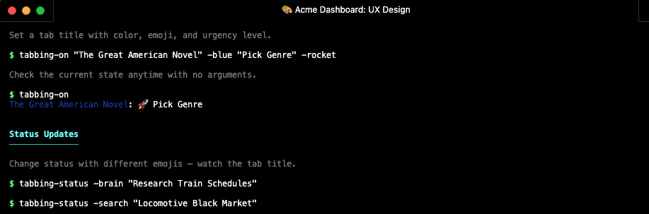

# tabbing-on



A pure-shell terminal tab title, status & task manager with theme support.
Works with iTerm2, Ghostty, Kitty, WezTerm, Alacritty, and more.

> **[`demo-runner`](#demo-runner)** — a typewriter-style demo player is included. Run `bin/demo-runner` for a guided walkthrough.


https://github.com/user-attachments/assets/dcefea35-beaa-43c8-afe6-9717a478e7cf


https://github.com/user-attachments/assets/b454eecc-3542-472e-a563-99415ce6fbed


> [View the full asciinema recording](demo/showcase.cast)

## Install

```bash
cd tabbing-on
make install
```

This copies commands to `~/.local/bin/` and libraries to `~/.local/share/tabbing-on/`.

Then add to your shell rc:

```bash
# Zsh — add to .zshrc
eval "$(tabbing-init zsh)"

# Bash — add to .bashrc
eval "$(tabbing-init bash)"
```

### DC Mode (direnv-config integration)

When paired with [direnv-config](https://github.com/the-robot-lives/direnv-config), tab state is stored in a shared key-value store instead of shell env vars. A background daemon polls for changes and updates the tab title automatically. This enables cross-process state sharing and automatic marquee scrolling for long status text.

```bash
# .zshrc
export TABBING_ON_DC_MODE=1
eval "$(tabbing-init zsh --direnv-config-mode)"
```

**Caveat:** In dc mode, entering a directory that has prior dc state will restore that directory's last tab title/status/emoji. This is by design — dc state is per-directory, not per-tab. Use `tabbing-off` to clear, or set new values with `tabbing-on`.

### Claude Code integration

tabbing-on works inside Claude Code sessions. Add the init to your `.zshrc` as above, and Claude Code terminals will pick up tab titles, status, and emoji. The Claude Code status line bridge is available via `tabbing-on --claude`.

To prevent Claude Code from overwriting tab titles, tabbing-on automatically sets `CLAUDE_CODE_DISABLE_TERMINAL_TITLE=1` when active.

## Commands

### `tabbing-on`

The primary command. Sets the tab title, status, highlight color, urgency, emoji, background color, and theme.

```bash
tabbing-on "MyApp" "deploying"                    # title + status
tabbing-on "MyApp" -blue "deploying" -rocket -p2  # with color, emoji, urgency
tabbing-on "MyApp" --theme=dracula                 # apply a full terminal theme
tabbing-on "MyApp" --bg="#1E1E2E"                  # set background color only
tabbing-on "MyApp" --marquee "long scrolling text" # scrolling status marquee
tabbing-on                                         # display current state
tabbing-on --themes                                # list available themes
tabbing-on --colors                                # list available colors
tabbing-on --emojis                                # list available emojis
tabbing-on --help                                  # show help
```

| Flag | Aliases | Description |
|---|---|---|
| `--highlight COLOR` | `--color`, `-h COLOR`, `-COLOR` | Title highlight color (`-blue`, `-red`, etc.) |
| `--urgency N` | `--pri N`, `-p N`, `-priN` | Urgency 0-5 (0 = critical/red, 5 = nominal/gray) |
| `--emoji NAME` | `-e NAME`, `-NAME` | Named emoji indicator (`-rocket`, `-fire`, etc.) |
| `--no-emoji` | | Clear emoji |
| `--bg COLOR` | | Terminal background color (`#RRGGBB` or named color) |
| `--no-bg` | | Reset background to terminal default |
| `--theme NAME` | | Apply a full terminal color theme (palette + bg + fg + cursor) |
| `--no-theme` | | Reset all theme colors to terminal defaults |
| `--marquee` | `-m` | Enable scrolling marquee for the status text |
| `--no-marquee` | | Disable marquee |
| `--record` | | Start an asciinema recording |
| `--continue` | | Keep current recording across status changes |
| `--stop-recording` | | Stop active recording |
| `--themes` | `--theme-list` | List available themes |
| `--colors` | `--color-list` | List available highlight colors |
| `--emojis` | `--emoji-list` | List available emojis |
| `--terminal-info` | | Show detected terminal and feature support |

### `tabbing-status`

Update just the status portion of the tab title. Requires `tabbing-on` to have been called first.

```bash
tabbing-status "building..."
tabbing-status -fire "hotfix in progress"
tabbing-status -pri0 "DEADLINE TOMORROW"
tabbing-status --theme=danger "production deploy"
tabbing-status --bg=ocean "deep work"
```

Accepts the same urgency, emoji, bg, theme, marquee, and recording flags as `tabbing-on`.

### `tabbing-style`

Adjust tab appearance without changing title or status. The dedicated command for themes, colors, and visual settings. Requires `tabbing-on` to have been called first.

```bash
tabbing-style --theme=dracula          # apply a theme
tabbing-style --bg=midnight            # set background color
tabbing-style -blue -rocket -pri2      # color, emoji, urgency shorthands
tabbing-style --marquee                # enable scrolling marquee
tabbing-style --no-theme               # reset theme to terminal defaults
tabbing-style                          # show current settings
tabbing-style --themes                 # list available themes
tabbing-style --colors                 # list available colors
tabbing-style --emojis                 # list available emojis
```

| Flag | Aliases | Description |
|---|---|---|
| `--theme NAME` | | Apply a full terminal color theme |
| `--no-theme` | | Reset theme to terminal defaults |
| `--bg COLOR` | | Terminal background color (`#RRGGBB` or named) |
| `--no-bg` | | Reset background to default |
| `--highlight COLOR` | `--color`, `-h`, `-COLOR` | Title highlight color |
| `--urgency N` | `--pri`, `-p`, `-priN` | Urgency 0-5 |
| `--emoji NAME` | `-e`, `-NAME` | Named emoji indicator |
| `--no-emoji` | | Clear emoji |
| `--marquee` | `-m` | Enable scrolling marquee |
| `--no-marquee` | | Disable marquee |
| `--themes` | `--theme-list` | List available themes |
| `--colors` | `--color-list` | List available colors |
| `--emojis` | `--emoji-list` | List available emojis |

Called with no flags, `tabbing-style` displays the current settings.

### `tabbing-off`

Deactivate tabbing and restore terminal defaults. Clears the title, tab color, background color, theme, and badge, then unsets all runtime variables.

```bash
tabbing-off
```

### `tabbing-todo`

Per-tab todo/task management.

```bash
tabbing-todo "K8 infra setup" -e gear -m "Deploy to staging cluster"  # add
tabbing-todo                                                           # list
tabbing-todo --pick                                                    # switch active todo
tabbing-todo --done                                                    # mark active as done
tabbing-todo --done 3                                                  # mark #3 as done
```

| Flag | Aliases | Description |
|---|---|---|
| `-m "desc"` | `--message` | Description text |
| `--emoji NAME` | `-e NAME`, `-NAME` | Attach emoji |
| `--urgency N` | `--pri N`, `-p N` | Set urgency |
| `--pick` | `-n`, `--switch` | Interactive: pick a todo to work on |
| `--done [id]` | | Mark done (defaults to active) |

Switching todos updates `TAB_STATUS`, `TAB_EMOJI`, and `TAB_URGENCY` automatically.

### `tabbing-report`

Time-in-state reports computed from event history.

```bash
tabbing-report                   # ASCII bar chart for current tab
tabbing-report --mermaid         # Mermaid pie chart syntax
tabbing-report --all             # all tabs
tabbing-report --list            # list all known tabs
tabbing-report --search "query"  # search history
```

### `tabbing-history`

Browse and search across all tab history.

```bash
tabbing-history              # list all known tabs
tabbing-history "deploying"  # search all history files
```

### `tabbing-recordings`

List and manage asciinema `.cast` recordings.

```bash
tabbing-recordings                              # list for current tab
tabbing-recordings --tab TAB_ID                 # list for specific tab
tabbing-recordings --to-gif recording.cast      # convert to GIF (requires agg)
```

### `tabbing-info`

Full state dump for a tab: env vars, file paths, history count, todos, recordings.

```bash
tabbing-info              # current tab
tabbing-info TAB_ID       # specific tab
```

### `tabbing-clear`

Delete stored data.

```bash
tabbing-clear history                    # clear history (current tab)
tabbing-clear history --all              # clear history (all tabs)
tabbing-clear history --before 2026-01   # clear entries before date
tabbing-clear todos                      # clear todos (current tab)
tabbing-clear recordings                 # clear recordings (current tab)
tabbing-clear all                        # clear everything (current tab)
tabbing-clear everything                 # nuke all data for ALL tabs
```

### `tabbing-doctor`

Diagnose and fix terminal configuration issues. Automatically patches config for terminals (like Ghostty and Kitty) that need title-set logic disabled.

```bash
tabbing-doctor
```

## Themes

Full terminal recoloring via OSC escape sequences. Themes set the background, foreground, cursor color, and the entire 16-color palette. Works on Ghostty, iTerm2, Kitty, WezTerm, xterm, and any terminal supporting OSC 4/10/11/12.

```bash
tabbing-on "Deploy" --theme=catppuccin         # apply theme
tabbing-on "Prod" --theme=danger               # semantic theme for production
tabbing-on --no-theme                          # reset to terminal defaults
tabbing-on --themes                            # list all themes
```

**Editor/Terminal themes:**

| Theme | Description |
|---|---|
| `catppuccin` / `catppuccin-mocha` | Warm dark pastel theme |
| `catppuccin-latte` | Light pastel theme |
| `dracula` | Dark theme with vibrant colors |
| `nord` | Arctic, north-bluish color palette |
| `tokyo-night` | Dark theme inspired by Tokyo city lights |
| `gruvbox` / `gruvbox-dark` | Retro groove warm dark theme |
| `gruvbox-light` | Retro groove light variant |
| `monokai` | Classic dark theme with vivid accents |
| `one-dark` | Atom One Dark inspired |
| `solarized-dark` | Precision dark color scheme |
| `solarized-light` | Precision light color scheme |
| `rose-pine` | Soho vibes dark theme |
| `rose-pine-moon` | Rose Pine mid-tone variant |
| `kanagawa` | Dark theme inspired by Katsushika Hokusai |

**Semantic themes:**

| Theme | Aliases | Description |
|---|---|---|
| `danger` | `production` | Red-tinted background for production environments |
| `safe` | `development` | Green-tinted background for development |
| `ocean` | | Deep blue nautical theme |
| `forest` | | Dark green nature theme |
| `sunset` | | Warm orange-brown theme |

### Custom Themes

Create your own themes by adding `.theme` files to `~/.config/tabbing-on/themes/` (or `$XDG_CONFIG_HOME/tabbing-on/themes/`).

```bash
mkdir -p ~/.config/tabbing-on/themes
cp examples/themes/my-dark.theme ~/.config/tabbing-on/themes/
tabbing-on "Work" --theme=my-dark
```

**Theme file format** (`my-dark.theme`):

```ini
# Required
bg = #1A1B26
fg = #C0CAF5

# Optional (defaults to fg, or bg for color0/color8)
cursor = #C0CAF5

# 16-color palette
color0  = #15161E   # black
color1  = #F7768E   # red
color2  = #9ECE6A   # green
color3  = #E0AF68   # yellow
color4  = #7AA2F7   # blue
color5  = #BB9AF7   # magenta
color6  = #7DCFFF   # cyan
color7  = #A9B1D6   # white
color8  = #414868   # bright black
color9  = #F7768E   # bright red
color10 = #9ECE6A   # bright green
color11 = #E0AF68   # bright yellow
color12 = #7AA2F7   # bright blue
color13 = #BB9AF7   # bright magenta
color14 = #7DCFFF   # bright cyan
color15 = #C0CAF5   # bright white
```

Only `bg` and `fg` are required — a minimal two-line theme file works fine. User themes override built-in themes of the same name. See `examples/themes/` for templates.

## Background Colors

For quick background-only changes without affecting the full palette, use `--bg`:

```bash
tabbing-on "Work" --bg=midnight                # named color
tabbing-on "Work" --bg="#2E3440"               # hex color
tabbing-on --no-bg                             # reset to default
```

Named background colors include standard terminal colors, dark theme tones (dark, midnight, charcoal, slate, obsidian, etc.), popular theme backgrounds (nord, dracula, monokai, etc.), semantic moods (ocean, forest, sunset, wine, storm, ember, etc.), and environment indicators (danger, warning, safe, info).

## Marquee

Scrolling status text for long messages that don't fit in the tab title.

```bash
tabbing-on "Deploy" --marquee "Rolling update to production cluster us-east-1"
tabbing-on --no-marquee          # stop scrolling
```

The title prefix stays fixed while the status portion scrolls across a 20-character window.

## Environment Variables

| Variable | Description |
|---|---|
| `TAB_TITLE` | Tab title text |
| `TAB_STATUS` | Status sub-text |
| `TAB_HIGHLIGHT` | Color name for title highlight |
| `TAB_URGENCY` | 0-5 (0 = critical/red, 5 = nominal/gray) |
| `TAB_EMOJI` | Named emoji (overrides the urgency dot) |
| `TAB_BG` | Terminal background color (name or `#RRGGBB`) |
| `TAB_THEME` | Active terminal color theme name |
| `TAB_MARQUEE` | Set to `1` to enable scrolling marquee |
| `TAB_ID` | 8-char hex ID, unique per tab (auto-generated) |
| `TAB_SESSION` | Session fingerprint (auto-generated at init) |
| `TAB_TERMINAL` | Detected terminal emulator |
| `TAB_RECORDING` | Path to active `.cast` file |

## Data Storage

Runtime state lives under `~/.local/state/tabbing/` (or `$XDG_STATE_HOME/tabbing/`):

```
~/.local/state/tabbing/
  history/{TAB_ID}.yaml           # timestamped event log
  todos/{TAB_ID}.yaml             # todo items
  recordings/{TAB_ID}/*.cast      # asciinema recordings
```

User configuration lives under `~/.config/tabbing-on/` (or `$XDG_CONFIG_HOME/tabbing-on/`):

```
~/.config/tabbing-on/
  themes/*.theme                  # user-defined color themes
```

## Terminal Support

Status key: **Out-of-box** — works with no extra setup | **Requires `tabbing-doctor`** — needs config patching (see Notes) | **Untested** — not yet verified

### Feature Matrix

| Feature | Mechanism | Supported Terminals |
|---|---|---|
| Tab title | OSC 0 (universal) | All terminals |
| Tab color | iTerm2 OSC 6 / Kitty remote control | iTerm2, Kitty |
| Background color | OSC 11 | Ghostty, iTerm2, Kitty, WezTerm, xterm |
| Full themes | OSC 4 + 10/11/12 | Ghostty, iTerm2, Kitty, WezTerm, xterm |
| Badge | iTerm2 OSC 1337 | iTerm2 only |

### macOS

| Terminal | Status | Color | Unicode | Notes |
|----------|--------|-------|---------|-------|
| iTerm2 | Out-of-box | ✅ | ✅ | Full feature support: tab color, themes, badge |
| Terminal.app | Out-of-box | ✅ | ✅ | |
| Ghostty | Requires `tabbing-doctor` | ✅ | ✅ | Full theme/bg support via OSC. Requires disabling title-set logic; `tabbing-doctor` handles this. |
| Kitty | Requires `tabbing-doctor` | ✅ | ✅ | Tab color + themes via OSC. Requires disabling title-set logic; `tabbing-doctor` handles this. |
| Alacritty | Out-of-box | ✅ | ✅ | |
| WezTerm | Out-of-box | ✅ | ✅ | Theme/bg support via OSC |
| Warp | Out-of-box | ✅ | ✅ | |
| Hyper | Out-of-box | ✅ | ✅ | |
| Rio | Out-of-box | ✅ | ✅ | |
| Tabby | Out-of-box | ✅ | ✅ | |

### Linux

| Terminal | Status | Color | Unicode | Notes |
|----------|--------|-------|---------|-------|
| GNOME Terminal | Untested | | | |
| Konsole | Untested | | | |
| Kitty | Untested | | | |
| Alacritty | Untested | | | |
| WezTerm | Untested | | | |
| Ghostty | Untested | | | |
| xterm | Untested | | | |
| Terminator | Untested | | | |
| foot | Untested | | | |
| rxvt-unicode (urxvt) | Untested | | | |

### Windows

| Terminal | Status | Color | Unicode | Notes |
|----------|--------|-------|---------|-------|
| Windows Terminal | Untested | | | |
| ConEmu | Untested | | | |
| Cmder | Untested | | | |
| Hyper | Untested | | | |
| Alacritty | Untested | | | |
| WezTerm | Untested | | | |
| Tabby | Untested | | | |
| MobaXterm | Untested | | | |
| PuTTY | Untested | | | |
| Cygwin Terminal | Untested | | | |

## Architecture

Three-layer design:

1. **POSIX Libraries** (`lib/*.sh`) — Pure POSIX sh. All functions prefixed `_tabbing_*`. No bash/zsh-isms. Installed to `~/.local/share/tabbing-on/lib/`.
2. **Shell Adapters** (`shell/tabbing.{bash,zsh}`) — Source libraries, define user-facing functions that run in the current shell (so `TAB_*` env vars persist). Installed to `~/.local/share/tabbing-on/shell/`.
3. **CLI Commands** (`bin/`) — Thin wrappers and standalone scripts. Installed to `~/.local/bin/`.
4. **Bootstrap** (`bin/tabbing-init`) — POSIX `/bin/sh`. Resolves `TABBING_ROOT`, emits `source` command for the shell adapter.
5. **Daemon** (`bin/tabbing-daemon`) — Background process for dc mode. Polls `dc tab last_update` at 200ms intervals, only re-renders on change. Marquees long status text automatically. Responds to SIGUSR1 for instant refresh.

Dependencies: Only POSIX utilities (`sed`, `awk`, `date`, `mkdir`, `printf`). Optional: `dc` (direnv-config, for dc mode), `asciinema` (recording), `agg` (GIF conversion).

## License

MIT - Copyright 2026 Keith Brings

---

## demo-runner

A typewriter-style script player for terminal demos. It reads `.demo` files and plays them back with typed-out commands, colored headings, and real command execution.

```bash
bin/demo-runner                        # run the default showcase
bin/demo-runner my-script.demo         # run a custom script
bin/demo-runner --fast                 # speed up typing
bin/demo-runner --slow                 # slow down typing
bin/demo-runner --speed medium         # fast | medium | slow
bin/demo-runner --no-pause             # minimal pauses between commands
```

The runner sources `tabbing.zsh` so all `tabbing-*` commands work inside demo scripts.

### `.demo` File Format

| Line prefix | Behavior |
|---|---|
| `# text` | Bold cyan heading with underline (appears instantly) |
| `## text` | Dim description (appears instantly) |
| `$ command` | Typed out char-by-char, then executed via `eval` |
| `@sleep N` | Pause for N seconds |
| `@input TEXT` | Simulate typed stdin input |
| `@prompt TEXT` | Pause and wait for Enter (shows TEXT) |
| `@clear` | Clear the screen |
| *(blank line)* | Outputs a blank line |
| *(anything else)* | Printed as-is |

Example `.demo` file:

```
# My Feature

## This shows off the new widget.

$ echo "Hello, world!"

@sleep 1

$ ls -la
```

Speed settings control the character delay: fast (0.01s), medium (0.03s), slow (0.06s).
The `TABBING_DEMO_SPEED` environment variable can also set the default speed.


* * *

# DIR ENV hooks for dir theming. 


```zsh
eval "$(tabbing-init zsh)"

# --- direnv → tabbing-on theme sync ---
# Reacts to TAB_THEME exported by .envrc files.
# Applies theme on enter, runs tabbing-off on leave.
_tabbing_theme_sync() {
  local want="${TAB_THEME:-}"
  local have="${_TABBING_SYNCED_THEME:-}"
  if [[ "$want" != "$have" ]]; then
    if [[ -n "$want" ]]; then
      if [[ -z "${TAB_TITLE:-}" ]]; then
        local label="${PWD#$HOME/Github/}"
        tabbing-on "${label%%/*}" --theme="$want"
      else
        tabbing-style --theme="$want"
      fi
      _TABBING_SYNCED_THEME="$want"
    else
      tabbing-off 2>/dev/null
      unset _TABBING_SYNCED_THEME
    fi
  fi
}
precmd_functions=(${precmd_functions:#_tabbing_theme_sync} _tabbing_theme_sync)

# --- tabbing title override test (option #3) ---
# Force tab title via precmd/preexec/chpwd to override kitty/ghostty hooks
autoload -Uz add-zsh-hook
```
