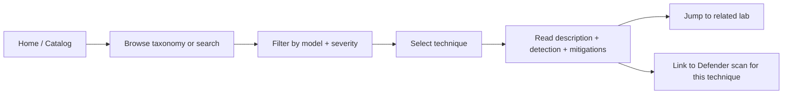
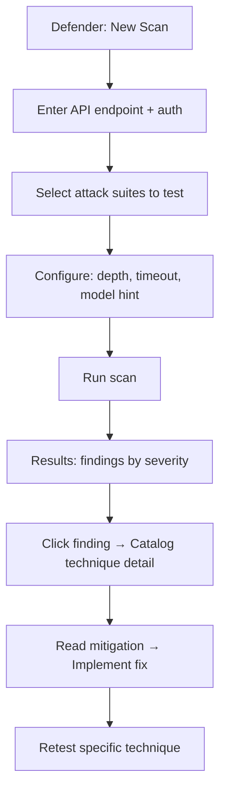
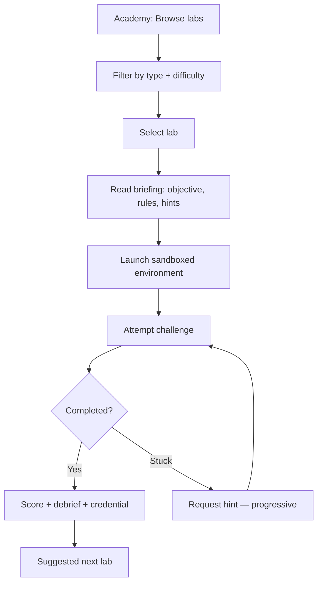
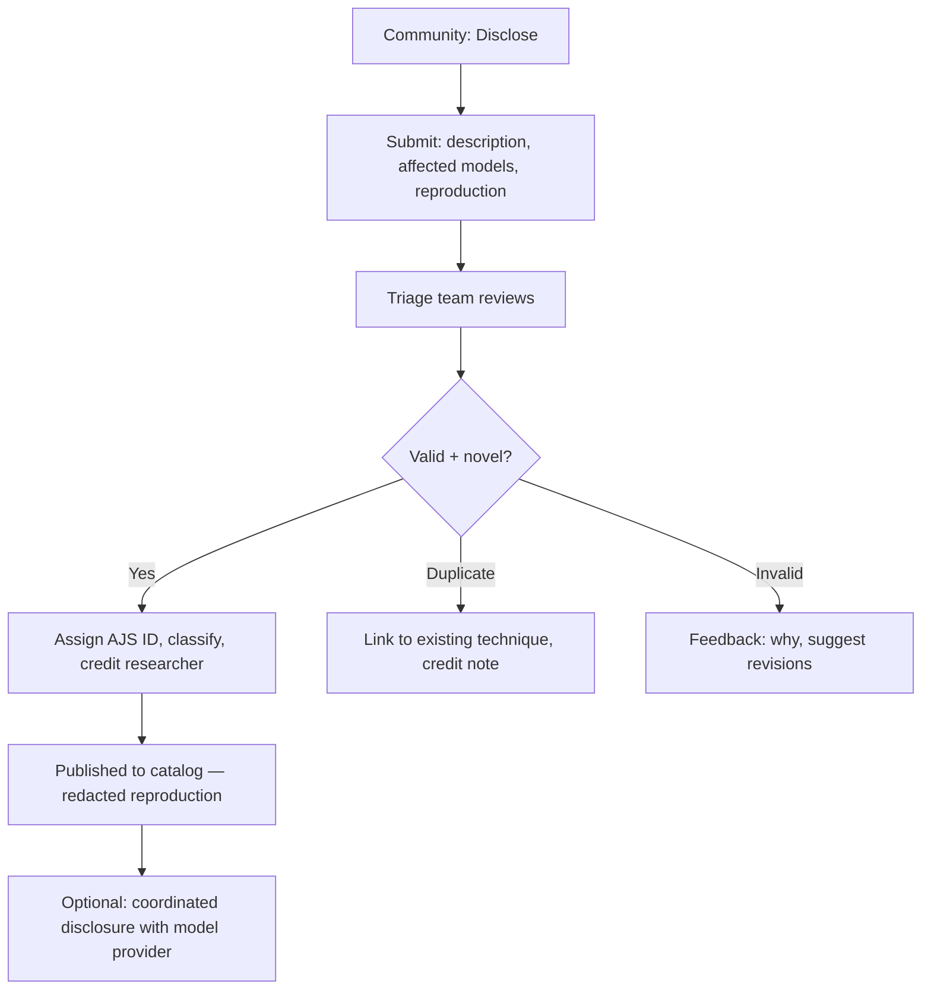
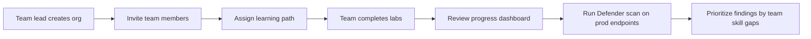

# NOIZUAI-25: JailbreakingSite

**Domain:** [jailbreakingsite.com](http://jailbreakingsite.com)

## Elevator Pitch

**The MITRE ATT&CK framework for LLM jailbreaks.** JailbreakingSite is a living catalog of LLM jailbreak techniques, defensive testing tools, and hands-on training labs for security professionals. Browse classified attack vectors by model, technique, and severity. Run defensive audits against your own deployments. Train your team with CTF-style challenges that teach jailbreak detection and mitigation.

Think: OWASP Top 10 meets HackTheBox, purpose-built for the LLM security surface.

---

## Problem

### 1. LLM Jailbreaks Are Outpacing Defense

Every major LLM deployment is a jailbreak target. The attack surface is enormous and evolving weekly — prompt injection, multi-turn manipulation, encoding tricks, tool-use exploitation, context poisoning. New bypass techniques spread faster than patches ship.

OWASP published their LLM Top 10 in 2023, updated in 2025. But a top-10 list isn't operational. Security teams need a living, searchable, categorized database of *specific* techniques — not categories of risk, but the actual attacks, with reproduction steps, affected models, detection signatures, and mitigation patterns.

### 2. Defenders Lack a Shared Knowledge Base

The current state of LLM security knowledge:

| Source | What It Offers | What's Missing |
|---|---|---|
| **OWASP LLM Top 10** | Risk categories, high-level guidance | No specific techniques, no testing tools, no training |
| **MITRE ATLAS** | Adversarial ML threat matrix, case studies | Broader than LLM, slow to update, no hands-on labs |
| **Academic papers** | Deep analysis of specific attacks | Scattered across arXiv, no central index, no practical tooling |
| **Twitter/X threads** | Fastest source of new jailbreaks | Ephemeral, unstructured, no severity classification, hard to search |
| **JailbreakChat (defunct)** | Crowdsourced jailbreak prompts | No defensive framing, no mitigations, no training — just attack strings |
| **Garak / other scanners** | Automated vulnerability probes | Tools, not education — run a scan, get a report, still don't understand *why* |
| **Model provider docs** | Safety guidelines, content policies | Defensive-only, no adversarial perspective, often vague |

**The gap:** No single resource combines a **structured attack catalog** (like MITRE ATT&CK) with **hands-on testing tools** (like Burp Suite) and **training labs** (like HackTheBox) — all specific to LLM jailbreaking. Security teams are assembling this from blog posts, Twitter threads, and trial-and-error.

### 3. Enterprise Teams Are Deploying LLMs Without Security Literacy

Companies are shipping LLM-powered features — chatbots, agents, code assistants, document processors — at a pace that outstrips their security teams' understanding of the attack surface. A traditional AppSec engineer knows SQL injection cold. Ask them about multi-turn jailbreak escalation or indirect prompt injection via RAG documents, and they're starting from zero.

The training gap is the real problem. Tools help. Knowledge helps more.

---

## Solution: Attack Catalog + Defensive Testing + Training Labs

### Core Concept

JailbreakingSite is three products in a trenchcoat:

| Layer | What It Is | Analogue |
|---|---|---|
| **Catalog** | Structured, searchable database of jailbreak techniques with classifications, affected models, severity, mitigations | MITRE ATT&CK |
| **Defender** | Defensive testing tools — run curated attack suites against your LLM endpoints and get a security report | OWASP ZAP / Burp Suite |
| **Academy** | CTF-style training labs where you practice attacking and defending LLM systems in sandboxed environments | HackTheBox / TryHackMe |

Each layer reinforces the others: the Catalog teaches you what attacks exist, the Defender tests whether you're vulnerable, the Academy trains you to fix what you find.

### The Catalog — Attack Taxonomy

Every jailbreak technique is classified using a consistent schema:

```
┌─────────────────────────────────────────────────┐
│  TECHNIQUE ENTRY                                │
├─────────────────────────────────────────────────┤
│  ID: AJS-2026-0147                              │
│  Name: "Context Window Exhaustion"              │
│  Category: Resource Manipulation                │
│  Subcategory: Context Poisoning                 │
│                                                 │
│  Severity: HIGH                                 │
│  CVSS-LLM: 7.8 (custom scoring)                │
│                                                 │
│  Description:                                   │
│  Floods the context window with benign tokens   │
│  to push system prompt and safety instructions  │
│  outside the model's effective attention range,  │
│  then issues harmful requests in the remaining  │
│  space.                                         │
│                                                 │
│  Affected Models:                               │
│  ├─ GPT-4o (confirmed, pre-2026-02 patch)      │
│  ├─ Claude 3.5 Sonnet (partial, mitigated)     │
│  └─ Llama 3.1 70B (confirmed, unpatched)       │
│                                                 │
│  Attack Vector:                                 │
│  [Detailed reproduction steps — redacted in     │
│   public view, full in authenticated view]      │
│                                                 │
│  Detection Signatures:                          │
│  ├─ Token count anomaly (>80% context used      │
│  │  before first user query)                    │
│  ├─ Entropy pattern: low-entropy padding        │
│  │  followed by high-entropy instruction        │
│  └─ System prompt echo test failure             │
│                                                 │
│  Mitigations:                                   │
│  ├─ Input token budget enforcement              │
│  ├─ System prompt anchoring (repeat at tail)    │
│  ├─ Sliding window safety check                 │
│  └─ Context segmentation                        │
│                                                 │
│  References:                                    │
│  ├─ arXiv:2026.XXXXX                            │
│  ├─ AJS Lab: context-exhaustion-101             │
│  └─ Related: AJS-2025-0089 (Token Smuggling)    │
│                                                 │
│  First Reported: 2025-11-14                     │
│  Last Updated: 2026-03-01                       │
│  Status: Active                                 │
└─────────────────────────────────────────────────┘
```

### Attack Categories (Top-Level Taxonomy)

| Category | Description | Example Techniques |
|---|---|---|
| **Prompt Injection** | Directly overriding system instructions via user input | DAN variants, role-play exploitation, instruction override |
| **Indirect Injection** | Attacks embedded in data the LLM processes (RAG docs, tool outputs, emails) | Invisible text injection, markdown image exfiltration, tool-output poisoning |
| **Multi-Turn Escalation** | Gradual boundary-pushing across conversation turns | Crescendo attack, persona building, context anchoring |
| **Encoding & Obfuscation** | Bypassing filters through encoding, translation, or reformulation | Base64 payloads, language switching, leetspeak, Unicode abuse |
| **Resource Manipulation** | Exploiting context windows, token limits, or processing constraints | Context exhaustion, token smuggling, attention hijacking |
| **Tool-Use Exploitation** | Abusing function calling, MCP servers, or agent tool access | Tool parameter injection, chain-of-tool attacks, privilege escalation |
| **Model-Specific** | Attacks targeting specific model architectures or training artifacts | Fine-tuning backdoors, RLHF reward hacking, tokenizer exploits |
| **Social Engineering** | Manipulating the model's "persona" or alignment training | Authority impersonation, emotional manipulation, ethical dilemma framing |

### The Defender — Defensive Testing Suite

A hosted tool (and self-hosted option) that runs curated attack suites against your LLM endpoint:

```
┌─────────────────────────────────────────────────┐
│  DEFENDER SCAN REPORT                           │
├─────────────────────────────────────────────────┤
│                                                 │
│  Target: api.yourcompany.com/v1/chat            │
│  Model: GPT-4o (detected)                       │
│  Scan Date: 2026-03-13                          │
│  Techniques Tested: 247 / 412                   │
│                                                 │
│  ┌────────────────────────────────────────┐     │
│  │  RESULTS SUMMARY                      │     │
│  │                                        │     │
│  │  ██████░░░░  CRITICAL: 3              │     │
│  │  ████████░░  HIGH: 7                  │     │
│  │  ██████████  MEDIUM: 14              │     │
│  │  ████░░░░░░  LOW: 22                 │     │
│  │  ░░░░░░░░░░  PASS: 201              │     │
│  └────────────────────────────────────────┘     │
│                                                 │
│  CRITICAL FINDINGS:                             │
│                                                 │
│  1. AJS-2026-0147 — Context Window Exhaustion   │
│     Your endpoint accepted 120K tokens of       │
│     padding before a harmful query, and the     │
│     model complied with the harmful request.    │
│     → Mitigation: Input token budget [link]     │
│                                                 │
│  2. AJS-2025-0203 — Indirect Injection via RAG  │
│     A crafted document injected into your RAG   │
│     pipeline overrode system instructions.      │
│     → Mitigation: RAG content sandboxing [link] │
│                                                 │
│  3. AJS-2026-0091 — Tool Parameter Injection    │
│     The model passed unsanitized user input     │
│     directly to a tool's SQL parameter.         │
│     → Mitigation: Tool input validation [link]  │
│                                                 │
│  [Full Report PDF] [Retest] [Share with Team]   │
│                                                 │
└─────────────────────────────────────────────────┘
```

### The Academy — Training Labs

Sandboxed environments where practitioners learn by doing:

| Lab Type | Description | Duration |
|---|---|---|
| **Attack Labs** | You're the red-teamer — jailbreak a sandboxed LLM deployment using specific technique categories. Scored on speed and technique variety. | 30-90 min |
| **Defense Labs** | You're the defender — configure guardrails, input filters, and monitoring on a vulnerable LLM deployment, then face an automated attack barrage. | 60-120 min |
| **Incident Response** | A production LLM has been compromised. Investigate logs, identify the attack vector, contain the breach, and write the postmortem. | 90-180 min |
| **Build Challenges** | Design and implement a specific defensive control (input sanitizer, output classifier, monitoring pipeline) against a test suite. | 2-4 hrs |

Labs are progressive: Fundamentals → Intermediate → Advanced → Expert. Completions earn verifiable credentials.

---

## Target Users

### Primary: AI Security Engineers & Red-Teamers

- Security professionals whose scope now includes LLM deployments
- Perform red-team assessments of AI-powered products
- Need structured, up-to-date attack intelligence and reproducible test cases
- **Job to be done:** "I need to red-team our company's LLM chatbot by Friday — give me a systematic methodology and the specific attacks to test"

### Secondary: Enterprise Security Teams

- AppSec and infrastructure security teams at companies deploying LLMs
- Responsible for security posture but lack LLM-specific expertise
- Need defensive tooling that integrates with existing security workflows
- **Job to be done:** "We just shipped an LLM-powered feature to 50K users — how do we know it's not vulnerable to jailbreaking?"

### Tertiary: AI/ML Engineers Building with LLMs

- Developers integrating LLMs into products (RAG pipelines, agents, chatbots)
- Building guardrails and safety layers but don't know what to defend against
- Want practical guidance, not theoretical risk categories
- **Job to be done:** "I'm building input validation for our LLM endpoint — what attacks should my filter catch?"

### Emerging: Security Researchers & Academics

- Publishing on adversarial ML and LLM safety
- Need a structured taxonomy to reference and contribute to
- Currently citing scattered blog posts and Twitter threads
- **Job to be done:** "I discovered a new jailbreak technique — where do I disclose it responsibly, and how does it relate to known techniques?"

---

## Competitive Landscape

| Resource | Strength | Gap JailbreakingSite Fills |
|---|---|---|
| **OWASP LLM Top 10** | Industry-recognized risk categories, broad adoption | Categories, not techniques. No testing tools. No training. Updated infrequently. |
| **MITRE ATLAS** | Mature threat matrix, case studies, ties to ATT&CK | Covers all adversarial ML, not LLM-specific. Slow to update. No hands-on labs. |
| **Garak** | Open-source LLM vulnerability scanner | Tool-only — run scans, get reports. No education, no training, no taxonomy context. |
| **HackTheBox / TryHackMe** | Best-in-class security training platform | General cybersecurity. No LLM-specific content. No jailbreak catalog. |
| **Adversa AI** | Commercial AI red-team service | Consulting service, not a platform. Enterprise-only. Not self-serve. |
| **Prompt Injection datasets** (academic) | Research-quality attack examples | Unstructured datasets, not operational. No severity. No mitigations. No tooling. |
| **LLM provider safety docs** | Model-specific guardrail guidance | Defensive only. No adversarial perspective. Often vague. Vendor-locked. |
| **r/ChatGPT, Twitter jailbreak threads** | Fastest source of new techniques | Ephemeral. Unstructured. No defensive framing. No professional utility. |

**Positioning:** JailbreakingSite is not a scanner (Garak), not a consulting firm (Adversa), not a risk taxonomy (OWASP), and not a general security training platform (HackTheBox). It's the **structured, operational, hands-on security resource purpose-built for LLM jailbreaking** — the place where the attack catalog, the testing tools, and the training all live together.

---

## Key Features (MVP Scope)

### 1. Attack Catalog

- Structured database of jailbreak techniques with consistent schema
- Taxonomy: 8 top-level categories, expandable subcategories
- Per-technique: severity, affected models, detection signatures, mitigations, references
- Search by keyword, category, model, severity, date
- Responsible disclosure: full reproduction steps require authentication; public view shows detection + mitigation

### 2. Technique Explorer

- Interactive taxonomy visualization — browse the attack tree
- Filter by model family, severity, status (active/patched/theoretical)
- "Related techniques" graph — see how attacks connect and evolve
- Timeline view — when techniques emerged, when they were patched
- Diff view — compare technique variants across model families

### 3. Defender (Testing Tool)

- Point at your LLM API endpoint, select attack categories, run scan
- Curated test suites per category (not raw prompt spam — intelligent, staged attacks)
- Results linked back to catalog entries with specific mitigations
- Export: PDF report, JSON for CI/CD integration, SARIF format
- Self-hosted option for air-gapped environments

### 4. Academy (Training Labs)

- Browser-based sandboxed LLM environments (no local setup)
- Progressive difficulty: Fundamentals → Intermediate → Advanced → Expert
- Attack labs + Defense labs + Incident response scenarios
- Completion tracking, skill assessment, verifiable credentials
- Team management: assign labs, track progress, benchmark against industry

### 5. Community & Disclosure

- Responsible disclosure workflow: submit new techniques, get credited
- Community annotations on catalog entries (confirmed/disputed/patched)
- Monthly "State of Jailbreaking" report — new techniques, trends, model comparisons
- Researcher profiles and contribution credit

### 6. API

- Programmatic access to the attack catalog
- Integrate technique data into your security tooling, SIEM, or CI/CD pipeline
- Webhook notifications for new techniques affecting your model stack
- Rate-limited free tier, authenticated pro tier

---

## Information Architecture

```
┌─────────────────────────────────────────────────────────────┐
│  AJILBREAKINGSITE APP STRUCTURE                              │
├─────────────────────────────────────────────────────────────┤
│                                                             │
│  Home ──────────── Latest techniques, threat pulse,         │
│                    featured labs, monthly report             │
│                                                             │
│  Catalog ──────── Taxonomy tree → Category → Technique      │
│    ├── Browse     Grid/list of classified techniques        │
│    ├── Search     Keyword + filters (model, severity, etc.) │
│    └── Timeline   Chronological emergence of techniques     │
│                                                             │
│  Technique ────── Full technique detail: description,       │
│    Detail         severity, affected models, detection,     │
│                   mitigations, references, related, labs     │
│                                                             │
│  Defender ─────── Configure target → Select suites → Run    │
│    ├── New Scan   scan → View results                       │
│    ├── Reports    Historical scan results, trends           │
│    └── Setup      API key config, self-hosted docs          │
│                                                             │
│  Academy ──────── Lab catalog → Lab detail → Launch lab     │
│    ├── Labs       Browse by type, difficulty, category      │
│    ├── Paths      Structured learning paths (curriculum)    │
│    ├── Progress   Completion status, credentials earned     │
│    └── Teams      Team management, assignments, benchmarks  │
│                                                             │
│  Community ────── Disclosure submission, annotations,       │
│    ├── Disclose   researcher profiles, monthly reports      │
│    └── Reports    "State of Jailbreaking" monthly           │
│                                                             │
│  API ──────────── Documentation, keys, usage, webhooks      │
│                                                             │
│  Account ──────── Profile, API keys, team, billing          │
│                                                             │
└─────────────────────────────────────────────────────────────┘
```

---

## Primary User Flows

### Flow 1: Research a Jailbreak Technique



### Flow 2: Run a Defensive Scan



### Flow 3: Complete a Training Lab



### Flow 4: Disclose a New Technique



### Flow 5: Onboard a Security Team



---

## Key Screens

### Screen 1: Home — Threat Pulse

```
┌─────────────────────────────────────────────────┐
│  ▓ AJILBREAKINGSITE         [Catalog] [Defender]│
│                     [Academy] [API] [Sign In]   │
│─────────────────────────────────────────────────│
│                                                 │
│  THREAT PULSE                       March 2026  │
│  ─────────────────────────────────              │
│                                                 │
│  412 techniques cataloged                       │
│   47 added this month                           │
│    3 critical severity (active, unpatched)      │
│                                                 │
│  ─ ─ ─ ─ ─ ─ ─ ─ ─ ─ ─ ─ ─ ─ ─ ─ ─ ─ ─ ─ ─ │
│                                                 │
│  LATEST CRITICAL                                │
│                                                 │
│  ┌─────────────────────────────────────────┐    │
│  │ AJS-2026-0203  CRITICAL                │    │
│  │ Indirect Injection via RAG Metadata     │    │
│  │ Affects: GPT-4o, Claude 3.5, Gemini    │    │
│  │ Status: Active — no vendor patch        │    │
│  │ [View Technique] [Defender Test] [Lab]  │    │
│  └─────────────────────────────────────────┘    │
│                                                 │
│  ┌─────────────────────────────────────────┐    │
│  │ AJS-2026-0198  CRITICAL                │    │
│  │ MCP Tool Chain Privilege Escalation     │    │
│  │ Affects: Any agent with tool-use        │    │
│  │ Status: Active — mitigation available   │    │
│  │ [View Technique] [Defender Test] [Lab]  │    │
│  └─────────────────────────────────────────┘    │
│                                                 │
│  ─ ─ ─ ─ ─ ─ ─ ─ ─ ─ ─ ─ ─ ─ ─ ─ ─ ─ ─ ─ ─ │
│                                                 │
│  MONTHLY REPORT                                 │
│  State of Jailbreaking — March 2026             │
│  "Tool-use exploitation surges as agent         │
│   deployments accelerate. 60% of new            │
│   techniques target agentic architectures."     │
│  [Read Full Report →]                           │
│                                                 │
│  ─ ─ ─ ─ ─ ─ ─ ─ ─ ─ ─ ─ ─ ─ ─ ─ ─ ─ ─ ─ ─ │
│                                                 │
│  FEATURED LABS                                  │
│                                                 │
│  ┌──────────────┐ ┌──────────────┐ ┌──────────┐│
│  │ Prompt       │ │ RAG Defense  │ │ Agent    ││
│  │ Injection    │ │ Workshop     │ │ Red Team ││
│  │ Fundamentals │ │              │ │ Sim      ││
│  │              │ │ Intermediate │ │          ││
│  │ Beginner     │ │ 90 min       │ │ Advanced ││
│  │ 45 min       │ │ 2.1K done    │ │ 3 hrs    ││
│  │ 8.4K done    │ │              │ │ 340 done ││
│  │ [Start →]    │ │ [Start →]    │ │[Start →] ││
│  └──────────────┘ └──────────────┘ └──────────┘│
│                                                 │
└─────────────────────────────────────────────────┘
```

### Screen 2: Catalog — Taxonomy Browser

```
┌─────────────────────────────────────────────────┐
│  ← Home                CATALOG          [Search]│
│─────────────────────────────────────────────────│
│  View: [Tree] [List] [Timeline]    412 entries  │
│─────────────────────────────────────────────────│
│                                                 │
│  ▼ Prompt Injection                    (87)     │
│    ├── Direct Override                 (31)     │
│    ├── Role-Play Exploitation          (24)     │
│    ├── Instruction Confusion           (18)     │
│    └── System Prompt Extraction        (14)     │
│                                                 │
│  ▶ Indirect Injection                  (64)     │
│  ▶ Multi-Turn Escalation               (52)     │
│  ▶ Encoding & Obfuscation              (48)     │
│  ▶ Resource Manipulation               (37)     │
│                                                 │
│  ▼ Tool-Use Exploitation               (56)     │
│    ├── Parameter Injection             (19)     │
│    ├── Chain-of-Tool Attacks           (15)     │
│    ├── Privilege Escalation            (12)     │
│    └── MCP-Specific                     (10)     │
│                                                 │
│  ▶ Model-Specific                      (41)     │
│  ▶ Social Engineering                  (27)     │
│                                                 │
│─────────────────────────────────────────────────│
│  Filter: [All Models ▼] [All Severity ▼]       │
│          [Active Only ☑] [Has Lab ☐]           │
│                                                 │
│  TRENDING THIS WEEK                             │
│  ● AJS-2026-0210 — Attention Anchor Hijacking   │
│  ● AJS-2026-0207 — Multi-Modal Prompt Injection  │
│  ● AJS-2026-0203 — RAG Metadata Injection        │
│                                                 │
└─────────────────────────────────────────────────┘
```

### Screen 3: Technique Detail

```
┌─────────────────────────────────────────────────┐
│  ← Catalog / Tool-Use / Parameter Injection     │
│─────────────────────────────────────────────────│
│                                                 │
│  AJS-2026-0091                                  │
│  Tool Parameter Injection           ██ CRITICAL │
│  ─────────────────────────────────              │
│                                                 │
│  CVSS-LLM: 8.4 · Active · First: 2025-09-22   │
│  Updated: 2026-03-01 · 14 annotations          │
│                                                 │
│  ─ ─ ─ ─ ─ ─ ─ ─ ─ ─ ─ ─ ─ ─ ─ ─ ─ ─ ─ ─ ─ │
│                                                 │
│  DESCRIPTION                                    │
│                                                 │
│  When an LLM has access to tools with           │
│  parameterized inputs (database queries, API    │
│  calls, file operations), user-supplied content │
│  can be passed directly to tool parameters      │
│  without sanitization. This enables classical   │
│  injection attacks (SQL, command, path) via      │
│  the LLM as an intermediary.                    │
│                                                 │
│  Unlike traditional injection, the attacker     │
│  doesn't need to know the tool's interface —    │
│  the LLM translates natural language into the   │
│  injection payload.                             │
│                                                 │
│  ─ ─ ─ ─ ─ ─ ─ ─ ─ ─ ─ ─ ─ ─ ─ ─ ─ ─ ─ ─ ─ │
│                                                 │
│  AFFECTED MODELS                                │
│  ├─ GPT-4o         Confirmed  (tool_use mode)  │
│  ├─ Claude 3.5     Confirmed  (tool_use mode)  │
│  ├─ Gemini 2.0     Confirmed  (function calls) │
│  └─ Any model w/   Likely     (architecture-   │
│     tool access                 independent)    │
│                                                 │
│  ─ ─ ─ ─ ─ ─ ─ ─ ─ ─ ─ ─ ─ ─ ─ ─ ─ ─ ─ ─ ─ │
│                                                 │
│  DETECTION SIGNATURES                           │
│  1. Tool calls containing SQL/shell metachar    │
│  2. User message → tool param content overlap   │
│  3. Tool error rate spike (failed injections)   │
│  4. Anomalous tool parameter length/entropy     │
│                                                 │
│  ─ ─ ─ ─ ─ ─ ─ ─ ─ ─ ─ ─ ─ ─ ─ ─ ─ ─ ─ ─ ─ │
│                                                 │
│  MITIGATIONS                                    │
│  ├─ Parameterized queries for all tool inputs   │
│  ├─ Tool input validation layer (type + format) │
│  ├─ Output monitoring for injection indicators  │
│  └─ Principle of least privilege for tool scope  │
│                                                 │
│  ─ ─ ─ ─ ─ ─ ─ ─ ─ ─ ─ ─ ─ ─ ─ ─ ─ ─ ─ ─ ─ │
│                                                 │
│  RELATED                                        │
│  → AJS-2026-0147 Context Window Exhaustion      │
│  → AJS-2025-0089 Token Smuggling                │
│  → AJS-2026-0102 Chain-of-Tool Escalation       │
│                                                 │
│  [🔬 Test with Defender] [📚 Practice in Lab]   │
│  [Annotate] [Suggest Edit] [Share]              │
│                                                 │
└─────────────────────────────────────────────────┘
```

### Screen 4: Defender — Scan Configuration

```
┌─────────────────────────────────────────────────┐
│  ← Defender                 NEW SCAN            │
│─────────────────────────────────────────────────│
│                                                 │
│  TARGET                                         │
│  ┌─────────────────────────────────────────┐    │
│  │ https://api.yourcompany.com/v1/chat     │    │
│  └─────────────────────────────────────────┘    │
│  Auth: [Bearer Token ▼]  Model: [Auto-detect]   │
│                                                 │
│  ─ ─ ─ ─ ─ ─ ─ ─ ─ ─ ─ ─ ─ ─ ─ ─ ─ ─ ─ ─ ─ │
│                                                 │
│  ATTACK SUITES                                  │
│                                                 │
│  ☑ Prompt Injection — Core       87 techniques  │
│  ☑ Indirect Injection            64 techniques  │
│  ☐ Multi-Turn Escalation         52 techniques  │
│  ☑ Encoding & Obfuscation        48 techniques  │
│  ☐ Resource Manipulation         37 techniques  │
│  ☑ Tool-Use Exploitation         56 techniques  │
│  ☐ Model-Specific                41 techniques  │
│  ☐ Social Engineering            27 techniques  │
│                                                 │
│  Selected: 255 techniques                       │
│                                                 │
│  ─ ─ ─ ─ ─ ─ ─ ─ ─ ─ ─ ─ ─ ─ ─ ─ ─ ─ ─ ─ ─ │
│                                                 │
│  CONFIGURATION                                  │
│  Depth: [Standard ▼]  (Quick / Standard / Deep) │
│  Timeout: [30s per technique]                   │
│  Parallel: [5 concurrent]                       │
│  Report: [PDF + JSON ▼]                         │
│                                                 │
│  Estimated time: ~45 minutes                    │
│  Estimated cost: 12 scan credits                │
│                                                 │
│  [ ▶ Start Scan ]                               │
│                                                 │
└─────────────────────────────────────────────────┘
```

### Screen 5: Academy — Lab Environment

```
┌─────────────────────────────────────────────────┐
│  ← Academy          LAB: Tool Injection Defense │
│─────────────────────────────────────────────────│
│  Difficulty: Intermediate · Time: 90 min        │
│  Category: Tool-Use Exploitation                │
│  Progress: ██████░░░░ 3/5 objectives            │
│─────────────────────────────────────────────────│
│                                                 │
│  BRIEFING                                       │
│  You're defending an LLM-powered customer       │
│  support agent that has access to a database    │
│  lookup tool and an email-sending tool. An      │
│  automated attacker will attempt tool parameter │
│  injection. Your job: configure input           │
│  validation and monitoring to block attacks     │
│  without breaking legitimate functionality.     │
│                                                 │
│  ─ ─ ─ ─ ─ ─ ─ ─ ─ ─ ─ ─ ─ ─ ─ ─ ─ ─ ─ ─ ─ │
│                                                 │
│  OBJECTIVES                     STATUS          │
│  1. Block SQL injection via     ✓ Complete      │
│     database lookup tool                        │
│  2. Block command injection     ✓ Complete      │
│     via email tool                              │
│  3. Maintain >95% legitimate    ✓ Complete      │
│     query success rate                          │
│  4. Detect and log attempted    ○ In progress   │
│     injections                                  │
│  5. Handle a multi-turn         ○ Not started   │
│     escalation attempt                          │
│                                                 │
│  ─ ─ ─ ─ ─ ─ ─ ─ ─ ─ ─ ─ ─ ─ ─ ─ ─ ─ ─ ─ ─ │
│                                                 │
│  ┌─ SANDBOX TERMINAL ────────────────────┐      │
│  │ $ cat guardrails/tool_validator.py    │      │
│  │ def validate_tool_input(tool, params):│      │
│  │   # Your defense code here            │      │
│  │   ...                                 │      │
│  │                                        │      │
│  │ $ _                                   │      │
│  └────────────────────────────────────────┘      │
│                                                 │
│  [Hint (2 remaining)] [Related Technique]       │
│  [Reset Lab] [Submit for Scoring]               │
│                                                 │
└─────────────────────────────────────────────────┘
```

---

## Visual Direction

**Style:** Minimal Tech (80%) + Bold Expressive (20%)

**Rationale:** The platform's credibility depends on looking serious and trustworthy — Minimal Tech's "we're smart and assume you are too" positioning is essential. But "jailbreaking" has a hacker-culture edge. The Bold Expressive accent brings controlled intensity: glitch textures, monospace typography, high-contrast severity indicators. The result should feel like a security operations center that knows it's cool — professional but not corporate.

**The metaphor:** A clean room with a red emergency light. Calm until something critical demands attention.

### Color System

```
PALETTE: "CLEAN ROOM / RED ALERT"

Light Mode (primary):
  Background:  #FAFAFA  (Near-white — sterile, operational)
  Surface:     #FFFFFF  (Cards and panels)
  Border:      #E5E5E5  (Subtle structural lines)

  Text:        #171717  (Near-black, high contrast)
  Text Muted:  #525252  (Medium gray for metadata)

  Accent:      #10B981  (Security green — "all clear")
  Link:        #3B82F6  (Standard blue — trustworthy)

  Critical:    #EF4444  (Red — immediate attention)
  High:        #F59E0B  (Amber — elevated risk)
  Medium:      #3B82F6  (Blue — moderate concern)
  Low:         #6B7280  (Gray — informational)

  Lab Active:  #8B5CF6  (Purple — sandbox / practice mode)
  Defender:    #06B6D4  (Cyan — scanning / active testing)

Dark Mode (primary for power users — many will prefer this):
  Background:  #0A0A0A  (Terminal black)
  Surface:     #171717  (Elevated panels)
  Border:      #262626  (Subtle dividers)
  Text:        #FAFAFA  (High contrast white)
  Text Muted:  #A3A3A3  (Dimmed)
  Accent:      #34D399  (Brighter green for dark bg)

  Same semantic colors, slightly brightened for dark mode contrast.
```

### Typography

```
Primary / UI:       Inter or Geist Sans
                    Geometric, clean, functional
                    Signals: "This is a tool you can trust"

Monospace accent:   JetBrains Mono or Geist Mono
                    Used HEAVILY — technique IDs, code blocks,
                    detection signatures, terminal interfaces,
                    severity labels, the scan interface
                    Signals: "This is security infrastructure"

Headings:           Inter Bold / Geist Sans Bold
                    No serif — this is operational, not editorial

Body:               Inter 400, 16px, line-height 1.6
                    Max-width: 72ch (wider than editorial —
                    technical content needs breathing room)
```

### Visual Identity Cues

- **Monospace everywhere** — Technique IDs (`AJS-2026-0091`), severity badges, scan results, terminal interfaces. Monospace is the voice of the platform.
- **Severity color coding** — Red/amber/blue/gray badges appear on every technique, every scan result, every dashboard metric. They're the visual heartbeat.
- **Terminal aesthetic for interactive elements** — Labs and Defender use a dark terminal-style interface. The rest of the site is clean light mode. The contrast signals: "you've entered the working zone."
- **Grid lines and data density** — Tables, structured data, filterable lists. This is a reference tool, not a magazine. Information density is valued.
- **Glitch/break motif (Bold Expressive 20%)** — Subtle: the logo has a single intentional "break" in one character. Section dividers occasionally use a disrupted line. The 404 page goes full glitch. Used sparingly — enough to signal the hacker-culture edge without undermining credibility.
- **No stock photos, no illustrations** — Data visualization, ASCII-style diagrams, and typography carry the visual weight. Feels like documentation from the future.

### Motion Language

| Interaction | Animation | Duration |
|---|---|---|
| Severity badge load | Fills from left to right with severity color | 200ms ease-out |
| Scan progress | Terminal-style log scroll, percentage bar | Real-time |
| Lab launch | Dark overlay slides up (entering "the sandbox") | 300ms ease-in-out |
| New technique added | Row highlights briefly, fades to normal | 150ms + 2s hold |
| Filter change | Content cross-fades, no layout shift | 150ms |
| Threat pulse counter | Numbers tick up smoothly (odometer style) | Variable, 50ms/digit |

---

## Open Questions

Flagging per the "Is this bullshit?" principle — these are genuine unknowns:

1. **Technique classification fidelity** — The 8-category taxonomy is a starting hypothesis. Real jailbreak techniques are messy — many span multiple categories, and new categories emerge with new model capabilities (multi-modal, agentic). *Need to study how MITRE ATLAS handles taxonomy evolution and build for extensibility from day one.*

2. **Responsible disclosure ethics** — Publishing reproduction steps for jailbreaks, even behind authentication, has a dual-use tension. How do you balance operational utility for defenders with the risk of enabling attackers? *Need a clear disclosure policy, probably modeled on traditional CVE processes. Coordinated disclosure with model providers? Embargo periods?*

3. **Scanning legality** — Running automated jailbreak attempts against a user's own API endpoint is fine. But the terms of service of most LLM providers prohibit adversarial testing. Scanning an OpenAI endpoint might violate OpenAI's ToS even if the user owns the account. *Need legal review. May need to focus the Defender tool on self-hosted models initially.*

4. **Lab sandboxing costs** — Each training lab requires a live LLM instance that the user can attack. If labs use commercial APIs (GPT-4, Claude), per-lab costs could be $0.50-2.00+. Open-source models (Llama, Mistral) are cheaper to self-host but may not represent the attack surface of commercial models. *Need to model: what's the right mix of open-source + commercial LLMs for realistic training at sustainable cost?*

5. **Catalog freshness** — Jailbreak techniques evolve weekly. A static catalog goes stale fast. Community contributions help but need quality control. Automated monitoring (scraping research papers, tracking model update changelogs) could help but adds complexity. *What's the minimum editorial team size to maintain a 400+ technique catalog?*

6. **Brand name** — "JailbreakingSite" is memorable but long, slightly awkward to type, and the initial "A" is ambiguous. The domain works. But the brand might benefit from tightening. *Is there a shorter brand name that could work with this domain? Or lean into the awkwardness as distinctive?*

---

## Monetization

| Tier | Includes | Price Signal |
|---|---|---|
| **Free** | Catalog browse (public data only), 3 lab attempts/month, monthly report, community participation | Free (the catalog is the product) |
| **Pro** | Full technique details (reproduction steps), unlimited labs, Defender: 5 scans/month, API: 1K requests/day, verifiable credentials | $29/mo |
| **Team** | Everything in Pro × team size, team management dashboard, Defender: 50 scans/month, SARIF/CI integration, priority support, custom lab assignments | $99/mo per seat (min 3) |
| **Enterprise** | Unlimited everything, self-hosted Defender, custom attack suites, private technique submissions (internal-only), SLA, dedicated CSM, SSO/SAML | $499+/mo (annual contract) |

**Additional revenue streams:**

- **Certification program** — "AJS Certified LLM Security Professional" — proctored exam + portfolio of completed labs, $299 per attempt, annual renewal
- **API commercial tier** — For security vendors integrating the catalog into their products, $199-999/mo based on volume
- **Custom training** — Enterprise teams get custom labs modeled on their specific LLM architecture, $5K-15K per engagement
- **Sponsored research** — Model providers sponsor catalog maintenance for their models (e.g., "Anthropic sponsors Claude technique entries" — transparency required)

---

## Adjacent Opportunities

- **Browser extension** — "AJS Check" — paste any prompt, get a jailbreak risk score and category classification
- **CI/CD plugin** — Run Defender scans as part of your deployment pipeline, fail the build if critical vulnerabilities found
- **VS Code extension** — Inline warnings when writing LLM system prompts that match known vulnerable patterns
- **Newsletter** — Weekly "Jailbreak Digest" — new techniques, patches, research papers, industry incidents
- **Open-source scanner** — Lightweight CLI tool (like Garak but AJS-taxonomy-aware), drives adoption back to the platform
- **Model provider partnerships** — Become the standard external red-team assessment for LLM launches
- **Annual conference** — "JailbreakCon" — the DEF CON of LLM security (virtual first, physical when community is large enough)
- **Synergy with SecureAsFrak** — AJS provides the knowledge and training layer; [SecureAsFrak](../secureasfrak/README.md) (NOIZUAI-31) provides the automated scanning infrastructure. Could share a catalog backend.

---

## Technical Considerations

| Layer | Direction |
|---|---|
| **Catalog storage** | Postgres with JSONB for flexible technique schemas. Full-text search via pg_trgm. Tags and categories as normalized tables for fast filtering. |
| **Taxonomy versioning** | Techniques are immutable entries with revision history (like Wikipedia). Category tree changes are versioned and announced. |
| **Defender engine** | Async job queue (BullMQ or similar). Each scan = a job that runs technique-specific attack scripts against the target API. Results stored as structured JSON. |
| **Lab sandboxing** | Each lab spins up an isolated environment: a target LLM (self-hosted open-source model via vLLM or Ollama), a configurable guardrail layer, and a scoring harness. Containers or Firecracker VMs. |
| **Frontend** | Next.js App Router. Heavy use of tables, filters, and structured data display. Terminal-style components for Defender and Labs (xterm.js). |
| **Auth** | OAuth (GitHub, Google) for individual users. SSO/SAML for enterprise. Role-based access: reader → contributor → team admin → org admin. |
| **API** | REST + OpenAPI spec. Rate limiting per tier. Webhook support for new-technique notifications. |
| **Disclosure pipeline** | Submission form → internal triage queue → classification → optional vendor notification → public release. Modeled on CVE process. |

---

## MVP Scope

### In Scope (v0.1)

- [ ] Attack catalog: 100 techniques across all 8 categories, manually curated
- [ ] Technique detail pages with full schema (public view — no reproduction steps)
- [ ] Taxonomy browser with category tree, search, and severity/model filters
- [ ] 5 training labs: 2 attack, 2 defense, 1 incident response (all beginner/intermediate)
- [ ] Lab sandbox using open-source models (Llama 3 or Mistral via Ollama)
- [ ] User accounts with lab completion tracking
- [ ] Monthly "State of Jailbreaking" report (manually authored)
- [ ] Static site for catalog, dynamic for labs

### Out of Scope (v0.2+)

- Defender scanning tool (requires legal review + significant infrastructure)
- Community contributions and annotations
- API access
- Team management and enterprise features
- Certification program
- Full reproduction steps (requires disclosure policy)
- CI/CD integration
- Self-hosted Defender
- Commercial model labs (GPT-4, Claude)

---

## Status

Concept / Pre-development

**Next steps:**

1. **Validate the taxonomy:** Catalog 50 real jailbreak techniques from published research (arXiv, blog posts, MITRE ATLAS) using the proposed schema. Does the 8-category taxonomy hold up? Are the severity assignments defensible? Does the schema capture what defenders actually need?
2. **Build one lab:** Create a single sandboxed "Prompt Injection Fundamentals" lab using Llama 3 via Ollama. Can a user complete the challenge in a browser? Is the scoring fair? Is the sandbox actually secure? (Don't ship a jailbreaking training platform that can itself be jailbroken.)
3. **Legal review:** Get a preliminary opinion on (a) publishing jailbreak reproduction steps behind auth, (b) running automated attacks against commercial LLM APIs with user consent, (c) the "responsible disclosure" framework.
4. **If (1)-(3) validate:** Build the static catalog site with 100 techniques and 5 labs. Launch to HackerNews / security community. Measure: do security professionals actually use and return to the catalog? Do they complete labs?
