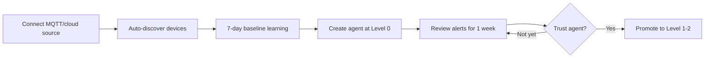
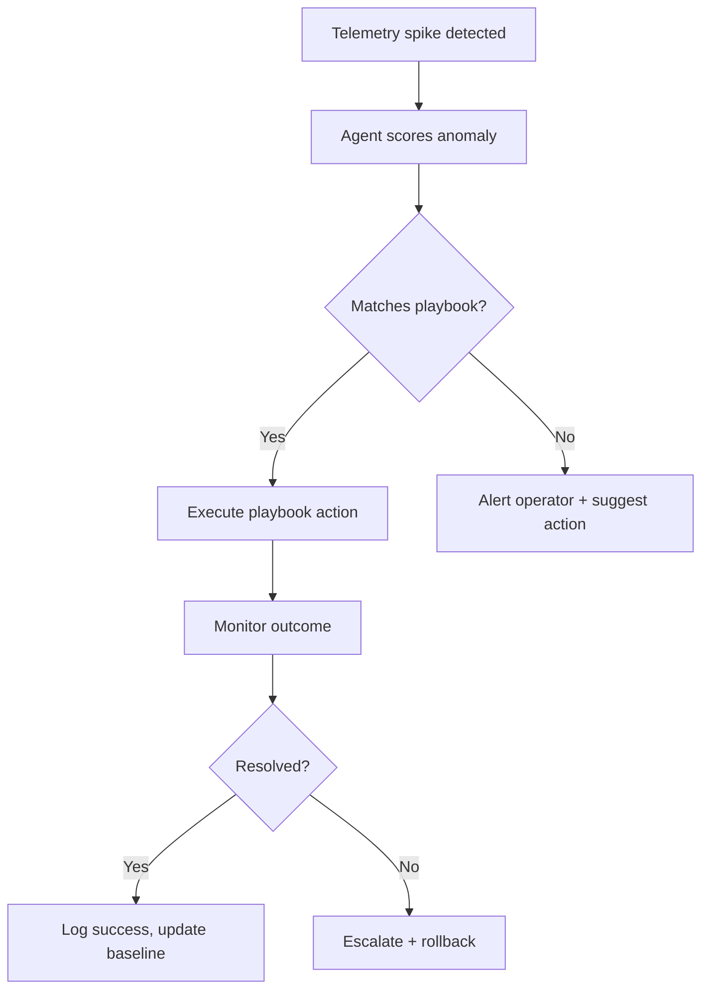
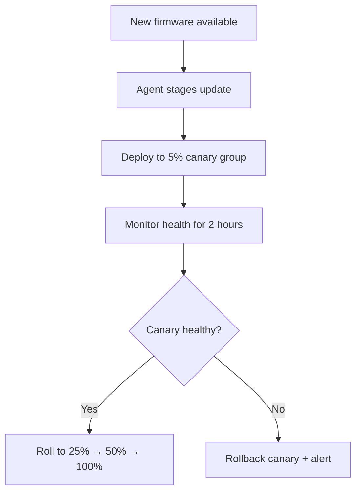

# NOIZUAI-XX: IoTGo

**Domain:** [iotgo.io](http://iotgo.io)

## Elevator Pitch

**Autonomous AI agents for IoT fleet management.** IoTGo sits on top of your existing device infrastructure and deploys agents that monitor telemetry streams, detect anomalies, execute remediation playbooks, and optimize device configurations — without waiting for a human to read a dashboard and click a button. The detect→act loop, closed.

Think: a site reliability engineer that never sleeps, but for your device fleet.

---

## Problem

IoT fleet management today is stuck in a loop:

1. **Detect-but-don't-act** — Every platform (AWS IoT, Azure IoT Hub, ThingsBoard) can surface anomalies. None of them do anything about it. You get an alert. You investigate. You remediate manually. At 3am. Again.

2. **Pilot-to-production wall** — 70% of industrial IoT pilots stall after 18 months (McKinsey 2025). The complexity of wiring telemetry → ML models → alerting → human operator → remediation → verification kills momentum. Most teams never get past the dashboard.

3. **AI is bolted on, not built in** — Current platforms sell "AI-powered anomaly detection" but what they ship is threshold alerts with a machine learning veneer. The AI detects. The human acts. There's no autonomous remediation, no closed-loop agent behavior, no learning from outcomes.

4. **Update complexity at scale** — Firmware updates, configuration changes, security patches across heterogeneous device fleets are manual, fragile, and terrifying. One bad rollout bricks 10,000 sensors.

**The gap:** The $11B AIoT market (2025) is growing at 20% CAGR, but every product in it is an *observation platform*. Nobody ships an *agent layer* that autonomously governs a fleet.

---

## Solution: Agent-Governed Device Fleets

### Core Concept

An IoTGo **agent** is a persistent, goal-oriented process bound to a device fleet (or fleet segment). Each agent has:

```
┌─────────────────────────────────────────────────┐
│  IOTGO AGENT                                    │
├─────────────────────────────────────────────────┤
│  scope: fleet:warehouse-east/temperature-sensors│
│                                                 │
│  monitors:                                      │
│    ├─ telemetry streams (temp, humidity, voltage)│
│    ├─ device health (uptime, memory, firmware)   │
│    └─ network quality (latency, packet loss)     │
│                                                 │
│  playbooks:                                     │
│    ├─ anomaly:spike → throttle + alert           │
│    ├─ anomaly:drift → recalibrate + log          │
│    ├─ health:degraded → restart + escalate       │
│    └─ firmware:outdated → stage + canary-roll    │
│                                                 │
│  constraints:                                   │
│    ├─ max_concurrent_actions: 5                  │
│    ├─ requires_approval: [firmware:rollback]     │
│    └─ escalation_threshold: 3 failures           │
│                                                 │
│  learns_from:                                   │
│    ├─ operator overrides (human corrections)     │
│    └─ outcome tracking (did the fix work?)       │
└─────────────────────────────────────────────────┘
```

### The Playbook System

Agents don't improvise blindly — they execute **playbooks**: versioned, auditable sequences of actions triggered by conditions. Playbooks are:

- **Declarative** — YAML-defined, version-controlled, reviewable
- **Constrained** — agents can only take actions explicitly granted in the playbook
- **Auditable** — every action logged with reasoning chain, telemetry snapshot, and outcome
- **Learnable** — agents suggest playbook modifications based on outcomes ("last 8 times I restarted this device type, the actual fix was a config reset — should I add that path?")

This is the safety mechanism: agents are powerful but bounded. They can't do anything the playbook doesn't authorize.

### Progressive Autonomy

IoTGo doesn't ask you to hand over your fleet on day one. Trust builds incrementally:

| Level | Agent Can | Requires Approval |
|---|---|---|
| **0 — Observer** | Monitor + alert | Everything |
| **1 — Advisor** | Monitor + recommend actions | Operator executes |
| **2 — Supervised** | Execute playbooks, auto-report | Destructive actions |
| **3 — Autonomous** | Execute all playbooks | Escalation only |
| **4 — Adaptive** | Suggest playbook changes | New playbook adoption |

Most customers start at Level 1 and promote agents to Level 2-3 over weeks as trust builds. Level 4 is where IoTGo becomes a learning system.

---

## Target Users

### Primary: IoT Platform Engineers

- Managing 500–100K devices across cloud + edge
- Already on AWS IoT / Azure IoT Hub / ThingsBoard for infrastructure
- Spending nights triaging alerts that could be automated
- **Job to be done:** "Stop waking me up for problems the system could fix itself"

### Secondary: Industrial Operations Teams

- Manufacturing plants, logistics networks, energy infrastructure
- Stuck in the pilot-to-production gap
- Need to justify IoT investment with measurable outcomes (uptime, cost)
- **Job to be done:** "Prove this IoT deployment is saving money, not just generating dashboards"

### Tertiary: Smart Building / Facility Managers

- Managing HVAC, lighting, access, environmental sensors
- Lower device counts (100–5K) but high configuration complexity
- Energy optimization is the killer use case
- **Job to be done:** "Reduce energy costs 15% without hiring a full-time IoT engineer"

---

## Competitive Landscape

| Platform | What They Do Well | Gap IoTGo Fills |
|---|---|---|
| **AWS IoT Core** | Scalable message broker, SageMaker integration | No agent layer; rules engine is static; requires heavy custom wiring |
| **Azure IoT Hub** | Best AI integration via Azure OpenAI | Still requires custom pipelines; no autonomous remediation |
| **ThingsBoard** | Open source, solid dashboards | No ML/AI; no autonomous actions; community-driven pace |
| **Particle (Digi)** | Great DX for hardware prototyping | Edge ML only; acquired 2026, direction uncertain |
| **Losant** | Workflow automation, visual builder | Workflows are reactive rules, not learning agents |
| **Balena** | Fleet OS management, containers | Infrastructure-level; no telemetry intelligence |
| **Uptake / SparkCognition** | Industrial AI/predictive maintenance | Siloed ML models; not an agent platform; enterprise-only |

**Positioning:** IoTGo is not an IoT platform. It's an **intelligence layer** that sits on top of your existing platform. Keep your AWS IoT / Azure IoT infrastructure — IoTGo adds the agents.

---

## Key Features (MVP Scope)

### 1. Fleet Connection
- Ingest from MQTT, HTTP, AWS IoT Core, Azure IoT Hub
- Auto-discover device types and telemetry schemas
- Health baseline learning (first 7 days of observation)

### 2. Agent Studio
- Create and configure agents visually
- Bind agents to fleet segments (by device type, location, tag)
- Set autonomy level and constraints
- View agent reasoning logs in real time

### 3. Playbook Editor
- YAML-based playbook definition
- Visual flow editor for non-engineers
- Condition builder (threshold, pattern, anomaly score, compound)
- Action library: restart, reconfigure, throttle, update, alert, escalate

### 4. Anomaly Detection Engine
- Unsupervised baseline learning per device type
- Multivariate anomaly scoring (not just threshold breaches)
- Seasonal and drift-aware (learns time patterns)
- Feeds into agent decision layer

### 5. Action Execution Layer
- Canary deployments for configuration changes
- Rollback on failure detection
- Parallel execution with fleet-wide safety limits
- Full audit trail with reasoning chain

### 6. Outcome Dashboard
- Not just "what happened" — "what the agent did and whether it worked"
- Fleet health score (composite metric)
- Agent performance: actions taken, success rate, escalation rate
- Cost impact: incidents prevented, MTTR reduction, energy savings

---

## Information Architecture

```
┌─────────────────────────────────────────────────────────────┐
│  IOTGO APP STRUCTURE                                        │
├─────────────────────────────────────────────────────────────┤
│                                                             │
│  Overview ─────── Fleet health score, active agents,        │
│                   recent actions, anomaly feed               │
│                                                             │
│  Fleets ────────── Fleet list → Device explorer →           │
│    └── Devices     Telemetry viewer → Health history        │
│                                                             │
│  Agents ────────── Agent list → Agent detail (reasoning     │
│    └── Create      log, playbooks, performance) → Config    │
│                                                             │
│  Playbooks ─────── Library → Editor (visual/YAML) →        │
│    └── Templates   Version history → Execution log          │
│                                                             │
│  Actions ───────── Action history → Detail (reasoning +     │
│    └── Pending     telemetry snapshot + outcome)            │
│                    Pending approvals queue                   │
│                                                             │
│  Insights ──────── Anomaly patterns, suggested playbook     │
│                    changes, fleet optimization recs          │
│                                                             │
│  Settings ──────── Connections, team, API keys, alerts,     │
│                    autonomy policies                         │
│                                                             │
└─────────────────────────────────────────────────────────────┘
```

---

## Primary User Flows

### Flow 1: Connect Fleet + Deploy First Agent



### Flow 2: Agent Handles Anomaly Autonomously



### Flow 3: Canary Firmware Rollout



---

## Visual Direction

**Style:** Minimal Tech (80%) + Corporate Enterprise (20%) — developer-grade precision with enterprise trust signals

| Element | Direction |
|---|---|
| **Palette** | Dark base (near-black), muted grays, single accent (cyan/teal — evokes connectivity, uptime, "online"). Red/amber/green for status only. |
| **Typography** | Mono for telemetry data, agent logs, playbook code. Geometric sans (Inter/Geist) for UI chrome. |
| **Layout** | Sidebar navigation + main content. Overview is a bento grid with fleet health, agent activity, anomaly feed, action log. |
| **Key visual** | Fleet topology map — devices as nodes, agents as overlays, color-coded by health. The fleet *is* the interface. |
| **Density** | High. IoT operators need information density — sparklines, compact tables, inline status indicators. |
| **Dark mode** | Primary. Operations dashboards are watched in NOCs and control rooms. |
| **Data viz** | Time-series sparklines (telemetry), heatmaps (fleet health), flow diagrams (playbook execution). Minimal chart chrome. |

**Signals to communicate:** Reliability, autonomy-with-control, industrial-grade precision. "Your fleet runs itself, but you're always in charge."

---

## Open Questions

- **Edge vs. cloud agents:** Do agents run at the edge (closer to devices, lower latency) or in the cloud (easier to manage, more compute)? Probably hybrid — but the architecture implications are significant.
- **Playbook safety guarantees:** How do you prevent a playbook from bricking a fleet? Formal verification? Simulation sandbox? This is the #1 trust barrier.
- **Multi-tenant fleet isolation:** Enterprise customers will demand hard isolation between fleet segments. How does the agent layer respect this?
- **Integration depth:** Do we build deep integrations with 3-4 platforms or shallow adapters for 20? Deep integrations (AWS IoT, Azure IoT Hub, ThingsBoard) are the MVP bet.
- **LLM in the loop:** The anomaly detection can be statistical ML. But the "reasoning chain" and playbook suggestions imply an LLM. What's the right boundary between deterministic and generative?

---

## Monetization

| Tier | Includes | Price Signal |
|---|---|---|
| **Starter** | 1 agent, 500 devices, 3 playbooks, Level 0-1 autonomy, community support | Free |
| **Pro** | 5 agents, 10K devices, unlimited playbooks, Level 0-3, anomaly engine, email support | $199/mo |
| **Team** | 20 agents, 50K devices, Level 0-4 (adaptive), insights dashboard, API access, priority support | $599/mo |
| **Enterprise** | Unlimited agents + devices, edge deployment, SSO, audit logs, SLA, custom integrations | Contact sales |

**Outcome-based pricing option** (differentiated): charge per incident-prevented or per-percentage-uptime-improvement rather than per-device. No IoT platform does this today. High risk, high differentiation.

---

## Adjacent Opportunities

- **Playbook marketplace** — Sell/share industry-specific playbooks (cold chain logistics, HVAC optimization, predictive maintenance for pumps)
- **Fleet benchmarking** — Anonymous aggregate: "Your HVAC fleet is 23% less efficient than similar deployments" (data network effect)
- **Compliance automation** — Agents that enforce regulatory device configurations (healthcare, energy, food safety)
- **Edge AI deployment** — Package agents as edge containers (Balena, K3s) for latency-critical or air-gapped environments
- **Insurance integrations** — Proof-of-autonomous-monitoring as a premium reduction signal for industrial insurance

---

## Status

Concept / Pre-development

**Next steps:**
1. Validate core thesis: can an LLM-backed agent meaningfully interpret IoT telemetry streams and suggest correct remediations? Build a CLI prototype that ingests MQTT data and generates recommended actions.
2. Test progressive autonomy: simulate a fleet with injected anomalies, measure agent accuracy at Level 1 (advise) before enabling Level 2 (act).
3. Playbook safety: design the constraint and rollback system. This is the trust gate — get it wrong and nobody promotes past Level 0.
4. If (1)–(3) validate: build the fleet connection layer + agent studio UI.
