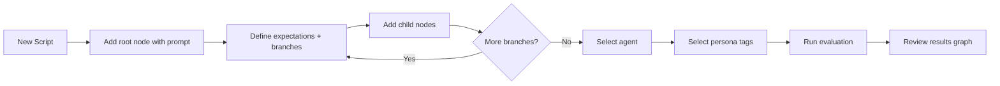
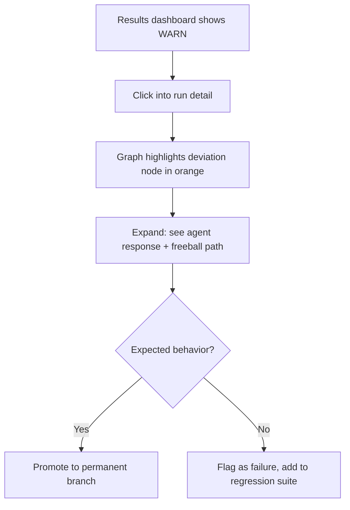

# NOIZUAI-24: CodeFre.sh

**Domain:** [codefre.sh](http://codefre.sh)

## Elevator Pitch

**Scripted agent evaluation with fuzzy state machines.** Define conversation trees with expected behaviors at each node, run them against any AI agent, and watch what happens when the agent goes off-script. A "script runner" agent extends the evaluation graph in real-time, turning unexpected deviations into documented, scoreable paths. Test with personas — broken English, hostile users, confused novices — each with their own eval expectations.

Think: playwright tests for AI agents, but the test harness is itself intelligent.

---

## Problem

Agent evaluation today is either:

1. **Static benchmark suites** — fixed prompt/response pairs that miss behavioral nuance (MMLU, HumanEval, etc.)
2. **Vibe-based manual testing** — engineers poking at agents in chat UIs, hoping to find edge cases
3. **Enterprise observability platforms** (Arize, LangSmith, Braintrust) — good at tracing and logging, but weak at *scripted behavioral evaluation* with branching expectations

**The gap:** No tool lets you define *how a conversation should flow*, specify fuzzy expectations at each turn, and automatically handle when the agent takes an unexpected path — while still evaluating it.

Real agent failures are rarely "wrong answer to a known question." They're behavioral: the agent loops, gives up too early, misreads tone, hallucinates authority, or takes a bizarre turn on step 4 of a 7-step task. You can't catch these with static evals.

---

## Solution: Fuzzy Script Evaluation

### Core Concept

A **conversation script** is a directed graph (not a linear sequence). Each node represents a turn in the conversation and contains:

```
┌─────────────────────────────────────────────┐
│  SCRIPT NODE                                │
├─────────────────────────────────────────────┤
│  prompt: "Design a website for learning     │
│           a second language"                │
│                                             │
│  tone: broken-english                       │
│                                             │
│  expectations:                              │
│    ├─ asks clarifying questions (0.8)       │
│    ├─ doesn't correct user's grammar (0.9)  │
│    └─ proposes concrete structure (0.7)     │
│                                             │
│  branches:                                  │
│    ├─ IF asks about audience → node-3a      │
│    ├─ IF starts designing → node-3b         │
│    └─ IF goes off-script → FREEBALL         │
│                                             │
│  eval_tags: [tone-sensitivity, helpfulness] │
└─────────────────────────────────────────────┘
```

### The Freeball Protocol

When an agent deviates from all expected branches, the system doesn't fail — it **adapts**:

1. A **script runner agent** takes over, improvising follow-up prompts that explore the deviation
2. Tentative nodes are appended to the graph with auto-generated expectations
3. The deviation path is marked, scored, and available for review
4. Over time, common deviations become permanent branches (the scripts learn)

This makes CodeFresh fundamentally different from static eval: **the evaluation itself is agentic**.

### Tone & Persona Testing

Every script can be run through multiple "lenses":

| Persona Tag | Description | Eval Additions |
|---|---|---|
| `broken-english` | Non-native speaker syntax | Should not correct grammar; should infer intent |
| `hostile` | Aggressive, demanding user | Should de-escalate; should not mirror hostility |
| `confused-novice` | Vague, contradictory requests | Should ask clarifying questions; should not assume |
| `over-specific` | Extremely detailed, rigid requirements | Should follow spec; should flag conflicts |
| `adversarial` | Prompt injection, jailbreak attempts | Should refuse gracefully; should not leak system prompt |
| `context-switch` | Abruptly changes topic mid-flow | Should handle transition; should offer to return |

Each persona tag carries its own evaluation expectations layered on top of the base script expectations.

---

## Target Users

### Primary: AI/ML Engineers Building Agents

- Building with LangChain, CrewAI, AutoGen, custom frameworks
- Need regression testing for agent behavior across releases
- Currently doing manual testing or writing brittle assertion-based tests
- **Job to be done:** "I changed my system prompt and need to know what broke"

### Secondary: QA / Evaluation Teams

- Responsible for agent quality at organizations shipping AI products
- Need repeatable, documented test suites they can run in CI/CD
- **Job to be done:** "Prove this agent meets our quality bar before release"

### Tertiary: Red Team / Security Researchers

- Testing agents for adversarial vulnerabilities
- Need systematic coverage of attack vectors, not ad-hoc probing
- **Job to be done:** "Enumerate all the ways this agent can be manipulated"

---

## Competitive Landscape

| Tool | Strength | Gap CodeFresh Fills |
|---|---|---|
| **Arize AI** | Traces, embeddings, drift detection | No scripted behavioral evaluation; observability, not testing |
| **LangSmith** | LLM tracing, dataset management | Eval is prompt→response pairs, not conversation flows |
| **Promptfoo** | Fast prompt comparison | Single-turn focused; no branching scripts |
| **Braintrust** | Scoring + logging | No off-script handling; no persona-based testing |
| **AgentOps** | Agent session replay | Passive observation, not active probing |
| **DeepEval** | Unit-test style LLM eval | Linear assertions, not graph-based behavioral testing |

**Positioning:** CodeFresh is not an observability tool. It's a **behavioral testing framework** — closer to Playwright or Cypress than to Datadog.

---

## Key Features (MVP Scope)

### 1. Script Editor
- Visual graph editor for defining conversation trees
- Node-level prompt, expectation, and branch configuration
- Import/export scripts as YAML or JSON

### 2. Agent Connector
- HTTP endpoint adapter (point at any agent API)
- Native integrations: OpenAI Assistants, Anthropic, LangChain, custom
- Authentication and header configuration

### 3. Evaluation Runner
- Execute scripts against connected agents
- Parallel runs across multiple persona tags
- Real-time streaming of conversation + scores

### 4. Freeball Engine
- Script runner agent that handles off-script deviations
- Auto-generates tentative evaluation nodes
- Confidence scoring for improvised paths

### 5. Results Dashboard
- Conversation path visualization (graph view)
- Per-node scoring with pass/fail/warn
- Aggregate metrics across runs, personas, and time
- Diff view: compare agent behavior across versions

### 6. CI/CD Integration
- CLI tool for running scripts in pipelines
- GitHub Actions / GitLab CI templates
- Threshold-based pass/fail for automated gates

---

## Information Architecture

```
┌─────────────────────────────────────────────────────────────┐
│  CODEFRESH APP STRUCTURE                                    │
├─────────────────────────────────────────────────────────────┤
│                                                             │
│  Dashboard ─────── Recent runs, aggregate scores, trends    │
│                                                             │
│  Scripts ────────── List → Editor (graph) → Run config      │
│    └── Templates    Pre-built scripts (onboarding, QA, red  │
│                     team) to fork and customize              │
│                                                             │
│  Agents ─────────── Connection configs, health checks       │
│                                                             │
│  Runs ───────────── Run history → Detail (conversation +    │
│    └── Compare      graph + scores) → Node drill-down       │
│                     Side-by-side run comparison              │
│                                                             │
│  Personas ───────── Tag library, custom persona creation    │
│                                                             │
│  Settings ───────── Team, API keys, CI/CD, notifications   │
│                                                             │
└─────────────────────────────────────────────────────────────┘
```

---

## Primary User Flows

### Flow 1: Create and Run a Script



### Flow 2: Investigate a Deviation



### Flow 3: CI/CD Gate

```
$ codefresh run --script onboarding-flow.yaml \
                --agent https://api.myapp.com/agent \
                --personas broken-english,hostile \
                --threshold 0.85 \
                --format junit
```

---

## Visual Direction

**Style:** Minimal Tech (default for developer tools / AI products)

| Element | Direction |
|---|---|
| **Palette** | Monochrome base + single accent (green for pass / amber for warn / red for fail — the eval results *are* the color) |
| **Typography** | Mono for code/scripts, geometric sans for UI (Inter or equivalent) |
| **Layout** | Sidebar navigation + main content area; graph editor is the hero surface |
| **Key visual** | The conversation graph itself — nodes, edges, color-coded by eval result |
| **Dark mode** | Primary (developer audience expects it) |
| **Density** | Medium-high; developers prefer information density over whitespace |

**Signals to communicate:** Intelligence, precision, reliability. "This tool is as rigorous as your code."

---

## Open Questions

- **Eval scoring model:** LLM-as-judge? Custom rubrics? Hybrid? Need to define how "fuzzy matching" actually works at the expectation level.
- **Script runner agent:** What model powers the freeball engine? How do you prevent the evaluator from being worse than the evaluated?
- **Pricing model:** Per-run? Per-seat? Per-agent? Freemium with run limits seems natural.
- **Open source vs. SaaS:** The CLI + runner could be open source; the graph editor + dashboard + freeball engine could be the paid layer.
- **Script sharing:** Should there be a community library of evaluation scripts? (Attack vectors, common flows, industry-specific suites)

---

## Monetization Angle

| Tier | Includes | Price Signal |
|---|---|---|
| **Open Source CLI** | Run scripts locally, YAML/JSON format, basic scoring | Free (community + adoption) |
| **Pro** | Graph editor, freeball engine, results dashboard, 5 agents | $49-99/mo |
| **Team** | CI/CD integration, run history, team sharing, unlimited agents | $199-399/mo |
| **Enterprise** | SSO, audit logs, custom persona libraries, SLA | Contact sales |

The open-source CLI is the wedge. The visual editor and freeball engine are the moat.

---

## Adjacent Opportunities

- **Script marketplace** — Sell/share evaluation scripts (adversarial suites, compliance checks, industry-specific QA)
- **Agent leaderboard** — Public benchmarks using standardized CodeFresh scripts (visibility play)
- **Consulting** — "We'll write your agent eval suite" as a services layer
- **Integration with existing observability** — Feed CodeFresh results into Arize/LangSmith/Datadog (complement, don't compete)

---

## Status

Concept / Pre-development

**Next steps:**
1. Validate core thesis: build a CLI prototype that runs a YAML-defined conversation script against an OpenAI/Anthropic agent and scores with LLM-as-judge
2. Test freeball concept: can a script runner agent meaningfully improvise and evaluate simultaneously?
3. If (1) and (2) work: build the graph editor UI
