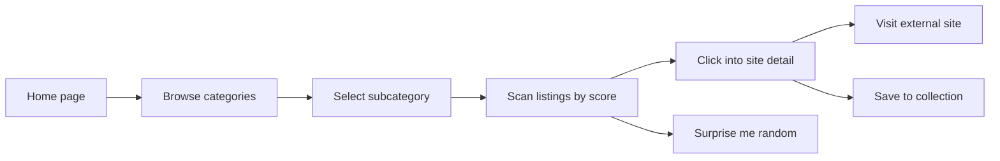
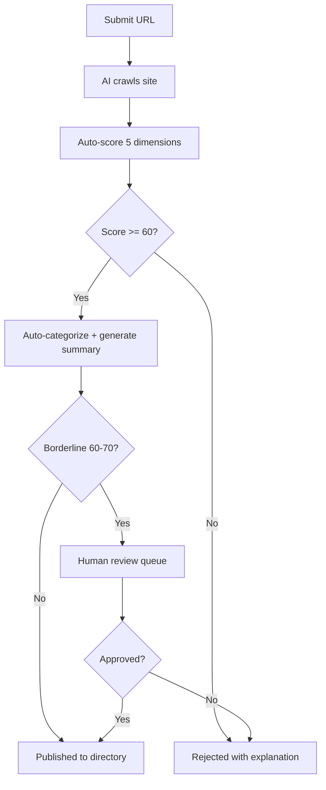

# NOIZUAI-21: Gotta.cc

**Domain:** [gotta.cc](http://gotta.cc)

## Elevator Pitch

**The Yahoo Directory for the post-slop web.** Gotta.cc is an AI-curated website directory that combines human-browsable categories with AI quality scoring, editorial summaries, and discovery tools. Browse the web by topic, not by keyword. Every listed site is scored for originality, depth, and human authorship. The web is big again — gotta.cc helps you find the good parts.

Think: Yahoo Directory (1994) meets Wirecutter-level editorial, powered by AI that rates quality instead of gaming it.

---

## Problem

Web discovery is broken in three ways:

1. **Search is SEO-gamed** — Google returns a wall of affiliate content, AI-generated slop, and Reddit results. 74% of newly published English web pages now contain AI-generated content (Ahrefs, 2025). The first page of results for any commercial query is a content farm. You search for "best standing desk" and get 10 affiliate sites that have never touched a desk.

2. **Discovery is fragmented** — Users bounce between Google, Perplexity, Reddit, TikTok, and Hacker News because no single source is trusted for finding quality websites. Each channel has its own bias: Google favors authority (big brands), Reddit favors recency (trending), Product Hunt favors novelty (launches). Nobody favors *quality*.

3. **The good web is invisible** — Thousands of excellent personal sites, niche blogs, indie tools, and small-web projects exist but have zero SEO. They don't play the game. They're invisible to search engines and invisible to users. The blogroll revival, the indie web movement, and Kagi's SlopStop campaign all signal the same thing: people want to find real humans making real things on the real web.

**The gap:** No current product combines **browsable taxonomy** (like Yahoo's original directory) with **AI quality scoring** (like Wirecutter's editorial rigor). Kagi does search, not browsing. Marginalia indexes the indie web but doesn't score quality. Are.na is social bookmarking, not a directory. The AI-curated, human-browsable web directory doesn't exist yet.

---

## Solution: AI-Curated Directory

### Core Concept

Gotta.cc is a **directory**, not a search engine. You browse it. The primary interaction is navigating a category tree:

```
gotta.cc/
├── Technology/
│   ├── Developer Tools/
│   │   ├── ⭐ Terminals & Shells
│   │   ├── ⭐ Code Editors
│   │   └── ⭐ CLI Utilities
│   ├── AI & Machine Learning/
│   │   ├── ⭐ Open Source Models
│   │   ├── ⭐ AI Art Tools
│   │   └── ⭐ Research Papers
│   └── ...
├── Culture/
│   ├── Personal Blogs/
│   ├── Digital Art/
│   └── Zines & Magazines/
├── Science/
├── Making & Crafts/
├── Games/
└── Weird & Wonderful/
```

Every site in the directory has:

```
┌─────────────────────────────────────────────────┐
│  DIRECTORY LISTING                              │
├─────────────────────────────────────────────────┤
│  site: uses-this.com                            │
│  title: "Uses This — interviews about tools"    │
│                                                 │
│  summary: "Interviews with creative people      │
│  about the hardware, software, and tools they   │
│  use to get their work done. Running since 2009.│
│  Focused, niche, lovingly maintained."          │
│                                                 │
│  quality_score: 94 / 100                        │
│  scores:                                        │
│    ├─ originality: 96  (unique concept)         │
│    ├─ depth: 91        (700+ interviews)        │
│    ├─ freshness: 88    (updated weekly)         │
│    ├─ human_authored: 99 (clearly human)        │
│    └─ design: 92       (clean, intentional)     │
│                                                 │
│  categories: [Technology/Interviews, Culture]   │
│  tags: [interviews, tools, creative, indie-web] │
│  first_indexed: 2024-06-14                      │
│  last_checked: 2026-03-12                       │
│  link_status: alive                             │
│  submitted_by: community                        │
└─────────────────────────────────────────────────┘
```

### The Quality Scoring System

Every site is scored across five dimensions by AI, with human review for borderline cases:

| Dimension | What It Measures | Signals |
|---|---|---|
| **Originality** | Is this content unique or a rehash? | Not a clone, not aggregated, has a distinctive voice |
| **Depth** | Does the site go deep on its topic? | Long-form content, archives, sustained focus |
| **Freshness** | Is it actively maintained? | Recent updates, no link rot, working features |
| **Human Authorship** | Was this made by a human? | Writing style, personal voice, not AI-generated slop |
| **Design Quality** | Does the site respect its visitors? | Usable, accessible, not ad-infested, intentional design |

**Composite score** = weighted average (originality 30%, human authorship 25%, depth 20%, freshness 15%, design 10%).

Sites below 60/100 are not listed. Sites above 90/100 get an "Editor's Pick" badge. The threshold is the editorial floor — AI sets the bar, humans raise it.

### Anti-Slop Defense

The scoring system is explicitly designed to filter AI-generated content farms:

- **Human authorship scoring** uses LLM-as-judge to detect generated text, but goes further: it checks for personal anecdotes, inconsistencies (humans contradict themselves), unique phrasing, and biographical signals
- **Originality scoring** cross-references content against known datasets and surface-level paraphrasing patterns
- **Link rot monitoring** catches abandoned sites and content farms that publish once and never update
- **Community flagging** lets users report sites that feel generated, triggering manual review

---

## Target Users

### Primary: Curious Web Explorers

- People who miss "surfing the web" — following links, discovering rabbit holes
- Active in indie web communities, blogroll culture, personal sites
- Frustrated with algorithmic feeds and SEO-gamed search
- **Job to be done:** "Show me interesting websites I would never find on Google"

### Secondary: Web Creators & Indie Developers

- People who build personal sites, blogs, indie tools, niche apps
- Want their work discovered by real humans, not SEO bots
- Currently relying on Show HN, Product Hunt, or Twitter for visibility
- **Job to be done:** "Get my site in front of people who care about quality"

### Tertiary: Researchers & Journalists

- Looking for primary sources, niche experts, domain-specific sites
- Need curated, quality-assessed collections of resources
- Currently doing manual curation that doesn't scale
- **Job to be done:** "Find the best sources on a topic without wading through slop"

---

## Competitive Landscape

| Tool | What They Do Well | Gap Gotta.cc Fills |
|---|---|---|
| **Google** | Massive index, speed, infrastructure | SEO-gamed results, no browsable categories, no quality scoring |
| **Kagi** | Paid search, SlopStop blocklist, Small Web | Search-first, not browsable; $10/mo subscription barrier |
| **Marginalia** | Indexes indie/small web, text-focused | No quality scoring, no editorial summaries, no categories |
| **Wiby.me** | Intentionally retro, simple sites only | Hobbyist scope, no AI, very limited coverage |
| **Are.na** | Social bookmarking, creative community | Personal collections, not a public directory; $7-15/mo |
| **Product Hunt** | Launch discovery, community voting | Novelty-biased (launches only), commercial products only |
| **Hacker News** | Tech community curation | Recency-biased, comment-driven, no persistent directory |
| **Indieseek.xyz** | Manual indie web directory | Low volume, no AI classification, no quality scoring |
| **DMOZ (dead)** | The last great human directory | Dead since 2017; proved manual curation doesn't scale |

**Positioning:** Gotta.cc is not a search engine. It's a **browsable directory with editorial standards**, powered by AI that evaluates quality instead of gaming it. The closest analogue is the original Yahoo Directory (1994-2014) — but with AI replacing the army of human editors who made it work, and a quality bar that actively fights AI slop instead of amplifying it.

---

## Key Features (MVP Scope)

### 1. Category Browser
- Hierarchical category tree (~200-500 categories)
- Visual browsing: category cards with site counts and featured picks
- Breadcrumb navigation, deep-linking to any level
- "Surprise me" random category/site discovery

### 2. Site Listings
- AI-generated editorial summaries (concise, opinionated, useful)
- Five-dimension quality score with breakdown
- Tags for cross-category discovery
- Screenshot thumbnails (auto-captured)
- Link status monitoring (alive/dead/redirect)

### 3. Quality Scoring Engine
- LLM-powered multi-dimension scoring pipeline
- Human authorship detection (anti-slop)
- Originality cross-referencing
- Automated re-scoring on schedule (freshness)
- Manual review queue for borderline cases

### 4. Submission & Community
- Anyone can submit a site for review
- Community upvotes surface popular discoveries
- Flagging system for misclassified or low-quality sites
- Submitter profiles and discovery credit

### 5. Search (Secondary)
- Keyword search across listings, summaries, and tags
- Filter by category, score range, freshness
- Search is a complement to browsing, not the primary interaction

### 6. Collections & Lists
- Curated "Best of" lists (best personal blogs, best indie tools, etc.)
- Seasonal/topical collections (updated regularly)
- User-created public collections (power users)

---

## Information Architecture

```
┌─────────────────────────────────────────────────────────────┐
│  GOTTA.CC APP STRUCTURE                                     │
├─────────────────────────────────────────────────────────────┤
│                                                             │
│  Home ──────────── Featured picks, trending categories,     │
│                    recent additions, collections             │
│                                                             │
│  Browse ────────── Category tree → Subcategory → Listings   │
│    └── Category    Grid/list of scored sites with summaries │
│                                                             │
│  Site Detail ───── Full summary, score breakdown, related   │
│                    sites, category breadcrumbs, screenshot   │
│                                                             │
│  Collections ───── Editor's picks, "Best of" lists,         │
│    └── Collection  thematic/seasonal curations               │
│                                                             │
│  Submit ────────── Submit a site → AI scoring → Review →    │
│                    Listed (or rejected with reason)          │
│                                                             │
│  Search ────────── Keyword search with category/score       │
│                    filters, result cards                     │
│                                                             │
│  Profile ───────── Submitted sites, saved sites, activity   │
│                                                             │
│  About ─────────── How scoring works, editorial policy,     │
│                    directory stats, FAQ                      │
│                                                             │
└─────────────────────────────────────────────────────────────┘
```

---

## Primary User Flows

### Flow 1: Browse & Discover



### Flow 2: Submit a Site



### Flow 3: Search & Filter


---

## Visual Direction

**Style:** Editorial 80% + Consumer Playful 20% — the directory is a reading experience first, but the browsing/discovery UX needs warmth and delight

| Element | Direction |
|---|---|
| **Palette** | Warm neutrals (cream/ivory background, not stark white). Single accent color — warm orange or coral (signals discovery, energy, the "find" moment). Muted category colors for visual distinction without chaos. |
| **Typography** | Serif for site summaries and editorial text (the content IS the product). Sans-serif for navigation, labels, UI chrome. Mono for scores and technical metadata (URLs, dates). |
| **Layout** | Category grid on homepage (bento-style). List view for category pages (scannable). Card layout for site details. Generous margins — editorial reading experience. |
| **Key visual** | The category tree itself — colorful, inviting, dense with interesting sites. Site cards with screenshot thumbnails and quality score badges. |
| **Density** | Medium. Dense enough to browse efficiently, spacious enough to read summaries. More editorial than dashboard. |
| **Mode** | Light mode primary (reading-focused, magazine feel). Dark mode available. |
| **Personality** | Warm, opinionated, slightly irreverent. "The editors have opinions." Not corporate, not clinical — a magazine for the web. |

**Signals to communicate:** Taste, curation, warmth, discovery. "Someone smart picked these for you."

---

## Open Questions

- **Taxonomy design:** How many top-level categories? How deep do subcategories go? Yahoo had ~15 top-level. More than 20 creates choice paralysis. Less than 10 feels thin.
- **Score calibration:** How do you prevent score inflation over time? Absolute vs. relative scoring? Does a 90/100 from 2024 mean the same as a 90/100 in 2026?
- **Content freshness:** How often do you re-crawl and re-score? Daily for freshness, monthly for full re-evaluation? At what scale does this become expensive?
- **Community moderation:** How do you prevent submission spam? Invite-only at first? Rate limiting? Reputation systems?
- **Legal/copyright:** AI-generated summaries of other people's websites — what's the fair use boundary? Screenshots?
- **Scale economics:** LLM scoring per site is cheap (~$0.01-0.05/site). But re-scoring 100K+ sites regularly adds up. Tiered scoring frequency by popularity?

---

## Monetization

| Tier | Includes | Price Signal |
|---|---|---|
| **Free** | Browse all categories, view listings, search, submit sites (3/month) | Free (the directory is the product) |
| **Supporter** | Unlimited submissions, saved collections, no ads, early access to new categories, supporter badge | $5/mo |
| **Creator** | Verified site owner badge, analytics on your listing (views, clicks), priority re-scoring, enhanced listing (longer summary) | $10/mo |
| **Sponsor** | Category sponsorship (logo + "Sponsored by" in category header), featured placement (clearly labeled) | $500-2K/mo per category |

**Additional revenue streams:**
- **API access** — let other products query the directory and quality scores ($49-199/mo)
- **"Best of" annual publication** — yearly printed/digital magazine of the best sites discovered
- **Affiliate** — for commercial sites that are legitimately high-quality, tasteful affiliate links (clearly disclosed)

---

## Adjacent Opportunities

- **Browser extension** — "Gotta score" overlay shows quality rating for any site you visit, suggests better alternatives
- **RSS/newsletter** — Weekly digest of new high-scoring sites by category
- **Embeddable badges** — Site owners can embed their quality score badge (free traffic back to gotta.cc)
- **Site health monitoring** — Alert site owners when their score drops (freshness decay, broken links)
- **Historical archive** — "The web in 2026" — snapshot the directory annually as a time capsule
- **Alternative to link-in-bio** — let creators curate their own mini-directory of recommended sites

---

## Status

Concept / Pre-development

**Next steps:**
1. Validate quality scoring: build a pipeline that crawls 100 hand-picked sites, scores them across 5 dimensions, and see if the scores match human judgment. If the AI can't distinguish a lovingly maintained personal blog from a content farm, nothing else matters.
2. Design the taxonomy: draft 12-15 top-level categories with 3-5 subcategories each. Test with 10 users: can they find a site they know should exist? Can they browse into a rabbit hole?
3. Build a static MVP: 500 curated sites across all categories, published as a browsable static site. No submissions, no search — just the directory. See if people use it.
4. If (1)-(3) validate: build the submission pipeline and community features.
