# ClipStash — OSX Clipboard Manager Product Specification

## Overview

ClipStash is a power-user clipboard manager for macOS that extends the system clipboard with persistent history, macro expansion, LLM-powered transformations, semantic search, and encrypted cross-device sync. It lives in the menu bar and is invoked primarily through keyboard chords.

---

## System Architecture Overview

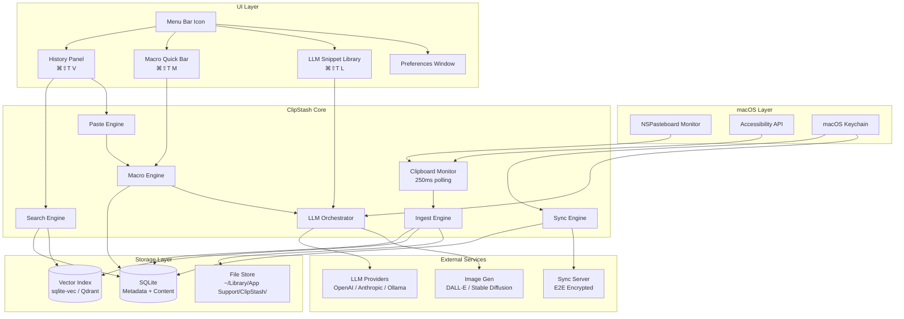

---

## 1. Core Keyboard Chords

| Chord | Action |
|---|---|
| `⌘⇧T V` | Open full clipboard history panel |
| `⌘⇧T M` | Open macro quick-insert bar |
| `⌘⇧T Space` | Paste selected/highlighted entry |
| `⌘⇧T A` | Open LLM inference input (context-sensitive — works inside macro bar or history panel) |
| `⌘⇧T L` | Open LLM Snippet Library |
| `⌘⇧T P` | Push generated output to clipboard history |
| `⌘⇧T F` | Focus search bar within open panel |
| `⌘⇧T 1-9` | Quick-paste from suggested shortlist |
| `Esc` | Close any open panel |

### Chord Navigation State Machine

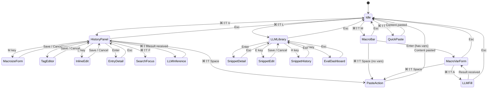

---

## 2. Clipboard History Panel (`⌘⇧T V`)

### Layout

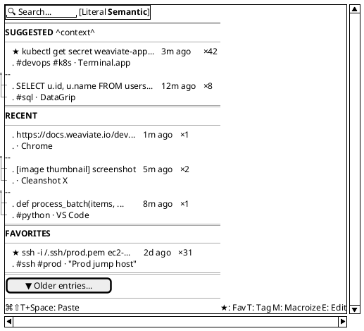

### Entry Data Model

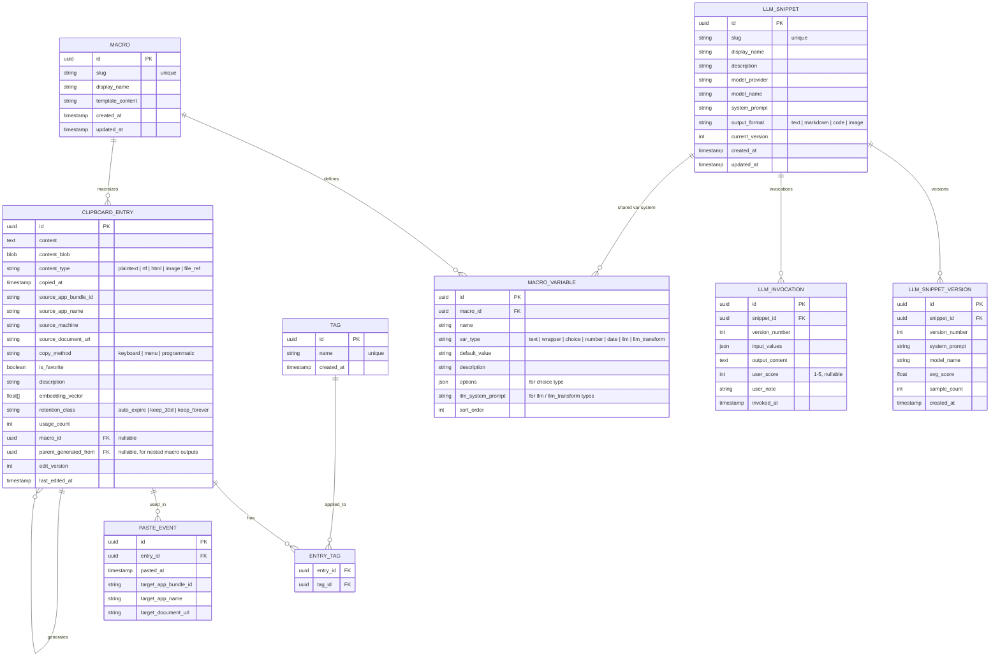

### Suggested Entries Algorithm

When `⌘⇧T V` is invoked, the top "Suggested" section is populated by a scoring model:

```
score = w1 * recency
      + w2 * frequency
      + w3 * app_affinity(current_app, entry.usage_contexts)
      + w4 * file_affinity(current_file, entry.usage_contexts)
      + w5 * time_of_day_affinity
      + w6 * is_favorite
```

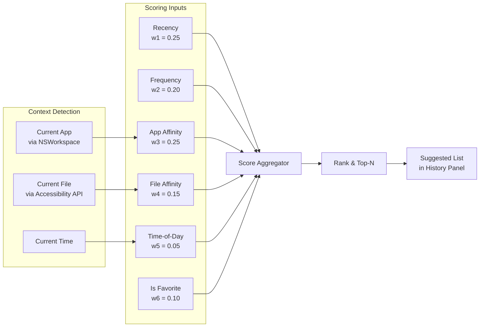

---

## 3. Favorites & Tagging

### Favorites

- Toggle with `★` key when an entry is highlighted in the history panel.
- Favorites persist indefinitely (exempt from auto-cleanup).
- Dedicated "Favorites" section in the history panel, collapsible.
- Favorites sync across devices (if sync enabled).

### Tags

- Press `T` on a highlighted entry to open the tag editor.
- Tags are freeform strings prefixed with `#` in the UI.
- Autocomplete from previously used tags.
- Filter by tag: type `#tagname` in the search bar.
- Bulk tagging: select multiple entries (hold `⇧` + arrow keys), press `T`.

### Description / Snippet Annotation

- Press `D` on a highlighted entry to add/edit a description.
- Description appears as a subtitle under the entry preview.
- Descriptions are indexed for both literal and semantic search.
- Useful for turning clipboard entries into a personal snippet library.

### Tag Editor UI

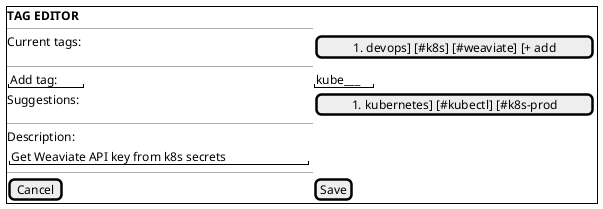

---

## 4. Macroization System

### Concept

Any clipboard entry can be "macroized" — assigned a short slug (e.g., `hc`, `dbconn`, `sig`) and optionally parameterized with variable parts. Macros turn the clipboard manager into an expandable snippet engine.

### Macro Lifecycle

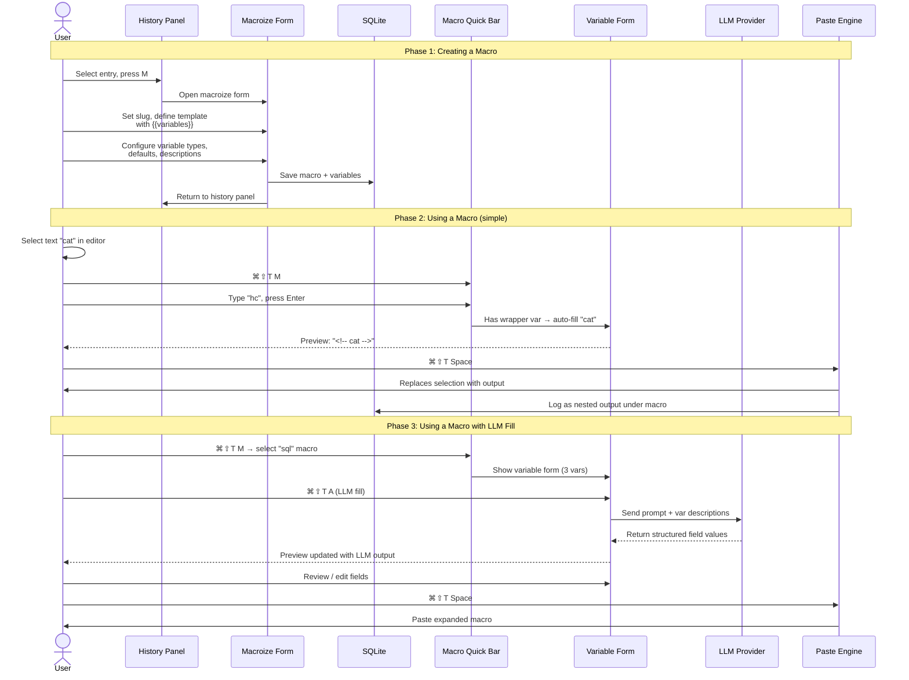

### Creating a Macro

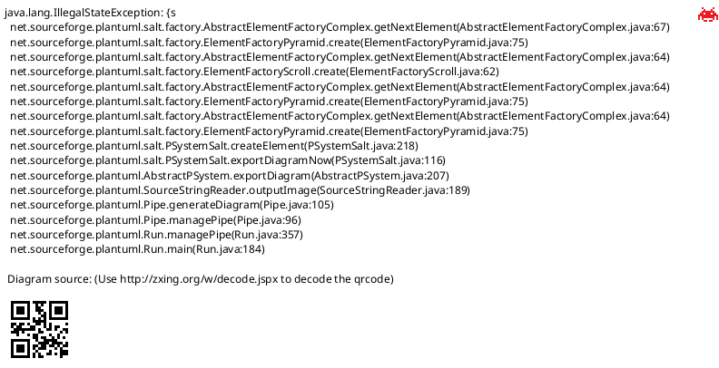

### Variable Types

| Type | Behavior |
|---|---|
| `text` | Free-form text input, user fills in at paste time |
| `wrapper` | Auto-filled with currently selected text when macro is invoked. If nothing is selected, shows as a text input. |
| `choice` | Dropdown from predefined options |
| `number` | Numeric input with optional min/max |
| `date` | Date picker, supports format strings |
| `llm` | Field value is generated by LLM inference (see §4.3) |
| `llm_transform` | Like wrapper, but selected text is passed through an LLM with a prompt before insertion |

### Variable Type Decision Tree

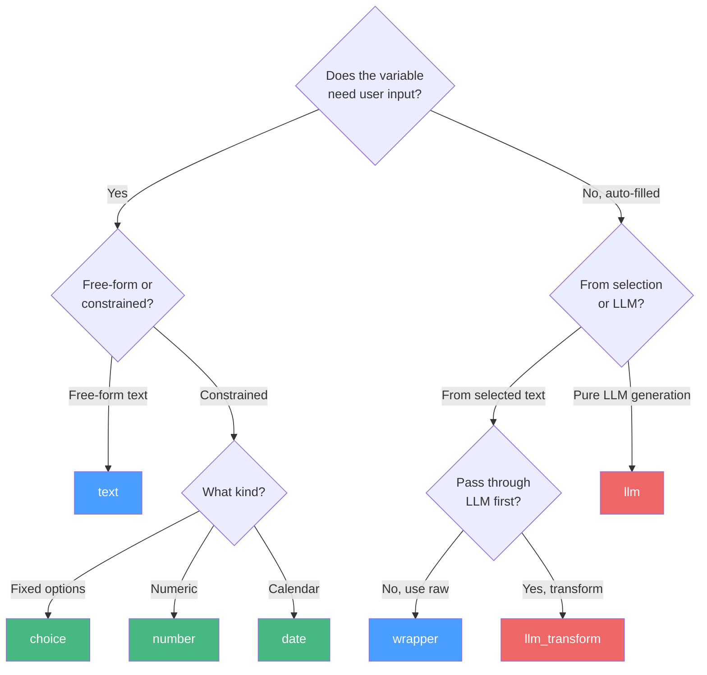

### Macro Quick-Insert Bar (`⌘⇧T M`)

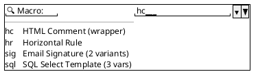

- Combobox with fuzzy search over slug names, descriptions, and tags.
- Arrow keys to navigate, `Enter` to select.
- After selection, if the macro has **no variables** (or only a `wrapper` variable with text selected): `⌘⇧T Space` pastes immediately.
- If it has **variables that need input**, the variable form opens:

### Macro Variable Form (with live preview)

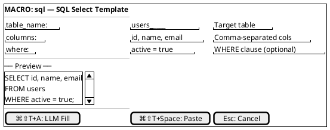

**Key interaction**: the preview updates live as the user types into variable fields, so they always see exactly what will be pasted.

### Wrapper Variable Example Flow

User selects the word `cat` in their editor, then presses `⌘⇧T M`, types `hc`, hits `Enter`:

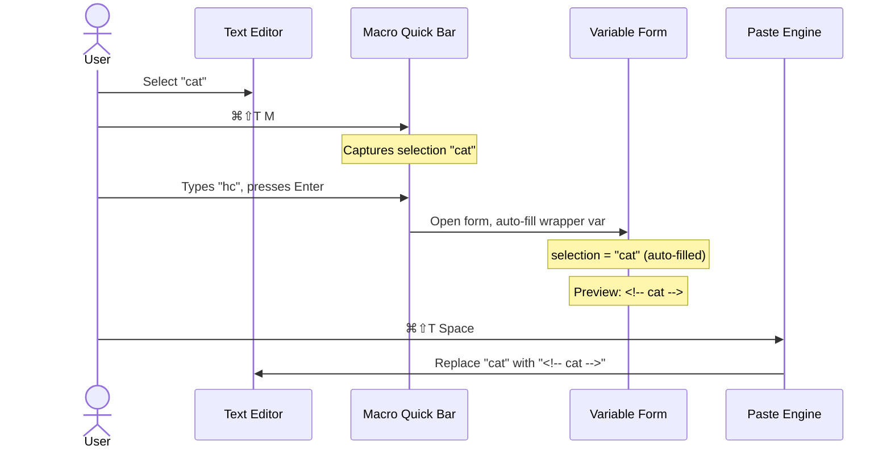

### LLM-Assisted Variable Fill (`⌘⇧T A`)

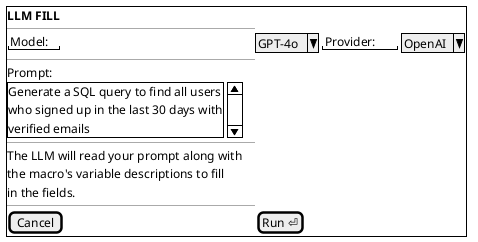

The LLM receives: the user's prompt, the macro template, and each variable's name/type/description. It returns structured output that populates the variable fields. The preview updates, and the user can review/edit before pasting.

### LLM Transform Pipeline

For `llm_transform` type variables, the macro definition includes a system prompt:

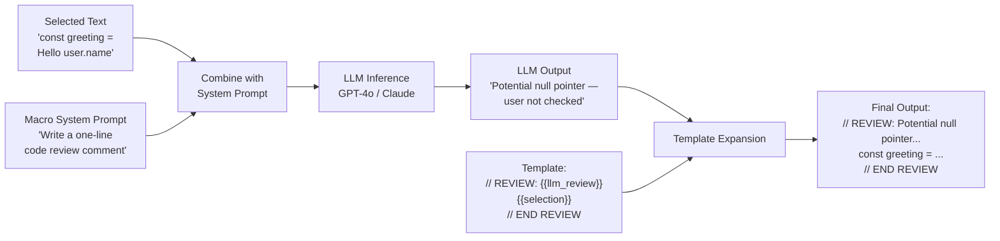

**Example**: A macro `cr` (code review) with template:
```
// REVIEW: {{llm_review}}
{{selection}}
// END REVIEW
```

Where `llm_review` is an `llm_transform` variable with prompt: *"Write a one-line code review comment for this code. Be specific about any bugs or improvements."*

Selecting a code block and invoking `cr` would produce:
```
// REVIEW: Potential null pointer — `user` is not checked before accessing `.name`
const greeting = `Hello ${user.name}`;
// END REVIEW
```

### Generated Output Nesting

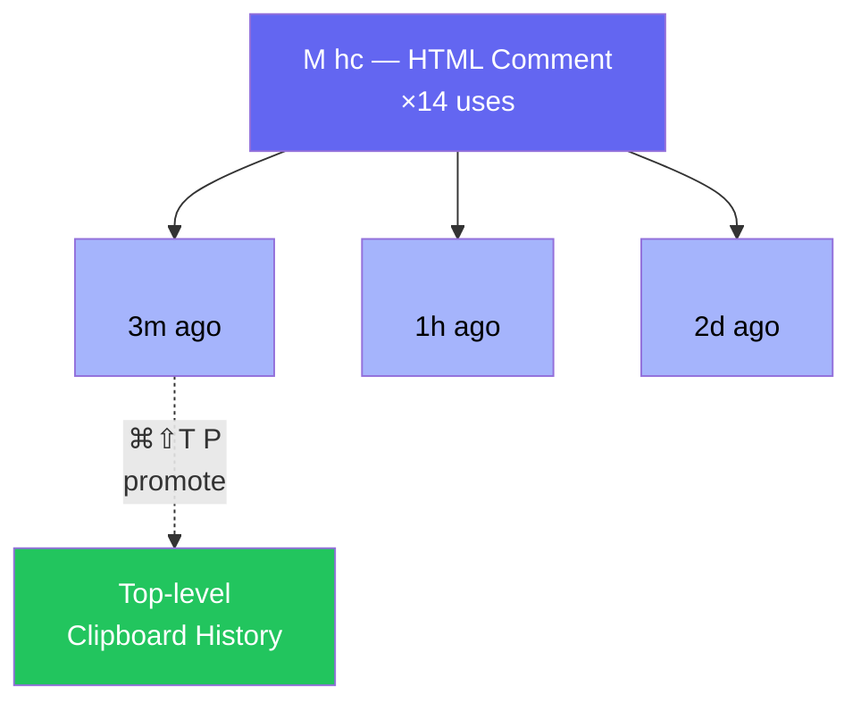

- Press `⌘⇧T P` on a nested generated output to "promote" it — copy it to the top-level clipboard history as its own entry.
- Nested outputs inherit the parent macro's tags by default.

---

## 5. Search

### Search Architecture

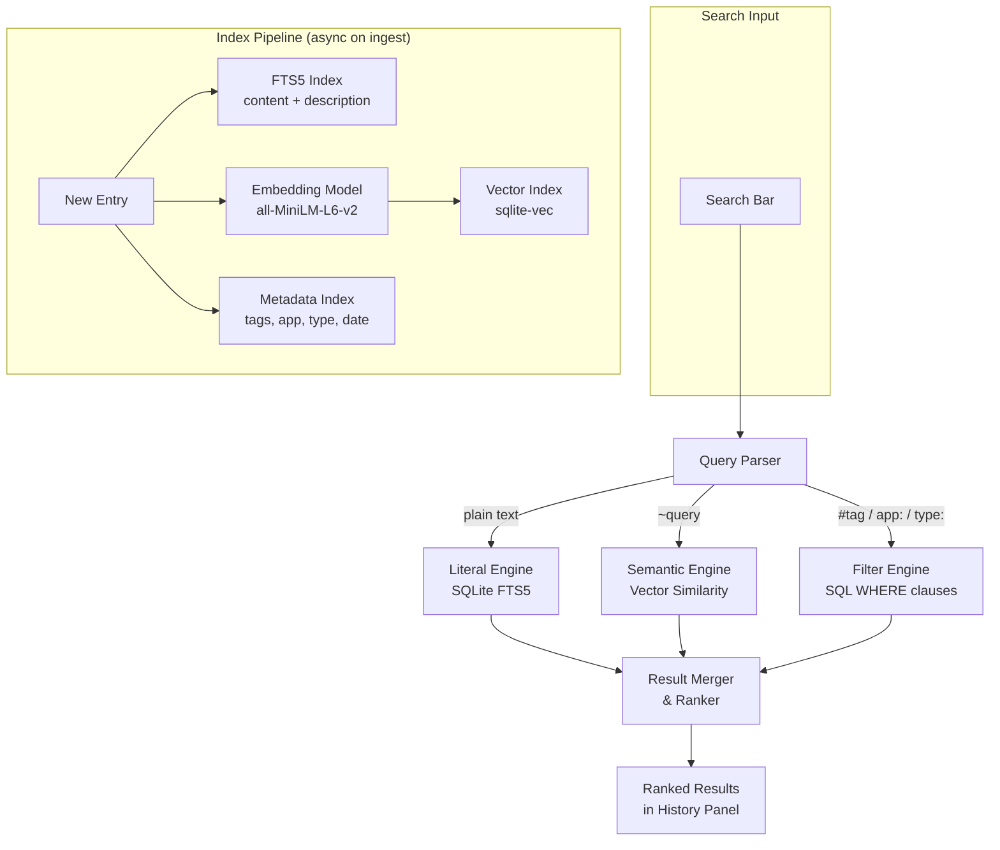

### Search Query Syntax

```
literal text              — substring match
"exact phrase"            — exact match
#tagname                  — filter by tag
app:AppName               — filter by source app
type:text|image|rtf|html  — filter by content type
before:YYYY-MM-DD         — date filter
after:YYYY-MM-DD          — date filter
used:>5                   — usage count filter
~semantic query           — vector similarity search
machine:hostname          — filter by source machine
is:favorite               — favorites only
is:macro                  — macroized entries only
```

---

## 6. Entry Provenance & Usage Tracking

### Origin Tracking

Every entry records: timestamp of copy event (millisecond precision), source machine hostname, source application (bundle ID + display name), source document/URL (best-effort detection via Accessibility API), and copy method (keyboard shortcut, menu, programmatic).

### Usage Analytics

Every paste event records: timestamp of paste, target application, and target document/URL (best-effort).

This data powers the "×42" usage count badge on entries, the suggested entries algorithm (§2), a per-entry usage timeline accessible via the entry detail view, and menu bar analytics like "You've pasted 847 items this week, saving ~2.1 hours."

### Provenance & Usage Flow

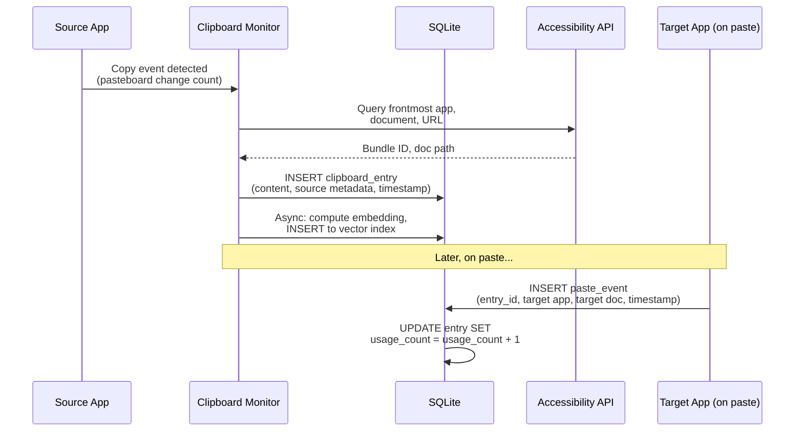

### Entry Detail View

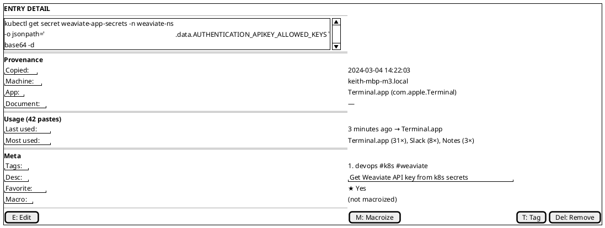

---

## 7. LLM Snippet Library (`⌘⇧T L`)

A dedicated mode for LLM-powered snippets — these are like macros but with first-class LLM integration, versioning, and evaluation.

### LLM Snippet Library Panel

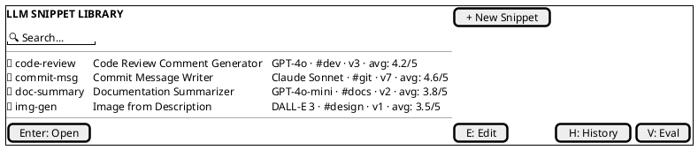

### LLM Snippet Properties

Each LLM snippet has: slug (short identifier), display name & description, model & provider (configurable per-snippet), system prompt (the instruction prompt), input variables (same variable type system as macros), output format (text, markdown, code, image), version history (every edit to the prompt creates a new version), tags, and evaluation scores from the eval framework.

### LLM Snippet Invocation Flow

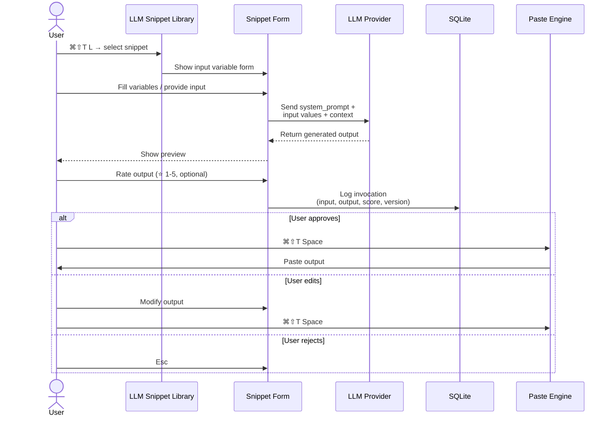

### Snippet Version & Eval History

```plantuml
@startsalt
{ 
  {+ 
    **HISTORY: commit-msg (v7)**
    --
    {T
      "#" | Timestamp        | Score | Input (truncated)                    | Output (truncated)
      1   | 2024-03-04 14:22 | ⭐5/5 | "Added retry logic to API client..." | "feat(api): add exponential..."
      2   | 2024-03-04 11:15 | ⭐4/5 | "Fixed the bug where users..."       | "fix(auth): resolve login..."
      3   | 2024-03-03 17:40 | ⭐3/5 | "Updated README"                     | "docs: update README with..."
    }
    --
    [Export] | [Clear] | [Run Eval]
  }
}
@endsalt
```

### Eval Framework

```mermaid
graph TB
    subgraph "Evaluation Methods"
        MS[Manual Scoring<br/>1-5 stars + notes]
        AB[A/B Testing<br/>2 versions side-by-side]
        BE[Batch Eval<br/>N inputs × new prompt]
        AE[Auto-Eval<br/>Judge LLM scores outputs]
    end

    subgraph "Data Sources"
        HI[Historical Invocations<br/>inputs + outputs + scores]
        PV[Prompt Versions<br/>v1, v2, ... vN]
        MC[Model Configs<br/>GPT-4o, Claude, etc.]
    end

    HI --> BE
    HI --> AB
    PV --> AB
    PV --> BE
    MC --> AB

    MS --> SC[Score Aggregator]
    AB --> SC
    BE --> SC
    AE --> SC

    SC --> DASH[Eval Dashboard]
    SC --> RA{Regression<br/>Alert?}
    RA -->|score dropped| WARN[⚠ Warning:<br/>v8 scores below v7]
    RA -->|stable/improved| OK[✅ No alert]
```

```plantuml
@startsalt
{  
  {+  
    **EVAL: commit-msg**
    --
    {#
      Version | Avg Score | Samples | Model      | Status
      v7      | 4.6/5     | 23      | Claude 3.5 | **current**
      v6      | 4.1/5     | 41      | Claude 3.5 | archived
      v5      | 3.9/5     | 18      | GPT-4o     | archived
      v4      | 4.3/5     | 12      | GPT-4o     | archived
    }
    --
    [A/B Test v7 vs v6] | [Batch Re-eval] | [Export CSV]
  }
}
@endsalt
```

---

## 8. Editing

All clipboard entries and LLM snippets support inline editing.

- Press `E` on any highlighted entry in the history panel.
- Opens the entry in an inline editor with syntax highlighting (auto-detected language).
- For images: opens a basic crop/annotate overlay.
- For macros: editing the content re-opens the macroization form.
- Edit history is preserved — you can undo edits.
- Edited entries are marked with a pencil icon and retain their original metadata.

---

## 9. Smart Formatting & Paste Modes

When pasting, hold modifier keys or use a submenu to control formatting:

| Action | Result |
|---|---|
| `⌘⇧T Space` | Paste as-is (default) |
| `⌘⇧T Space` + `⌥` | Paste as plain text (strip formatting) |
| Hold `⌘⇧T Space` (long press) | Open paste format picker |

### Paste Format Transformation Pipeline

```mermaid
graph LR
    RAW[Raw Entry<br/>Content] --> DETECT{Content Type<br/>Detection}

    DETECT -->|text/plain| PT[Plain Text]
    DETECT -->|text/html| HTML[HTML]
    DETECT -->|text/rtf| RTF[Rich Text]
    DETECT -->|image/*| IMG[Image Data]
    DETECT -->|color value| CLR[Color Value]

    PT --> FMT{Paste Format<br/>Selection}
    HTML --> FMT
    RTF --> FMT
    IMG --> FMT
    CLR --> FMT

    FMT -->|as Plain Text| STRIP[Strip Formatting]
    FMT -->|as Markdown| MD[HTML→MD / RTF→MD]
    FMT -->|as HTML| H[Wrap/Convert to HTML]
    FMT -->|as Code Block| CB[Wrap in ``` block]
    FMT -->|as JSON| JSON[Escape & Format]
    FMT -->|as URL-encoded| URL[encodeURIComponent]
    FMT -->|as Base64| B64[Base64 Encode]
    FMT -->|as Image| RENDER[Render HTML→Image]
    FMT -->|Color Convert| CC[hex↔rgb↔hsl↔UIColor]
    FMT -->|Custom Transform| CUST[Regex / LLM / Script]

    STRIP --> PASTE[Paste to<br/>Target App]
    MD --> PASTE
    H --> PASTE
    CB --> PASTE
    JSON --> PASTE
    URL --> PASTE
    B64 --> PASTE
    RENDER --> PASTE
    CC --> PASTE
    CUST --> PASTE
```

### Paste Format Picker

```plantuml
@startsalt
{ 
  {+ 
    **Paste as...**
    --
    {
      ( ) Plain Text
      ( ) Markdown
      ( ) HTML
      ( ) Rich Text (RTF)
      ( ) Image (render HTML)
      ( ) Code Block
      ( ) JSON (escape)
      ( ) URL-encoded
      ( ) Base64
      ( ) Custom transform...
    }
  }
}
@endsalt
```

### Color Support

- Color values detected in clipboard content (hex, RGB, HSL) show a color swatch preview.
- Paste-as options for colors: convert between hex, RGB, HSL, Swift UIColor, CSS variable.
- Color palette entries can be favorited and tagged for design system use.

---

## 10. Image Support

### Image Processing Pipeline

```mermaid
graph TB
    subgraph "Image Ingest"
        COPY[Image Copied<br/>PNG/JPEG/TIFF/GIF/SVG] --> STORE[Store to<br/>File System]
        COPY --> THUMB[Generate<br/>Thumbnail]
        COPY --> OCR[OCR Engine<br/>Extract Text]
        COPY --> CLIP_EMB[CLIP Embedding<br/>Visual Vector]
        COPY --> META_EX[Extract Metadata<br/>dimensions, size]
    end

    OCR --> FTS[FTS5 Index<br/>searchable text]
    CLIP_EMB --> VEC[Vector Index<br/>visual similarity]

    subgraph "Image + LLM Generation"
        T2I[Text-to-Image<br/>Macro vars → prompt → generate]
        I2I[Image-to-Image<br/>Wrapper captures image →<br/>diffusion transform → paste]
        TI2I[Text+Image-to-Image<br/>Selected text + reference image →<br/>generate combined]
    end

    subgraph "Output"
        PREVIEW[Full-size Preview<br/>on hover / Space key]
        PASTE_IMG[Paste Image<br/>to target app]
        PASTE_GEN[Paste Generated<br/>Image]
    end

    T2I --> PASTE_GEN
    I2I --> PASTE_GEN
    TI2I --> PASTE_GEN
```

### Capabilities

- Copy/paste images (PNG, JPEG, TIFF, GIF, SVG) — full first-class support.
- Thumbnail previews in the history panel.
- Full-size preview on hover or `Space` key.
- Image metadata stored: dimensions, file size, source app.
- OCR on image content for searchability (text extracted and indexed).
- Semantic embedding of images for visual similarity search.

### Image Generation Macro Example

```plantuml
@startsalt
{ 
  {+ 
    **MACRO: banner — Blog Header Image**
    --
    "Model:" | ^DALL-E 3^
    --
    "title:" | "Building with Weaviate" | "Blog post title"
    "style:" | ^watercolor^ | "Visual style"
    --
    ── Preview (generating...) ──
    {SI
      [Generating image...]
      Prompt: "Create a minimal blog header image
      for a post titled 'Building with Weaviate'
      in the style of watercolor"
    }
    --
    [Cancel] | | [⌘⇧T+Space: Paste Image]
  }
}
@endsalt
```

---

## 11. Menu Bar Interface

### Menu Bar Dropdown Structure

```mermaid
graph TD
    MBI[Menu Bar Icon<br/>📋] --> DD[Dropdown Menu]

    DD --> ACTIONS[Quick Actions]
    DD --> STATS[Statistics]
    DD --> BROWSE[Browse]
    DD --> SETTINGS[Settings & System]

    ACTIONS --> A1["📋 Open Clipboard History  ⌘⇧T V"]
    ACTIONS --> A2["⚡ Quick Macro Insert  ⌘⇧T M"]
    ACTIONS --> A3["🤖 LLM Snippet Library  ⌘⇧T L"]

    STATS --> S1["📊 Today: 127 copies, 84 pastes"]
    STATS --> S2["💾 1,247 entries (42.3 MB)"]

    BROWSE --> B1["▸ Recent"]
    BROWSE --> B2["▸ Favorites"]
    BROWSE --> B3["▸ Tags"]
    BROWSE --> B4["▸ Macros"]
    BROWSE --> B5["▸ LLM Snippets"]

    SETTINGS --> C1["⚙ Preferences...  ⌘,"]
    SETTINGS --> C2["🔄 Sync Status: ✅ Synced"]
    SETTINGS --> C3["📖 Help & Shortcuts"]
    SETTINGS --> C4["⬡ Check for Updates..."]
    SETTINGS --> C5["⏻ Quit ClipStash  ⌘Q"]
```

### Preferences Window

```mermaid
graph LR
    PW[Preferences Window] --> GT[General Tab]
    PW --> KT[Keyboard Tab]
    PW --> ST[Search Tab]
    PW --> LT[LLM Tab]
    PW --> SYT[Sync Tab<br/>Premium]
    PW --> PT[Privacy Tab]
    PW --> AT[Appearance Tab]

    GT --> GT1[Launch at login]
    GT --> GT2[Menu bar icon style]
    GT --> GT3[Max history size]
    GT --> GT4[Auto-cleanup rules]
    GT --> GT5[Default paste format]

    KT --> KT1[Customize chord bindings]
    KT --> KT2[Conflict detection]
    KT --> KT3[Per-chord enable/disable]

    ST --> ST1[Semantic search toggle]
    ST --> ST2[Embedding model selection]
    ST --> ST3[Vector DB location]
    ST --> ST4[Re-index all]

    LT --> LT1[Provider configs<br/>OpenAI / Anthropic / Ollama]
    LT --> LT2[API keys → Keychain]
    LT --> LT3[Default model per task]
    LT --> LT4[Token budget / cost tracking]

    SYT --> SYT1[Enable/disable sync]
    SYT --> SYT2[Server URL]
    SYT --> SYT3[Encryption setup]
    SYT --> SYT4[Selective sync rules]

    PT --> PT1[Exclude apps from capture]
    PT --> PT2[Auto-redact patterns]
    PT --> PT3[Sensitive entry mode]
    PT --> PT4[Export / Clear history]

    AT --> AT1[Theme: system/light/dark]
    AT --> AT2[Font size & density]
    AT --> AT3[Panel dimensions]
```

---

## 12. Sync System (Premium)

### Encryption Architecture

ClipStash sync uses end-to-end encryption. The server never has access to plaintext content.

### Key Derivation — Option A (Password-derived)

```mermaid
graph TD
    PW["User Password<br/>(never leaves device)"] --> KDF["Argon2id<br/>memory: 256MB<br/>iterations: 3<br/>parallelism: 4"]
    KDF --> MK["256-bit Master Key"]
    MK --> HKDF["HKDF-SHA256<br/>Key Expansion"]

    HKDF --> EK["Encryption Key<br/>AES-256-GCM<br/>(content encryption)"]
    HKDF --> AK["Auth Key<br/>HMAC-SHA256<br/>(server authentication)"]
    HKDF --> SK["Search Token Key<br/>(encrypted search tokens)"]

    AK --> SERVER["Server stores only:<br/>HMAC(Auth Key, challenge)<br/>⚠ Password unrecoverable"]

    style PW fill:#fbbf24,color:black
    style MK fill:#ef4444,color:white
    style EK fill:#22c55e,color:white
    style AK fill:#3b82f6,color:white
    style SK fill:#8b5cf6,color:white
    style SERVER fill:#64748b,color:white
```

### Key Derivation — Option B (Custom Keypair)

```mermaid
graph TD
    USER["User generates X25519<br/>keypair externally"] --> PUB["Public Key<br/>(registered with server)"]
    USER --> PRIV["Private Key<br/>(stored only on user devices)"]

    PRIV --> TRANSFER{"Manual Transfer<br/>Between Devices"}
    TRANSFER --> QR[QR Code]
    TRANSFER --> AD[AirDrop]
    TRANSFER --> USB[USB Drive]

    PUB --> SERVER["Sync Server"]
    PRIV --> DEC["Local Decryption<br/>on each device"]

    style PRIV fill:#ef4444,color:white
    style PUB fill:#22c55e,color:white
    style SERVER fill:#64748b,color:white
```

### Sync Protocol

```mermaid
sequenceDiagram
    participant D1 as Device A
    participant SS as Sync Server
    participant D2 as Device B

    Note over D1,D2: Sync on Copy
    D1->>D1: Copy event → new entry
    D1->>D1: Encrypt(entry, EncKey)<br/>→ ciphertext + nonce + tag
    D1->>D1: Pad ciphertext<br/>(hide entry size/type)
    D1->>SS: Upload encrypted blob<br/>+ vector clock
    SS->>SS: Store opaque blob<br/>(cannot read content)

    Note over D1,D2: Sync Pull
    D2->>SS: Poll for new entries<br/>(auth via HMAC challenge)
    SS-->>D2: Return encrypted blobs
    D2->>D2: Decrypt(blob, EncKey)<br/>→ plaintext entry
    D2->>D2: Index locally<br/>(FTS + vector)

    Note over D1,D2: Conflict Resolution
    D1->>SS: Update entry (clock: [A:3, B:1])
    D2->>SS: Update same entry (clock: [A:2, B:2])
    SS-->>D1: Conflict detected!
    SS-->>D2: Conflict detected!
    Note over D1,D2: User picks version<br/>or both preserved

    Note over D1,D2: Deletion Sync
    D1->>D1: Delete entry
    D1->>SS: Encrypted tombstone marker
    D2->>D2: Receive tombstone → remove entry
```

### Server-Side Guarantees

- Server stores only opaque ciphertext blobs.
- No server-side search capability (search is client-side only).
- Server cannot determine entry count, sizes, or types (padding applied).
- Audit log of sync events available to the user (encrypted).
- Open-source server component for self-hosting.

---

## 13. Additional Features & Suggestions

### Clipboard Chain Flow

```mermaid
sequenceDiagram
    actor User
    participant CS as ClipStash
    participant Form as Target Form

    User->>CS: Define chain: [name, email, phone]
    User->>CS: Activate chain (⌘⇧T C)

    User->>Form: Focus "Name" field
    User->>Form: ⌘V → pastes "Keith Brings"
    Note over CS: Chain advances to next item

    User->>Form: Focus "Email" field
    User->>Form: ⌘V → pastes "keith@example.com"
    Note over CS: Chain advances to next item

    User->>Form: Focus "Phone" field
    User->>Form: ⌘V → pastes "555-0123"
    Note over CS: Chain complete, deactivate
```

### Feature Matrix by Tier

```mermaid
graph TD
    subgraph "Free ($0)"
        F1[Full clipboard history]
        F2[Favorites & tags]
        F3[Literal search]
        F4[3 macros max]
        F5[Basic paste formats]
    end

    subgraph "Pro ($9/mo)"
        P1[Unlimited macros]
        P2[Semantic search]
        P3[LLM integration BYOK]
        P4[Smart suggestions]
        P5[CLI tool]
        P6[Advanced paste formats]
    end

    subgraph "Team ($14/user/mo)"
        T1[Encrypted sync]
        T2[Shared macro libraries]
        T3[Team analytics]
        T4[SSO]
    end

    subgraph "Enterprise (Custom)"
        E1[Self-hosted sync server]
        E2[Audit logs]
        E3[SCIM provisioning]
        E4[Priority support]
    end

    Free --> Pro --> Team --> Enterprise

    style Free fill:#e2e8f0,color:black
    style Pro fill:#bfdbfe,color:black
    style Team fill:#c4b5fd,color:black
    style Enterprise fill:#fbbf24,color:black
```

### Additional Feature Ideas

- **Duplicate detection**: flag near-duplicate entries, offer to merge.
- **Expiring entries**: auto-delete sensitive content after N minutes (configurable per-app or globally).
- **Clipboard chains**: define ordered sequences of entries that paste one after another with successive `⌘V` presses (useful for filling forms).
- **Regex transforms on paste**: apply find/replace patterns at paste time.
- **URL preview**: entries detected as URLs show a small preview card (title, favicon, description fetched lazily).
- **Code detection**: auto-detect programming language, apply syntax highlighting, offer "paste as code block" in Markdown/Slack contexts.
- **Multi-select paste**: select multiple entries and paste them concatenated (with configurable separator: newline, comma, etc.).

### Accessibility

- Full VoiceOver support.
- High-contrast mode.
- Adjustable animation speed / reduce motion support.
- Keyboard-only navigation (no mouse required for any operation).

### Developer Features

- **CLI tool** (`clipstash`): query history, add entries, invoke macros from terminal scripts.
- **Alfred/Raycast integration**: plugin for quick access from other launchers.
- **Shortcuts.app actions**: expose ClipStash operations as Shortcuts actions for automation.
- **AppleScript / JXA dictionary**: scriptable interface for power users.
- **Webhook support**: trigger HTTP calls on copy/paste events (for integration with external tools).

### Data Management

- **Export**: JSON, CSV, or ClipStash archive format (.csa).
- **Import**: from popular clipboard managers (Paste, CopyClip, Maccy, Alfred clipboard history).
- **Backup**: scheduled local backups with configurable retention.

---

## 14. Technical Architecture Notes

### Component Architecture

```plantuml
@startuml
package "ClipStash.app" { 
    package "UI Layer (SwiftUI)" {
        [Menu Bar Controller] as MBC
        [History Panel] as HP
        [Macro Quick Bar] as MQB
        [LLM Snippet Library] as LSL
        [Preferences Window] as PW
        [Inline Editor] as IE
    }

    package "Core Services" { 
        [Clipboard Monitor] as CM
        [Ingest Pipeline] as IP
        [Search Engine] as SE
        [Macro Engine] as ME
        [Paste Engine] as PE
        [LLM Orchestrator] as LO
        [Sync Engine] as SYNC
        [Analytics Engine] as AE
        [Scoring Engine] as SCE
    }

    package "Data Layer" { 
        database "SQLite" as SQL {
            [entries]
            [tags]
            [macros]
            [paste_events]
            [llm_snippets]
            [llm_invocations]
        }
        database "Vector Index" as VEC {
            [sqlite-vec / Qdrant]
        }
        folder "File Store" as FS {
            [Image blobs]
            [Large content]
            [Thumbnails]
        }
    }

    package "Platform Integration" { 
        [NSPasteboard] as NSP
        [Accessibility API] as AX
        [macOS Keychain] as KC
        [NSWorkspace] as NSW
    }
}

cloud "External" { 
    [LLM APIs] as LLMA
    [Sync Server] as SS
    [Image Gen APIs] as IGA
}

MBC --> HP
MBC --> MQB
MBC --> LSL
MBC --> PW

CM --> NSP
CM --> AX
CM --> IP
IP --> SQL
IP --> VEC
IP --> FS

SE --> SQL
SE --> VEC
ME --> SQL
ME --> LO
PE --> ME
LO --> LLMA
LO --> IGA
LO --> KC

SYNC --> SQL
SYNC --> SS
SYNC --> KC

SCE --> SQL
SCE --> NSW
SCE --> AX

AE --> SQL

HP --> SE
HP --> PE
HP --> SCE
MQB --> ME
LSL --> LO
IE --> SQL
@enduml
```

### Storage

- **Local DB**: SQLite for metadata + content (text entries stored inline, images/large blobs as files).
- **Vector index**: sqlite-vec extension or embedded Qdrant for semantic search embeddings.
- **Keychain**: API keys and encryption keys stored in macOS Keychain.
- **File store**: `~/Library/Application Support/ClipStash/` for blobs, cache, and DB.

### Clipboard Monitoring

- `NSPasteboard` general pasteboard polling (configurable interval, default 250ms).
- `NSPasteboard` change count tracking for efficient detection.
- Support for multiple pasteboard types: general, find, drag.

### Performance Targets

| Metric | Target |
|---|---|
| Panel open latency | < 100ms |
| Literal search results | < 50ms |
| Semantic search results | < 200ms |
| Macro expansion (no LLM) | < 30ms |
| Memory baseline | < 80MB |
| Embedding computation | Async, background thread, non-blocking |

### Ingest Pipeline Detail

```mermaid
graph LR
    COPY[NSPasteboard<br/>Change Detected] --> READ[Read Pasteboard<br/>Types & Content]
    READ --> DEDUP{Duplicate<br/>Check}
    DEDUP -->|duplicate| SKIP[Skip / Merge]
    DEDUP -->|new| CLASSIFY[Classify Content<br/>text/html/image/rtf]

    CLASSIFY --> STORE_DB[Store to SQLite<br/>metadata + text content]
    CLASSIFY -->|image/large blob| STORE_FS[Store to File System]
    CLASSIFY --> PROV[Capture Provenance<br/>app, machine, doc, time]

    STORE_DB --> ASYNC[Async Background Tasks]
    ASYNC --> FTS[Update FTS5 Index]
    ASYNC --> EMBED[Compute Embedding<br/>MiniLM / CLIP]
    ASYNC -->|image| OCR_TASK[Run OCR]
    ASYNC -->|URL detected| URL_META[Fetch URL Preview]
    ASYNC -->|color detected| COLOR[Parse Color Value]

    EMBED --> VEC_STORE[Insert Vector Index]
    OCR_TASK --> FTS
```

---

## 15. Monetization Model

| Tier | Price | Features |
|---|---|---|
| Free | $0 | Full clipboard history, favorites, tags, basic search, 3 macros, basic paste formats |
| Pro | $9/mo or $79/yr | Unlimited macros, semantic search, LLM integration (BYOK), smart suggestions, advanced paste formats, CLI tool |
| Team | $14/user/mo | Pro + encrypted sync, shared macro/snippet libraries, team analytics, SSO |
| Enterprise | Custom | Team + self-hosted sync server, audit logs, SCIM provisioning, priority support |

