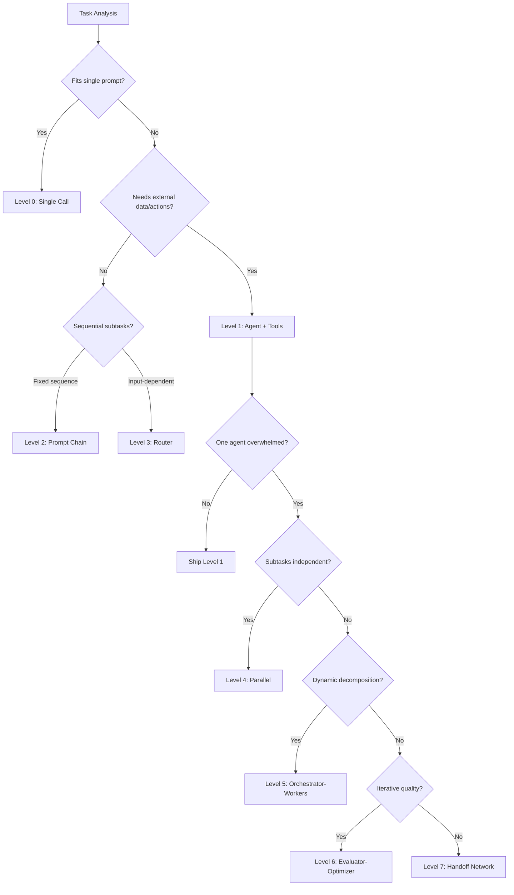

# Agent Architect

Build powerful, reliable AI agents using 2025-2026 research-backed patterns, battle-tested architecture, and (optionally) Noizu Prompt Lingua conventions.

## Overview

- **Architecture selection** — Choose the right pattern (single agent, prompt chain, orchestrator-workers, handoff network) based on task complexity, not hype
- **Context engineering** — Assemble the right information into the context window dynamically, per-call — the skill that replaced "prompt engineering" in 2025
- **Tool design** — Build tools that agents can actually use: structured output, meaningful errors, pagination, high-leverage operations
- **Memory systems** — Multi-layer memory (working/episodic/semantic/procedural) with proven retrieval strategies
- **Guardrails & safety** — Architectural guardrails at every model boundary, failure mode awareness, evaluation benchmarks
- **NPL integration** — Optional Noizu Prompt Lingua patterns for structured reasoning, agent declarations, psychodynamic state
- **Quality evaluation** — Scoring rubrics, checklists, and scenario testing for agent validation

## Core Philosophy

1. **Start simple, prove you need complexity.** A single well-prompted agent with good tools handles 80% of cases. Only add multi-agent coordination when evaluation shows the simpler approach fails. (Source: Anthropic, OpenAI, academic consensus 2025)
2. **Context engineering > prompt engineering.** The system that dynamically assembles what goes into the context window determines agent quality more than model choice or clever phrasing. (Source: Karpathy, Gartner 2025)
3. **Tools are the agent's hands — design them for the agent.** Format responses for the model, include examples, design for recoverability, never dump unbounded data. (Source: Anthropic "Writing Effective Tools for AI Agents" 2025)
4. **Guardrails are architectural, not afterthoughts.** Pre-input, post-retrieval, pre-tool-call, post-output — the control plane sits outside the agent loop. (Source: OWASP 2025-2026)
5. **Make reasoning visible.** Agents that expose their assumptions, decisions, and state are debuggable. Agents that don't are black boxes that fail silently. (Source: NPL intuition pumps, Reflexion/LATS research)

## When to Use This Skill

- **Building a new Claude Code subagent** — Full design through implementation with `.claude/agents/` conventions
- **Designing a multi-agent system** — Architecture selection, coordination patterns, handoff design
- **Writing agent system prompts** — Context engineering, persona design, behavioral specification
- **Designing tools for agents** — MCP tool design, function calling patterns, error handling
- **Adding memory to an agent** — Memory architecture, retrieval strategies, context management
- **Hardening an agent** — Guardrails, failure mode analysis, evaluation benchmarks
- **Integrating NPL into an agent** — Intuition pumps, psychodynamic state, runtime flags
- **Evaluating agent quality** — Scoring rubric, checklist, scenario testing

> For building MCP servers that agents consume, see **mcp-architect** or **mcp-forge**.
> For Kubernetes-specific agent patterns, see **kubernetes-engineer**.
> For packaging agents as sellable products, see **ai-templates**.

## The Complexity Ladder

Before designing anything, locate your task on this ladder. **Only climb when evaluation proves you need to.**

| Level | Pattern | When to Use | Cost | Failure Risk |
|-------|---------|-------------|------|-------------|
| 0 | Single LLM call | Task fits in one prompt | $ | Lowest |
| 1 | Single agent + tools | Needs external data or actions | $$ | Low |
| 2 | Prompt chaining | Fixed sequential subtasks with gates | $$$ | Medium |
| 3 | Routing | Input classification to specialized handlers | $$$ | Medium |
| 4 | Parallelization | Independent subtasks or voting | $$$$ | Medium |
| 5 | Orchestrator-workers | Dynamic task decomposition | $$$$$ | High |
| 6 | Evaluator-optimizer | Iterative refinement loops | $$$$$$ | High |
| 7 | Multi-agent handoff network | Peer-to-peer delegation | $$$$$$$ | Highest |

**The 80/20 rule:** Levels 1-2 cover 80% of real-world agent needs. Levels 5-7 are where most failures occur.

> For detailed pattern specifications, see [architecture-patterns.md](references/architecture-patterns.md).

## Agent Design Process

### Phase 1: Requirements

| Question | Why It Matters | Output |
|----------|---------------|--------|
| What is the agent's primary task? | Defines scope and success criteria | Task statement |
| Who/what triggers the agent? | Determines input format and validation | Trigger specification |
| What tools does it need? | Shapes architecture and cost | Tool inventory |
| What can go wrong? | Drives guardrail design | Failure mode list |
| How long does it live? | Ephemeral vs. long-lived patterns | Lifecycle type |
| Who does it report to? | Coordination and output format | Reporting interface |
| What does "done" look like? | Evaluation criteria | Success definition |

### Phase 2: Architecture Selection



### Phase 3: Context Engineering

The core competency. Assemble these layers dynamically per inference call:

| Layer | Content | Strategy |
|-------|---------|----------|
| System instructions | Agent identity, constraints, behavioral rules | Static, version-controlled |
| Conversation history | Prior turns, decisions, context | Hierarchical summarization |
| Retrieved knowledge | RAG results, documentation, external data | Relevance-scored, size-bounded |
| Persistent memory | User preferences, prior decisions, learned patterns | Scoped (user/session/org) |
| Tool definitions | Available tools and their schemas | Lazy-loaded, not all at once |
| Task state | Scratchpad, intermediate results, progress | Compacted periodically |
| Guardrail context | Safety rules, content policies, boundary conditions | Immutable prefix |

> For the full context engineering playbook, see [prompt-engineering.md](references/prompt-engineering.md).

### Phase 4: Implementation

Write the agent definition following the target platform's conventions:

**Claude Code agents** (`.claude/agents/`):
```yaml
---
name: agent-name
description: Trigger description — what invokes this agent
model: opus  # or sonnet, haiku
---

# Agent Name

## Identity
agent_id: agent-name
role: What this agent does
lifecycle: ephemeral | long-lived
reports_to: controller | user
autonomy: low | medium | high

## Purpose
[Natural language description of the agent's mission]

## Interface
### Commands
| Command | Input | Output |
[Command table]

### Response Format
[Structured output specification]

## Behavior
[Behavioral rules, algorithms, constraints]

## Guardrails
[What the agent must never do, boundary conditions]
```

**NPL-enhanced agents** — add intuition pumps, psychodynamic state, and runtime flags:

> For NPL agent patterns, see [npl-agent-patterns.md](references/npl-agent-patterns.md).
> For the full agent playbook with execution workflows, see [agent-playbook.claude-code.md](references/agent-playbook.claude-code.md).

### Phase 5: Validation

| Check | Method | Pass Criteria |
|-------|--------|--------------|
| Task completion | Run against 5+ representative inputs | Completes primary task correctly |
| Tool usage | Trace tool calls across scenarios | No hallucinated tools, appropriate selection |
| Guardrail enforcement | Adversarial inputs, injection attempts | All boundaries hold |
| Context efficiency | Measure token usage across scenarios | No unbounded growth, appropriate summarization |
| Failure recovery | Introduce tool failures, bad data | Graceful degradation, useful error messages |
| Output quality | Score against rubric | Meets minimum quality threshold |

> For the full validation checklist, see [assets/agent-checklist.md](assets/agent-checklist.md).
> For the scoring rubric, see [assets/agent-scoring-rubric.md](assets/agent-scoring-rubric.md).

## Modern Prompting Techniques Reference

Quick reference for the techniques that matter most in 2025-2026. Full details in reference docs.

### Context Engineering (The New Core)

| Technique | When to Use | Reference |
|-----------|-------------|-----------|
| Dynamic context assembly | Every agent | [prompt-engineering.md](references/prompt-engineering.md) |
| Hierarchical summarization | Long conversations | [memory-and-context.md](references/memory-and-context.md) |
| Relevance-based eviction | Context window pressure | [memory-and-context.md](references/memory-and-context.md) |
| Lazy tool loading | Agents with many tools | [tool-design.md](references/tool-design.md) |
| Scratchpad pattern | Complex reasoning tasks | [prompt-engineering.md](references/prompt-engineering.md) |

### Structured Reasoning

| Technique | When to Use | NPL Equivalent | Reference |
|-----------|-------------|----------------|-----------|
| Chain-of-Thought | Problem decomposition | `<npl-cot>` | [prompt-engineering.md](references/prompt-engineering.md) |
| Focused CoT (FCoT) | Constrained reasoning | `<npl-cot>` with scope | [prompt-engineering.md](references/prompt-engineering.md) |
| ReAct | Tool-using agents | `<npl-poa>` + tools | [prompt-engineering.md](references/prompt-engineering.md) |
| Reflection/Self-Critique | Quality assurance | `<npl-ref>` + `<npl-critique>` | [prompt-engineering.md](references/prompt-engineering.md) |
| Plan-of-Action | Decision making | `<npl-poa>` | [npl-agent-patterns.md](references/npl-agent-patterns.md) |
| Intent Declaration | Assumption surfacing | `<npl-intent>` | [npl-agent-patterns.md](references/npl-agent-patterns.md) |

### Agent-Specific Patterns

| Pattern | What It Does | Reference |
|---------|-------------|-----------|
| Guardrail sandwich | Pre-input + post-retrieval + pre-tool + post-output checks | [guardrails-and-safety.md](references/guardrails-and-safety.md) |
| Hormone-driven behavior | Mechanistic state changes at thresholds | [npl-agent-patterns.md](references/npl-agent-patterns.md) |
| Vector-of-Self bracketing | Expose motivational drift across responses | [npl-agent-patterns.md](references/npl-agent-patterns.md) |
| Mind Reader | Theory of mind for user intent | [npl-agent-patterns.md](references/npl-agent-patterns.md) |
| Mode switching | Declare cognitive modality shifts | [npl-agent-patterns.md](references/npl-agent-patterns.md) |

## Quick Start Guides

### Build a Claude Code Subagent
1. Define requirements using the [agent-brief-worksheet.md](assets/agent-brief-worksheet.md)
2. Select complexity level from the Complexity Ladder
3. Read [design-principles.md](references/design-principles.md) for research-backed foundations
4. Read [architecture-patterns.md](references/architecture-patterns.md) for your selected level
5. Write agent definition following Phase 4 template
6. Add guardrails per [guardrails-and-safety.md](references/guardrails-and-safety.md)
7. Validate with [agent-checklist.md](assets/agent-checklist.md)

### Build a Multi-Agent System
1. Map all agents and their relationships
2. Read [architecture-patterns.md](references/architecture-patterns.md) — focus on Levels 5-7
3. Design coordination protocol (orchestrator vs. handoff vs. hierarchical)
4. Read [memory-and-context.md](references/memory-and-context.md) for shared state patterns
5. Implement guardrails at every agent boundary
6. Test for infinite loops, context poisoning, and deadlock

### Add NPL to an Existing Agent
1. Read [npl-agent-patterns.md](references/npl-agent-patterns.md)
2. Start with `<npl-intent>` (assumptions) and `<npl-ref>` (reflection) — highest ROI
3. Add `<npl-poa>` for decision-heavy agents
4. Consider psychodynamic state (`<npl-vos>`, hormones) for persona-driven agents
5. Configure runtime flags for production tuning

### Design Tools for Your Agent
1. Read [tool-design.md](references/tool-design.md)
2. Format responses for the model, not humans
3. Include examples in tool descriptions
4. Design for recoverability (useful errors, not stack traces)
5. Implement pagination and filtering
6. Consider Tool Search pattern for large tool catalogs

## Reference Guide

| Task | Read These |
|------|-----------|
| **Any agent project** | `design-principles.md` |
| **Choosing architecture** | `architecture-patterns.md` |
| **Writing system prompts** | `prompt-engineering.md` |
| **Designing agent tools** | `tool-design.md` |
| **Memory architecture** | `memory-and-context.md` |
| **Safety and guardrails** | `guardrails-and-safety.md` |
| **NPL integration** | `npl-agent-patterns.md` |
| **Full build walkthrough** | `worked-example-devops-agent.md` |
| **Research agent example** | `worked-example-research-agent.md` |
| **Quality evaluation** | `assets/agent-checklist.md` + `assets/agent-scoring-rubric.md` |
| **Requirements gathering** | `assets/agent-brief-worksheet.md` |

All reference paths are relative to `references/` unless prefixed with `assets/`.

## Related Skills

- **skill-engineer** — Meta-skill for building any skill (not just agents)
- **mcp-architect** — Design MCP servers that agents consume
- **mcp-forge** — Build and deploy MCP servers
- **kubernetes-engineer** — K8s-specific agent patterns
- **threat-modeler** — Security analysis for agent systems
- **ai-templates** — Package agents as products

## Bundled Resources

### References

**Foundation** (read first):
- [design-principles.md](references/design-principles.md) — Five research-backed principles with sources: simplicity-first, context engineering, tool design, architectural guardrails, visible reasoning
- [architecture-patterns.md](references/architecture-patterns.md) — Seven complexity levels from single call to multi-agent handoff, with decision framework and cost/risk analysis
- [prompt-engineering.md](references/prompt-engineering.md) — Context engineering, CoT variants, ReAct, reflection, FCoT — the 2025-2026 prompting landscape

**Deep Dives:**
- [tool-design.md](references/tool-design.md) — Anthropic and OpenAI tool design guidance: formatting, errors, pagination, Tool Search, programmatic calling
- [memory-and-context.md](references/memory-and-context.md) — Multi-layer memory stack, hierarchical summarization, relevance eviction, context window strategies
- [guardrails-and-safety.md](references/guardrails-and-safety.md) — OWASP agent threats, guardrail architecture, failure modes, evaluation benchmarks
- [npl-agent-patterns.md](references/npl-agent-patterns.md) — NPL agent declarations, intuition pumps for agents, psychodynamic state, runtime flags, emission ordering

**Execution:**
- [agent-playbook.claude-code.md](references/agent-playbook.claude-code.md) — Agent role definition and execution workflows for the Agent Architect itself

**Worked Examples:**
- [worked-example-devops-agent.md](references/worked-example-devops-agent.md) — Full walkthrough: building a DevOps deployment agent from requirements through validation
- [worked-example-research-agent.md](references/worked-example-research-agent.md) — Full walkthrough: building a web research agent with memory and tool integration

### Assets

- [agent-brief-worksheet.md](assets/agent-brief-worksheet.md) — Fillable intake form for agent requirements, constraints, tools, and success criteria
- [agent-scoring-rubric.md](assets/agent-scoring-rubric.md) — Weighted quality scoring template for agent evaluation
- [agent-checklist.md](assets/agent-checklist.md) — Pre-ship validation checklist covering structure, behavior, safety, and performance
