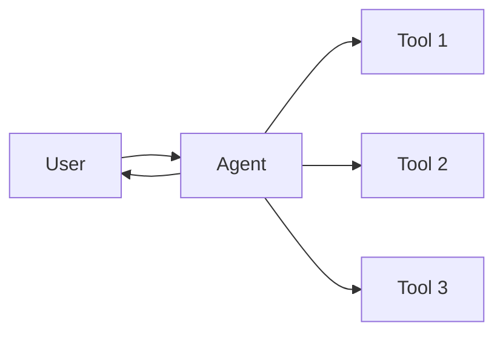
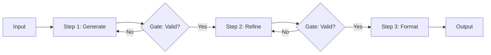
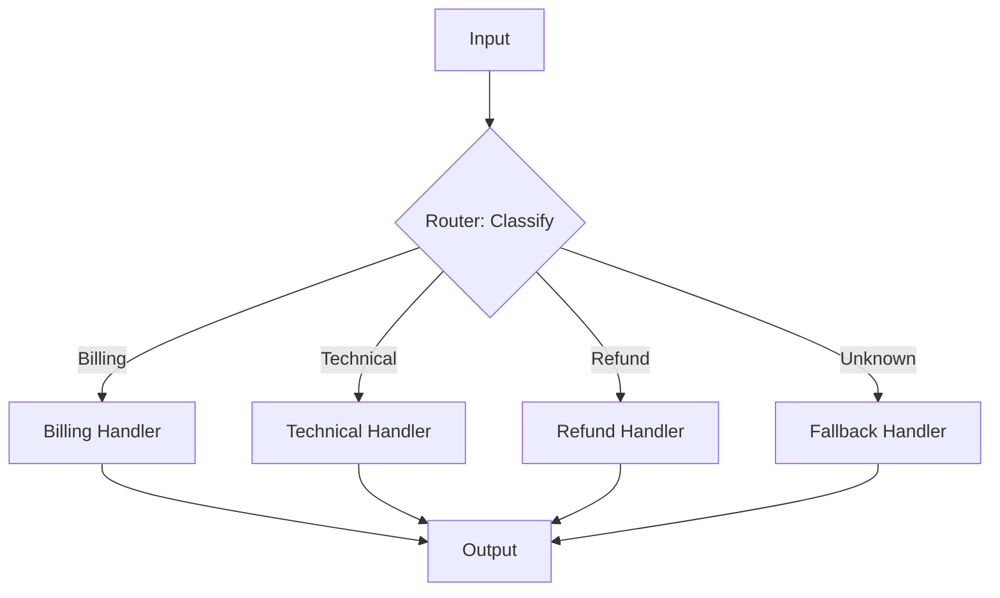
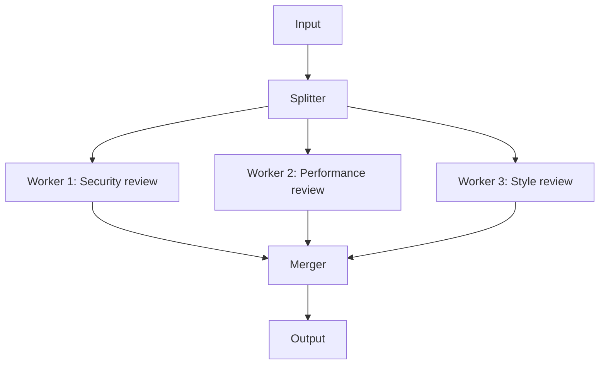
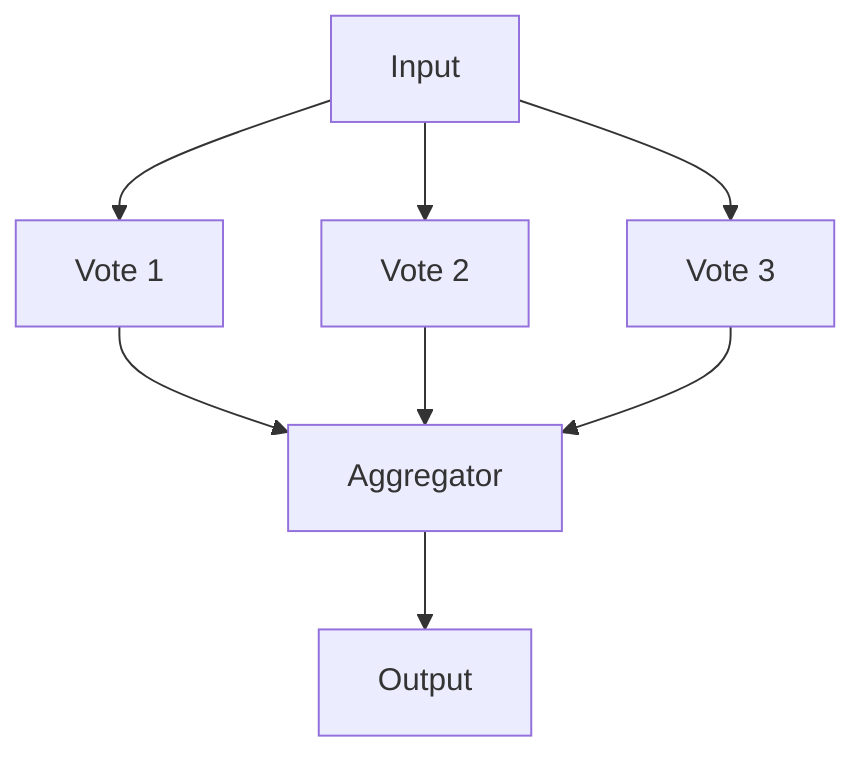
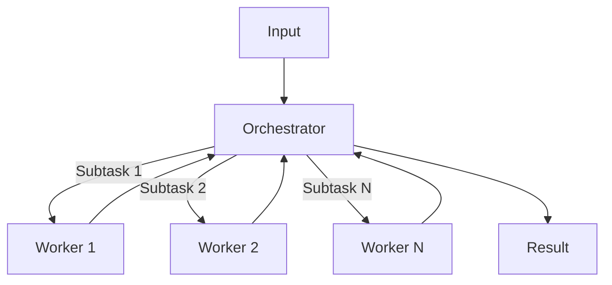
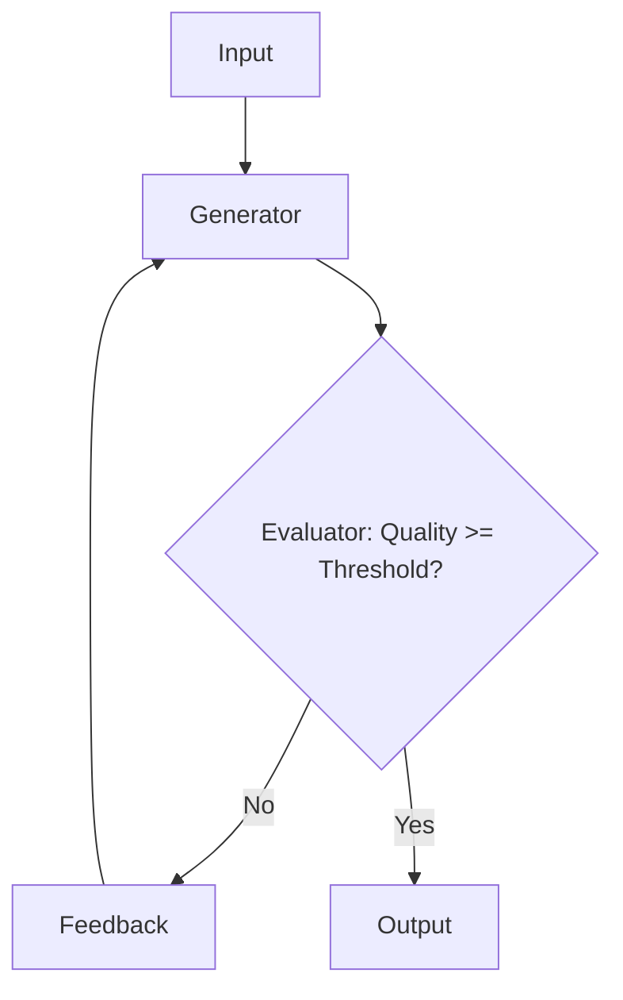
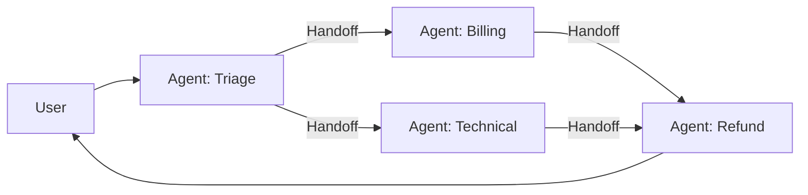

# Architecture Patterns

Seven complexity levels for agent systems, from simple to sophisticated. Based on Anthropic's five workflow patterns (2024-2025), extended with OpenAI's handoff patterns and academic multi-agent coordination research.

---

## Level 0: Single LLM Call

**Pattern:** One prompt, one response. No tools, no loops.

**When to use:**
- Task is self-contained in the prompt
- No external data needed
- Output format is straightforward

**Example:** Classify a support ticket, generate a commit message, translate text.

**Cost:** $ | **Failure risk:** Lowest | **Debugging:** Trivial

---

## Level 1: Single Agent + Tools

**Pattern:** One agent with access to external tools (MCP servers, function calls, CLI tools). The agent decides which tools to call and when.

**When to use:**
- Task needs external data or actions
- Single coherent instruction set (no contradictions)
- Tool count < 15
- Completes in < 10 tool calls

**Architecture:**

**Key design decisions:**
- Tool descriptions must include examples and error guidance
- Implement pagination on all data-returning tools
- Set maximum tool call limits to prevent runaway loops

**Example:** Code review agent, file search agent, API debugging agent.

**Cost:** $$ | **Failure risk:** Low | **Debugging:** Tool call traces

---

## Level 2: Prompt Chaining

**Pattern:** Sequential LLM calls where output of one feeds into the next. Gates between steps for programmatic validation.

**When to use:**
- Task decomposes into 2-5 fixed sequential steps
- Each step has clear input/output contracts
- Intermediate results can be validated programmatically

**Architecture:**

**Key design decisions:**
- Gates should be programmatic (regex, schema validation), not LLM-based
- Each step should have a clear, testable contract
- Keep the chain short (2-5 steps) — longer chains compound errors

**Example:** Generate code → validate syntax → run tests → format output.

**Cost:** $$$ | **Failure risk:** Medium | **Debugging:** Step-by-step traces

**Source:** Anthropic, "Building Effective Agents" (2024)

---

## Level 3: Routing

**Pattern:** Classify input, then dispatch to specialized handlers. Each handler is optimized for its specific use case.

**When to use:**
- Inputs fall into distinct categories
- Each category needs different handling (different prompts, tools, or models)
- Categories are classifiable with high accuracy

**Architecture:**

**Key design decisions:**
- Router should be fast and cheap (smaller model, few-shot classification)
- Always include a fallback handler for unclassifiable inputs
- Each handler can be a different complexity level (Level 0-2)

**Example:** Customer support triage, code change routing (frontend/backend/infra), document type classification.

**Cost:** $$$ | **Failure risk:** Medium (misrouting) | **Debugging:** Classification traces

**Source:** Anthropic, "Building Effective Agents" (2024)

---

## Level 4: Parallelization

**Pattern:** Run multiple LLM calls simultaneously. Two variants:

### Variant A: Sectioning
Split task into independent subtasks, run in parallel, merge results.

### Variant B: Voting
Run the same task N times, aggregate results (majority vote, best-of-N, etc.).

**When to use:**
- Subtasks are genuinely independent (sectioning)
- Task has high variance and you want consistency (voting)
- Latency matters more than cost

**Key design decisions:**
- Ensure subtasks are truly independent — shared state creates race conditions
- Define merge strategy before implementation (union, intersection, weighted)
- Voting is expensive (N× cost) — only use when variance justifies it

**Example:** Multi-aspect code review, guardrail checks alongside main generation, consensus classification.

**Cost:** $$$$ | **Failure risk:** Medium | **Debugging:** Parallel traces (harder)

**Source:** Anthropic, "Building Effective Agents" (2024)

---

## Level 5: Orchestrator-Workers

**Pattern:** A central LLM dynamically decomposes tasks into subtasks, delegates to worker LLMs, and synthesizes results. Unlike prompt chaining, the decomposition is not predetermined.

**Architecture:**

**When to use:**
- Tasks cannot be decomposed in advance
- Different subtasks may require different specialist capabilities
- You need a "brain" that sees the whole picture

**Key design decisions:**
- Orchestrator uses the most capable (expensive) model
- Workers can use cheaper, task-specific models — **reported 40-60% cost reduction** (Beam.ai 2025)
- Orchestrator needs a scratchpad to track what's been delegated and what's returned
- Set maximum delegation depth to prevent infinite recursion
- Workers should return structured results, not free text

**Failure modes:**
- Orchestrator creates too many subtasks (cost explosion)
- Workers return inconsistent results
- Orchestrator loses track of overall goal (goal drift)

**Example:** Complex code refactoring, research synthesis, project planning.

**Cost:** $$$$$ | **Failure risk:** High | **Debugging:** Requires distributed tracing

**Sources:**
- Anthropic, "Building Effective Agents" (2024)
- OpenAI, "Manager Pattern" in Agents SDK (2025)
- Beam.ai, "6 Multi-Agent Orchestration Patterns" (2025)

---

## Level 6: Evaluator-Optimizer

**Pattern:** One LLM generates, another evaluates, loop until quality threshold met.

**Architecture:**

**When to use:**
- Output quality is measurable but generation is non-deterministic
- Clear evaluation criteria exist
- Iteration genuinely improves output (not all tasks benefit)

**Key design decisions:**
- Evaluator should use a different prompt (or model) than generator to avoid blind spots
- Set maximum iterations (3-5 typical) to prevent infinite loops
- Evaluator feedback must be specific and actionable — "try again" is useless
- Consider using a scoring rubric for the evaluator

**Failure modes:**
- Infinite loop if evaluator is too strict or generator can't improve
- Evaluator hallucinating quality (scoring high on bad output)
- Oscillation — generator alternates between two mediocre outputs

**Example:** Translation quality refinement, code optimization, creative writing polish.

**Cost:** $$$$$$ | **Failure risk:** High | **Debugging:** Iteration traces with scores

**Source:** Anthropic, "Building Effective Agents" (2024)

---

## Level 7: Multi-Agent Handoff Network

**Pattern:** Multiple agents that transfer control laterally to specialists. No central coordinator. Each agent decides whether to handle or delegate.

**Architecture:**

**When to use:**
- Natural "expertise boundaries" between agents
- User-facing flows where seamless experience matters
- Agents need different models, tools, or permissions

**Key design decisions:**
- Handoffs are modeled as tool calls (OpenAI Agents SDK pattern)
- Conversation history must transfer with the handoff
- Each agent needs clear "I handle this" and "I hand off when" rules
- **Critical: implement loop detection** — A→B→C→A is the #1 failure mode

**The Three Sub-Patterns:**

| Pattern | Coordination | Best For |
|---------|-------------|----------|
| Hub-and-Spoke | Central orchestrator delegates to workers | Structured decomposition |
| Dynamic Handoff | Peer-to-peer, no coordinator | User-facing flows |
| Hierarchical | Multi-level: manager → supervisors → workers | Complex organizations |

**Failure modes (most dangerous):**
- **Infinite handoff loops** — Agent A → B → C → A with degrading context
- **Context loss at handoffs** — nuance from original request disappears
- **State synchronization** — inconsistent shared state across agents
- **Deadlock** — agents waiting on each other's output
- **Cost explosion** — poorly orchestrated = 10-100× more LLM calls

**Communication protocols (2025-2026):**
- **MCP** — agent-to-tool standardization
- **A2A (Google)** — agent-to-agent standardization, in production at 150+ orgs

**Example:** Customer support network, development team simulation, enterprise workflow.

**Cost:** $$$$$$$ | **Failure risk:** Highest | **Debugging:** Distributed tracing required

**Sources:**
- OpenAI, "Handoff Pattern" in Agents SDK (2025)
- Google, "Agent-to-Agent Protocol" (2025-2026)
- Beam.ai, "6 Multi-Agent Orchestration Patterns" (2025)
- arXiv, "Orchestration of Multi-Agent Systems" (2025)

---

## Pattern Selection Checklist

Before choosing a level, answer these questions:

| Question | If Yes → | If No → |
|----------|----------|---------|
| Can this be done in a single prompt? | Level 0 | Continue |
| Does the agent need external tools? | Level 1+ | Level 0 or 2 |
| Are the subtasks fixed and sequential? | Level 2 | Continue |
| Does input type determine handling? | Level 3 | Continue |
| Are subtasks independent? | Level 4 | Continue |
| Is task decomposition dynamic? | Level 5 | Continue |
| Does quality improve with iteration? | Level 6 | Continue |
| Are there natural expertise boundaries? | Level 7 | Reassess |

**Golden rule:** If you can't articulate why Level N-1 fails for your use case, stay at Level N-1.
