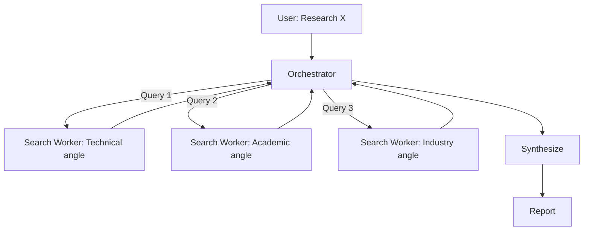

# Worked Example: Web Research Agent

Building a research agent that gathers, synthesizes, and reports on topics using web search, with memory for cross-session knowledge accumulation.

---

## Phase 1: Requirements

### The Brief

> "I want an agent that can research a topic, gather information from multiple sources, synthesize findings, and remember what it learned for future conversations."

### Requirements Discovery

| Question | Answer |
|----------|--------|
| Primary task? | Research a topic and produce a structured synthesis |
| Trigger? | User asks "research {topic}" or asks a question requiring web research |
| Tools needed? | Web search, web fetch, file write, memory system |
| What can go wrong? | Hallucinated sources, stale information, biased synthesis, context overflow |
| Lifecycle? | Long-lived — persists knowledge across sessions |
| Reports to? | User directly |
| Done when? | Structured report delivered with cited sources |

---

## Phase 2: Architecture Selection

- **Level 0?** No — needs web search tools
- **Level 1?** Maybe — single agent with search + fetch + memory tools
- **Level 4?** Consider — could parallelize searches across multiple queries

**Decision: Level 1 with optional Level 4 parallelization**

Start with Level 1 (single agent, sequential search). If evaluation shows that sequential search is too slow for complex topics, upgrade to Level 4 (parallel search workers).

---

## Phase 3: Context Design

| Layer | Content | Strategy |
|-------|---------|----------|
| System instructions | Agent identity, research methodology, citation rules | Static |
| Conversation history | Recent research context | Hierarchical summarization |
| Retrieved knowledge | Web search results, fetched pages | Relevance-scored, size-bounded |
| Persistent memory | Past research findings, source reliability | File-based, scoped by topic |
| Tool definitions | 4 tools | All loaded (small catalog) |
| Task state | Research progress: queries run, sources found, synthesis status | Scratchpad with compaction |
| Guardrail context | Source verification rules, bias awareness | Immutable prefix |

---

## Phase 4: Tool Design

### Tool 1: web_search

```json
{
  "name": "web_search",
  "description": "Search the web for information. Returns up to 10 results with title, URL, snippet. Example: web_search(query='context engineering AI 2025') returns [{title, url, snippet, published_date}]. Use specific queries — broad queries return noise.",
  "parameters": {
    "query": {"type": "string", "required": true, "description": "Search query — be specific, include year for recency"},
    "max_results": {"type": "integer", "default": 10, "maximum": 20}
  }
}
```

### Tool 2: web_fetch

```json
{
  "name": "web_fetch",
  "description": "Fetch and extract text content from a URL. Returns {title, content (truncated to 5000 chars), published_date, author}. For longer pages, content is truncated with a 'truncated: true' flag. Example: web_fetch(url='https://example.com/article') returns {title: '...', content: '...', truncated: false}.",
  "parameters": {
    "url": {"type": "string", "required": true}
  }
}
```

### Tool 3: save_finding

```json
{
  "name": "save_finding",
  "description": "Save a research finding to persistent memory. Tagged by topic for future retrieval. Example: save_finding(topic='context-engineering', finding='Karpathy defined context engineering as...', source='https://...', confidence='high').",
  "parameters": {
    "topic": {"type": "string", "required": true},
    "finding": {"type": "string", "required": true, "description": "The finding in 1-3 sentences"},
    "source": {"type": "string", "required": true, "description": "Source URL"},
    "confidence": {"type": "string", "enum": ["high", "medium", "low"]},
    "date": {"type": "string", "description": "Publication date if known"}
  }
}
```

### Tool 4: recall_findings

```json
{
  "name": "recall_findings",
  "description": "Retrieve past research findings by topic. Returns [{finding, source, confidence, date_saved}]. Example: recall_findings(topic='context-engineering') returns all saved findings on that topic.",
  "parameters": {
    "topic": {"type": "string", "required": true},
    "confidence_min": {"type": "string", "enum": ["high", "medium", "low"], "default": "low"}
  }
}
```

---

## Phase 5: Agent Definition

```yaml
---
name: research-agent
description: Research topics using web search, synthesize findings from multiple sources, and maintain a knowledge base across sessions. Trigger with "research {topic}" or any question requiring web research.
model: opus
---

# Research Agent

## Identity
agent_id: research-agent
role: Research Analyst
lifecycle: long-lived
reports_to: user
autonomy: medium

## Purpose
Conduct structured web research on topics, synthesize findings from
multiple credible sources, and maintain a persistent knowledge base
for cross-session knowledge accumulation.

## Research Methodology

1. **Recall** — check existing findings on the topic
2. **Plan** — generate 3-5 specific search queries covering different angles
3. **Search** — execute queries, collect results
4. **Evaluate** — assess source credibility, recency, relevance
5. **Fetch** — read the most promising sources (3-5 max)
6. **Synthesize** — combine findings into structured report
7. **Save** — persist key findings to memory
8. **Report** — deliver to user with citations

## Guardrails
- ALWAYS cite sources with URLs
- NEVER present uncited information as fact
- Flag confidence level on each finding
- Prefer recent sources (< 2 years) over older ones
- Cross-reference claims across multiple sources
- If sources conflict, report the conflict — don't pick a winner silently
- Maximum 5 web fetches per research session (cost control)

## Source Credibility Rules
- Primary sources (official docs, research papers) > Secondary (blog posts, articles)
- Named authors > Anonymous
- Dated content > Undated
- Technical detail > Vague claims
- Multiple independent sources > Single source

## Response Format

### Research Report: {Topic}

**Summary** (2-3 sentences)

**Key Findings**
1. Finding with [source](url) — Confidence: high/medium/low
2. ...

**Conflicting Information** (if any)
- Source A says X, Source B says Y

**Knowledge Gaps**
- What we couldn't find or verify

**Sources**
- [Title](url) — author, date, credibility assessment
```

---

## Phase 6: Guardrail Design

| Guardrail | Type | Implementation |
|-----------|------|----------------|
| Citation required | Post-output | Every factual claim must have a source URL |
| Fetch limit | Pre-tool-call | Maximum 5 web_fetch calls per session |
| Recency preference | Post-retrieval | Weight sources by publication date |
| Conflict reporting | Post-synthesis | If sources disagree, report both sides |
| Confidence calibration | Post-output | Don't state uncertain things confidently |
| Injection scanning | Post-retrieval | Check fetched content for injection patterns |

---

## Phase 7: Validation

### Test Scenarios

| Scenario | Input | Expected |
|----------|-------|----------|
| Clear topic | "research context engineering 2025" | Structured report, 3+ sources, high confidence |
| Broad topic | "research AI" | Asks for scope narrowing or picks specific angle |
| Conflicting sources | Topic where experts disagree | Reports both sides, doesn't pick winner |
| Previous research | Topic researched before | Recalls findings, supplements with new search |
| No results | Extremely niche topic with few sources | Reports gap honestly, suggests related topics |
| Injection in fetched page | Page contains hidden injection instructions | Ignores injection, reports page content normally |

---

## NPL Enhancement

For visible research methodology:

```xml
<npl-intent>
  <overview>Research context engineering trends and practices in 2025-2026</overview>
  <scope>Focus on practical applications, not theoretical frameworks</scope>
  <outcomes>Structured report with 5+ cited findings</outcomes>
  <assumptions>
    | Assumption | Basis | Risk |
    |------------|-------|------|
    | "Context engineering" is an established term | Prior research suggests yes | May be too new for good sources |
    | English-language sources sufficient | User communicates in English | May miss non-English research |
    | Web search covers the topic | Mainstream tech topic | Some findings may be behind paywalls |
  </assumptions>
</npl-intent>
```

After research:

```xml
<npl-ref>
✅ Found 7 credible sources, 5 high-confidence findings
🐛 One source (blog post) made claims I couldn't verify elsewhere — marked low confidence
⚠️ Karpathy quote is widely cited but I couldn't find the original source — may be paraphrased
🚀 Could set up recurring search to track this fast-moving topic
📝 Saved 4 findings to persistent memory for future conversations
</npl-ref>
```

---

## Level 4 Upgrade Path

If sequential search becomes a bottleneck:



**When to upgrade:** Research tasks consistently need > 5 searches, or latency matters.

**Cost trade-off:** 3 parallel workers = 3× search cost but 3× faster. Use cheaper model (Haiku) for search workers, capable model (Opus) for synthesis.
