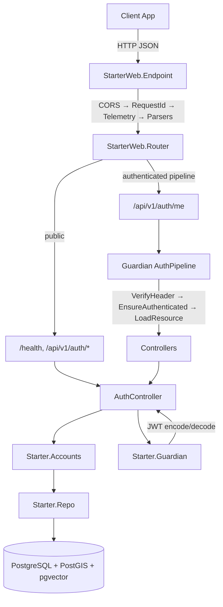

# Project Architecture

## Overview

Phoenix 1.8 JSON API backend (app name: `Starter`) with JWT authentication, PostgreSQL with spatial/vector extensions, and an OTP supervision tree. Serves as the incubator starter template — projects fork from this base.

API-only (no LiveView rendering). Bandit HTTP server. All responses are JSON.

## System Diagram

## Core Components

| Component | Purpose |
|-----------|---------|
| `Starter.Application` | OTP supervisor — boots Telemetry, Repo, Migrator, DNSCluster, PubSub, Endpoint |
| `Starter.Repo` | Ecto repo — Postgres with UUID primary keys, custom Postgrex types |
| `Starter.Accounts` | User context — registration, lookup, bcrypt authentication |
| `Starter.Guardian` | JWT token encoding/decoding via Guardian |
| `StarterWeb.Endpoint` | HTTP entry point — CORS, request parsing, routing |
| `StarterWeb.Router` | Route definitions — public + authenticated pipelines |
| `StarterWeb.AuthPipeline` | Guardian plug pipeline — Bearer header verification |
| `StarterWeb.Plugs.CORS` | Custom CORS plug — reflects request origin |

## Authentication Flow

Register/login returns `{access_token, refresh_token}`. Access tokens TTL 1 hour, refresh tokens 7 days. Protected routes require `Authorization: Bearer <access_token>`. Token refresh via POST with refresh token.

Guardian encodes user ID as JWT subject. `AuthPipeline` verifies + loads the user resource on protected routes.

## Data Layer

PostgreSQL with custom Postgrex type module (`Starter.PostgrexTypes`) registering:
- **pgvector** — vector similarity search
- **PostGIS** — spatial data types

UUID primary keys across all tables. Single `users` table with email + hashed_password.

Ecto migrations run automatically on app boot (skipped in release mode).

## API Routes

| Method | Path | Auth | Handler |
|--------|------|------|---------|
| GET | `/health` | — | `HealthController.index` |
| POST | `/api/v1/auth/register` | — | `AuthController.register` |
| POST | `/api/v1/auth/login` | — | `AuthController.login` |
| POST | `/api/v1/auth/refresh` | — | `AuthController.refresh` |
| GET | `/api/v1/auth/me` | Bearer | `AuthController.me` |
| GET | `/dev/dashboard` | dev only | Phoenix LiveDashboard |

## Tech Stack

| Layer | Technology |
|-------|-----------|
| Language | Elixir 1.19 / OTP 28 |
| Framework | Phoenix 1.8 |
| HTTP Server | Bandit |
| Database | PostgreSQL (PostGIS, pgvector) |
| Auth | Guardian (JWT) + bcrypt_elixir |
| Entity Framework | Noizu Labs Entities |
| AI/LLM | GenAI (provisioned) |
| Process Registry | Syn (provisioned) |
| Cache | Redis via Redix (provisioned) |
| Email | Swoosh (local adapter in dev) |
| Telemetry | telemetry_metrics + telemetry_poller |

## Deployment

Multi-stage Dockerfile: build on `elixir:1.19.5-otp-28-slim`, produces an OTP release. Runs as `nobody` user. Health check on `/health`.

**Required prod env vars:** `DATABASE_URL`, `SECRET_KEY_BASE`, `GUARDIAN_SECRET_KEY`, `PHX_HOST`

**Optional:** `PHX_SERVER`, `PORT`, `POOL_SIZE`, `DNS_CLUSTER_QUERY`

## Key Decisions

- **API-only, no LiveView rendering** — frontend is a separate app
- **UUID primary keys** — configured globally via Ecto migration config
- **Custom CORS plug** — reflects request origin rather than allowlisting
- **Auto-migration on boot** — via `Ecto.Migrator` in supervision tree (skipped in releases)
- **Bandit over Cowboy** — Phoenix 1.8 default, pure-Elixir HTTP server
