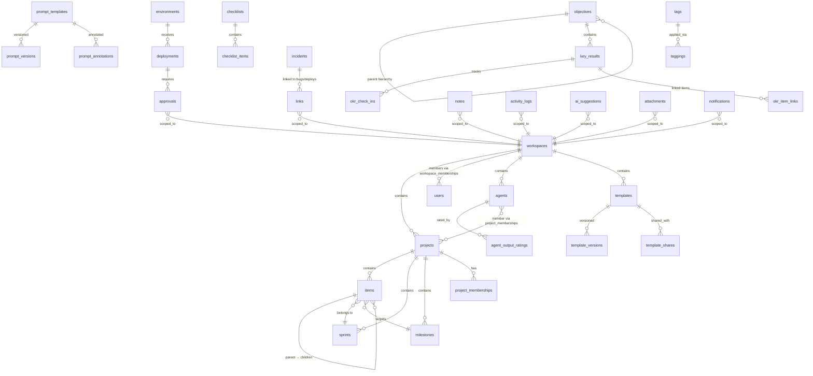

# Ecto Schema Design — tobornalp Backend

> **Author**: Rafael Santos (Senior Backend Engineer, Elixir)
> **Date**: 2026-05-27
> **Status**: Draft — pending team review
> **Stack**: Elixir 1.19 / Phoenix 1.8 / Ecto 3.x / PostgreSQL 16

---

## 1. Design Principles

1. **Polymorphic dual-key joins** for cross-cutting features (notes, tags, activity logs, links, attachments). Every polymorphic join table carries `resource_type` (an Ecto enum) + `resource_id` (UUID). No database-level foreign keys on `resource_id` — referential integrity enforced at the application layer via Ecto changesets and context-module guards.

2. **UUIDs everywhere**. All primary keys are `binary_id` (UUIDv7 where ordering matters, UUIDv4 otherwise). No serial integers leak into APIs.

3. **Soft deletes with `deleted_at`** on core entities. Hard deletes only on ephemeral join records (e.g., tag assignments).

4. **Explicit enum columns** using PostgreSQL `CREATE TYPE ... AS ENUM`. No stringly-typed status fields.

5. **Timestamps as `utc_datetime_usec`**. Microsecond precision for activity logs and audit trails.

6. **Tenant isolation via `workspace_id`**. Every user-facing row carries a `workspace_id` FK. Row-level security (RLS) policies applied at the database layer as a defense-in-depth complement to Ecto query scoping.

7. **Schema-first migration strategy**. Every migration is reversible. Every column has a comment.

---

## 2. Enum Types

All enums live in a single migration and are referenced by multiple tables.

```sql
-- Migration: 001_create_enums

CREATE TYPE resource_type AS ENUM (
  'workspace', 'project', 'item', 'bug', 'sprint', 'milestone',
  'objective', 'key_result', 'agent', 'prompt_template', 'checklist',
  'document', 'runbook', 'adr', 'incident', 'deployment', 'slo',
  'environment', 'pipeline', 'review', 'approval', 'eval_rubric',
  'ab_test', 'time_block', 'habit', 'on_call_rotation'
);

CREATE TYPE item_type AS ENUM (
  'task', 'story', 'bug', 'subtask', 'epic', 'personal_todo', 'inbox_capture'
);

CREATE TYPE item_status AS ENUM (
  'inbox', 'backlog', 'todo', 'in_progress', 'in_review', 'blocked',
  'done', 'archived', 'cancelled'
);

CREATE TYPE priority_level AS ENUM (
  'critical', 'high', 'medium', 'low', 'none'
);

CREATE TYPE methodology AS ENUM (
  'scrum', 'kanban', 'waterfall', 'hybrid'
);

CREATE TYPE project_health AS ENUM (
  'green', 'yellow', 'red'
);

CREATE TYPE agent_status AS ENUM (
  'active', 'paused', 'idle', 'error', 'provisioning', 'decommissioned'
);

CREATE TYPE visibility_level AS ENUM (
  'personal', 'team', 'organization'
);

CREATE TYPE okr_type AS ENUM (
  'objective', 'key_result'
);

CREATE TYPE okr_level AS ENUM (
  'organization', 'team', 'individual', 'personal'
);

CREATE TYPE incident_severity AS ENUM (
  'critical', 'major', 'minor', 'info'
);

CREATE TYPE incident_status AS ENUM (
  'triggered', 'acknowledged', 'investigating', 'mitigating',
  'resolved', 'post_mortem'
);

CREATE TYPE approval_status AS ENUM (
  'pending', 'approved', 'rejected', 'skipped'
);

CREATE TYPE checklist_item_type AS ENUM (
  'manual', 'auto'
);

CREATE TYPE gate_status AS ENUM (
  'pending', 'pass', 'fail', 'overridden'
);

CREATE TYPE link_type AS ENUM (
  'blocks', 'blocked_by', 'relates_to', 'duplicates', 'parent_of',
  'child_of', 'caused_by', 'deployed_with'
);

CREATE TYPE activity_verb AS ENUM (
  'created', 'updated', 'deleted', 'commented', 'assigned',
  'status_changed', 'priority_changed', 'linked', 'unlinked',
  'approved', 'rejected', 'deployed', 'rolled_back', 'escalated',
  'paused', 'resumed', 'rated', 'merged', 'forked', 'archived',
  'restored'
);

CREATE TYPE template_type AS ENUM (
  'project', 'document', 'checklist', 'prompt', 'agent', 'workflow'
);

CREATE TYPE risk_type AS ENUM (
  'risk', 'blocked', 'attention'
);

CREATE TYPE risk_severity AS ENUM (
  'high', 'medium'
);

CREATE TYPE eval_rating AS ENUM (
  'thumbs_up', 'thumbs_down'
);

CREATE TYPE permission_level AS ENUM (
  'view', 'use', 'edit', 'admin'
);

CREATE TYPE capture_source AS ENUM (
  'web', 'mobile', 'email', 'voice', 'api', 'agent'
);

CREATE TYPE notification_channel AS ENUM (
  'in_app', 'email', 'slack', 'webhook'
);
```

---

## 3. Core Domain Tables

### 3.1 Identity & Tenancy

```
┌─────────────────────────────────────────────────────┐
│ workspaces                                          │
├─────────────────────────────────────────────────────┤
│ id              : uuid PK                           │
│ name            : text NOT NULL                     │
│ slug            : citext UNIQUE NOT NULL             │
│ settings        : jsonb DEFAULT '{}'                │
│ inserted_at     : utc_datetime_usec                 │
│ updated_at      : utc_datetime_usec                 │
│ deleted_at      : utc_datetime_usec NULL            │
└─────────────────────────────────────────────────────┘

┌─────────────────────────────────────────────────────┐
│ users                                               │
├─────────────────────────────────────────────────────┤
│ id              : uuid PK                           │
│ email           : citext UNIQUE NOT NULL             │
│ display_name    : text NOT NULL                     │
│ avatar_url      : text NULL                         │
│ settings        : jsonb DEFAULT '{}'                │
│ inserted_at     : utc_datetime_usec                 │
│ updated_at      : utc_datetime_usec                 │
│ deleted_at      : utc_datetime_usec NULL            │
└─────────────────────────────────────────────────────┘

┌─────────────────────────────────────────────────────┐
│ workspace_memberships                               │
├─────────────────────────────────────────────────────┤
│ id              : uuid PK                           │
│ workspace_id    : uuid FK → workspaces              │
│ user_id         : uuid FK → users                   │
│ role            : text NOT NULL DEFAULT 'member'    │
│ inserted_at     : utc_datetime_usec                 │
│ updated_at      : utc_datetime_usec                 │
│ UNIQUE(workspace_id, user_id)                       │
└─────────────────────────────────────────────────────┘
```

### 3.2 Projects

```
┌─────────────────────────────────────────────────────┐
│ projects                                            │
├─────────────────────────────────────────────────────┤
│ id              : uuid PK                           │
│ workspace_id    : uuid FK → workspaces              │
│ name            : text NOT NULL                     │
│ slug            : citext NOT NULL                   │
│ description     : text NULL                         │
│ methodology     : methodology NOT NULL              │
│ health          : project_health DEFAULT 'green'    │
│ risk_score      : integer DEFAULT 0                 │
│ template_id     : uuid FK → templates NULL          │
│ settings        : jsonb DEFAULT '{}'                │
│   ↳ wip_limits, board_columns, sprint_duration,     │
│     workflow_states, etc.                           │
│ inserted_at     : utc_datetime_usec                 │
│ updated_at      : utc_datetime_usec                 │
│ deleted_at      : utc_datetime_usec NULL            │
│ UNIQUE(workspace_id, slug)                          │
└─────────────────────────────────────────────────────┘

┌─────────────────────────────────────────────────────┐
│ project_memberships                                 │
├─────────────────────────────────────────────────────┤
│ id              : uuid PK                           │
│ project_id      : uuid FK → projects                │
│ member_type     : text NOT NULL ('user'|'agent')    │
│ member_id       : uuid NOT NULL                     │
│ role            : text NOT NULL                     │
│ inserted_at     : utc_datetime_usec                 │
│ UNIQUE(project_id, member_type, member_id)          │
└─────────────────────────────────────────────────────┘
```

### 3.3 Items (Work Items — the central entity)

Items are the universal work unit: tasks, stories, bugs, subtasks, epics, personal todos, and inbox captures all share one table. The `item_type` enum discriminates. This avoids a proliferation of near-identical tables and lets polymorphic features (tags, notes, links, activity) attach uniformly.

```
┌─────────────────────────────────────────────────────┐
│ items                                               │
├─────────────────────────────────────────────────────┤
│ id              : uuid PK                           │
│ workspace_id    : uuid FK → workspaces              │
│ project_id      : uuid FK → projects NULL           │
│   ↳ NULL for personal todos / inbox captures        │
│ parent_id       : uuid FK → items NULL (self-ref)   │
│ sprint_id       : uuid FK → sprints NULL            │
│ milestone_id    : uuid FK → milestones NULL         │
│ item_type       : item_type NOT NULL                │
│ title           : text NOT NULL                     │
│ description     : text NULL                         │
│ status          : item_status NOT NULL DEFAULT       │
│                   'inbox'                           │
│ priority        : priority_level DEFAULT 'none'     │
│ assignee_type   : text NULL ('user'|'agent')        │
│ assignee_id     : uuid NULL                         │
│ creator_id      : uuid FK → users                   │
│ due_date        : date NULL                         │
│ position        : integer NOT NULL DEFAULT 0        │
│   ↳ ordering within a list/column                   │
│ story_points    : integer NULL                      │
│ source          : capture_source DEFAULT 'web'      │
│ recurrence_rule : jsonb NULL                        │
│   ↳ RFC 5545 RRULE as JSON for recurring items      │
│ metadata        : jsonb DEFAULT '{}'                │
│   ↳ bug-specific: severity, steps_to_reproduce,     │
│     environment, browser, etc.                      │
│   ↳ inbox-specific: raw_text, voice_transcript      │
│ inserted_at     : utc_datetime_usec                 │
│ updated_at      : utc_datetime_usec                 │
│ deleted_at      : utc_datetime_usec NULL            │
│ archived_at     : utc_datetime_usec NULL            │
│                                                     │
│ INDEX(workspace_id, project_id, status)             │
│ INDEX(workspace_id, assignee_type, assignee_id)     │
│ INDEX(workspace_id, item_type)                      │
│ INDEX(workspace_id, due_date) WHERE due_date IS NOT │
│   NULL                                              │
│ INDEX(parent_id)                                    │
└─────────────────────────────────────────────────────┘
```

### 3.4 Sprints & Milestones

```
┌─────────────────────────────────────────────────────┐
│ sprints                                             │
├─────────────────────────────────────────────────────┤
│ id              : uuid PK                           │
│ project_id      : uuid FK → projects                │
│ name            : text NOT NULL                     │
│ goal            : text NULL                         │
│ start_date      : date NOT NULL                     │
│ end_date        : date NOT NULL                     │
│ status          : text DEFAULT 'planning'           │
│   ↳ planning, active, completed, cancelled          │
│ velocity        : integer NULL                      │
│ retro_summary   : jsonb NULL                        │
│   ↳ AI-generated retrospective analysis             │
│ inserted_at     : utc_datetime_usec                 │
│ updated_at      : utc_datetime_usec                 │
└─────────────────────────────────────────────────────┘

┌─────────────────────────────────────────────────────┐
│ milestones                                          │
├─────────────────────────────────────────────────────┤
│ id              : uuid PK                           │
│ project_id      : uuid FK → projects                │
│ name            : text NOT NULL                     │
│ due_date        : date NULL                         │
│ completed_at    : utc_datetime_usec NULL            │
│ inserted_at     : utc_datetime_usec                 │
│ updated_at      : utc_datetime_usec                 │
└─────────────────────────────────────────────────────┘
```

### 3.5 Agents

Agents are first-class team members. They have their own schema, not a user subtype, because their lifecycle (pause/resume, health metrics, cost tracking, permissions matrix) diverges significantly from human users.

```
┌─────────────────────────────────────────────────────┐
│ agents                                              │
├─────────────────────────────────────────────────────┤
│ id              : uuid PK                           │
│ workspace_id    : uuid FK → workspaces              │
│ name            : text NOT NULL                     │
│ role            : text NOT NULL                     │
│ description     : text NULL                         │
│ avatar_url      : text NULL                         │
│ status          : agent_status DEFAULT 'idle'       │
│ system_prompt   : text NULL                         │
│ constraints     : jsonb DEFAULT '[]'                │
│   ↳ behavioral guardrails, escalation triggers      │
│ permissions     : jsonb DEFAULT '{}'                │
│   ↳ tool access matrix, resource boundaries         │
│ escalation_config : jsonb DEFAULT '{}'              │
│   ↳ when/how to escalate to humans                  │
│ health_metrics  : jsonb DEFAULT '{}'                │
│   ↳ error_rate, completion_rate, avg_response_ms    │
│ cost_tracking   : jsonb DEFAULT '{}'                │
│   ↳ api_calls_today, tokens_used, cost_usd          │
│ notification_prefs : jsonb DEFAULT '{}'             │
│ template_id     : uuid FK → templates NULL          │
│ creator_id      : uuid FK → users                   │
│ paused_at       : utc_datetime_usec NULL            │
│ inserted_at     : utc_datetime_usec                 │
│ updated_at      : utc_datetime_usec                 │
│ deleted_at      : utc_datetime_usec NULL            │
└─────────────────────────────────────────────────────┘

┌─────────────────────────────────────────────────────┐
│ agent_collaboration_protocols                       │
├─────────────────────────────────────────────────────┤
│ id              : uuid PK                           │
│ workspace_id    : uuid FK → workspaces              │
│ name            : text NOT NULL                     │
│ description     : text NULL                         │
│ nodes           : jsonb NOT NULL DEFAULT '[]'       │
│   ↳ visual flow editor node definitions             │
│ edges           : jsonb NOT NULL DEFAULT '[]'       │
│   ↳ connections between nodes                       │
│ inserted_at     : utc_datetime_usec                 │
│ updated_at      : utc_datetime_usec                 │
└─────────────────────────────────────────────────────┘
```

### 3.6 OKRs (Objectives & Key Results)

```
┌─────────────────────────────────────────────────────┐
│ objectives                                          │
├─────────────────────────────────────────────────────┤
│ id              : uuid PK                           │
│ workspace_id    : uuid FK → workspaces              │
│ parent_id       : uuid FK → objectives NULL         │
│   ↳ enables org → team → individual hierarchy       │
│ title           : text NOT NULL                     │
│ description     : text NULL                         │
│ level           : okr_level NOT NULL                │
│ visibility      : visibility_level NOT NULL         │
│ owner_id        : uuid FK → users                   │
│ period_start    : date NOT NULL                     │
│ period_end      : date NOT NULL                     │
│ progress        : decimal(5,2) DEFAULT 0.00         │
│   ↳ auto-rolled up from key_results                 │
│ final_score     : decimal(5,2) NULL                 │
│   ↳ set at end-of-cycle scoring                     │
│ stale           : boolean DEFAULT false             │
│ inserted_at     : utc_datetime_usec                 │
│ updated_at      : utc_datetime_usec                 │
│ deleted_at      : utc_datetime_usec NULL            │
└─────────────────────────────────────────────────────┘

┌─────────────────────────────────────────────────────┐
│ key_results                                         │
├─────────────────────────────────────────────────────┤
│ id              : uuid PK                           │
│ objective_id    : uuid FK → objectives              │
│ title           : text NOT NULL                     │
│ target_value    : decimal NOT NULL                  │
│ current_value   : decimal DEFAULT 0                 │
│ unit            : text NULL                         │
│   ↳ '%', 'count', 'dollars', etc.                   │
│ progress        : decimal(5,2) DEFAULT 0.00         │
│   ↳ auto-calculated: current_value / target_value   │
│ weight          : decimal(3,2) DEFAULT 1.00         │
│ inserted_at     : utc_datetime_usec                 │
│ updated_at      : utc_datetime_usec                 │
└─────────────────────────────────────────────────────┘

┌─────────────────────────────────────────────────────┐
│ okr_check_ins                                       │
├─────────────────────────────────────────────────────┤
│ id              : uuid PK                           │
│ key_result_id   : uuid FK → key_results             │
│ author_id       : uuid FK → users NULL              │
│ agent_id        : uuid FK → agents NULL             │
│   ↳ agent-drafted check-ins                         │
│ previous_value  : decimal NOT NULL                  │
│ new_value       : decimal NOT NULL                  │
│ note            : text NULL                         │
│ risk_flags      : jsonb DEFAULT '[]'                │
│ inserted_at     : utc_datetime_usec                 │
└─────────────────────────────────────────────────────┘

┌─────────────────────────────────────────────────────┐
│ okr_item_links                                      │
├─────────────────────────────────────────────────────┤
│ id              : uuid PK                           │
│ key_result_id   : uuid FK → key_results             │
│ item_id         : uuid FK → items                   │
│ UNIQUE(key_result_id, item_id)                      │
│ inserted_at     : utc_datetime_usec                 │
└─────────────────────────────────────────────────────┘
```

### 3.7 Templates

```
┌─────────────────────────────────────────────────────┐
│ templates                                           │
├─────────────────────────────────────────────────────┤
│ id              : uuid PK                           │
│ workspace_id    : uuid FK → workspaces              │
│ template_type   : template_type NOT NULL            │
│ name            : text NOT NULL                     │
│ description     : text NULL                         │
│ content         : jsonb NOT NULL                    │
│   ↳ type-specific payload: project config,          │
│     checklist items, prompt text, agent config, etc.│
│ usage_count     : integer DEFAULT 0                 │
│ forked_from_id  : uuid FK → templates NULL          │
│   ↳ tracks fork lineage for upstream updates        │
│ creator_id      : uuid FK → users                   │
│ inserted_at     : utc_datetime_usec                 │
│ updated_at      : utc_datetime_usec                 │
│ deleted_at      : utc_datetime_usec NULL            │
└─────────────────────────────────────────────────────┘

┌─────────────────────────────────────────────────────┐
│ template_versions                                   │
├─────────────────────────────────────────────────────┤
│ id              : uuid PK                           │
│ template_id     : uuid FK → templates               │
│ version_number  : integer NOT NULL                  │
│ content         : jsonb NOT NULL                    │
│ changelog       : text NULL                         │
│ author_id       : uuid FK → users                   │
│ inserted_at     : utc_datetime_usec                 │
│ UNIQUE(template_id, version_number)                 │
└─────────────────────────────────────────────────────┘

┌─────────────────────────────────────────────────────┐
│ template_shares                                     │
├─────────────────────────────────────────────────────┤
│ id              : uuid PK                           │
│ template_id     : uuid FK → templates               │
│ grantee_type    : text NOT NULL ('user'|'team')     │
│ grantee_id      : uuid NOT NULL                     │
│ permission      : permission_level NOT NULL          │
│ inserted_at     : utc_datetime_usec                 │
│ UNIQUE(template_id, grantee_type, grantee_id)       │
└─────────────────────────────────────────────────────┘
```

---

## 4. DevOps & Monitoring Domain

### 4.1 Environments & Deployments

```
┌─────────────────────────────────────────────────────┐
│ environments                                        │
├─────────────────────────────────────────────────────┤
│ id              : uuid PK                           │
│ workspace_id    : uuid FK → workspaces              │
│ name            : text NOT NULL                     │
│   ↳ dev, staging, production                        │
│ services        : jsonb DEFAULT '{}'                │
│   ↳ { "api": "v2.3.1", "web": "v1.8.0" }           │
│ drift_indicators : jsonb DEFAULT '[]'               │
│ inserted_at     : utc_datetime_usec                 │
│ updated_at      : utc_datetime_usec                 │
└─────────────────────────────────────────────────────┘

┌─────────────────────────────────────────────────────┐
│ deployments                                         │
├─────────────────────────────────────────────────────┤
│ id              : uuid PK                           │
│ workspace_id    : uuid FK → workspaces              │
│ environment_id  : uuid FK → environments            │
│ version         : text NOT NULL                     │
│ deployer_type   : text NOT NULL ('user'|'agent')    │
│ deployer_id     : uuid NOT NULL                     │
│ changelog       : jsonb DEFAULT '[]'                │
│   ↳ array of { item_id, title, type }               │
│ test_results    : jsonb NULL                        │
│   ↳ { passed: N, failed: N, skipped: N }            │
│ status          : text DEFAULT 'pending'            │
│   ↳ pending, in_progress, succeeded, failed,        │
│     rolled_back                                     │
│ rolled_back_at  : utc_datetime_usec NULL            │
│ rollback_to_id  : uuid FK → deployments NULL        │
│ inserted_at     : utc_datetime_usec                 │
│ updated_at      : utc_datetime_usec                 │
└─────────────────────────────────────────────────────┘

┌─────────────────────────────────────────────────────┐
│ pipelines                                           │
├─────────────────────────────────────────────────────┤
│ id              : uuid PK                           │
│ workspace_id    : uuid FK → workspaces              │
│ project_id      : uuid FK → projects NULL           │
│ name            : text NOT NULL                     │
│ stages          : jsonb NOT NULL                    │
│   ↳ ordered array of stage definitions               │
│ status          : text DEFAULT 'idle'               │
│   ↳ idle, running, passed, failed                    │
│ last_run_at     : utc_datetime_usec NULL            │
│ inserted_at     : utc_datetime_usec                 │
│ updated_at      : utc_datetime_usec                 │
└─────────────────────────────────────────────────────┘
```

### 4.2 Approvals

The approval chain is a polymorphic pattern — deployments, items, and any future resource can require approvals.

```
┌─────────────────────────────────────────────────────┐
│ approvals                                           │
├─────────────────────────────────────────────────────┤
│ id              : uuid PK                           │
│ workspace_id    : uuid FK → workspaces              │
│ resource_type   : resource_type NOT NULL             │
│ resource_id     : uuid NOT NULL                     │
│ approver_id     : uuid FK → users                   │
│ position        : integer NOT NULL                  │
│   ↳ ordering in the approval chain                   │
│ status          : approval_status DEFAULT 'pending' │
│ comment         : text NULL                         │
│ decided_at      : utc_datetime_usec NULL            │
│ inserted_at     : utc_datetime_usec                 │
│ updated_at      : utc_datetime_usec                 │
│                                                     │
│ INDEX(resource_type, resource_id)                    │
└─────────────────────────────────────────────────────┘
```

### 4.3 Incidents & SLOs

```
┌─────────────────────────────────────────────────────┐
│ incidents                                           │
├─────────────────────────────────────────────────────┤
│ id              : uuid PK                           │
│ workspace_id    : uuid FK → workspaces              │
│ title           : text NOT NULL                     │
│ description     : text NULL                         │
│ severity        : incident_severity NOT NULL         │
│ status          : incident_status DEFAULT            │
│                   'triggered'                       │
│ commander_id    : uuid FK → users NULL              │
│ services        : text[] DEFAULT '{}'               │
│   ↳ affected service names                          │
│ timeline_events : jsonb DEFAULT '[]'                │
│   ↳ chronological event log with causation links     │
│ five_whys       : jsonb NULL                        │
│   ↳ root cause analysis from PIR                     │
│ resolved_at     : utc_datetime_usec NULL            │
│ inserted_at     : utc_datetime_usec                 │
│ updated_at      : utc_datetime_usec                 │
└─────────────────────────────────────────────────────┘

┌─────────────────────────────────────────────────────┐
│ slos                                                │
├─────────────────────────────────────────────────────┤
│ id              : uuid PK                           │
│ workspace_id    : uuid FK → workspaces              │
│ name            : text NOT NULL                     │
│ service         : text NOT NULL                     │
│ target          : decimal(7,4) NOT NULL             │
│   ↳ e.g. 99.9500 for 99.95%                         │
│ current         : decimal(7,4) DEFAULT 100.0000     │
│ error_budget_remaining : decimal(7,4) DEFAULT 100   │
│ burn_rate       : decimal(7,4) DEFAULT 0            │
│ alert_thresholds : jsonb DEFAULT '{"warn":50,"crit":25,"emergency":10}' │
│ window_days     : integer DEFAULT 30                │
│ inserted_at     : utc_datetime_usec                 │
│ updated_at      : utc_datetime_usec                 │
└─────────────────────────────────────────────────────┘

┌─────────────────────────────────────────────────────┐
│ on_call_rotations                                   │
├─────────────────────────────────────────────────────┤
│ id              : uuid PK                           │
│ workspace_id    : uuid FK → workspaces              │
│ name            : text NOT NULL                     │
│ schedule        : jsonb NOT NULL                    │
│   ↳ rotation config with shifts, escalation chain    │
│ current_oncall_id : uuid FK → users NULL            │
│ inserted_at     : utc_datetime_usec                 │
│ updated_at      : utc_datetime_usec                 │
└─────────────────────────────────────────────────────┘
```

---

## 5. Documentation & Knowledge Domain

### 5.1 Documents (Wiki, ADRs, Runbooks)

```
┌─────────────────────────────────────────────────────┐
│ documents                                           │
├─────────────────────────────────────────────────────┤
│ id              : uuid PK                           │
│ workspace_id    : uuid FK → workspaces              │
│ parent_id       : uuid FK → documents NULL          │
│   ↳ enables wiki hierarchy                          │
│ doc_type        : text NOT NULL                     │
│   ↳ 'wiki', 'adr', 'runbook', 'changelog'           │
│ title           : text NOT NULL                     │
│ body            : text NULL                         │
│ status          : text DEFAULT 'draft'              │
│   ↳ draft, published, deprecated, superseded         │
│ author_id       : uuid FK → users                   │
│ code_refs       : jsonb DEFAULT '[]'                │
│   ↳ file paths linked for stale detection            │
│ stale           : boolean DEFAULT false             │
│ stale_reason    : text NULL                         │
│ position        : integer DEFAULT 0                 │
│ inserted_at     : utc_datetime_usec                 │
│ updated_at      : utc_datetime_usec                 │
│ deleted_at      : utc_datetime_usec NULL            │
└─────────────────────────────────────────────────────┘

┌─────────────────────────────────────────────────────┐
│ document_versions                                   │
├─────────────────────────────────────────────────────┤
│ id              : uuid PK                           │
│ document_id     : uuid FK → documents               │
│ version_number  : integer NOT NULL                  │
│ body            : text NOT NULL                     │
│ changelog       : text NULL                         │
│ author_id       : uuid FK → users                   │
│ inserted_at     : utc_datetime_usec                 │
│ UNIQUE(document_id, version_number)                 │
└─────────────────────────────────────────────────────┘
```

---

## 6. Checklists

```
┌─────────────────────────────────────────────────────┐
│ checklists                                          │
├─────────────────────────────────────────────────────┤
│ id              : uuid PK                           │
│ workspace_id    : uuid FK → workspaces              │
│ resource_type   : resource_type NULL                 │
│ resource_id     : uuid NULL                         │
│   ↳ polymorphic: attached to items, deployments,     │
│     etc. NULL for library checklists                 │
│ template_id     : uuid FK → templates NULL          │
│ name            : text NOT NULL                     │
│ gate_status     : gate_status DEFAULT 'pending'     │
│ override_reason : text NULL                         │
│ enforced        : boolean DEFAULT false             │
│   ↳ blocks status transitions when true              │
│ agent_generated : boolean DEFAULT false             │
│ inserted_at     : utc_datetime_usec                 │
│ updated_at      : utc_datetime_usec                 │
│                                                     │
│ INDEX(resource_type, resource_id)                    │
└─────────────────────────────────────────────────────┘

┌─────────────────────────────────────────────────────┐
│ checklist_items                                     │
├─────────────────────────────────────────────────────┤
│ id              : uuid PK                           │
│ checklist_id    : uuid FK → checklists              │
│ text            : text NOT NULL                     │
│ check_type      : checklist_item_type NOT NULL       │
│ checked         : boolean DEFAULT false             │
│ checked_by_id   : uuid NULL                         │
│ checked_at      : utc_datetime_usec NULL            │
│ position        : integer NOT NULL                  │
│ auto_check_rule : jsonb NULL                        │
│   ↳ rule definition for automated verification       │
│ inserted_at     : utc_datetime_usec                 │
│ updated_at      : utc_datetime_usec                 │
└─────────────────────────────────────────────────────┘
```

---

## 7. AI & Prompt Management

### 7.1 AI Suggestions

```
┌─────────────────────────────────────────────────────┐
│ ai_suggestions                                      │
├─────────────────────────────────────────────────────┤
│ id              : uuid PK                           │
│ workspace_id    : uuid FK → workspaces              │
│ resource_type   : resource_type NOT NULL             │
│ resource_id     : uuid NOT NULL                     │
│   ↳ polymorphic: what the suggestion is about        │
│ agent_id        : uuid FK → agents NULL             │
│ suggestion_type : text NOT NULL                     │
│   ↳ 'triage', 'priority', 'sprint_plan', 'retro',   │
│     'grooming', 'schedule', 'root_cause', 'checklist'│
│ content         : jsonb NOT NULL                    │
│   ↳ { text, rationale, metadata }                    │
│ confidence      : decimal(3,2) NOT NULL             │
│   ↳ 0.00 to 1.00                                    │
│ status          : text DEFAULT 'pending'            │
│   ↳ pending, accepted, rejected, expired             │
│ decided_by_id   : uuid FK → users NULL              │
│ decided_at      : utc_datetime_usec NULL            │
│ inserted_at     : utc_datetime_usec                 │
│                                                     │
│ INDEX(resource_type, resource_id, status)            │
│ INDEX(workspace_id, status, confidence)              │
└─────────────────────────────────────────────────────┘
```

### 7.2 Prompt Templates & Versioning

```
┌─────────────────────────────────────────────────────┐
│ prompt_templates                                    │
├─────────────────────────────────────────────────────┤
│ id              : uuid PK                           │
│ workspace_id    : uuid FK → workspaces              │
│ name            : text NOT NULL                     │
│ category        : text NOT NULL                     │
│   ↳ triage, review, analysis, generation, etc.       │
│ current_body    : text NOT NULL                     │
│ current_version : integer DEFAULT 1                 │
│ usage_count     : integer DEFAULT 0                 │
│ creator_id      : uuid FK → users                   │
│ forked_from_id  : uuid FK → prompt_templates NULL   │
│ upstream_version : integer NULL                     │
│   ↳ tracks latest known upstream version             │
│ inserted_at     : utc_datetime_usec                 │
│ updated_at      : utc_datetime_usec                 │
│ deleted_at      : utc_datetime_usec NULL            │
└─────────────────────────────────────────────────────┘

┌─────────────────────────────────────────────────────┐
│ prompt_versions                                     │
├─────────────────────────────────────────────────────┤
│ id              : uuid PK                           │
│ prompt_template_id : uuid FK → prompt_templates     │
│ version_number  : integer NOT NULL                  │
│ body            : text NOT NULL                     │
│ changelog       : text NULL                         │
│ author_id       : uuid FK → users                   │
│ performance_delta : jsonb NULL                      │
│   ↳ comparison metrics against previous version      │
│ inserted_at     : utc_datetime_usec                 │
│ UNIQUE(prompt_template_id, version_number)           │
└─────────────────────────────────────────────────────┘

┌─────────────────────────────────────────────────────┐
│ prompt_annotations                                  │
├─────────────────────────────────────────────────────┤
│ id              : uuid PK                           │
│ prompt_template_id : uuid FK → prompt_templates     │
│ author_id       : uuid FK → users                   │
│ note            : text NOT NULL                     │
│   ↳ effectiveness notes, failure modes               │
│ inserted_at     : utc_datetime_usec                 │
└─────────────────────────────────────────────────────┘
```

### 7.3 Agent Evaluation

```
┌─────────────────────────────────────────────────────┐
│ agent_output_ratings                                │
├─────────────────────────────────────────────────────┤
│ id              : uuid PK                           │
│ workspace_id    : uuid FK → workspaces              │
│ agent_id        : uuid FK → agents                  │
│ resource_type   : resource_type NOT NULL             │
│ resource_id     : uuid NOT NULL                     │
│   ↳ the work product being rated                     │
│ rater_id        : uuid FK → users                   │
│ rating          : eval_rating NOT NULL               │
│ feedback        : text NULL                         │
│ inserted_at     : utc_datetime_usec                 │
│                                                     │
│ INDEX(agent_id, inserted_at)                         │
└─────────────────────────────────────────────────────┘

┌─────────────────────────────────────────────────────┐
│ eval_rubrics                                        │
├─────────────────────────────────────────────────────┤
│ id              : uuid PK                           │
│ workspace_id    : uuid FK → workspaces              │
│ name            : text NOT NULL                     │
│ description     : text NULL                         │
│ criteria        : jsonb NOT NULL                    │
│   ↳ array of { name, weight, scale, description }    │
│ creator_id      : uuid FK → users                   │
│ inserted_at     : utc_datetime_usec                 │
│ updated_at      : utc_datetime_usec                 │
└─────────────────────────────────────────────────────┘

┌─────────────────────────────────────────────────────┐
│ ab_tests                                            │
├─────────────────────────────────────────────────────┤
│ id              : uuid PK                           │
│ workspace_id    : uuid FK → workspaces              │
│ name            : text NOT NULL                     │
│ prompt_a_id     : uuid FK → prompt_versions         │
│ prompt_b_id     : uuid FK → prompt_versions         │
│ rubric_id       : uuid FK → eval_rubrics NULL       │
│ status          : text DEFAULT 'draft'              │
│   ↳ draft, running, concluded                        │
│ results         : jsonb NULL                        │
│   ↳ aggregated metrics per variant                   │
│ started_at      : utc_datetime_usec NULL            │
│ concluded_at    : utc_datetime_usec NULL            │
│ inserted_at     : utc_datetime_usec                 │
│ updated_at      : utc_datetime_usec                 │
└─────────────────────────────────────────────────────┘
```

---

## 8. Personal Productivity

### 8.1 Habits

```
┌─────────────────────────────────────────────────────┐
│ habits                                              │
├─────────────────────────────────────────────────────┤
│ id              : uuid PK                           │
│ workspace_id    : uuid FK → workspaces              │
│ user_id         : uuid FK → users                   │
│ name            : text NOT NULL                     │
│ frequency       : jsonb NOT NULL                    │
│   ↳ { type: 'daily'|'weekly'|'custom', days: [...] }│
│ current_streak  : integer DEFAULT 0                 │
│ longest_streak  : integer DEFAULT 0                 │
│ inserted_at     : utc_datetime_usec                 │
│ updated_at      : utc_datetime_usec                 │
│ deleted_at      : utc_datetime_usec NULL            │
└─────────────────────────────────────────────────────┘

┌─────────────────────────────────────────────────────┐
│ habit_completions                                   │
├─────────────────────────────────────────────────────┤
│ id              : uuid PK                           │
│ habit_id        : uuid FK → habits                  │
│ completed_date  : date NOT NULL                     │
│ inserted_at     : utc_datetime_usec                 │
│ UNIQUE(habit_id, completed_date)                    │
└─────────────────────────────────────────────────────┘
```

### 8.2 Time Blocks

```
┌─────────────────────────────────────────────────────┐
│ time_blocks                                         │
├─────────────────────────────────────────────────────┤
│ id              : uuid PK                           │
│ workspace_id    : uuid FK → workspaces              │
│ user_id         : uuid FK → users                   │
│ item_id         : uuid FK → items NULL              │
│   ↳ NULL for free-form blocks                        │
│ title           : text NOT NULL                     │
│ starts_at       : utc_datetime_usec NOT NULL        │
│ duration_minutes : integer NOT NULL                 │
│ is_external     : boolean DEFAULT false             │
│   ↳ synced from external calendar                    │
│ inserted_at     : utc_datetime_usec                 │
│ updated_at      : utc_datetime_usec                 │
└─────────────────────────────────────────────────────┘

┌─────────────────────────────────────────────────────┐
│ smart_lists                                         │
├─────────────────────────────────────────────────────┤
│ id              : uuid PK                           │
│ workspace_id    : uuid FK → workspaces              │
│ user_id         : uuid FK → users                   │
│ name            : text NOT NULL                     │
│ filter_rules    : jsonb NOT NULL                    │
│   ↳ declarative filter DSL (status, priority,        │
│     project, due_date, tags, assignee, etc.)         │
│ position        : integer DEFAULT 0                 │
│ inserted_at     : utc_datetime_usec                 │
│ updated_at      : utc_datetime_usec                 │
└─────────────────────────────────────────────────────┘
```

---

## 9. Polymorphic Cross-Cutting Tables

These tables use the dual-key pattern: `resource_type` (enum) + `resource_id` (UUID). No database FK on `resource_id`. Application-layer changeset validations ensure referential integrity.

### 9.1 Tags

```
┌─────────────────────────────────────────────────────┐
│ tags                                                │
├─────────────────────────────────────────────────────┤
│ id              : uuid PK                           │
│ workspace_id    : uuid FK → workspaces              │
│ name            : citext NOT NULL                   │
│ color           : text NULL                         │
│ UNIQUE(workspace_id, name)                          │
│ inserted_at     : utc_datetime_usec                 │
└─────────────────────────────────────────────────────┘

┌─────────────────────────────────────────────────────┐
│ taggings                                            │
├─────────────────────────────────────────────────────┤
│ id              : uuid PK                           │
│ tag_id          : uuid FK → tags                    │
│ resource_type   : resource_type NOT NULL             │
│ resource_id     : uuid NOT NULL                     │
│ UNIQUE(tag_id, resource_type, resource_id)           │
│ inserted_at     : utc_datetime_usec                 │
│                                                     │
│ INDEX(resource_type, resource_id)                    │
└─────────────────────────────────────────────────────┘
```

### 9.2 Notes / Comments

```
┌─────────────────────────────────────────────────────┐
│ notes                                               │
├─────────────────────────────────────────────────────┤
│ id              : uuid PK                           │
│ workspace_id    : uuid FK → workspaces              │
│ resource_type   : resource_type NOT NULL             │
│ resource_id     : uuid NOT NULL                     │
│ author_type     : text NOT NULL ('user'|'agent')    │
│ author_id       : uuid NOT NULL                     │
│ body            : text NOT NULL                     │
│ inserted_at     : utc_datetime_usec                 │
│ updated_at      : utc_datetime_usec                 │
│ deleted_at      : utc_datetime_usec NULL            │
│                                                     │
│ INDEX(resource_type, resource_id, inserted_at)       │
└─────────────────────────────────────────────────────┘
```

### 9.3 Activity Log

The single source of truth for the activity timeline component. Every meaningful mutation produces an activity log entry.

```
┌─────────────────────────────────────────────────────┐
│ activity_logs                                       │
├─────────────────────────────────────────────────────┤
│ id              : uuid PK (UUIDv7 for ordering)     │
│ workspace_id    : uuid FK → workspaces              │
│ resource_type   : resource_type NOT NULL             │
│ resource_id     : uuid NOT NULL                     │
│ actor_type      : text NOT NULL ('user'|'agent'      │
│                   |'system')                        │
│ actor_id        : uuid NULL                         │
│   ↳ NULL for system-generated events                 │
│ verb            : activity_verb NOT NULL              │
│ changes         : jsonb NULL                        │
│   ↳ { field: { from: old, to: new } }                │
│ metadata        : jsonb DEFAULT '{}'                │
│   ↳ additional context per verb                      │
│ inserted_at     : utc_datetime_usec NOT NULL        │
│                                                     │
│ INDEX(resource_type, resource_id, inserted_at)       │
│ INDEX(workspace_id, inserted_at)                     │
│ INDEX(actor_type, actor_id, inserted_at)             │
└─────────────────────────────────────────────────────┘
```

### 9.4 Links (Cross-Entity Relationships)

Backs the `linked-items-section` component. Both endpoints are polymorphic.

```
┌─────────────────────────────────────────────────────┐
│ links                                               │
├─────────────────────────────────────────────────────┤
│ id              : uuid PK                           │
│ workspace_id    : uuid FK → workspaces              │
│ source_type     : resource_type NOT NULL             │
│ source_id       : uuid NOT NULL                     │
│ target_type     : resource_type NOT NULL             │
│ target_id       : uuid NOT NULL                     │
│ link_type       : link_type NOT NULL                 │
│ creator_id      : uuid FK → users NULL              │
│ inserted_at     : utc_datetime_usec                 │
│                                                     │
│ UNIQUE(source_type, source_id, target_type,          │
│        target_id, link_type)                         │
│ INDEX(source_type, source_id)                        │
│ INDEX(target_type, target_id)                        │
└─────────────────────────────────────────────────────┘
```

### 9.5 Attachments

```
┌─────────────────────────────────────────────────────┐
│ attachments                                         │
├─────────────────────────────────────────────────────┤
│ id              : uuid PK                           │
│ workspace_id    : uuid FK → workspaces              │
│ resource_type   : resource_type NOT NULL             │
│ resource_id     : uuid NOT NULL                     │
│ filename        : text NOT NULL                     │
│ content_type    : text NOT NULL                     │
│ byte_size       : bigint NOT NULL                   │
│ storage_key     : text NOT NULL                     │
│   ↳ S3 / object store key                           │
│ uploader_id     : uuid FK → users                   │
│ inserted_at     : utc_datetime_usec                 │
│                                                     │
│ INDEX(resource_type, resource_id)                    │
└─────────────────────────────────────────────────────┘
```

### 9.6 Notifications

```
┌─────────────────────────────────────────────────────┐
│ notifications                                       │
├─────────────────────────────────────────────────────┤
│ id              : uuid PK (UUIDv7)                  │
│ workspace_id    : uuid FK → workspaces              │
│ recipient_id    : uuid FK → users                   │
│ resource_type   : resource_type NOT NULL             │
│ resource_id     : uuid NOT NULL                     │
│ channel         : notification_channel NOT NULL      │
│ title           : text NOT NULL                     │
│ body            : text NULL                         │
│ read_at         : utc_datetime_usec NULL            │
│ inserted_at     : utc_datetime_usec                 │
│                                                     │
│ INDEX(recipient_id, read_at) WHERE read_at IS NULL   │
│ INDEX(resource_type, resource_id)                    │
└─────────────────────────────────────────────────────┘
```

---

## 10. Entity-Relationship Summary



---

## 11. Polymorphic Dual-Key Pattern — Implementation Reference

### Ecto Schema

```elixir
defmodule Tobornalp.Polymorphic do
  @moduledoc """
  Shared macros for polymorphic resource references.
  Uses resource_type enum + resource_id UUID.
  """

  defmacro resource_fields do
    quote do
      field :resource_type, Ecto.Enum,
        values: [
          :workspace, :project, :item, :bug, :sprint, :milestone,
          :objective, :key_result, :agent, :prompt_template, :checklist,
          :document, :runbook, :adr, :incident, :deployment, :slo,
          :environment, :pipeline, :review, :approval, :eval_rubric,
          :ab_test, :time_block, :habit, :on_call_rotation
        ]

      field :resource_id, Ecto.UUID
    end
  end
end
```

### Example: Activity Log Schema

```elixir
defmodule Tobornalp.ActivityLogs.ActivityLog do
  use Ecto.Schema
  import Ecto.Changeset
  require Tobornalp.Polymorphic

  @primary_key {:id, Ecto.UUID, autogenerate: true}
  @timestamps_opts [type: :utc_datetime_usec]

  schema "activity_logs" do
    belongs_to :workspace, Tobornalp.Workspaces.Workspace, type: Ecto.UUID
    Tobornalp.Polymorphic.resource_fields()

    field :actor_type, :string
    field :actor_id, Ecto.UUID
    field :verb, Ecto.Enum,
      values: [:created, :updated, :deleted, :commented, :assigned,
               :status_changed, :priority_changed, :linked, :unlinked,
               :approved, :rejected, :deployed, :rolled_back, :escalated,
               :paused, :resumed, :rated, :merged, :forked, :archived,
               :restored]
    field :changes, :map
    field :metadata, :map, default: %{}

    timestamps(updated_at: false)
  end

  @required ~w[workspace_id resource_type resource_id actor_type verb]a

  @spec changeset(t(), map()) :: Ecto.Changeset.t()
  def changeset(log, attrs) do
    log
    |> cast(attrs, @required ++ ~w[actor_id changes metadata]a)
    |> validate_required(@required)
    |> validate_inclusion(:actor_type, ["user", "agent", "system"])
    |> foreign_key_constraint(:workspace_id)
  end
end
```

### Context Module Pattern

```elixir
defmodule Tobornalp.ActivityLogs do
  @moduledoc "Context for polymorphic activity log queries."

  import Ecto.Query
  alias Tobornalp.Repo
  alias Tobornalp.ActivityLogs.ActivityLog

  @spec list_for_resource(resource_type :: atom(), resource_id :: Ecto.UUID.t(), keyword()) ::
          [ActivityLog.t()]
  def list_for_resource(resource_type, resource_id, opts \\ []) do
    limit = Keyword.get(opts, :limit, 50)

    ActivityLog
    |> where([a], a.resource_type == ^resource_type and a.resource_id == ^resource_id)
    |> order_by([a], desc: a.inserted_at)
    |> limit(^limit)
    |> Repo.all()
  end

  @spec log_activity(map()) :: {:ok, ActivityLog.t()} | {:error, Ecto.Changeset.t()}
  def log_activity(attrs) do
    %ActivityLog{}
    |> ActivityLog.changeset(attrs)
    |> Repo.insert()
  end
end
```

---

## 12. Migration Strategy

### Phase 1 — Foundation (v0.1)
1. `001_create_enums` — all enum types
2. `002_create_workspaces` — workspaces table
3. `003_create_users` — users + workspace_memberships
4. `004_create_projects` — projects + project_memberships
5. `005_create_items` — items (the central work unit)
6. `006_create_tags` — tags + taggings
7. `007_create_notes` — notes
8. `008_create_activity_logs` — activity_logs
9. `009_create_links` — links
10. `010_create_notifications` — notifications
11. `011_create_attachments` — attachments

### Phase 2 — Project Management (v0.1–v0.2)
12. `012_create_sprints` — sprints
13. `013_create_milestones` — milestones
14. `014_create_templates` — templates + versions + shares
15. `015_create_checklists` — checklists + items
16. `016_create_habits` — habits + completions
17. `017_create_time_blocks` — time_blocks
18. `018_create_smart_lists` — smart_lists

### Phase 3 — Agents & AI (v0.2)
19. `019_create_agents` — agents
20. `020_create_ai_suggestions` — ai_suggestions
21. `021_create_approvals` — approvals

### Phase 4 — OKRs (v0.3)
22. `022_create_objectives` — objectives
23. `023_create_key_results` — key_results + check_ins + item_links

### Phase 5 — DevOps & Monitoring (v0.3)
24. `024_create_environments` — environments
25. `025_create_deployments` — deployments
26. `026_create_pipelines` — pipelines
27. `027_create_incidents` — incidents
28. `028_create_slos` — slos
29. `029_create_on_call_rotations` — on_call_rotations

### Phase 6 — Prompt Management & Eval (v0.3–v0.4)
30. `030_create_prompt_templates` — prompt_templates + versions + annotations
31. `031_create_agent_output_ratings` — ratings
32. `032_create_eval_rubrics` — rubrics
33. `033_create_ab_tests` — A/B tests
34. `034_create_agent_collaboration_protocols` — collaboration flows
35. `035_create_documents` — documents + versions

---

## 13. Table Count Summary

| Category | Tables | Notes |
|----------|--------|-------|
| Identity & Tenancy | 3 | workspaces, users, workspace_memberships |
| Projects | 4 | projects, project_memberships, sprints, milestones |
| Items | 1 | Single polymorphic items table |
| OKRs | 4 | objectives, key_results, okr_check_ins, okr_item_links |
| Agents | 2 | agents, agent_collaboration_protocols |
| Templates | 3 | templates, template_versions, template_shares |
| DevOps | 5 | environments, deployments, pipelines, incidents, on_call_rotations |
| Monitoring | 1 | slos |
| Documents | 2 | documents, document_versions |
| Checklists | 2 | checklists, checklist_items |
| AI & Prompts | 6 | ai_suggestions, prompt_templates, prompt_versions, prompt_annotations, agent_output_ratings, eval_rubrics |
| Evaluation | 1 | ab_tests |
| Personal | 4 | habits, habit_completions, time_blocks, smart_lists |
| Polymorphic Cross-Cutting | 6 | tags, taggings, notes, activity_logs, links, attachments |
| Notifications | 1 | notifications |
| **Total** | **45** | |

---

## 14. Open Questions

1. **Multi-tenancy enforcement** — RLS policies vs. Ecto query scoping vs. both. Recommendation: both, with RLS as defense-in-depth. Needs DBA review.

2. **Items table partitioning** — If item volume grows past ~10M rows per workspace, consider partitioning by `workspace_id` or `(workspace_id, item_type)`. Not needed at launch.

3. **Activity log retention** — Append-only table will grow unbounded. Define archival policy (e.g., move to cold storage after 12 months). TimescaleDB hypertable is an option.

4. **Full-text search** — The knowledge search screen (screen 43) needs cross-entity FTS. Options: PostgreSQL `tsvector` columns + GIN indexes, or external search (Meilisearch / Typesense). Recommend starting with pg FTS, migrate if latency requires it.

5. **Real-time agent activity feed** — PostgreSQL `LISTEN/NOTIFY` + Phoenix PubSub vs. dedicated event stream (e.g., Redix PubSub). Phoenix PubSub sufficient for v0.1–v0.2 scale.

6. **Bug-specific fields** — Currently stored in `items.metadata` JSONB. If bug tracking becomes a first-class domain with its own query patterns, consider a dedicated `bug_details` table with explicit columns. Monitor query patterns before deciding.

---

## 15. Conventions for Schema Modules

```
lib/tobornalp/
├── workspaces/
│   ├── workspace.ex          # Ecto schema
│   └── workspace_membership.ex
├── accounts/
│   └── user.ex
├── projects/
│   ├── project.ex
│   ├── project_membership.ex
│   ├── sprint.ex
│   └── milestone.ex
├── items/
│   └── item.ex
├── agents/
│   ├── agent.ex
│   └── collaboration_protocol.ex
├── okrs/
│   ├── objective.ex
│   ├── key_result.ex
│   ├── check_in.ex
│   └── item_link.ex
├── templates/
│   ├── template.ex
│   ├── version.ex
│   └── share.ex
├── checklists/
│   ├── checklist.ex
│   └── checklist_item.ex
├── devops/
│   ├── environment.ex
│   ├── deployment.ex
│   ├── pipeline.ex
│   ├── incident.ex
│   ├── slo.ex
│   └── on_call_rotation.ex
├── documents/
│   ├── document.ex
│   └── version.ex
├── ai/
│   ├── suggestion.ex
│   ├── prompt_template.ex
│   ├── prompt_version.ex
│   ├── prompt_annotation.ex
│   ├── output_rating.ex
│   ├── eval_rubric.ex
│   └── ab_test.ex
├── personal/
│   ├── habit.ex
│   ├── habit_completion.ex
│   ├── time_block.ex
│   └── smart_list.ex
├── polymorphic/
│   ├── tag.ex
│   ├── tagging.ex
│   ├── note.ex
│   ├── activity_log.ex
│   ├── link.ex
│   ├── attachment.ex
│   └── approval.ex
├── notifications/
│   └── notification.ex
└── polymorphic.ex            # Shared macro module
```

Each domain directory gets a corresponding context module at the parent level (e.g., `lib/tobornalp/items.ex` is the context for `lib/tobornalp/items/item.ex`).
