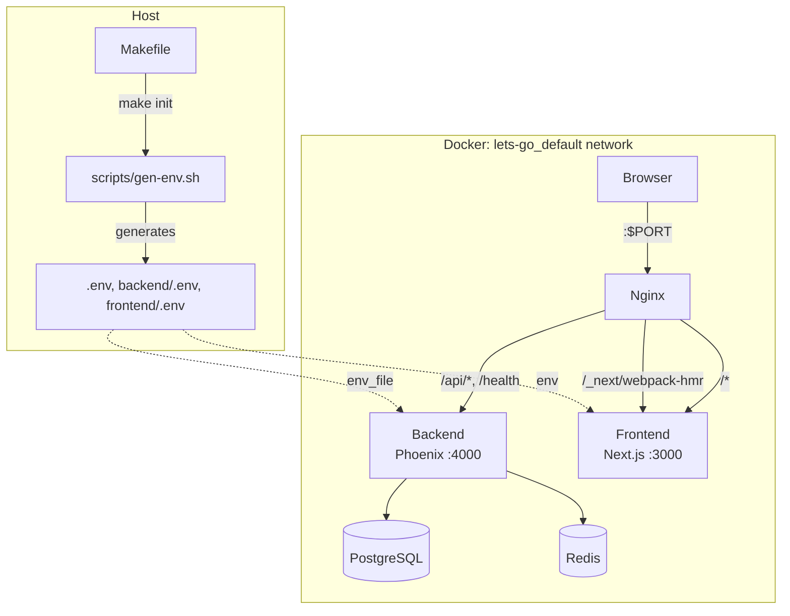

# Architecture — start-app

Reusable starter template for portfolio projects. Three Docker containers — **Next.js frontend**, **Phoenix API backend**, **nginx reverse proxy** — sharing a common Docker network with external Postgres and Redis. Designed to be scaffolded into `projects/{domain}/app/`, where the Makefile auto-derives project identity from the parent directory name (the domain).

## System Diagram

## Core Components

| Component | Purpose |
|-----------|---------|
| **nginx** | Reverse proxy — routes `/api/*` to backend, everything else to frontend |
| **backend** | Phoenix 1.8 JSON API — JWT auth, Postgres (PostGIS/pgvector), Redis |
| **frontend** | Next.js 15 App Router — YAML-driven design system, auth UI, styleguide viewer |
| **Makefile** | Build orchestration — image builds, lifecycle commands, project identity derivation |
| **docker-compose.yaml** | Service definitions — connects to external `lets-go_default` network |
| **scripts/gen-env.sh** | Secret generation — creates `.env` files with unique keys per project |

## Request Routing

Nginx listens on the host-mapped `$PORT` (default 8080) and dispatches:

| Pattern | Destination | Notes |
|---------|-------------|-------|
| `/api/*` | backend:4000 | Phoenix JSON API |
| `/health` | backend:4000 | Health check endpoint |
| `/_next/webpack-hmr` | frontend:3000 | WebSocket upgrade for HMR |
| `/*` | frontend:3000 | Next.js pages and static assets |

Backend and frontend resolve at request time (not startup) to tolerate slow container boots.

## Network Architecture

All three containers join the **external** `lets-go_default` Docker network. Shared infrastructure (Postgres, Redis) runs on this same network, managed outside this project. Each portfolio project gets its own database, Redis DB number, and slug — isolated but sharing the same infrastructure.

## Project Identity System

The Makefile contains lookup maps that derive project-specific values from the domain name:

| Derived Value | Source | Example (`bladeofeternity.com`) |
|---------------|--------|---------------------------------|
| `PROJECT_SLUG` | `SLUG_MAP` | `boe` |
| `DB_NAME` | directory name → underscores | `bladeofeternity_com_dev` |
| `REDIS_DB` | `REDIS_DB_MAP` | `0` |
| Image tags | `$REGISTRY/$PROJECT_DIR/{service}:$TAG` | `ops.noizu.com/bladeofeternity.com/backend:latest` |

**Directory detection:** When the Makefile is inside `app/` (the scaffold convention), `PROJECT_DIR` resolves from the parent directory — e.g., `projects/bladeofeternity.com/app/` → `bladeofeternity.com`. When the template directory is named `start-app` (not a real project), it falls back to slug `starter` and Redis DB `0`.

## Authentication

JWT-based, split across both services:

- **Backend**: Guardian issues access (1h) + refresh (7d) tokens. Endpoints at `/api/v1/auth/*`.
- **Frontend**: `AuthProvider` context stores tokens in `localStorage`, `api.ts` auto-attaches Bearer header.

→ *See [backend/docs/PROJ-ARCH.md](../backend/docs/PROJ-ARCH.md) and [frontend/docs/PROJ-ARCH.md](../frontend/docs/PROJ-ARCH.md) for per-service details*

## Design System

YAML theme configs in `frontend/src/config/theme-style-guide/` define the full visual language. At build time, the `@the-robot-lives/styleguide` package compiles them into generated CSS. Tailwind v4 bridges the CSS variables via `@theme`.

→ *See [frontend/docs/arch/design-system.md](../frontend/docs/arch/design-system.md) for details*

## Deployment

Multi-stage Dockerfiles for each service:

| Service | Base | Output |
|---------|------|--------|
| Backend | `elixir:1.19.5-otp-28-slim` | OTP release, runs as `nobody` |
| Frontend | `node:22-alpine` | Standalone Next.js server |
| Nginx | `nginx:alpine` | Static config, reverse proxy |

`make build-push` builds multi-arch (`amd64` + `arm64`) images and pushes to the project registry.

## Technology Stack

| Layer | Choice |
|-------|--------|
| Frontend | Next.js 15, React 19, Tailwind v4 |
| Backend | Elixir 1.19, Phoenix 1.8, Bandit |
| Database | PostgreSQL (PostGIS, pgvector) |
| Cache | Redis (Redix) |
| Auth | Guardian JWT + bcrypt |
| Proxy | Nginx |
| Container | Docker, docker-compose |
| Registry | `ops.noizu.com` (self-hosted) |
| Build | Make + shell scripts |

## Scaffold Flow — `init-proj-scaffold`

`bin/init-proj-scaffold <domain> <slug> <Module>` automates project creation from the start-app template: tarballs the template, extracts to `projects/<domain>/app/`, hydrates all Starter/starter references to the project's names, and registers DB + Redis entries. Idempotent and safe to re-run.

→ *See [arch/scaffold-flow.md](arch/scaffold-flow.md) for name derivation, hydration rules, and infrastructure registration details*

## Agent Workflow — Post-Scaffold Setup

Four-phase sequence to bring a scaffolded project to a running state: Design (theme YAML iteration via styleguide engine), Backend (contexts, migrations, controllers extending the auth scaffold), Frontend (pages and API wiring), Deploy (`make build && make run`).

→ *See [arch/agent-workflow.md](arch/agent-workflow.md) for the full phase breakdown, mermaid diagram, and file system layout*

## Kubernetes Deployment

A Helm chart at `helm/derobotis/` deploys the three-container stack to the K8s cluster. Includes deployment, service, ingress, TLS secret, and a migrate job. Deployed via the parent repo's `utils/helm-upgrade` orchestrator or standalone `helm upgrade --install`.

## Key Decisions

- **Three-container split**: Frontend and backend deploy independently; nginx decouples routing from app logic
- **External shared network**: All portfolio projects share Postgres/Redis infra, isolated by DB name and Redis DB number
- **Directory-name-driven identity**: Makefile derives project name from the parent directory when inside `app/` — no config files to edit
- **No docker-compose build**: Images built via `make build` (buildx), compose only runs pre-built images
- **Secret generation at init time**: `make init` creates all `.env` files with random keys — no checked-in secrets
- **Single-command scaffolding**: `init-proj-scaffold` handles tarball, hydration, file renames, and DB/Redis registration in one step — no manual find-and-replace
- **Tarball caching**: The template tarball auto-rebuilds only when source files are newer, avoiding redundant work
- **Idempotent registration**: DB and Redis entries are checked before appending — safe to re-run
