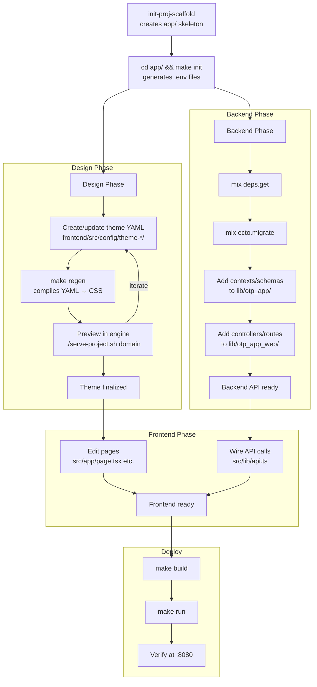

# Agent Workflow — Post-Scaffold Setup

After `init-proj-scaffold` creates the app skeleton inside `projects/{domain}/app/`, an AI agent (or human) follows this sequence to bring the project to a running state with a customized design:



## Phase 1: Design System Setup

The scaffold includes a base `theme-style-guide/` config. An agent customizes it:

1. **Theme YAML directory** — `app/frontend/src/config/theme-{slug}/` contains YAML files that define the visual language: colors, typography, spacing, borders, shadows, semantic tokens.

2. **Regenerate CSS** — `cd app && make regen` runs the `@the-robot-lives/styleguide` CSS generator. This compiles all theme YAML into `app/frontend/src/app/design-system.generated.css`.

3. **Preview in engine** — From the repo root, `./serve-project.sh {domain}` symlinks the project's themes into the styleguide-engine and starts a dev server with the full interactive style guide viewer.

4. **Iterate** — Modify YAML, re-run `make regen`, refresh the engine. The engine shows 20+ showcases (typography, colors, spacing, buttons, cards, forms, etc.) so the agent can validate the design system before touching any page code.

5. **Update sitemap page** — Edit `app/frontend/src/app/sitemap/page.tsx` to reflect the project's actual information architecture (from `design/SITEMAP.md`). Mermaid.js renders the diagrams.

## Phase 2: Backend Customization

The scaffold includes user auth (Guardian JWT), accounts context, and health check. An agent extends it:

1. **Add contexts** — New business logic goes in `lib/{otp_app}/` as Ecto schemas + context modules (e.g., `lib/{otp_app}/products.ex`).

2. **Add migrations** — `mix ecto.gen.migration add_products` creates timestamped migrations in `priv/repo/migrations/`.

3. **Add controllers** — API endpoints go in `lib/{otp_app}_web/controllers/`. The router (`lib/{otp_app}_web/router.ex`) already has authenticated and public pipeline scopes.

4. **Add seeds** — `priv/repo/seeds/dev-seeds.exs` for development data.

## Phase 3: Frontend Customization

1. **Edit pages** — `src/app/page.tsx` (landing), `src/app/styleguide/page.tsx` (viewer). The styleguide page imports components from `@the-robot-lives/styleguide`.

2. **Wire API calls** — `src/lib/api.ts` provides a configured fetch wrapper with auth token injection. Add new API functions here.

3. **Add pages** — New routes as `src/app/{route}/page.tsx` (Next.js App Router convention).

## Phase 4: Docker Build & Run

```bash
make build    # Builds backend, frontend, nginx images
make run      # docker compose up -d → nginx on :8080
make logs     # Tail all container logs
```

## File System After Full Setup

```
projects/{domain}/
├── README.md                     # project identity, value prop, status
├── design/                       # style guides, SITEMAP.md (created before scaffold)
├── docs/                         # project documentation
└── app/                          # ← scaffold output (init-proj-scaffold)
    ├── Makefile
    ├── docker-compose.yaml
    ├── .env                          # generated by make init
    ├── scripts/gen-env.sh
    ├── frontend/
    │   ├── .env                      # generated
    │   ├── package.json              # {slug}-frontend
    │   ├── postcss.config.mjs        # Tailwind v4 via @tailwindcss/postcss
    │   ├── src/
    │   │   ├── app/
    │   │   │   ├── globals.css       # @import tailwindcss + design-system.generated.css
    │   │   │   ├── design-system.generated.css  # compiled from YAML themes
    │   │   │   ├── layout.tsx
    │   │   │   ├── page.tsx          # landing page
    │   │   │   ├── styleguide/page.tsx
    │   │   │   └── sitemap/page.tsx
    │   │   ├── config/
    │   │   │   ├── theme-style-guide/  # base theme YAML (always present)
    │   │   │   └── theme-{slug}/      # project-specific theme YAML (added by agent)
    │   │   └── scripts/generate-css.ts
    │   └── node_modules/@the-robot-lives/styleguide/
    ├── backend/
    │   ├── .env                      # generated
    │   ├── mix.exs                   # app: :{otp_app}
    │   ├── config/
    │   │   ├── config.exs            # :{otp_app}, {Module}.*
    │   │   ├── dev.exs
    │   │   ├── runtime.exs
    │   │   └── test.exs
    │   ├── lib/
    │   │   ├── {otp_app}.ex          # root module
    │   │   ├── {otp_app}_web.ex      # web module
    │   │   ├── {otp_app}/            # contexts (accounts, etc.)
    │   │   ├── {otp_app}_web/        # controllers, router, endpoint, plugs
    │   │   └── supports/types.ex
    │   ├── priv/repo/
    │   │   ├── migrations/
    │   │   └── seeds/
    │   └── Dockerfile                # rel/{otp_app}, bin/{otp_app}
    └── nginx/
        ├── nginx.conf
        └── Dockerfile
```
