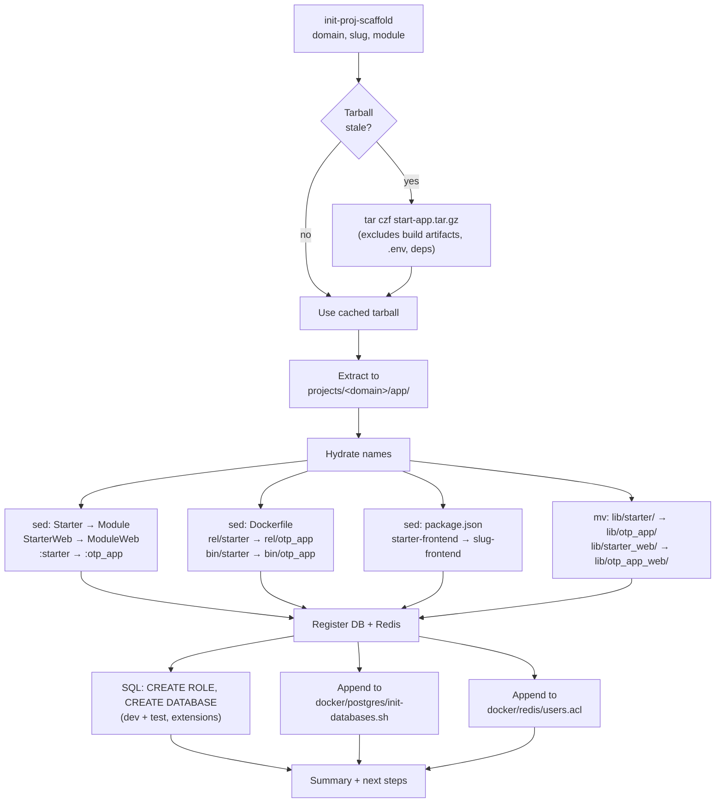

# Scaffold Flow — `init-proj-scaffold`

The `bin/init-proj-scaffold` script automates the full lifecycle of creating a new project from this template. It is the primary entry point for both human operators and AI agents.

## Usage

```bash
init-proj-scaffold <project_dir> <slug> <elixir_module>
# Example: init-proj-scaffold derobot.is derobot Derobot
```

`bin/` is on PATH via `.envrc`, so the command is callable without a path prefix. The project root directory (`projects/{domain}/`) is expected to already exist with design artifacts (README.md, design/, docs/). The script creates the `app/` subdirectory inside it.

## Scaffold Pipeline



## Name Derivation

The script takes three inputs and derives everything else:

| Input | Example |
|-------|---------|
| `project_dir` | `derobot.is` |
| `slug` | `derobot` |
| `elixir_module` | `Derobot` |

| Derived | Rule | Result |
|---------|------|--------|
| `otp_app` | PascalCase → snake_case | `derobot` |
| `otp_app_web` | `{otp_app}_web` | `derobot_web` |
| `web_module` | `{module}Web` | `DerobotWeb` |
| `db_name` | dir with `.`/`-` → `_` + `_dev` | `derobot_is_dev` |
| `db_name_test` | same but `_test` | `derobot_is_test` |
| `frontend_name` | `{slug}-frontend` | `derobot-frontend` |

## Hydration Rules (ordered longest-first)

| Target Files | From | To |
|---|---|---|
| `*.ex`, `*.exs` | `StarterWeb` | `{module}Web` |
| `*.ex`, `*.exs` | `Starter` | `{module}` |
| `*.ex`, `*.exs` | `:starter` | `:{otp_app}` |
| `*.ex`, `*.exs` | `"starter"` | `"{otp_app}"` |
| `*.ex`, `*.exs` | `starter_dev` | `{slug}_dev` |
| `Dockerfile` | `rel/starter`, `bin/starter` | `rel/{otp_app}`, `bin/{otp_app}` |
| `package.json` | `starter-frontend` | `{slug}-frontend` |

## Infrastructure Registration

The script modifies two shared files and optionally runs SQL against a live database:

| File | Change |
|------|--------|
| `docker/postgres/init-databases.sh` | Appends `dev` + `test` entries to `PROJECTS` array |
| `docker/redis/users.acl` | Appends `user {slug} on >{slug}_dev ~{slug}:* &* +@all` |
| Live Postgres (if running) | `CREATE ROLE`, `CREATE DATABASE` (×2), extensions (timescaledb, age) |

This ensures DB/Redis are available immediately and will also be created on future clean `docker compose up` events.
