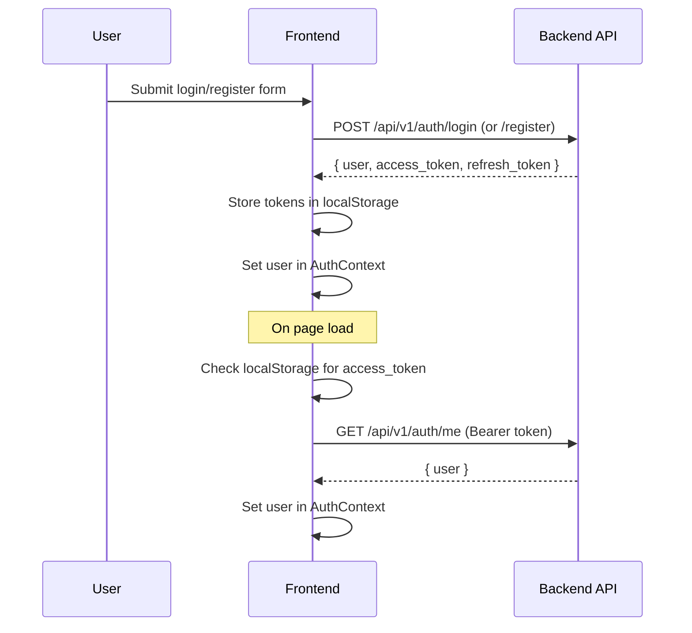

# Authentication Architecture

## Flow

## Token Storage

- `access_token` and `refresh_token` stored in `localStorage`
- `api.ts` auto-attaches `Authorization: Bearer <token>` to all requests
- On auth failure, tokens are cleared and user is set to `null`

## API Endpoints

| Method | Path | Purpose |
|--------|------|---------|
| POST | `/api/v1/auth/register` | Create account → returns tokens + user |
| POST | `/api/v1/auth/login` | Authenticate → returns tokens + user |
| POST | `/api/v1/auth/refresh` | Exchange refresh token → new access token |
| GET | `/api/v1/auth/me` | Fetch current user (requires Bearer token) |

## Request Body Shapes

- **Register**: `{ user: { email, password } }`
- **Login**: `{ email, password }`
- **Refresh**: `{ refresh_token }`

## Components

- **`AuthProvider`** (`src/context/auth.tsx`) — wraps app, provides `useAuth()` hook
- **`Navbar`** (`src/components/navbar.tsx`) — shows login/signup or user email + logout
- **Login/Signup pages** — form pages that call `useAuth().login()` / `register()`, redirect to `/` on success
