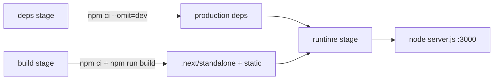

# Deployment Architecture

## Docker Multi-Stage Build

### Stages

1. **deps** — Install production dependencies only (used if needed for runtime)
2. **build** — Full install + `npm run build` (generate-css then next build)
3. **runtime** — Minimal Node 22 Alpine image with standalone output

### Build Secrets

The `@the-robot-lives/styleguide` package is hosted on GitHub Packages (private). The Dockerfile:

1. Copies `.npmrc.template` (contains `${GITHUB_TOKEN}` placeholder)
2. Uses `--mount=type=secret,id=github_token` to inject the token
3. Runs `envsubst` to produce `.npmrc` at build time
4. Deletes `.npmrc` after install

### Runtime Config

| Env Var | Purpose |
|---------|---------|
| `NEXT_PUBLIC_API_URL` | Backend API base URL (baked in at build time) |
| `NODE_ENV` | Set to `production` |
| `PORT` | `3000` |

### Health Check

`wget -qO- http://localhost:3000/` every 15s, 3s timeout, 3 retries, 10s startup grace.

### Output

Next.js `standalone` output mode — produces a self-contained `server.js` with only the required `node_modules` files. No full `node_modules` in the runtime image.
