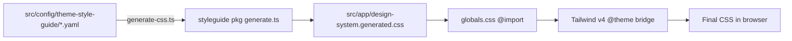

# Design System Pipeline

## Overview

The visual language is defined entirely in YAML and compiled to CSS at build time. The YAML format minimizes the tokens and context an AI agent needs to create or modify a style guide, while remaining portable across portfolio projects.

## Pipeline



## YAML Config Files

All live in `src/config/theme-style-guide/`:

| File | Defines |
|------|---------|
| `branding.yaml` | Brand identity tokens |
| `style-guide.meta.yaml` | Theme metadata (name, version) |
| `style-guide.vars.yaml` | CSS custom property definitions |
| `style-guide.scoped-vars.yaml` | Component-scoped variables |
| `style-guide.color-palette.yaml` | Color palette |
| `style-guide.color-modes.yaml` | Light/dark mode mappings |
| `style-guide.typography.yaml` | Font stacks, sizes, weights |
| `style-guide.globals.yaml` | Global CSS rules |
| `style-guide.semantic-classes.yaml` | Semantic utility classes |
| `style-guide.semantic-groups.yaml` | Grouped semantic tokens |
| `style-guide.css-snippets.yaml` | Reusable CSS snippets |
| `style-guide.glyphs.yaml` | Icon/glyph definitions |
| `style-guide.design-sections.yaml` | Design section showcases |
| `style-guide.page-layouts.yaml` | Page layout templates |
| `style-guide.page-sections.yaml` | Page section patterns |
| `style-guide.shell-layouts.yaml` | App shell layout definitions |

## generate-css.ts

The script (`src/scripts/generate-css.ts`) delegates to the `@the-robot-lives/styleguide` package's `generate.ts`, passing three env vars:

- `STYLEGUIDE_CONFIG_ROOT` → `src/config/`
- `STYLEGUIDE_OUTPUT` → `src/app/design-system.generated.css`
- `STYLEGUIDE_THEME_DIR` → `public/themes/`

## Tailwind Bridge

`globals.css` maps generated CSS custom properties to Tailwind theme tokens via `@theme`:

```css
@theme {
  --color-surface: var(--surface);
  --color-text: var(--text);
  /* ...etc */
}
```

This lets you use `bg-surface`, `text-text-muted`, etc. as Tailwind utilities while the actual values come from YAML.

## Dark Mode

Uses class-based toggling (`.dark` class) with Tailwind's `@variant dark` configured in `globals.css`.
