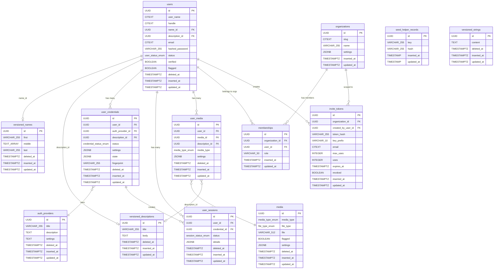
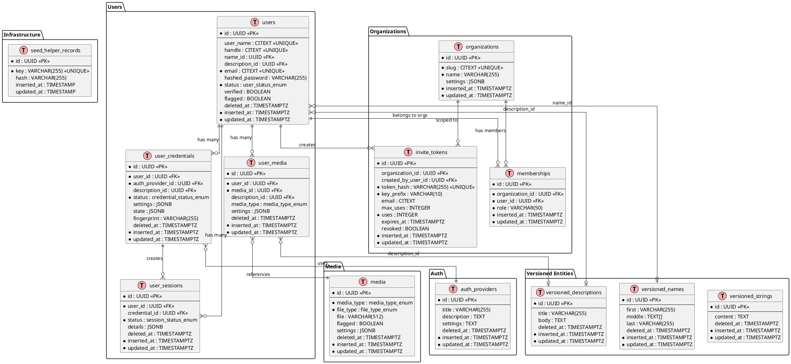

# Database Schema — start-app

Schema for the start-app scaffold. Managed by Liquibase YAML changelogs (`backend/db/changelog/`). All tables use UUID primary keys and `timestamptz` timestamps with `now()` defaults.

## Extensions

| Extension | Purpose |
|-----------|---------|
| citext | Case-insensitive text (emails, usernames, slugs) |
| uuid-ossp | UUID generation |
| postgis | Geospatial queries |
| vector | pgvector embeddings |
| cube | Multi-dimensional indexing (used by earthdistance) |
| pg_trgm | Trigram similarity search |
| earthdistance | Geographic distance calculations |

## Enum Types

| Enum | Values |
|------|--------|
| `status_enum` | active, disabled, suspended, deleted, other |
| `user_status_enum` | active, unverified, waitlist, suspended, deleted, other |
| `credential_status_enum` | active, disabled, suspended, deleted, other |
| `session_status_enum` | active, revoked, disabled, suspended, deleted, other |
| `media_type_enum` | image, video, audio, document, other |
| `file_type_enum` | jpg, jpeg, png, gif, webp, svg, bmp, ico, tiff, mp4, avi, mov, webm, mp3, wav, ogg, pdf, doc, other |
| `owner_type_enum` | user, organization, other |
| `credential_type_enum` | login, oauth, smart_link, other |
| `device_type_enum` | web, ios, android, other |

## ERD — Mermaid

## ERD — PlantUML

## Table Details

### Infrastructure

#### seed_helper_records

Tracks idempotent seed execution by key + content hash.

| Column | Type | Nullable | Default | Description |
|--------|------|----------|---------|-------------|
| id | UUID | No | — | Primary key |
| key | VARCHAR(255) | No | — | Unique seed identifier |
| hash | VARCHAR(255) | Yes | — | Content hash for change detection |
| inserted_at | TIMESTAMP | Yes | — | Created timestamp |
| updated_at | TIMESTAMP | Yes | — | Modified timestamp |

**Constraints**: UNIQUE(key)

### Versioned Entities

Immutable-style records for user profile data. Soft-deletable via `deleted_at`.

#### versioned_strings

| Column | Type | Nullable | Default |
|--------|------|----------|---------|
| id | UUID | No | gen_random_uuid() |
| content | TEXT | Yes | — |
| deleted_at | TIMESTAMPTZ | Yes | — |
| inserted_at | TIMESTAMPTZ | No | now() |
| updated_at | TIMESTAMPTZ | No | now() |

#### versioned_names

| Column | Type | Nullable | Default |
|--------|------|----------|---------|
| id | UUID | No | gen_random_uuid() |
| first | VARCHAR(255) | Yes | — |
| middle | TEXT[] | Yes | '{}' |
| last | VARCHAR(255) | Yes | — |
| deleted_at | TIMESTAMPTZ | Yes | — |
| inserted_at | TIMESTAMPTZ | No | now() |
| updated_at | TIMESTAMPTZ | No | now() |

#### versioned_descriptions

| Column | Type | Nullable | Default |
|--------|------|----------|---------|
| id | UUID | No | gen_random_uuid() |
| title | VARCHAR(255) | Yes | — |
| body | TEXT | Yes | — |
| deleted_at | TIMESTAMPTZ | Yes | — |
| inserted_at | TIMESTAMPTZ | No | now() |
| updated_at | TIMESTAMPTZ | No | now() |

### Auth

#### auth_providers

Registry of authentication providers (login, OAuth, SSO). Seeded at startup.

| Column | Type | Nullable | Default |
|--------|------|----------|---------|
| id | UUID | No | gen_random_uuid() |
| title | VARCHAR(255) | Yes | — |
| description | TEXT | Yes | — |
| settings | TEXT | Yes | — |
| deleted_at | TIMESTAMPTZ | Yes | — |
| inserted_at | TIMESTAMPTZ | No | — |
| updated_at | TIMESTAMPTZ | No | — |

### Media

#### media

Uploaded file metadata. Linked to users via `user_media`.

| Column | Type | Nullable | Default |
|--------|------|----------|---------|
| id | UUID | No | gen_random_uuid() |
| media_type | media_type_enum | No | — |
| file_type | file_type_enum | No | — |
| file | VARCHAR(512) | Yes | — |
| flagged | BOOLEAN | Yes | false |
| settings | JSONB | Yes | — |
| deleted_at | TIMESTAMPTZ | Yes | — |
| inserted_at | TIMESTAMPTZ | No | — |
| updated_at | TIMESTAMPTZ | No | — |

### Users

#### users

| Column | Type | Nullable | Default |
|--------|------|----------|---------|
| id | UUID | No | gen_random_uuid() |
| user_name | CITEXT | Yes | — |
| handle | CITEXT | Yes | — |
| name_id | UUID | Yes | — |
| description_id | UUID | Yes | — |
| email | CITEXT | No | — |
| hashed_password | VARCHAR(255) | Yes | — |
| status | user_status_enum | No | 'active' |
| verified | BOOLEAN | Yes | false |
| flagged | BOOLEAN | Yes | false |
| deleted_at | TIMESTAMPTZ | Yes | — |
| inserted_at | TIMESTAMPTZ | No | — |
| updated_at | TIMESTAMPTZ | No | — |

**Indexes**: idx_users_email (email, UNIQUE), idx_users_user_name (user_name, UNIQUE), idx_users_handle (handle, UNIQUE)
**FKs**: name_id → versioned_names(id), description_id → versioned_descriptions(id)

#### user_media

| Column | Type | Nullable | Default |
|--------|------|----------|---------|
| id | UUID | No | gen_random_uuid() |
| user_id | UUID | No | — |
| media_id | UUID | No | — |
| description_id | UUID | Yes | — |
| media_type | media_type_enum | Yes | — |
| settings | JSONB | Yes | — |
| deleted_at | TIMESTAMPTZ | Yes | — |
| inserted_at | TIMESTAMPTZ | No | — |
| updated_at | TIMESTAMPTZ | No | — |

**Indexes**: idx_user_media_user_id (user_id)
**FKs**: user_id → users(id), media_id → media(id), description_id → versioned_descriptions(id)

#### user_credentials

| Column | Type | Nullable | Default |
|--------|------|----------|---------|
| id | UUID | No | gen_random_uuid() |
| user_id | UUID | No | — |
| auth_provider_id | UUID | No | — |
| description_id | UUID | Yes | — |
| status | credential_status_enum | No | 'active' |
| settings | JSONB | Yes | — |
| state | JSONB | Yes | — |
| fingerprint | VARCHAR(255) | Yes | — |
| deleted_at | TIMESTAMPTZ | Yes | — |
| inserted_at | TIMESTAMPTZ | No | — |
| updated_at | TIMESTAMPTZ | No | — |

**Indexes**: idx_user_credentials_user_provider (user_id, auth_provider_id)
**FKs**: user_id → users(id), auth_provider_id → auth_providers(id), description_id → versioned_descriptions(id)

#### user_sessions

| Column | Type | Nullable | Default |
|--------|------|----------|---------|
| id | UUID | No | gen_random_uuid() |
| user_id | UUID | No | — |
| credential_id | UUID | Yes | — |
| status | session_status_enum | No | 'active' |
| details | JSONB | Yes | — |
| deleted_at | TIMESTAMPTZ | Yes | — |
| inserted_at | TIMESTAMPTZ | No | — |
| updated_at | TIMESTAMPTZ | No | — |

**Indexes**: idx_user_sessions_user_id (user_id)
**FKs**: user_id → users(id), credential_id → user_credentials(id)

### Organizations

#### organizations

| Column | Type | Nullable | Default |
|--------|------|----------|---------|
| id | UUID | No | gen_random_uuid() |
| slug | CITEXT | No | — |
| name | VARCHAR(255) | No | — |
| settings | JSONB | Yes | '{}' |
| inserted_at | TIMESTAMPTZ | No | — |
| updated_at | TIMESTAMPTZ | No | — |

**Constraints**: UNIQUE(slug)

#### memberships

| Column | Type | Nullable | Default |
|--------|------|----------|---------|
| id | UUID | No | gen_random_uuid() |
| organization_id | UUID | No | — |
| user_id | UUID | No | — |
| role | VARCHAR(50) | No | 'viewer' |
| inserted_at | TIMESTAMPTZ | No | — |
| updated_at | TIMESTAMPTZ | No | — |

**Constraints**: uq_memberships_org_user (organization_id, user_id) — one membership per user per org
**FKs**: organization_id → organizations(id), user_id → users(id)

#### invite_tokens

| Column | Type | Nullable | Default |
|--------|------|----------|---------|
| id | UUID | No | gen_random_uuid() |
| organization_id | UUID | Yes | — |
| created_by_user_id | UUID | Yes | — |
| token_hash | VARCHAR(255) | No | — |
| key_prefix | VARCHAR(10) | No | — |
| email | CITEXT | Yes | — |
| max_uses | INTEGER | Yes | — |
| uses | INTEGER | No | 0 |
| expires_at | TIMESTAMPTZ | Yes | — |
| revoked | BOOLEAN | Yes | false |
| inserted_at | TIMESTAMPTZ | No | — |
| updated_at | TIMESTAMPTZ | No | — |

**Indexes**: idx_invite_tokens_key_prefix (key_prefix), idx_invite_tokens_token_hash (token_hash, UNIQUE)
**FKs**: organization_id → organizations(id), created_by_user_id → users(id)

## Changeset Reference

| Changeset | File | Tables/Objects |
|-----------|------|----------------|
| 000 | extensions | citext, uuid-ossp, postgis, vector, cube, pg_trgm, earthdistance |
| 001 | enums | 9 enum types |
| 002 | seed-helper | seed_helper_records |
| 003 | versioned-entities | versioned_strings, versioned_names, versioned_descriptions |
| 004 | auth-providers | auth_providers |
| 005 | media | media |
| 006 | users | users + 3 indexes |
| 007 | user-media | user_media + 1 index |
| 008 | credentials-sessions | user_credentials + 1 index, user_sessions + 1 index |
| 009 | organizations | organizations, memberships + unique constraint |
| 010 | invite-tokens | invite_tokens + 2 indexes |
