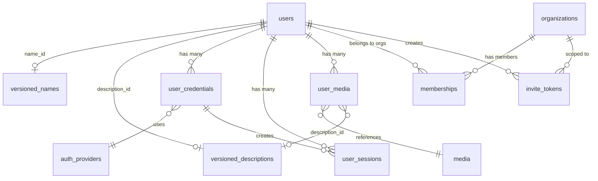

# Database Schema Summary — start-app

12 tables across 6 domains. All tables use UUID PKs and TIMESTAMPTZ timestamps. Managed by Liquibase YAML changelogs (000–010).

## Extensions

citext, uuid-ossp, postgis, vector, cube, pg_trgm, earthdistance

## Enum Types

status_enum, user_status_enum, credential_status_enum, session_status_enum, media_type_enum, file_type_enum, owner_type_enum, credential_type_enum, device_type_enum

## Tables

| Table | Domain | Columns | Key Relationships |
|-------|--------|---------|-------------------|
| seed_helper_records | Infrastructure | 5 | — |
| versioned_strings | Versioned | 5 | — |
| versioned_names | Versioned | 7 | — |
| versioned_descriptions | Versioned | 6 | — |
| auth_providers | Auth | 7 | — |
| media | Media | 9 | — |
| users | Users | 13 | → versioned_names, versioned_descriptions |
| user_media | Users | 9 | → users, media, versioned_descriptions |
| user_credentials | Users | 11 | → users, auth_providers |
| user_sessions | Users | 8 | → users, user_credentials |
| organizations | Orgs | 6 | — |
| memberships | Orgs | 6 | → organizations, users |
| invite_tokens | Orgs | 12 | → organizations, users |

## ERD

## Changeset Reference

| # | Name | Creates |
|---|------|---------|
| 000 | extensions | 7 PG extensions |
| 001 | enums | 9 enum types |
| 002 | seed-helper | seed_helper_records |
| 003 | versioned-entities | versioned_strings, versioned_names, versioned_descriptions |
| 004 | auth-providers | auth_providers |
| 005 | media | media |
| 006 | users | users + indexes |
| 007 | user-media | user_media + index |
| 008 | credentials-sessions | user_credentials, user_sessions + indexes |
| 009 | organizations | organizations, memberships + unique constraint |
| 010 | invite-tokens | invite_tokens + indexes |
