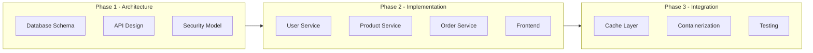
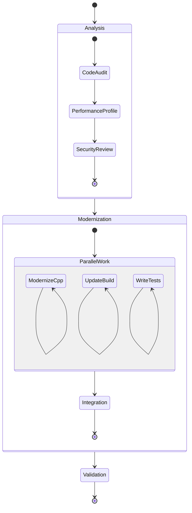

# Project Coordinator Test Suite

## Test Case 1: Complex Software Development Project

### Input
```
@project-coordinator orchestrate "Develop a microservices e-commerce platform with React frontend, Node.js backend, PostgreSQL database, Redis cache, Docker deployment, and comprehensive testing"
```

### Expected Decomposition
- Database Architecture → @npl-sql-architect
- API Gateway Design → @npl-system-analyzer + @codex
- Microservice Development → @aider (parallel across services)
- Frontend Components → @npl-templater + @gemini
- Caching Strategy → @npl-perf-profiler
- Docker Configuration → @npl-build-master
- Security Implementation → @npl-threat-modeler
- Testing Framework → @npl-tdd-builder + @npl-qa-tester
- Documentation → @npl-technical-writer

### Expected Parallel Workflows


### Validation Criteria
- All components have assigned agents
- Parallel execution maximized within phases
- Dependencies correctly mapped
- Quality gates between phases

---

## Test Case 2: Multi-Modal Content Marketing Campaign

### Input
```
@project-coordinator decompose "Create integrated marketing campaign for product launch including landing page, video content, blog series, email sequences, and social media strategy"
```

### Expected Task Distribution
```yaml
parallel_threads:
  thread_A:
    - task: "Landing Page Copy"
      agent: "@npl-marketing-writer"
    - task: "Page Design Brief"
      agent: "@gemini"

  thread_B:
    - task: "Video Script"
      agent: "@npl-marketing-writer"
    - task: "Storyboard Creation"
      agent: "@claude"

  thread_C:
    - task: "Blog Content Series"
      agent: "@npl-technical-writer"
    - task: "SEO Optimization"
      agent: "@gpt-4"

  thread_D:
    - task: "Email Sequences"
      agent: "@npl-templater"
    - task: "A/B Test Variants"
      agent: "@npl-grader"

  thread_E:
    - task: "Social Media Posts"
      agent: "@npl-persona"
    - task: "Hashtag Research"
      agent: "@gopher-scout"

synthesis:
  coordinator: "@npl-marketing-writer"
  validator: "@npl-grader"
```

### Expected Outputs
- Gantt chart showing parallel execution
- Individual agent prompts with context
- Synthesis strategy for coherent campaign
- Quality checkpoints for brand consistency

---

## Test Case 3: Complex Data Analysis Pipeline

### Input
```
@project-coordinator orchestrate "Analyze 1TB of customer data to identify patterns, segment users, predict churn, generate visualizations, and create executive report"
```

### Expected Pipeline Design
```
1. Data Ingestion (Parallel)
   - Chunk 1-250GB → @codex
   - Chunk 251-500GB → @codex
   - Chunk 501-750GB → @codex
   - Chunk 751-1TB → @codex

2. Pattern Analysis (Parallel)
   - Statistical Analysis → @gemini
   - ML Model Training → @claude
   - Anomaly Detection → @npl-system-analyzer

3. Segmentation (Sequential)
   - Clustering → @npl-sql-architect
   - Validation → @npl-grader

4. Prediction Models (Parallel)
   - Churn Model → @claude
   - LTV Model → @gemini
   - Risk Model → @npl-threat-modeler

5. Visualization (Parallel)
   - Dashboard Design → @npl-templater
   - Chart Generation → @codex

6. Reporting (Sequential)
   - Draft Report → @npl-technical-writer
   - Executive Summary → @npl-marketing-writer
   - Quality Review → @npl-grader
```

### Performance Metrics
- Data processing throughput
- Parallel efficiency ratio
- Quality gate pass rates
- Total execution time vs sequential

---

## Test Case 4: Code Modernization Project

### Input
```
@project-coordinator analyze "Modernize legacy C++ codebase (500k LOC) to C++20 standards with improved performance, updated build system, and comprehensive testing"
```

### Expected Orchestration Plan


### Agent Assignments
- Code Audit → @npl-system-analyzer
- Performance Profiling → @npl-perf-profiler
- Security Review → @npl-threat-modeler
- C++ Modernization → @npl-cpp-modernizer + @aider
- Build System → @npl-build-master
- Test Creation → @npl-tdd-builder
- Integration → @codex
- Validation → @npl-qa-tester + @npl-grader

---

## Test Case 5: Emergency Incident Response

### Input
```
@project-coordinator orchestrate URGENT "Production database corruption detected, need immediate diagnosis, recovery plan, hotfix deployment, and post-mortem report"
```

### Expected Crisis Response
```yaml
immediate_actions: # All parallel, high priority
  - diagnosis:
      agent: "@npl-sql-architect"
      timeout: 5min
      prompt: "URGENT: Analyze corruption in production DB..."

  - impact_assessment:
      agent: "@npl-system-analyzer"
      timeout: 5min
      prompt: "Assess scope of data corruption and affected systems..."

  - backup_verification:
      agent: "@npl-threat-modeler"
      timeout: 3min
      prompt: "Verify backup integrity and recovery options..."

recovery_phase: # Sequential with checkpoints
  - recovery_plan:
      agent: "@claude"
      depends_on: [diagnosis, impact_assessment, backup_verification]

  - hotfix_development:
      agent: "@aider"
      depends_on: recovery_plan

  - testing:
      agent: "@npl-qa-tester"
      depends_on: hotfix_development

  - deployment:
      agent: "@npl-build-master"
      depends_on: testing

post_incident:
  - post_mortem:
      agent: "@npl-technical-writer"
  - lessons_learned:
      agent: "@npl-thinker"
```

### Success Criteria
- Rapid parallel diagnosis (< 10 min)
- Clear recovery sequence
- Quality gates before deployment
- Comprehensive post-mortem

---

## Test Case 6: Interactive Workshop Coordination

### Input
```
@project-coordinator orchestrate "Run interactive workshop to design new feature with stakeholder input, technical feasibility analysis, and prototype generation"
```

### Expected Interactive Flow
```
Phase 1: Stakeholder Input Collection (Parallel)
  → @npl-persona (simulate different stakeholder perspectives)
  → @gpt-qa (process stakeholder questions)
  → @npl-marketing-writer (capture business requirements)

Phase 2: Technical Analysis (Panel Discussion)
  → @npl-panel.group-chat with:
    - @npl-system-analyzer (architecture)
    - @npl-threat-modeler (security)
    - @npl-perf-profiler (performance)

Phase 3: Prototype Generation (Parallel)
  → @npl-templater (UI mockups)
  → @codex (backend prototype)
  → @npl-technical-writer (specification)

Phase 4: Synthesis & Presentation
  → @project-coordinator (synthesize all outputs)
  → @npl-grader (quality assessment)
  → @npl-marketing-writer (stakeholder presentation)
```

### Interaction Points
- Real-time updates as each phase completes
- Ability to adjust based on intermediate results
- Interactive decision points for direction changes

---

## Performance Benchmarks

### Metric Targets
| Metric | Target | Acceptable |
|:-------|:-------|:-----------|
| Decomposition Time | < 30s | < 60s |
| Agent Selection Accuracy | > 90% | > 80% |
| Parallel Efficiency | > 75% | > 60% |
| Quality Gate Pass Rate | > 95% | > 90% |
| Error Recovery Success | > 90% | > 80% |
| Output Synthesis Quality | > 4.5/5 | > 4.0/5 |

### Load Testing Scenarios
1. **High Volume**: 100+ subtasks across 20+ agents
2. **Deep Nesting**: 5+ levels of dependent workflows
3. **Rapid Changes**: Continuous replanning during execution
4. **Mixed Modes**: Combining sync/async/interactive patterns
5. **Failure Cascade**: Multiple simultaneous agent failures

---

## Validation Checklist

For each test case, verify:

- [ ] Task correctly decomposed into atomic subtasks
- [ ] Optimal agents selected based on capabilities
- [ ] Dependencies properly mapped and respected
- [ ] Parallel execution maximized where possible
- [ ] Quality gates established at critical points
- [ ] Error recovery strategies defined
- [ ] Prompts generated are specific and actionable
- [ ] Output synthesis produces coherent result
- [ ] Execution visualization is clear and accurate
- [ ] Performance meets benchmark targets