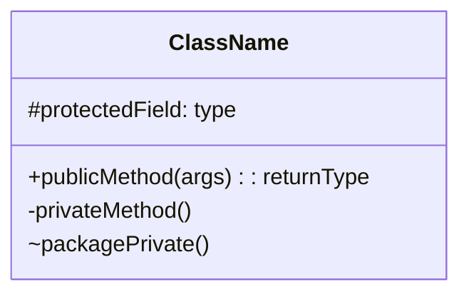
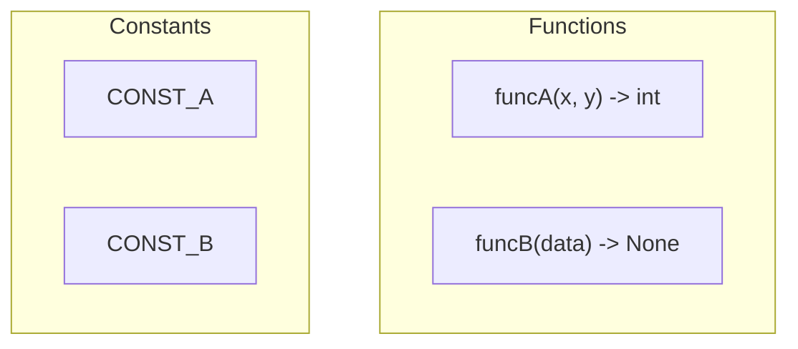
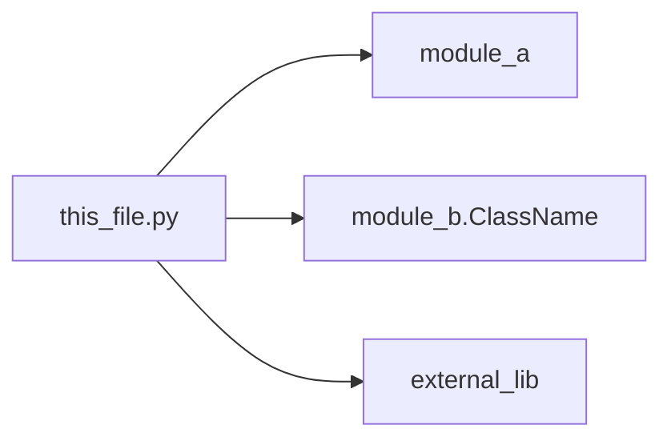
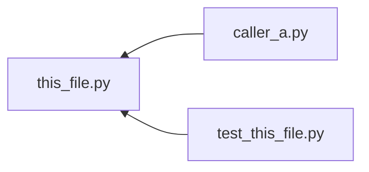
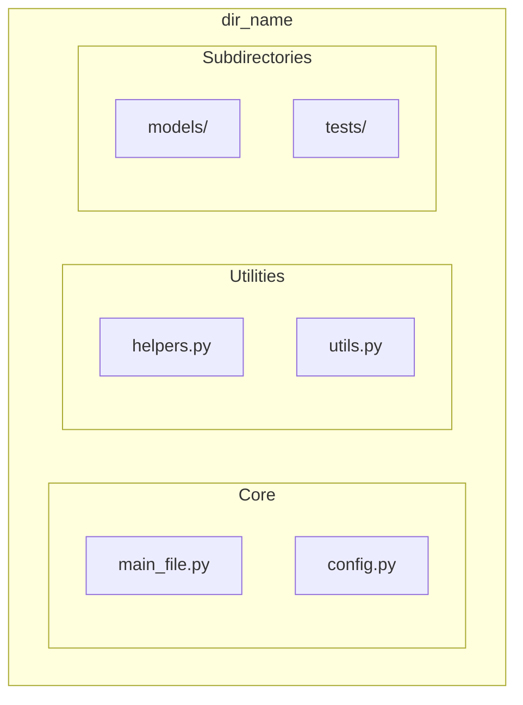
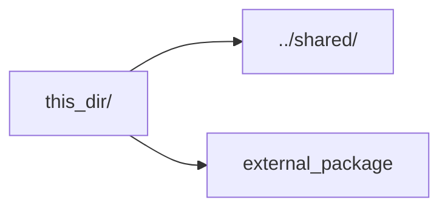
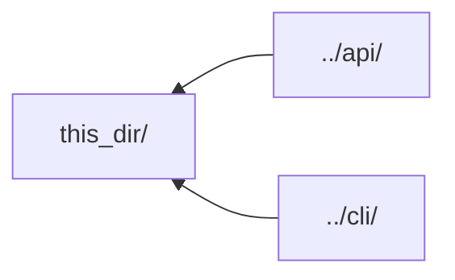
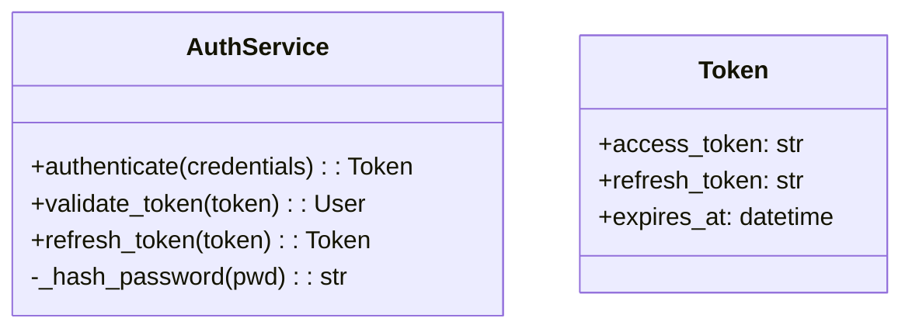
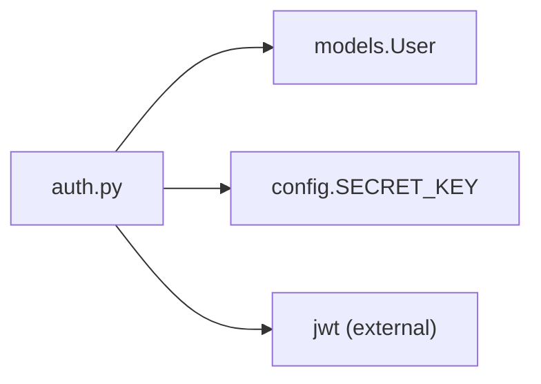
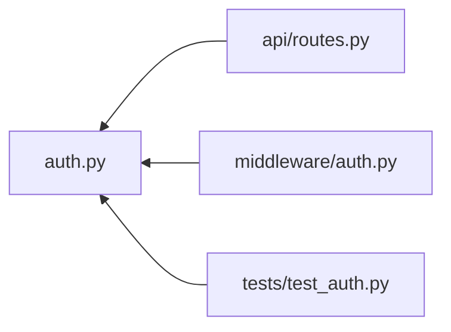

# Metadata Generation Agent Instructions

Generate and update structured metadata files for this project. Follow these conventions precisely. Use sub-agents @npl-technical-writer for prep files in parallel, use git_tree with file type filters to (if specified) file types to prep.
Specify in sub agent prompts to load this definition using `npl_load prompt metadata`

---

## Naming Conventions

| Target Type | Metadata Filename | Location |
|-------------|-------------------|----------|
| File | `.{filename}.meta.md` | Same directory as the source file |
| Directory | `.dir.meta.md` | Inside the target directory |

**Examples:**
- `src/utils.py` → `src/.utils.py.meta.md`
- `src/models/` → `src/models/.dir.meta.md`

---

## File Metadata Template

For each source file, generate a corresponding `.{filename}.meta.md` if not preset otherwise check checksum with yq and if different that stored refresh:

````markdown
file: {filename}
md5: {md5_hash_of_file_contents}
changeset: {git_commit_sha_or_"uncommitted"}
---

# Contents

## Summary
[...| 1-3 sentences: What does this file do? What is its role in the system?]

## Layout


<!-- For non-OOP files, use: -->


## Review
- [ ] TODO: {pending tasks}
- ⚠️ Issue: {bugs, code smells, security concerns}
- 💡 Note: {observations, suggestions, context}

# Links

## Outgoing


## Incoming

````

---

## Directory Metadata Template

For each directory containing source files, generate a `.dir.meta.md`:

````markdown
dir: {directory_name}
changeset: {latest_git_commit_sha_touching_this_dir}
---

# Contents

## Summary
[...| What is this module/package responsible for? How does it fit in the architecture? ]

## Layout


## Review
- [ ] TODO: {module-level tasks}
- ⚠️ Issue: {architectural concerns, missing tests, etc.}
- 💡 Note: {design decisions, conventions used}

# Links

## Outgoing


## Incoming

````

---

## Generation Rules

### 1. Content Analysis
- Parse the file/directory to extract all public interfaces
- Identify imports, dependencies, and consumers (via grep/AST)
- Compute MD5 hash of file contents
- Retrieve current git SHA or mark as `uncommitted`

### 2. Summary Guidelines
- Be concise: 1-3 sentences maximum
- Focus on **purpose** and **role**, not implementation details
- Use active voice: "Handles...", "Provides...", "Manages..."

### 3. Layout Diagrams
- **Classes**: Use `classDiagram` with visibility markers (`+`, `-`, `#`, `~`)
- **Functions**: Use `flowchart` with signature annotations
- **Mixed**: Group by type using subgraphs
- Omit trivial items (e.g., `__init__` unless notable)

### 4. Review Section
- Extract `TODO`, `FIXME`, `HACK`, `XXX` comments from source
- Flag: unused imports, circular dependencies, missing docstrings
- Note: complex logic, magic numbers, potential optimizations

### 5. Link Diagrams
- **Outgoing**: All imports and dependencies (internal and external)
- **Incoming**: Files that import/reference this file (requires codebase search)
- Use meaningful node labels, not just filenames
- Group related links when diagram becomes cluttered

### 6. Mermaid Syntax Rules
- Always use fenced code blocks with `mermaid` language tag
- Escape special characters in labels using quotes: `["label with spaces"]`
- Keep diagrams readable: max ~10-15 nodes per diagram
- Use subgraphs to organize complex structures

---

## Execution Workflow

```
1. SCAN target path (file or directory)
2. IF file:
     - Compute MD5 hash
     - Parse for classes, functions, constants
     - Extract TODOs and issues
     - Trace imports (outgoing links)
     - Search codebase for references (incoming links)
     - Generate .{filename}.meta.md
3. IF directory:
     - List contents (files and subdirs)
     - Aggregate module purpose from child files
     - Map internal structure
     - Trace cross-directory dependencies
     - Prepare file meta data and dir data for all children.
     - Generate .dir.meta.md
4. VALIDATE mermaid syntax renders correctly
5. COMMIT metadata files
```

---

## Example Output

Note it is important to put checksum etc details in a --- deliminated block for yaml extraction.

### Example File: `.auth.py.meta.md`

````markdown
file: auth.py
md5: a3f2b8c9d4e5f6a7b8c9d0e1f2a3b4c5
changeset: 8f4a2b1
---

# Contents

## Summary
Handles user authentication and session management. Provides JWT token generation, validation, and refresh capabilities.

## Layout


## Review
- [ ] TODO: Add rate limiting to authenticate()
- ⚠️ Issue: Token expiry hardcoded to 1 hour
- 💡 Note: Consider extracting Token to separate models file

# Links

## Outgoing


## Incoming

````

---

## Notes

- Regenerate metadata when source files change significantly
- Use `--force` flag to overwrite existing metadata
- Metadata files should be committed to version control
- Consider adding to `.gitignore` if generated in CI only
