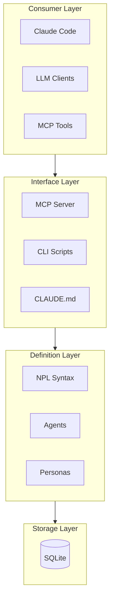

# Initialize Project (Fast)

Bootstrap project documentation with progressive artifact generation and interstitial working files.

**Outputs:** `CLAUDE.md`, `docs/PROJECT-ARCH.md`, `docs/PROJECT-LAYOUT.md`

## Design Philosophy

**no-coordinator**
: Launch scouts directly—no pre-scan, no orchestration overhead

**progressive**
: Generate drafts as scouts report, refine incrementally

**interstitial**
: Working files in `.npl/project-init/` visible during execution, cleaned up at end

**minimal-viable**
: Skeleton docs that can be expanded via `/update-arch` and `/update-layout`

---

## Phase 1: Initialize Environment

Initialize CLAUDE.md and prepare interstitial workspace:

```bash
# Initialize CLAUDE.md with standard NPL prompts
npl-load init-claude

# Load minimal NPL dependencies (skip heavy specs)
npl-load c "syntax,fences,directive" --skip {@npl.def.loaded}

# Create interstitial workspace
mkdir -p .npl/project-init/synthesis
```

### Version Handling

The `init-claude` command uses versioned prompt sections with `npl-instructions:` YAML headers. Behavior depends on existing CLAUDE.md state:

**First-time initialization (no versioned sections):**
- Appends all default prompts automatically
- Exit code 1 (changes made)

**Existing versioned sections:**
- Prints version comparison table (source vs installed)
- Exits without modifying (exit code 2 if updates available, 0 if current)
- User must explicitly choose to update

**Updating outdated sections:**
```bash
# Update specific sections
npl-load init-claude --update npl-conventions,npl-scripts

# Update all outdated/missing sections
npl-load init-claude --update-all

# Preview changes without modifying
npl-load init-claude --update-all --dry-run
```

Write coordination state:

```json
// .npl/project-init/meta.json
{
  "session_start": "<timestamp>",
  "scouts_launched": [],
  "scouts_complete": [],
  "stack_detected": null,
  "synthesis_started": false
}
```

**CLAUDE.md receives:**
- NPL Conventions (visualization preferences, tools)
- NPL Load Directive
- NPL Scripts reference
- SQLite Quick Guide

---

## Phase 2: Direct Scout Deployment

🎯 **Launch all 4 scouts in a single parallel batch. No coordinator, no pre-scan.**

### Scout Consolidation

| Scout | Merged From | Domain | Key Targets |
|-------|-------------|--------|-------------|
| Scout-Foundation | Structure + Layers | Project skeleton, tech stack, layer boundaries | tree, manifests, entry points, config |
| Scout-Core | Domain + Patterns | Business logic, code patterns, testing | src/, lib/, domain code, tests |
| Scout-Infra | Services + DevOps | Infrastructure, deployment, external services | docker, k8s, ci/cd, database |
| Scout-Surface | API | Public interfaces, contracts, documentation | routes, openapi, README |

### Execution Rules

- Use ONE Task tool call per scout, ALL in the same message
- Do NOT wait for one scout before launching the next
- Scouts operate independently—no inter-scout dependencies
- Each scout writes to `.npl/project-init/<scout>.md`
- First scout to identify stack writes `synthesis/stack-detected.json`

### Scout Definitions

#### Scout-Foundation

```
@npl-gopher-scout Foundation Analysis

## Domain
Project skeleton, tech stack identification, architectural layers

## Exploration Targets
1. Top-level structure (tree depth 2)
2. Manifest files: package.json, Cargo.toml, go.mod, pyproject.toml, mix.exs
3. Entry points: main.*, index.*, app.*, src/
4. Configuration: config/, settings/, .env.example
5. README.md, CONTRIBUTING.md

## Fast Heuristics
- Name match + file size only (skip import analysis)
- Stop at 20 relevant files
- Depth 2 tree only

## Output
Write to: .npl/project-init/foundation.md

### Format
# Foundation Report

## Stack Detection
**language**: <detected>
**framework**: <detected or "none">
**build_tool**: <detected>
**confidence**: <high|medium|low>

## Layer Structure
| Layer | Directory | Purpose | Key Files |
|:------|:----------|:--------|:----------|
| [...] | [...] | [...] | [...] |

## Entry Points
- `<file>` - <purpose>

## Configuration Files
- `<file>` - <what it configures>

## Observations
- <key finding>

## Gaps
- <unclear area>

## Also
If first to identify stack, write synthesis/stack-detected.json:
{
  "language": "<detected>",
  "framework": "<detected>",
  "detected_by": "Scout-Foundation",
  "confidence": "<level>"
}
```

#### Scout-Core

```
@npl-gopher-scout Core Analysis

## Domain
Business logic, domain models, code patterns, testing infrastructure

## Exploration Targets
1. Source directories: lib/, src/, app/, pkg/
2. Domain subdirectories: domain/, models/, entities/, services/
3. Pattern indicators: controllers/, handlers/, repositories/
4. Test directories: test/, tests/, spec/, __tests__/
5. Sample 3-5 representative source files (largest by size)

## Fast Heuristics
- Identify patterns from directory names first
- Read max 3 source files in detail
- Extract interface patterns, not implementations

## Output
Write to: .npl/project-init/core.md

### Format
# Core Analysis Report

## Architecture Pattern
**style**: <MVC|DDD|hexagonal|layered|functional|unknown>
**confidence**: <high|medium|low>
**evidence**: <brief justification>

## Domain Structure
### Bounded Contexts (if applicable)
- **<context>**: <entities>, <purpose>

### Key Modules
| Module | Location | Purpose | Patterns |
|:-------|:---------|:--------|:---------|
| [...] | [...] | [...] | [...] |

## Code Patterns
### <Pattern Name>
- **Location**: <example paths>
- **Usage**: <how applied>

## Testing
**framework**: <detected>
**location**: <path/>
**coverage_config**: <path or "none">

## Observations
- <key finding>

## Gaps
- <unclear area>
```

#### Scout-Infra

```
@npl-gopher-scout Infrastructure Analysis

## Domain
Infrastructure services, deployment, CI/CD, databases, external integrations

## Exploration Targets
1. Container: Dockerfile*, docker-compose*, containerfile
2. CI/CD: .github/workflows/, .gitlab-ci.yml, Jenkinsfile, .circleci/
3. Infrastructure: terraform/, pulumi/, kubernetes/, k8s/, helm/
4. Database: migrations/, schema/, prisma/, sequelize/
5. Config: database.yml, redis.yml, *.env.example

## Fast Heuristics
- File existence checks before reading
- Parse compose files for service list
- Extract port mappings and service names only

## Output
Write to: .npl/project-init/infra.md

### Format
# Infrastructure Report

## Services Detected
| Service | Type | Config Location | Notes |
|:--------|:-----|:----------------|:------|
| [...] | <db|cache|queue|search> | [...] | [...] |

## Deployment
**method**: <docker|k8s|serverless|traditional|unknown>
**environments**: <dev, staging, prod, etc.>

### Container Configuration
- `<file>` - <purpose>

### CI/CD
**platform**: <github-actions|gitlab-ci|etc.>
**config**: <path>
**pipelines**: <brief description>

## Database
**type**: <postgres|mysql|mongodb|etc.>
**migrations**: <path or "none">
**schema**: <path or "embedded">

## External Integrations
- <service> via <method>

## Observations
- <key finding>

## Gaps
- <unclear area>
```

#### Scout-Surface

```
@npl-gopher-scout Surface Analysis

## Domain
Public interfaces, API contracts, user-facing documentation

## Exploration Targets
1. API definitions: openapi.yaml, swagger.*, graphql/schema*, *.proto
2. Routes: routes.*, router.*, urls.py, routes/
3. Documentation: docs/, README.md, ARCHITECTURE.md, API.md
4. Public interfaces: controllers/, handlers/, endpoints/
5. Client artifacts: sdk/, client/, types/

## Fast Heuristics
- Parse route files for endpoint inventory (don't trace implementations)
- Extract OpenAPI/GraphQL summaries only
- Check docs/ existence and structure

## Output
Write to: .npl/project-init/surface.md

### Format
# Surface Analysis Report

## API Overview
**type**: <REST|GraphQL|gRPC|WebSocket|mixed|none>
**versioning**: <URL|header|none|unclear>
**auth**: <detected method or "unclear">

### Endpoints (sample)
| Method | Path | Purpose |
|:-------|:-----|:--------|
| [...] | [...] | [...] |
(up to 10 representative endpoints)

## Documentation Status
| File | Exists | Quality |
|:-----|:-------|:--------|
| README.md | <yes/no> | <good|basic|stub> |
| API docs | <yes/no> | <good|basic|stub> |
| CONTRIBUTING | <yes/no> | - |

## Public Contracts
- <contract type>: <location>

## Observations
- <key finding>

## Gaps
- <unclear area>
```

---

## Phase 3: Progressive Synthesis

Begin synthesis after 2 scouts complete OR 60-second timeout.

### Trigger Logic

```alg-pseudo
on scout_complete(scout_name):
    update meta.json scouts_complete
    write scout report to .npl/project-init/<scout>.md

    if count(scouts_complete) >= 2 AND NOT synthesis_started:
        synthesis_started = true
        begin_partial_synthesis()

    if count(scouts_complete) == 4 OR timeout(90 seconds):
        finalize_synthesis()
```

### Synthesis Process

1. **Merge stack detection** from all scouts that identified it
2. **Build layer map** from Foundation + Core reports
3. **Compile service inventory** from Infra report
4. **Extract API summary** from Surface report
5. **Identify conflicts** between scout findings
6. **Write drafts** to `synthesis/`

### Synthesis Outputs

Write to `.npl/project-init/synthesis/`:

| File | Purpose |
|------|---------|
| `layers-draft.md` | Merged layer understanding |
| `domain-draft.md` | Merged domain model |
| `services-draft.md` | Infrastructure summary |
| `api-draft.md` | API contract summary |
| `conflicts.md` | Inconsistencies to resolve |

---

## Phase 4: Generate Documentation

Transform synthesis drafts into final documents.

### PROJECT-ARCH.md (Minimal Viable)

Target: **150-250 lines** (vs. original 1200-2000)

```output-format
# PROJECT-ARCH: <project-name>
<1-2 sentence description>

⟪📐 arch-overview: <style> | <key-characteristics>⟫

## Quick Reference

⟪🗺️ layers: <layer-1> → <layer-2> → [...] → <layer-n>⟫

| Layer | Purpose | Key Components |
|:------|:--------|:---------------|
| <layer> | [...] | `<components>` |

⟪🔧 services: <service-list> | <deployment-notes>⟫

---

## Architectural Layers


[Mermaid layer diagram from Foundation report - adjust subgraphs and nodes based on detected architecture]

### <Layer summaries - 3-5 lines each>

→ See: docs/PROJECT-ARCH/layers.md (stub)

---

## Domain Model

### Bounded Contexts
<Brief list from Core report>

→ See: docs/PROJECT-ARCH/domain.md (stub)

---

## Key Patterns

<2-3 identified patterns with brief descriptions>

→ See: docs/PROJECT-ARCH/patterns.md (stub)

---

## Infrastructure

| Service | Purpose | Config |
|:--------|:--------|:-------|
<From Infra report>

→ See: docs/PROJECT-ARCH/infrastructure.md (stub)

---

## Critical Issues

🎯 <Any issues flagged by scouts>

---

## Summary

**strengths**: <inferred from patterns>
**gaps**: <from scout gap sections>
**next-steps**: Run `/update-arch` for detailed sub-file generation
```

### PROJECT-LAYOUT.md

Generate per standard spec—this document is naturally fast since it's structure-focused. Use `git-tree` for clean tree views.

### Sub-Files (Stubs Only)

Create stub files in `docs/PROJECT-ARCH/`:

```output-format
# <Section Name>
> Stub generated by init-project-fast. Run `/update-arch` to expand.

## Overview
<Brief summary from synthesis>

## Details
(note: [Expand with `/update-arch` when detailed documentation needed])

---

## Raw Data
<Include relevant scout report sections for context>
```

**Standard stubs:**
- `docs/PROJECT-ARCH/layers.md`
- `docs/PROJECT-ARCH/domain.md`
- `docs/PROJECT-ARCH/patterns.md`
- `docs/PROJECT-ARCH/infrastructure.md`

---

## Phase 5: Finalize & Cleanup

### Quality Gates (Lighter)

| Check | Requirement | Action if Fail |
|:------|:------------|:---------------|
| CLAUDE.md exists | Required | Error—do not proceed |
| PROJECT-ARCH.md created | Required | Error—synthesis failed |
| PROJECT-LAYOUT.md created | Required | Error—synthesis failed |
| Sub-file refs resolve | Required | Fix refs before completing |
| Scout reports >= 2 | Required | Warn—partial coverage |
| Conflicts resolved | Preferred | Leave conflicts.md for review |

### Cleanup

```alg-pseudo
if quality_gates_pass:
    rm -rf .npl/project-init/
    report_success()
else:
    keep .npl/project-init/ for manual review
    report_partial_success()
```

### Output Summary

```output-format
## Init Complete

**Generated:**
- [x] CLAUDE.md (NPL prompts added)
- [x] docs/PROJECT-ARCH.md (~<N> lines)
- [x] docs/PROJECT-LAYOUT.md (standard)
- [x] docs/PROJECT-ARCH/*.md (stubs)

**Scout Coverage:**
- Foundation: <complete|partial|failed>
- Core: <complete|partial|failed>
- Infra: <complete|partial|failed> (<N> gaps flagged)
- Surface: <complete|partial|failed>

**Next Steps:**
- Review docs/PROJECT-ARCH.md for accuracy
- Run `/update-arch` to expand stub files
- Address flagged gaps
```

---

## Timeouts

| Phase | Timeout | Action |
|-------|---------|--------|
| Individual scout | 45 seconds | Accept partial report |
| All scouts | 90 seconds | Proceed with available |
| Synthesis | 30 seconds | Generate with gaps |

---

## Output

- `CLAUDE.md` (with NPL prompts appended)
- `docs/PROJECT-ARCH.md` (minimal viable, ~150-250 lines)
- `docs/PROJECT-ARCH/*.md` (stub files for expansion)
- `docs/PROJECT-LAYOUT.md` (standard per spec)

---

## Comparison with Standard Init

| Aspect | init-project | init-project-fast |
|:-------|:-------------|:------------------|
| Pre-scan | 30+ seconds | None |
| Scouts | 5-7 | 4 |
| Coordinator | Required | Eliminated |
| Synthesis trigger | All complete | 2 complete |
| Sub-files | Full detail | Stubs |
| Interstitials | None | Yes (visible) |
| Doc depth | Complete | Minimal viable |

---

## See Also

- `/update-arch` - Expand stub files with full detail
- `/update-layout` - Refresh layout documentation
- `@npl-gopher-scout` - Scout agent definition
