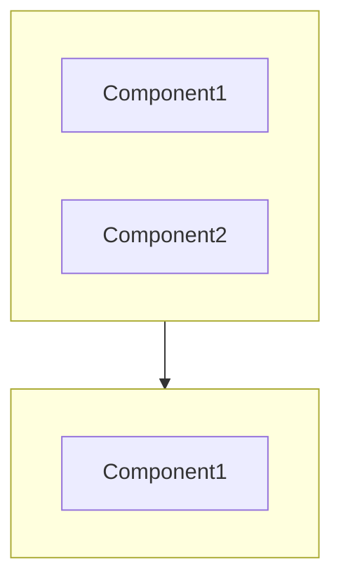
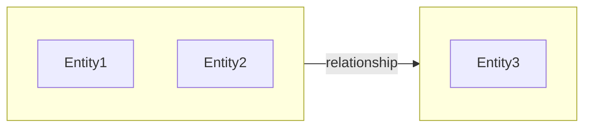
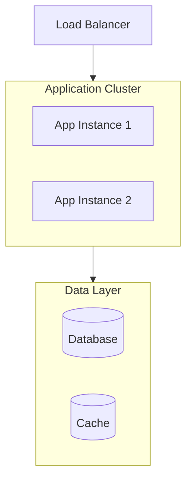

# Update Architecture Documentation

Refresh and expand architecture documentation, updating stale content and expanding stub files with detailed analysis.

**Inputs:** Existing `docs/PROJECT-ARCH.md` and stub files
**Outputs:** Updated `docs/PROJECT-ARCH.md` and expanded `docs/PROJECT-ARCH/*.md` sub-files

## NPL Dependencies

You must run the following command to proceed:

```bash
npl-load c "syntax,agent,fences,directive,pumps.intent,instructing.alg,formatting.template" --skip {@npl.def.loaded}
```

```bash
npl-load spec "project-arch-spec" --skip {@npl.spec.loaded}
```

### See Also
- `npl-load c "fences"` - Fence type reference (diagram, example, format)
- `npl-load c "directive"` - Directive patterns (📐, 🗺️, 🔧, 📂)
- `npl-load c "pumps"` - Reasoning pump documentation
- `npl-load c "agent"` - Agent declaration syntax

---

## Design Philosophy

**incremental**
: Only regenerate sections that are stale or incomplete—preserve manual edits

**expand-stubs**
: Transform stub files from `/init-project-fast` into full detailed documentation

**drift-detection**
: Identify discrepancies between documentation and current codebase

**preserve-intent**
: Maintain architectural decisions and rationale added by humans

---

## Phase 1: Analyze Current State

### 1.1 Inventory Existing Documentation

Check current documentation state:

```alg-pseudo
inventory = {
    main_file: check_exists("docs/PROJECT-ARCH.md"),
    sub_files: glob("docs/PROJECT-ARCH/*.md"),
    stubs: [],
    detailed: [],
    missing: []
}

for file in inventory.sub_files:
    if contains(file, "Stub generated by init-project"):
        inventory.stubs.append(file)
    else:
        inventory.detailed.append(file)

# Expected sub-files per spec
expected = ["layers.md", "domain.md", "patterns.md", "infrastructure.md"]
for expected_file in expected:
    if expected_file not in inventory.sub_files:
        inventory.missing.append(expected_file)
```

### 1.2 Determine Update Mode

| Condition | Mode | Action |
|:----------|:-----|:-------|
| No PROJECT-ARCH.md exists | `full-init` | Run `/init-project` instead |
| Stubs exist | `expand` | Expand stubs to detailed files |
| All detailed, possible drift | `refresh` | Validate and update stale sections |
| User requests specific section | `targeted` | Update only requested sections |

---

## Phase 2: Drift Detection

🎯 **Identify discrepancies between documentation and current codebase.**

### 2.1 Deploy Validation Scouts

Launch targeted scouts to compare documentation claims against reality:

```
@npl-gopher-scout Drift Detection

## Task
Compare existing PROJECT-ARCH.md against current codebase state.

## Validation Targets

### Layer Validation
- Read claimed layers from docs/PROJECT-ARCH.md
- Verify each layer directory exists
- Check component claims match actual files
- Flag missing or renamed components

### Service Validation
- Extract service claims from Infrastructure section
- Verify config files exist at stated paths
- Check schema files match claimed locations
- Identify new services not documented

### Pattern Validation
- Extract pattern claims with file locations
- Verify pattern implementations still exist
- Check for new patterns not documented
- Flag deprecated patterns still listed

### Technology Stack Validation
- Compare claimed stack against manifest files
- Check version claims against package.json/pyproject.toml
- Identify new dependencies not documented

## Output Format

# Drift Report

## Summary
**drift_detected**: <yes|no>
**severity**: <none|minor|moderate|major>
**sections_affected**: [<section-list>]

## Layer Drift
| Claimed | Status | Issue |
|:--------|:-------|:------|
| <layer> | <valid|missing|renamed|changed> | <description> |

## Service Drift
| Service | Status | Issue |
|:--------|:-------|:------|
| <service> | <valid|missing|config-moved> | <description> |

## Pattern Drift
| Pattern | Status | Issue |
|:--------|:-------|:------|
| <pattern> | <valid|deprecated|moved> | <description> |

## New Discoveries
- <new component/service/pattern not in docs>

## Recommendations
- <specific update recommendations>
```

### 2.2 Analyze Drift Report

```alg-pseudo
on drift_report_complete(report):
    if report.severity == "none":
        log("Documentation is current")
        proceed_to_stub_expansion()
    else:
        sections_to_update = report.sections_affected
        for section in sections_to_update:
            mark_for_refresh(section)
        proceed_to_targeted_update(sections_to_update)
```

---

## Phase 3: Stub Expansion

🎯 **Transform stub files into detailed documentation per project-arch-spec.**

### 3.1 Expansion Priority

| File | Priority | Scout Type |
|:-----|:---------|:-----------|
| `layers.md` | 1 | Scout-Layers |
| `domain.md` | 2 | Scout-Domain |
| `patterns.md` | 3 | Scout-Patterns |
| `infrastructure.md` | 4 | Scout-Infra |
| `database.md` | 5 | Scout-Database |
| `api.md` | 6 | Scout-API |
| `authentication.md` | 7 | Scout-Auth |

### 3.2 Deploy Expansion Scouts

Launch scouts in parallel for each stub file that needs expansion:

#### Scout-Layers (for layers.md)

```
@npl-gopher-scout Layer Expansion

## Task
Generate detailed layer documentation per project-arch-spec.

## Analysis Targets
1. Each layer directory identified in PROJECT-ARCH.md
2. Component inventory per layer
3. Inter-layer dependencies and contracts
4. Boundary enforcement patterns

## Deep Dive Per Layer
- List all modules/files in layer
- Identify public interfaces (exports)
- Map dependencies to other layers
- Document layer-specific patterns
- Extract code examples (max 20 lines each)

## Output Format
Follow docs/PROJECT-ARCH/layers.md template from project-arch-spec:

# Architectural Layers
Detailed breakdown of system layers.

## Layer Overview



---

## <Layer-Name>

⟪📂: {layer-<name>}⟫

**responsibility**
: [2-3 sentence layer purpose]

**boundaries**
: [what belongs/doesn't belong]

### Components

**<Component-Name>**
: [1-2 sentence purpose]
: Location: `path/to/component`
: Dependencies: `dep1`, `dep2`

```<language>
[code snippet showing usage pattern]
```

### Layer Contracts

**inbound**
: [interfaces exposed]

**outbound**
: [interfaces consumed]

---

[repeat for each layer]
```

#### Scout-Domain (for domain.md)

```
@npl-gopher-scout Domain Expansion

## Task
Generate detailed domain model documentation per project-arch-spec.

## Analysis Targets
1. Bounded contexts from PROJECT-ARCH.md
2. Entity definitions and relationships
3. Value objects and aggregates
4. Domain events

## Deep Dive Per Context
- Map all entities with attributes
- Identify aggregate roots
- Extract domain events
- Document invariants and business rules
- Create context relationship diagram

## Output Format
Follow docs/PROJECT-ARCH/domain.md template from project-arch-spec:

# Domain Model
Entity and bounded context documentation.

## Context Map



---

## <Bounded-Context-Name>

⟪📂: {context-<name>}⟫

**purpose**
: [2-3 sentence context responsibility]

**ubiquitous-language**
: Key terms specific to this context

### Entities

**<Entity-Name>**
: [1-2 sentence purpose]

| Attribute | Type | Description |
|:----------|:-----|:------------|
| `attr` | `type` | [purpose] |

**invariants**
: [business rules enforced]

### Value Objects

**<ValueObject-Name>**
: [purpose and immutability rationale]

### Domain Events

**<EventName>**
: Trigger: [when this occurs]
: Payload: `field1`, `field2`
: Consumers: `Consumer1`, `Consumer2`

---

[repeat for each context]
```

#### Scout-Patterns (for patterns.md)

```
@npl-gopher-scout Pattern Expansion

## Task
Generate detailed code patterns documentation per project-arch-spec.

## Analysis Targets
1. Patterns mentioned in PROJECT-ARCH.md
2. Design patterns in codebase
3. Architectural patterns
4. Testing patterns
5. Error handling patterns

## Deep Dive Per Pattern
- Find all usage locations
- Extract canonical implementation
- Document variations
- Identify when to use/not use

## Output Format
Follow docs/PROJECT-ARCH/patterns.md template:

# Code Patterns
Named patterns and conventions.

## Pattern Catalog

| Pattern | Category | Usage Locations |
|:--------|:---------|:----------------|
| <Pattern> | <category> | `path1`, `path2` |

---

## <Pattern-Name>

⟪📂: {pattern-<name>}⟫

**category**
: <structural|behavioral|creational|architectural>

**rationale**
: [2-3 sentence justification]

**when-to-use**
: [conditions warranting this pattern]

**when-not-to-use**
: [antipatterns or inappropriate contexts]

### Implementation

```<language>
[canonical code example - max 30 lines]
```

### Usage Examples

**<use-case>**
: Location: `path/to/example`

```<language>
[actual usage from codebase]
```

### Variations

**<variation-name>**
: [how pattern adapts for specific contexts]

---

[repeat for each pattern]
```

#### Scout-Infra (for infrastructure.md)

```
@npl-gopher-scout Infrastructure Expansion

## Task
Generate detailed infrastructure documentation per project-arch-spec.

## Analysis Targets
1. Services from PROJECT-ARCH.md
2. Configuration files
3. Deployment topology
4. Environment configurations
5. Monitoring and health checks

## Deep Dive Per Service
- Full configuration details
- Connection parameters per environment
- Key configuration snippets
- Monitoring metrics and alerts

## Output Format
Follow docs/PROJECT-ARCH/infrastructure.md template:

# Infrastructure
Service configuration and deployment documentation.

## Service Inventory

⟪🔧 services: <complete-list>⟫

| Service | Version | Port | Health Check |
|:--------|:--------|:-----|:-------------|
| <service> | <ver> | <port> | `endpoint` |

---

## <Service-Name>

⟪📂: {service-<name>}⟫

**purpose**
: [1-2 sentence justification]

**configuration**
: Primary: `config-file-path`
: Secrets: `secrets-location`

### Connection Details

| Environment | Host | Port | Notes |
|:------------|:-----|:-----|:------|
| local | `host` | `port` | [...] |
| staging | `host` | `port` | [...] |
| production | `host` | `port` | [...] |

### Key Configuration

```<format>
[relevant config snippet]
```

### Monitoring

**metrics**
: [key metrics to watch]

**alerts**
: [alert conditions]

---

## Deployment

### Local Development

```bash
[commands to start local environment]
```

### Production Topology



**deployment-method**
: [CI/CD, manual, etc.]

**scaling-policy**
: [horizontal/vertical rules]
```

### 3.3 Additional Sub-Files (Create if Needed)

Based on project complexity, create additional sub-files:

| Condition | Create | Scout |
|:----------|:-------|:------|
| Database with >5 tables | `database.md` | Scout-Database |
| REST/GraphQL API | `api.md` | Scout-API |
| Auth system present | `authentication.md` | Scout-Auth |
| Event-driven architecture | `events.md` | Scout-Events |

---

## Phase 4: Update Main File

### 4.1 Refresh PROJECT-ARCH.md

After expanding sub-files, update main file:

```alg-pseudo
for section in main_file.sections:
    if section.has_inline_details AND sub_file_exists(section):
        # Replace inline details with reference
        section.content = brief_summary(section) + "\n\n→ See: " + sub_file_path

    if drift_detected(section):
        # Update section with fresh data
        section.content = regenerate_section(section, scout_data)

    # Preserve human-added content
    if section.has_manual_annotations:
        merge_preserving_annotations(section)
```

### 4.2 Update Mermaid Diagrams

Ensure all diagrams reflect current architecture:

```alg-pseudo
for diagram in main_file.diagrams:
    current_components = extract_from_scouts()
    diagram_components = parse_mermaid(diagram)

    if current_components != diagram_components:
        regenerate_diagram(diagram, current_components)
```

### 4.3 Update Quick Reference

Refresh tables and directive summaries:

- Update layer table with current components
- Refresh service list in `⟪🔧 services:⟫` directive
- Update technology stack versions

---

## Phase 5: Quality Assurance

### 5.1 Validation Checks

| Check | Requirement | Action if Fail |
|:------|:------------|:---------------|
| All sub-file refs resolve | Required | Fix broken references |
| Mermaid diagrams render | Required | Fix syntax errors |
| No orphaned sub-files | Preferred | Remove or link |
| Cross-refs consistent | Required | Update mismatches |
| Code examples valid | Preferred | Update or remove |

### 5.2 Consistency Verification

```alg-pseudo
# Verify cross-references
for ref in main_file.sub_file_references:
    if not exists(ref.target):
        error("Broken reference: " + ref)
    if ref.section_anchor not in read(ref.target):
        warning("Missing anchor: " + ref.section_anchor)

# Verify component claims
for component in all_claimed_components():
    if not exists(component.path):
        warning("Component not found: " + component)
```

### 5.3 Generate Update Report

```output-format
## Update Complete

**Mode**: <expand|refresh|targeted>
**Duration**: <time>

### Files Updated
- [x] docs/PROJECT-ARCH.md (<N> lines changed)
- [x] docs/PROJECT-ARCH/layers.md (expanded from stub)
- [x] docs/PROJECT-ARCH/domain.md (expanded from stub)
- [x] docs/PROJECT-ARCH/patterns.md (expanded from stub)
- [x] docs/PROJECT-ARCH/infrastructure.md (expanded from stub)
- [ ] docs/PROJECT-ARCH/database.md (created new)
- [ ] docs/PROJECT-ARCH/api.md (created new)

### Drift Corrections
- <component> path updated: `old/path` → `new/path`
- <service> version updated: `1.2.0` → `1.3.0`
- <pattern> removed (deprecated)

### New Discoveries
- Added: <new-component> to <layer>
- Added: <new-service> to infrastructure
- Added: <new-pattern> to patterns

### Warnings
- <warning about potential issues>

### Manual Review Recommended
- <section> - significant changes detected
- <file> - complex merge performed
```

---

## Usage Modes

### Expand Stubs (Default after init-project-fast)

```bash
/update-arch
```

Expands all stub files to detailed documentation.

### Targeted Section Update

```bash
/update-arch layers
/update-arch infrastructure
/update-arch patterns,domain
```

Updates only specified sections.

### Full Refresh

```bash
/update-arch --full
```

Re-analyzes entire codebase and regenerates all sections.

### Drift Check Only

```bash
/update-arch --check
```

Reports drift without making changes.

---

## Execution Rules

### Parallel Scout Deployment

🎯 **All expansion scouts MUST be launched in a single parallel batch.**

- Use ONE Task tool call per scout, ALL in the same message
- Do NOT wait for one scout before launching the next
- Scouts operate independently—no inter-scout dependencies
- Each scout writes directly to target sub-file

### Preserve Manual Edits

When updating existing detailed files:

1. Parse file for manual annotations (comments, custom sections)
2. Regenerate structural content
3. Merge preserving manual additions
4. Flag conflicts for human review

### Mermaid Over ASCII

All diagrams MUST use Mermaid syntax:
- `flowchart TB` for layer diagrams
- `flowchart LR` for context maps
- `sequenceDiagram` for flows
- `erDiagram` for database schemas

---

## See Also

- `/init-project` - Full project initialization
- `/init-project-fast` - Quick initialization with stubs
- `/update-layout` - Refresh PROJECT-LAYOUT.md
- `@npl-gopher-scout` - Scout agent definition
- `project-arch-spec` - Full specification reference
