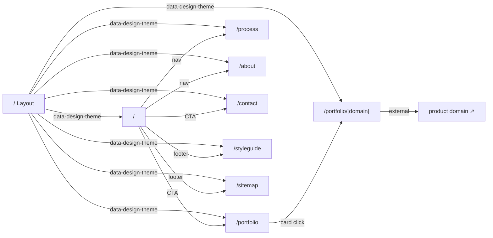
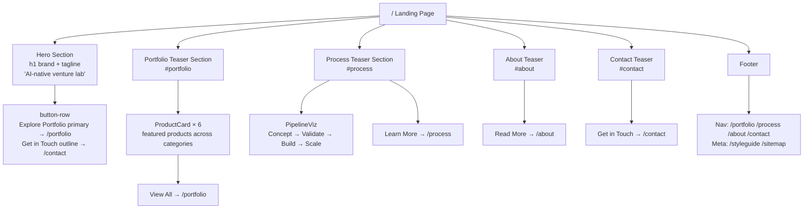
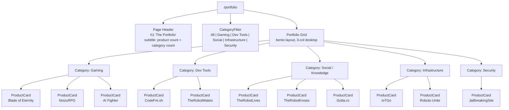
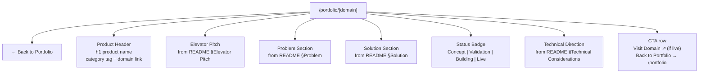
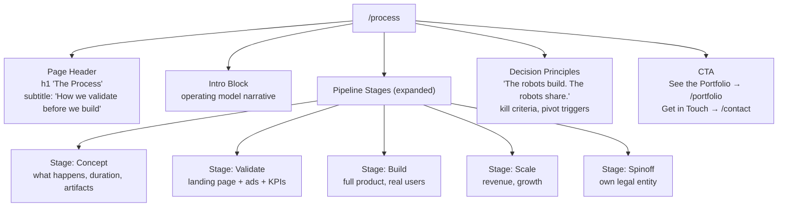
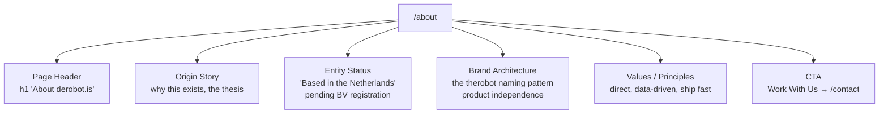
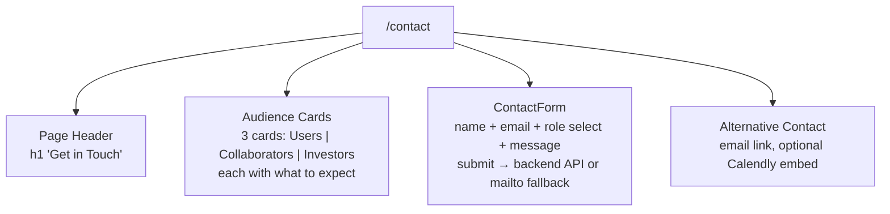
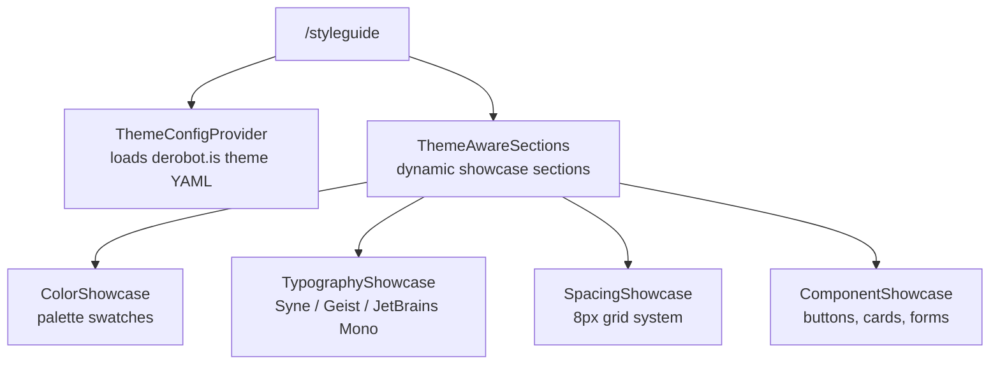
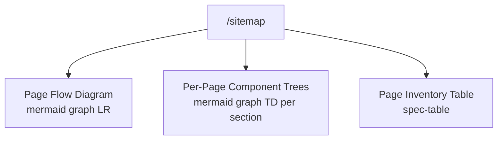

# derobot.is — Site Map

> Corporate landing page for an AI-native venture lab that incubates, validates, and scales digital products under the "therobot" brand family.

**Domain:** derobot.is
**Status:** draft
**Last updated:** 2026-03-25

---

## Page Flow

---

## / — Landing Page

Primary entry point. Converts three audiences — potential users, collaborators, and investors — by communicating portfolio breadth, operational methodology, and credibility. Single-page scroll with distinct sections. Portfolio grid is a teaser (top 6); full grid lives at `/portfolio`.

**Data:**
- Portfolio cards: build-time generation from `projects/*/README.md` (name, domain, category, one-liner)
- All other content: static

---

## /portfolio — Portfolio

Full portfolio grid with all products, grouped by category. Filterable by category. Each card links to `/portfolio/[domain]`.

**Data:**
- Build-time from `projects/*/README.md` (name, domain, category, one-liner, status)
- Category list derived from product data

---

## /portfolio/[domain] — Product Detail

Per-product page generated from the project's README.md at build time. Gives each product a home on derobot.is until it has its own live site.

**Data:**
- Build-time from `projects/[domain]/README.md` — parsed sections
- Status from README §Status
- Dynamic route: `generateStaticParams()` from project directory listing

---

## /process — Methodology

Deep-dive into the venture lab operating model. Explains the pipeline stages, validation methodology, and decision framework. The landing page teases this; this page explains it seriously.

**Data:** Static content

---

## /about — About

Team, entity status, location, values. Answers "Who's behind this?"

**Data:** Static content

---

## /contact — Contact

Dedicated contact page with form. More prominent and linkable than the scroll anchor on `/`.

**Data:**
- Form submission: backend API `/api/contact` or mailto fallback
- Role select: User, Collaborator, Investor, Press, Other

---

## /styleguide — Style Guide

Interactive style guide viewer. Showcases the Nocturne (80%) + Bold Expressive (20%) design system for derobot.is.

**Data:** Theme YAML config from `theme-style-guide/`

---

## /sitemap — Site Architecture

Documents the information architecture of derobot.is. Renders the content of this SITEMAP.md as an interactive page with mermaid diagrams.

**Data:** Generated from this document + `loadPageSections()` + `listThemes()`

---

## Page Inventory

| Route | Purpose | Key Components | Data Sources |
|-------|---------|----------------|--------------|
| `/` | Landing — hero, portfolio teaser, process teaser, about teaser, contact teaser | ProductCard, PipelineViz, Footer | Build-time from project READMEs (static) |
| `/portfolio` | Full portfolio grid with category filtering | ProductCard, CategoryFilter | Build-time from project READMEs |
| `/portfolio/[domain]` | Per-product detail page | ProductHeader, StatusBadge, SectionRenderer | Build-time from individual project README |
| `/process` | Methodology deep-dive — pipeline stages and decision framework | PipelineStage, PrinciplesBlock | Static |
| `/about` | Team, entity, values, brand architecture | EntityStatus, BrandArchitecture | Static |
| `/contact` | Contact form with audience routing | ContactForm, AudienceCards | API: /api/contact or mailto |
| `/styleguide` | Interactive design system viewer | ThemeConfigProvider, ThemeAwareSections | Theme YAML |
| `/sitemap` | Site architecture documentation | mermaid.js, spec-table | This document, config, sections |

---

## Navigation

### Primary Nav (top bar)
- Portfolio → `/portfolio`
- Process → `/process`
- About → `/about`
- Contact → `/contact`

### Footer Nav
- All primary nav links
- Style Guide → `/styleguide`
- Site Map → `/sitemap`
- Product domains → external links (when live)

### Auth Gates
- None — all routes are public
