# BloggersCompete — Site Map

> AI-powered blog discovery and competition platform for analyzing, listing, and showcasing blogs

**Domain:** bloggerscompete.com
**Status:** draft
**Last updated:** 2026-05-26

---

## Page Flow

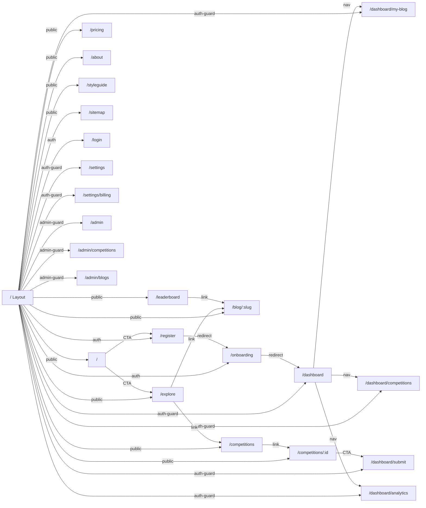

---

## / — Home (Landing Page)

Primary conversion page. Communicates value prop, shows social proof, drives signup.

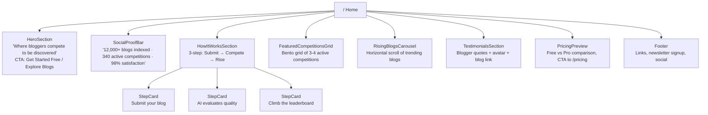

**Data:** Static content + API: featured competitions, rising blogs (cached/ISR)

---

## /explore — Explore Blogs

Discovery page for browsing indexed blogs. Filterable, searchable, infinite scroll.

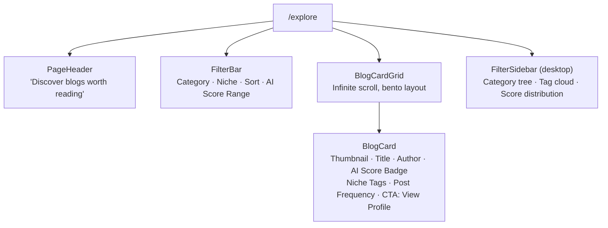

**Data:** API: `/api/blogs?filters=...` with pagination. Search via query param.

---

## /blog/:slug — Blog Profile

Public profile for an indexed blog. Shows AI evaluation, recent posts, competition history.

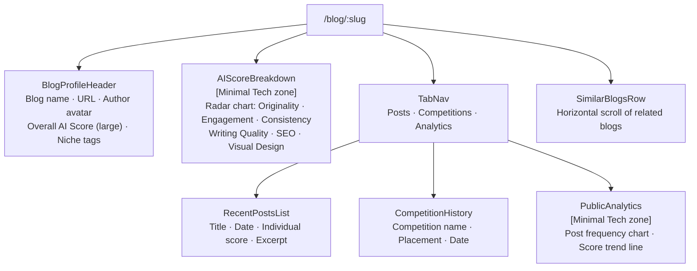

**Data:** API: `/api/blogs/:slug`, `/api/blogs/:slug/posts`, `/api/blogs/:slug/competitions`

---

## /competitions — Competition Listing

Browse all competitions (open, active, completed).

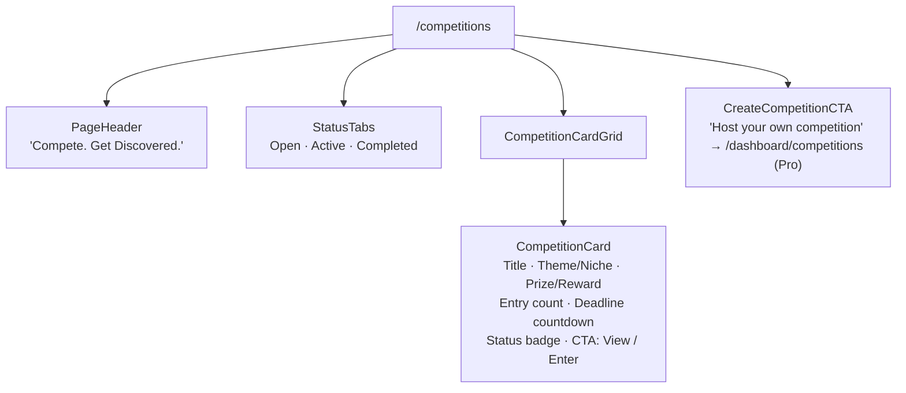

**Data:** API: `/api/competitions?status=open`

---

## /competitions/:id — Competition Detail

Single competition view with rules, entries, leaderboard.

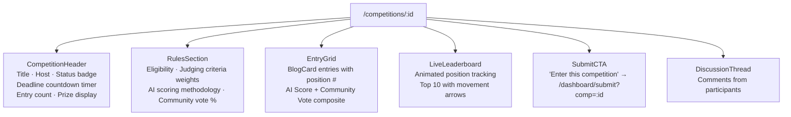

**Data:** API: `/api/competitions/:id`, `/api/competitions/:id/entries`, `/api/competitions/:id/leaderboard`

---

## /leaderboard — Global Leaderboard

All-time and periodic rankings.

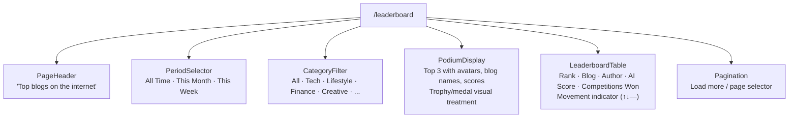

**Data:** API: `/api/leaderboard?period=all&category=all`

---

## /pricing — Pricing

Freemium tier comparison.

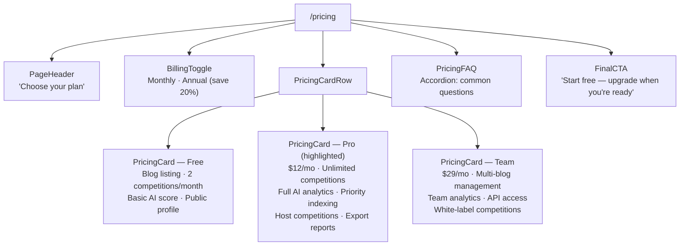

**Data:** Static content. Stripe integration for checkout.

---

## /dashboard — User Dashboard

Authenticated home. Overview of user's blog, competitions, and performance.

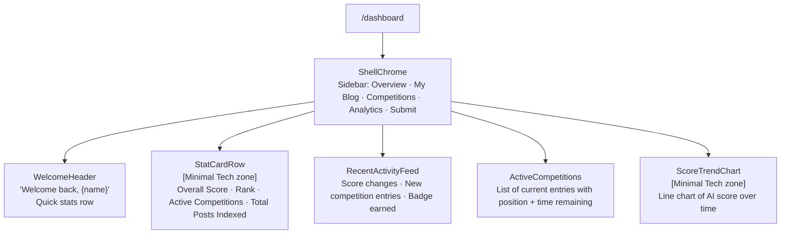

**Data:** API: `/api/me/dashboard`

---

## /dashboard/my-blog — My Blog Management

Configure and manage the user's blog listing.

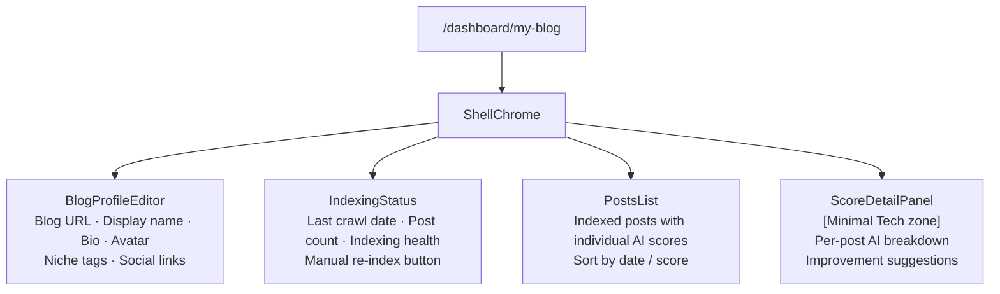

**Data:** API: `/api/me/blog`, `/api/me/posts`

---

## /dashboard/competitions — My Competitions

View and manage competition entries.

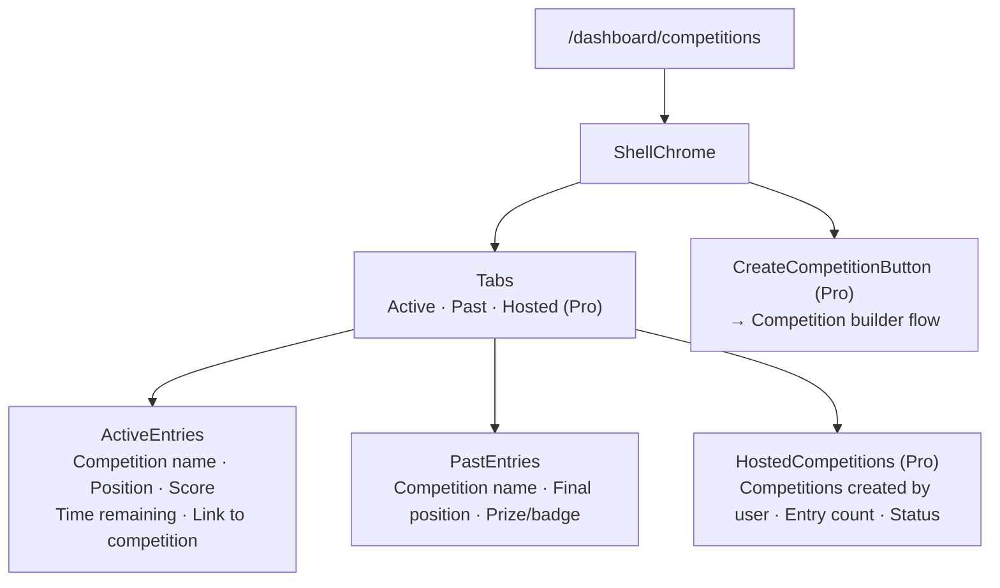

**Data:** API: `/api/me/competitions`

---

## /dashboard/analytics — Analytics

Deep performance analytics for the user's blog.

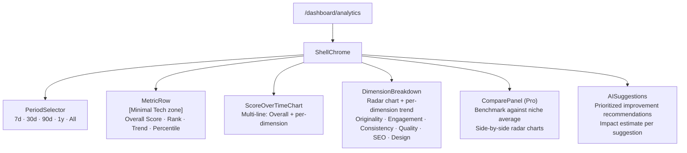

**Data:** API: `/api/me/analytics?period=30d`

---

## /dashboard/submit — Submit to Competition

Entry submission flow.

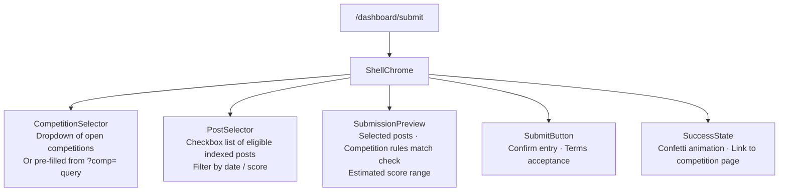

**Data:** API: POST `/api/competitions/:id/entries`

---

## /settings — User Settings

Account and preference management.

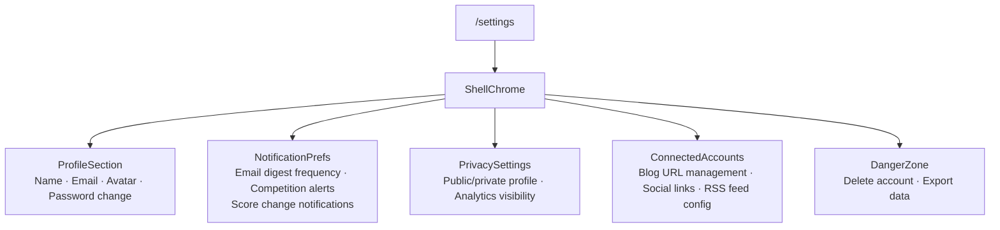

**Data:** API: `/api/me/settings`

---

## /settings/billing — Billing (Pro/Team)

Subscription management via Stripe Customer Portal.

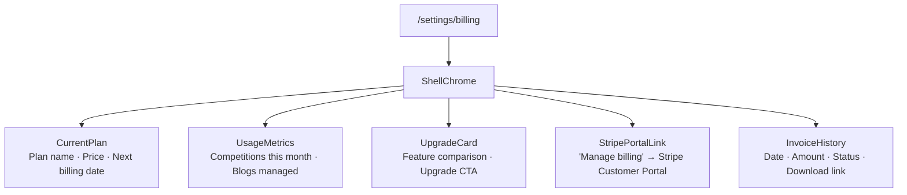

**Data:** API: `/api/me/billing`, Stripe Customer Portal redirect

---

## Auth Pages

### /login

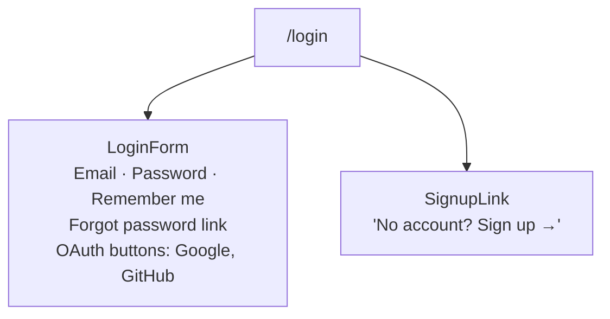

### /register

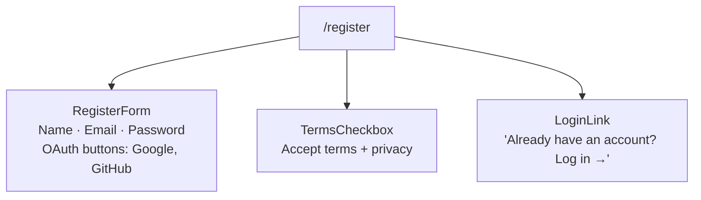

### /onboarding

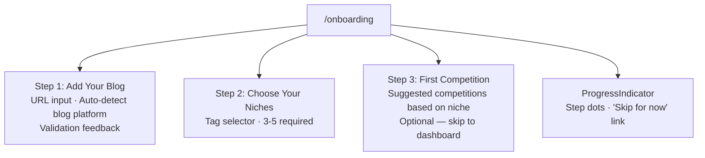

---

## Admin Pages

### /admin

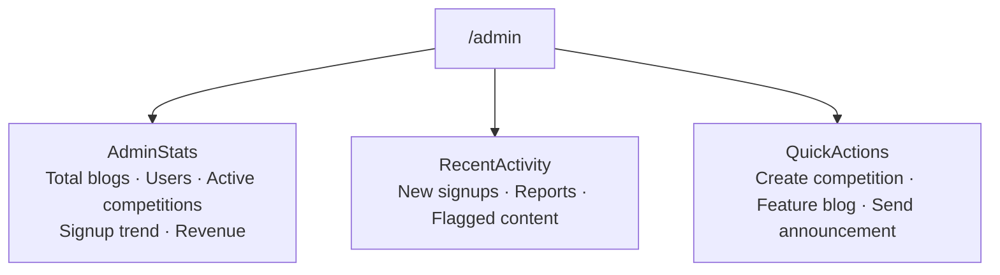

### /admin/competitions & /admin/blogs

Standard CRUD admin panels with search, filter, bulk actions.

---

## Page Inventory

| Route | Purpose | Auth | Key Components | Data Sources |
|-------|---------|------|----------------|--------------|
| `/` | Landing page | Public | HeroSection, HowItWorks, FeaturedCompetitions | Static + API (cached) |
| `/explore` | Blog discovery | Public | FilterBar, BlogCardGrid, BlogCard | API: blogs |
| `/blog/:slug` | Blog profile | Public | AIScoreBreakdown, TabNav, PostsList | API: blog detail |
| `/competitions` | Competition listing | Public | StatusTabs, CompetitionCardGrid | API: competitions |
| `/competitions/:id` | Competition detail | Public | LiveLeaderboard, EntryGrid, DiscussionThread | API: competition detail |
| `/leaderboard` | Global rankings | Public | PodiumDisplay, LeaderboardTable | API: leaderboard |
| `/pricing` | Plan comparison | Public | PricingCard, BillingToggle, PricingFAQ | Static |
| `/about` | About / methodology | Public | Static content | Static |
| `/login` | Sign in | Auth | LoginForm, OAuth buttons | — |
| `/register` | Sign up | Auth | RegisterForm, OAuth buttons | — |
| `/onboarding` | New user setup | Auth | StepWizard, BlogURLInput, NicheSelector | — |
| `/dashboard` | User overview | Protected | StatCardRow, ScoreTrendChart, ActivityFeed | API: dashboard |
| `/dashboard/my-blog` | Blog management | Protected | BlogProfileEditor, IndexingStatus, PostsList | API: my blog |
| `/dashboard/competitions` | My competitions | Protected | ActiveEntries, PastEntries, HostedComps | API: my competitions |
| `/dashboard/analytics` | Performance analytics | Protected | ScoreOverTimeChart, DimensionBreakdown | API: analytics |
| `/dashboard/submit` | Competition entry | Protected | CompetitionSelector, PostSelector | API: submit |
| `/settings` | Account settings | Protected | ProfileSection, NotificationPrefs | API: settings |
| `/settings/billing` | Billing management | Protected | CurrentPlan, StripePortalLink | API: billing |
| `/admin` | Admin dashboard | Admin | AdminStats, QuickActions | API: admin |
| `/admin/competitions` | Manage competitions | Admin | CRUD table | API: admin |
| `/admin/blogs` | Manage blogs | Admin | CRUD table | API: admin |
| `/styleguide` | Design system viewer | Public | ThemeConfigProvider | Theme YAML |
| `/sitemap` | Site architecture | Public | Mermaid diagrams | Config |

---

## Navigation

### Primary Nav (top bar — public)
- Explore → `/explore`
- Competitions → `/competitions`
- Leaderboard → `/leaderboard`
- Pricing → `/pricing`
- Login / Sign Up (when unauthenticated)
- Dashboard (when authenticated)

### Dashboard Sidebar (authenticated)
- Overview → `/dashboard`
- My Blog → `/dashboard/my-blog`
- Competitions → `/dashboard/competitions`
- Analytics → `/dashboard/analytics`
- Submit → `/dashboard/submit`
- Settings → `/settings`

### Auth Gates
- `/dashboard/*` — requires authenticated session
- `/settings/*` — requires authenticated session
- `/admin/*` — requires admin role
- All other routes — public
