# MCP Host — Site Map

> Unified MCP hosting platform: deploy, scaffold, and secure MCP servers.

**Domains:** justmcp.it | mcpjumpst.art | safemcp.com
**Status:** draft
**Last updated:** 2026-05-12

---

## Platform Navigation Model

The three domains share a unified auth system and top-level navigation. Users sign in once and move between surfaces via a persistent platform switcher.

### Global Navigation

```
[Logo] [JustMCP.it | Jumpstart | SafeMCP]        [Registry] [Docs] [User ▾]
```

- **Platform switcher** — tab bar distinguishing the three surfaces
- **Registry** — global search, always accessible from any surface
- **Docs** — unified documentation across all surfaces
- **User menu** — org switcher, settings, API keys, sign out

### Auth Gates

| Route Pattern | Gate |
|---------------|------|
| `/` (all surfaces) | Public |
| `/docs/*` | Public |
| `/registry/*` | Public (read), Auth (publish/bookmark) |
| `/pricing` | Public |
| `/dashboard/*` | Auth required |
| `/deploy/*` | Auth required |
| `/scaffold/*` | Auth required |
| `/policies/*` | Auth required |
| `/admin/*` | Auth + org admin role |
| `/settings/*` | Auth required |

---

## Page Flow Diagram

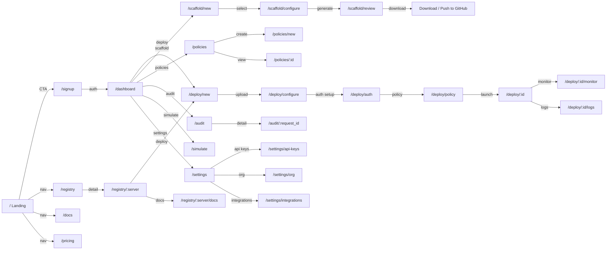

---

## Surface 1: JustMCP.it — One-Click Deploy

### / — Landing Page

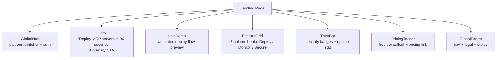

**Key data:** None (static marketing content)
**Conversion goal:** Sign up or start deploy flow

### /deploy/new — Upload Tool Definition

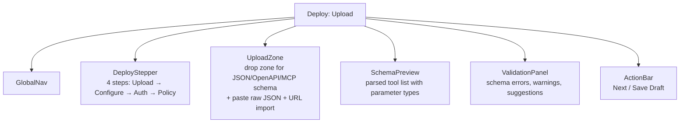

**Key data:** Uploaded schema file, parsed tool definitions
**Validation:** Schema parsing, tool name uniqueness check

### /deploy/configure — Server Configuration

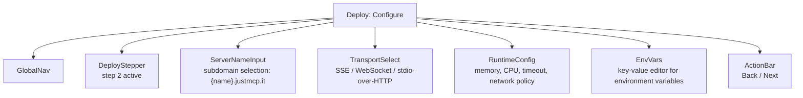

**Key data:** Server config, runtime limits, transport selection

### /deploy/auth — Auth Configuration

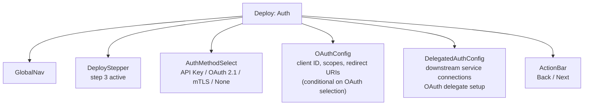

**Key data:** Auth method, OAuth config, delegated auth setup

### /deploy/policy — Access Policy

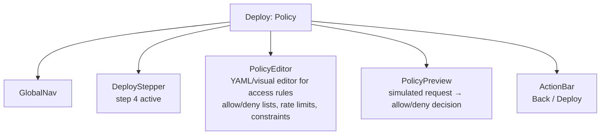

**Key data:** Policy document, simulation results

### /deploy/:id — Server Dashboard

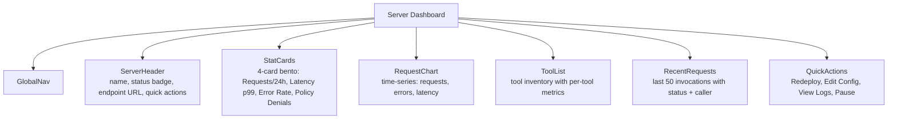

**Key data:** Server metrics, request log, tool inventory

### /deploy/:id/monitor — Monitoring

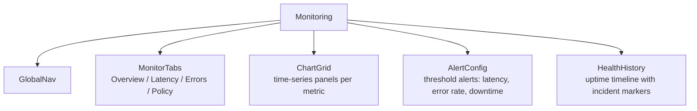

**Key data:** Time-series metrics, alert rules, health check results

### /deploy/:id/logs — Request Logs

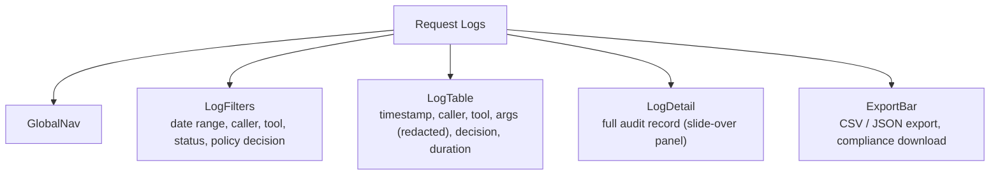

**Key data:** Audit log entries, filter state

---

## Surface 2: MCP Jumpstart — Scaffolding

### / — Landing Page (mcpjumpst.art)

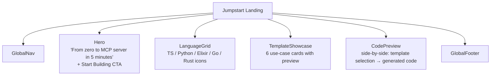

### /scaffold/new — Select Template

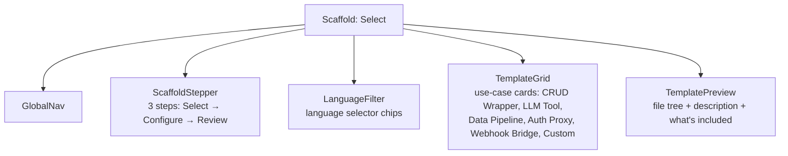

**Key data:** Template catalog, language support matrix

### /scaffold/configure — Configure Project

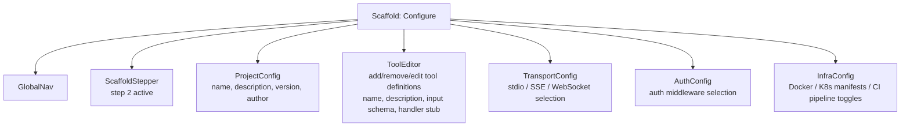

**Key data:** Project configuration, tool definitions

### /scaffold/review — Review & Download

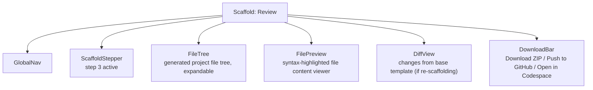

**Key data:** Generated project files

---

## Surface 3: SafeMCP — Security Control Plane

### / — Landing Page (safemcp.com)

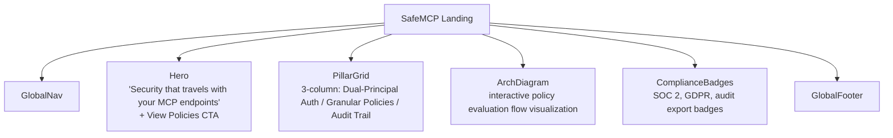

### /policies — Policy Management

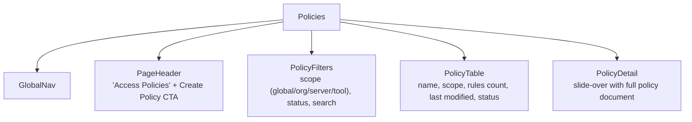

**Key data:** Policy list, policy documents

### /policies/new — Policy Editor

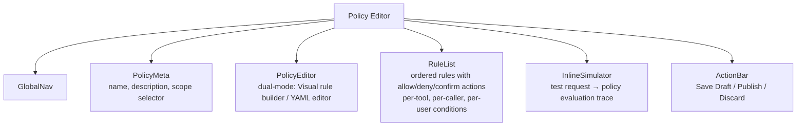

**Key data:** Policy document, simulation results

### /audit — Audit Log

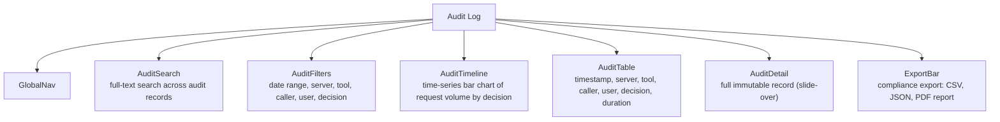

**Key data:** Audit records, aggregated analytics

### /simulate — Simulation Environment

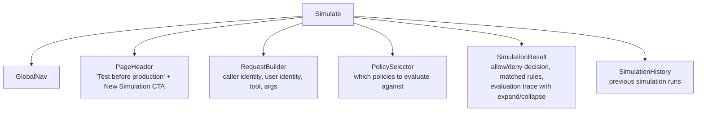

**Key data:** Simulation input, policy evaluation trace

---

## Shared Pages

### /registry — MCP Registry & Discovery

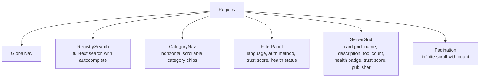

**Key data:** Server catalog, category taxonomy, health/trust scores

### /registry/:server — Server Detail

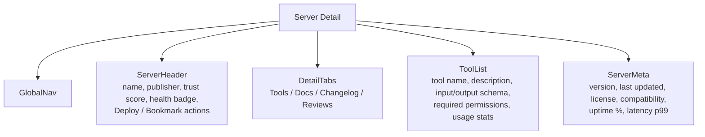

**Key data:** Server metadata, tool schemas, usage stats, reviews

### /docs — Documentation

```mermaid
graph TD
    PAGE["Docs"]
    PAGE --> NAV["GlobalNav"]
    PAGE --> SIDEBAR["DocNav\ncollapsible tree: Getting Started, Guides,\nAPI Reference, Security, Self-Hosting"]
    PAGE --> CONTENT["DocContent\nmarkdown-rendered content with code blocks"]
    PAGE --> TOC["TableOfContents\nright sidebar, scroll-spy anchors"]
    PAGE --> SEARCH["DocSearch\nfull-text search with preview snippets"]
```

### /pricing — Pricing

```mermaid
graph TD
    PAGE["Pricing"]
    PAGE --> NAV["GlobalNav"]
    PAGE --> TIERS["PricingTable\n3-4 tiers: Free / Pro / Team / Enterprise\nfeature comparison matrix"]
    PAGE --> CALCULATOR["UsageCalculator\nestimate cost by requests, servers, seats"]
    PAGE --> FAQ["PricingFAQ\naccordion FAQ"]
    PAGE --> CTA["BottomCTA\n'Start free' + 'Contact sales'"]
```

### /settings — Account Settings

```mermaid
graph TD
    PAGE["Settings"]
    PAGE --> NAV["GlobalNav"]
    PAGE --> SIDENAV["SettingsNav\nProfile / Organization / API Keys /\nIntegrations / Billing / Security"]
    PAGE --> CONTENT["SettingsContent\nform-based settings panels"]
```

### /settings/api-keys — API Key Management

```mermaid
graph TD
    PAGE["API Keys"]
    PAGE --> NAV["GlobalNav"]
    PAGE --> SIDENAV["SettingsNav"]
    PAGE --> LIST["KeyList\nname, prefix, created, last used, policy binding"]
    PAGE --> CREATE["CreateKeyDialog\nname, policy binding (YAML), expiration"]
    PAGE --> REVEAL["KeyReveal\none-time display of generated key"]
```

**Key data:** API keys, policy bindings

---

## Page Inventory

| Route | Surface | Purpose | Key Components | Auth |
|-------|---------|---------|----------------|------|
| `/` | All | Landing page (varies by domain) | Hero, FeatureGrid, TrustBar | Public |
| `/signup` | Shared | Registration | SignupForm | Public |
| `/login` | Shared | Authentication | LoginForm | Public |
| `/dashboard` | Shared | Overview hub | StatCards, RecentActivity, QuickActions | Auth |
| `/deploy/new` | JustMCP | Upload tool definition | UploadZone, SchemaPreview, ValidationPanel | Auth |
| `/deploy/configure` | JustMCP | Server configuration | ServerNameInput, TransportSelect, RuntimeConfig | Auth |
| `/deploy/auth` | JustMCP | Auth setup | AuthMethodSelect, OAuthConfig, DelegatedAuth | Auth |
| `/deploy/policy` | JustMCP | Access policy | PolicyEditor, PolicyPreview | Auth |
| `/deploy/:id` | JustMCP | Server dashboard | StatCards, RequestChart, ToolList | Auth |
| `/deploy/:id/monitor` | JustMCP | Monitoring | ChartGrid, AlertConfig, HealthHistory | Auth |
| `/deploy/:id/logs` | JustMCP | Request logs | LogFilters, LogTable, LogDetail | Auth |
| `/scaffold/new` | Jumpstart | Template selection | LanguageFilter, TemplateGrid | Auth |
| `/scaffold/configure` | Jumpstart | Project configuration | ToolEditor, TransportConfig, InfraConfig | Auth |
| `/scaffold/review` | Jumpstart | Review & download | FileTree, FilePreview, DownloadBar | Auth |
| `/policies` | SafeMCP | Policy list | PolicyFilters, PolicyTable | Auth |
| `/policies/new` | SafeMCP | Policy editor | PolicyEditor, RuleList, InlineSimulator | Auth |
| `/policies/:id` | SafeMCP | Policy detail | PolicyDetail, RuleList | Auth |
| `/audit` | SafeMCP | Audit log | AuditSearch, AuditTimeline, AuditTable | Auth |
| `/simulate` | SafeMCP | Policy simulator | RequestBuilder, SimulationResult | Auth |
| `/registry` | Shared | MCP server catalog | RegistrySearch, ServerGrid, CategoryNav | Public |
| `/registry/:server` | Shared | Server detail | ToolList, ServerMeta, DetailTabs | Public |
| `/docs` | Shared | Documentation | DocNav, DocContent, DocSearch | Public |
| `/pricing` | Shared | Pricing & plans | PricingTable, UsageCalculator | Public |
| `/settings` | Shared | Account settings | SettingsNav, form panels | Auth |
| `/settings/api-keys` | Shared | API key management | KeyList, CreateKeyDialog | Auth |
| `/settings/org` | Shared | Org management | MemberList, RoleEditor, InviteForm | Admin |
| `/settings/integrations` | Shared | Service connections | IntegrationList, OAuthConnectFlow | Auth |
