# BookmarkFlow — Sitemap

**Project:** BookmarkFlow
**Domain:** bookmarkflow.com
**One-liner:** AI-native bookmarking for humans and their agents
**Status:** Concept
**Date:** 2026-05-26

---

## Page Flow

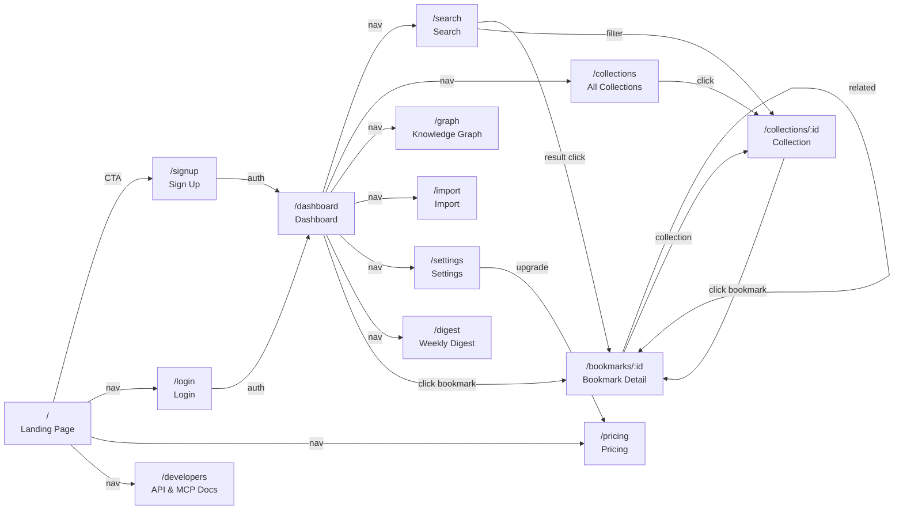

---

## Page Definitions

### Landing Page `/`

```mermaid
graph TD
    Page[Landing Page]
    Page --> Hero[Hero Section]
    Hero --> Headline["Your knowledge, searchable\nby you and your agents."]
    Hero --> Sub["AI-native bookmarking that\nboth humans and LLMs can query"]
    Hero --> CTA1["Get Started Free"]
    Hero --> Visual["Product screenshot / demo"]

    Page --> Problem[Problem Section]
    Problem --> P1["Save & forget"]
    Problem --> P2["Search by meaning, not URL"]
    Problem --> P3["Your agents have amnesia"]

    Page --> HowItWorks[How It Works]
    HowItWorks --> Step1["Save — browser ext or agent MCP"]
    HowItWorks --> Step2["Understand — AI summarizes & embeds"]
    HowItWorks --> Step3["Recall — semantic search, human or agent"]

    Page --> Features[Feature Grid]
    Features --> F1["Semantic Search"]
    Features --> F2["Agent Memory Bridge"]
    Features --> F3["Auto-Summaries"]
    Features --> F4["Knowledge Graph"]
    Features --> F5["Team Spaces"]
    Features --> F6["Import Everything"]

    Page --> Social[Social Proof / Early Access]
    Page --> PricingPreview[Pricing Preview]
    Page --> FooterCTA["Start building your knowledge base"]
    Page --> Footer[Footer]
```

**Purpose:** Convert visitors to signups. Lead with the agent memory angle — it's the differentiator.

**Data requirements:** None (static).

---

### Dashboard `/dashboard`

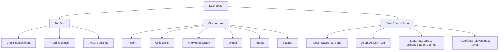

**Purpose:** Home base. Show recent activity from both human and agent saves. Make search instantly accessible.

**Data requirements:**
- Recent bookmarks (paginated, user + agent saves distinguished)
- Agent activity log (last N agent interactions)
- Usage stats (counts)
- Resurfaced suggestions (based on recent activity context)

---

### Search `/search`

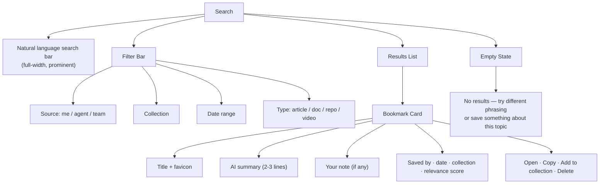

**Purpose:** The core interaction. Natural language in, ranked results out. Must feel instant.

**Data requirements:**
- Vector similarity search against embeddings
- Metadata filtering (source, date, collection, type)
- Bookmark data with summaries and notes

---

### Bookmark Detail `/bookmarks/:id`

```mermaid
graph TD
    Page[Bookmark Detail]
    Page --> Header[Header]
    Header --> Title["Title + source favicon"]
    Header --> URL["Original URL (clickable)"]
    Header --> SavedBy["Saved by: You / Agent name"]
    Header --> SavedDate["Date saved"]

    Page --> Summary[AI Summary]
    Summary --> KeyPoints["Key points (bullet list)"]
    Summary --> Topics["Extracted topics (chips)"]

    Page --> Notes[Notes Section]
    Notes --> UserNote["Your annotation"]
    Notes --> AgentNote["Agent context (why it saved this)"]
    Notes --> EditNote["Edit / add note"]

    Page --> Collections[Collections]
    Collections --> CollectionChips["Collection membership (editable)"]

    Page --> Related[Related Bookmarks]
    Related --> RelatedCards["Semantically similar saves"]

    Page --> Meta[Metadata]
    Meta --> ContentType["Type: article / doc / repo"]
    Meta --> LastChecked["Link health: last checked, status"]
    Meta --> WordCount["Estimated read time"]
```

**Purpose:** Deep view of a single bookmark. Surface the AI-extracted knowledge and connections.

**Data requirements:**
- Full bookmark record (URL, title, summary, notes, metadata)
- Related bookmarks (vector similarity)
- Collection memberships
- Link health status

---

### Collections `/collections` and `/collections/:id`

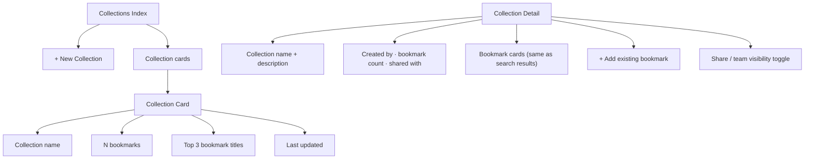

**Purpose:** Lightweight grouping. Not hierarchical folders — flat, overlapping, taggable.

**Data requirements:**
- Collections list with counts and previews
- Collection detail with member bookmarks
- Share/visibility settings

---

### Knowledge Graph `/graph`

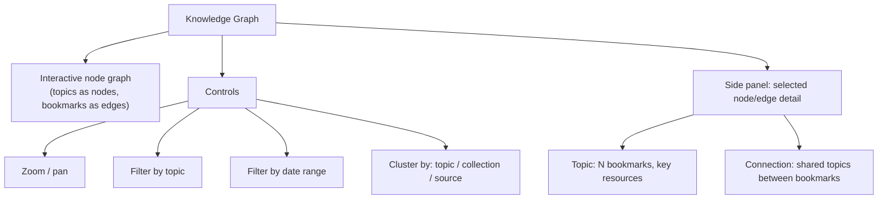

**Purpose:** Visual discovery. See connections between saved resources. This is the "wow" feature for Tier 2.

**Data requirements:**
- Topic extraction from all bookmarks
- Co-occurrence/similarity relationships
- Graph layout computation (server-side or client D3/Sigma.js)

---

### Import `/import`

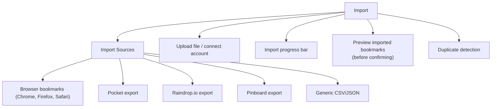

**Purpose:** Migration path. Make switching painless.

**Data requirements:**
- File upload/parsing
- Deduplication against existing bookmarks
- Background processing (Oban job for AI summarization of imports)

---

### Settings `/settings`

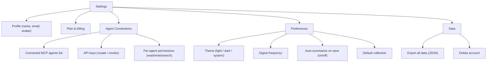

**Purpose:** Account management. Agent connections are a key settings surface — users need to see and control what agents can access.

---

### Pricing `/pricing`

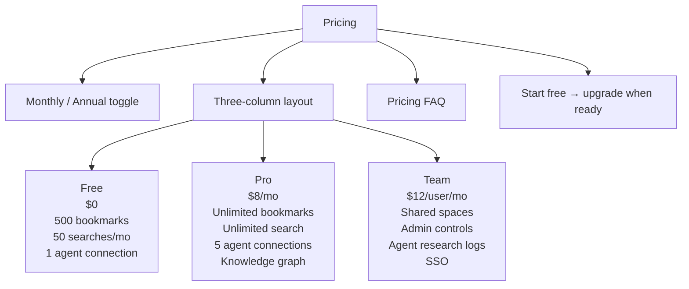

---

### API & MCP Docs `/developers`

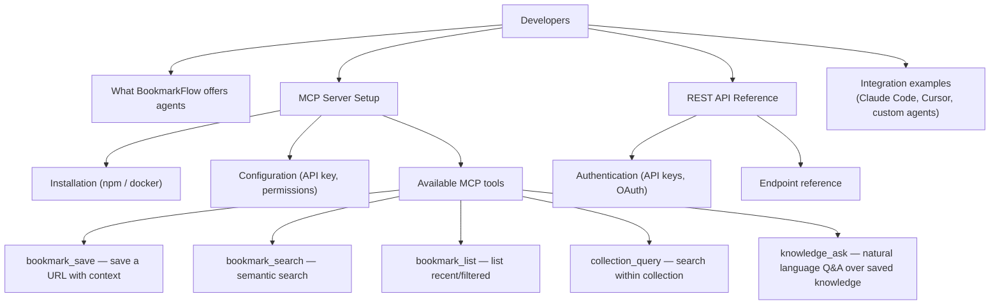

**Purpose:** Developer adoption surface. MCP setup should be copy-paste simple.

---

### Weekly Digest `/digest`

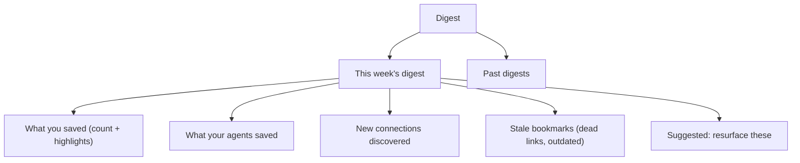

---

## Component Inventory

| Component | Used On | Notes |
|-----------|---------|-------|
| **BookmarkCard** | Dashboard, Search, Collection, Digest | Title, summary, note, meta, actions |
| **SearchBar** | Dashboard (compact), Search (full) | Natural language input with typeahead |
| **CollectionChip** | BookmarkCard, Bookmark Detail | Clickable, removable |
| **TopicChip** | Bookmark Detail, Knowledge Graph | Extracted topic tag |
| **AgentBadge** | BookmarkCard, Dashboard feed | Indicates agent-sourced content |
| **StatCard** | Dashboard | Numeric stat with label |
| **EmptyState** | Search, Collections, Dashboard | Contextual message + action |
| **ImportProgress** | Import | Progress bar with status messages |
| **PricingCard** | Pricing | Tier card with feature list + CTA |
| **GraphCanvas** | Knowledge Graph | D3/Sigma.js interactive graph |
| **DigestSection** | Digest | Collapsible summary section |
