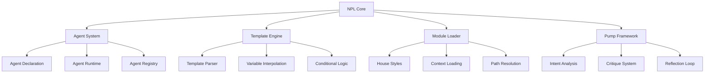
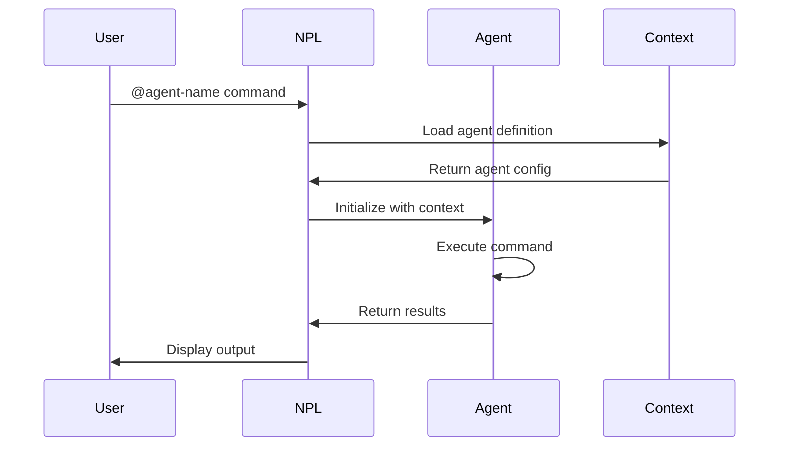
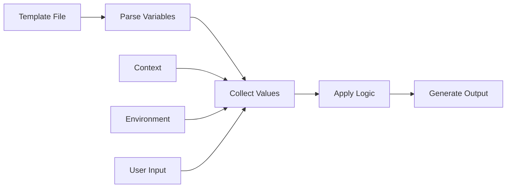

# Noizu PromptLingo (NPL) Technical Documentation

## Overview

Noizu PromptLingo (NPL) is a structured prompting framework for language model interactions. NPL provides a formal syntax for defining agent behaviors, template systems, and structured communication patterns between humans and AI systems.

The framework consists of:
- Formal syntax using Unicode boundary markers
- Agent system for specialized task execution
- Module loading system (NPL-M) for dynamic configuration
- Template hydration for project-specific customization
- Pump mechanisms for structured reasoning patterns

## Architecture

### System Components



### Component Responsibilities

**NPL Core**: Central framework managing syntax parsing and directive execution.

**Agent System**: Manages agent lifecycle, registration, and invocation. Agents are self-contained units with specific capabilities.

**Template Engine**: Processes NPL templates using Handlebars-style syntax for variable substitution and conditional sections.

**Module Loader**: Dynamically loads configuration, house styles, and context based on project structure.

**Pump Framework**: Provides structured reasoning patterns for complex cognitive tasks.

## NPL Syntax Reference

### Agent Declaration

Agents use Unicode boundary markers for clear scope definition:

```npl
⌜agent-name|type|version⌝
🙋 @alias capability1 capability2

# Agent Title
[Agent implementation and behavior]

⌞agent-name⌟
```

**Boundary Characters**:
- `⌜` (U+231C): Opens agent declaration
- `⌝` (U+231D): Closes opening declaration
- `⌞` (U+231E): Opens closing declaration  
- `⌟` (U+231F): Closes agent scope

**Agent Types**:
- `agent`: General-purpose agents
- `writer`: Content generation specialists
- `evaluator`: Assessment and grading agents
- `service`: System/infrastructure agents

### Directive Syntax

NPL directives provide explicit instructions using Unicode symbols:

```npl
↦ directive-name: parameter
➤ action: target
📂 load: path/to/file
🆔 identifier: unique-name
```

### Template Variables

Variable interpolation supports multiple formats:

```npl
{{variable_name}}              # Simple substitution
{{#if condition}}...{{/if}}    # Conditional blocks
{{#each collection}}...{{/each}} # Iteration
{{> partial_name}}              # Partial templates
```

### Fence Blocks

Structured content blocks for specific purposes:

```alg
function processData(input):
    validate(input)
    transform(input)
    return output
```

```format
key: value
nested:
  - item1
  - item2
```

```example
Input: sample data
Output: processed result
```

## Agent System

### Agent Lifecycle



### Agent Definition Structure

```npl
---
name: agent-identifier
description: Agent purpose and capabilities
model: inherit | specific-model
color: visual-identifier
---

# Context Loading
load .claude/npl.md into context.
{{#if specific_module}}
load .claude/npl/modules/{{specific_module}}.md into context.
{{/if}}

⌜agent-name|type|version⌝
# Implementation
⌞agent-name⌟
```

### Agent Registration

Agents are registered in `~/.claude/agents/` with standardized naming:
- Core agents: `npl-[function].md`
- Project agents: `[project]-[function].md`
- Custom agents: User-defined naming

### Agent Invocation

```bash
@agent-name command parameters
@npl-templater hydrate template.md --project=myproject
@npl-grader evaluate code.py --rubric=standards.md
```

## Module System (NPL-M)

### House Style Loading

House styles define project-specific writing and coding conventions. Loading order (later files override earlier):

1. **Global Home Style**: `~/.claude/npl-m/house-style/[type]-style.md`
2. **Project Global Style**: `.claude/npl-m/house-style/[type]-style.md`
3. **Path-Specific Styles**: From project root to target directory

```alg
function loadHouseStyles(target_path, style_type):
    styles = []
    
    # Environment variable overrides
    if env.HOUSE_STYLE_[TYPE]_ADDENDUM:
        styles.append(load(env.HOUSE_STYLE_[TYPE]_ADDENDUM))
    
    if env.HOUSE_STYLE_[TYPE]:
        content = load(env.HOUSE_STYLE_[TYPE])
        if not contains(content, "+load-default-styles"):
            return styles + [content]
    
    # Default loading hierarchy
    styles.append(load("~/.claude/npl-m/house-style/{style_type}-style.md"))
    styles.append(load(".claude/npl-m/house-style/{style_type}-style.md"))
    
    # Path-specific styles
    for path in hierarchy(project_root, target_path):
        style_file = path + "/house-style/{style_type}-style.md"
        if exists(style_file):
            styles.append(load(style_file))
    
    return styles
```

### Context Loading Directives

```npl
load path/to/file.md into context.
load .claude/npl.md into context.
{{#if condition}}
load conditional/file.md into context.
{{/if}}
```

### Module Types

- **Pumps**: Reasoning patterns (`npl-intent`, `npl-critique`, `npl-rubric`)
- **House Styles**: Writing conventions (`technical-style`, `marketing-style`)
- **Templates**: Reusable document structures
- **Agents**: Specialized task executors

## Template System

### Template Syntax

NPL templates use Handlebars-compatible syntax with extensions:

```npl
# {{project_name}} Configuration

## Environment: {{environment}}

{{#if use_database}}
### Database Configuration
- Type: {{database_type}}
- Host: {{database_host}}
- Port: {{database_port}}
{{/if}}

{{#each services}}
### Service: {{name}}
- Endpoint: {{endpoint}}
- Auth: {{auth_type}}
{{/each}}
```

### Template Hydration Process



### Variable Resolution

Variables are resolved in precedence order:
1. Explicit user-provided values
2. Environment variables
3. Context defaults
4. Template defaults

### Conditional Logic

```npl
{{#if condition}}
  Content when true
{{else}}
  Content when false
{{/if}}

{{#unless condition}}
  Content when false
{{/unless}}

{{#each collection as |item|}}
  Process {{item.name}}
{{/each}}
```

## API Reference

### Core Functions

#### `load(path) -> context`
Loads file content into agent context.

```npl
load .claude/npl.md into context.
load {{dynamic_path}}/file.md into context.
```

#### `hydrate(template, variables) -> output`
Processes template with variable substitution.

```npl
@npl-templater hydrate template.md --var1=value1 --var2=value2
```

#### `evaluate(content, rubric) -> assessment`
Evaluates content against specified criteria.

```npl
@npl-grader evaluate document.md --rubric=standards.md
```

### Pump Functions

#### Intent Analysis
```npl
<npl-intent>
intent:
  overview: "High-level goal"
  scope: "Boundaries and limitations"
  outcomes: "Expected results"
</npl-intent>
```

#### Critique Generation
```npl
<npl-critique>
analysis:
  strengths: "Positive aspects"
  weaknesses: "Areas for improvement"
  recommendations: "Specific suggestions"
</npl-critique>
```

#### Rubric Evaluation
```npl
<npl-rubric>
criteria:
  - dimension: "Evaluation aspect"
    standards: "Quality levels"
    indicators: "Observable measures"
</npl-rubric>
```

### Agent Interface

#### Agent Invocation
```bash
@agent-name command [options]
```

#### Agent Query
```bash
@agent-name --help
@agent-name --capabilities
@agent-name --version
```

## Configuration

### CLAUDE.md Structure

Project configuration file defining NPL integration:

```markdown
# CLAUDE.md

## Project Overview
[Project description and NPL usage]

## NPL Configuration
- NPL Version: 1.0
- Agent Set: [core, extended, custom]
- House Styles: [technical, marketing]

## Agent Loading
load .claude/npl.md into context.
load .claude/agents/*.md into registry.

## Custom Directives
[Project-specific NPL extensions]
```

### Environment Setup

```bash
# Core NPL setup
cp agentic/npl/verbose/npl.md ~/.claude/npl.md
cp agentic/scaffolding/agents/* ~/.claude/agents/

# Project-specific setup
mkdir -p .claude/npl-m/house-style
cp templates/house-style/*.md .claude/npl-m/house-style/

# Environment variables
export HOUSE_STYLE_TECHNICAL=/path/to/custom-style.md
export NPL_MODULE_PATH=~/.claude/npl-m
```

### File Structure

```
project/
├── .claude/
│   ├── npl.md                 # NPL syntax reference
│   ├── agents/                # Agent definitions
│   │   ├── npl-templater.md
│   │   ├── npl-grader.md
│   │   └── custom-agent.md
│   └── npl-m/                 # NPL modules
│       ├── house-style/       # Style guides
│       ├── templates/         # Reusable templates
│       └── pumps/            # Reasoning patterns
├── CLAUDE.md                  # Project configuration
└── src/                      # Project source
```

## Development Guide

### Creating Custom Agents

1. **Define Agent Boundary**
```npl
⌜my-agent|service|1.0⌝
🙋 @myagent analyze process generate
```

2. **Specify Context Loading**
```npl
load .claude/npl.md into context.
load project/specific/context.md into context.
```

3. **Implement Agent Logic**
```npl
# Core Functions
- Analyze input data
- Process according to rules
- Generate structured output

# Implementation
[Detailed agent behavior]
```

4. **Close Agent Scope**
```npl
⌞my-agent⌟
```

### Creating Templates

1. **Define Template Structure**
```npl
# {{title}}

## Configuration
- Parameter: {{param1}}
- Option: {{param2|default_value}}
```

2. **Add Conditional Sections**
```npl
{{#if advanced_mode}}
## Advanced Settings
[Complex configuration]
{{/if}}
```

3. **Include Iterations**
```npl
{{#each items}}
- {{name}}: {{value}}
{{/each}}
```

4. **Test Template Hydration**
```bash
@npl-templater hydrate my-template.md --title="Test" --param1="Value"
```

### Implementing Pumps

Pumps provide structured reasoning patterns:

```npl
<npl-custom-pump>
reasoning:
  step1: "Initial analysis"
  step2: "Pattern identification"
  step3: "Solution synthesis"
  conclusion: "Final output"
</npl-custom-pump>
```

### House Style Development

Create domain-specific writing styles:

```markdown
# Technical Writing Style

## Principles
- Use active voice
- Present tense for current state
- Past tense for historical events
- Imperative mood for instructions

## Terminology
- Preferred: "execute", not "run"
- Preferred: "parameter", not "argument"

## Structure
- Lead with purpose
- Follow with details
- End with examples
```

## Troubleshooting

### Common Issues

#### Agent Not Found
**Problem**: `@agent-name` returns "agent not found"

**Solution**: Verify agent file exists in `~/.claude/agents/` and follows naming convention.

```bash
ls ~/.claude/agents/
cat ~/.claude/agents/agent-name.md
```

#### Template Variable Undefined
**Problem**: Template hydration shows `{{undefined}}`

**Solution**: Provide all required variables or add defaults:

```npl
{{variable|default_value}}
{{#if variable}}...{{else}}Default content{{/if}}
```

#### Context Loading Failure
**Problem**: "Failed to load context" error

**Solution**: Check file paths are absolute or relative to project root:

```npl
load /absolute/path/to/file.md into context.
load ./relative/to/project/file.md into context.
```

#### House Style Not Applied
**Problem**: Custom house style not affecting output

**Solution**: Verify loading order and check for override flags:

```bash
# Check environment variables
echo $HOUSE_STYLE_TECHNICAL

# Verify file contains +load-default-styles if needed
grep "+load-default-styles" custom-style.md
```

### Debugging Techniques

#### Enable Verbose Mode
```bash
@agent-name command --verbose
```

#### Trace Template Processing
```npl
{{#debug}}
Variable values:
- var1: {{var1}}
- var2: {{var2}}
{{/debug}}
```

#### Validate NPL Syntax
```bash
@npl-grader validate agent-definition.md --syntax=strict
```

### Performance Optimization

#### Context Loading
- Load only required modules
- Use conditional loading for optional features
- Cache frequently used contexts

#### Template Processing
- Minimize nested conditionals
- Pre-process complex logic
- Use partial templates for reusable sections

#### Agent Execution
- Implement lazy loading for heavy dependencies
- Use streaming for large outputs
- Batch similar operations

### Error Messages Reference

| Error Code | Message | Resolution |
|------------|---------|------------|
| NPL-001 | Invalid agent boundary | Check Unicode characters and format |
| NPL-002 | Template variable missing | Provide required variables |
| NPL-003 | Context load failed | Verify file path and permissions |
| NPL-004 | Pump syntax error | Validate pump structure |
| NPL-005 | House style conflict | Check loading order and overrides |

## Best Practices

### Agent Development
- Keep agents focused on single responsibilities
- Document all capabilities in header
- Use versioning for compatibility
- Test with various input scenarios

### Template Design
- Provide sensible defaults
- Document all variables
- Use clear naming conventions
- Include usage examples

### House Style Management
- Start with base styles, customize incrementally
- Document style decisions
- Version control style guides
- Test style application on sample content

### Module Organization
- Group related functionality
- Maintain clear dependency chains
- Document inter-module relationships
- Use consistent naming patterns