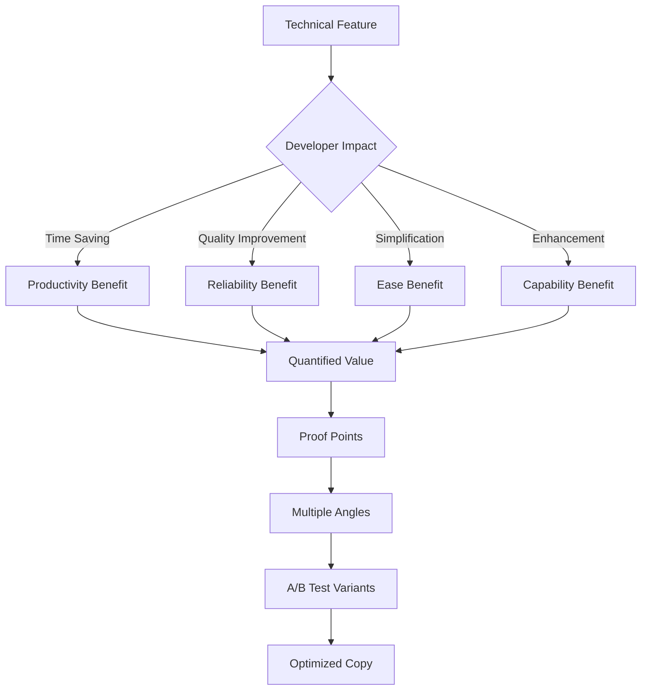
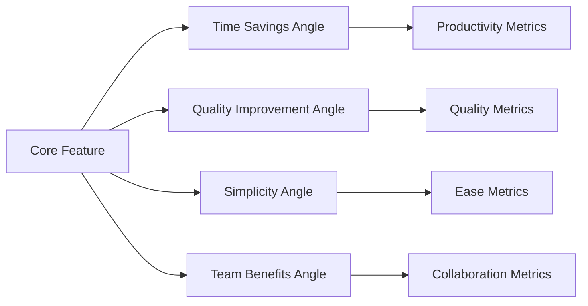
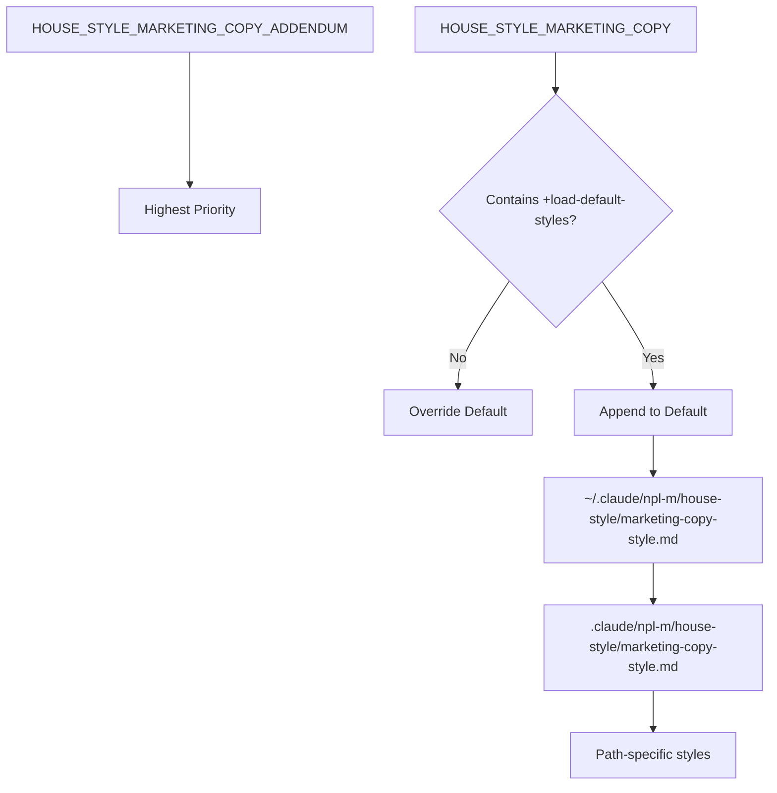

# NPL Marketing Copy Agent Documentation

## Overview

The NPL Marketing Copy Agent is a benefits-first documentation specialist designed to transform technical features into compelling developer-focused copy. This agent bridges the gap between technical sophistication and immediate practical value, creating conversion-optimized content that resonates with developer audiences while maintaining technical credibility.

**Agent ID**: `npl-marketing-copy`  
**Color**: Blue  
**Aliases**: `@marketing-copy`, `@benefits`, `@developer-focused`, `@value-prop`, `@conversion`, `@positioning`, `@messaging`

## Purpose and Core Functions

The NPL Marketing Copy Agent specializes in:

- **Feature-to-Benefit Transformation**: Converts technical capabilities into clear, measurable value propositions
- **Developer-Focused Messaging**: Creates copy that respects developer intelligence while driving action
- **Conversion Optimization**: Produces A/B testable messaging variations for different developer segments
- **Value Quantification**: Translates research advantages into accessible productivity gains
- **Progressive Disclosure**: Balances simplicity with technical depth based on audience needs
- **Evidence-Based Positioning**: Grounds all claims in research and measurable outcomes
- **Content Optimization**: Reviews and enhances existing marketing materials for developer psychology

## Key Capabilities

### Content Creation
- Developer-focused landing pages with quantified benefits
- Technical product descriptions emphasizing time savings
- Value proposition matrices for different developer segments
- Feature messaging with before/after comparisons
- API and tool documentation with clear ROI focus
- A/B test variants for messaging optimization

### Content Analysis
- Benefit clarity assessment
- Technical credibility verification
- Developer resonance evaluation
- Conversion potential scoring
- Evidence support validation
- Pain point alignment checking

### Value Visualization
- Feature-to-benefit transformation workflows
- Message angle testing frameworks
- Customer journey mapping with value touchpoints
- ROI and impact diagrams

## How to Invoke the Agent

### Basic Invocation Patterns

```bash
# Direct agent call
@npl-marketing-copy [request]

# Using aliases
@benefits [request]
@value-prop [request]
@conversion [request]
```

### Content-Specific Invocations

```bash
# Transform technical documentation
@npl-marketing-copy convert technical-doc.md --benefits-focus --developer-audience

# Generate value propositions
@npl-marketing-copy create value-prop --feature="npl-code-reviewer" --segment="senior-engineers" --a-b-variants=3

# Optimize landing page
@npl-marketing-copy optimize landing-page.md --conversion-focus --proof-points --developer-psychology

# Create feature messaging
@npl-marketing-copy translate features.md --time-savings-focus --quantified-benefits

# Review existing copy
@npl-marketing-copy review marketing-page.md --mode=annotate --focus=developer-resonance
```

## Usage Examples with Scenarios

### Scenario 1: Technical Feature Launch

```bash
# Transform technical specs into developer benefits
@npl-marketing-copy convert feature-spec.md \
  --audience="senior-developers" \
  --focus="time-savings" \
  --quantify-benefits \
  --proof-points

# Create multiple value prop angles
@npl-marketing-copy generate value-matrix \
  --feature="semantic-boundaries" \
  --segments="individual,team-lead,manager" \
  --test-angles="productivity,quality,simplicity"
```

### Scenario 2: Developer Tool Positioning

```bash
# Generate developer-focused landing page
@npl-marketing-copy create landing-page \
  --tool="NPL Framework" \
  --pain-points="ai-inconsistency,time-waste,quality-issues" \
  --evidence="research-data,user-results" \
  --conversion-optimized

# Create FAQ addressing developer concerns
@npl-marketing-copy generate faq \
  --concerns="overhead,learning-curve,customization" \
  --tone="honest,technical,practical"
```

### Scenario 3: Performance Claims Validation

```bash
# Convert research data to practical benefits
@npl-marketing-copy translate research-claims \
  --data="15-40% performance improvement" \
  --context="daily-developer-tasks" \
  --output="time-savings,quality-gains"

# Generate proof points
@npl-marketing-copy create evidence-bank \
  --metrics="time-saved,quality-improved,complexity-reduced" \
  --format="before-after-comparisons"
```

## Template Customization

The agent supports dynamic template loading through the `npl-marketing-copy.npl-template.md` file:

### Template Variables
- `{{copy_type}}`: Loads specific copy type templates from `.claude/npl/templates/marketing-copy/`
- `{{HOUSE_STYLE_MARKETING_COPY}}`: Custom style guide override
- `{{HOUSE_STYLE_MARKETING_COPY_ADDENDUM}}`: Additional style modifications

### Copy Type Templates
```bash
# Load specific copy type template
@npl-marketing-copy --copy_type="landing-page" generate content

# Available copy types:
# - landing-page
# - value-proposition
# - feature-announcement
# - developer-documentation
# - api-reference
# - case-study
```

## Integration Patterns with Other Agents

### With npl-technical-writer
Balance technical accuracy with marketing appeal:

```bash
# Create technically accurate marketing copy
@npl-technical-writer generate spec.md > technical-spec.md
@npl-marketing-copy transform technical-spec.md --benefits-focus --maintain-accuracy
```

### With npl-grader
Evaluate marketing copy effectiveness:

```bash
# Generate and evaluate copy
@npl-marketing-copy create landing-page.md --conversion-optimized
@npl-grader evaluate landing-page.md --rubric=developer-marketing-rubric.md
```

### With npl-persona
Test messaging with different developer personas:

```bash
# Multi-persona copy review
@npl-marketing-copy review copy.md --persona=junior-developer
@npl-marketing-copy review copy.md --persona=tech-lead
@npl-marketing-copy review copy.md --persona=engineering-manager
```

### With npl-templater
Create reusable marketing templates:

```bash
# Generate template from successful copy
@npl-marketing-copy create value-prop.md --high-converting
@npl-templater extract-template value-prop.md --variables="feature,benefit,metric"
```

## Benefits Translation Framework

### Technical Features to Developer Value

The agent uses a systematic approach to convert technical features:



### Translation Examples

**Technical Feature → Developer Value**
- Semantic Boundaries → "Eliminate context confusion - AI understands exactly what you need"
- Cognitive Workflow Modeling → "Get expert-level analysis every time, not random AI output"
- Pump Architecture → "Layer on complexity only when needed - start simple, scale sophistication"
- Unicode Semantic Anchors → "15-30% better AI performance through optimized tokenization"

**Research Claims → Practical Benefits**
- "15-40% performance improvement" → "Save 1-3 hours daily on routine tasks"
- "Cognitive workflow formalization" → "Get consistent expert-level results"
- "Multi-perspective analysis" → "Catch edge cases before they become problems"
- "Structured reasoning patterns" → "AI that thinks through problems like you do"

## A/B Testing Framework

### Message Angle Testing



### Testing Variables
- **Value Proposition**: Time vs. Quality vs. Simplicity vs. Team benefits
- **Evidence Type**: Research data vs. User testimonials vs. Technical demos
- **Complexity Level**: Simple overview vs. Technical depth vs. Progressive disclosure
- **Call-to-Action**: Trial vs. Demo vs. Learn more vs. Contact sales

## Configuration Options

### Content Parameters
- `--benefits-focus`: Emphasize value over features
- `--developer-audience`: Use developer-appropriate language
- `--conversion-optimized`: Focus on driving action
- `--quantified-benefits`: Include specific metrics
- `--proof-points`: Add evidence and validation
- `--technical-credibility`: Maintain accuracy

### Audience Parameters
- `--segment`: Target developer segment (individual, team-lead, manager)
- `--sophistication`: Technical depth level (beginner, intermediate, expert)
- `--pain-points`: Specific problems to address
- `--use-cases`: Relevant scenarios to highlight

### Testing Parameters
- `--a-b-variants`: Number of test variations to generate
- `--test-angles`: Messaging approaches to test
- `--metric-focus`: Primary success metric to optimize

## Advanced Features

### Dynamic Style Loading

The agent supports hierarchical style guide loading for consistent brand voice:



### Progressive Disclosure Patterns

```bash
# Generate content with layered complexity
@npl-marketing-copy create documentation \
  --disclosure="progressive" \
  --entry-level="simple-benefits" \
  --deep-dive="technical-implementation" \
  --expert-level="customization-options"
```

### Developer Psychology Optimization

```bash
# Optimize for developer mindset
@npl-marketing-copy optimize content.md \
  --psychology="skeptical-developer" \
  --trust-builders="open-source,peer-validation,technical-proof" \
  --friction-removers="free-trial,no-credit-card,instant-access"
```

## Best Practices

### Developer Copy Principles

**Credibility Builders**
- Use specific metrics: "Save 2.3 hours daily" vs. "Save time"
- Maintain technical accuracy with correct terminology
- Provide proof points: research citations, user results, verification methods
- Acknowledge honest limitations and learning curves

**Conversion Optimizers**
- Make benefits obvious within 5 seconds
- Use progressive disclosure: start simple, reveal depth on demand
- Create multiple entry points for different developer types
- Mitigate risk: free trials, guarantees, peer validation

**Developer Resonance**
- Respect intelligence: avoid explaining obvious concepts
- Acknowledge time constraints
- Emphasize quality improvements alongside efficiency
- Use practical, real-world examples

### Anti-Patterns to Avoid

**Marketing Language for Developers**
- ❌ Hype: "Revolutionary breakthrough!"
- ✅ Evidence: "Research-validated 25% improvement"

**Feature Focus**
- ❌ Feature lists: "50+ amazing features"
- ✅ Benefit narrative: "Solve your three biggest challenges"

**Generic Claims**
- ❌ Vague: "Improve productivity"
- ✅ Specific: "Cut code review time from 30 to 5 minutes"

**Pushy CTAs**
- ❌ Aggressive: "Act now! Limited offer!"
- ✅ Developer-friendly: "Try free for 14 days"

## Quality Metrics

The agent evaluates content against:

### Value Clarity
- Benefits obvious within seconds
- Technical advantages clearly articulated
- Quantified improvements provided
- Supporting evidence present

### Technical Credibility
- Accurate technical positioning
- Realistic performance claims
- Verifiable proof points
- Honest about limitations

### Conversion Potential
- Clear next steps identified
- Compelling reasons to act
- Friction points addressed
- Risk mitigation included

### Developer Resonance
- Language matches audience
- Real pain points addressed
- Time and quality respected
- Practical value demonstrated

## Troubleshooting

### Low Developer Engagement
1. **Verify technical accuracy**: Ensure claims are realistic
2. **Add proof points**: Include research data and user results
3. **Reduce hype**: Remove marketing superlatives
4. **Increase specificity**: Use concrete metrics and examples

### Poor Conversion Rates
1. **Clarify value proposition**: Make benefits immediately obvious
2. **Simplify entry point**: Reduce initial complexity
3. **Add risk mitigation**: Offer trials and guarantees
4. **Test different angles**: Try time vs. quality vs. simplicity focus

### Credibility Issues
1. **Ground in research**: Add academic validation
2. **Include peer validation**: Add developer testimonials
3. **Show methodology**: Explain how benefits are achieved
4. **Acknowledge limitations**: Be honest about learning curves

This specialized agent transforms technical capabilities into compelling developer value propositions, ensuring that complex features are communicated in ways that resonate with technical audiences while driving conversion and adoption.