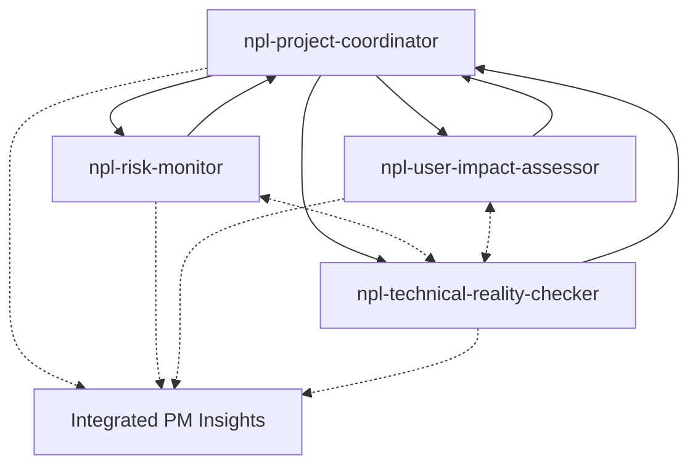

# Project Management Agents

The project management agent category provides specialized NPL agents for comprehensive project oversight, risk assessment, and stakeholder management. These agents work together to ensure projects stay on track, identify potential issues early, and maintain alignment between technical implementation and business objectives.

## Agent Overview

### 1. npl-project-coordinator
**Purpose**: Central coordination hub for project management activities  
**Key Functions**:
- Sprint planning and backlog management
- Resource allocation and timeline tracking
- Cross-team coordination and dependency management
- Progress monitoring and reporting
- Stakeholder communication facilitation

### 2. npl-risk-monitor
**Purpose**: Proactive identification and mitigation of project risks  
**Key Functions**:
- Technical debt assessment and tracking
- Dependency risk analysis
- Schedule and budget risk evaluation
- Security and compliance risk monitoring
- Risk mitigation strategy development

### 3. npl-user-impact-assessor
**Purpose**: Evaluating changes from end-user and stakeholder perspectives  
**Key Functions**:
- User experience impact analysis
- Feature adoption prediction
- Stakeholder satisfaction assessment
- Change management planning
- User feedback integration

### 4. npl-technical-reality-checker
**Purpose**: Validating technical feasibility and implementation approaches  
**Key Functions**:
- Architecture decision validation
- Performance impact assessment
- Technical debt evaluation
- Implementation complexity analysis
- Best practices compliance checking

## How These Agents Work Together

The project management agents form an integrated system for comprehensive project oversight:



### Collaborative Workflow
1. **Project Coordinator** orchestrates overall project activities and delegates specific assessments
2. **Risk Monitor** identifies potential issues and feeds them back to the coordinator
3. **User Impact Assessor** evaluates stakeholder implications of proposed changes
4. **Technical Reality Checker** validates feasibility and provides implementation guidance

## Templaterized Customization

All project management agents support NPL templaterization for domain-specific customization:

```yaml
customization_points:
  - Project methodology (Agile, Waterfall, Hybrid)
  - Industry vertical (FinTech, Healthcare, E-commerce)
  - Team structure (Distributed, Co-located, Matrix)
  - Regulatory requirements (GDPR, HIPAA, SOX)
  - Technology stack specifics
```

## Common Usage Scenarios

### Sprint Planning Session
```bash
# Coordinate sprint planning with risk assessment
@npl-project-coordinator plan-sprint --backlog=current --capacity=team
@npl-risk-monitor assess --sprint-plan=proposed --identify=blockers
@npl-technical-reality-checker validate --stories=selected --effort=estimated
```

### Feature Impact Analysis
```bash
# Assess new feature implementation
@npl-user-impact-assessor evaluate --feature=payment-redesign --users=all-segments
@npl-technical-reality-checker review --implementation=proposed --dependencies=current
@npl-risk-monitor analyze --change=payment-system --impact=downstream
```

### Project Health Check
```bash
# Comprehensive project status review
@npl-project-coordinator status --project=q4-release --metrics=all
@npl-risk-monitor scan --horizon=30-days --severity=all
@npl-user-impact-assessor feedback --period=last-sprint --sentiment=analyze
@npl-technical-reality-checker audit --codebase=current --debt=assess
```

### Stakeholder Reporting
```bash
# Generate executive summary
@npl-project-coordinator report --type=executive --period=monthly
@npl-risk-monitor summary --risks=top-5 --mitigation=included
@npl-user-impact-assessor metrics --satisfaction=current --trends=quarterly
```

### Release Planning
```bash
# Coordinate release preparation
@npl-project-coordinator release-plan --version=2.0 --timeline=q1
@npl-technical-reality-checker dependencies --check=external --validate=versions
@npl-risk-monitor release-risks --environment=production --rollback=plan
@npl-user-impact-assessor migration --impact=users --communication=draft
```

## Integration Patterns

### With Development Agents
```bash
# Coordinate with code review and testing
@npl-project-coordinator integrate --with=npl-code-reviewer --phase=review
@npl-technical-reality-checker validate --with=npl-qa-tester --coverage=required
```

### With Communication Agents
```bash
# Generate stakeholder communications
@npl-user-impact-assessor prepare --for=npl-technical-writer --audience=end-users
@npl-project-coordinator brief --for=npl-communication-specialist --update=weekly
```

### With Analysis Agents
```bash
# Deep technical analysis
@npl-risk-monitor collaborate --with=npl-security-auditor --focus=vulnerabilities
@npl-technical-reality-checker pair --with=npl-performance-analyst --bottlenecks=identify
```

## Best Practices

1. **Regular Cadence**: Run project management agents on a consistent schedule (daily standups, weekly reviews, sprint boundaries)

2. **Cross-Agent Validation**: Use multiple agents to validate critical decisions
   - Technical changes: Reality Checker + Risk Monitor
   - User-facing changes: Impact Assessor + Coordinator
   - Major milestones: All four agents

3. **Customization**: Tailor agents to your specific project context using NPL templates

4. **Feedback Loops**: Establish clear feedback mechanisms between agents and human project managers

5. **Documentation**: Maintain agent-generated reports and assessments for project history

## Configuration Examples

### Agile Team Configuration
```npl
{{#with project_config}}
  methodology: scrum
  sprint_length: 2_weeks
  team_size: 8
  ceremonies: [standup, planning, review, retro]
{{/with}}
```

### Enterprise Project Configuration
```npl
{{#with compliance}}
  frameworks: [ISO27001, SOC2]
  audit_frequency: quarterly
  documentation_level: comprehensive
{{/with}}
```

## Individual Agent Documentation

For detailed information about each agent:

- [npl-project-coordinator.md](./npl-project-coordinator.md) - Full coordinator agent specification
- [npl-risk-monitor.md](./npl-risk-monitor.md) - Risk monitoring and mitigation details
- [npl-user-impact-assessor.md](./npl-user-impact-assessor.md) - User impact analysis framework
- [npl-technical-reality-checker.md](./npl-technical-reality-checker.md) - Technical validation processes

## Quick Start Template

```bash
# Initialize project management suite for your project
export PROJECT_NAME="my-project"
export PM_METHODOLOGY="agile"
export TEAM_SIZE=10

# Run comprehensive project assessment
@npl-project-coordinator init --project=$PROJECT_NAME --methodology=$PM_METHODOLOGY
@npl-risk-monitor baseline --project=$PROJECT_NAME --scan=full
@npl-user-impact-assessor profile --stakeholders=identify --requirements=gather
@npl-technical-reality-checker inventory --stack=current --dependencies=map

# Generate initial project plan
@npl-project-coordinator plan --roadmap=generate --milestones=define
```

## Metrics and KPIs

The project management agents track and report on key metrics:

- **Velocity Trends** (Coordinator)
- **Risk Exposure Score** (Risk Monitor)  
- **User Satisfaction Index** (Impact Assessor)
- **Technical Debt Ratio** (Reality Checker)
- **On-Time Delivery Rate** (Coordinator)
- **Defect Escape Rate** (Risk Monitor)
- **Feature Adoption Rate** (Impact Assessor)
- **Code Quality Metrics** (Reality Checker)

## Support and Contribution

These agents are part of the Noizu PromptLingo ecosystem. For support, feature requests, or contributions:

- Review the [NPL documentation](../../../README.md)
- Check agent-specific documentation files
- Contribute templates and customizations via pull requests
- Share usage patterns and best practices with the community