# NPL Validator Agent Documentation

## Overview

The NPL Validator Agent is a critical quality assurance specialist that ensures the syntactic and semantic correctness of NPL prompts, agent definitions, and workflows. Built on the Noizu Prompt Lingo framework, it provides comprehensive validation through lexical analysis, semantic verification, edge case testing, and actionable error reporting. This agent is essential for maintaining production-ready NPL implementations and preventing runtime failures.

## Purpose and Core Value

The npl-validator agent transforms manual syntax checking into automated, comprehensive validation that ensures NPL compliance and reliability. It serves as a quality gate that:

- Prevents malformed NPL syntax from reaching production
- Identifies semantic issues before runtime failures occur
- Provides immediate feedback with specific correction suggestions
- Scales validation across large prompt libraries and agent ecosystems
- Maintains NPL standard compliance across versions and teams

## Key Capabilities

### Comprehensive Validation Framework
- **Lexical Analysis**: Unicode symbol recognition, structure validation, encoding verification
- **Syntax Parsing**: NPL element validation (`⟪⟫`, `⩤⩥`, `↦`, `@flags`), nesting verification
- **Semantic Analysis**: Reference resolution, flag scoping, template binding validation
- **Edge Case Testing**: Boundary conditions, circular references, performance limits
- **Error Reporting**: Actionable remediation steps with specific examples

### Validation Domains
The agent excels at validating:

- **NPL Syntax**: Unicode symbols, nesting structures, directive formatting
- **Agent Definitions**: Proper agent declarations, capability specifications, pump integrations
- **Template Bindings**: Variable resolution, conditional logic, hydration compatibility
- **Cross-References**: Agent references, template inclusions, dependency chains
- **Performance Impact**: Parse complexity, memory usage, execution efficiency

## How to Invoke the Agent

### Basic Usage
```bash
# Validate a single NPL prompt file
@npl-validator validate prompt.md

# Validate with specific NPL version
@npl-validator validate agent-definition.md --version=1.0

# Validate directory of prompts
@npl-validator validate src/prompts/

# Validate with custom rules
@npl-validator validate . --rules=.claude/validation-rules.yaml
```

### Advanced Validation Options
```bash
# Strict validation mode
@npl-validator validate src/ --strict --version=1.0

# Auto-fix correctable issues
@npl-validator validate prompts/ --fix --format=json

# Edge case focused validation
@npl-validator validate agent.md --mode=edge-case

# CI/CD integration with JUnit output
@npl-validator validate . --format=junit-xml --baseline=main

# Performance impact assessment
@npl-validator validate large-prompt.md --mode=performance --max-size=1000
```

## Template-Based Customization

The npl-validator agent supports project-specific customization through its NPL template system. This allows teams to define custom validation rules, edge cases, and success metrics tailored to their specific requirements.

### Template Configuration Example
```yaml
# .claude/npl-validator-config.yaml
project_validation_config: ".claude/custom-validation.yaml"
syntax_accuracy_threshold: 98
false_positive_threshold: 2
max_prompt_size: 1000
supported_versions: ["0.5", "1.0", "1.1"]

custom_edge_cases:
  - description: "Large nested agent hierarchies"
    test_scenario: "Agents with >5 levels of nesting"
  - description: "Multi-language template mixing"
    test_scenario: "Templates mixing English/Spanish prompts"

project_success_metrics:
  - metric_name: "Agent Definition Validation"
    target_value: 100
    metric_unit: "% success rate"
  - metric_name: "Template Hydration Accuracy"
    target_value: 99.5
    metric_unit: "% correctness"

validation_workflow: |
  1. Pre-commit: Run syntax validation on changed files
  2. CI Pipeline: Full validation suite with edge case testing
  3. Release: Comprehensive validation against all supported versions
```

### Applying Template Configuration
```bash
# Use template with custom configuration
@npl-validator validate src/ --template-config=.claude/npl-validator-config.yaml

# Override template variables directly
@npl-validator validate prompt.md --syntax-accuracy-threshold=99 --max-prompt-size=2000
```

## Validation Process Workflow

```mermaid
flowchart TD
    A[📄 Input Content] --> B[🔍 Lexical Analysis]
    B --> C[🧩 Syntax Parsing]
    C --> D[🔗 Semantic Analysis]
    D --> E[⚠️ Edge Case Testing]
    E --> F[📋 Error Collection]
    F --> G[💡 Suggestion Generation]
    G --> H[📊 Validation Report]
    
    subgraph "NPL Pump Integration"
        I[npl-intent: Context Analysis]
        J[npl-critique: Issue Detection]
        K[npl-reflection: Risk Assessment]
        L[npl-rubric: Scoring Framework]
    end
    
    B --> I
    D --> J
    E --> K
    F --> L
```



## Integration Patterns

### Continuous Integration Pipeline
```yaml
# GitHub Actions example
name: NPL Validation
on: [push, pull_request]
jobs:
  validate-npl:
    runs-on: ubuntu-latest
    steps:
      - uses: actions/checkout@v2
      - name: Validate NPL Syntax
        run: |
          @npl-validator validate . \
            --format=junit-xml \
            --strict \
            --rules=.claude/validation-rules.yaml \
            > validation-report.xml
      - name: Upload Validation Report
        uses: actions/upload-artifact@v2
        with:
          name: validation-report
          path: validation-report.xml
```

### Pre-commit Hook Integration
```bash
#!/bin/bash
# .git/hooks/pre-commit
echo "Running NPL validation..."
@npl-validator validate --changed-only --fix
if [ $? -ne 0 ]; then
  echo "NPL validation failed. Please fix issues before committing."
  exit 1
fi
```

### Multi-Agent Validation Workflow
```bash
# Comprehensive validation with multiple agents
@npl-validator validate src/ --mode=syntax
@npl-grader evaluate src/ --rubric=npl-quality.md
@npl-thinker analyze validation-report.json --focus=semantic-issues

# Template-driven validation
@npl-templater generate validation-rules --type=project-specific
@npl-validator validate . --rules=generated-rules.yaml
```

## Example Usage Scenarios

### Scenario 1: Agent Definition Validation

**Context**: Validating a complex agent definition with multiple NPL pumps and template variables.

```bash
# Create agent definition with potential issues
cat > test-agent.md << 'EOF'
⌜test-agent|tester|NPL@1.0⌝
# Test Agent
@tester validate test

<npl-intent>
intent:
  purpose: {{undefined_variable}}
  scope: [missing closing bracket
</npl-intent>

⟪invalid nesting ⟪double nest⟫
EOF

# Run validation
@npl-validator validate test-agent.md --strict --format=standard
```

**Expected Output**:
```markdown
# NPL Validation Report: test-agent.md

## Executive Summary
INVALID - Multiple syntax and semantic violations detected requiring immediate correction.

## Syntax Analysis
### ❌ Syntax Violations
- **Issue**: Line 7 - Unclosed bracket in array definition
  - **Suggestion**: Add closing bracket ']' after "missing closing bracket"
  - **Example**: `scope: [missing closing bracket]`

- **Issue**: Line 10 - Improper nesting of ⟪⟫ symbols
  - **Suggestion**: Close outer delimiter before opening inner
  - **Example**: `⟪invalid nesting⟫ ⟪double nest⟫`

## Semantic Analysis
### ⚠️ Semantic Issues
- **Issue**: Undefined template variable: {{undefined_variable}}
  - **Risk Level**: High
  - **Remediation**: Define variable in template configuration or replace with literal value

## Overall Assessment
**Status**: INVALID
**Confidence**: High
**Critical Issues**: 2 requiring immediate attention
**Total Issues**: 3 identified

## Priority Actions
1. Fix unclosed bracket on line 7
2. Correct improper nesting on line 10
3. Define or remove undefined template variable
```

### Scenario 2: Large-Scale Prompt Library Validation

**Context**: Validating an entire directory of NPL prompts with custom project rules.

```bash
# Create custom validation rules
cat > .claude/validation-rules.yaml << 'EOF'
version: 1.0
rules:
  max_nesting_depth: 3
  required_pumps: [npl-intent, npl-rubric]
  forbidden_symbols: ["⫷⫸"]
  max_prompt_size_kb: 500
  
edge_cases:
  - name: "Deep nesting check"
    pattern: "⟪.*⟪.*⟪.*⟪"
    severity: error
    
performance:
  max_parse_time_ms: 100
  max_memory_mb: 50
EOF

# Run validation across directory
@npl-validator validate src/prompts/ \
  --rules=.claude/validation-rules.yaml \
  --format=json \
  --strict
```

### Scenario 3: CI/CD Integration with Baseline Comparison

**Context**: Automated validation in deployment pipeline comparing against previous release.

```bash
# Validate and compare with baseline
@npl-validator validate . \
  --baseline=v1.0.0 \
  --format=junit-xml \
  --rules=.claude/production-rules.yaml \
  > validation-results.xml

# Generate improvement report
@npl-validator compare-validation \
  --current=validation-results.xml \
  --baseline=baseline-v1.0.0.xml \
  --format=markdown
```

**Comparison Output**:
```markdown
# Validation Comparison Report

## Improvement Summary
- **New Issues**: 2 introduced since v1.0.0
- **Fixed Issues**: 5 resolved since v1.0.0
- **Total Issues**: 8 (down from 11)

## Quality Metrics
| Metric | v1.0.0 | Current | Change |
|--------|--------|---------|--------|
| Syntax Accuracy | 94% | 97% | +3% ↑ |
| False Positives | 6% | 3% | -3% ↓ |
| Validation Time | 35s | 28s | -7s ↓ |

## New Issues Requiring Attention
1. **File**: src/agents/new-agent.md
   - Undefined template variable: {{new_config}}
2. **File**: prompts/experimental.md
   - Circular reference detected in template expansion
```

## Validation Categories and Rules

### Lexical Validation Rules
```yaml
unicode_symbols:
  - symbol: "⟪⟫"
    purpose: "Variable declaration delimiters"
    validation: "Must be properly paired and nested"
  - symbol: "⩤⩥"
    purpose: "Entity blocks"
    validation: "Must contain valid entity definitions"
  - symbol: "↦"
    purpose: "Mapping operator"
    validation: "Must have left and right operands"

encoding:
  - requirement: "UTF-8 encoding required"
  - fallback: "ASCII with Unicode escape sequences"
```

### Semantic Validation Rules
```yaml
references:
  agent_references:
    - pattern: "@[a-z-]+"
    - validation: "Must reference defined agent"
  template_variables:
    - pattern: "{{[a-zA-Z_][a-zA-Z0-9_]*}}"
    - validation: "Must be defined in template config"
  flag_scoping:
    - pattern: "@flag:scope"
    - validation: "Scope must be valid context"

dependencies:
  circular_detection:
    - max_depth: 10
    - error_on_cycle: true
  version_compatibility:
    - check_npl_version: true
    - check_agent_versions: true
```

## Configuration and Customization

### Available Parameters

| Parameter | Description | Values | Default |
|-----------|-------------|--------|---------|
| `--strict` | Apply strict validation rules | Boolean | false |
| `--version` | NPL version to validate against | 0.5, 1.0, 1.1 | 1.0 |
| `--format` | Output format | standard, json, junit-xml | standard |
| `--rules` | Custom validation ruleset | File path | Built-in rules |
| `--fix` | Auto-fix correctable issues | Boolean | false |
| `--baseline` | Baseline for comparison | Version/branch | None |
| `--mode` | Validation focus | syntax-only, full, edge-case, performance | full |
| `--max-size` | Maximum prompt size (KB) | Number | 500 |

### Custom Validation Rules

**Creating Project-Specific Rules**:
```yaml
# .claude/custom-validation.yaml
version: 1.0
metadata:
  project: "MyNPLProject"
  team: "AI Engineering"
  
syntax_rules:
  required_headers:
    - "# Agent Name"
    - "## Purpose"
  forbidden_patterns:
    - pattern: "TODO|FIXME"
      severity: warning
      message: "Unresolved TODO/FIXME comments"
  
semantic_rules:
  required_pumps:
    all_agents: [npl-intent]
    qa_agents: [npl-rubric, npl-critique]
  template_constraints:
    max_variables: 20
    naming_convention: "snake_case"
    
performance_rules:
  max_prompt_size_kb: 1000
  max_parse_time_ms: 200
  max_nesting_depth: 5
  
edge_cases:
  - name: "Excessive nesting"
    test: "Check for >5 levels of nested structures"
    action: "error"
  - name: "Large variable count"
    test: "Templates with >50 variables"
    action: "warning"
```

## Output Formats

### Standard Validation Report
Comprehensive human-readable report with executive summary, detailed findings, and actionable recommendations.

### JSON Format
```json
{
  "validation": {
    "file": "agent.md",
    "timestamp": "2024-01-15T10:30:00Z",
    "npl_version": "1.0",
    "status": "INVALID",
    "summary": {
      "total_issues": 5,
      "critical": 2,
      "warnings": 3,
      "info": 0
    },
    "issues": [
      {
        "type": "syntax",
        "severity": "critical",
        "location": {"line": 10, "column": 15},
        "message": "Unclosed delimiter ⟪",
        "suggestion": "Add closing delimiter ⟫",
        "auto_fixable": true
      }
    ],
    "metrics": {
      "validation_time_ms": 145,
      "file_size_kb": 25,
      "complexity_score": 3.2
    }
  }
}
```

### JUnit XML Format
Compatible with CI/CD systems for test result tracking:
```xml
<?xml version="1.0" encoding="UTF-8"?>
<testsuite name="NPL Validation" tests="10" failures="2" errors="0" time="0.145">
  <testcase name="Syntax Validation: agent.md" classname="npl.validator" time="0.025">
    <failure message="Unclosed delimiter at line 10" type="SyntaxError">
      Location: Line 10, Column 15
      Suggestion: Add closing delimiter ⟫
    </failure>
  </testcase>
</testsuite>
```

## Best Practices

### Effective Validation Strategy
1. **Early Validation**: Integrate validation in pre-commit hooks and IDE plugins
2. **Progressive Enhancement**: Start with syntax validation, then add semantic checks
3. **Custom Rules Evolution**: Refine validation rules based on common issues
4. **Baseline Tracking**: Maintain validation baselines for quality trends
5. **Team Alignment**: Share validation configurations across development teams

### Common Pitfalls and Solutions

**Issue**: High false positive rate
- **Solution**: Tune validation rules to project conventions
- **Prevention**: Use `--false-positive-threshold` parameter

**Issue**: Validation performance on large codebases
- **Solution**: Use `--mode=syntax-only` for quick checks
- **Prevention**: Implement incremental validation on changed files

**Issue**: Inconsistent validation across environments
- **Solution**: Version-lock validation rules and NPL versions
- **Prevention**: Use containerized validation environments

### Integration with Development Workflow
1. **IDE Integration**: Configure real-time validation in VS Code/IntelliJ
2. **Git Hooks**: Prevent commits with validation errors
3. **PR Checks**: Automated validation on pull requests
4. **Release Gates**: Mandatory validation before deployments
5. **Monitoring**: Track validation metrics over time

## Troubleshooting

### Common Validation Errors

**Unicode Symbol Issues**:
- **Error**: "Invalid Unicode character at position X"
- **Cause**: Incorrect encoding or copy-paste issues
- **Fix**: Ensure UTF-8 encoding, use proper Unicode input methods

**Template Variable Resolution**:
- **Error**: "Undefined template variable: {{variable}}"
- **Cause**: Variable not defined in configuration
- **Fix**: Add variable to template config or use default value syntax

**Circular References**:
- **Error**: "Circular reference detected in template expansion"
- **Cause**: Templates referencing each other in a loop
- **Fix**: Refactor template structure to break circular dependency

**Performance Limits**:
- **Error**: "Validation timeout exceeded"
- **Cause**: Complex nested structures or large file size
- **Fix**: Simplify structure or increase timeout limits

## Success Metrics

The npl-validator agent maintains high quality standards:

- **Syntax Error Detection**: 95%+ accuracy in identifying malformed NPL
- **False Positive Rate**: <5% for valid NPL syntax
- **Validation Speed**: <30 seconds for 500KB prompt files
- **Error Message Quality**: 100% of errors include actionable fixes
- **Auto-fix Success**: 80%+ of syntax issues automatically correctable

## Advanced Features

### Auto-Fix Capabilities
```bash
# Automatically fix common issues
@npl-validator validate src/ --fix --backup

# Preview fixes without applying
@npl-validator validate src/ --fix --dry-run
```

### Validation Plugins
```bash
# Use custom validation plugin
@npl-validator validate . --plugin=security-validator

# Chain multiple plugins
@npl-validator validate . --plugins=security,performance,accessibility
```

### Incremental Validation
```bash
# Validate only changed files
@npl-validator validate --changed-only --since=HEAD~3

# Watch mode for continuous validation
@npl-validator watch src/ --on-change=validate
```

The NPL Validator Agent provides essential quality assurance for NPL implementations, ensuring syntax correctness, semantic validity, and production readiness. Through its comprehensive validation framework, customizable rules, and actionable error reporting, it maintains the integrity and reliability of NPL-based systems while enabling teams to scale their prompt engineering efforts with confidence.