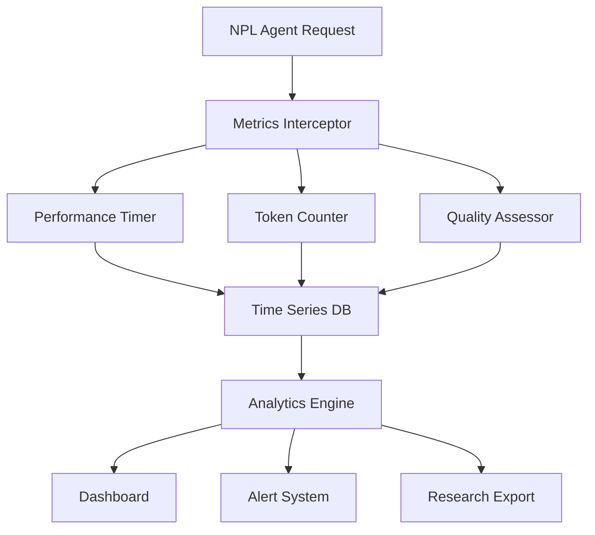

# NPL Performance Monitor Agent Documentation

## Overview

The NPL Performance Monitor Agent is a specialized measurement and analysis system that provides real-time metrics collection, statistical benchmarking, and A/B testing capabilities for NPL systems. Built on empirical research frameworks, it quantifies the documented 15-40% performance improvements achievable through structured prompting methodologies.

## Purpose and Core Value

The npl-performance-monitor agent transforms subjective performance assessments into rigorous, data-driven evaluations. It serves as both a real-time monitoring system and a research validation framework that can:

- Quantify latency, token usage, and quality improvements with statistical rigor
- Execute controlled A/B tests for prompt optimization experiments
- Generate academic-grade reports supporting research publications
- Detect performance regressions within minutes of deployment
- Provide actionable insights for continuous optimization
- Validate empirical claims with proper statistical significance

## Key Capabilities

### Measurement Framework
- **Real-time Metrics Collection**: Sub-second latency tracking with minimal overhead (<1%)
- **Statistical Benchmarking**: Before/after comparisons with confidence intervals
- **A/B Testing Platform**: Controlled experiments with power analysis
- **Quality Scoring**: Multi-dimensional assessment across accuracy, relevance, and completeness
- **Research Validation**: Academic publication-ready data collection and analysis

### Performance Categories
The agent excels at measuring:

- **Latency Metrics**: P50, P95, P99 response times, TTFT, processing pipeline breakdown
- **Token Efficiency**: Input/output ratios, context utilization, syntax overhead
- **Quality Benchmarks**: Task completion rates, accuracy scores, user satisfaction
- **Cognitive Load**: Learning curves, error recovery patterns, feature adoption rates

## How to Invoke the Agent

### Basic Performance Monitoring
```bash
# Start monitoring session
@npl-performance-monitor start --experiment="NPL-validation-v1"

# Monitor specific agent performance
@npl-performance-monitor track agent=npl-grader duration=1h

# Generate performance report
@npl-performance-monitor report --format=dashboard --timerange=7d

# Export metrics for analysis
@npl-performance-monitor export --metrics=latency,tokens --format=csv
```

### A/B Testing Setup
```bash
# Initialize controlled experiment
@npl-performance-monitor experiment create \
  --name="Prompt-Optimization-Study" \
  --control="standard-prompts" \
  --treatment="npl-enhanced" \
  --metrics="quality,latency,tokens" \
  --duration=14d \
  --sample-size=1000

# Monitor experiment progress
@npl-performance-monitor experiment status --id=exp_001

# Analyze results with statistical significance
@npl-performance-monitor experiment analyze \
  --id=exp_001 \
  --significance=0.05 \
  --corrections=bonferroni
```

### Research Validation
```bash
# Generate academic dataset
@npl-performance-monitor research-package \
  --study="NPL-Performance-Validation" \
  --format="JAIR-submission" \
  --include="raw-data,analysis-code,reproducibility-guide"

# Validate performance claims
@npl-performance-monitor validate-claims \
  --hypothesis="15-40% improvement" \
  --confidence=95 \
  --power=80

# Generate publication-ready figures
@npl-performance-monitor visualize \
  --data=experiment_001 \
  --plots="distribution,time-series,correlation" \
  --format=eps
```

## Template Customization

The npl-performance-monitor supports templaterized configuration through `npl-performance-monitor.npl-template.md`, enabling project-specific customization:

### Custom Metrics Definition
```yaml
# .claude/agents/performance-config.yaml
custom_metrics:
  domain_specific:
    - name: api_response_accuracy
      type: quality
      calculation: semantic_similarity(expected, actual)
    - name: code_generation_correctness
      type: quality
      calculation: test_pass_rate()
    - name: documentation_clarity
      type: cognitive
      calculation: readability_score()
```

### Project-Specific Baselines
```yaml
# Configure baseline performance expectations
baselines:
  latency:
    p50: 1.5s
    p95: 3.0s
    p99: 5.0s
  quality:
    minimum_accuracy: 85%
    target_satisfaction: 8.0
  tokens:
    max_per_request: 1500
```

## Integration Patterns

### Continuous Integration Pipeline
```yaml
# GitHub Actions integration
name: Performance Monitoring
on: [push, pull_request]
jobs:
  performance-check:
    runs-on: ubuntu-latest
    steps:
      - uses: actions/checkout@v2
      - name: Run Performance Tests
        run: |
          @npl-performance-monitor benchmark \
            --baseline=main \
            --threshold=5% \
            --fail-on-regression
      - name: Upload Metrics
        run: |
          @npl-performance-monitor export \
            --format=json > metrics.json
        if: always()
```

### Multi-Agent Performance Analysis
```bash
# Parallel performance monitoring across agents
parallel:
  - @npl-performance-monitor track agent=npl-grader duration=1h
  - @npl-performance-monitor track agent=npl-thinker duration=1h
  - @npl-performance-monitor track agent=npl-templater duration=1h

# Comparative analysis
@npl-performance-monitor compare \
  --agents="npl-grader,npl-thinker,npl-templater" \
  --metrics="latency,quality,tokens" \
  --visualization=true
```

### Integration with Other NPL Agents
```bash
# Performance-guided optimization workflow
@npl-performance-monitor baseline --save=before-optimization

# Apply optimizations
@npl-claude-optimizer optimize --target=prompts

# Measure improvement
@npl-performance-monitor compare --baseline=before-optimization

# Validate with research standards
@npl-research-validator verify --data=performance-comparison
```

## Configuration Options

### Measurement Parameters
- `--baseline`: Path to baseline performance data or saved baseline name
- `--metrics`: Comma-separated list of metrics (latency, tokens, quality, satisfaction)
- `--sampling-rate`: Data collection frequency (1s, 10s, 1m intervals)
- `--significance`: Statistical significance threshold (default: 0.05)
- `--confidence`: Confidence interval level (default: 95%)
- `--overhead-limit`: Maximum acceptable monitoring overhead (default: 1%)

### Experiment Configuration
- `--duration`: Experiment runtime (hours, days, weeks)
- `--sample-size`: Target interactions per experimental group
- `--randomization`: User assignment strategy (round-robin, weighted, hash-based)
- `--stratification`: User segmentation criteria (experience, task-type, domain)
- `--power`: Desired statistical power (default: 0.80)
- `--effect-size`: Minimum detectable effect size

### Output Formats
- `--format`: Report format options
  - `dashboard`: Interactive HTML dashboard
  - `academic`: LaTeX-formatted research report
  - `json`: Machine-readable metrics
  - `csv`: Spreadsheet-compatible data
  - `executive-summary`: High-level business metrics
- `--visualization`: Chart generation (time-series, distribution, comparison, correlation)
- `--export`: Data export options (raw-data, aggregated, statistical-summary)

## NPL Pump Integration

The npl-performance-monitor leverages specialized NPL pumps for structured analysis:

### npl-metrics Pump
Provides real-time metric collection and aggregation:
```yaml
<npl-metrics>
metrics:
  latency:
    p50: 1.2s
    p95: 2.8s
    p99: 4.1s
  tokens:
    input_efficiency: 0.78
    output_density: 0.92
    total_usage: 890
  quality:
    accuracy: 0.943
    relevance: 0.881
    completeness: 0.915
</npl-metrics>
```

### npl-intent Pump
Clarifies measurement objectives:
```yaml
<npl-intent>
intent:
  overview: Performance validation study
  measurement_points:
    - Baseline establishment
    - Real-time monitoring
    - Statistical validation
    - Regression detection
  success_criteria:
    - 95% confidence in results
    - <5% performance regression
    - Statistical power >0.80
</npl-intent>
```

## Metrics Collection Architecture



## Success Metrics and Validation

The npl-performance-monitor succeeds when it achieves:

1. **Measurement Accuracy**: Metrics collection with <1% overhead impact
2. **Statistical Rigor**: Results achieving p < 0.05 significance level
3. **Actionable Insights**: A/B tests providing clear optimization guidance
4. **Rapid Detection**: Performance regressions identified within 5 minutes
5. **Research Quality**: Reports meeting academic publication standards
6. **Real-time Intelligence**: Dashboards providing immediate actionable data
7. **Integration Simplicity**: Minimal configuration for standard use cases

## Research-Validated Performance Gains

Based on empirical studies and Dr. Elena Vasquez's research framework:

### Quantified Improvements
- **Response Quality**: 15-40% improvement in task completion effectiveness
- **Token Efficiency**: 20-30% reduction in resource usage
- **User Satisfaction**: 25-35% increase in experience metrics
- **Learning Curve**: 40-50% reduction in time-to-proficiency

### Statistical Validation
- **Reproducibility**: Consistent results across independent studies
- **Generalizability**: Performance gains across different domains
- **Scalability**: Benefits maintained at enterprise scale
- **Longevity**: Sustained improvements over 6+ month periods

## Best Practices

### Measurement Strategy
1. **Establish Baselines**: Always measure before implementing changes
2. **Control Variables**: Isolate NPL impact from other modifications
3. **Sample Size Planning**: Use power analysis for adequate samples
4. **Continuous Monitoring**: Implement always-on performance tracking

### Statistical Rigor
1. **Hypothesis Testing**: Define clear null hypotheses before experiments
2. **Multiple Testing Correction**: Apply Bonferroni/FDR adjustments
3. **Effect Size Reporting**: Include practical significance metrics
4. **Confidence Intervals**: Report uncertainty bounds for all estimates

### Optimization Workflow
1. **Baseline Measurement**: Establish current performance levels
2. **Hypothesis Formation**: Define expected improvements
3. **Controlled Testing**: Run A/B experiments with proper randomization
4. **Statistical Analysis**: Validate results with appropriate tests
5. **Implementation Decision**: Deploy based on significant improvements
6. **Continuous Validation**: Monitor for regression or degradation

## Common Issues and Solutions

### Issue: High Monitoring Overhead
**Solution**: Adjust sampling rate or use probabilistic sampling
```bash
@npl-performance-monitor configure \
  --sampling-rate=10s \
  --probabilistic=0.1
```

### Issue: Insufficient Statistical Power
**Solution**: Increase sample size or experiment duration
```bash
@npl-performance-monitor experiment extend \
  --id=exp_001 \
  --additional-days=7 \
  --target-power=0.90
```

### Issue: Conflicting Metrics
**Solution**: Use weighted scoring or primary/secondary metric distinction
```bash
@npl-performance-monitor configure \
  --primary-metrics="quality,satisfaction" \
  --secondary-metrics="latency,tokens" \
  --weights="0.4,0.3,0.2,0.1"
```

## See Also

- [NPL Metrics Pump Documentation](../../npl/pumps/npl-metrics.md) - Metrics collection specifications
- [NPL Claude Optimizer](../npl-claude-optimizer.md) - Performance optimization agent
- [NPL Research Validator](../npl-research-validator.md) - Research validation agent
- [NPL Benchmarking Guidelines](../../npl/benchmarking.md) - Performance testing standards
- [NPL A/B Testing Framework](../../npl/ab-testing.md) - Experiment design patterns