# NPL Research Validator Agent Documentation

## Overview

The NPL Research Validator Agent is a specialized academic validation framework designed to ensure AI prompt engineering research meets rigorous scientific standards. Built on the Noizu Prompt Lingo (NPL) framework, it provides comprehensive support for empirical testing, statistical analysis, peer review preparation, and academic publication processes. This agent transforms informal AI experimentation into publication-ready research with methodological rigor.

## Purpose and Core Value

The npl-research-validator agent bridges the gap between practical AI development and academic research standards. It serves as an automated research quality assurance system that:

- Validates experimental designs for statistical power and methodological soundness
- Ensures reproducibility through standardized protocols and documentation
- Prepares research for peer review and academic publication
- Provides statistical analysis guidance and execution support
- Maintains academic integrity and ethical research standards

## Key Capabilities

### Research Validation Framework
- **Empirical Testing Design**: Creates controlled experiments with proper randomization and controls
- **Statistical Analysis**: Applies advanced statistical methods appropriate for AI research
- **Methodology Assessment**: Evaluates research designs for validity and reliability
- **Publication Support**: Prepares manuscripts, supplements, and reviewer responses
- **Reproducibility Assurance**: Generates complete replication packages with code and data
- **Peer Review Preparation**: Creates review-ready documentation and evidence packages

### Academic Standards Integration
The agent ensures compliance with:

- **Reporting Guidelines**: CONSORT, PRISMA, STROBE standards
- **Statistical Best Practices**: Power analysis, effect sizes, confidence intervals
- **Ethical Requirements**: IRB protocols, informed consent, data privacy
- **Open Science Practices**: Pre-registration, data sharing, code availability
- **Publication Standards**: Journal-specific formatting and requirements

## How to Invoke the Agent

### Basic Usage
```bash
# Validate a research protocol
@npl-research-validator protocol validate study-design.yaml

# Calculate required sample size
@npl-research-validator power-analysis --effect-size=0.3 --power=0.8

# Review manuscript for publication readiness
@npl-research-validator manuscript review draft-paper.md --venue=JAIR

# Generate statistical analysis plan
@npl-research-validator analysis-plan --design=RCT --outcomes=binary,continuous
```

### Advanced Usage Options
```bash
# Create complete research protocol with ethics package
@npl-research-validator protocol create \
  --title="NPL-Effectiveness-Study" \
  --design="RCT-crossover" \
  --participants=200 \
  --duration="8-weeks" \
  --ethics-board=IRB

# Execute comprehensive statistical analysis
@npl-research-validator analyze \
  --data=study-results.csv \
  --protocol=analysis-plan.yaml \
  --corrections=bonferroni \
  --sensitivity=true

# Prepare publication package for specific venue
@npl-research-validator publication-package \
  --manuscript=paper.tex \
  --venue=NeurIPS \
  --supplementary=true \
  --reproducibility=full

# Generate reviewer response templates
@npl-research-validator reviewer-responses \
  --concerns=methodology,novelty,impact \
  --evidence=results/ \
  --rebuttals=detailed
```

## Template Customization

The agent supports templaterized customization through `npl-research-validator.npl-template.md`, allowing adaptation to specific research domains and institutional requirements.

### Custom Research Protocol Template
```yaml
# Custom NPL Research Protocol
{{#if domain}}
domain: {{domain}}
{{/if}}
study_design:
  type: {{design_type|default:"RCT"}}
  participants: {{sample_size|default:100}}
  {{#if control_type}}
  control: {{control_type}}
  {{/if}}
  
ethics:
  board: {{ethics_board|default:"IRB"}}
  {{#if vulnerable_populations}}
  special_considerations: {{vulnerable_populations}}
  {{/if}}

analysis:
  primary_method: {{primary_analysis|default:"mixed-effects"}}
  {{#if bayesian}}
  bayesian_priors: {{prior_specification}}
  {{/if}}
```

### Custom Publication Venue Configuration
```yaml
# Venue-Specific Requirements
{{#if venue_name}}
venue: {{venue_name}}
requirements:
  word_limit: {{word_limit|default:8000}}
  abstract_limit: {{abstract_limit|default:250}}
  {{#if special_sections}}
  sections: {{special_sections}}
  {{/if}}
  formatting: {{format_style|default:"latex"}}
{{/if}}
```

## Integration Patterns

### Research Pipeline Integration
```yaml
# Complete Research Validation Pipeline
name: Academic Research Validation
stages:
  - protocol:
      action: @npl-research-validator protocol create
      output: study-protocol.yaml
  
  - ethics:
      action: @npl-research-validator ethics-package
      input: study-protocol.yaml
      output: irb-submission/
  
  - data-collection:
      action: @npl-research-validator monitor
      protocol: study-protocol.yaml
      output: raw-data/
  
  - analysis:
      action: @npl-research-validator analyze
      data: raw-data/
      plan: analysis-plan.yaml
      output: results/
  
  - manuscript:
      action: @npl-research-validator manuscript generate
      results: results/
      template: journal-template.tex
      output: manuscript.pdf
  
  - submission:
      action: @npl-research-validator publication-package
      manuscript: manuscript.pdf
      venue: target-journal
      output: submission-package/
```

### Multi-Agent Research Workflows
```bash
# Collaborative research validation
parallel:
  - @npl-research-validator protocol validate design.yaml
  - @npl-grader evaluate methodology.md --rubric=research-methods.md
  - @npl-thinker analyze research-impact "NPL effectiveness study"

# Sequential refinement process
@npl-research-validator protocol create --design=RCT
@npl-persona review --role=statistician protocol.yaml
@npl-research-validator protocol refine --feedback=review.md
@npl-technical-writer document protocol --style=academic
```

### Integration with Statistical Software
```r
# R Integration for Statistical Analysis
library(nplvalidator)

# Load research protocol
protocol <- load_npl_protocol("study-protocol.yaml")

# Execute power analysis
power_results <- npl_power_analysis(
  protocol = protocol,
  effect_size = 0.3,
  alpha = 0.05,
  power = 0.8
)

# Run statistical analysis
results <- npl_analyze(
  data = read.csv("study-data.csv"),
  protocol = protocol,
  corrections = "bonferroni"
)

# Generate publication-ready tables
npl_publication_tables(results, format = "latex")
```

## Research Validation Process

```mermaid
flowchart TD
    A[📋 Research Protocol Design] --> B[🔬 IRB/Ethics Approval]
    B --> C[🧪 Data Collection]
    C --> D[📊 Statistical Analysis]
    D --> E[📝 Manuscript Preparation]
    E --> F[🎯 Venue Selection]
    F --> G[📦 Submission Package]
    G --> H[👥 Peer Review]
    H --> I[✏️ Revision]
    I --> J[📚 Publication]
    
    subgraph "NPL Pump Integration"
        K[npl-intent: Research Goals]
        L[npl-methodology: Design Validation]
        M[npl-critique: Quality Assessment]
        N[npl-reflection: Impact Analysis]
    end
    
    A --> K
    B --> L
    D --> M
    E --> N
```



## Example Usage Scenarios

### Scenario 1: Validating NPL Framework Effectiveness

**Context**: Conducting a rigorous study to validate NPL framework performance improvements.

```bash
# Step 1: Design research protocol
@npl-research-validator protocol create \
  --title="Empirical Validation of NPL Framework" \
  --hypothesis="NPL improves task completion by 25%" \
  --design="RCT-crossover" \
  --participants=200

# Step 2: Calculate required sample size
@npl-research-validator power-analysis \
  --primary-outcome="task-completion" \
  --effect-size=0.3 \
  --power=0.8 \
  --attrition=0.2

# Step 3: Generate ethics package
@npl-research-validator ethics-package \
  --protocol=npl-validation-protocol.yaml \
  --institution="University-AI-Lab" \
  --risk-level=minimal

# Step 4: Create analysis plan
@npl-research-validator analysis-plan \
  --design="crossover" \
  --primary="mixed-effects-logistic" \
  --secondary="bayesian-analysis" \
  --pre-register=true
```

**Expected Output**:
```markdown
# Research Protocol: Empirical Validation of NPL Framework

## Study Design
- **Type**: Randomized Controlled Trial with Crossover Design
- **Sample Size**: n=232 (accounting for 20% attrition)
- **Duration**: 8 weeks (4 weeks per condition)
- **Power**: 0.83 (exceeds target of 0.80)

## Statistical Analysis Plan (Pre-registered)
### Primary Analysis
- Mixed-effects logistic regression for task completion
- Effect size: OR = 1.35 (95% CI expected)
- Significance level: α = 0.05

### Secondary Analyses
- Bayesian analysis with informative priors
- Subgroup analysis by experience level
- Sensitivity analysis for missing data

## Ethics Approval Status
✅ Protocol meets minimal risk criteria
✅ Consent forms prepared
✅ Data management plan approved
⏳ Awaiting IRB review (expected: 2-3 weeks)
```

### Scenario 2: Preparing Academic Publication

**Context**: Preparing research findings for submission to top-tier venue.

```bash
# Assess manuscript readiness
@npl-research-validator manuscript review \
  --draft=npl-effectiveness-paper.md \
  --venue=JAIR \
  --checklist=academic-standards

# Generate publication package
@npl-research-validator publication-package \
  --manuscript=npl-effectiveness-paper.tex \
  --data=study-results/ \
  --code=analysis-scripts/ \
  --venue=JAIR
```

**Expected Review Output**:
```markdown
# Manuscript Assessment: "Empirical Validation of NPL Framework"

## Publication Readiness Score: 87/100

### Statistical Rigor: 92/100
✅ Appropriate test selection
✅ Multiple testing corrections applied
✅ Effect sizes with confidence intervals
✅ Power analysis documented
⚠️ Minor: Add sensitivity analysis results

### Methodological Quality: 88/100
✅ Clear protocol description
✅ Reproducible procedures
✅ Proper randomization
⚠️ Add CONSORT flow diagram
⚠️ Expand limitations section

### Academic Impact: 82/100
✅ Novel contribution to prompt engineering
✅ Strong empirical validation
✅ Practical implications clear
⚠️ Strengthen theoretical framework
⚠️ Add comparison with related work

## Recommended Revisions
1. **Priority 1**: Add CONSORT flow diagram
2. **Priority 2**: Include sensitivity analysis
3. **Priority 3**: Expand theoretical contribution section

## Target Venue Fit
- **JAIR**: 85% fit (strong methodology, needs theory)
- **Expert Systems**: 90% fit (practical focus aligns well)
- **AI Magazine**: 80% fit (may need simplification)
```

### Scenario 3: Statistical Analysis Validation

**Context**: Ensuring statistical analysis meets academic standards.

```bash
# Validate analysis approach
@npl-research-validator analysis validate \
  --data-type=mixed \
  --sample-size=232 \
  --outcomes="binary,continuous,ordinal" \
  --design=crossover

# Execute analysis with validation
@npl-research-validator analyze \
  --data=study-data.csv \
  --protocol=analysis-plan.yaml \
  --validate=true \
  --report=detailed
```

**Statistical Validation Output**:
```markdown
# Statistical Analysis Validation Report

## Assumption Checking
✅ Normality: Shapiro-Wilk p > 0.05 for continuous outcomes
✅ Homoscedasticity: Levene's test p = 0.23
✅ Independence: Design ensures independence
⚠️ Missing Data: 8.3% missing, MCAR test p = 0.41

## Analysis Execution
### Primary Outcome (Task Completion)
- Method: Mixed-effects logistic regression
- Effect: OR = 1.42 (95% CI: 1.18-1.71)
- p-value: 0.0002 (significant after Bonferroni)
- Power achieved: 0.86

### Secondary Outcomes
1. Response Quality (1-10 scale)
   - Difference: 1.3 points (95% CI: 0.9-1.7)
   - Cohen's d: 0.48 (medium effect)
   - p = 0.001

2. Token Efficiency
   - Reduction: 23% (95% CI: 18%-28%)
   - p < 0.001

## Robustness Checks
✅ Sensitivity analysis confirms main findings
✅ Bootstrap validation (1000 iterations) stable
✅ Bayesian analysis convergent (Rhat < 1.01)
```

## Configuration Options

### Research Design Parameters
- `--study-type`: Research design type (RCT, observational, meta-analysis, mixed-methods)
- `--sample-size`: Target number of participants
- `--power`: Statistical power requirement (default: 0.8)
- `--alpha`: Type I error rate (default: 0.05)
- `--effect-size`: Expected effect magnitude (small: 0.2, medium: 0.5, large: 0.8)
- `--duration`: Study duration in weeks/months

### Statistical Analysis Options
- `--primary-analysis`: Main statistical method (regression, ANOVA, mixed-effects)
- `--corrections`: Multiple testing adjustment (bonferroni, fdr, holm, none)
- `--confidence-level`: Confidence interval level (default: 0.95)
- `--bayesian`: Include Bayesian analysis (true/false)
- `--sensitivity`: Perform sensitivity analyses (true/false)
- `--bootstrap`: Number of bootstrap iterations (default: 1000)

### Publication Parameters
- `--venue`: Target publication venue (JAIR, NeurIPS, ICML, etc.)
- `--format`: Output format (latex, word, markdown)
- `--guidelines`: Reporting guidelines (CONSORT, PRISMA, STROBE)
- `--word-limit`: Maximum word count for venue
- `--supplementary`: Include supplementary materials (true/false)

### Ethics and Compliance
- `--ethics-board`: Review board type (IRB, REB, ethics-committee)
- `--risk-level`: Study risk classification (minimal, moderate, high)
- `--consent-type`: Consent form type (standard, vulnerable-population, online)
- `--data-sharing`: Data availability statement (open, restricted, embargo)

## Best Practices

### Research Protocol Development
1. **Start with clear hypotheses**: Define specific, testable research questions
2. **Conduct power analysis early**: Ensure adequate sample size before data collection
3. **Pre-register analysis plans**: Reduce p-hacking and increase credibility
4. **Document all decisions**: Maintain audit trail for reproducibility
5. **Plan for attrition**: Account for participant dropout in sample size

### Statistical Analysis
1. **Check assumptions first**: Validate test assumptions before analysis
2. **Report effect sizes**: Always include practical significance measures
3. **Use appropriate corrections**: Apply multiple testing adjustments when needed
4. **Include confidence intervals**: Provide uncertainty estimates for all effects
5. **Conduct sensitivity analyses**: Test robustness of findings

### Academic Publication
1. **Follow reporting guidelines**: Use CONSORT/PRISMA checklists
2. **Ensure reproducibility**: Provide code, data, and detailed methods
3. **Target appropriate venues**: Match research contribution to journal scope
4. **Prepare for peer review**: Anticipate common criticisms and prepare responses
5. **Maintain version control**: Track all manuscript revisions and feedback

## Success Metrics

The npl-research-validator agent achieves success when:

### Research Quality Metrics
- **Protocol Approval Rate**: >95% IRB/ethics approval on first submission
- **Statistical Power**: Achieved power ≥0.80 in all studies
- **Reproducibility Rate**: >90% successful independent replications
- **Data Quality**: <10% missing data with proper handling

### Publication Metrics
- **Acceptance Rate**: >60% acceptance at targeted venues
- **Review Scores**: Average reviewer scores ≥4/5
- **Citation Impact**: Papers cited within first year
- **Time to Publication**: <12 months from submission to publication

### Compliance Metrics
- **Ethics Compliance**: 100% adherence to ethical guidelines
- **Reporting Standards**: Full compliance with relevant guidelines
- **Open Science**: 100% data and code availability
- **Pre-registration**: All confirmatory studies pre-registered

## Troubleshooting

### Common Issues and Solutions

**Issue**: Insufficient statistical power detected
```bash
# Solution: Recalculate with adjusted parameters
@npl-research-validator power-analysis \
  --recalculate \
  --increase-n=true \
  --target-power=0.85
```

**Issue**: Multiple testing inflating Type I error
```bash
# Solution: Apply appropriate corrections
@npl-research-validator analyze \
  --corrections=fdr \
  --family-wise-error-rate=0.05
```

**Issue**: Manuscript exceeds venue word limit
```bash
# Solution: Generate condensed version
@npl-research-validator manuscript condense \
  --target-words=8000 \
  --preserve=methods,results \
  --move-to-supplement=appendices
```

## Related Resources

### NPL Ecosystem Integration
- **npl-grader**: Evaluate research quality and completeness
- **npl-technical-writer**: Generate clear, concise research documentation
- **npl-persona**: Create domain expert reviewers for feedback
- **npl-thinker**: Analyze research impact and implications

### External Resources
- [CONSORT Guidelines](https://www.consort-statement.org/)
- [PRISMA Guidelines](https://www.prisma-statement.org/)
- [Open Science Framework](https://osf.io/)
- [Pre-registration Templates](https://aspredicted.org/)

### Templates and Examples
- Research protocol templates: `.claude/templates/research/`
- Statistical analysis scripts: `.claude/scripts/statistics/`
- Publication templates: `.claude/templates/manuscripts/`
- Rubrics for evaluation: `.claude/rubrics/research/`

## See Also
- `agentic/scaffolding/additional-agents/research/npl-research-validator.md` - Agent implementation
- `agentic/scaffolding/additional-agents/research/npl-research-validator.npl-template.md` - Customization template
- `.claude/npl/pumps/npl-methodology.md` - Methodology assessment pump
- `.claude/npl/research.md` - Research methodology guidelines