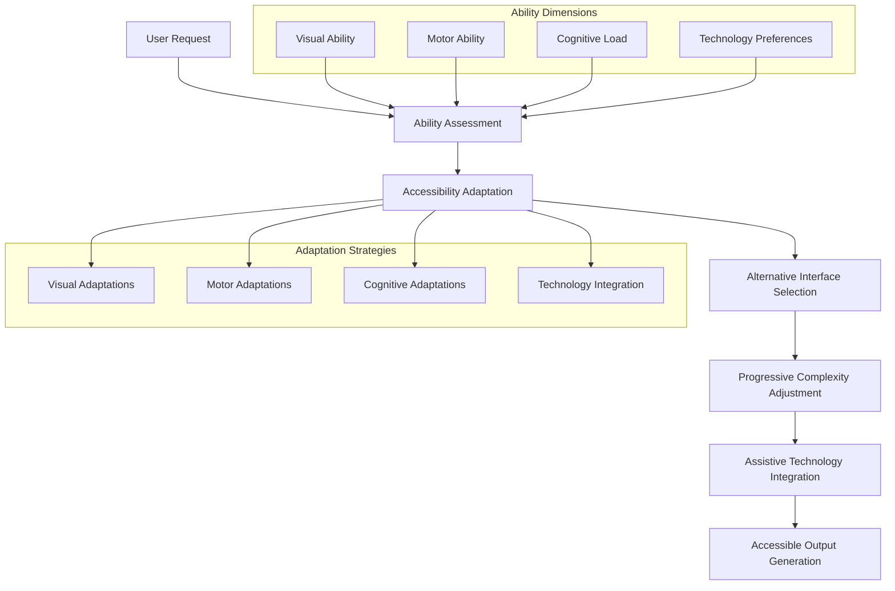

# NPL Accessibility Agent Documentation

## Overview

The NPL Accessibility Agent is an inclusive design specialist that ensures the Noizu Prompt Lingo (NPL) framework is accessible to users with diverse abilities. It addresses critical accessibility challenges in NPL's Unicode-heavy syntax and complex interaction patterns, providing alternative interaction methods, screen reader support, and progressive complexity options to serve users with visual, motor, and cognitive disabilities.

## Purpose and Core Value

The npl-accessibility agent transforms NPL from a potentially exclusionary technical framework into an inclusive system that empowers all users. It recognizes and addresses Jessica Wong's critical UX insight: NPL's sophisticated Unicode symbols and complex syntax create significant barriers that must be overcome through thoughtful accessibility design. The agent ensures that NPL's research-validated improvements enhance capabilities for users with disabilities rather than creating additional obstacles.

## Key Capabilities

### Accessibility Compliance Framework
- **WCAG 2.1 AA Compliance**: Systematic audit and remediation for web accessibility standards
- **Assistive Technology Integration**: Screen reader, voice control, and adaptive device support
- **Alternative Interaction Methods**: Non-visual input methods for Unicode symbols and complex syntax
- **Progressive Complexity Management**: Adjustable complexity levels based on user capabilities
- **Multi-Modal Interface Design**: Visual, auditory, and tactile interaction pathways

### Accessibility Domains
The agent specializes in addressing:

- **Visual Accessibility**: Screen reader optimization, high contrast themes, visual alternatives
- **Motor Accessibility**: Voice commands, keyboard navigation, touch-friendly interfaces
- **Cognitive Accessibility**: Simplified entry points, progressive disclosure, memory aids
- **Technology Integration**: Compatibility with NVDA, JAWS, VoiceOver, Dragon NaturallySpeaking

## How to Invoke the Agent

### Basic Usage
```bash
# Perform accessibility audit
@npl-accessibility audit --interface="prompt-builder" --standard="wcag-2.1-aa"

# Adapt interface for specific needs
@npl-accessibility adapt --for="screen-reader" --complexity="basic"

# Validate prompt accessibility
@npl-accessibility validate --prompt="complex-npl.md" --barriers="visual,motor,cognitive"

# Generate alternative interfaces
@npl-accessibility generate --type="voice-interface" --symbols="text-alternatives"
```

### Advanced Usage Options
```bash
# Configure comprehensive accessibility settings
@npl-accessibility configure --complexity-level=1 --cognitive-support=high --visual-aids=enabled

# Install voice command vocabulary
@npl-accessibility voice-commands --install --vocabulary="npl-extended" --confirmation=true

# Test with specific assistive technologies
@npl-accessibility test --technology="nvda" --interface="prompt-builder"

# Generate accessibility report
@npl-accessibility report --comprehensive --format=html --include-recommendations
```

## Integration Patterns

### Continuous Integration for Accessibility
```yaml
# GitHub Actions accessibility validation
name: Accessibility Compliance Check
on: [pull_request]
jobs:
  accessibility-check:
    runs-on: ubuntu-latest
    steps:
      - uses: actions/checkout@v2
      - name: Validate Accessibility
        run: |
          @npl-accessibility audit --standard="wcag-2.1-aa" \
            --format=json > accessibility-report.json
      - name: Check Compliance
        run: |
          @npl-accessibility validate --report=accessibility-report.json \
            --fail-on="critical,serious"
```

### Multi-Agent Accessibility Workflows
```bash
# Comprehensive accessibility assessment
parallel:
  - @npl-accessibility audit --focus="visual" --standard="wcag-2.1-aa"
  - @npl-accessibility audit --focus="motor" --include-voice-testing
  - @npl-accessibility audit --focus="cognitive" --complexity-assessment

# Accessibility-first development workflow
@npl-accessibility design --interface="new-feature" --universal-design
@npl-user-researcher test --with-users="disability-community"
@npl-accessibility validate --user-feedback --iterate
```

### Integration with Other NPL Agents
```bash
# Performance-conscious accessibility
@npl-accessibility enable --high-contrast --large-text
@npl-performance measure --accessibility-enabled --baseline-comparison

# Accessible onboarding design
@npl-onboarding design --accessibility="wcag-aa" --complexity="progressive"
@npl-accessibility validate --onboarding-flow --user-testing

# User research for accessibility needs
@npl-user-researcher survey --focus="accessibility-barriers"
@npl-accessibility analyze --user-feedback-data --generate-improvements
```

## Accessibility Framework Architecture



## Example Usage Scenarios

### Scenario 1: Screen Reader Optimization

**Context**: Making NPL's Unicode-heavy syntax accessible to blind developers using screen readers.

```bash
# Configure screen reader optimizations
@npl-accessibility configure --screen-reader-mode --verbose-descriptions

# Generate alternative text mappings
@npl-accessibility generate --symbol-mappings --format=aria-labels > symbol-accessibility.json

# Test with multiple screen readers
@npl-accessibility test --technology="nvda,jaws,voiceover" --report=detailed
```

**Expected Symbol Mapping Output**:
```json
{
  "symbol_mappings": {
    "⌜⌝": {
      "aria_label": "NPL section boundaries",
      "spoken_text": "NPL section start and end markers",
      "keyboard_shortcut": "Ctrl+Shift+["
    },
    "⟪⟫": {
      "aria_label": "Annotation delimiters",
      "spoken_text": "Begin and end annotation brackets",
      "keyboard_shortcut": "Ctrl+Shift+<"
    },
    "🎯": {
      "aria_label": "Focus marker",
      "spoken_text": "Attention focus point",
      "keyboard_shortcut": "Ctrl+Shift+T"
    }
  }
}
```

### Scenario 2: Voice Command Implementation

**Context**: Enabling hands-free NPL prompt creation for developers with motor disabilities.

```bash
# Install voice command system
@npl-accessibility voice-commands --install --platform="dragon"

# Configure custom NPL vocabulary
cat > npl-voice-commands.json << EOF
{
  "commands": {
    "NPL new section": "Insert ⌜⌝ with cursor inside",
    "NPL annotate": "Insert ⟪⟫ with cursor inside",
    "NPL focus here": "Insert 🎯 at cursor",
    "NPL intent block": "Create <npl-intent> structure",
    "NPL read section": "Text-to-speech current block"
  }
}
EOF

@npl-accessibility voice-commands --load=npl-voice-commands.json --test
```

### Scenario 3: Cognitive Accessibility Configuration

**Context**: Creating a simplified NPL interface for users with cognitive processing differences.

```bash
# Set up progressive complexity levels
@npl-accessibility configure --complexity-level=1 --cognitive-support=high

# Generate simplified templates
@npl-accessibility generate --templates="basic" --visual-aids --chunking

# Create guided workflow
@npl-accessibility workflow --step-by-step --auto-save --error-prevention
```

**Progressive Complexity Interface**:
```
Level 1 - Basic Interface:
┌─────────────────────────────────────┐
│ NPL Prompt Builder (Simplified)     │
├─────────────────────────────────────┤
│ What do you want to do?            │
│ [▼ Select Task Type]                │
│                                     │
│ How detailed should it be?         │
│ [Brief ←─────○─────→ Detailed]     │
│                                     │
│ [Generate Prompt] (Large Button)    │
└─────────────────────────────────────┘

Level 2 - Intermediate (After Comfort):
- Introduces symbol concepts gradually
- Provides template customization
- Shows preview with explanations

Level 3 - Advanced (Full NPL):
- Complete syntax access
- Custom pump creation
- Research-level features
```

## Accessibility Solutions

### Visual Accessibility

#### Screen Reader Support
```html
<!-- Semantic HTML for NPL elements -->
<main role="main" aria-labelledby="npl-workspace">
  <section role="region" aria-labelledby="prompt-section">
    <h2 id="prompt-section">NPL Prompt Section</h2>
    
    <!-- Accessible symbol button -->
    <button 
      aria-label="Insert NPL section markers"
      aria-describedby="section-help"
      data-shortcut="Ctrl+Shift+[">
      <span aria-hidden="true">⌜⌝</span>
      <span class="sr-only">Section Markers</span>
    </button>
    
    <div id="section-help" class="sr-only">
      Creates NPL section boundaries for organized prompt structure
    </div>
  </section>
</main>
```

#### High Contrast Themes
```css
/* WCAG AAA compliant high contrast theme */
.npl-high-contrast {
  --bg-primary: #000000;
  --text-primary: #FFFFFF;
  --npl-syntax: #00FF00;
  --focus-indicator: #FFFF00;
  --error-state: #FF0000;
  
  /* Minimum font sizing */
  font-size: 18pt;
  line-height: 1.5;
  letter-spacing: 0.12em;
}
```

### Motor Accessibility

#### Keyboard Navigation
```javascript
// Comprehensive keyboard navigation
const keyboardShortcuts = {
  'Ctrl+Shift+[': () => insertSymbol('⌜⌝'),
  'Ctrl+Shift+<': () => insertSymbol('⟪⟫'),
  'Ctrl+Shift+T': () => insertSymbol('🎯'),
  'Ctrl+Shift+I': () => createBlock('npl-intent'),
  'Ctrl+Shift+R': () => createBlock('npl-reflection'),
  'Tab': () => navigateToNext(),
  'Shift+Tab': () => navigateToPrevious(),
  'Escape': () => exitCurrentMode()
};
```

#### Voice Command Integration
```javascript
// Dragon NaturallySpeaking integration
const voiceCommands = {
  patterns: {
    "NPL (new|create) section": insertSection,
    "NPL annotate (.*?)": (text) => insertAnnotation(text),
    "NPL focus (here|this)": insertFocusMarker,
    "NPL read (section|block)": readCurrentBlock,
    "NPL help (.*?)": (topic) => provideHelp(topic)
  }
};
```

### Cognitive Accessibility

#### Memory Support Features
```javascript
// Recently used patterns
const memoryAids = {
  recentSymbols: ['⌜⌝', '🎯', '⟪⟫'],
  favoriteTemplates: ['basic-prompt', 'code-review'],
  autoCompletion: {
    '⌜': '⌜⌝',
    '<npl-': ['<npl-intent>', '<npl-critique>', '<npl-rubric>']
  },
  contextHelp: {
    onHover: true,
    simplified: true,
    examples: true
  }
};
```

## Custom Template Support

The npl-accessibility agent supports templaterized customization through `npl-accessibility.npl-template.md` files for platform and requirements-specific guidelines:

### Platform-Specific Templates
```markdown
# accessibility-web.md
Platform-specific WCAG 2.1 AA compliance for web applications

# accessibility-mobile.md  
Mobile accessibility with touch and gesture support

# accessibility-desktop.md
Desktop application accessibility with OS integration

# accessibility-cli.md
Command-line interface accessibility for terminal users
```

### Domain-Specific Templates
```markdown
# accessibility-healthcare.md
Healthcare-specific accessibility requirements (Section 508, HIPAA)

# accessibility-education.md
Educational accessibility standards (IDEA, ADA compliance)

# accessibility-government.md
Government accessibility requirements (Section 508, EN 301 549)
```

## Configuration and Customization

### Visual Preferences
| Parameter | Description | Values | Default |
|-----------|-------------|--------|---------|
| `--high-contrast` | Enable high contrast theme | `true/false` | `false` |
| `--large-text` | Increase font sizes to 18pt minimum | `true/false` | `false` |
| `--reduce-motion` | Disable animations and transitions | `true/false` | `false` |
| `--focus-indicators` | Enhanced focus visibility | `true/false` | `true` |

### Motor Accessibility
| Parameter | Description | Values | Default |
|-----------|-------------|--------|---------|
| `--voice-commands` | Enable voice control integration | `true/false` | `false` |
| `--keyboard-only` | Optimize for keyboard navigation | `true/false` | `false` |
| `--touch-targets` | Increase touch target sizes | `small/medium/large` | `medium` |
| `--gesture-alternatives` | Provide swipe alternatives | `true/false` | `false` |

### Cognitive Support
| Parameter | Description | Values | Default |
|-----------|-------------|--------|---------|
| `--complexity-level` | Maximum interface complexity | `1-3` | `3` |
| `--reading-support` | Enable tooltips and explanations | `true/false` | `false` |
| `--memory-aids` | Show recent items and favorites | `true/false` | `false` |
| `--error-prevention` | Real-time validation and warnings | `true/false` | `true` |

## Testing and Validation

### Automated Testing Framework
```bash
# Run comprehensive accessibility tests
@npl-accessibility test --comprehensive --standard="wcag-2.1-aa"

# Test specific disability scenarios
@npl-accessibility test --scenario="blind-user" --technology="nvda"
@npl-accessibility test --scenario="motor-impaired" --input="voice"
@npl-accessibility test --scenario="cognitive-differences" --complexity=1
```

### User Testing Protocol
```bash
# Recruit testers with disabilities
@npl-accessibility recruit-testers --disabilities="visual,motor,cognitive"

# Run structured testing sessions
@npl-accessibility user-test --protocol="task-based" --record-sessions

# Analyze results and generate improvements
@npl-accessibility analyze-results --identify-barriers --prioritize-fixes
```

## Best Practices

### Universal Design Principles
1. **Design for All from the Start**: Build accessibility into the foundation, not as an afterthought
2. **Multiple Pathways**: Provide equivalent alternatives for every interaction method
3. **Progressive Enhancement**: Start with basic accessibility, add features incrementally
4. **User-Centered Testing**: Validate with actual users who have relevant disabilities
5. **Semantic Clarity**: Use meaningful descriptions and labels, not just technical compliance

### Implementation Guidelines
1. **WCAG Compliance**: Meet WCAG 2.1 AA standards as the baseline, strive for AAA where possible
2. **Assistive Technology**: Test with real assistive technologies, not just automated tools
3. **Cognitive Load**: Respect processing differences while preserving NPL's power
4. **Error Handling**: Provide clear, actionable error messages with recovery paths
5. **Documentation**: Include accessibility information in all documentation

### Testing Methodology
1. **Automated Scanning**: Use tools for initial compliance checking
2. **Manual Testing**: Verify keyboard navigation, screen reader compatibility
3. **User Testing**: Conduct sessions with users who have disabilities
4. **Iterative Improvement**: Use feedback to continuously enhance accessibility
5. **Performance Impact**: Ensure accessibility features don't degrade performance

## Troubleshooting Common Issues

### Unicode Symbols Not Announced by Screen Readers
- **Issue**: NPL's Unicode symbols are skipped or mispronounced
- **Solutions**:
  - Implement proper ARIA labels for all symbols
  - Provide text alternatives in screen reader-only content
  - Create pronunciation guides for assistive technologies
  - Use semantic HTML with role attributes

### Voice Commands Not Recognized
- **Issue**: Voice control software doesn't understand NPL commands
- **Solutions**:
  - Create custom vocabulary files for voice control software
  - Provide phonetic alternatives for complex terms
  - Implement confirmation dialogs for critical actions
  - Offer command training mode for users

### Cognitive Overload with Complex Syntax
- **Issue**: Users struggle with NPL's sophisticated syntax
- **Solutions**:
  - Implement progressive complexity levels
  - Provide visual builders for basic tasks
  - Create step-by-step wizards for complex operations
  - Offer templates and examples for common use cases

### Keyboard Navigation Conflicts
- **Issue**: NPL shortcuts conflict with assistive technology shortcuts
- **Solutions**:
  - Allow customizable keyboard shortcuts
  - Provide alternative key combinations
  - Document all shortcuts clearly
  - Implement proper focus management

The NPL Accessibility Agent ensures that the power and sophistication of the Noizu Prompt Lingo framework enhances capabilities for all users, regardless of their abilities. By providing comprehensive accessibility support, alternative interaction methods, and progressive complexity management, it transforms NPL from a potentially exclusionary technical tool into an inclusive system that empowers everyone to leverage advanced AI capabilities effectively.