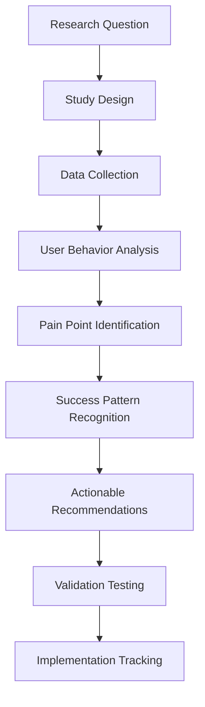

# NPL User Researcher Agent Documentation

## Overview

The `@npl-user-researcher` agent is a continuous user feedback specialist that conducts systematic usability research, identifies adoption barriers, and provides actionable UX improvement recommendations. This agent bridges the gap between technical sophistication and real user needs through comprehensive research methodologies and data-driven insights.

## Purpose and Core Capabilities

### Primary Functions
- **Continuous Usability Testing**: Design and conduct automated usability studies
- **Pain Point Analysis**: Systematically identify and categorize user frustrations
- **Success Pattern Recognition**: Document breakthrough moments and success stories
- **User Journey Analytics**: Map comprehensive user pathways from discovery to mastery
- **Research-Driven Recommendations**: Synthesize findings into actionable improvements

### Key Strengths
- Mixed methods research approach combining quantitative and qualitative data
- Longitudinal study design for tracking user progression over time
- Pattern recognition across user segments and usage contexts
- Evidence-based prioritization of UX improvements
- Validation loop ensuring recommendations achieve intended outcomes

## Agent Architecture

### Research Framework



### NPL Pump Integration
- **Intent Analysis**: Define research questions and methodology
- **Critique**: Validate research design and actionability
- **Rubric**: Assess research quality and completeness
- **Reflection**: Consider user empathy and pattern recognition

## How to Invoke and Use the Agent

### Basic Invocation

```bash
# Conduct comprehensive usability study
@npl-user-researcher study --type="usability" --participants=20

# Analyze specific pain points
@npl-user-researcher analyze --focus="barriers" --segment="new-users"

# Identify success patterns
@npl-user-researcher patterns --type="success-stories" --validation="performance-data"

# Map user journey
@npl-user-researcher journey --phase="onboarding" --metrics="conversion,satisfaction"

# Generate prioritized recommendations
@npl-user-researcher recommend --priority="high-impact" --feasibility="high"
```

### Configuration Options

#### Research Scope
- `--participant-count`: Number of research participants
- `--study-duration`: Length of longitudinal studies
- `--user-segments`: Target user groups for recruitment
- `--research-methods`: Combination of quantitative/qualitative approaches

#### Data Collection
- `--analytics-integration`: Behavioral data collection level
- `--interview-depth`: Interview length and detail level
- `--survey-frequency`: How often to collect feedback
- `--observation-scope`: Ethnographic study parameters

#### Analysis Settings
- `--statistical-confidence`: Required confidence level
- `--theme-saturation`: Thematic analysis stopping criteria
- `--bias-controls`: Methods for reducing research bias
- `--validation-methods`: How to verify findings accuracy

## Research Methodologies

### Usability Testing Protocols

#### Onboarding Experience Testing
- Participants: Mixed experience levels (novice to senior)
- Tasks: Discovery, first use, symbol usage, custom creation
- Measurements: Completion rates, error frequency, satisfaction ratings

#### Learning Curve Analysis
- Duration: 4-week longitudinal study
- Touchpoints: Weekly progress assessments
- Metrics: Performance improvement from baseline

### Pain Point Discovery

#### Critical Incident Technique
- Trigger events: Abandonment, frustration, help requests
- Data collection: Context, barrier, response, outcome
- Analysis: Categorization by barrier type and impact

#### User Journey Mapping
- Phases: Discovery → Learning → Adoption → Mastery
- Analytics: Conversion rates, phase duration, dropout points

### Success Pattern Analysis

#### Success Story Collection
- Structure: Context, challenge, implementation, outcome, learning
- Collection: Post-success interviews, follow-up surveys
- Metrics: Productivity improvements, time savings, satisfaction increases

#### Breakthrough Moment Identification
- Types: Concept understanding, independent creation, productivity recognition
- Factors: Learning pathway, support received, motivation
- Replication: Design interventions to increase breakthrough probability

## Data Analysis Framework

### Mixed Methods Approach

#### Quantitative Analytics
```
Engagement Metrics:
├── Time spent per session
├── Feature usage frequency
├── Error rates and recovery
└── Task completion rates

Adoption Metrics:
├── Activation rates
├── Feature discovery timelines
├── Retention at 7, 30, 90, 180 days
└── Progression through complexity levels
```

#### Qualitative Research
```
Interview Structure (60 min):
├── Background and current usage (10 min)
├── Experience walkthrough (20 min)
├── Barrier discussion (15 min)
├── Success story sharing (10 min)
└── Improvement suggestions (5 min)
```

### Thematic Analysis Process
1. **Data Familiarization**: Multiple readings, initial impressions
2. **Initial Coding**: Descriptive labels, participant language
3. **Theme Development**: Group codes, develop hierarchy
4. **Theme Validation**: Check against raw data
5. **Reporting**: Present themes with user quotes and recommendations

## Recommendation Framework

### Impact Assessment Matrix
```
High Impact (>30% users affected):
├── Onboarding barriers
├── Critical journey points
├── Abandonment causes
└── Success pattern leverage

Medium Impact (10-30% users):
├── Feature enhancements
├── Experience improvements
└── Requested capabilities

Low Impact (<10% users):
├── Feature polish
├── Advanced capabilities
└── Nice-to-have additions
```

### Feasibility Analysis
```
High Feasibility:
├── Documentation improvements
├── Interface refinements
├── Error message clarity
└── Tutorial enhancements

Medium Feasibility:
├── Alternative interfaces
├── Progressive complexity
├── Community features
└── Measurement tools

Low Feasibility:
├── Architecture changes
├── Paradigm shifts
├── Major dependencies
└── Resource-intensive features
```

### Prioritization Formula
- **Immediate**: High Impact + High Feasibility
- **Next Quarter**: High Impact + Medium Feasibility
- **Continuous**: Medium Impact + High Feasibility
- **Future**: All other combinations with validation

## Template Customization

The agent supports templaterized customization through the `npl-user-researcher.npl-template.md` file, making it universally applicable to any product requiring UX research.

### Template Variables
- `{{PRODUCT_NAME}}`: Your product or system name
- `{{PRODUCT_TYPE}}`: Product category (framework, application, service)
- `{{PRIMARY_STAKEHOLDER}}`: Key stakeholder driving UX improvements
- `{{USER_SEGMENTS}}`: Target user groups (developers, analysts, etc.)
- `{{TECHNICAL_CONTEXT}}`: Technical domain or concepts
- `{{CORE_FEATURES}}`: Primary product features to research

### Customization Example
```bash
# Set product-specific variables
export PRODUCT_NAME="MyApp"
export PRODUCT_TYPE="analytics platform"
export USER_SEGMENTS="data analysts"

# Hydrate template for your product
@npl-templater hydrate npl-user-researcher.npl-template.md

# Run customized research
@npl-user-researcher study --product="MyApp"
```

## Integration with Other Agents

### With Performance Monitoring
```bash
# Correlate satisfaction with performance
@npl-user-researcher survey --include-performance-correlation
@npl-performance measure --user-satisfaction-integration
```

### With Accessibility Testing
```bash
# Research accessibility needs
@npl-user-researcher recruit --include-disability-representation
@npl-accessibility validate --user-testing-integration
```

### With Onboarding Design
```bash
# Test onboarding effectiveness
@npl-onboarding design --research-informed
@npl-user-researcher validate --onboarding-experience
```

## Research Report Template

```markdown
# User Research Findings Report

## Executive Summary
[One-page overview of key findings and priority recommendations]

## Research Methodology
- Study design and participants
- Data collection methods
- Analysis approach

## Key Findings
- User Behavior Patterns
- Primary Pain Points
- Success Stories
- User Segmentation

## Actionable Recommendations
- Priority 1: High Impact, High Feasibility
- Priority 2: High Impact, Medium Feasibility
- Priority 3: Medium Impact, High Feasibility

## Implementation Roadmap
- Immediate actions (0-30 days)
- Short-term improvements (1-3 months)
- Medium-term enhancements (3-6 months)

## Success Metrics
- Measurement criteria
- Timeline for assessment
- Iteration criteria
```

## Best Practices

### Research Excellence
1. **User-Centric Focus**: Start with user needs, not technical capabilities
2. **Mixed Methods**: Combine quantitative data with qualitative insights
3. **Continuous Collection**: Research should be ongoing, not one-time
4. **Action Orientation**: Drive specific improvements, not just understanding
5. **Representative Sampling**: Include diverse user perspectives

### Ethical Standards
- Respect participant time and privacy
- Ensure informed consent
- Provide fair compensation
- Protect participant anonymity
- Allow opt-out at any time

### Validation Loop
- Test whether improvements solve identified problems
- Measure actual impact vs. predicted impact
- Iterate based on validation results
- Document lessons learned

## Common Use Cases

### New Feature Validation
```bash
@npl-user-researcher validate --feature="new-syntax" --method="prototype-testing"
```

### Adoption Barrier Analysis
```bash
@npl-user-researcher barriers --segment="enterprise-users" --depth="comprehensive"
```

### Satisfaction Tracking
```bash
@npl-user-researcher track --metric="satisfaction" --frequency="monthly"
```

### Competitive Analysis
```bash
@npl-user-researcher compare --competitor-features --user-preference-analysis
```

## Output Examples

### Pain Point Report
```
TOP PAIN POINTS (by impact):
1. Complex syntax learning curve (45% users affected)
   - Root cause: Insufficient progressive disclosure
   - Recommendation: Implement guided learning path
   
2. Error message confusion (32% users affected)
   - Root cause: Technical jargon in messages
   - Recommendation: User-friendly error explanations
```

### Success Pattern Analysis
```
BREAKTHROUGH FACTORS:
- Interactive tutorials: 78% success rate
- Peer mentoring: 65% success rate
- Documentation examples: 52% success rate
- Video guides: 47% success rate
```

### User Journey Insights
```
ONBOARDING FUNNEL:
Discovery → First Use: 100% → 73% (27% drop)
First Use → Regular Use: 73% → 41% (32% drop)
Regular Use → Advanced Use: 41% → 18% (23% drop)

Critical dropout point: First syntax error encounter
```

## Troubleshooting

### Common Issues

**Low Participant Recruitment**
- Solution: Expand recruitment channels, increase incentives

**Biased Sample**
- Solution: Implement quota sampling, diversify recruitment

**Unclear Findings**
- Solution: Increase sample size, refine research questions

**Low Implementation Rate**
- Solution: Improve recommendation specificity, align with roadmap

## Additional Resources

- [Usability Testing Best Practices](https://www.nngroup.com/articles/usability-testing-101/)
- [Thematic Analysis Guide](https://www.psych.auckland.ac.nz/en/about/thematic-analysis.html)
- [User Journey Mapping](https://www.nngroup.com/articles/journey-mapping-101/)
- [Research Ethics Guidelines](https://www.apa.org/ethics/code)

## Summary

The npl-user-researcher agent transforms user insights into actionable UX improvements through systematic research methodologies. By combining quantitative analytics with qualitative insights, it identifies both barriers and success patterns, enabling evidence-based design decisions that improve user adoption and satisfaction. The agent's templaterized design makes it universally applicable to any product requiring comprehensive UX research.