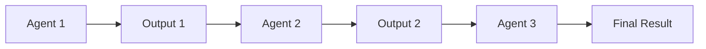
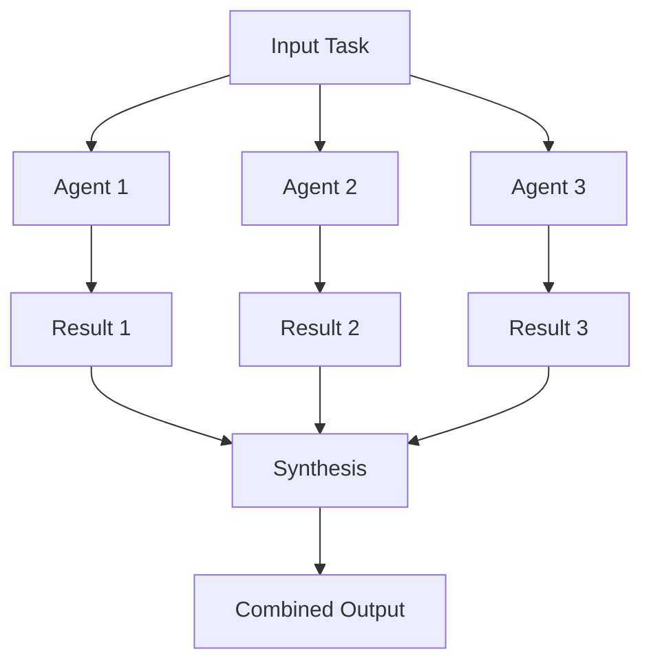
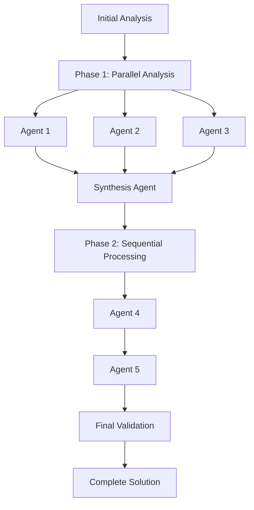
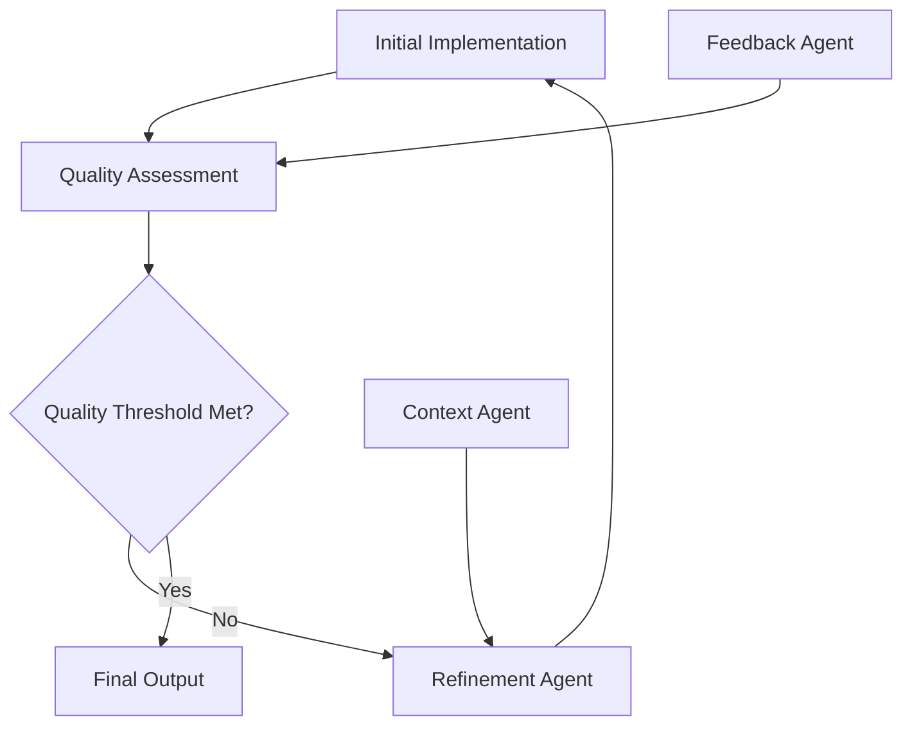
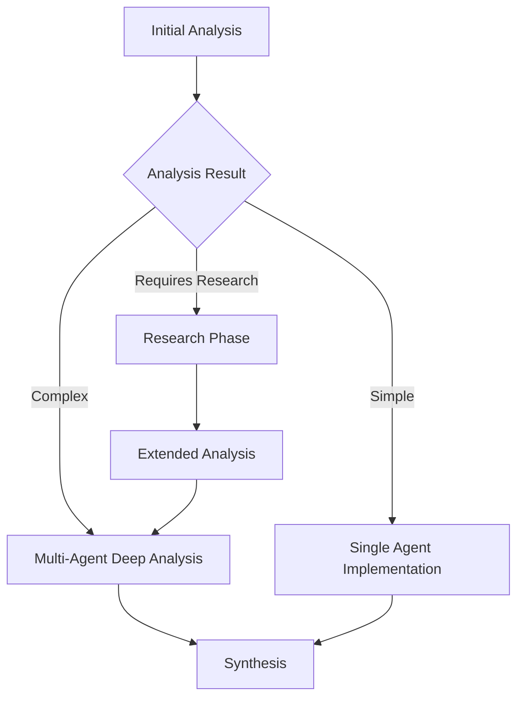

# NPL Agent Ecosystem Documentation

## Introduction

The **Noizu Prompt Lingo (NPL) Agent Ecosystem** is a comprehensive framework of specialized AI agents designed to accelerate software development, enhance productivity, and maintain quality standards. Each agent embodies specific expertise while maintaining seamless integration capabilities within collaborative workflows.

This ecosystem transforms the traditional approach to AI assistance by providing:

- **Specialized Expertise**: Each agent focuses on specific domains and tasks
- **Orchestration Capabilities**: Agents can work together in complex, multi-stage workflows
- **Quality Assurance**: Built-in validation and grading systems ensure consistent output
- **Adaptive Intelligence**: Agents adapt to project contexts and organizational patterns

## Agent Sources

This documentation covers agents from two main sources:

- **Core Agents**: Located in `agentic/scaffolding/agents/` - Production-ready agents with comprehensive documentation
- **Additional Agents**: Located in `agentic/scaffolding/additional-agents/` - Extended collection of 25+ specialized agents organized by functional area (infrastructure, quality-assurance, user-experience, marketing, project-management, research, security)

## Agent Directory

### Core NPL Agents

#### **NIMPS** - Noizu Idea to MVP Service
**Purpose**: Transforms high-level ideas into comprehensive MVP specifications through structured yield-and-iterate methodology.

- **Capabilities**: Deep persona analysis, strategic project planning, architecture design
- **Best For**: Entrepreneurs, product managers, development teams planning new projects
- **Workflow**: 7-phase systematic approach from idea to documented MVP
- **Integration**: Works with templating and persona agents for enhanced planning

#### **npl-author** - NPL Documentation Generator
**Purpose**: Automated extraction and structuring of NPL framework documentation from source materials.

- **Capabilities**: Multi-source content integration, NPL syntax compliance, modular documentation
- **Best For**: NPL framework maintenance, template documentation, structured content generation
- **Workflow**: Source analysis → content extraction → NPL formatting → output generation
- **Integration**: Supports todo list workflows and version control integration

#### **npl-grader** - Quality Assessment Agent
**Purpose**: Structured evaluation of code, documentation, and deliverables using comprehensive rubrics.

- **Capabilities**: Intent analysis, rubric-based scoring, multi-dimensional critique, actionable feedback
- **Best For**: Code reviews, documentation quality assessment, standardized evaluation
- **Workflow**: Intent analysis → rubric application → scoring → critique → recommendations
- **Integration**: Works with all agents to provide quality assurance and validation

### Content Creation Specialists

#### **npl-marketing-writer** - Marketing Content Creator
**Purpose**: High-converting marketing content with emotional intelligence and persuasive frameworks.

- **Capabilities**: Landing pages, product descriptions, press releases, email campaigns, A/B testing
- **Best For**: Marketing teams, product launches, conversion optimization
- **Features**: AIDA/PAS frameworks, customer journey mapping, brand voice consistency
- **Integration**: Pairs with grader for content quality validation

#### **npl-technical-writer** - Technical Documentation Expert
**Purpose**: Clear, precise technical documentation without marketing fluff or LLM verbosity.

- **Capabilities**: Specifications, PR descriptions, issues, API docs, README files, diagrams
- **Best For**: Developer documentation, technical specifications, API documentation
- **Anti-Patterns**: Actively removes marketing language, unnecessary qualifiers, verbose explanations
- **Integration**: House style system, template-driven generation, review annotations

### Data Visualization and Analytics

#### **npl-fim** - Fill-In-the-Middle Visualization Agent
**Purpose**: Comprehensive visualization specialist generating interactive, data-driven visualizations across modern web visualization tools.

- **Capabilities**: 13+ visualization libraries (D3.js, Chart.js, Plotly.js, Three.js, Mermaid, etc.), NPL semantic enhancement, interactive dashboards
- **Best For**: Business analytics, scientific visualization, network analysis, creative data art
- **Features**: NPL semantic patterns for 15-30% AI comprehension improvement, responsive designs, accessibility compliance
- **Integration**: Works with grader for quality assessment, templater for reusable visualization patterns

### Security and Risk Management

#### **npl-threat-modeler** - Defensive Security Analysis Agent
**Purpose**: Specialized defensive security analysis tool that identifies vulnerabilities, assesses security risks, and designs secure architectures using established threat modeling methodologies.

- **Capabilities**: STRIDE methodology, risk assessment, architecture security review, compliance mapping (SOC 2, ISO 27001, NIST), security documentation
- **Best For**: Enterprise security assessment, compliance preparation, secure architecture design, security policy development
- **Features**: Systematic threat identification, quantitative risk analysis, defensive-only security practices, industry framework alignment
- **Integration**: Works with thinker for strategic security planning, grader for security assessment validation

### Collaboration and Analysis Agents

#### **npl-persona** - Multi-Perspective AI Personas
**Purpose**: Embodies defined character personas for consistent, multi-perspective collaboration.

- **Capabilities**: Document review, group chain-of-thought, advisory mode, editorial synthesis
- **Best For**: Code reviews, architecture decisions, requirements gathering, incident analysis
- **Features**: Maintains character consistency, applies specialized expertise, realistic collaboration
- **Integration**: Works with all agents to provide domain-specific perspectives

#### **npl-templater** - Template Creation and Hydration
**Purpose**: Converts concrete examples into reusable templates and intelligently hydrates them.

- **Capabilities**: Template extraction, technology stack detection, context-aware hydration
- **Best For**: Standardizing project setups, generating boilerplate, maintaining consistency
- **Intelligence**: Detects frameworks, dependencies, conventions, and project patterns
- **Integration**: Foundation for other agents' customization and project-specific adaptation

#### **npl-thinker** - Multi-Cognitive Reasoning Agent
**Purpose**: Combines intent analysis, chain-of-thought, reflection, and mood for thoughtful responses.

- **Capabilities**: Complex problem solving, systematic analysis, transparent reasoning, emotional intelligence
- **Best For**: Architecture decisions, debugging complex issues, strategic planning
- **Process**: Intent → Chain-of-Thought → Mood → Reflection → Solution
- **Integration**: Enhances other agents with deep analytical capabilities

### Specialized Agent Templates

#### **gopher-scout** - System Reconnaissance Template
**Purpose**: Creates specialized agents for systematic exploration and analysis of complex systems.

- **Capabilities**: Codebase analysis, documentation assessment, architecture discovery
- **Best For**: Technical due diligence, system understanding, reconnaissance missions
- **Template Features**: Master-scout patterns, multi-scout coordination, continuous reconnaissance
- **Customization**: Technology stack specific, mission-oriented focus

#### **gpt-qa** - Test Generation Template
**Purpose**: Creates agents that generate comprehensive test cases using systematic testing methodologies.

- **Capabilities**: Equivalency partitioning, boundary analysis, security testing, performance testing
- **Best For**: QA automation, test coverage analysis, systematic test planning
- **Features**: Visual categorization with glyphs, validation status indicators, domain adaptation
- **Testing Types**: Unit, integration, contract, repository, end-to-end tests

#### **system-digest** - System Analysis Template
**Purpose**: Creates agents that aggregate multi-source information into comprehensive system documentation.

- **Capabilities**: Cross-reference analysis, hierarchical summarization, IDE navigation
- **Best For**: Architecture documentation, system understanding, knowledge synthesis
- **Features**: Multi-source intelligence, anchor tag management, health assessment
- **Output Modes**: Executive summaries, technical deep-dives, implementation guides

#### **tdd-driven-builder** - Test-Driven Development Template
**Purpose**: Creates agents that implement features using strict TDD methodology with Red-Green-Refactor cycles.

- **Capabilities**: Requirement analysis, test planning, TDD cycles, integration validation
- **Best For**: High-quality code implementation, test coverage assurance, systematic development
- **Process**: Requirements → Test Plan → RED → GREEN → REFACTOR → Validate
- **Quality**: Maintains >90% coverage, follows project conventions

#### **tool-forge** - Development Tool Creation Template
**Purpose**: Creates agents specialized in designing and implementing development tools and productivity enhancers.

- **Capabilities**: CLI tools, MCP-compatible tools, utility scripts, integration tools
- **Best For**: Custom tooling development, productivity automation, workflow enhancement
- **Technology**: Multi-language support, framework integration, container deployment
- **Quality**: Comprehensive testing, robust error handling, complete documentation

## Orchestration Patterns

### Sequential Agent Workflows

Sequential workflows involve agents working one after another, with each agent building upon the previous agent's output:



#### Example: Complete Documentation Pipeline
```bash
# Step 1: Generate technical specification
@npl-technical-writer generate spec --component=user-authentication

# Step 2: Create comprehensive test cases
@gpt-qa "Generate test cases for user authentication specification"

# Step 3: Evaluate documentation quality
@npl-grader evaluate spec.md --rubric=technical-documentation-rubric.md

# Step 4: Create marketing materials from technical spec
@npl-marketing-writer "Create developer-focused landing page from authentication spec"
```

#### Example: Project Planning Workflow
```bash
# Step 1: Analyze project idea
@nimps "Create MVP plan for task management app for freelancers"

# Step 2: Create project templates based on analysis
@npl-templater "Generate project templates from NIMPS analysis"

# Step 3: Validate planning completeness
@npl-grader evaluate project-plan.md --rubric=project-planning-rubric.md
```

### Parallel Agent Coordination

Parallel workflows involve multiple agents working simultaneously on related aspects of a problem:



#### Example: Multi-Perspective Code Review
```bash
# Parallel review from different perspectives
parallel --line-buffer ::: \
    '@npl-persona mike-douglas "Review authentication.py for security concerns"' \
    '@npl-persona sarah-chen "Review authentication.py for user experience implications"' \
    '@npl-persona alex-rivera "Review authentication.py for operational considerations"'
```

#### Example: Comprehensive Quality Assessment
```bash
# Simultaneous quality analysis from multiple angles
{
    @npl-grader evaluate src/ --rubric=code-quality-rubric.md &
    @npl-technical-writer review src/ --mode=annotate --focus=documentation &
    @gpt-qa "Analyze test coverage gaps in src/" &
    wait
}
```

### Complex Multi-Stage Workflows

Complex workflows combine sequential and parallel patterns for sophisticated task orchestration:



#### Example: Complete Feature Implementation
```bash
# Phase 1: Parallel analysis and planning
{
    @npl-thinker "Analyze technical requirements for payment processing feature" &
    @npl-persona product-owner "Define user requirements for payment feature" &
    @npl-persona security-expert "Identify security requirements for payment processing" &
    wait
} > requirements-analysis.md

# Phase 2: Sequential implementation
@tdd-driven-builder "Implement payment processing using analyzed requirements"
@npl-grader evaluate payment-feature/ --rubric=feature-complete-rubric.md
@npl-technical-writer "Document payment processing implementation and API"

# Phase 3: Final validation and deployment preparation
@gpt-qa "Generate comprehensive test suite for payment processing"
@npl-marketing-writer "Create release notes and feature announcement"
```

## Multi-Agent Examples

### Scenario 1: New Feature Development

**Context**: Implementing a new user dashboard with analytics capabilities.

```bash
# 1. Strategic Analysis and Planning
@npl-thinker "Analyze requirements for user analytics dashboard with real-time data visualization"
@nimps "Create detailed implementation plan for analytics dashboard based on analysis"

# 2. Parallel Design and Development Planning
{
    @npl-persona frontend-architect "Design React component architecture for analytics dashboard" &
    @npl-persona backend-architect "Design API structure for analytics data delivery" &
    @npl-persona ux-designer "Define user interaction patterns for dashboard" &
    wait
}

# 3. Implementation with Quality Assurance
@tdd-driven-builder "Implement analytics API endpoints using TDD methodology"
@gpt-qa "Generate comprehensive test cases for analytics calculations"
@npl-technical-writer "Create API documentation and integration guides"

# 4. Content and Deployment
@npl-marketing-writer "Create feature announcement and user onboarding content"
@system-digest "Update system architecture documentation with analytics components"
```

### Scenario 2: Legacy System Documentation

**Context**: Creating comprehensive documentation for an undocumented microservices system.

```bash
# 1. System Discovery and Analysis
@gopher-scout "Perform comprehensive reconnaissance of microservices architecture"
@system-digest "Analyze service dependencies and communication patterns"

# 2. Multi-Perspective Documentation
{
    @npl-technical-writer "Create technical documentation for service APIs" &
    @npl-persona ops-engineer "Document deployment and monitoring procedures" &
    @npl-persona developer "Create development setup and contribution guides" &
    wait
}

# 3. Quality Validation and Enhancement
@npl-grader evaluate docs/ --rubric=comprehensive-documentation-rubric.md
@npl-templater "Create documentation templates for future service documentation"

# 4. User-Facing Content
@npl-marketing-writer "Create developer portal content and getting started guides"
```

### Scenario 3: Code Quality Improvement Initiative

**Context**: Systematic improvement of code quality across a large codebase.

```bash
# 1. Comprehensive Analysis
@gopher-scout "Analyze codebase for quality issues and improvement opportunities"
@npl-thinker "Develop systematic approach for code quality improvement"

# 2. Multi-Agent Quality Assessment
{
    @npl-grader evaluate src/ --rubric=enterprise-code-quality-rubric.md &
    @gpt-qa "Identify test coverage gaps and generate missing test cases" &
    @npl-persona security-expert "Audit code for security vulnerabilities" &
    @npl-persona performance-expert "Identify performance optimization opportunities" &
    wait
}

# 3. Improvement Implementation
@tdd-driven-builder "Implement quality improvements using test-driven approach"
@tool-forge "Create custom linting and validation tools for ongoing quality maintenance"

# 4. Process and Documentation
@npl-technical-writer "Document coding standards and quality processes"
@npl-templater "Create templates for consistent code structure across projects"
```

### Scenario 4: Data Visualization and Analytics Platform

**Context**: Creating comprehensive analytics dashboard with security assessment for financial services company.

```bash
# 1. Threat Analysis and Security Requirements
@npl-threat-modeler analyze "financial analytics platform with customer data visualization" --compliance=SOX,PCI-DSS --focus="data privacy, access controls"

# 2. Visualization Development with Security Integration
@npl-fim compose "Executive financial dashboard with real-time trading data" --libraries="d3,plotly" --security=compliant --audit-trail

# 3. Multi-Perspective Quality Assessment
{
    @npl-grader evaluate dashboard/ --rubric=financial-software-quality.md &
    @npl-persona security-architect "Review dashboard security implementation" &
    @npl-persona financial-analyst "Validate dashboard usability for financial analysis" &
    wait
}

# 4. Comprehensive Documentation and Compliance
@npl-technical-writer "Document dashboard security controls and compliance features"
@npl-threat-modeler generate-compliance-report --dashboard-assessment --frameworks="SOX,PCI-DSS"
```

### Scenario 5: Enterprise Security Program with Visualization

**Context**: Implementing organization-wide security monitoring with executive dashboards.

```bash
# 1. Security Architecture Analysis
@npl-threat-modeler assess-enterprise "multi-cloud security monitoring system" --scope="identity management, network security, data protection" --compliance=ISO27001

# 2. Security Metrics Visualization
@npl-fim security-dashboard "Real-time security metrics with threat indicators and compliance status" --libraries="d3,chart" --realtime --alerting

# 3. Strategic Security Planning
@npl-thinker "Analyze optimal security investment priorities based on threat model and dashboard metrics"

# 4. Implementation Validation
@tdd-driven-builder "Implement security controls identified in threat model with comprehensive testing"
@npl-grader evaluate security-implementation/ --rubric=enterprise-security-standards.md
```

## Advanced Orchestration

### Feedback Loops and Iterative Refinement

Some workflows benefit from feedback loops where agents refine their work based on other agents' analysis:



#### Example: Iterative Documentation Improvement
```bash
# Initial implementation
@npl-technical-writer generate api-doc --source=openapi.yaml

# Quality feedback loop
while true; do
    quality_score=$(@npl-grader evaluate api-doc.md --rubric=api-doc-rubric.md --output-score-only)
    if [[ $quality_score -gt 85 ]]; then
        break
    fi
    @npl-technical-writer review api-doc.md --mode=rewrite --focus=clarity
done

# Final validation
@npl-persona developer "Validate API documentation usability"
```

### Conditional Workflows

Workflows that adapt based on analysis results or changing conditions:



#### Example: Adaptive Problem-Solving Workflow
```bash
# Analyze problem complexity
complexity=$(@npl-thinker "Assess complexity of implementing OAuth2 integration" --output-complexity-only)

if [[ $complexity == "high" ]]; then
    # Complex implementation path
    @npl-persona security-architect "Design OAuth2 security architecture"
    @npl-persona backend-lead "Plan technical implementation approach"
    @gopher-scout "Research existing OAuth2 implementations in similar projects"
    @tdd-driven-builder "Implement OAuth2 with comprehensive testing strategy"
elif [[ $complexity == "medium" ]]; then
    # Standard implementation path
    @npl-technical-writer "Research OAuth2 best practices and create implementation guide"
    @tdd-driven-builder "Implement OAuth2 following standard patterns"
else
    # Simple implementation path
    @tool-forge "Create simple OAuth2 integration utility"
fi

# Common validation regardless of path
@npl-grader evaluate oauth2-implementation/ --rubric=security-implementation-rubric.md
```

### Dynamic Agent Selection

Workflows that select specific agents based on project context or requirements:

```bash
# Detect project type and select appropriate agents
project_type=$(@system-digest analyze --detect-project-type)

case $project_type in
    "django")
        @django-tdd-builder "Implement feature using Django patterns"
        @django-technical-writer "Create Django-specific documentation"
        ;;
    "react")
        @react-tool-forge "Create React component implementation"
        @frontend-technical-writer "Document React component usage"
        ;;
    "microservices")
        @microservices-architect "Design service integration"
        @api-technical-writer "Create microservices API documentation"
        ;;
esac
```

## Performance Optimization

### Managing Multiple Agents Efficiently

#### Resource Management
```bash
# Limit concurrent agents to prevent resource exhaustion
sem --jobs 3 --id agent_pool

# Queue agent jobs with resource constraints
sem --id agent_pool @agent1 "task 1" &
sem --id agent_pool @agent2 "task 2" &
sem --id agent_pool @agent3 "task 3" &
wait
```

#### Agent Caching and Reuse
```bash
# Cache agent initialization for repeated use
export NPL_AGENT_CACHE_DIR=".claude/agent-cache"

# Reuse specialized agent configurations
@cached-api-analyst "Analyze authentication endpoints"  # Uses cached configuration
```

#### Batch Processing
```bash
# Process multiple similar tasks in batch
files=($(find src/ -name "*.py"))
@python-analyzer "Analyze files in batch: ${files[*]}"

# Parallel batch processing with controlled concurrency
printf '%s\n' "${files[@]}" | xargs -P 3 -I {} @file-analyzer "Analyze file {}"
```

### Monitoring and Optimization

#### Performance Metrics
```bash
# Monitor agent execution time and resource usage
time @npl-thinker "Complex analysis task"
/usr/bin/time -v @resource-intensive-agent "Large dataset processing"
```

#### Workflow Optimization
```bash
# Profile workflow bottlenecks
{
    time @agent1 "task 1" &
    time @agent2 "task 2" &  
    time @agent3 "task 3" &
    wait
} 2>&1 | grep "real\|user\|sys"
```

## Troubleshooting

### Common Orchestration Issues

#### **Agent Dependencies Not Met**
```
Error: Agent @specialized-agent requires output from @base-agent
```
**Solution**: Ensure sequential dependencies are properly managed
```bash
# Correct dependency chain
@base-agent "generate foundation" && @specialized-agent "build on foundation"
```

#### **Resource Contention**
```
Error: Rate limit exceeded / Resource temporarily unavailable
```
**Solution**: Implement proper concurrency control
```bash
# Limit concurrent agents
sem --jobs 2 @agent1 "task" & sem --jobs 2 @agent2 "task" & wait
```

#### **Context Loss Between Agents**
```
Warning: Agent @agent2 lacks context from @agent1
```
**Solution**: Use explicit context passing or file-based communication
```bash
# Pass context explicitly
@agent1 "task" > context.md
@agent2 "task with context from context.md"
```

#### **Quality Degradation in Chains**
```
Issue: Output quality decreases through long agent chains
```
**Solution**: Implement quality gates and validation points
```bash
# Add validation checkpoints
@agent1 "task" | tee output1.md
@npl-grader validate output1.md --threshold=80 || exit 1
@agent2 "process output1.md" | tee output2.md
@npl-grader validate output2.md --threshold=80 || exit 1
```

### Debugging Workflows

#### Enable Verbose Logging
```bash
export NPL_DEBUG=true
export NPL_LOG_LEVEL=verbose

# Run workflow with detailed logging
@complex-workflow "debug this issue"
```

#### Workflow Validation
```bash
# Validate workflow before execution
@workflow-validator "check agent dependencies and resource requirements"

# Test workflow with mock agents
@mock-agent-runner "simulate workflow execution"
```

#### State Management
```bash
# Save intermediate states for debugging
mkdir -p .claude/workflow-state
@agent1 "task" | tee .claude/workflow-state/step1.md
@agent2 "process step1" | tee .claude/workflow-state/step2.md
```

## Getting Started Guide

### Setting Up Your First Multi-Agent Workflow

#### 1. Identify Your Use Case
- **Documentation**: Use `@npl-technical-writer` + `@npl-grader`
- **Feature Development**: Use `@tdd-driven-builder` + `@gpt-qa` + `@npl-grader`
- **System Analysis**: Use `@gopher-scout` + `@system-digest` + `@npl-thinker`
- **Content Creation**: Use `@npl-marketing-writer` + `@npl-technical-writer`
- **Data Visualization**: Use `@npl-fim` + `@npl-grader` + `@npl-templater`
- **Security Assessment**: Use `@npl-threat-modeler` + `@npl-thinker` + `@npl-grader`

#### 2. Start Simple
```bash
# Begin with two-agent workflows
@npl-technical-writer generate readme --project-type=python
@npl-grader evaluate README.md --rubric=documentation-quality-rubric.md

# Data visualization workflow
@npl-fim "Create sales dashboard with monthly trends" --library=chart
@npl-grader evaluate dashboard.html --rubric=visualization-quality-rubric.md

# Security assessment workflow
@npl-threat-modeler analyze "web application with user authentication" --framework=STRIDE
@npl-grader evaluate threat-model.md --rubric=security-assessment-rubric.md
```

#### 3. Expand Gradually
```bash
# Add more agents as you gain experience
@npl-technical-writer generate spec --component=auth
@gpt-qa "Generate test cases for authentication specification"
@npl-grader evaluate auth-spec.md --rubric=specification-rubric.md
@tdd-driven-builder "Implement authentication following specification and tests"

# Secure analytics dashboard workflow
@npl-threat-modeler analyze "analytics dashboard with user data" --compliance=GDPR
@npl-fim "Create secure data visualization dashboard" --library=d3 --privacy-compliant
@npl-grader evaluate dashboard-security.md --rubric=secure-software-rubric.md
@npl-technical-writer "Document dashboard security features and compliance controls"
```

#### 4. Create Templates
```bash
# Template successful workflows for reuse
@npl-templater "Create template from this successful documentation workflow"

# Template visualization and security workflows
@npl-templater "Create reusable template for secure dashboard development workflow"
@npl-templater "Create template for compliance-driven threat modeling process"
```

### Best Practices for Orchestration

1. **Start Sequential**: Begin with sequential workflows before attempting parallel coordination
2. **Quality Gates**: Include validation checkpoints in long workflows
3. **Context Management**: Ensure agents have necessary context from previous steps
4. **Resource Awareness**: Monitor and limit concurrent agent execution
5. **Error Handling**: Plan for agent failures and recovery strategies
6. **Documentation**: Document successful workflow patterns for team use

The NPL Agent Ecosystem provides a powerful foundation for building sophisticated, automated workflows that enhance development productivity while maintaining high quality standards. Through careful orchestration of specialized agents, teams can achieve levels of automation and consistency previously difficult to attain.